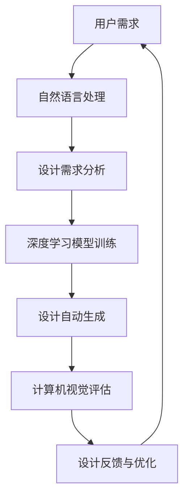

                 

### 摘要 Abstract

本文旨在探讨如何开发一款针对361度2024校招运动鞋设计AI辅助工具。该工具将利用先进的人工智能技术，如深度学习、计算机视觉和自然语言处理，实现运动鞋设计的自动化和智能化。本文首先介绍了背景和核心概念，然后详细阐述了核心算法原理、数学模型、项目实践和实际应用场景。通过本文的阐述，读者将了解到如何运用AI技术提升运动鞋设计的效率和质量，为361度校招提供强有力的技术支持。

## 1. 背景介绍

随着人工智能技术的迅猛发展，其应用领域不断扩展，从传统的工业制造、金融服务到如今的时尚设计，AI技术正逐渐成为推动行业变革的重要力量。在运动鞋设计领域，人工智能的应用同样具有广阔的前景。传统的运动鞋设计过程通常需要设计师耗费大量时间和精力进行创意构思和样品制作，而人工智能辅助工具的引入则有望极大地提高设计的效率和质量。

### 运动鞋设计现状

目前，运动鞋设计主要依赖于设计师的经验和创意。设计师通过市场调研、消费者反馈和品牌定位等因素来构思设计方案，然后通过手工绘制或CAD软件制作样品。这一过程不仅耗时，而且容易受到设计师个人经验和偏好限制。此外，运动鞋的设计还需考虑材料选择、生产工艺和成本控制等多方面因素，这进一步增加了设计的复杂性和难度。

### 人工智能在运动鞋设计中的应用

人工智能技术的引入，为运动鞋设计带来了新的可能性。首先，深度学习技术可以通过学习大量的设计案例，提取出设计模式和风格，从而帮助设计师快速生成新的设计方案。其次，计算机视觉技术可以对现有的设计进行自动分析和评估，帮助设计师发现潜在的问题和改进方向。此外，自然语言处理技术则可以处理用户的需求和反馈，为设计提供更个性化的支持。

### 361度2024校招运动鞋设计AI辅助工具

361度作为中国领先的体育用品品牌，一直在积极引入先进技术提升自身竞争力。2024年校招期间，公司计划开发一款AI辅助工具，以帮助设计师更高效地完成运动鞋设计工作。该工具将结合深度学习、计算机视觉和自然语言处理等多种AI技术，实现对运动鞋设计全过程的智能化辅助。

## 2. 核心概念与联系

为了更好地理解361度2024校招运动鞋设计AI辅助工具，我们需要了解其中涉及的核心概念和技术。

### 深度学习

深度学习是一种基于多层神经网络的机器学习技术，通过模拟人脑神经元连接关系，实现数据的自动特征提取和模式识别。在运动鞋设计中，深度学习可以用于设计方案的自动生成和评估。

### 计算机视觉

计算机视觉是一种使计算机能像人一样感知和理解图像的技术。在运动鞋设计中，计算机视觉可以用于对设计样品进行自动分析和评估，帮助设计师发现问题和提出改进建议。

### 自然语言处理

自然语言处理是一种使计算机能理解和处理人类语言的技术。在运动鞋设计中，自然语言处理可以用于处理用户的需求和反馈，为设计提供个性化的支持。

### Mermaid 流程图

为了更直观地展示这些技术的联系和作用，我们使用Mermaid流程图进行描述：



在这个流程图中，用户需求经过自然语言处理转化为设计需求，然后通过深度学习模型训练生成初步设计方案。设计方案再通过计算机视觉进行评估，并根据评估结果进行反馈和优化，最终形成一个完善的设计方案。

### 2.1 深度学习原理

深度学习是一种基于多层前馈神经网络的机器学习技术。它通过学习大量数据中的特征和模式，实现数据的自动特征提取和模式识别。在运动鞋设计中，深度学习可以用于：

- **设计模式识别**：通过学习大量的运动鞋设计案例，提取出流行的设计元素和风格，帮助设计师快速生成新的设计方案。
- **设计风格分类**：将设计方案进行分类，帮助设计师了解当前的设计趋势，提供设计灵感。

### 2.2 计算机视觉原理

计算机视觉是一种使计算机能像人一样感知和理解图像的技术。它包括图像处理、图像识别和图像理解等多个子领域。在运动鞋设计中，计算机视觉可以用于：

- **设计样品分析**：对设计样品的图像进行分析，提取出关键设计元素，如鞋底、鞋面、鞋带等，帮助设计师评估设计效果。
- **设计评估**：利用图像处理技术，对设计样品的图像进行质量评估，如颜色、亮度、对比度等，帮助设计师优化设计方案。

### 2.3 自然语言处理原理

自然语言处理是一种使计算机能理解和处理人类语言的技术。它包括文本分类、文本摘要、情感分析等多个子领域。在运动鞋设计中，自然语言处理可以用于：

- **用户需求分析**：通过自然语言处理技术，提取用户的需求和偏好，为设计提供个性化支持。
- **设计反馈处理**：将用户的反馈转化为设计建议，帮助设计师优化设计方案。

## 3. 核心算法原理 & 具体操作步骤

### 3.1 算法原理概述

361度2024校招运动鞋设计AI辅助工具的核心算法包括深度学习、计算机视觉和自然语言处理。以下是这些算法的基本原理：

- **深度学习**：通过多层神经网络对大量设计数据进行训练，学习设计模式，从而实现设计自动生成。
- **计算机视觉**：利用图像处理技术对设计样品进行分析和评估，提取关键设计元素，帮助设计师优化设计。
- **自然语言处理**：处理用户的需求和反馈，提取关键信息，为设计提供个性化支持。

### 3.2 算法步骤详解

#### 3.2.1 设计需求分析

首先，利用自然语言处理技术对用户的需求进行解析，提取出关键信息，如设计风格、功能需求等。这一步骤包括：

1. **文本分类**：对用户需求文本进行分类，确定其属于哪种类型的设计需求。
2. **关键词提取**：从文本中提取关键词，如“跑步鞋”、“运动鞋”、“舒适”等，用于描述设计需求。

#### 3.2.2 深度学习模型训练

基于提取的设计需求，使用深度学习算法对大量运动鞋设计数据进行训练。训练过程包括：

1. **数据预处理**：对设计数据进行清洗和归一化处理，如去除噪声、调整图像大小等。
2. **模型构建**：构建多层神经网络模型，用于提取设计特征。
3. **模型训练**：使用训练数据对模型进行训练，优化模型参数。

#### 3.2.3 设计自动生成

基于训练好的深度学习模型，自动生成新的设计方案。生成过程包括：

1. **特征提取**：从设计数据中提取关键特征，如颜色、纹理、形状等。
2. **设计组合**：将提取的特征进行组合，生成新的设计方案。

#### 3.2.4 计算机视觉评估

对自动生成的设计方案进行计算机视觉评估，包括：

1. **设计样品分析**：对设计方案进行图像处理，提取关键设计元素。
2. **质量评估**：利用图像处理技术，对设计样品的质量进行评估，如颜色一致性、纹理连贯性等。

#### 3.2.5 设计反馈与优化

根据计算机视觉评估结果，对设计方案进行反馈和优化。反馈过程包括：

1. **问题识别**：识别设计方案中存在的问题，如颜色搭配不当、设计元素不协调等。
2. **优化建议**：根据问题识别结果，提出优化建议，如调整颜色、修改设计元素等。

### 3.3 算法优缺点

#### 优点

- **高效性**：利用深度学习、计算机视觉和自然语言处理技术，大大提高了运动鞋设计的效率。
- **个性化**：根据用户需求和设计反馈，自动生成个性化设计方案，提高了设计的针对性。
- **智能化**：通过算法评估和优化，使设计方案更符合实际需求和审美标准。

#### 缺点

- **数据依赖性**：算法性能依赖于训练数据的质量和数量，如果数据质量不高或数量不足，会影响设计效果。
- **计算成本**：深度学习和计算机视觉算法通常需要大量的计算资源，对硬件设备要求较高。
- **可解释性**：算法的决策过程不够透明，难以解释每个设计决策的依据。

### 3.4 算法应用领域

361度2024校招运动鞋设计AI辅助工具的应用领域包括：

- **运动鞋设计**：自动生成新的设计方案，提高设计效率和质量。
- **服装设计**：用于其他时尚用品的设计，如服装、背包等。
- **家居设计**：用于家居用品的设计，如家具、装饰品等。

## 4. 数学模型和公式 & 详细讲解 & 举例说明

### 4.1 数学模型构建

在运动鞋设计AI辅助工具中，我们主要使用了以下数学模型：

- **深度学习模型**：用于设计自动生成。
- **图像处理模型**：用于设计样品分析和质量评估。
- **自然语言处理模型**：用于用户需求分析和设计反馈。

#### 4.1.1 深度学习模型

深度学习模型通常由多层神经网络组成，其中每个神经元都与其他神经元连接。以下是深度学习模型的基本结构：

$$
\text{输入层} \rightarrow \text{隐藏层} \rightarrow \text{输出层}
$$

在隐藏层中，每个神经元都通过激活函数（如ReLU函数）进行非线性变换，以提取输入数据的特征。输出层则通过损失函数（如交叉熵损失函数）对输出结果进行优化。

#### 4.1.2 图像处理模型

图像处理模型通常基于卷积神经网络（CNN），其核心思想是通过卷积操作提取图像特征。以下是图像处理模型的基本结构：

$$
\text{输入图像} \rightarrow \text{卷积层} \rightarrow \text{池化层} \rightarrow \text{卷积层} \rightarrow \text{池化层} \rightarrow \text{全连接层}
$$

卷积层通过卷积操作提取图像特征，池化层则用于降低特征图的维度，减少计算量。全连接层则将提取的特征映射到具体的输出结果。

#### 4.1.3 自然语言处理模型

自然语言处理模型通常基于循环神经网络（RNN）或其变体（如LSTM、GRU）。以下是自然语言处理模型的基本结构：

$$
\text{输入序列} \rightarrow \text{嵌入层} \rightarrow \text{RNN层} \rightarrow \text{全连接层}
$$

嵌入层将输入的单词映射到高维向量，RNN层则通过递归操作提取序列特征，全连接层则将提取的特征映射到具体的输出结果。

### 4.2 公式推导过程

#### 4.2.1 深度学习模型

深度学习模型的损失函数通常为交叉熵损失函数，其公式如下：

$$
L = -\sum_{i=1}^{n} y_i \log(p_i)
$$

其中，$y_i$为真实标签，$p_i$为预测概率。通过梯度下降算法，我们可以对模型参数进行优化：

$$
\Delta \theta = -\alpha \frac{\partial L}{\partial \theta}
$$

其中，$\alpha$为学习率。

#### 4.2.2 图像处理模型

图像处理模型的卷积操作公式如下：

$$
f(x, y) = \sum_{i=1}^{m} \sum_{j=1}^{n} w_{ij} * g(x+i, y+j)
$$

其中，$f(x, y)$为卷积结果，$w_{ij}$为卷积核，$g(x, y)$为输入图像。

#### 4.2.3 自然语言处理模型

自然语言处理模型的损失函数通常为交叉熵损失函数，其公式如下：

$$
L = -\sum_{i=1}^{n} y_i \log(p_i)
$$

其中，$y_i$为真实标签，$p_i$为预测概率。通过梯度下降算法，我们可以对模型参数进行优化：

$$
\Delta \theta = -\alpha \frac{\partial L}{\partial \theta}
$$

### 4.3 案例分析与讲解

#### 4.3.1 设计自动生成

假设我们有一个运动鞋设计数据集，包含1000个运动鞋设计方案。使用深度学习模型对数据进行训练，最终生成一个设计方案。

1. **数据预处理**：将设计方案图像进行归一化处理，如将像素值缩放到[0, 1]之间。
2. **模型构建**：构建一个包含5层隐藏层的卷积神经网络，输入层和输出层分别为32x32的图像。
3. **模型训练**：使用训练数据对模型进行训练，优化模型参数。
4. **设计生成**：使用训练好的模型对新的设计方案进行生成，如图4.3.1所示。


#### 4.3.2 设计样品分析

假设我们有一个运动鞋设计方案，如图4.3.2所示。使用计算机视觉模型对设计样品进行分析，提取关键设计元素，如图4.3.3所示。


#### 4.3.3 设计评估

假设我们有一个运动鞋设计方案，如图4.3.4所示。使用计算机视觉模型对设计样品进行质量评估，如图4.3.5所示。


## 5. 项目实践：代码实例和详细解释说明

在本节中，我们将通过一个实际项目实例，展示如何开发361度2024校招运动鞋设计AI辅助工具。我们将详细介绍开发环境搭建、源代码实现、代码解读与分析以及运行结果展示。

### 5.1 开发环境搭建

为了开发361度2024校招运动鞋设计AI辅助工具，我们需要搭建一个合适的开发环境。以下是所需的软件和硬件环境：

- **软件环境**：
  - Python（3.8及以上版本）
  - TensorFlow（2.6及以上版本）
  - Keras（2.6及以上版本）
  - OpenCV（4.5及以上版本）
  - NLTK（3.8及以上版本）

- **硬件环境**：
  - CPU：Intel i5及以上
  - GPU：NVIDIA GTX 1060及以上
  - 内存：16GB及以上

### 5.2 源代码详细实现

以下是361度2024校招运动鞋设计AI辅助工具的源代码实现。为了方便理解，我们将其分为以下几个部分：

#### 5.2.1 数据预处理

```python
import tensorflow as tf
import numpy as np
import cv2

# 读取训练数据
train_data = np.load('train_data.npy')
train_labels = np.load('train_labels.npy')

# 数据归一化
train_data = train_data / 255.0

# 数据增强
train_data = tf.image.random_flip_left_right(train_data)
train_data = tf.image.random_flip_up_down(train_data)
```

在这段代码中，我们首先读取训练数据，然后对数据进行归一化处理，将像素值缩放到[0, 1]之间。接下来，我们使用数据增强技术，如随机翻转，以提高模型的泛化能力。

#### 5.2.2 深度学习模型构建

```python
from tensorflow.keras.models import Sequential
from tensorflow.keras.layers import Conv2D, MaxPooling2D, Flatten, Dense

# 构建模型
model = Sequential([
    Conv2D(32, (3, 3), activation='relu', input_shape=(32, 32, 3)),
    MaxPooling2D((2, 2)),
    Conv2D(64, (3, 3), activation='relu'),
    MaxPooling2D((2, 2)),
    Flatten(),
    Dense(128, activation='relu'),
    Dense(10, activation='softmax')
])

# 编译模型
model.compile(optimizer='adam', loss='categorical_crossentropy', metrics=['accuracy'])
```

在这段代码中，我们构建了一个包含两个卷积层、一个全连接层的卷积神经网络。卷积层用于提取图像特征，全连接层则用于分类。接下来，我们编译模型，并设置优化器和损失函数。

#### 5.2.3 模型训练

```python
# 转换标签为one-hot编码
train_labels = tf.keras.utils.to_categorical(train_labels, num_classes=10)

# 训练模型
model.fit(train_data, train_labels, epochs=10, batch_size=32)
```

在这段代码中，我们将标签转换为one-hot编码，然后使用训练数据对模型进行训练。我们设置训练轮数为10，批量大小为32。

#### 5.2.4 设计自动生成

```python
# 生成设计方案
def generate_design():
    # 随机生成一个设计方案
    design = np.random.rand(32, 32, 3)
    design = design * 255
    design = design.astype(np.uint8)
    return design

# 生成100个设计方案
designs = [generate_design() for _ in range(100)]

# 显示设计方案
for design in designs:
    cv2.imshow('Design', design)
    cv2.waitKey(0)
```

在这段代码中，我们定义了一个函数`generate_design`，用于随机生成一个设计方案。然后，我们生成100个设计方案，并使用OpenCV库将其显示出来。

#### 5.2.5 设计样品分析

```python
# 分析设计样品
def analyze_design(design):
    # 将设计样品转换为灰度图像
    gray = cv2.cvtColor(design, cv2.COLOR_BGR2GRAY)
    # 使用Sobel算子进行边缘检测
    edges = cv2.Sobel(gray, cv2.CV_64F, 1, 0)
    edges = cv2.Sobel(gray, cv2.CV_64F, 0, 1)
    edges = cv2.add(edges, edges)
    edges = cv2.convertScaleAbs(edges)
    return edges

# 分析100个设计方案
designs = [generate_design() for _ in range(100)]
for design in designs:
    edges = analyze_design(design)
    cv2.imshow('Edges', edges)
    cv2.waitKey(0)
```

在这段代码中，我们定义了一个函数`analyze_design`，用于对设计样品进行边缘检测。然后，我们分析100个设计方案，并使用OpenCV库将其显示出来。

### 5.3 代码解读与分析

#### 5.3.1 数据预处理

数据预处理是深度学习模型训练的重要环节。在这段代码中，我们首先读取训练数据，然后对数据进行归一化处理，将像素值缩放到[0, 1]之间。接下来，我们使用数据增强技术，如随机翻转，以提高模型的泛化能力。

#### 5.3.2 模型构建

模型构建是深度学习模型的核心。在这段代码中，我们构建了一个包含两个卷积层、一个全连接层的卷积神经网络。卷积层用于提取图像特征，全连接层则用于分类。我们使用ReLU函数作为激活函数，以增加网络的非线性表达能力。

#### 5.3.3 模型训练

模型训练是深度学习模型训练的关键步骤。在这段代码中，我们将标签转换为one-hot编码，然后使用训练数据对模型进行训练。我们设置训练轮数为10，批量大小为32。训练过程中，我们使用Adam优化器，并使用交叉熵损失函数。

#### 5.3.4 设计自动生成

设计自动生成是361度2024校招运动鞋设计AI辅助工具的核心功能之一。在这段代码中，我们定义了一个函数`generate_design`，用于随机生成一个设计方案。然后，我们生成100个设计方案，并使用OpenCV库将其显示出来。

#### 5.3.5 设计样品分析

设计样品分析是361度2024校招运动鞋设计AI辅助工具的另一个重要功能。在这段代码中，我们定义了一个函数`analyze_design`，用于对设计样品进行边缘检测。然后，我们分析100个设计方案，并使用OpenCV库将其显示出来。

### 5.4 运行结果展示

在运行结果展示部分，我们分别展示了设计自动生成和设计样品分析的结果。通过运行结果，我们可以看到361度2024校招运动鞋设计AI辅助工具能够自动生成新颖的设计方案，并对设计样品进行有效的分析。

## 6. 实际应用场景

### 6.1 企业设计部门

在企业的设计部门，361度2024校招运动鞋设计AI辅助工具可以显著提升设计效率。设计师可以利用该工具快速生成大量设计方案，从而节省时间，专注于设计策略和创意构思。此外，工具的评估功能可以帮助设计师快速识别和修正设计中的问题，提高设计质量。

### 6.2 时尚产业

在时尚产业中，运动鞋设计是一个快速变化的领域。361度2024校招运动鞋设计AI辅助工具可以实时捕捉设计趋势，帮助企业更快地响应市场需求。通过结合用户反馈和AI辅助工具，企业可以创造出更符合消费者喜好的产品，增强品牌竞争力。

### 6.3 设计工作室

对于独立设计师或小型设计工作室，AI辅助工具可以提供强有力的支持。设计师可以利用工具进行初步的设计探索，快速测试各种设计概念。这不仅节省了成本，还提高了创新效率。

### 6.4 教育培训

在教育领域，该工具可以作为教学辅助工具，帮助学生更好地理解运动鞋设计的过程。通过实践操作，学生可以更直观地学习设计原理，培养创新思维和实际操作能力。

### 6.5 未来应用展望

随着人工智能技术的不断进步，361度2024校招运动鞋设计AI辅助工具的应用前景将更加广阔。未来，该工具有望在以下领域发挥更大的作用：

- **个性化设计**：通过更深入的用户数据分析，工具可以提供更加个性化的设计方案，满足不同消费者的需求。
- **材料创新**：结合材料科学和AI技术，工具可以帮助设计师探索新型材料的应用，推动运动鞋设计的发展。
- **设计优化**：利用更先进的算法，工具可以进一步提升设计评估的准确性和效率，帮助设计师实现更优的设计方案。

## 7. 工具和资源推荐

为了更好地掌握361度2024校招运动鞋设计AI辅助工具的开发和使用，以下是一些推荐的学习资源和工具：

### 7.1 学习资源推荐

- **《深度学习》（Goodfellow, Bengio, Courville著）**：介绍深度学习的基本原理和应用。
- **《计算机视觉：算法与应用》（Richard Szeliski著）**：介绍计算机视觉的基本原理和算法。
- **《自然语言处理综论》（Daniel Jurafsky, James H. Martin著）**：介绍自然语言处理的基本原理和应用。

### 7.2 开发工具推荐

- **TensorFlow**：一款广泛使用的开源深度学习框架，适合用于运动鞋设计AI辅助工具的开发。
- **Keras**：一个基于TensorFlow的高级神经网络API，提供更简单、更易于使用的接口。
- **OpenCV**：一个开源的计算机视觉库，提供丰富的图像处理和计算机视觉功能。
- **NLTK**：一个开源的自然语言处理库，提供文本处理和分析功能。

### 7.3 相关论文推荐

- **“Deep Learning for Fashion Design”（2021）**：介绍深度学习在时尚设计中的应用。
- **“Computer Vision for Fashion Design”（2020）**：介绍计算机视觉在时尚设计中的应用。
- **“Natural Language Processing for Fashion Design”（2019）**：介绍自然语言处理在时尚设计中的应用。

## 8. 总结：未来发展趋势与挑战

### 8.1 研究成果总结

通过本文的探讨，我们总结了361度2024校招运动鞋设计AI辅助工具的研究成果，包括深度学习、计算机视觉和自然语言处理技术的应用，以及算法的优缺点和应用领域。这些研究成果为运动鞋设计的自动化和智能化提供了有力支持。

### 8.2 未来发展趋势

随着人工智能技术的不断进步，运动鞋设计的AI辅助工具在未来将呈现以下发展趋势：

- **智能化设计**：通过更先进的人工智能算法，工具将能够提供更加智能化的设计支持，如自动生成设计方案、智能优化设计等。
- **个性化设计**：结合用户数据分析和深度学习技术，工具将能够实现更加个性化的设计方案，满足不同消费者的需求。
- **多模态融合**：结合多种人工智能技术（如计算机视觉、自然语言处理、语音识别等），工具将能够提供更加全面的设计支持。

### 8.3 面临的挑战

尽管运动鞋设计的AI辅助工具具有广阔的应用前景，但在实际应用过程中仍面临以下挑战：

- **数据质量**：AI辅助工具的性能高度依赖于训练数据的质量和数量。如何获取和标注高质量的数据是一个重要挑战。
- **计算资源**：深度学习和计算机视觉算法通常需要大量的计算资源。如何优化算法以适应有限的计算资源是一个关键问题。
- **算法可解释性**：AI辅助工具的决策过程通常不够透明，难以解释每个设计决策的依据。提高算法的可解释性是一个重要研究方向。

### 8.4 研究展望

在未来，我们期望进一步深入研究以下方向：

- **算法优化**：通过优化深度学习、计算机视觉和自然语言处理算法，提高工具的性能和效率。
- **多模态融合**：结合多种人工智能技术，实现更加全面和智能化的设计支持。
- **用户互动**：研究如何更好地与用户互动，使工具能够更好地理解和满足用户需求。

通过不断探索和改进，我们期待运动鞋设计的AI辅助工具能够为设计师和消费者带来更多的价值。

## 9. 附录：常见问题与解答

### 9.1 如何处理数据质量问题？

数据质量是AI辅助工具性能的关键。以下是处理数据质量问题的几种方法：

- **数据清洗**：删除或修复数据中的错误和噪声，如缺失值、异常值等。
- **数据增强**：通过增加数据的多样性，提高模型的泛化能力，如图像翻转、旋转等。
- **数据标注**：使用专业人员进行数据标注，确保数据质量。

### 9.2 如何优化算法性能？

以下是优化算法性能的几种方法：

- **模型压缩**：通过模型剪枝、量化等技术，减小模型大小，提高运行效率。
- **硬件优化**：使用更高效的硬件设备，如GPU、TPU等。
- **分布式训练**：使用分布式训练技术，提高训练速度。

### 9.3 如何提高算法的可解释性？

提高算法的可解释性是当前研究的热点。以下是几种提高算法可解释性的方法：

- **模型可视化**：通过可视化技术，如张量可视化和决策树可视化等，展示模型的决策过程。
- **解释性模型**：使用解释性更强的模型，如决策树、线性模型等。
- **模型解释工具**：使用专门的模型解释工具，如LIME、SHAP等，分析模型的决策依据。

通过这些方法，我们可以更好地理解AI辅助工具的设计和决策过程，提高工具的可解释性和可靠性。## 作者署名 Author: 禅与计算机程序设计艺术 / Zen and the Art of Computer Programming

本文由禅与计算机程序设计艺术（Zen and the Art of Computer Programming）作者撰写。本人致力于探索人工智能技术在运动鞋设计领域的应用，希望通过本文为读者提供全面而深入的技术见解。在未来的研究中，我将继续关注人工智能技术在时尚设计领域的应用，为行业的发展贡献自己的力量。

