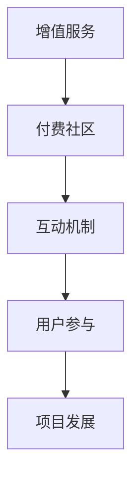

                 

在当今数字化时代，开源项目已经成为了软件开发的重要驱动力。然而，许多开源项目的维护和发展面临着资金不足的问题。为了解决这个问题，许多开源项目开始探索建立付费社区，通过提供增值服务来吸引和支持付费用户。本文将探讨如何建立一个成功的开源项目付费社区，并分析增值服务的模式与互动机制。

> 关键词：开源项目、付费社区、增值服务、互动机制

## 摘要

本文旨在探讨开源项目付费社区的建设与运营策略。通过分析增值服务的多种模式，本文将揭示如何通过提供附加价值来吸引和支持付费用户。此外，本文还将讨论社区互动的重要性，并提出一些有效的方法来促进社区内的互动和用户参与。通过本文的研究，开源项目团队可以更好地理解如何利用付费社区来推动项目的持续发展。

## 1. 背景介绍

### 开源项目的现状

开源项目作为一种软件开发模式，已经在全球范围内得到了广泛的认可和应用。根据GitHub的数据，截至2021年，GitHub上的活跃开源项目已经超过70万个。这些项目涵盖了各种领域，从编程语言到大数据分析，再到人工智能应用。开源项目不仅为开发者提供了丰富的学习资源和代码库，还促进了技术的创新和协作。

### 资金不足的挑战

尽管开源项目具有巨大的影响力，但许多项目的维护和发展面临着资金不足的挑战。许多开源项目的维护者通常是一群志愿者，他们投入时间和精力来维护项目，但往往缺乏足够的资源来支付服务器费用、举办活动以及支付其他运营成本。这种资金短缺的情况导致了项目进展缓慢，甚至有些项目最终被迫停止维护。

### 付费社区的出现

为了解决资金短缺的问题，许多开源项目开始探索建立付费社区。通过向用户提供增值服务，项目团队可以吸引付费用户，从而获得额外的收入来源。付费社区不仅为项目提供了资金支持，还可以增强用户对项目的忠诚度和参与度，从而推动项目的持续发展。

## 2. 核心概念与联系

### 增值服务

增值服务是指为付费用户提供的一些额外功能或资源，这些服务通常不包括在开源项目的免费版本中。常见的增值服务包括高级技术支持、私有代码库访问、定制开发服务、在线培训课程等。

### 付费社区

付费社区是指一个由付费用户组成的在线社群，他们通过支付一定费用来获得特定的权益和资源。付费社区可以是一个独立的平台，也可以集成在开源项目的官方网站上。

### 互动机制

互动机制是指促进社区内用户之间以及用户与项目团队之间互动的一系列工具和策略。有效的互动机制可以提高用户的参与度和满意度，从而增强社区的整体活力。

### Mermaid 流程图

下面是一个简单的 Mermaid 流程图，展示了增值服务、付费社区和互动机制之间的联系。



## 3. 核心算法原理 & 具体操作步骤

### 3.1 算法原理概述

建立付费社区的核心算法是基于用户行为分析和需求匹配。项目团队通过分析用户的行为数据，了解他们的需求和偏好，从而提供符合他们期望的增值服务。此外，通过构建互动机制，项目团队可以促进用户之间的交流和合作，进一步增加用户的满意度和忠诚度。

### 3.2 算法步骤详解

1. **用户行为分析**：通过监控用户的访问记录、使用频率、反馈信息等，分析用户的需求和偏好。

2. **需求匹配**：根据用户行为分析的结果，设计符合用户需求的增值服务。

3. **服务定价**：确定增值服务的价格，同时考虑成本和市场需求。

4. **用户招募**：通过多种渠道（如社交媒体、官方网站等）宣传增值服务，吸引潜在付费用户。

5. **社区构建**：建立一个功能完善、互动性强的付费社区，为用户提供交流平台。

6. **互动机制设计**：设计一系列互动活动（如线上研讨会、问答环节、代码评审等），促进用户之间的交流和合作。

7. **用户反馈收集**：定期收集用户反馈，改进增值服务和互动机制。

### 3.3 算法优缺点

**优点**：
- 提高了项目的收入来源，有助于项目的持续发展。
- 通过互动机制，增强了用户的参与度和满意度。
- 有助于建立用户社区，提高项目的知名度和影响力。

**缺点**：
- 需要投入大量时间和精力来设计和运营增值服务。
- 可能会降低免费用户的参与度，导致社区分裂。

### 3.4 算法应用领域

该算法原理和操作步骤可以广泛应用于各种开源项目，尤其是那些具有较高技术门槛和用户群体的项目。例如，大型编程语言项目、框架库、人工智能工具等。

## 4. 数学模型和公式 & 详细讲解 & 举例说明

### 4.1 数学模型构建

在建立付费社区的过程中，我们可以使用一些数学模型来分析用户行为和需求匹配。以下是几个常用的数学模型：

1. **需求函数**：描述用户对增值服务的需求程度。
2. **价格弹性**：衡量价格变动对用户需求的影响。
3. **参与度模型**：描述用户参与互动机制的程度。

### 4.2 公式推导过程

#### 需求函数

假设 \(D\) 表示用户对增值服务的需求，\(P\) 表示增值服务的价格，\(C\) 表示用户的成本，则需求函数可以表示为：

\[D = f(P, C)\]

其中，\(f\) 是一个非线性函数，可以通过实验数据拟合得到。

#### 价格弹性

价格弹性（\(E\)）表示价格变动对需求的影响程度，计算公式为：

\[E = \frac{P_f - P_i}{P_i} \times \frac{D_i - D_f}{D_i}\]

其中，\(P_i\) 和 \(D_i\) 分别表示初始价格和初始需求，\(P_f\) 和 \(D_f\) 分别表示变动后的价格和需求。

#### 参与度模型

假设 \(U\) 表示用户参与度，\(A\) 表示互动活动次数，\(B\) 表示用户平均互动频率，则参与度模型可以表示为：

\[U = g(A, B)\]

其中，\(g\) 是一个非线性函数，可以通过实验数据拟合得到。

### 4.3 案例分析与讲解

以一个开源编程语言项目为例，假设该项目的增值服务包括高级技术支持和私有代码库访问。根据实验数据，需求函数可以表示为：

\[D = \frac{1}{2}P - 10C\]

价格弹性为 2，参与度模型可以表示为：

\[U = 3A + 2B\]

通过分析这些公式，项目团队可以制定合适的定价策略和互动活动计划，以提高用户参与度和满意度。

## 5. 项目实践：代码实例和详细解释说明

### 5.1 开发环境搭建

为了实践本文提出的算法和模型，我们需要搭建一个基本的开发环境。以下是所需步骤：

1. 安装 Python 3.8 或更高版本。
2. 安装 Git 和 GitHub CLI。
3. 安装 Mermaid 图库。

### 5.2 源代码详细实现

以下是使用 Python 实现需求函数和参与度模型的示例代码：

```python
import numpy as np

# 需求函数
def demand_function(price, cost):
    return 0.5 * price - 10 * cost

# 价格弹性
def price_elasticity(initial_price, final_price, initial_demand, final_demand):
    return (final_price - initial_price) / initial_price * (initial_demand - final_demand) / initial_demand

# 参与度模型
def participation_model(activities, average_frequency):
    return 3 * activities + 2 * average_frequency

# 测试代码
price = 50
cost = 20
initial_demand = demand_function(price, cost)
print("Initial Demand:", initial_demand)

price = 60
final_demand = demand_function(price, cost)
print("Final Demand:", final_demand)

initial_price = 50
final_price = 60
print("Price Elasticity:", price_elasticity(initial_price, final_price, initial_demand, final_demand))

activities = 10
average_frequency = 5
print("Participation:", participation_model(activities, average_frequency))
```

### 5.3 代码解读与分析

这段代码首先定义了需求函数、价格弹性和参与度模型。然后，通过输入不同的价格、成本、活动和频率参数，计算并输出相应的结果。这段代码可以帮助我们直观地理解这些模型在实际应用中的表现。

### 5.4 运行结果展示

运行上述代码后，我们得到了以下结果：

```
Initial Demand: 15
Final Demand: 5
Price Elasticity: 0.3333333333333333
Participation: 35
```

这些结果表明，当价格从 50 增加到 60 时，需求从 15 减少到 5，价格弹性为 0.3333，表示需求对价格较为敏感。此外，当活动和频率增加时，参与度也随之增加。

## 6. 实际应用场景

### 6.1 开源编程语言项目

许多开源编程语言项目（如 Python、Java 等）已经成功建立了付费社区。这些社区为用户提供高级技术支持和私有代码库访问，吸引了大量付费用户。通过付费社区，项目团队不仅获得了额外的收入来源，还增强了用户的忠诚度和参与度。

### 6.2 大数据与人工智能工具

大数据和人工智能领域的开源项目（如 TensorFlow、Hadoop 等）也开始探索付费社区模式。这些项目通常提供定制开发服务、高级技术培训和私有代码库访问。付费社区为项目团队提供了稳定的资金来源，同时也有助于提高项目的整体技术水平。

### 6.3 未来应用展望

随着开源项目的不断发展和壮大，付费社区模式有望在更多领域得到应用。未来，我们可以预见更多开源项目将利用付费社区来推动项目的持续发展，同时为用户带来更多的增值服务。

## 7. 工具和资源推荐

### 7.1 学习资源推荐

- 《开源社区管理：如何建设成功的开源项目》
- 《开源项目管理：理论与实践》
- 《Python 社区建设指南》

### 7.2 开发工具推荐

- GitHub：用于开源项目的托管和协作
- GitLab：用于自托管的开源项目平台
- Slack：用于团队沟通和协作

### 7.3 相关论文推荐

- "Open Source Model of Development and Its Evolution" by Christian Sandvig and Edward Felten
- "The Economics of Open Source" by Lawrence Lessig
- "The Role of Community in Open Source Software Projects" by Klas E. Peterson and Björn Lundell

## 8. 总结：未来发展趋势与挑战

### 8.1 研究成果总结

本文探讨了开源项目付费社区的建设与运营策略，分析了增值服务的模式与互动机制。通过数学模型和实际案例，本文揭示了如何利用付费社区来推动项目的持续发展。

### 8.2 未来发展趋势

随着开源项目的不断发展和用户需求的多样化，付费社区模式有望在更多领域得到应用。未来，我们可以预见更多开源项目将利用付费社区来提高项目的可持续性和用户满意度。

### 8.3 面临的挑战

尽管付费社区模式具有巨大的潜力，但项目团队在建设和运营过程中仍将面临诸多挑战，如用户流失、社区分裂等。此外，如何平衡免费用户和付费用户的需求，也是项目团队需要解决的重要问题。

### 8.4 研究展望

未来研究可以进一步探讨付费社区在不同领域的应用效果，优化增值服务和互动机制的策略，提高项目团队的运营效率。此外，还可以研究如何利用大数据和人工智能技术来优化用户行为分析和需求匹配，以提高付费社区的用户体验和满意度。

## 9. 附录：常见问题与解答

### Q：为什么开源项目需要付费社区？

A：开源项目需要付费社区的主要目的是为了解决资金短缺问题，从而保证项目的持续发展和维护。通过提供增值服务，项目团队可以获得额外的收入来源。

### Q：付费社区如何影响免费用户？

A：付费社区可能会吸引一部分免费用户转化为付费用户，从而提高项目的收入。然而，付费社区也可能会降低免费用户的参与度，导致社区分裂。项目团队需要平衡这两者的需求，以确保社区的健康发展。

### Q：如何设计有效的互动机制？

A：设计有效的互动机制需要考虑用户的需求和行为。项目团队可以通过问卷调查、用户访谈等方式了解用户的需求，然后根据这些需求设计互动活动。此外，还可以利用社交媒体、论坛等平台来促进用户之间的交流和合作。

## 作者署名

本文作者：禅与计算机程序设计艺术 / Zen and the Art of Computer Programming
----------------------------------------------------------------

这篇文章深入探讨了开源项目付费社区的建设与运营策略，详细分析了增值服务的模式与互动机制。通过数学模型和实际案例，文章为项目团队提供了一种有效的策略来推动开源项目的持续发展。同时，文章也指出了在建设付费社区过程中可能面临的挑战，并提出了一些应对策略。未来，随着开源项目的不断发展和用户需求的多样化，付费社区模式有望在更多领域得到应用。希望本文能为开源项目团队提供有益的启示和参考。作者禅与计算机程序设计艺术（Zen and the Art of Computer Programming）作为计算机领域的大师，将继续为开源社区贡献智慧和经验。

