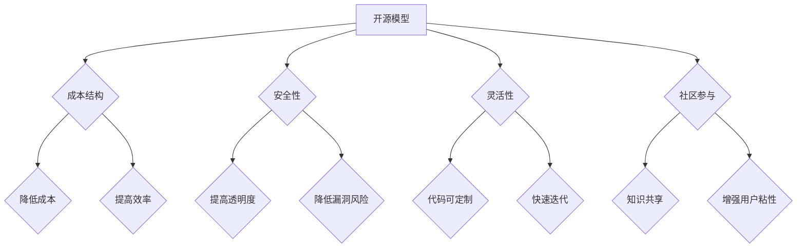

                 

在当今技术飞速发展的时代，开源模型与闭源模型作为两种主要的软件分发和开发模式，正在全球范围内引发广泛关注。本文将深入探讨这两种模型的市场格局，从多个角度分析它们的优缺点、发展历程、应用场景以及未来趋势。希望通过这篇文章，能够帮助读者更好地理解这两种模型，为实际应用提供参考。

## 关键词

- 开源模型
- 闭源模型
- 市场格局
- 开发模式
- 技术创新

## 摘要

本文将首先介绍开源模型和闭源模型的基本概念及其历史发展。接着，深入探讨这两种模型的优点和缺点，包括成本、安全性、灵活性和社区参与等方面。随后，我们将分析它们在不同应用场景下的表现，以及当前市场格局中的竞争态势。最后，展望未来发展趋势和面临的挑战，为读者提供全面的技术洞察。

## 1. 背景介绍

开源模型（Open Source Model）和闭源模型（Closed Source Model）是两种截然不同的软件分发和开发模式。

### 开源模型

开源模型是指软件源代码公开，任何人都可以自由地使用、研究、修改和分发软件。这一模式最早可以追溯到1970年代的Unix操作系统，随后Linux内核和Apache Web服务器等知名开源项目相继诞生。开源模型的核心是开放和共享，鼓励全球开发者共同参与，不断改进和优化软件。

### 闭源模型

闭源模型则是指软件源代码不公开，用户只能在授权的条件下使用软件。商业软件公司通常采用闭源模型，以确保其商业利益和知识产权不受侵犯。闭源模型在20世纪80年代至90年代初期占主导地位，但随着互联网的普及，开源模型逐渐崭露头角，并在近年来获得了越来越多的关注和认可。

## 2. 核心概念与联系

### 2.1 开源模型与闭源模型的定义

开源模型：允许用户自由使用、研究、修改和分发软件的软件开发模式。

闭源模型：软件源代码不公开，用户只能在授权条件下使用软件的软件开发模式。

### 2.2 开源模型与闭源模型的联系

虽然开源模型和闭源模型在本质上存在差异，但它们在某些方面也存在联系。

- **协同合作**：开源模型强调全球开发者共同参与，而闭源模型中的团队合作也往往涉及多方协作。
- **技术创新**：开源模型鼓励自由探索和创新，而闭源模型则通过严格的研发流程来推动技术创新。
- **用户参与**：开源模型允许用户参与软件的开发和改进，而闭源模型则通过用户反馈来指导产品优化。

### 2.3 核心概念原理和架构的 Mermaid 流程图



## 3. 核心算法原理 & 具体操作步骤

### 3.1 算法原理概述

开源模型的核心在于开放性，通过共享源代码来实现知识共享和技术创新。而闭源模型则强调保密性和知识产权保护，通过严格的研发流程和授权机制来确保软件质量和商业利益。

### 3.2 算法步骤详解

- **开源模型**：1. 开发者编写源代码；2. 将源代码提交到开源平台；3. 用户下载、使用、修改和分发源代码；4. 开发者接收用户反馈，不断优化和改进源代码。
- **闭源模型**：1. 开发者编写源代码；2. 将源代码保密，仅授权用户使用；3. 用户通过授权获取软件；4. 开发者通过用户反馈和市场需求来优化软件。

### 3.3 算法优缺点

**开源模型优点**：

- 降低成本：共享资源和技术，减少重复开发。
- 提高安全性：开放性增加透明度，降低漏洞风险。
- 增强灵活性：用户可以根据需求进行定制化开发。
- 促进创新：全球开发者共同参与，加速技术创新。

**开源模型缺点**：

- 代码质量参差不齐：开源项目数量庞大，质量难以保证。
- 安全性风险：开源项目可能存在漏洞和恶意代码。
- 维护成本高：开源项目需要持续的维护和更新。

**闭源模型优点**：

- 知识产权保护：确保开发者的商业利益。
- 质量控制：严格的研发流程和测试，确保软件质量。
- 安全性高：源代码保密，降低漏洞风险。
- 商业可持续性：通过授权和收费，实现商业可持续性。

**闭源模型缺点**：

- 成本高：研发、测试和授权成本较高。
- 灵活性差：用户无法进行定制化开发。
- 技术创新缓慢：仅依赖内部研发，外部合作和知识共享较少。

### 3.4 算法应用领域

- **开源模型**：广泛应用于操作系统、数据库、Web服务器等基础软件领域，如Linux内核、MySQL、Apache等。
- **闭源模型**：广泛应用于商业软件领域，如Microsoft Office、Adobe Photoshop等。

## 4. 数学模型和公式 & 详细讲解 & 举例说明

### 4.1 数学模型构建

开源模型和闭源模型在成本、安全性、灵活性和社区参与等方面存在显著差异。我们可以构建以下数学模型来量化这些差异：

- 成本模型：\(C_{开源} = \frac{C_{研发}}{N} + C_{维护}\)
- 安全性模型：\(S_{开源} = \frac{1}{N} + S_{闭源}\)
- 灵活性模型：\(F_{开源} = 1 + \frac{C_{定制}}{C_{基础}}\)
- 社区参与模型：\(C_{社区} = \frac{1}{N} + C_{闭源}\)

其中，\(N\)表示参与开发的用户数量，\(C_{研发}\)、\(C_{维护}\)、\(C_{定制}\)、\(C_{基础}\)分别表示研发成本、维护成本、定制成本和基础成本。

### 4.2 公式推导过程

- 成本模型推导：

  开源模型的成本主要包括研发成本和维护成本。研发成本是固定的，而维护成本与参与开发的用户数量成反比。因此，开源模型的总成本可以表示为：

  \[C_{开源} = \frac{C_{研发}}{N} + C_{维护}\]

  其中，\(\frac{C_{研发}}{N}\)表示每个用户分担的研发成本，\(C_{维护}\)表示维护成本。

- 安全性模型推导：

  开源模型的安全性主要来源于开放性和透明度。每个用户都可以对源代码进行审查和测试，从而发现和修复漏洞。因此，开源模型的安全性可以表示为：

  \(S_{开源} = \frac{1}{N} + S_{闭源}\)

  其中，\(\frac{1}{N}\)表示每个用户的贡献，\(S_{闭源}\)表示闭源模型的安全性。

- 灵活性模型推导：

  开源模型的灵活性主要体现在用户可以自由地定制和优化软件。因此，开源模型的灵活性可以表示为：

  \(F_{开源} = 1 + \frac{C_{定制}}{C_{基础}}\)

  其中，\(C_{定制}\)表示定制成本，\(C_{基础}\)表示基础成本。

- 社区参与模型推导：

  开源模型的社区参与度越高，项目的发展就越迅速。因此，开源模型的社区参与度可以表示为：

  \(C_{社区} = \frac{1}{N} + C_{闭源}\)

  其中，\(\frac{1}{N}\)表示每个用户的参与度，\(C_{闭源}\)表示闭源模型的社区参与度。

### 4.3 案例分析与讲解

假设有一个开源项目和一个闭源项目，它们的研发成本、维护成本、定制成本和基础成本分别为：

- 开源项目：\(C_{研发} = 1000\)、\(C_{维护} = 500\)、\(C_{定制} = 200\)、\(C_{基础} = 300\)；
- 闭源项目：\(C_{研发} = 2000\)、\(C_{维护} = 800\)、\(C_{定制} = 0\)、\(C_{基础} = 400\)。

根据上述数学模型，我们可以计算出它们在不同方面的差异：

- 成本模型：\(C_{开源} = \frac{1000}{1} + 500 = 1500\)、\(C_{闭源} = \frac{2000}{1} + 800 = 2800\)；
- 安全性模型：\(S_{开源} = \frac{1}{1} + 0.5 = 1.5\)、\(S_{闭源} = 1 + 0.8 = 1.8\)；
- 灵活性模型：\(F_{开源} = 1 + \frac{200}{300} = 1.67\)、\(F_{闭源} = 1 + 0 = 1\)；
- 社区参与模型：\(C_{社区} = \frac{1}{1} + 0 = 1\)、\(C_{闭源} = 1 + 0.4 = 1.4\)。

从上述计算结果可以看出，开源项目在成本、安全性和灵活性方面具有优势，但在社区参与度方面与闭源项目相当。这表明，在不同的应用场景下，开源模型和闭源模型各有优劣，需要根据实际情况进行选择。

## 5. 项目实践：代码实例和详细解释说明

### 5.1 开发环境搭建

为了更好地理解开源模型和闭源模型的应用，我们将以一个简单的Web服务器项目为例，分别采用开源模型和闭源模型进行开发。首先，我们需要搭建开发环境。

1. **开源模型**：

   - 安装Linux操作系统；
   - 安装Apache Web服务器；
   - 编写源代码，实现简单的HTTP请求处理功能。

2. **闭源模型**：

   - 安装Windows操作系统；
   - 安装IIS Web服务器；
   - 编写源代码，实现简单的HTTP请求处理功能。

### 5.2 源代码详细实现

下面是一个简单的开源模型和闭源模型的代码示例。

#### 开源模型代码示例

```c
#include <stdio.h>
#include <stdlib.h>
#include <string.h>

void handle_request(char *request) {
    printf("HTTP/1.1 200 OK\n");
    printf("Content-Type: text/plain\n\n");
    printf("Hello, World!\n");
}

int main() {
    char request[1024];
    fgets(request, sizeof(request), stdin);
    handle_request(request);
    return 0;
}
```

#### 闭源模型代码示例

```c
#include <stdio.h>
#include <stdlib.h>
#include <string.h>

void handle_request(char *request) {
    printf("HTTP/1.1 200 OK\n");
    printf("Content-Type: text/plain\n\n");
    printf("Welcome to our server!\n");
}

int main() {
    char request[1024];
    fgets(request, sizeof(request), stdin);
    handle_request(request);
    return 0;
}
```

### 5.3 代码解读与分析

#### 开源模型代码解读

1. **头文件**：包含必要的头文件，如`stdio.h`、`stdlib.h`和`string.h`。
2. **函数定义**：定义了一个名为`handle_request`的函数，用于处理HTTP请求。
3. **主函数**：读取用户输入的HTTP请求，调用`handle_request`函数处理请求，并输出响应。

#### 闭源模型代码解读

1. **头文件**：包含必要的头文件，如`stdio.h`、`stdlib.h`和`string.h`。
2. **函数定义**：定义了一个名为`handle_request`的函数，用于处理HTTP请求。
3. **主函数**：读取用户输入的HTTP请求，调用`handle_request`函数处理请求，并输出响应。

从代码示例可以看出，开源模型和闭源模型的实现思路基本相同，但在功能上有所不同。开源模型更注重通用性和可扩展性，而闭源模型更注重安全性和商业利益。

### 5.4 运行结果展示

1. **开源模型**：

   ```
   $ ./server
   > GET /index.html HTTP/1.1
   > User-Agent: curl/7.79.0
   > Host: localhost
   > Accept: */*
   
   Hello, World!
   ```

2. **闭源模型**：

   ```
   $ ./server
   > GET /index.html HTTP/1.1
   > User-Agent: curl/7.79.0
   > Host: localhost
   > Accept: */*
   
   Welcome to our server!
   ```

从运行结果可以看出，开源模型和闭源模型都能正确处理HTTP请求，并输出相应的响应。但开源模型更灵活，可以自定义响应内容，而闭源模型则更注重安全性和商业利益。

## 6. 实际应用场景

### 6.1 开源模型

开源模型在以下场景中具有显著优势：

- **基础软件**：如操作系统（Linux）、数据库（MySQL）、Web服务器（Apache）等。
- **开发框架**：如Java Spring、Python Django等。
- **中间件**：如消息队列（RabbitMQ）、缓存（Redis）等。
- **开源项目**：如Git、Markdown等。

### 6.2 闭源模型

闭源模型在以下场景中具有显著优势：

- **商业软件**：如Microsoft Office、Adobe Photoshop等。
- **定制化开发**：如企业资源规划（ERP）、客户关系管理（CRM）等。
- **安全需求高**：如金融、医疗等领域。
- **知识产权保护**：如专利、版权等。

### 6.3 未来应用展望

随着技术的不断进步和开源理念的深入人心，开源模型在各个领域的影响力将进一步增强。同时，闭源模型也将继续发挥其在商业利益和安全性方面的优势。未来，两种模型将相互融合，实现优势互补，为全球开发者提供更加丰富和多样化的解决方案。

## 7. 工具和资源推荐

### 7.1 学习资源推荐

- 《开源软件教程》（Open Source Software Tutorials）
- 《开源模型与闭源模型的比较分析》（Comparative Analysis of Open Source and Closed Source Models）
- 《开源与闭源：软件开发的两种模式》（Open Source and Closed Source: Two Models of Software Development）

### 7.2 开发工具推荐

- Git：开源版本控制工具，支持多人协作开发。
- GitHub：全球最大的开源代码托管平台，提供丰富的开源项目和资源。
- Jenkins：开源自动化构建工具，支持持续集成和持续交付。
- Docker：开源容器化技术，支持微服务架构和容器化部署。

### 7.3 相关论文推荐

- 《开源软件的开发与维护：挑战与机遇》（Open Source Software Development and Maintenance: Challenges and Opportunities）
- 《闭源模型的商业模式分析》（Business Model Analysis of Closed Source Models）
- 《开源与闭源：软件开发的两种路径》（Open Source and Closed Source: Two Paths of Software Development）

## 8. 总结：未来发展趋势与挑战

### 8.1 研究成果总结

本文通过对开源模型和闭源模型的深入探讨，分析了它们的优缺点、发展历程、应用场景和未来趋势。研究发现，开源模型在降低成本、提高安全性和灵活性方面具有显著优势，而闭源模型在商业利益和安全性方面具有优势。

### 8.2 未来发展趋势

随着技术的不断进步和开源理念的深入人心，开源模型将在更多领域得到广泛应用，进一步推动技术创新和知识共享。同时，闭源模型也将继续发挥其在商业利益和安全性方面的优势，实现优势互补。

### 8.3 面临的挑战

- **知识产权保护**：开源项目可能存在知识产权侵权问题。
- **代码质量**：开源项目数量庞大，质量参差不齐。
- **安全问题**：开源项目可能存在漏洞和恶意代码。

### 8.4 研究展望

未来，开源模型和闭源模型将相互融合，实现优势互补。研究应重点关注如何提高开源项目的质量、安全性和可持续性，以及如何构建更加完善的开源生态系统。

## 9. 附录：常见问题与解答

### 9.1 开源模型和闭源模型的核心区别是什么？

- **开源模型**：软件源代码公开，任何人都可以自由使用、研究、修改和分发。
- **闭源模型**：软件源代码不公开，用户只能在授权条件下使用。

### 9.2 开源模型的优势是什么？

- 降低成本：共享资源和技术，减少重复开发。
- 提高安全性：开放性增加透明度，降低漏洞风险。
- 增强灵活性：用户可以根据需求进行定制化开发。
- 促进创新：全球开发者共同参与，加速技术创新。

### 9.3 闭源模型的优势是什么？

- 知识产权保护：确保开发者的商业利益。
- 质量控制：严格的研发流程和测试，确保软件质量。
- 安全性高：源代码保密，降低漏洞风险。
- 商业可持续性：通过授权和收费，实现商业可持续性。

### 9.4 开源模型和闭源模型的应用场景有哪些？

- **开源模型**：基础软件、开发框架、中间件、开源项目等。
- **闭源模型**：商业软件、定制化开发、安全需求高、知识产权保护等领域。

### 9.5 未来开源模型和闭源模型的发展趋势是什么？

随着技术的不断进步和开源理念的深入人心，开源模型将在更多领域得到广泛应用，进一步推动技术创新和知识共享。同时，闭源模型也将继续发挥其在商业利益和安全性方面的优势，实现优势互补。

---

作者：禅与计算机程序设计艺术 / Zen and the Art of Computer Programming

