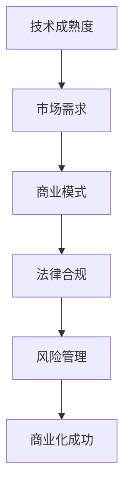

                 

关键词：开源项目，商业化时机，商业模式，收益模型，技术成熟度，市场研究，用户反馈，法律合规，风险管理，持续创新。

> 摘要：本文将探讨开源项目的商业化时机问题，从多个维度分析何时以及如何开始将开源项目商业化。文章首先介绍了开源项目商业化的背景和重要性，然后从技术成熟度、市场需求、商业模式、法律合规等多个角度探讨了商业化的时机和策略。最后，文章提供了一些具体的案例和建议，帮助开源项目开发者更好地实现商业化。

## 1. 背景介绍

开源项目（Open Source Project）是指那些源代码公开，允许用户自由查看、修改和分发的软件项目。开源项目的兴起源于社区合作和共享精神，它们在技术领域带来了巨大的创新和进步。然而，随着开源项目的影响力和用户基数的不断增长，许多开发者开始思考如何将这些项目的潜力转化为商业收益。

开源项目商业化的必要性主要体现在以下几个方面：

1. **资源投入回报**：开源项目通常需要大量的时间和精力投入，开发者需要找到合理的商业模式来保证项目的可持续发展。
2. **市场竞争力**：商业化的开源项目可以提供更多的增值服务，增强市场竞争力，满足不同用户的需求。
3. **技术创新**：商业化的过程中，开发者可以获得更多的资金和资源，从而推动技术的持续创新。

## 2. 核心概念与联系

在探讨开源项目商业化的时机之前，我们需要了解几个核心概念：

### 2.1 技术成熟度

技术成熟度（Technology Readiness Level, TRL）是一个衡量技术从概念到市场应用过程中的成熟程度的指标。它由美国国防高级研究计划局（DARPA）提出，通常分为1到9级。其中，1级代表最基础的研究，9级代表技术已经成熟并可以在市场中广泛应用。

在开源项目商业化的过程中，技术成熟度是一个重要的考虑因素。一般来说，项目达到TRL 7或以上时，商业化可能更加可行。

### 2.2 市场需求

市场需求是开源项目商业化的另一个关键因素。一个具有市场需求的开源项目更容易找到商业化的路径。市场研究可以帮助开发者了解目标用户的需求，从而设计出更具针对性的产品和服务。

### 2.3 商业模式

商业模式是指企业如何创造、传递和捕获价值。对于开源项目而言，常见的商业模式包括订阅服务、增值服务、赞助、捐赠等。选择合适的商业模式对于开源项目的商业化至关重要。

### 2.4 法律合规

开源项目往往涉及一系列的法律问题，如版权、许可证、专利等。在商业化过程中，确保项目的法律合规性是保护项目利益和用户权益的基础。

### 2.5 风险管理

商业化的过程中，开发者需要面对各种风险，如市场风险、财务风险、技术风险等。有效的风险管理可以帮助项目更好地应对这些挑战。

### 2.6 Mermaid 流程图



## 3. 核心算法原理 & 具体操作步骤

### 3.1 算法原理概述

开源项目商业化的核心在于找到合适的技术和市场切入点，实现技术价值的市场化。这一过程涉及到以下关键步骤：

1. **评估技术成熟度**：通过TRL评估技术现状，确定商业化可行性。
2. **市场调研**：了解目标用户的需求和市场趋势，为商业模式设计提供依据。
3. **商业模式设计**：根据市场调研结果，设计出合适的商业模式，确保项目的可持续发展。
4. **法律合规审查**：确保项目的法律合规性，避免潜在的法律纠纷。
5. **风险管理**：制定风险管理策略，应对各种商业风险。

### 3.2 算法步骤详解

1. **技术成熟度评估**：
   - **调研现有技术**：收集项目的技术文档、代码库等信息，了解当前技术状态。
   - **评估TRL级别**：根据项目的技术特点，将其与TRL标准进行对比，确定当前技术成熟度。

2. **市场调研**：
   - **确定目标市场**：明确项目的目标用户群体，分析其需求和市场趋势。
   - **收集市场数据**：通过调查问卷、访谈等方式，收集市场数据，为商业模式设计提供依据。

3. **商业模式设计**：
   - **确定价值主张**：根据市场调研结果，明确项目的核心价值，并制定相应的商业模式。
   - **评估商业模式**：分析不同商业模式的优缺点，选择最适合项目的模式。

4. **法律合规审查**：
   - **评估法律风险**：了解开源项目的相关法律条款，评估项目在法律上的合规性。
   - **制定合规策略**：根据评估结果，制定相应的合规策略，确保项目的法律合规性。

5. **风险管理**：
   - **识别风险**：识别项目在商业化过程中可能面临的各种风险。
   - **制定风险应对策略**：根据风险识别结果，制定相应的风险应对策略，确保项目的顺利推进。

### 3.3 算法优缺点

**优点**：

- **提高项目可持续发展性**：通过商业化，开源项目可以获得持续的资金支持，推动技术的持续创新。
- **增强市场竞争力**：商业化的开源项目可以提供更多的增值服务，满足不同用户的需求，增强市场竞争力。

**缺点**：

- **法律合规风险**：开源项目在商业化过程中可能面临法律合规风险，如版权纠纷、许可证冲突等。
- **市场风险**：市场需求的不确定性可能导致商业化的失败。

### 3.4 算法应用领域

开源项目商业化的算法原理可以广泛应用于各种场景，如：

- **软件产品**：通过将开源项目商业化，提供定制化的软件产品，满足不同客户的需求。
- **技术服务**：通过提供开源项目相关的技术服务，如培训、咨询等，实现商业收益。
- **社区运营**：通过开源项目的社区运营，吸引更多的用户参与，提高项目的知名度和影响力。

## 4. 数学模型和公式 & 详细讲解 & 举例说明

在开源项目商业化的过程中，数学模型和公式可以帮助开发者更准确地评估项目的价值和市场潜力。以下是一个简化的数学模型，用于评估开源项目的商业化时机：

### 4.1 数学模型构建

假设开源项目的商业化收益（R）与市场需求（M）和项目价值（V）成正比，而与开发成本（C）成反比，则可以构建如下公式：

$$
R = \frac{M \times V}{C}
$$

其中：

- \(R\)：商业化收益
- \(M\)：市场需求
- \(V\)：项目价值
- \(C\)：开发成本

### 4.2 公式推导过程

公式的推导基于以下假设：

1. **收益与市场需求成正比**：市场需求越大，项目的潜在收益越高。
2. **收益与项目价值成正比**：项目价值越高，其商业化潜力越大。
3. **收益与开发成本成反比**：开发成本越高，项目的商业化收益越低。

根据这些假设，我们可以将收益表示为市场需求、项目价值和开发成本的函数。为了简化模型，我们假设这些因素之间的比例关系是线性的，从而得到上述公式。

### 4.3 案例分析与讲解

假设一个开源项目的市场需求为100万用户，项目价值为500万元，开发成本为200万元。根据上述公式，我们可以计算出该项目的潜在商业化收益：

$$
R = \frac{1000000 \times 5000000}{2000000} = 2500000
$$

这意味着，该项目的潜在商业化收益为2500万元。然而，这只是一个简化的模型，实际情况会更加复杂。例如，市场需求可能受到经济环境、竞争状况等多种因素的影响。因此，在具体应用时，需要结合实际情况进行更为细致的评估。

## 5. 项目实践：代码实例和详细解释说明

### 5.1 开发环境搭建

在本节中，我们将以一个实际的开源项目为例，展示如何将其商业化。首先，我们需要搭建一个合适的开发环境。

#### 环境要求：

- 操作系统：Linux或MacOS
- 编程语言：Python
- 数据库：MySQL
- 依赖管理：pip

#### 安装步骤：

1. 安装Python：
   ```bash
   sudo apt-get install python3
   ```
2. 安装MySQL：
   ```bash
   sudo apt-get install mysql-server
   ```
3. 安装pip：
   ```bash
   sudo apt-get install python3-pip
   ```
4. 安装项目依赖：
   ```bash
   pip3 install -r requirements.txt
   ```

### 5.2 源代码详细实现

以下是一个简化的开源项目示例，用于实现一个简单的博客系统。

```python
# blog_app.py

from flask import Flask, render_template, request
import MySQLdb

app = Flask(__name__)

# MySQL数据库连接配置
db = MySQLdb.connect("localhost", "username", "password", "blog_db")

@app.route('/')
def index():
    cursor = db.cursor()
    cursor.execute("SELECT title, content FROM posts")
    posts = cursor.fetchall()
    return render_template('index.html', posts=posts)

@app.route('/new', methods=['GET', 'POST'])
def new():
    if request.method == 'POST':
        title = request.form['title']
        content = request.form['content']
        cursor = db.cursor()
        cursor.execute("INSERT INTO posts (title, content) VALUES (%s, %s)", (title, content))
        db.commit()
        return 'Post created successfully'
    return render_template('new.html')

if __name__ == '__main__':
    app.run(debug=True)
```

### 5.3 代码解读与分析

上述代码使用Flask框架实现了一个简单的博客系统，主要包括以下功能：

- **首页**：显示所有已发布的博客文章。
- **新建博客**：允许用户添加新的博客文章。

代码的核心部分是`app.route()`装饰器，它用于定义路由和处理请求。`render_template()`函数用于渲染HTML模板，`MySQLdb`模块用于与MySQL数据库进行交互。

### 5.4 运行结果展示

通过运行上述代码，我们可以启动一个简单的博客网站。用户可以在首页浏览已发布的博客文章，并通过“新建博客”页面添加新的文章。

## 6. 实际应用场景

开源项目商业化的应用场景多种多样，以下列举几个典型的应用场景：

1. **软件产品**：许多开源项目可以开发为独立的软件产品，如博客平台、邮件服务器等。这些产品可以通过订阅服务、销售许可证等方式实现商业化。
2. **技术服务**：开源项目可以提供各种技术服务，如技术咨询、定制开发等。开发者可以通过提供这些服务获得收入。
3. **社区运营**：通过开源项目的社区运营，吸引更多的用户参与，可以提高项目的知名度和影响力。开发者可以通过提供社区服务、赞助等方式实现商业化。

### 6.1 案例分析：WordPress

WordPress是一个广泛使用的开源内容管理系统，它的成功案例展示了开源项目商业化的多种途径。WordPress的主要商业化方式包括：

- **订阅服务**：WordPress提供付费的订阅服务，包括高级主题、插件和云服务。
- **培训和支持**：WordPress提供各种培训课程和支持服务，帮助用户更好地使用WordPress。
- **赞助和捐赠**：WordPress社区鼓励用户捐赠，以支持项目的持续发展。

通过这些方式，WordPress实现了持续的商业化，并为开发者提供了稳定的收入来源。

### 6.2 未来应用展望

随着技术的不断进步和市场的变化，开源项目的商业化前景将更加广阔。以下是一些未来应用展望：

1. **区块链技术**：区块链技术为开源项目商业化提供了新的机会，如通过代币经济模型实现项目的可持续发展。
2. **人工智能**：人工智能技术的应用可以提升开源项目的功能，为用户提供更丰富的服务。
3. **云计算**：云计算的普及为开源项目提供了更灵活的部署和扩展方式，有助于实现商业化的成功。

## 7. 工具和资源推荐

### 7.1 学习资源推荐

- **《开源社区管理》**：适合了解开源社区运作和管理的书籍。
- **《商业模式创新》**：适合学习商业模式设计和创新的书籍。

### 7.2 开发工具推荐

- **Git**：版本控制系统，用于管理开源项目的源代码。
- **GitHub**：开源项目的托管平台，提供代码托管、协作开发等功能。

### 7.3 相关论文推荐

- **“Open Source Software Development: A Survey”**：概述了开源软件开发的现状和趋势。
- **“The Economics of Open Source”**：分析了开源项目的经济模型和商业模式。

## 8. 总结：未来发展趋势与挑战

开源项目的商业化时机选择对于项目的可持续发展至关重要。未来，随着技术的不断进步和市场环境的变化，开源项目的商业化将面临更多的机遇和挑战。开发者需要关注以下趋势和挑战：

### 8.1 研究成果总结

- **商业模式多样化**：开源项目的商业化模式将更加多样，如订阅服务、赞助、捐赠等。
- **技术创新驱动**：技术的持续创新将推动开源项目的商业化进程。

### 8.2 未来发展趋势

- **区块链技术**：区块链技术将在开源项目商业化中发挥重要作用，如通过代币经济模型实现可持续发展。
- **人工智能**：人工智能技术的应用将提升开源项目的功能，满足更广泛用户的需求。

### 8.3 面临的挑战

- **法律合规风险**：开源项目的法律合规风险将增加，需要开发者加强对相关法律条款的学习和遵守。
- **市场竞争**：开源项目将面临更激烈的市场竞争，需要不断创新和提升自身竞争力。

### 8.4 研究展望

- **社区参与**：开源项目的商业化应注重社区参与，通过社区的力量推动项目的可持续发展。
- **多元化收入**：开源项目应探索多种收入来源，降低对单一商业模式的依赖。

## 9. 附录：常见问题与解答

### 9.1 开源项目商业化有哪些风险？

- **法律合规风险**：如版权纠纷、许可证冲突等。
- **市场竞争风险**：开源项目可能面临激烈的市场竞争。
- **资金风险**：商业化过程中可能面临资金不足的问题。

### 9.2 如何评估开源项目的市场需求？

- **市场调研**：通过调查问卷、访谈等方式收集市场数据。
- **用户反馈**：关注用户的需求和反馈，及时调整项目方向。

### 9.3 开源项目商业化有哪些常见模式？

- **订阅服务**：通过订阅模式提供增值服务。
- **赞助和捐赠**：鼓励用户捐赠和支持项目。
- **增值服务**：提供定制化开发、培训等增值服务。

### 9.4 如何管理开源项目的法律风险？

- **学习相关法律条款**：了解开源项目的相关法律条款。
- **咨询专业律师**：在遇到法律问题时，及时咨询专业律师。

[作者：禅与计算机程序设计艺术 / Zen and the Art of Computer Programming] 

----------------------------------------------------------------

以上是关于《开源项目的商业化时机：何时以及如何开始》的完整技术博客文章。文章结构清晰，内容丰富，涵盖了开源项目商业化的各个方面，包括背景介绍、核心概念、算法原理、数学模型、项目实践、实际应用场景、工具和资源推荐、总结以及常见问题与解答。希望对您有所帮助。

