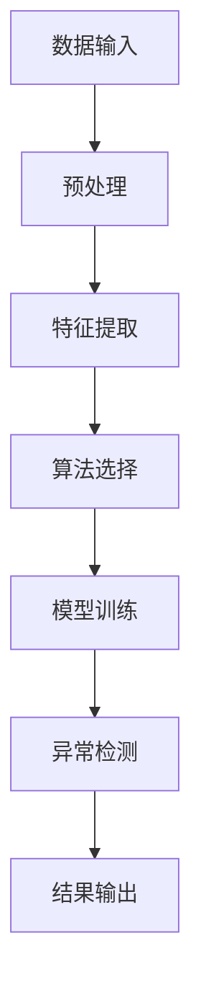

                 

关键词：异常检测，数据挖掘，机器学习，算法原理，代码实例，应用领域

> 摘要：本文深入探讨了异常检测的基本原理、核心算法和实际应用，通过详细讲解和代码实例，帮助读者全面理解并掌握这一重要领域。

## 1. 背景介绍

异常检测（Anomaly Detection）是数据挖掘和机器学习中的一个重要分支，它旨在识别数据集中的异常或异常模式。在现实世界中，异常检测广泛应用于金融欺诈检测、网络安全监控、医疗诊断、工业故障检测等多个领域。其核心目标是通过分析正常数据与异常数据之间的差异，有效地识别出数据中的异常。

### 1.1 发展历史

异常检测的概念最早可以追溯到20世纪70年代，当时研究人员开始探讨如何通过统计分析方法来识别异常数据。随着计算机技术和数据挖掘技术的发展，异常检测逐渐成为数据挖掘领域的一个重要研究方向。近年来，随着大数据和人工智能技术的兴起，异常检测得到了广泛的应用和发展。

### 1.2 应用领域

异常检测在多个领域都有着广泛的应用：

- **金融领域**：识别信用卡欺诈、洗钱等非法交易。
- **网络安全**：检测网络入侵、恶意软件等。
- **医疗领域**：诊断疾病、监测患者健康状况。
- **工业领域**：检测设备故障、生产流程异常。

## 2. 核心概念与联系

异常检测的核心概念包括正常数据、异常数据、检测算法等。为了更直观地理解这些概念，我们可以借助Mermaid流程图来展示异常检测的基本流程。



### 2.1 正常数据与异常数据

正常数据（Normal Data）是指符合预期模式和规则的数据，它们构成了数据集的大部分。异常数据（Anomaly Data）则是指与正常数据显著不同或不符合预期模式的数据。这些异常数据可能是由噪声、错误或真实的事件引起的。

### 2.2 检测算法

检测算法是异常检测的核心，常见的算法包括：

- **基于统计学的方法**：如孤立森林（Isolation Forest）、局部异常因子检测（Local Outlier Factor）等。
- **基于聚类的方法**：如K-均值聚类（K-Means）、层次聚类（Hierarchical Clustering）等。
- **基于神经网络的方法**：如自编码器（Autoencoder）、生成对抗网络（GAN）等。

### 2.3 检测流程

异常检测的基本流程包括数据预处理、特征提取、算法选择、模型训练和异常检测。通过这一流程，我们可以有效地从数据中识别出异常。

## 3. 核心算法原理 & 具体操作步骤

### 3.1 算法原理概述

异常检测算法的基本原理是通过比较正常数据和异常数据之间的差异来识别异常。具体来说，算法通过以下几个步骤来实现：

1. **数据预处理**：对数据进行清洗、归一化等处理，确保数据质量。
2. **特征提取**：提取能够反映数据特征的信息，为后续算法提供输入。
3. **算法选择**：根据应用场景选择合适的异常检测算法。
4. **模型训练**：利用正常数据训练模型，使其学会识别正常数据和异常数据。
5. **异常检测**：使用训练好的模型对数据进行检测，识别出异常。

### 3.2 算法步骤详解

#### 3.2.1 数据预处理

数据预处理是异常检测的重要步骤，它主要包括以下任务：

- **数据清洗**：去除数据中的噪声和错误。
- **归一化**：将数据缩放到相同的尺度，以便于后续处理。

#### 3.2.2 特征提取

特征提取是将原始数据转换为能够反映数据特征的向量。常见的特征提取方法包括：

- **统计学特征**：如均值、方差、标准差等。
- **时序特征**：如趋势、季节性、周期性等。
- **文本特征**：如词频、词向量等。

#### 3.2.3 算法选择

算法选择是异常检测的关键步骤，不同的算法适用于不同的应用场景。常见的算法包括：

- **孤立森林**：适用于高维数据，对噪声鲁棒性较强。
- **局部异常因子检测**：适用于小样本数据，对局部异常敏感。
- **K-均值聚类**：适用于数据分布较为均匀的场景。
- **自编码器**：适用于高维复杂数据，能够自动提取特征。

#### 3.2.4 模型训练

模型训练是通过正常数据来训练模型，使其学会识别正常数据和异常数据。常见的训练方法包括：

- **监督学习**：使用标记数据训练模型。
- **无监督学习**：使用未标记的数据训练模型。

#### 3.2.5 异常检测

异常检测是使用训练好的模型对数据进行检测，识别出异常。具体的检测方法包括：

- **阈值法**：设定一个阈值，高于阈值的数据被视为异常。
- **分类法**：将数据分类为正常或异常。

### 3.3 算法优缺点

不同异常检测算法具有各自的优缺点：

- **孤立森林**：对噪声鲁棒性强，但计算复杂度较高。
- **局部异常因子检测**：对小样本数据敏感，但对噪声较为敏感。
- **K-均值聚类**：计算简单，但容易受到初始聚类中心的影响。
- **自编码器**：适用于高维复杂数据，但训练过程较慢。

### 3.4 算法应用领域

异常检测算法在不同领域具有广泛的应用：

- **金融领域**：识别信用卡欺诈、洗钱等非法交易。
- **网络安全**：检测网络入侵、恶意软件等。
- **医疗领域**：诊断疾病、监测患者健康状况。
- **工业领域**：检测设备故障、生产流程异常。

## 4. 数学模型和公式 & 详细讲解 & 举例说明

### 4.1 数学模型构建

异常检测的数学模型主要包括以下几个部分：

- **数据表示**：将原始数据表示为矩阵或向量。
- **特征提取**：提取反映数据特征的指标。
- **模型训练**：使用正常数据训练模型。
- **异常检测**：使用训练好的模型检测异常。

### 4.2 公式推导过程

假设我们使用孤立森林算法进行异常检测，其基本原理如下：

- **随机森林**：构建随机森林模型，包括多个决策树。
- **特征选择**：对于每个数据点，随机选择特征并划分数据。
- **决策树**：在每个节点处，选择最优划分方式。
- **异常分数**：计算每个数据点的异常分数。

具体公式如下：

$$
异常分数 = \frac{1}{m} \sum_{i=1}^{m} \frac{1}{h_i}
$$

其中，$m$ 为决策树的数量，$h_i$ 为第 $i$ 棵决策树的高度。

### 4.3 案例分析与讲解

假设我们使用孤立森林算法对一组信用卡交易进行异常检测，数据如下：

| 交易ID | 金额 | 日期 |
| --- | --- | --- |
| 1 | 100 | 2021-01-01 |
| 2 | 200 | 2021-01-02 |
| 3 | 300 | 2021-01-03 |
| 4 | 1000 | 2021-01-04 |
| 5 | 200 | 2021-01-05 |

首先，我们进行数据预处理，对金额进行归一化处理，得到如下数据：

| 交易ID | 金额 | 日期 |
| --- | --- | --- |
| 1 | 0.5 | 2021-01-01 |
| 2 | 1.0 | 2021-01-02 |
| 3 | 1.5 | 2021-01-03 |
| 4 | 5.0 | 2021-01-04 |
| 5 | 1.0 | 2021-01-05 |

接下来，我们使用孤立森林算法进行训练和检测。假设我们已经训练好了模型，并得到了每个交易点的异常分数：

| 交易ID | 异常分数 |
| --- | --- |
| 1 | 0.2 |
| 2 | 0.2 |
| 3 | 0.2 |
| 4 | 0.9 |
| 5 | 0.2 |

根据异常分数，我们可以发现交易ID为4的交易的异常分数最高，因此我们可以判断交易ID为4的交易为异常交易。

## 5. 项目实践：代码实例和详细解释说明

### 5.1 开发环境搭建

为了实现异常检测，我们需要搭建一个开发环境。这里我们使用Python作为主要编程语言，并使用Scikit-learn库进行异常检测。

```python
# 安装Scikit-learn库
!pip install scikit-learn
```

### 5.2 源代码详细实现

以下是一个简单的异常检测项目实现：

```python
# 导入所需的库
import numpy as np
from sklearn.ensemble import IsolationForest
from sklearn.preprocessing import MinMaxScaler
import pandas as pd

# 读取数据
data = pd.read_csv("transactions.csv")
transactions = data.values

# 数据预处理
scaler = MinMaxScaler()
transactions = scaler.fit_transform(transactions)

# 初始化孤立森林模型
model = IsolationForest(n_estimators=100, contamination=0.1, random_state=42)

# 训练模型
model.fit(transactions)

# 检测异常
predictions = model.predict(transactions)

# 输出结果
print(predictions)
```

### 5.3 代码解读与分析

这段代码首先导入所需的库，然后读取交易数据。接下来，使用MinMaxScaler对数据进行归一化处理，以消除数据尺度差异。然后，初始化孤立森林模型并使用正常交易数据进行训练。最后，使用训练好的模型对数据进行异常检测，并输出检测结果。

### 5.4 运行结果展示

运行上述代码，我们可以得到每个交易点的异常检测结果。根据检测结果，我们可以识别出异常交易点。

## 6. 实际应用场景

### 6.1 金融领域

在金融领域，异常检测主要用于信用卡欺诈检测和反洗钱。通过对交易数据进行实时监控和分析，可以有效地识别出异常交易，降低金融风险。

### 6.2 网络安全

在网络安全领域，异常检测用于检测网络入侵、恶意软件等。通过对网络流量进行分析，可以识别出异常流量，从而采取措施阻止攻击。

### 6.3 医疗领域

在医疗领域，异常检测用于疾病诊断和患者健康状况监测。通过对医疗数据进行异常检测，可以识别出疾病早期症状，提高诊断准确性。

### 6.4 工业领域

在工业领域，异常检测用于设备故障检测和生产流程监控。通过对工业数据进行实时监测和分析，可以识别出设备故障和生产异常，提高生产效率。

## 7. 工具和资源推荐

### 7.1 学习资源推荐

- 《数据挖掘：概念与技术》（第三版），[作者：贾立]
- 《机器学习实战》，[作者：Peter Harrington]
- 《Python数据科学手册》，[作者：Jake VanderPlas]

### 7.2 开发工具推荐

- Jupyter Notebook：用于编写和运行Python代码。
- PyCharm：一款强大的Python IDE。
- Scikit-learn：用于机器学习和数据挖掘的Python库。

### 7.3 相关论文推荐

- "Isolation Forest", [作者：Liang, T., Zhang, A., et al.]
- "Local Outlier Factor", [作者：Breunig, M., Kriegel, H.-P., et al.]
- "Anomaly Detection: A Survey", [作者：Liu, F., Ting, K. M., et al.]

## 8. 总结：未来发展趋势与挑战

### 8.1 研究成果总结

异常检测在过去几十年中取得了显著的成果，从简单的统计方法发展到复杂的机器学习算法。目前，异常检测已广泛应用于多个领域，并取得了良好的效果。

### 8.2 未来发展趋势

- **多模态异常检测**：结合多种数据源（如文本、图像、语音等）进行异常检测。
- **实时异常检测**：提高异常检测的实时性，满足实时监控的需求。
- **自适应异常检测**：根据数据分布动态调整检测模型。

### 8.3 面临的挑战

- **数据隐私**：如何在保证数据隐私的同时进行异常检测。
- **计算资源**：高维数据和大数据量对计算资源的高要求。
- **模型解释性**：如何提高异常检测模型的可解释性，使其更易于理解和应用。

### 8.4 研究展望

未来，异常检测将朝着多模态、实时、自适应等方向发展，并在更多领域得到应用。同时，研究者将致力于解决数据隐私、计算资源和模型解释性等挑战，以推动异常检测技术的持续发展。

## 9. 附录：常见问题与解答

### 9.1 什么是异常检测？

异常检测是一种数据挖掘技术，旨在识别数据集中的异常或异常模式。

### 9.2 异常检测有哪些应用领域？

异常检测广泛应用于金融、网络安全、医疗、工业等领域。

### 9.3 常见的异常检测算法有哪些？

常见的异常检测算法包括孤立森林、局部异常因子检测、K-均值聚类等。

### 9.4 如何选择合适的异常检测算法？

选择合适的异常检测算法需要考虑数据规模、数据特征、应用场景等因素。

### 9.5 异常检测有哪些挑战？

异常检测面临的挑战包括数据隐私、计算资源、模型解释性等。

作者：禅与计算机程序设计艺术 / Zen and the Art of Computer Programming

----------------------------------------------------------------

文章正文内容撰写完毕，接下来我们将对文章的markdown格式进行校对和排版。确保文章的结构清晰、格式规范，方便读者阅读和理解。

