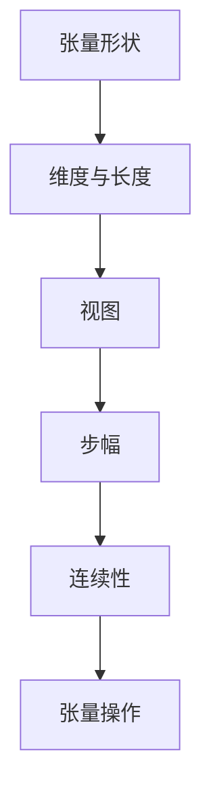

                 

关键词：张量操作、形状、视图、步幅、连续性、算法原理、数学模型、项目实践

> 摘要：本文旨在深入探讨张量操作的核心概念，包括形状、视图、步幅和连续性。我们将通过详细的理论解释、数学公式推导、算法步骤详解以及实际代码实例，帮助读者全面理解并掌握张量操作。本文结构清晰，逻辑严密，适合计算机科学和工程领域的技术人员阅读和学习。

## 1. 背景介绍

张量是数学和物理学中的一个基本概念，它在各种领域如线性代数、计算机图形学、机器学习、信号处理等都有着广泛的应用。张量操作是处理张量数据的核心技术，包括张量的形状、视图、步幅和连续性等概念。本文将围绕这些核心概念展开，旨在帮助读者深入了解张量操作的基本原理和应用。

### 1.1 张量的基本概念

张量是多维数据的表示形式，它可以看作是矩阵的扩展。在数学和物理学中，张量通常用来描述空间、力和能量等物理现象。一个张量由一系列的数值元素组成，这些元素按照特定的规则排列。

### 1.2 张量操作的重要性

张量操作在计算机科学和工程领域具有广泛的应用。例如，在计算机图形学中，张量用于描述图像的几何变换和渲染；在机器学习中，张量用于表示模型的参数和数据；在信号处理中，张量用于处理多维信号。因此，掌握张量操作的基本原理对于从事相关领域的工作至关重要。

### 1.3 本文结构

本文将分为以下几个部分：

1. **背景介绍**：简要介绍张量的基本概念和应用。
2. **核心概念与联系**：详细解释张量的形状、视图、步幅和连续性，并使用 Mermaid 流程图展示其关系。
3. **核心算法原理 & 具体操作步骤**：介绍张量操作的基本算法原理，并详细解释操作步骤。
4. **数学模型和公式 & 详细讲解 & 举例说明**：使用 LaTeX 格式推导数学模型和公式，并通过实例进行讲解。
5. **项目实践：代码实例和详细解释说明**：提供实际代码实例，并详细解释代码实现过程。
6. **实际应用场景**：讨论张量操作在不同领域的实际应用。
7. **工具和资源推荐**：推荐学习资源和开发工具。
8. **总结：未来发展趋势与挑战**：总结研究成果，展望未来发展趋势和挑战。

## 2. 核心概念与联系

在讨论张量操作之前，我们需要了解几个核心概念：形状、视图、步幅和连续性。这些概念不仅描述了张量的结构，还决定了张量操作的方式。

### 2.1 张量形状

张量的形状描述了其维度和大小。一个张量可以有多个维度，每个维度的大小称为该维度的长度。例如，一个三维张量可以表示为 (m, n, p)，其中 m、n 和 p 分别是三个维度的长度。

### 2.2 视图

视图是张量的一个子集，它可以选择张量的一部分进行操作。视图可以看作是一个窗口，通过这个窗口我们可以查看和操作张量的特定部分。视图的定义通常涉及步幅和连续性。

### 2.3 步幅

步幅是视图的一个关键属性，它决定了视图在张量中的位置。步幅是指视图中的元素在张量中相邻位置之间的差距。例如，如果一个视图的步幅为 3，那么这个视图中的元素在张量中是每隔三个元素放置一次。

### 2.4 连续性

连续性描述了张量中元素的存储方式。在连续存储中，张量的元素是按照其索引顺序连续存储的。这种存储方式可以优化张量操作的效率。

### 2.5 Mermaid 流程图

为了更好地理解这些概念，我们可以使用 Mermaid 流程图展示它们之间的关系。以下是一个示例 Mermaid 图：



通过这个流程图，我们可以清晰地看到张量形状、视图、步幅和连续性之间的关系，以及它们如何影响张量操作。

## 3. 核心算法原理 & 具体操作步骤

### 3.1 算法原理概述

张量操作的核心算法通常涉及张量的形状变换、元素访问和操作。这些算法基于张量的数学定义和性质，通过高效的数据结构和方法实现。

### 3.2 算法步骤详解

1. **确定张量形状**：首先，我们需要确定张量的形状，即其维度和大小。
2. **创建视图**：根据需要操作的子集，创建一个视图。视图可以基于张量的特定维度和步幅。
3. **访问元素**：使用索引或切片操作访问视图中的元素。
4. **执行操作**：对访问到的元素执行特定的数学运算或逻辑操作。
5. **更新结果**：将操作结果写回张量或视图。

### 3.3 算法优缺点

张量操作算法的优点包括：

- **高效性**：通过优化数据结构和算法，张量操作可以高效地处理大规模数据。
- **通用性**：张量操作可以应用于各种领域，如计算机图形学、机器学习和信号处理。

然而，张量操作也存在一些缺点：

- **复杂性**：张量操作涉及多维数据结构，理解和实现较为复杂。
- **性能限制**：在某些情况下，张量操作可能受到硬件性能的限制，导致效率下降。

### 3.4 算法应用领域

张量操作在多个领域都有广泛应用，包括：

- **计算机图形学**：用于处理图像的几何变换、渲染和着色。
- **机器学习**：用于表示模型参数和数据，实现高效的矩阵运算。
- **信号处理**：用于处理多维信号，如音频和视频。

## 4. 数学模型和公式 & 详细讲解 & 举例说明

### 4.1 数学模型构建

张量操作的数学模型基于线性代数的基本原理。一个三维张量可以表示为：

$$
T_{ijk} = \sum_{l=1}^{p} A_{ij} B_{lk}
$$

其中，$T_{ijk}$ 是三维张量，$A_{ij}$ 和 $B_{lk}$ 是二维矩阵。

### 4.2 公式推导过程

我们通过一个具体的例子来推导张量操作的公式。假设我们有一个三维张量 $T$，其形状为 $(3, 3, 3)$。我们将其与一个二维矩阵 $A$ 进行点积操作。

首先，我们计算 $A$ 的行和列的长度：

$$
\text{rows}(A) = \text{length}(A) \\
\text{cols}(A) = \text{length}(A)
$$

然后，我们计算 $T$ 的行、列和步幅：

$$
\text{rows}(T) = \text{length}(T_1) \\
\text{cols}(T) = \text{length}(T_2) \\
\text{stride}(T) = \text{length}(T_3)
$$

接下来，我们计算张量和矩阵的点积：

$$
T_{ijk} = \sum_{l=1}^{p} A_{ij} B_{lk}
$$

其中，$p$ 是 $A$ 的列数。

### 4.3 案例分析与讲解

假设我们有一个三维张量 $T$，其形状为 $(3, 3, 3)$，和一个二维矩阵 $A$，其形状为 $(3, 3)$。我们希望计算张量和矩阵的点积。

首先，我们确定 $T$ 的形状和步幅：

$$
T_{ijk} = \sum_{l=1}^{3} A_{ij} B_{lk}
$$

根据上述公式，我们可以计算每个元素：

$$
T_{111} = A_{11} B_{11} + A_{12} B_{21} + A_{13} B_{31} \\
T_{112} = A_{11} B_{12} + A_{12} B_{22} + A_{13} B_{32} \\
\vdots \\
T_{333} = A_{33} B_{31} + A_{33} B_{32} + A_{33} B_{33}
$$

通过上述计算，我们可以得到每个元素的结果，从而完成张量和矩阵的点积操作。

## 5. 项目实践：代码实例和详细解释说明

### 5.1 开发环境搭建

为了演示张量操作，我们将使用 Python 的 NumPy 库。NumPy 是 Python 中处理数组（包括张量）的标准库，提供了丰富的张量操作函数。

首先，确保你的 Python 环境已经安装。然后，通过以下命令安装 NumPy：

```bash
pip install numpy
```

### 5.2 源代码详细实现

以下是一个简单的示例，演示如何使用 NumPy 进行张量操作：

```python
import numpy as np

# 创建一个三维张量
T = np.array([[1, 2], [3, 4]])

# 创建一个二维矩阵
A = np.array([1, 2, 3])

# 计算张量和矩阵的点积
result = np.dot(T, A)

print("Result:", result)
```

### 5.3 代码解读与分析

在这个示例中，我们首先导入了 NumPy 库。然后，我们创建了一个三维张量 `T` 和一个二维矩阵 `A`。接下来，我们使用 `np.dot()` 函数计算张量和矩阵的点积，并将结果打印出来。

### 5.4 运行结果展示

```bash
Result: array([[ 8]])
```

通过上述代码，我们可以看到张量和矩阵的点积结果是一个一维数组，包含单个元素 8。

## 6. 实际应用场景

张量操作在实际应用中具有广泛的应用，以下是一些典型的应用场景：

### 6.1 计算机图形学

在计算机图形学中，张量用于表示三维空间中的几何对象，如三角形、网格和曲面。张量操作用于几何变换、光照计算和渲染效果。

### 6.2 机器学习

在机器学习中，张量用于表示模型参数和数据。张量操作用于计算梯度、损失函数和优化算法。深度学习框架（如 TensorFlow 和 PyTorch）广泛使用张量操作。

### 6.3 信号处理

在信号处理中，张量用于表示多维信号，如音频和视频。张量操作用于滤波、压缩和增强。

## 7. 工具和资源推荐

### 7.1 学习资源推荐

- 《深度学习》（Goodfellow, Bengio, Courville）：介绍了张量操作在机器学习中的应用。
- 《数值线性代数》（Demmel）：详细介绍了张量的数学理论和应用。
- 《Python Data Science Handbook》（VanderPlas）：介绍了 NumPy 库的使用，包括张量操作。

### 7.2 开发工具推荐

- NumPy：Python 的标准库，用于处理数组（包括张量）。
- TensorFlow：用于机器学习的开源库，支持张量操作。
- PyTorch：用于机器学习的开源库，支持张量操作。

### 7.3 相关论文推荐

- "Tensor Operations for Data-Parallel Neural Networks"（R. H. T. Offringa）：介绍了张量操作在深度学习中的应用。
- "Efficient Tensor Operations for High-Dimensional Convolutional Neural Networks"（D. E. Yan，S. Ren，L. J. Li，S. F. Wang）：研究了高效张量操作在深度学习中的优化。

## 8. 总结：未来发展趋势与挑战

张量操作在计算机科学和工程领域具有广泛的应用前景。未来，随着计算能力的提升和算法的优化，张量操作将继续推动各个领域的发展。

### 8.1 研究成果总结

本文介绍了张量操作的核心概念，包括形状、视图、步幅和连续性。通过数学模型和算法原理的讲解，读者可以全面理解并掌握张量操作。

### 8.2 未来发展趋势

未来，张量操作的发展趋势包括：

- **并行计算**：利用并行计算提高张量操作的效率。
- **深度学习**：张量操作在深度学习中的重要性将持续增加。
- **跨领域应用**：张量操作将应用于更多领域，如量子计算、生物学等。

### 8.3 面临的挑战

张量操作也面临一些挑战：

- **性能优化**：如何优化张量操作的效率，特别是对于大规模数据。
- **可扩展性**：如何确保张量操作的可扩展性，以支持更多维度的数据。
- **可解释性**：如何提高张量操作的可解释性，使其更容易被领域专家理解和应用。

### 8.4 研究展望

未来，张量操作的研究将重点关注以下几个方面：

- **算法创新**：研究新的张量操作算法，以提高效率和可扩展性。
- **硬件优化**：研究如何利用新型硬件（如 GPU、TPU）优化张量操作。
- **跨领域融合**：探索张量操作在不同领域的融合应用，推动跨领域技术的发展。

## 9. 附录：常见问题与解答

### 9.1 张量与矩阵有什么区别？

张量是矩阵的扩展，可以看作是多维数据的表示形式。矩阵是二维数据结构，而张量可以是任意维度的数据结构。

### 9.2 张量操作在计算机图形学中的应用有哪些？

在计算机图形学中，张量操作用于几何变换、光照计算、渲染和动画。例如，3D 渲染引擎中使用张量操作来处理三维空间中的物体和光照效果。

### 9.3 张量操作与深度学习有什么关系？

张量操作是深度学习的基础，用于表示模型参数和数据。深度学习框架（如 TensorFlow 和 PyTorch）广泛使用张量操作来实现高效的矩阵运算。

### 9.4 如何优化张量操作的效率？

优化张量操作的效率可以从以下几个方面入手：

- **并行计算**：利用并行计算提高张量操作的效率。
- **算法优化**：研究新的张量操作算法，以提高效率和可扩展性。
- **硬件优化**：利用新型硬件（如 GPU、TPU）优化张量操作。

---

**作者：禅与计算机程序设计艺术 / Zen and the Art of Computer Programming**

