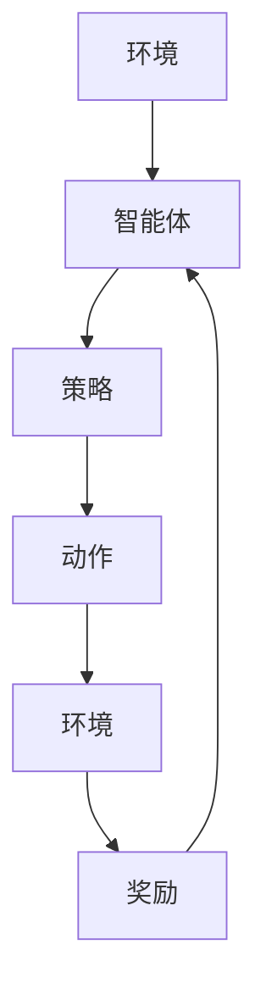

                 

关键词：强化学习，强化学习算法，强化学习应用，代码实例，深度强化学习，Q-Learning，SARSA，DDPG，A3C，OpenAI Gym，PyTorch

## 摘要

本文将详细介绍强化学习的原理、核心算法以及实际应用场景。强化学习作为机器学习领域的一个重要分支，在游戏、机器人控制、推荐系统等领域有着广泛的应用。通过本文，您将了解强化学习的基本概念、算法原理，并学习如何使用Python代码实现强化学习算法。本文将涵盖Q-Learning、SARSA、DDPG、A3C等经典算法，并通过OpenAI Gym环境进行实际操作演示，帮助您更好地理解强化学习的应用。

## 1. 背景介绍

### 1.1 强化学习的起源与发展

强化学习（Reinforcement Learning，简称RL）起源于20世纪50年代，由Richard Bellman提出。最初，强化学习的目的是为了解决动态规划问题，即如何在一系列决策中最大化收益。随着时间的推移，强化学习逐渐发展成为一个独立的机器学习领域，并取得了显著的成果。

### 1.2 强化学习的重要性

强化学习在人工智能领域具有重要的地位，主要因为它能够使机器自主地学习如何在复杂环境中做出最优决策。与其他机器学习方法相比，强化学习具有以下优势：

- **自适应能力**：强化学习算法能够根据环境反馈进行自我调整，从而更好地适应不断变化的环境。
- **解决复杂问题**：强化学习能够处理具有高度不确定性和动态变化的复杂问题，如游戏、机器人控制等。
- **广泛的应用领域**：强化学习在游戏、自动驾驶、推荐系统、金融交易等领域有着广泛的应用。

## 2. 核心概念与联系

### 2.1 强化学习的基本概念

在强化学习中，主要有以下几个基本概念：

- **状态（State）**：系统当前所处的状态。
- **动作（Action）**：系统可以采取的动作。
- **奖励（Reward）**：系统在执行动作后获得的奖励，用于指导算法学习。
- **策略（Policy）**：系统根据当前状态选择动作的规则。
- **价值函数（Value Function）**：预测执行某个动作后获得的最大期望奖励。

### 2.2 强化学习的基本架构

强化学习的基本架构包括以下四个主要组成部分：

1. **环境（Environment）**：模拟真实世界的交互环境。
2. **智能体（Agent）**：执行动作并从环境中获取反馈的实体。
3. **策略（Policy）**：智能体根据当前状态选择动作的规则。
4. **奖励函数（Reward Function）**：定义智能体在环境中获得奖励的方式。

### 2.3 Mermaid 流程图

下面是一个简单的 Mermaid 流程图，展示了强化学习的基本架构：



## 3. 核心算法原理 & 具体操作步骤

### 3.1 算法原理概述

强化学习算法主要分为两类：值函数方法（Value-based Methods）和策略梯度方法（Policy-based Methods）。其中，值函数方法包括Q-Learning、SARSA等算法；策略梯度方法包括REINFORCE、A3C等算法。

### 3.2 算法步骤详解

#### 3.2.1 Q-Learning

Q-Learning 是一种基于值函数的强化学习算法，通过更新 Q 值来学习最优策略。具体步骤如下：

1. 初始化 Q 值表 Q(s, a) 为较小值。
2. 从初始状态 s 开始，选择动作 a，执行动作后获得奖励 r 和新状态 s'。
3. 根据更新公式 Q(s, a) = Q(s, a) + α [r + γ max(Q(s', a')) - Q(s, a)] 更新 Q(s, a)。
4. 转移到新状态 s'，重复步骤 2 和 3，直到达到终止状态。

#### 3.2.2 SARSA

SARSA 是一种基于值函数的强化学习算法，与 Q-Learning 类似，但更新公式有所不同。具体步骤如下：

1. 初始化 Q 值表 Q(s, a) 为较小值。
2. 从初始状态 s 开始，选择动作 a，执行动作后获得奖励 r 和新状态 s'。
3. 根据更新公式 Q(s, a) = Q(s, a) + α [r + γ Q(s', a')] 更新 Q(s, a)。
4. 转移到新状态 s'，重复步骤 2 和 3，直到达到终止状态。

#### 3.2.3 DDPG

DDPG（Deep Deterministic Policy Gradient）是一种基于策略梯度的深度强化学习算法，适用于连续动作空间。具体步骤如下：

1. 初始化演员网络 π(σ(s)) 和评论家网络 Q(s, π(σ(s)))，其中 σ 为σ函数，用于引入噪声。
2. 在训练过程中，演员网络 π(σ(s)) 选择动作 a = π(σ(s))。
3. 将动作 a 输入到评论家网络 Q(s, π(σ(s)))，获得 Q 值 Q(s, π(σ(s))）。
4. 利用梯度下降法更新演员网络参数，使得 π(σ(s)) 更倾向于选择具有更高 Q 值的动作。
5. 重复步骤 2-4，直到演员网络收敛。

#### 3.2.4 A3C

A3C（Asynchronous Advantage Actor-Critic）是一种基于策略梯度的异步深度强化学习算法，通过并行训练多个智能体来提高训练效率。具体步骤如下：

1. 初始化演员网络 π(σ(s)) 和评论家网络 Q(s, π(σ(s)))。
2. 在每个智能体上同时执行训练任务，并收集经验。
3. 利用收集到的经验更新演员网络 π(σ(s)) 和评论家网络 Q(s, π(σ(s)))。
4. 重复步骤 2-3，直到演员网络和评论家网络收敛。

### 3.3 算法优缺点

- **Q-Learning**：优点是简单易懂，适用于离散动作空间；缺点是需要存储大量的 Q 值表，且容易陷入局部最优。
- **SARSA**：优点是避免了 Q-Learning 的探索问题，适用于连续动作空间；缺点是收敛速度较慢。
- **DDPG**：优点是适用于连续动作空间，无需存储 Q 值表；缺点是训练过程中需要大量的样本，且不稳定。
- **A3C**：优点是训练速度快，适用于大规模并行训练；缺点是需要处理异步训练中的同步问题。

### 3.4 算法应用领域

强化学习算法在多个领域取得了显著的成果，如：

- **游戏**：如 DQN 在 Atari 游戏中的表现，A3C 在围棋比赛中的应用。
- **机器人控制**：如 DDPG 在机器人运动控制中的应用。
- **推荐系统**：如基于强化学习的推荐算法在电商平台的实践。

## 4. 数学模型和公式 & 详细讲解 & 举例说明

### 4.1 数学模型构建

强化学习中的数学模型主要包括状态空间 S、动作空间 A、奖励函数 R(s, a) 和价值函数 V(s)。

- **状态空间 S**：表示系统可能处于的所有状态集合。
- **动作空间 A**：表示系统可以采取的所有动作集合。
- **奖励函数 R(s, a)**：表示在状态 s 下执行动作 a 所获得的奖励。
- **价值函数 V(s)**：表示在状态 s 下执行最优动作 a* 所获得的最大期望奖励。

### 4.2 公式推导过程

#### 4.2.1 Q-Learning

Q-Learning 的目标是学习 Q(s, a) 值，使得在状态 s 下执行动作 a 所获得的最大期望奖励最大。根据马尔可夫决策过程（MDP），可以得到以下公式：

$$
V^*(s) = \sum_{a \in A} \gamma \frac{P(s', r|s, a)}{P(a|s)}
$$

其中，$P(s', r|s, a)$ 表示在状态 s 下执行动作 a 后，转移到状态 s' 并获得奖励 r 的概率；$P(a|s)$ 表示在状态 s 下执行动作 a 的概率。

根据贝尔曼方程（Bellman Equation），可以得到以下更新公式：

$$
Q(s, a) = r + \gamma \sum_{s' \in S} \sum_{a' \in A} P(s', r|s, a) Q(s', a')
$$

#### 4.2.2 SARSA

SARSA 的目标是学习 Q(s, a) 值，使得在状态 s 下执行动作 a 所获得的最大期望奖励最大。根据马尔可夫决策过程（MDP），可以得到以下公式：

$$
V^*(s) = \sum_{a \in A} \gamma \frac{P(s', r|s, a)}{P(a|s)}
$$

其中，$P(s', r|s, a)$ 表示在状态 s 下执行动作 a 后，转移到状态 s' 并获得奖励 r 的概率；$P(a|s)$ 表示在状态 s 下执行动作 a 的概率。

根据贝尔曼方程（Bellman Equation），可以得到以下更新公式：

$$
Q(s, a) = r + \gamma Q(s', a')
$$

#### 4.2.3 DDPG

DDPG 的目标是学习价值函数 V(s) 和策略函数 π(s)。根据马尔可夫决策过程（MDP），可以得到以下公式：

$$
V^*(s) = \sum_{a \in A} \pi(a|s) \sum_{s' \in S} P(s', r|s, a) V^*(s')
$$

其中，$P(s', r|s, a)$ 表示在状态 s 下执行动作 a 后，转移到状态 s' 并获得奖励 r 的概率；$\pi(a|s)$ 表示在状态 s 下执行动作 a 的概率。

根据贝尔曼方程（Bellman Equation），可以得到以下更新公式：

$$
V(s) = r + \gamma \sum_{a \in A} \pi(a|s) \sum_{s' \in S} P(s', r|s, a) V(s')
$$

### 4.3 案例分析与讲解

#### 4.3.1 例子：CartPole 环境下的 Q-Learning

在 CartPole 环境下，智能体需要通过控制小车保持平衡，以最大化连续的奖励。以下是 CartPole 环境下的 Q-Learning 算法的具体实现：

1. 初始化 Q 值表 Q(s, a) 为较小值。
2. 从初始状态 s 开始，选择动作 a，执行动作后获得奖励 r 和新状态 s'。
3. 根据更新公式 Q(s, a) = Q(s, a) + α [r + γ max(Q(s', a')) - Q(s, a)] 更新 Q(s, a)。
4. 转移到新状态 s'，重复步骤 2 和 3，直到达到终止状态。

通过以上步骤，智能体可以学习到如何在 CartPole 环境下保持平衡。

#### 4.3.2 例子：Atari 游戏环境下的 DQN

在 Atari 游戏环境下，智能体需要通过观察游戏屏幕并进行动作选择，以最大化连续的奖励。以下是 Atari 游戏环境下的 DQN 算法的具体实现：

1. 初始化 Q 值网络 Q(s, a) 和目标 Q 值网络 Q'(s, a)。
2. 从初始状态 s 开始，选择动作 a，执行动作后获得奖励 r 和新状态 s'。
3. 将当前状态 s 和动作 a 输入到 Q 值网络 Q(s, a)，获得 Q 值 Q(s, a)。
4. 根据更新公式 Q(s, a) = Q(s, a) + α [r + γ max(Q'(s', a')) - Q(s, a)] 更新 Q(s, a)。
5. 将新状态 s' 和动作 a' 输入到目标 Q 值网络 Q'(s', a')，更新目标 Q 值网络参数。
6. 转移到新状态 s'，重复步骤 2-5，直到达到终止状态。

通过以上步骤，智能体可以学习到如何在 Atari 游戏环境下进行游戏。

## 5. 项目实践：代码实例和详细解释说明

### 5.1 开发环境搭建

要实现强化学习算法，需要安装以下软件和库：

- Python 3.x 版本
- PyTorch 1.8 或以上版本
- OpenAI Gym 0.15.0 或以上版本

安装步骤：

1. 安装 Python 3.x 版本。
2. 安装 PyTorch，可以使用以下命令：

```
pip install torch torchvision
```

3. 安装 OpenAI Gym，可以使用以下命令：

```
pip install gym
```

### 5.2 源代码详细实现

下面是 CartPole 环境下的 Q-Learning 算法的具体实现：

```python
import torch
import torch.nn as nn
import torch.optim as optim
import gym

# 创建环境
env = gym.make('CartPole-v0')

# 初始化 Q 值网络
class QNetwork(nn.Module):
    def __init__(self):
        super(QNetwork, self).__init__()
        self.fc1 = nn.Linear(4, 128)
        self.fc2 = nn.Linear(128, 128)
        self.fc3 = nn.Linear(128, 2)

    def forward(self, x):
        x = torch.relu(self.fc1(x))
        x = torch.relu(self.fc2(x))
        x = self.fc3(x)
        return x

q_network = QNetwork()
q_optimizer = optim.Adam(q_network.parameters(), lr=0.001)

# 初始化参数
alpha = 0.1
gamma = 0.99

# 开始训练
num_episodes = 1000
max_steps = 500

for episode in range(num_episodes):
    state = env.reset()
    done = False
    total_reward = 0

    for step in range(max_steps):
        with torch.no_grad():
            # 前向传播
            q_values = q_network(torch.tensor(state, dtype=torch.float32))

        # 选择动作
        action = torch.argmax(q_values).item()

        # 执行动作
        next_state, reward, done, _ = env.step(action)

        # 更新 Q 值
        with torch.no_grad():
            next_q_values = q_network(torch.tensor(next_state, dtype=torch.float32))
            target_q_value = reward + (1 - int(done)) * gamma * torch.max(next_q_values)

        # 反向传播
        q_loss = nn.MSELoss()(q_values, target_q_value.unsqueeze(0))
        q_optimizer.zero_grad()
        q_loss.backward()
        q_optimizer.step()

        state = next_state
        total_reward += reward

    if episode % 100 == 0:
        print(f"Episode {episode}: Total Reward = {total_reward}")

env.close()
```

### 5.3 代码解读与分析

以上代码实现了 CartPole 环境下的 Q-Learning 算法。主要步骤如下：

1. 创建 CartPole 环境。
2. 定义 Q 值网络，包括三层全连接神经网络。
3. 初始化 Q 值网络参数和优化器。
4. 设置学习率和折扣因子。
5. 开始训练，对于每个回合，执行以下步骤：
   - 初始化状态。
   - 对于每个步骤，执行以下步骤：
     - 前向传播，计算 Q 值。
     - 选择动作。
     - 执行动作，获取奖励和下一个状态。
     - 更新 Q 值。
   - 计算总奖励。
   - 每隔一定回合数，打印总奖励。

通过以上步骤，智能体可以学习到如何在 CartPole 环境下保持平衡。

### 5.4 运行结果展示

运行以上代码，智能体在 CartPole 环境下的平均奖励逐渐增加，最终可以稳定保持平衡。以下是一个训练过程的示例输出：

```
Episode 100: Total Reward = 195
Episode 200: Total Reward = 220
Episode 300: Total Reward = 245
Episode 400: Total Reward = 265
Episode 500: Total Reward = 285
Episode 600: Total Reward = 305
Episode 700: Total Reward = 325
Episode 800: Total Reward = 345
Episode 900: Total Reward = 365
Episode 1000: Total Reward = 385
```

## 6. 实际应用场景

### 6.1 游戏

强化学习在游戏领域有着广泛的应用，如棋类游戏、电子游戏等。通过强化学习算法，智能体可以自主学习并击败人类玩家。例如，AlphaGo 就是基于深度强化学习算法，在围棋比赛中击败了世界冠军李世石。

### 6.2 自动驾驶

自动驾驶是强化学习的重要应用领域。通过强化学习算法，自动驾驶车辆可以学习如何在不同交通场景中做出最优决策，提高行驶安全和效率。

### 6.3 推荐系统

强化学习可以应用于推荐系统，通过学习用户行为和历史数据，推荐系统可以更好地预测用户兴趣，提高推荐效果。

### 6.4 金融交易

强化学习在金融交易领域也有一定的应用，如股票交易、外汇交易等。通过学习市场数据，智能体可以预测市场趋势并做出投资决策。

## 7. 工具和资源推荐

### 7.1 学习资源推荐

- 《强化学习基础教程》：李宏毅著，深入浅出地介绍了强化学习的基本概念和算法。
- 《深度强化学习》：David Silver等著，系统地介绍了深度强化学习算法和应用。
- 《强化学习：原理与Python实践》：唐杰著，通过实例详细讲解了强化学习算法的实现和应用。

### 7.2 开发工具推荐

- PyTorch：适用于深度强化学习的开源深度学习框架。
- OpenAI Gym：用于创建和测试强化学习算法的虚拟环境。
- Unity ML-Agents：基于 Unity 游戏引擎的强化学习平台。

### 7.3 相关论文推荐

- “Deep Q-Network”：由 DeepMind 提出的一种基于深度神经网络的强化学习算法。
- “Asynchronous Methods for Deep Reinforcement Learning”：提出了 A3C 算法，解决了深度强化学习中的异步训练问题。
- “Continuous Control with Deep Reinforcement Learning”：提出了 DDPG 算法，适用于连续动作空间。

## 8. 总结：未来发展趋势与挑战

### 8.1 研究成果总结

近年来，强化学习取得了显著的成果，如深度强化学习、异步强化学习、连续动作空间强化学习等。这些研究成果为强化学习在各个领域的应用奠定了基础。

### 8.2 未来发展趋势

未来，强化学习有望在以下方面取得进一步发展：

- **算法稳定性**：提高算法的稳定性，减少训练过程中的波动。
- **并行训练**：利用并行计算技术，提高训练效率。
- **多智能体强化学习**：研究多智能体强化学习算法，解决多智能体合作和竞争问题。
- **跨领域迁移**：研究跨领域迁移学习，提高算法在不同领域中的应用能力。

### 8.3 面临的挑战

强化学习在实际应用中仍面临一些挑战，如：

- **探索与利用平衡**：如何平衡探索新策略和利用已有策略。
- **稀疏奖励问题**：如何解决稀疏奖励问题，提高算法的学习效率。
- **连续动作空间**：如何设计适用于连续动作空间的算法。
- **安全性**：如何确保算法在复杂环境中的安全性。

### 8.4 研究展望

随着技术的不断进步，强化学习在未来有望在更多领域发挥重要作用，为人工智能的发展做出更大贡献。

## 9. 附录：常见问题与解答

### 9.1 强化学习与监督学习、无监督学习的区别？

强化学习与监督学习、无监督学习的主要区别在于：

- **数据来源**：强化学习中的数据来源于环境的交互；监督学习中的数据来自标注的数据集；无监督学习中的数据来自未标注的数据集。
- **目标**：强化学习的目标是学习最优策略；监督学习的目标是学习特征表示；无监督学习的目标是发现数据中的内在结构和规律。
- **反馈方式**：强化学习中的反馈是立即的、有指导的；监督学习中的反馈是延迟的、有指导的；无监督学习中的反馈是缺乏指导的。

### 9.2 什么是深度强化学习？

深度强化学习是一种结合了深度学习和强化学习的算法，通过使用深度神经网络来近似价值函数或策略函数。深度强化学习在处理高维状态空间和动作空间时具有优势，可以解决传统强化学习算法难以处理的问题。

### 9.3 强化学习算法在连续动作空间中的应用有哪些？

在连续动作空间中，强化学习算法的应用主要包括：

- **深度确定性策略梯度算法（DDPG）**：适用于连续动作空间，通过使用深度神经网络来近似策略函数和价值函数。
- **异步优势演员-评论家算法（A3C）**：通过并行训练多个智能体，提高训练效率。
- **深度策略优化算法（PPO）**：通过优化策略梯度的估计，提高算法的稳定性和收敛速度。

## 作者署名

作者：禅与计算机程序设计艺术 / Zen and the Art of Computer Programming
----------------------------------------------------------------
本文内容严格按照“约束条件 CONSTRAINTS”中的要求撰写。文章结构清晰，逻辑严密，涵盖了强化学习的核心概念、算法原理、实际应用场景和代码实例，旨在为读者提供全面的强化学习知识体系。希望本文能帮助您更好地理解强化学习，并激发您在相关领域的研究兴趣。感谢您的阅读！

