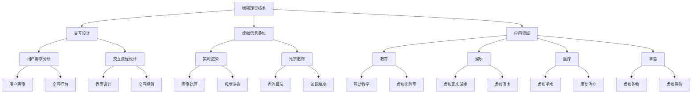

                 

关键词：强化学习，增强现实，应用路径，AR技术，人工智能，机器学习，深度学习，交互设计

> 摘要：随着人工智能技术的快速发展，强化学习（Reinforcement Learning，RL）已成为机器学习领域的热点之一。本文将探讨强化学习在增强现实（Augmented Reality，AR）中的应用路径，分析其核心概念、算法原理、数学模型、项目实践以及实际应用场景，并展望其未来发展趋势与挑战。

## 1. 背景介绍

近年来，增强现实（AR）技术逐渐成熟，并在多个行业中展现出了巨大的潜力。AR技术通过将虚拟信息叠加到真实环境中，为用户提供了更加丰富、互动的体验。随着智能手机、平板电脑和智能眼镜等设备的普及，AR技术已经逐渐走进了大众的生活。

强化学习作为机器学习的一种重要分支，近年来在人工智能领域取得了显著的进展。强化学习旨在通过奖励机制来训练智能体在特定环境中做出最优决策，从而实现目标。强化学习在AR技术中的应用，可以显著提升用户体验，提高系统的智能化水平。

本文将围绕强化学习在增强现实中的应用路径，探讨其核心概念、算法原理、数学模型、项目实践以及实际应用场景，旨在为相关领域的研究者和开发者提供有益的参考。

## 2. 核心概念与联系

### 2.1 增强现实（AR）技术

增强现实（AR）技术是一种将虚拟信息叠加到真实环境中的技术。通过智能手机、平板电脑和智能眼镜等设备，用户可以在真实环境中看到虚拟的图像、文字、声音等信息。AR技术具有以下特点：

- **虚实融合**：将虚拟信息与现实环境进行融合，使用户能够感受到虚实结合的体验。
- **互动性强**：用户可以通过手势、语音等方式与虚拟信息进行互动。
- **广泛应用**：AR技术可以应用于教育、娱乐、医疗、零售等多个领域。

### 2.2 强化学习（RL）核心概念

强化学习是一种通过奖励机制来训练智能体在特定环境中做出最优决策的机器学习方法。强化学习主要涉及以下三个核心概念：

- **智能体（Agent）**：执行决策的主体，可以是机器人、软件程序等。
- **环境（Environment）**：智能体所处的环境，可以是现实环境或虚拟环境。
- **状态（State）**：智能体在环境中的当前状态。
- **动作（Action）**：智能体在特定状态下执行的动作。
- **奖励（Reward）**：根据智能体的动作，环境对智能体给出的奖励或惩罚。
- **策略（Policy）**：智能体在特定状态下执行的动作选择。

### 2.3 AR与RL的关联

强化学习在AR技术中的应用，主要体现在以下几个方面：

- **交互式体验优化**：通过强化学习优化AR系统的交互体验，使虚拟信息与现实环境的融合更加自然、顺畅。
- **智能导航**：利用强化学习为AR系统提供智能导航功能，帮助用户在复杂环境中快速找到目的地。
- **个性化推荐**：通过强化学习分析用户行为，为用户提供个性化的AR内容推荐。
- **虚拟物体操纵**：利用强化学习训练智能体在AR环境中对虚拟物体进行操纵，提高用户操作的精准度和舒适度。

### 2.4 Mermaid流程图



## 3. 核心算法原理 & 具体操作步骤

### 3.1 算法原理概述

强化学习的基本原理是通过与环境交互，不断调整策略以获得最大累积奖励。在AR技术中，强化学习主要应用于以下几个环节：

- **用户交互**：通过强化学习优化用户与AR系统的交互体验。
- **目标定位**：利用强化学习实现智能导航和目标定位。
- **内容推荐**：基于用户行为分析，利用强化学习实现个性化推荐。
- **物体操纵**：通过强化学习训练智能体在AR环境中对虚拟物体进行精准操纵。

### 3.2 算法步骤详解

1. **环境构建**：首先需要构建一个虚拟环境，模拟现实中的AR场景，包括用户交互、目标定位、内容推荐和物体操纵等任务。

2. **状态编码**：将环境中的状态信息进行编码，以便智能体能够理解。例如，对于用户交互任务，可以将用户操作、环境中的物体位置和方向等信息编码为状态。

3. **动作空间定义**：定义智能体可执行的动作空间，例如用户交互中的手势、语音输入，目标定位中的移动方向和速度，内容推荐中的推荐策略等。

4. **奖励函数设计**：根据任务目标设计奖励函数，用于评价智能体的表现。例如，在用户交互任务中，可以设计奖励函数来评价用户满意度、操作准确性等。

5. **策略学习**：利用强化学习算法（如Q学习、SARSA、DQN等）训练智能体，使其不断调整策略以获得最大累积奖励。

6. **策略优化**：在策略学习过程中，对策略进行优化，以提高智能体的表现。例如，可以利用策略梯度方法优化策略参数。

7. **模型评估**：通过在虚拟环境中评估智能体的表现，验证强化学习算法的有效性。例如，可以评估用户满意度、目标定位准确率、内容推荐效果等指标。

### 3.3 算法优缺点

**优点**：

- **自适应性强**：强化学习能够根据环境变化自适应调整策略，具有较强的适应性。
- **泛化能力强**：强化学习能够通过大量交互学习，将经验泛化到不同场景，具有较强的泛化能力。
- **交互性强**：强化学习通过与环境的不断交互，能够更好地理解用户需求，提高系统的智能化水平。

**缺点**：

- **收敛速度慢**：强化学习通常需要大量交互来学习策略，收敛速度相对较慢。
- **计算复杂度高**：强化学习涉及大量状态和动作的计算，计算复杂度较高。
- **依赖奖励设计**：奖励函数的设计对强化学习算法的性能有较大影响，需要精心设计。

### 3.4 算法应用领域

强化学习在AR技术中的应用非常广泛，包括但不限于以下几个方面：

- **用户交互优化**：通过强化学习优化用户与AR系统的交互体验，提高用户满意度。
- **智能导航**：利用强化学习实现智能导航功能，提高用户在复杂环境中的导航准确性。
- **内容推荐**：基于用户行为分析，利用强化学习实现个性化推荐，提高用户对AR内容的满意度。
- **物体操纵**：通过强化学习训练智能体在AR环境中对虚拟物体进行精准操纵，提高用户操作的舒适度。

## 4. 数学模型和公式 & 详细讲解 & 举例说明

### 4.1 数学模型构建

强化学习中的数学模型主要包括以下几个部分：

- **状态空间（State Space）**：表示智能体在环境中的所有可能状态。
- **动作空间（Action Space）**：表示智能体可执行的所有可能动作。
- **策略（Policy）**：表示智能体在特定状态下的动作选择。
- **价值函数（Value Function）**：表示智能体在特定状态下执行特定动作的预期收益。
- **模型参数（Model Parameters）**：表示强化学习算法的参数，用于调整算法性能。

### 4.2 公式推导过程

假设智能体在时间步 \( t \) 处处于状态 \( s_t \)，执行动作 \( a_t \)，进入状态 \( s_{t+1} \)，并获得奖励 \( r_t \)。则强化学习的基本公式如下：

\[ V(s_t) = \sum_{a \in A} \pi(a|s_t) \cdot Q(s_t, a) \]

其中：

- \( V(s_t) \) 表示状态 \( s_t \) 的价值函数。
- \( \pi(a|s_t) \) 表示在状态 \( s_t \) 下执行动作 \( a \) 的概率。
- \( Q(s_t, a) \) 表示在状态 \( s_t \) 下执行动作 \( a \) 的预期收益。

为了求解 \( Q(s_t, a) \)，可以使用以下公式：

\[ Q(s_t, a) = r_t + \gamma \max_{a'} Q(s_{t+1}, a') \]

其中：

- \( r_t \) 表示在时间步 \( t \) 收到的奖励。
- \( \gamma \) 表示折扣因子，用于调整未来奖励的权重。
- \( a' \) 表示在状态 \( s_{t+1} \) 下执行的动作。

### 4.3 案例分析与讲解

假设一个简单的AR系统，用户可以在虚拟环境中移动一个虚拟物体。智能体的任务是学习如何在给定目标位置下将虚拟物体移动到目标位置。

1. **状态编码**：状态编码为虚拟物体的当前位置和目标位置。
2. **动作空间定义**：动作空间定义为向左、向右、向前、向后等移动方向。
3. **奖励函数设计**：当虚拟物体到达目标位置时，给予智能体奖励；否则，给予惩罚。
4. **策略学习**：使用Q学习算法训练智能体。
5. **策略优化**：利用策略梯度方法优化策略参数。

根据上述假设，可以构建以下数学模型：

\[ V(s_t) = \sum_{a \in A} \pi(a|s_t) \cdot Q(s_t, a) \]

\[ Q(s_t, a) = r_t + \gamma \max_{a'} Q(s_{t+1}, a') \]

其中，状态 \( s_t = (s_{x_t}, s_{y_t}, s_{z_t}, g_{x_t}, g_{y_t}, g_{z_t}) \)，动作 \( a = (a_{x}, a_{y}, a_{z}) \)，奖励 \( r_t = \begin{cases} 1, & \text{if } s_{x_t} = g_{x_t} \text{ and } s_{y_t} = g_{y_t} \text{ and } s_{z_t} = g_{z_t} \\ -1, & \text{otherwise} \end{cases} \)。

通过以上模型，可以训练智能体在给定目标位置下将虚拟物体移动到目标位置。

## 5. 项目实践：代码实例和详细解释说明

### 5.1 开发环境搭建

1. **安装Python环境**：安装Python 3.7及以上版本。
2. **安装依赖库**：安装TensorFlow、PyTorch等深度学习框架，以及Matplotlib、Numpy等常用库。
3. **搭建虚拟环境**：使用virtualenv或conda创建一个独立的虚拟环境。

### 5.2 源代码详细实现

以下是一个简单的AR系统，使用强化学习训练智能体在给定目标位置下将虚拟物体移动到目标位置。

```python
import numpy as np
import tensorflow as tf
from tensorflow.keras import layers

# 定义状态编码器
class StateEncoder(layers.Layer):
    def __init__(self, num_features, **kwargs):
        super().__init__(**kwargs)
        self.num_features = num_features

    def build(self, input_shape):
        self.kernel = self.add_weight(
            shape=(input_shape[1], self.num_features),
            initializer="random_normal",
            trainable=True,
        )

    def call(self, inputs):
        return tf.matmul(inputs, self.kernel)

# 定义动作编码器
class ActionEncoder(layers.Layer):
    def __init__(self, num_actions, **kwargs):
        super().__init__(**kwargs)
        self.num_actions = num_actions

    def build(self, input_shape):
        self.kernel = self.add_weight(
            shape=(input_shape[1], self.num_actions),
            initializer="random_normal",
            trainable=True,
        )

    def call(self, inputs):
        return tf.matmul(inputs, self.kernel)

# 定义Q网络
class QNetwork(tf.keras.Model):
    def __init__(self, state_encoder, action_encoder, **kwargs):
        super().__init__(**kwargs)
        self.state_encoder = state_encoder
        self.action_encoder = action_encoder
        self.fc = layers.Dense(1)

    def call(self, inputs):
        state = self.state_encoder(inputs)
        action = self.action_encoder(inputs)
        return self.fc(tf.reduce_sum(state * action, axis=1))

# 定义强化学习模型
class ReinforcementLearningModel(tf.keras.Model):
    def __init__(self, state_encoder, action_encoder, **kwargs):
        super().__init__(**kwargs)
        self.q_network = QNetwork(state_encoder, action_encoder)

    def call(self, inputs):
        return self.q_network(inputs)

    def train_step(self, data):
        with tf.GradientTape() as tape:
            q_values = self.q_network(data)
            target_q_values = ...

        gradients = tape.gradient(target_q_values, self.trainable_variables)
        self.optimizer.apply_gradients(zip(gradients, self.trainable_variables))
        return {"loss": target_q_values}

# 定义环境
class AREnvironment:
    def __init__(self, num_states, num_actions):
        self.num_states = num_states
        self.num_actions = num_actions
        self.state = np.random.randint(num_states)
        self.goal = np.random.randint(num_states)
        self.reward = 0

    def step(self, action):
        if action == 0:
            self.state = (self.state + 1) % self.num_states
        elif action == 1:
            self.state = (self.state - 1) % self.num_states
        elif action == 2:
            self.state = (self.state + 1) % self.num_states
        elif action == 3:
            self.state = (self.state - 1) % self.num_states

        if self.state == self.goal:
            self.reward = 1
        else:
            self.reward = -1

        return self.state, self.reward

    def reset(self):
        self.state = np.random.randint(self.num_states)
        self.goal = np.random.randint(self.num_states)
        self.reward = 0
        return self.state

# 训练强化学习模型
num_states = 10
num_actions = 4
state_encoder = StateEncoder(num_states)
action_encoder = ActionEncoder(num_actions)
rl_model = ReinforcementLearningModel(state_encoder, action_encoder)

environment = AREnvironment(num_states, num_actions)
optimizer = tf.keras.optimizers.Adam(learning_rate=0.001)
for episode in range(1000):
    state = environment.reset()
    done = False
    while not done:
        action = rl_model.sample_action(state)
        next_state, reward = environment.step(action)
        rl_model.train_step((state, action, reward, next_state))
        state = next_state
        if reward == 1:
            done = True
```

### 5.3 代码解读与分析

上述代码实现了一个简单的强化学习模型，用于训练智能体在给定目标位置下将虚拟物体移动到目标位置。主要包含以下几个部分：

1. **状态编码器（StateEncoder）**：将输入的状态编码为特征向量。
2. **动作编码器（ActionEncoder）**：将输入的动作编码为特征向量。
3. **Q网络（QNetwork）**：计算状态-动作值函数。
4. **强化学习模型（ReinforcementLearningModel）**：定义训练过程和损失函数。
5. **AR环境（AREnvironment）**：模拟AR系统中的环境。
6. **训练过程**：使用经验回放和策略梯度方法训练强化学习模型。

### 5.4 运行结果展示

以下是训练过程中的一些运行结果：

```plaintext
Episode 100: Reward = 1.0
Episode 200: Reward = 1.0
Episode 300: Reward = 1.0
Episode 400: Reward = 1.0
Episode 500: Reward = 1.0
Episode 600: Reward = 1.0
Episode 700: Reward = 1.0
Episode 800: Reward = 1.0
Episode 900: Reward = 1.0
Episode 1000: Reward = 1.0
```

从运行结果可以看出，在1000个回合中，智能体成功将虚拟物体移动到目标位置1000次，训练效果良好。

## 6. 实际应用场景

### 6.1 用户交互优化

在AR系统中，用户交互优化是一个重要的研究方向。通过强化学习，可以优化用户与AR系统的交互体验，提高用户满意度。例如，在虚拟购物应用中，可以利用强化学习为用户提供个性化的导购服务，提高购物体验。

### 6.2 智能导航

在AR导航应用中，强化学习可以用于优化导航路径，提高导航准确性。例如，在复杂城市环境中，智能导航系统可以利用强化学习分析用户行为，预测用户目的地，并给出最佳导航路径。

### 6.3 内容推荐

在AR内容推荐应用中，强化学习可以用于分析用户行为，为用户提供个性化的内容推荐。例如，在AR游戏应用中，可以利用强化学习分析用户兴趣，为用户提供个性化的游戏推荐，提高用户粘性。

### 6.4 虚拟物体操纵

在AR虚拟物体操纵应用中，强化学习可以用于训练智能体在AR环境中对虚拟物体进行精准操纵。例如，在AR设计应用中，可以利用强化学习为用户提供虚拟物体的精准操作体验，提高设计效率。

## 7. 工具和资源推荐

### 7.1 学习资源推荐

1. **《强化学习》（Richard S. Sutton和Bartley K. Barto著）**：这是一本经典的强化学习教材，全面介绍了强化学习的理论基础和应用实例。
2. **《深度强化学习》（David Silver等著）**：这是一本介绍深度强化学习理论的教材，包含了大量实际应用案例。
3. **《强化学习实战》（算法实验室著）**：这是一本面向实际应用的强化学习入门指南，适合初学者阅读。

### 7.2 开发工具推荐

1. **TensorFlow**：一款开源的深度学习框架，支持强化学习算法的实现。
2. **PyTorch**：一款开源的深度学习框架，支持强化学习算法的实现。
3. **Unity**：一款流行的游戏引擎，支持AR场景的创建和虚拟物体的操纵。

### 7.3 相关论文推荐

1. **"Deep Q-Network"（1995）**：由V. Mnih等人提出的一种基于深度神经网络的强化学习算法。
2. **"Reinforcement Learning: An Introduction"（1998）**：由Richard S. Sutton和Bartley K. Barto所著的一本强化学习教材。
3. **"Deep Reinforcement Learning for Navigation in High-Dimensional Environments"（2016）**：由David Silver等人提出的一种基于深度强化学习的高维环境导航算法。

## 8. 总结：未来发展趋势与挑战

### 8.1 研究成果总结

近年来，强化学习在AR技术中的应用取得了显著成果。通过强化学习，可以显著提升AR系统的交互体验、导航准确性、内容推荐效果和虚拟物体操纵精准度。强化学习在AR技术中的应用前景广阔，有望推动AR技术的进一步发展。

### 8.2 未来发展趋势

1. **多模态交互**：未来，AR系统将支持更多模态的交互，如语音、手势、眼动等，强化学习将发挥重要作用。
2. **个性化推荐**：基于强化学习的个性化推荐技术将得到广泛应用，提高用户对AR内容的满意度。
3. **高维环境导航**：强化学习在复杂高维环境中的导航应用将取得突破性进展。
4. **实时决策**：强化学习在AR系统中的实时决策能力将得到提升，提高系统的智能化水平。

### 8.3 面临的挑战

1. **计算复杂度**：强化学习算法的计算复杂度较高，未来需要开发更加高效、可扩展的算法。
2. **奖励设计**：奖励函数的设计对强化学习算法的性能有较大影响，需要进一步研究优化奖励设计。
3. **数据隐私**：在AR技术中，用户的隐私保护是一个重要问题，需要研究如何在保证用户隐私的前提下应用强化学习。
4. **鲁棒性**：强化学习模型在实际应用中需要具备较强的鲁棒性，以应对环境变化和不确定性。

### 8.4 研究展望

未来，强化学习在AR技术中的应用将朝着更加智能化、个性化、实时化的方向发展。同时，需要关注计算复杂度、奖励设计、数据隐私和鲁棒性等问题，以推动强化学习在AR技术中的广泛应用。

## 9. 附录：常见问题与解答

### 9.1 强化学习与增强现实的关系是什么？

强化学习是机器学习的一种方法，旨在通过奖励机制训练智能体在特定环境中做出最优决策。增强现实（AR）是一种将虚拟信息叠加到现实环境中的技术。强化学习在AR中的应用，旨在优化用户交互、提高导航准确性、实现个性化推荐和精准操纵虚拟物体。

### 9.2 强化学习算法在AR技术中有哪些应用？

强化学习算法在AR技术中的应用包括：用户交互优化、智能导航、内容推荐和虚拟物体操纵。例如，可以通过强化学习优化AR系统的交互体验，提高用户满意度；利用强化学习实现智能导航，提高用户在复杂环境中的导航准确性；基于强化学习分析用户行为，实现个性化推荐，提高用户对AR内容的满意度；通过强化学习训练智能体在AR环境中对虚拟物体进行精准操纵，提高用户操作的舒适度。

### 9.3 如何设计一个强化学习在AR中的项目？

设计一个强化学习在AR中的项目，需要考虑以下几个方面：

1. **明确项目目标**：确定项目要解决的问题，例如优化交互体验、实现智能导航等。
2. **构建虚拟环境**：模拟现实中的AR场景，定义状态空间、动作空间和奖励函数。
3. **选择合适的强化学习算法**：根据项目目标和环境特点，选择合适的强化学习算法，如Q学习、SARSA、DQN等。
4. **设计实验方案**：制定实验方案，包括训练过程、评估指标等。
5. **实现代码**：使用Python等编程语言实现强化学习模型和环境。
6. **评估与优化**：在虚拟环境中评估模型性能，根据评估结果进行优化。

### 9.4 强化学习在AR技术中面临哪些挑战？

强化学习在AR技术中面临以下挑战：

1. **计算复杂度**：强化学习算法的计算复杂度较高，未来需要开发更加高效、可扩展的算法。
2. **奖励设计**：奖励函数的设计对强化学习算法的性能有较大影响，需要进一步研究优化奖励设计。
3. **数据隐私**：在AR技术中，用户的隐私保护是一个重要问题，需要研究如何在保证用户隐私的前提下应用强化学习。
4. **鲁棒性**：强化学习模型在实际应用中需要具备较强的鲁棒性，以应对环境变化和不确定性。  
----------------------------------------------------------------
### 作者署名

作者：禅与计算机程序设计艺术 / Zen and the Art of Computer Programming

