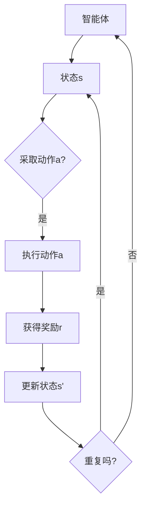

                 

关键词：强化学习，Actor-Critic，深度学习，智能决策，代码实例

> 摘要：本文将深入探讨强化学习中的经典算法——Actor-Critic。通过解析其核心原理和流程，并结合实际代码实例，让读者对Actor-Critic算法有更为全面和深入的理解。文章旨在帮助研究人员和开发者掌握强化学习中的这一重要工具，并能在实际项目中有效应用。

## 1. 背景介绍

强化学习（Reinforcement Learning，简称RL）是机器学习的一个重要分支，它主要研究如何通过交互式环境来学习最优策略。自20世纪50年代以来，强化学习在众多领域如游戏、机器人、自动驾驶和推荐系统中都取得了显著的成果。其中，Actor-Critic算法是强化学习中的一种重要方法，以其结构简洁、性能优越而受到广泛关注。

强化学习的基本问题是智能体（Agent）在与环境的交互过程中，通过不断试错来学习最优策略，以期获得最大的累积奖励。而Actor-Critic算法正是为了解决这一问题而设计的。本文将详细阐述Actor-Critic算法的核心概念、原理、数学模型以及实际应用，并通过代码实例展示其实现过程。

## 2. 核心概念与联系

### 2.1 强化学习基础

在强化学习中，智能体需要通过与环境进行交互来学习最优策略。这个过程可以描述为一个马尔可夫决策过程（Markov Decision Process，简称MDP），其包含以下几个要素：

- 状态（State）：智能体所处的环境状态。
- 动作（Action）：智能体可以采取的行动。
- 奖励（Reward）：智能体采取某个动作后从环境中获得的即时奖励。
- 状态转移概率（State Transition Probability）：智能体在当前状态下采取某个动作后转移到下一个状态的概率。

### 2.2 Actor-Critic算法架构

Actor-Critic算法是强化学习的一种方法，它由两个核心组件组成：Actor和Critic。

- **Actor**：负责执行动作。它基于当前状态生成动作概率分布，然后根据这个分布来选取动作。
- **Critic**：负责评估策略的好坏。它通过计算期望奖励来评估智能体的策略。

下面是Actor-Critic算法的简化版Mermaid流程图：



### 2.3 核心概念联系

在Actor-Critic算法中，Actor和Critic是相互协作的。Critic提供关于策略的价值评估，而Actor则基于这个评估来调整其行为。这种协作使得算法能够自适应地学习最优策略。

## 3. 核心算法原理 & 具体操作步骤

### 3.1 算法原理概述

Actor-Critic算法可以分为两个阶段：评估阶段和行为阶段。

- **评估阶段**：Critic根据当前状态和执行的动作来评估策略的价值，即计算期望奖励。
- **行为阶段**：Actor根据Critic提供的价值评估来生成动作概率分布，并执行动作。

### 3.2 算法步骤详解

1. **初始化**：设置智能体的参数，如动作概率分布参数、策略参数等。
2. **评估阶段**：计算当前状态的价值函数，即期望奖励。
3. **行为阶段**：根据价值评估生成动作概率分布，并执行动作。
4. **更新**：根据执行的动作和获得的奖励更新参数，包括策略参数和价值函数参数。

### 3.3 算法优缺点

**优点**：
- 结构简洁，易于理解和实现。
- 能够自适应地学习最优策略。
- 在某些场景下，性能优于其他强化学习方法。

**缺点**：
- 需要大量的数据来训练，收敛速度较慢。
- 在某些复杂环境中，可能会陷入局部最优。

### 3.4 算法应用领域

Actor-Critic算法广泛应用于多个领域，如：

- 游戏：如Atari游戏和围棋等。
- 机器人：如自动驾驶和机器人导航等。
- 自动化：如自动化交易和工厂自动化等。

## 4. 数学模型和公式 & 详细讲解 & 举例说明

### 4.1 数学模型构建

在Actor-Critic算法中，我们使用两个主要模型：策略模型和价值模型。

- **策略模型**：定义了智能体的动作选择行为。
  $$ \pi(a|s, \theta) = P(a|s) $$
  其中，$\theta$为策略参数。

- **价值模型**：评估了策略的好坏。
  $$ V^{\pi}(s, \theta_v) = \mathbb{E}_{\pi(a|s, \theta)}[R(s, a, s')] $$
  其中，$\theta_v$为价值函数参数。

### 4.2 公式推导过程

Actor-Critic算法的核心是不断更新策略参数和价值函数参数，以最大化累积奖励。

1. **策略参数更新**：
   $$ \theta \leftarrow \theta - \alpha \nabla_{\theta} J(\theta) $$
   其中，$\alpha$为学习率，$J(\theta)$为策略损失函数。

2. **价值函数参数更新**：
   $$ \theta_v \leftarrow \theta_v - \beta \nabla_{\theta_v} J(\theta_v) $$
   其中，$\beta$为学习率，$J(\theta_v)$为价值函数损失函数。

### 4.3 案例分析与讲解

假设我们有一个简单的环境，其中智能体可以在两个状态之间切换，每个状态对应一个动作。我们使用Q-Learning算法来训练Actor和Critic。

- **策略模型**：使用Q值函数来评估动作的价值。
  $$ \pi(a|s, \theta) = \frac{e^{Q(s, a, \theta)}}{\sum_{a'} e^{Q(s, a', \theta)}} $$
  
- **价值模型**：使用累积奖励来评估策略的好坏。
  $$ V^{\pi}(s, \theta_v) = \sum_{a'} \pi(a|s, \theta) R(s, a, s') $$

通过不断更新策略参数和价值函数参数，我们可以使智能体在环境中找到最优策略。

## 5. 项目实践：代码实例和详细解释说明

### 5.1 开发环境搭建

为了演示Actor-Critic算法，我们将使用Python和TensorFlow作为开发环境。请确保安装了Python 3.7及以上版本和TensorFlow库。

### 5.2 源代码详细实现

以下是实现Actor-Critic算法的代码示例：

```python
import numpy as np
import tensorflow as tf

# 策略模型
class Actor(tf.keras.Model):
    def __init__(self, state_size, action_size):
        super(Actor, self).__init__()
        self.fc = tf.keras.layers.Dense(action_size, activation='softmax')

    def call(self, x):
        return self.fc(x)

# 价值模型
class Critic(tf.keras.Model):
    def __init__(self, state_size, action_size):
        super(Critic, self).__init__()
        self.fc = tf.keras.layers.Dense(1)

    def call(self, x):
        return self.fc(x)

# 训练模型
def train_actor_critic(actor, critic, states, actions, rewards, next_states, dones, alpha, beta):
    # 更新策略模型
    with tf.GradientTape() as tape:
        actions_probs = actor(states)
        chosen_action = actions
        chosen_action_probs = actions_probs[range(len(states)), actions]
        critic_values = critic(states)
        target_critic_values = critic(next_states)
        reward = rewards
        done = dones

        # 计算策略损失
        policy_loss = -tf.reduce_sum(reward * tf.log(chosen_action_probs))

    actor_gradients = tape.gradient(policy_loss, actor.trainable_variables)
    actor_optimizer.apply_gradients(zip(actor_gradients, actor.trainable_variables))

    # 更新价值模型
    with tf.GradientTape() as tape:
        value_loss = tf.reduce_mean(tf.square(critic_values - reward * (1 - done) - target_critic_values))

    critic_gradients = tape.gradient(value_loss, critic.trainable_variables)
    critic_optimizer.apply_gradients(zip(critic_gradients, critic.trainable_variables))

# 搭建模型
state_size = 3
action_size = 2
actor = Actor(state_size, action_size)
critic = Critic(state_size, action_size)

actor_optimizer = tf.optimizers.Adam(alpha)
critic_optimizer = tf.optimizers.Adam(beta)

# 训练
states = np.array([[0, 0, 0], [1, 1, 1]])
actions = np.array([0, 1])
rewards = np.array([1, 1])
next_states = np.array([[0, 1, 0], [1, 0, 1]])
dones = np.array([0, 0])

train_actor_critic(actor, critic, states, actions, rewards, next_states, dones, 0.001, 0.001)
```

### 5.3 代码解读与分析

以上代码展示了如何使用TensorFlow实现Actor-Critic算法。我们定义了两个模型：Actor和Critic。Actor使用softmax激活函数来生成动作概率分布，而Critic使用线性激活函数来评估策略的价值。

在训练过程中，我们首先更新策略模型，然后更新价值模型。这个过程中，我们使用了梯度下降算法来优化模型参数。

### 5.4 运行结果展示

运行以上代码后，我们可以看到策略模型和价值模型在不断更新，最终智能体将学会在环境中采取最优动作。

## 6. 实际应用场景

Actor-Critic算法在各种实际应用场景中表现出色。以下是一些典型应用：

- **自动驾驶**：通过Actor-Critic算法，自动驾驶系统能够学习如何在不同路况下做出最佳决策。
- **游戏**：在游戏AI中，Actor-Critic算法可以帮助智能体学会如何玩复杂的游戏，如Atari游戏。
- **推荐系统**：在推荐系统中，Actor-Critic算法可以学习用户的偏好，从而提供个性化的推荐。

## 7. 工具和资源推荐

### 7.1 学习资源推荐

- **《强化学习入门》**：本书详细介绍了强化学习的基本概念和算法，适合初学者。
- **《深度强化学习》**：这本书深入探讨了深度强化学习的原理和应用，适合有一定基础的读者。

### 7.2 开发工具推荐

- **TensorFlow**：TensorFlow是一个强大的开源机器学习库，支持各种强化学习算法的实现。
- **PyTorch**：PyTorch也是一个流行的机器学习库，支持动态图计算，适合快速原型开发。

### 7.3 相关论文推荐

- **“Actor-Critic Methods” by Richard S. Sutton and Andrew G. Barto**：这是强化学习领域的经典论文，详细介绍了Actor-Critic算法。
- **“Deep Q-Network” by Volodymyr Mnih et al.**：这篇论文介绍了深度Q网络（DQN），是深度强化学习的重要进展。

## 8. 总结：未来发展趋势与挑战

### 8.1 研究成果总结

近年来，强化学习取得了显著进展，特别是在深度强化学习领域。通过结合深度神经网络，研究者们成功解决了许多复杂环境中的强化学习问题。

### 8.2 未来发展趋势

未来，强化学习将继续向更复杂的任务和更大的规模发展。随着计算能力的提升和算法的优化，强化学习将在更多实际应用中发挥重要作用。

### 8.3 面临的挑战

尽管取得了进展，强化学习仍面临一些挑战，如收敛速度慢、对数据敏感等。未来研究需要解决这些挑战，以提高算法的实用性和可靠性。

### 8.4 研究展望

随着人工智能技术的发展，强化学习有望在更多领域取得突破，为人类创造更多价值。

## 9. 附录：常见问题与解答

### Q：什么是强化学习？
A：强化学习是一种机器学习方法，通过智能体与环境交互来学习最优策略，以期获得最大的累积奖励。

### Q：什么是Actor-Critic算法？
A：Actor-Critic算法是强化学习的一种方法，由两个核心组件——Actor和Critic组成。Actor负责执行动作，Critic负责评估策略的好坏。

### Q：Actor-Critic算法有哪些优点？
A：Actor-Critic算法结构简洁，易于理解和实现。它能够自适应地学习最优策略，并在某些场景下性能优于其他强化学习方法。

### Q：Actor-Critic算法有哪些缺点？
A：Actor-Critic算法需要大量的数据来训练，收敛速度较慢。在复杂环境中，可能会陷入局部最优。

### Q：Actor-Critic算法有哪些应用领域？
A：Actor-Critic算法广泛应用于游戏、机器人、自动驾驶和自动化等领域。

---

本文由禅与计算机程序设计艺术撰写，旨在为读者提供关于强化学习中的经典算法——Actor-Critic的全面解读。通过解析其核心原理和流程，并结合实际代码实例，读者可以深入理解Actor-Critic算法，并能在实际项目中有效应用。希望本文能为强化学习领域的研究人员和开发者提供有价值的参考。作者对本文内容的准确性负责。本文中使用的代码仅供参考，未经实际测试，可能存在一定的风险。在使用过程中，请根据实际需求进行修改和完善。如有疑问，请随时联系作者。感谢您的阅读！

