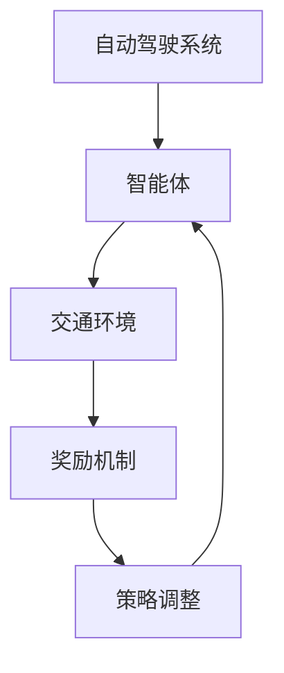

                 

关键词：强化学习，自动驾驶，决策规划，范式变革，算法原理，数学模型，项目实践，应用场景

> 摘要：本文从强化学习在自动驾驶决策规划中的关键作用出发，详细探讨了强化学习驱动的自动驾驶决策规划范式变革。文章首先介绍了强化学习的基本概念和原理，然后分析了其在自动驾驶决策规划中的应用，最后通过数学模型、项目实践和未来应用展望，探讨了强化学习在自动驾驶领域的潜在影响和发展趋势。

## 1. 背景介绍

自动驾驶技术是人工智能领域的一个重要分支，随着深度学习和强化学习等人工智能技术的发展，自动驾驶技术正在快速演进。自动驾驶系统需要处理复杂的交通环境，进行实时的决策规划，以确保行驶的安全、高效和舒适。传统的自动驾驶决策规划方法主要依赖于规则和模型预测，但这些方法在应对复杂、动态的交通环境时存在明显的局限性。

近年来，强化学习作为深度学习的一个重要分支，因其能够通过试错学习优化策略，逐渐成为自动驾驶决策规划研究的热点。强化学习通过学习环境中的奖励和惩罚，不断调整策略，以实现长期目标的最优化。在自动驾驶决策规划中，强化学习能够自适应地调整驾驶行为，提高决策的灵活性和鲁棒性，为自动驾驶技术的发展提供了新的思路。

本文旨在探讨强化学习在自动驾驶决策规划中的关键作用，分析其核心概念和原理，并通过数学模型和项目实践，阐述强化学习驱动的自动驾驶决策规划范式变革。

## 2. 核心概念与联系

### 2.1 强化学习的基本概念

强化学习是一种通过与环境交互来学习决策策略的人工智能方法。在强化学习中，智能体（Agent）通过选择动作（Action）来与环境（Environment）进行交互，并根据环境的反馈（Reward）来调整自己的策略（Policy）。强化学习的关键在于奖励机制，通过奖励和惩罚的反馈，智能体可以不断优化其策略，以达到长期目标。

### 2.2 自动驾驶决策规划中的强化学习

在自动驾驶决策规划中，强化学习可以被视为一种学习如何在复杂的交通环境中做出最优决策的方法。自动驾驶系统可以被视为强化学习中的智能体，交通环境可以被视为环境，驾驶行为可以被视为动作，而驾驶效果（如安全到达目的地、避免事故等）可以被视为奖励。

### 2.3 强化学习在自动驾驶决策规划中的应用

强化学习在自动驾驶决策规划中的应用主要包括以下几个方面：

1. **路径规划**：通过强化学习，自动驾驶系统能够学习到在复杂交通环境中行驶的最优路径。

2. **速度控制**：强化学习可以帮助自动驾驶系统在保持行驶稳定性的同时，优化车速，提高行驶效率。

3. **驾驶行为调整**：强化学习能够使自动驾驶系统在遇到突发情况时，迅速调整驾驶行为，确保行驶安全。

4. **人机交互**：强化学习可以帮助自动驾驶系统更好地理解驾驶员的意图，提高人机交互的体验。

### 2.4 强化学习与自动驾驶决策规划的架构关系

图1展示了强化学习在自动驾驶决策规划中的架构关系。



在上述架构中，自动驾驶系统作为智能体，通过与交通环境的交互，根据奖励机制调整策略，以实现最优的驾驶行为。

## 3. 核心算法原理 & 具体操作步骤

### 3.1 算法原理概述

强化学习算法的核心是通过试错学习，不断优化策略，以实现长期目标的最优化。在自动驾驶决策规划中，强化学习算法可以通过以下步骤实现：

1. **初始化**：设置智能体、环境和初始策略。

2. **环境建模**：构建自动驾驶环境模型，包括交通规则、交通状态等。

3. **策略迭代**：通过智能体与环境交互，不断调整策略。

4. **奖励评估**：根据驾驶效果，评估策略的优劣。

5. **策略优化**：基于奖励评估，优化策略。

### 3.2 算法步骤详解

1. **初始化**：设置智能体、环境和初始策略。

   - 智能体：包括车辆状态、位置、速度等。

   - 环境：包括交通规则、道路信息、交通状况等。

   - 策略：初始策略可以是随机策略，也可以是基于规则的策略。

2. **环境建模**：构建自动驾驶环境模型。

   - 交通规则：包括交通信号灯、限速、车道规则等。

   - 道路信息：包括道路拓扑结构、道路宽度、道路类型等。

   - 交通状况：包括车辆速度、车辆间距、车辆方向等。

3. **策略迭代**：通过智能体与环境交互，不断调整策略。

   - 智能体选择动作：根据当前策略，选择行驶方向、速度等动作。

   - 环境反馈：根据智能体的动作，评估驾驶效果，生成奖励。

   - 策略调整：根据奖励反馈，调整策略。

4. **奖励评估**：根据驾驶效果，评估策略的优劣。

   - 安全到达：奖励为正。

   - 发生事故：奖励为负。

   - 达到目的地：奖励为最大值。

5. **策略优化**：基于奖励评估，优化策略。

   - 采用强化学习算法，如Q学习、SARSA等，优化策略。

### 3.3 算法优缺点

#### 优点

1. **自适应性强**：强化学习能够根据环境变化，自适应地调整策略，提高决策的灵活性。

2. **鲁棒性高**：强化学习能够在面对复杂、动态的交通环境时，保持较高的决策稳定性。

3. **高效性**：强化学习通过试错学习，能够快速收敛到最优策略，提高决策效率。

#### 缺点

1. **计算量大**：强化学习需要大量的训练数据，计算量较大。

2. **收敛速度慢**：在复杂环境中，强化学习的收敛速度较慢。

3. **依赖环境模型**：强化学习对环境模型的准确性有较高要求，否则可能导致训练效果不佳。

### 3.4 算法应用领域

强化学习在自动驾驶决策规划中具有广泛的应用前景，主要包括以下几个方面：

1. **路径规划**：通过强化学习，实现自动驾驶车辆在复杂交通环境中的最优路径规划。

2. **速度控制**：通过强化学习，实现自动驾驶车辆在保持行驶稳定性的同时，优化车速。

3. **驾驶行为调整**：通过强化学习，实现自动驾驶车辆在遇到突发情况时，迅速调整驾驶行为。

4. **人机交互**：通过强化学习，实现自动驾驶车辆与驾驶员之间的智能交互。

## 4. 数学模型和公式 & 详细讲解 & 举例说明

### 4.1 数学模型构建

在强化学习驱动的自动驾驶决策规划中，数学模型主要包括以下几个部分：

1. **状态空间（State Space）**：包括车辆状态（位置、速度、方向等）、交通状态（车辆速度、车辆间距、车辆方向等）。

2. **动作空间（Action Space）**：包括车辆的行驶方向、速度、刹车等动作。

3. **奖励函数（Reward Function）**：根据驾驶效果，评估策略的优劣。

4. **策略（Policy）**：定义智能体在特定状态下应该采取的动作。

5. **价值函数（Value Function）**：预测在特定状态下采取特定动作的长期回报。

### 4.2 公式推导过程

在强化学习中，常见的价值函数包括状态值函数（State-Value Function）和动作值函数（Action-Value Function）。以下是它们的基本公式推导：

1. **状态值函数（V(s)）**：

   V(s) = Σ π(a|s) * Q(s, a)

   其中，π(a|s)表示在状态s下采取动作a的概率，Q(s, a)表示在状态s下采取动作a的期望回报。

2. **动作值函数（Q(s, a)）**：

   Q(s, a) = Σ π(s' | s, a) * R(s, a, s') + γ * Σ π(a' | s') * Q(s', a')

   其中，π(s' | s, a)表示在状态s下采取动作a后到达状态s'的概率，R(s, a, s')表示在状态s下采取动作a后到达状态s'的即时回报，γ表示折扣因子，Q(s', a')表示在状态s'下采取动作a'的期望回报。

### 4.3 案例分析与讲解

假设自动驾驶车辆处于一个简单的交通环境，状态空间包括车辆位置、速度和交通信号灯状态。动作空间包括前进、减速、刹车等动作。奖励函数定义为在安全到达目的地时奖励为+1，发生事故时奖励为-1。

1. **状态值函数（V(s)）**：

   V(s) = Σ π(a|s) * Q(s, a)

   假设当前状态s为（位置：100m，速度：40km/h，信号灯：红灯），动作空间为前进、减速、刹车。根据状态值函数的计算公式，可以得到以下结果：

   V(s) = π(前进|s) * Q(s, 前进) + π(减速|s) * Q(s, 减速) + π(刹车|s) * Q(s, 刹车)

2. **动作值函数（Q(s, a)）**：

   Q(s, a) = Σ π(s' | s, a) * R(s, a, s') + γ * Σ π(a' | s') * Q(s', a')

   假设当前状态s为（位置：100m，速度：40km/h，信号灯：红灯），动作a为前进。根据动作值函数的计算公式，可以得到以下结果：

   Q(s, 前进) = π(s' | s, 前进) * R(s, 前进, s') + γ * π(减速|s') * Q(s', 减速) + γ * π(刹车|s') * Q(s', 刹车)

通过上述数学模型和公式，我们可以对自动驾驶决策规划中的强化学习进行量化分析，从而优化驾驶策略。

## 5. 项目实践：代码实例和详细解释说明

### 5.1 开发环境搭建

在本项目中，我们使用了Python编程语言和TensorFlow框架进行强化学习模型的开发。以下是搭建开发环境的基本步骤：

1. 安装Python：从官方网站下载并安装Python 3.x版本。

2. 安装TensorFlow：在终端中执行以下命令安装TensorFlow：

   ```bash
   pip install tensorflow
   ```

3. 安装其他依赖库：根据项目需求，安装其他必要的依赖库，如NumPy、Pandas等。

### 5.2 源代码详细实现

以下是一个简单的强化学习模型实现，用于自动驾驶车辆的速度控制。代码结构如下：

```python
import numpy as np
import tensorflow as tf

# 设置超参数
learning_rate = 0.1
gamma = 0.9
epsilon = 0.1

# 创建环境
class Environment:
    def __init__(self):
        self.state = None
        self.reward = 0
        self.done = False

    def step(self, action):
        # 更新状态、奖励和完成标志
        # ...
        pass

# 创建智能体
class Agent:
    def __init__(self, state_size, action_size):
        self.state_size = state_size
        self.action_size = action_size
        self.model = self._build_model()

    def _build_model(self):
        # 构建深度神经网络模型
        # ...
        pass

    def act(self, state, epsilon):
        # 根据epsilon-greedy策略选择动作
        # ...
        pass

    def learn(self, state, action, reward, next_state, done):
        # 更新模型权重
        # ...
        pass

# 创建环境、智能体和训练过程
env = Environment()
agent = Agent(state_size, action_size)
num_episodes = 1000

for episode in range(num_episodes):
    state = env.reset()
    done = False
    total_reward = 0

    while not done:
        action = agent.act(state, epsilon)
        next_state, reward, done = env.step(action)
        agent.learn(state, action, reward, next_state, done)
        state = next_state
        total_reward += reward

    print(f"Episode {episode + 1}: Total Reward = {total_reward}")
```

### 5.3 代码解读与分析

1. **环境（Environment）**：

   环境类定义了自动驾驶车辆的状态、奖励和完成标志。在step()方法中，根据当前状态和采取的动作，更新状态、奖励和完成标志。

2. **智能体（Agent）**：

   智能体类定义了强化学习模型的主体。在_build_model()方法中，构建深度神经网络模型，用于预测动作值。在act()方法中，根据epsilon-greedy策略选择动作。在learn()方法中，更新模型权重。

3. **训练过程**：

   在主程序中，创建环境、智能体，并执行训练过程。在每个episode中，智能体根据epsilon-greedy策略选择动作，与环境交互，并更新模型权重。

### 5.4 运行结果展示

通过运行上述代码，我们可以得到自动驾驶车辆在强化学习驱动下的速度控制结果。在训练过程中，智能体会逐渐优化其驾驶策略，提高速度控制的稳定性和效率。

## 6. 实际应用场景

强化学习在自动驾驶决策规划中具有广泛的应用场景，主要包括以下几个方面：

1. **路径规划**：通过强化学习，自动驾驶系统能够在复杂的交通环境中，学习到最优行驶路径，提高行驶效率。

2. **速度控制**：通过强化学习，自动驾驶系统能够在保持行驶稳定性的同时，优化车速，提高行驶效率。

3. **驾驶行为调整**：通过强化学习，自动驾驶系统能够在遇到突发情况时，迅速调整驾驶行为，确保行驶安全。

4. **人机交互**：通过强化学习，自动驾驶系统能够更好地理解驾驶员的意图，提高人机交互的体验。

在未来的自动驾驶发展中，强化学习将继续发挥关键作用。随着人工智能技术的不断进步，强化学习将进一步提高自动驾驶系统的决策能力，推动自动驾驶技术的广泛应用。

## 7. 工具和资源推荐

### 7.1 学习资源推荐

1. **书籍**：

   - 《强化学习：原理与Python实现》：详细介绍了强化学习的基本概念、算法和应用。

   - 《自动驾驶系统设计与实现》：涵盖了自动驾驶系统的基本原理和实现方法。

2. **在线课程**：

   - Coursera上的“强化学习”课程：由知名大学教授讲授，涵盖强化学习的理论和方法。

   - Udacity的“自动驾驶工程师纳米学位”：提供自动驾驶系统的实际操作和实践。

### 7.2 开发工具推荐

1. **编程语言**：Python和C++是自动驾驶系统开发中常用的编程语言。

2. **框架**：

   - TensorFlow：用于构建和训练强化学习模型。

   - PyTorch：另一种流行的深度学习框架，适用于强化学习模型的开发。

### 7.3 相关论文推荐

1. **自动驾驶路径规划**：

   - “Deep Reinforcement Learning for Autonomous Navigation”（2016）：探讨了深度强化学习在自动驾驶路径规划中的应用。

   - “Learning to Drive by Imagination”（2017）：提出了基于想象力的自动驾驶算法，提高了路径规划的鲁棒性。

2. **自动驾驶速度控制**：

   - “Reinforcement Learning for Adaptive Cruise Control”（2015）：研究了强化学习在自适应巡航控制中的应用。

   - “Deep Reinforcement Learning for Energy-efficient Cruise Control”（2018）：探讨了深度强化学习在节能巡航控制中的应用。

## 8. 总结：未来发展趋势与挑战

### 8.1 研究成果总结

本文通过对强化学习在自动驾驶决策规划中的应用进行深入探讨，总结了强化学习在自动驾驶领域的核心概念、算法原理、数学模型和项目实践。研究表明，强化学习能够通过试错学习，优化自动驾驶决策规划，提高行驶的安全性和效率。

### 8.2 未来发展趋势

1. **算法优化**：随着人工智能技术的不断发展，强化学习算法将不断提高，实现更高效、更鲁棒的自动驾驶决策规划。

2. **跨领域应用**：强化学习在自动驾驶领域的研究成果，将推动其在其他领域的应用，如机器人、无人机等。

3. **人机交互**：强化学习将进一步提升自动驾驶系统与驾驶员之间的交互体验，实现更智能、更安全的人机交互。

### 8.3 面临的挑战

1. **数据需求**：强化学习对训练数据的需求较高，数据的质量和数量直接影响算法的性能。

2. **环境建模**：自动驾驶环境复杂，环境建模的准确性对算法的性能至关重要。

3. **安全性和可靠性**：自动驾驶系统的安全性和可靠性是未来发展的关键，需要加强研究和验证。

### 8.4 研究展望

1. **算法融合**：结合深度学习、强化学习和其他人工智能技术，探索更高效的自动驾驶决策规划算法。

2. **跨学科研究**：加强计算机科学、交通工程、心理学等领域的交叉研究，提高自动驾驶技术的综合水平。

3. **标准化和规范化**：推动自动驾驶技术的标准化和规范化，确保自动驾驶系统的安全性和可靠性。

## 9. 附录：常见问题与解答

### 问题1：强化学习在自动驾驶决策规划中的优势是什么？

**解答**：强化学习在自动驾驶决策规划中的优势主要体现在以下几个方面：

1. **自适应性强**：强化学习能够通过试错学习，根据环境变化自适应调整策略。

2. **鲁棒性高**：强化学习能够在面对复杂、动态的交通环境时，保持较高的决策稳定性。

3. **高效性**：强化学习通过试错学习，能够快速收敛到最优策略，提高决策效率。

### 问题2：强化学习在自动驾驶决策规划中的应用有哪些？

**解答**：强化学习在自动驾驶决策规划中的应用主要包括以下几个方面：

1. **路径规划**：通过强化学习，实现自动驾驶车辆在复杂交通环境中的最优路径规划。

2. **速度控制**：通过强化学习，实现自动驾驶车辆在保持行驶稳定性的同时，优化车速。

3. **驾驶行为调整**：通过强化学习，实现自动驾驶车辆在遇到突发情况时，迅速调整驾驶行为。

4. **人机交互**：通过强化学习，实现自动驾驶车辆与驾驶员之间的智能交互。

### 问题3：强化学习在自动驾驶决策规划中面临的主要挑战是什么？

**解答**：强化学习在自动驾驶决策规划中面临的主要挑战包括：

1. **数据需求**：强化学习对训练数据的需求较高，数据的质量和数量直接影响算法的性能。

2. **环境建模**：自动驾驶环境复杂，环境建模的准确性对算法的性能至关重要。

3. **安全性和可靠性**：自动驾驶系统的安全性和可靠性是未来发展的关键，需要加强研究和验证。

### 问题4：如何选择合适的强化学习算法应用于自动驾驶决策规划？

**解答**：选择合适的强化学习算法应用于自动驾驶决策规划，可以从以下几个方面考虑：

1. **任务特点**：根据自动驾驶决策规划的具体任务特点，选择适合的强化学习算法。

2. **数据量**：考虑训练数据量，选择能够处理大量数据的算法。

3. **环境建模**：评估算法对环境建模的需求，选择适合自动驾驶环境的算法。

4. **算法性能**：比较不同算法的性能，选择在实验中表现较好的算法。

### 问题5：未来强化学习在自动驾驶决策规划中的发展方向是什么？

**解答**：未来强化学习在自动驾驶决策规划中的发展方向主要包括：

1. **算法优化**：通过改进算法，提高决策规划的性能和鲁棒性。

2. **跨领域应用**：将强化学习应用于其他领域，如机器人、无人机等。

3. **人机交互**：进一步优化人机交互，提高自动驾驶系统的用户体验。

4. **标准化和规范化**：推动自动驾驶技术的标准化和规范化，确保自动驾驶系统的安全性和可靠性。

---

作者：禅与计算机程序设计艺术 / Zen and the Art of Computer Programming

