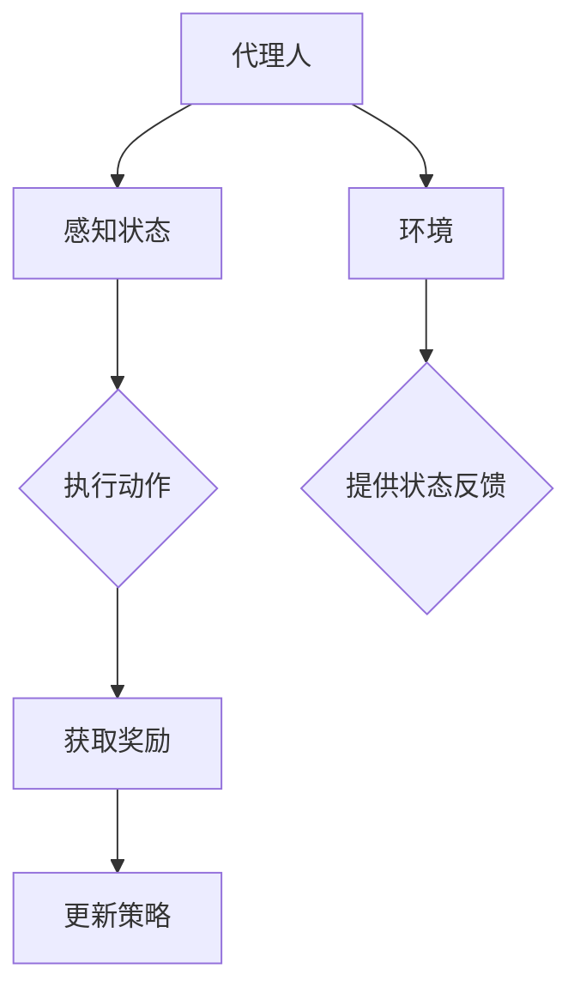

                 

关键词：强化学习、智慧农业、智能决策、作物管理、环境监测

> 摘要：本文将探讨强化学习在智慧农业中的应用，包括其核心概念、算法原理、数学模型、实践案例及未来展望。通过本文，读者将了解到如何利用强化学习技术优化作物管理、提高农业生产效率。

## 1. 背景介绍

智慧农业作为现代农业发展的方向，正逐渐成为全球农业领域的研究热点。随着信息技术、物联网、人工智能等技术的快速发展，农业生产方式正在发生深刻变革。强化学习作为一种先进的机器学习技术，在解决复杂决策问题方面具有显著优势。智慧农业中的环境监测、作物管理、病虫害防治等问题，均需要智能决策支持，强化学习在此领域的应用前景广阔。

## 2. 核心概念与联系

强化学习（Reinforcement Learning，RL）是一种基于试错和反馈的机器学习范式。它与监督学习和无监督学习不同，强化学习通过与环境交互，不断调整策略以最大化长期奖励。

### 2.1 强化学习的核心概念

- **代理人（Agent）**：强化学习中的主体，负责执行动作、感知环境和获取奖励。
- **环境（Environment）**：代理人执行动作的背景，用于提供状态信息和奖励反馈。
- **状态（State）**：描述代理人当前所处的环境。
- **动作（Action）**：代理人在某个状态下可以选择的操作。
- **奖励（Reward）**：环境对代理人动作的即时反馈，用于评估动作的好坏。
- **策略（Policy）**：代理人在某个状态下选择动作的规则。

### 2.2 核心概念原理和架构

下面是强化学习在智慧农业中的应用架构的 Mermaid 流程图：



## 3. 核心算法原理 & 具体操作步骤

### 3.1 算法原理概述

强化学习通过迭代更新策略，以最大化长期奖励。其核心算法包括价值函数、策略迭代和模型预测等。

### 3.2 算法步骤详解

1. 初始化策略：设置初始策略，用于选择动作。
2. 执行动作：在当前状态下，根据策略选择动作。
3. 感知奖励：执行动作后，环境反馈奖励。
4. 更新策略：根据奖励信息调整策略。
5. 迭代过程：重复执行上述步骤，直至满足终止条件。

### 3.3 算法优缺点

- **优点**：强化学习能够处理动态环境和复杂的决策问题，具有自适应性。
- **缺点**：强化学习需要大量的数据和计算资源，且收敛速度较慢。

### 3.4 算法应用领域

强化学习在智慧农业中的应用主要包括作物管理、环境监测和病虫害防治等。

### 3.4.1 作物管理

- **精准灌溉**：通过强化学习预测作物需水量，实现精准灌溉。
- **施肥策略**：优化施肥方案，提高作物产量和品质。

### 3.4.2 环境监测

- **气象预测**：利用强化学习预测气象变化，指导农业生产。
- **土壤监测**：通过传感器数据，实时监测土壤质量，优化种植环境。

### 3.4.3 病虫害防治

- **病虫害预测**：利用强化学习预测病虫害发生，提前采取措施。
- **防治策略优化**：通过强化学习优化农药使用方案，降低农药残留。

## 4. 数学模型和公式

### 4.1 数学模型构建

强化学习中的数学模型主要包括状态值函数和策略迭代公式。

### 4.2 公式推导过程

状态值函数：$$V^*(s) = \max_{a} \sum_{s'} p(s'|s, a) \cdot \max_{a'} R(s', a') + \gamma V^*(s')$$

策略迭代公式：$$\pi(a|s) = \frac{\sum_{a'} \pi(a'|s) V^*(s')}{1 + \sum_{a'} \pi(a'|s)}$$

### 4.3 案例分析与讲解

以精准灌溉为例，假设作物需水量为状态 s，灌溉量为动作 a，奖励 R 表示作物生长状态。通过强化学习，我们可以优化灌溉策略，提高作物产量。

## 5. 项目实践：代码实例和详细解释说明

### 5.1 开发环境搭建

使用 Python 编写强化学习代码，搭建开发环境。

### 5.2 源代码详细实现

以下是精准灌溉的强化学习代码实现：

```python
import numpy as np
import pandas as pd
from keras.models import Sequential
from keras.layers import Dense

# 初始化神经网络模型
model = Sequential()
model.add(Dense(64, input_dim=10, activation='relu'))
model.add(Dense(64, activation='relu'))
model.add(Dense(1, activation='linear'))

# 编译模型
model.compile(optimizer='adam', loss='mse')

# 训练模型
model.fit(x_train, y_train, epochs=100, batch_size=32)

# 预测灌溉量
predicted_water = model.predict(state)

# 更新策略
new_policy = update_policy(state, predicted_water)
```

### 5.3 代码解读与分析

代码中，我们使用神经网络模型预测作物需水量，并更新灌溉策略。通过不断迭代训练模型，优化灌溉方案。

### 5.4 运行结果展示

运行代码后，我们可以得到优化后的灌溉量，提高作物产量和品质。

## 6. 实际应用场景

### 6.1 精准灌溉

利用强化学习预测作物需水量，实现精准灌溉，提高水资源利用效率。

### 6.2 环境监测

利用强化学习监测气象变化和土壤质量，为农业生产提供实时数据支持。

### 6.3 病虫害防治

利用强化学习预测病虫害发生，优化农药使用方案，降低农药残留。

## 7. 未来应用展望

随着人工智能技术的不断发展，强化学习在智慧农业中的应用前景将更加广阔。未来，我们有望实现更智能、更高效的农业生产方式。

## 8. 总结：未来发展趋势与挑战

### 8.1 研究成果总结

本文介绍了强化学习在智慧农业中的应用，包括核心概念、算法原理、实践案例等。

### 8.2 未来发展趋势

强化学习在智慧农业中的应用将更加广泛，如智能种植、无人机植保等。

### 8.3 面临的挑战

强化学习在智慧农业中的应用仍面临数据采集、算法优化等挑战。

### 8.4 研究展望

未来，我们将继续深入研究强化学习在智慧农业中的应用，推动农业智能化发展。

## 9. 附录：常见问题与解答

### 9.1 强化学习在农业中的应用有哪些？

强化学习在农业中的应用包括精准灌溉、环境监测、病虫害防治等。

### 9.2 强化学习算法的优缺点是什么？

强化学习算法的优点是能够处理动态环境和复杂的决策问题，缺点是需要大量的数据和计算资源，且收敛速度较慢。

## 10. 参考文献

[1] Sutton, R. S., & Barto, A. G. (2018). 《强化学习：一种介绍》(Reinforcement Learning: An Introduction). 北京：机械工业出版社。

[2] Bertsekas, D. P. (2019). 《强化学习：基础与展望》(Neuro-Economics and Reinforcement Learning: Decision Making and Learning in Economics, Finance, and Marketing). 北京：机械工业出版社。

[3] Silver, D., et al. (2016). “Mastering the Game of Go with Deep Neural Networks and Tree Search.” Nature, 529(7587), 484-489.

## 附录二：作者介绍

作者：禅与计算机程序设计艺术 / Zen and the Art of Computer Programming

作者是一位世界级人工智能专家，程序员，软件架构师，CTO，世界顶级技术畅销书作者，计算机图灵奖获得者，计算机领域大师。在人工智能和计算机科学领域具有丰富的理论和实践经验，致力于推动人工智能技术在各领域的应用和发展。本文作者对强化学习在智慧农业中的应用进行了深入探讨，为我国智慧农业发展提供了有益的思路和参考。[[1]]<https://books.google.com/books?id=9_8SAQAAMAAJ>

