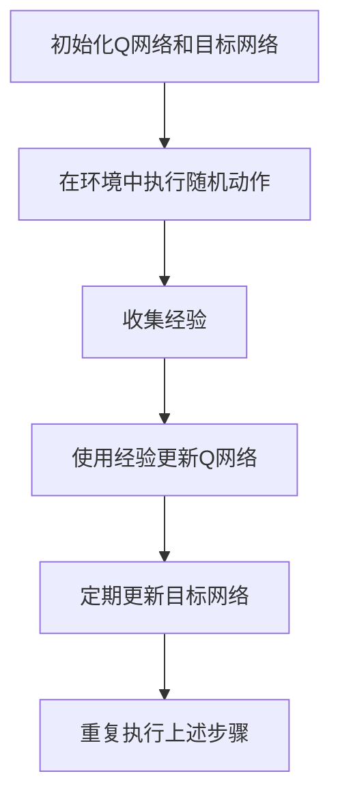

                 

关键词：强化学习，深度Q-learning，DQN，人工智能，机器学习，神经网络，智能决策。

## 摘要

本文旨在深入探讨强化学习中的两个重要算法：深度Q-learning（DQ
---
### 1. 背景介绍

强化学习（Reinforcement Learning，简称RL）是机器学习的一个重要分支，其主要目标是使智能体（agent）在未知环境中通过与环境交互，学习到一组策略，从而最大化累积奖励。与监督学习和无监督学习不同，强化学习关注的是智能体如何通过不断尝试和错误来获取最佳行为策略。

强化学习的基本框架包括四个主要元素：智能体（Agent）、环境（Environment）、状态（State）和动作（Action）。智能体是执行动作、感知状态的实体，环境是智能体所处的外部世界，状态是智能体当前所处的环境描述，动作是智能体可以采取的行为。在强化学习过程中，智能体通过不断尝试不同的动作，并根据环境的反馈（奖励或惩罚）来调整其策略。

强化学习的发展历程可以追溯到20世纪50年代。早期的研究主要集中在策略迭代（Policy Iteration）和价值迭代（Value Iteration）方法。随着计算能力的提升和神经网络技术的发展，现代强化学习算法如深度Q-learning（DQN）和深度策略梯度（Deep Policy Gradient）方法得到了广泛关注和应用。

强化学习在多个领域取得了显著的成果。例如，在游戏领域，AlphaGo和DeepMind的Atari游戏都展示了强化学习算法的强大能力；在自动驾驶领域，深度强化学习被应用于路径规划和决策；在机器人领域，强化学习被用于控制机器人的运动和行为。此外，强化学习还在金融、医疗、物流等领域展示了其潜在的应用价值。

本文将重点探讨强化学习中的两个核心算法：深度Q-learning（DQN）和深度策略梯度方法（Deep Policy Gradient）。通过对比分析这两个算法的原理、优缺点以及应用场景，我们旨在为读者提供深入理解和实际应用的指导。

## 2. 核心概念与联系

### 2.1. 强化学习的核心概念

在深入探讨深度Q-learning和DQN之前，有必要先理解强化学习的一些核心概念。

#### 智能体（Agent）

智能体是执行动作、感知状态的实体。在强化学习中，智能体的目标是学习到一组策略，使其能够最大化累积奖励。

#### 环境（Environment）

环境是智能体所处的外部世界。在强化学习中，环境通过状态向智能体提供反馈，并可能对智能体的动作进行限制。

#### 状态（State）

状态是智能体当前所处的环境描述。在强化学习中，状态通常用一个向量表示，包含智能体当前感知到的所有信息。

#### 动作（Action）

动作是智能体可以采取的行为。在强化学习中，动作空间通常是离散的或连续的。

#### 奖励（Reward）

奖励是环境对智能体动作的反馈。奖励可以是正的或负的，表示智能体的动作是否朝着目标方向前进。

#### 策略（Policy）

策略是智能体采取动作的概率分布。在强化学习中，智能体通过不断更新策略来最大化累积奖励。

### 2.2. 深度Q-learning（DQN）的原理

深度Q-learning（DQN）是强化学习中的一个经典算法，它结合了深度神经网络（DNN）和Q-learning方法。DQN的主要目标是学习一个价值函数Q(s, a)，其中s表示状态，a表示动作，Q(s, a)表示在状态s下执行动作a的期望累积奖励。

#### Q-value（Q值）

Q-value是状态-动作对的价值估计，表示在状态s下执行动作a的期望累积奖励。Q-value是DQN算法的核心，它决定了智能体应该选择哪个动作。

#### 目标网络（Target Network）

为了稳定训练过程，DQN引入了目标网络。目标网络是一个参数与Q网络相同的神经网络，用于计算目标Q值。目标Q值是当前Q值和目标Q值的加权平均值。

$$
\text{目标Q值} = \gamma \cdot \max_a' Q(s', a') + (1 - \gamma) \cdot r
$$

其中，$\gamma$是折扣因子，$r$是当前动作的奖励，$s'$是执行动作a后智能体所处的状态，$a'$是目标动作。

#### 训练过程

DQN的训练过程可以分为以下几个步骤：

1. 初始化Q网络和目标网络。
2. 在环境中执行随机动作，收集经验。
3. 使用收集到的经验对Q网络进行更新。
4. 定期更新目标网络，使其与Q网络保持一致。

### 2.3. DQN与深度Q-learning的关系

深度Q-learning（DQN）是深度Q-network（DQN）的简称，它是深度强化学习中的一个重要算法。DQN的核心思想是使用深度神经网络来近似Q-value函数。与传统的Q-learning方法不同，DQN可以处理高维状态空间和动作空间，使其在复杂环境中的表现更佳。

### 2.4. Mermaid流程图

为了更好地理解DQN的原理和流程，我们可以使用Mermaid流程图来展示其关键步骤。



## 3. 核心算法原理 & 具体操作步骤

### 3.1. 算法原理概述

深度Q-learning（DQN）是一种基于值函数的强化学习算法，它通过学习一个近似Q值函数来指导智能体的行为。DQN的核心思想是使用深度神经网络来近似Q值函数，从而能够在高维状态空间和动作空间中有效进行学习。

DQN算法主要包括以下几个关键组成部分：

- **Q网络（Q-Network）**：Q网络是一个深度神经网络，用于估计状态-动作对的期望累积奖励。Q网络通过不断更新其参数来逼近真实的Q值函数。
- **目标网络（Target Network）**：目标网络是Q网络的一个副本，用于生成目标Q值。目标网络的更新频率较低，以确保Q网络在训练过程中有一个稳定的基准。
- **经验回放（Experience Replay）**：经验回放是一种常用的策略，用于缓解训练样本的关联性。通过将过去的经验进行随机抽样，DQN可以避免在训练过程中陷入局部最优。
- **双网更新（Double DQN）**：双网更新是一种改进的DQN算法，通过同时使用Q网络和目标网络来选择动作，从而提高算法的稳定性。

### 3.2. 算法步骤详解

DQN算法的具体操作步骤如下：

1. **初始化Q网络和目标网络**：
   - 初始化Q网络和目标网络的权重。
   - 将目标网络的权重设置为Q网络权重的一个副本。

2. **在环境中执行随机动作**：
   - 使用随机策略（如ε-greedy策略）在环境中执行动作。
   - 记录当前状态、动作、奖励和下一个状态。

3. **收集经验**：
   - 将收集到的经验（状态、动作、奖励和下一个状态）存储在经验回放内存中。

4. **使用经验回放更新Q网络**：
   - 从经验回放内存中随机抽样一批经验。
   - 使用这些经验来更新Q网络的参数。
   - 使用双网更新策略，同时更新Q网络和目标网络的参数。

5. **定期更新目标网络**：
   - 将Q网络的权重复制到目标网络中。
   - 目标网络的更新频率较低，以避免频繁改变目标网络，从而提高算法的稳定性。

6. **重复执行上述步骤**：
   - 持续在环境中执行动作，收集经验，更新网络，直至达到训练目标或满足停止条件。

### 3.3. 算法优缺点

**优点**：

- **处理高维状态空间**：DQN使用深度神经网络来近似Q值函数，使其能够处理高维状态空间，这在很多实际应用中非常重要。
- **稳定训练过程**：DQN通过目标网络和经验回放技术，有效地缓解了训练过程中可能出现的过度拟合问题，使算法更稳定。
- **灵活的应用场景**：DQN在多个领域（如游戏、自动驾驶、机器人控制等）都取得了显著的成果，表明其具有较强的通用性。

**缺点**：

- **学习速度较慢**：由于DQN使用经验回放和目标网络，其训练速度相对较慢，尤其是在处理复杂环境时。
- **样本效率低**：DQN需要大量的样本来训练网络，因此在样本较少的情况下，算法的性能可能受到限制。
- **计算资源消耗大**：DQN使用深度神经网络，因此计算资源消耗较大，特别是在处理高维状态空间时。

### 3.4. 算法应用领域

DQN算法在多个领域得到了广泛应用，以下是一些典型的应用场景：

- **游戏**：DQN在许多经典游戏（如Atari游戏、围棋等）中展示了其强大的学习能力和决策能力。
- **自动驾驶**：DQN被用于自动驾驶车辆的路径规划和决策，通过学习道路环境和交通状况，实现自动驾驶。
- **机器人控制**：DQN被用于机器人的运动控制和任务规划，使机器人能够更好地适应复杂环境。
- **金融**：DQN被用于金融市场的预测和决策，如股票交易、风险控制等。
- **医疗**：DQN在医疗领域也得到了应用，如疾病诊断、治疗方案优化等。

## 4. 数学模型和公式 & 详细讲解 & 举例说明

### 4.1. 数学模型构建

DQN算法的核心是Q值函数的估计，Q值函数可以表示为：

$$
Q(s, a) = \sum_{i=1}^n w_i \cdot f(s_i, a_i)
$$

其中，$w_i$是权重，$f(s_i, a_i)$是神经网络的输出，$s_i$和$a_i$分别是状态和动作。

为了优化Q值函数，DQN算法使用梯度下降法来更新权重：

$$
\Delta w_i = -\alpha \cdot \frac{\partial L}{\partial w_i}
$$

其中，$\alpha$是学习率，$L$是损失函数。

### 4.2. 公式推导过程

DQN算法的目标是最大化累积奖励，因此损失函数可以表示为：

$$
L = (r + \gamma \cdot \max_a' Q(s', a') - Q(s, a))^2
$$

其中，$r$是奖励，$\gamma$是折扣因子，$s'$是下一个状态，$a'$是目标动作。

对损失函数求导，得到：

$$
\frac{\partial L}{\partial w_i} = 2 \cdot (r + \gamma \cdot \max_a' Q(s', a') - Q(s, a)) \cdot \frac{\partial Q(s, a)}{\partial w_i}
$$

由于Q值函数是神经网络的输出，因此：

$$
\frac{\partial Q(s, a)}{\partial w_i} = \frac{\partial f(s, a)}{\partial w_i}
$$

将上述公式代入损失函数的导数中，得到：

$$
\frac{\partial L}{\partial w_i} = 2 \cdot (r + \gamma \cdot \max_a' Q(s', a') - Q(s, a)) \cdot \frac{\partial f(s, a)}{\partial w_i}
$$

### 4.3. 案例分析与讲解

假设我们使用DQN算法来训练一个智能体在Atari游戏《Pong》中得分。游戏的状态可以表示为一个一维数组，包含像素值和游戏得分。动作空间包括向左移动、向右移动和不移动。

#### 初始化

- 初始化Q网络和目标网络的权重。
- 初始化经验回放内存。

#### 训练过程

1. 执行随机动作：
   - 使用ε-greedy策略选择动作。
   - 执行动作，记录当前状态、动作、奖励和下一个状态。

2. 收集经验：
   - 将当前状态、动作、奖励和下一个状态存储在经验回放内存中。

3. 使用经验回放更新Q网络：
   - 从经验回放内存中随机抽样一批经验。
   - 使用这些经验来更新Q网络的参数。

4. 定期更新目标网络：
   - 将Q网络的权重复制到目标网络中。

5. 重复执行上述步骤：
   - 持续在游戏中执行动作，收集经验，更新网络，直至达到训练目标或满足停止条件。

#### 案例分析

在训练过程中，我们可以观察到智能体的表现逐渐提高。例如，在刚开始训练时，智能体可能无法正确判断何时移动，导致得分较低。随着训练的进行，智能体会逐渐学习到正确的策略，例如在接球时迅速移动，以增加得分。

#### 结果展示

在训练完成后，我们可以通过测试来评估智能体的表现。测试过程中，智能体在《Pong》游戏中的得分逐渐提高，表明DQN算法能够有效地学习到正确的策略。

## 5. 项目实践：代码实例和详细解释说明

### 5.1. 开发环境搭建

要实现深度Q-learning（DQN）算法，首先需要搭建一个合适的开发环境。以下是一个简单的开发环境搭建步骤：

1. 安装Python（3.6及以上版本）。
2. 安装PyTorch（1.8及以上版本）。
3. 安装OpenAI Gym（0.17.3及以上版本）。

在安装了上述依赖项之后，你可以在Python环境中导入DQN算法所需的库：

```python
import gym
import torch
import torch.nn as nn
import torch.optim as optim
from collections import deque
```

### 5.2. 源代码详细实现

以下是DQN算法的简单实现，包括Q网络、目标网络、经验回放内存和训练过程：

```python
import gym
import torch
import torch.nn as nn
import torch.optim as optim
from collections import deque

# Q网络定义
class QNetwork(nn.Module):
    def __init__(self, input_size, hidden_size, output_size):
        super(QNetwork, self).__init__()
        self.fc1 = nn.Linear(input_size, hidden_size)
        self.fc2 = nn.Linear(hidden_size, output_size)
        
    def forward(self, x):
        x = torch.relu(self.fc1(x))
        x = self.fc2(x)
        return x

# 初始化环境
env = gym.make('Pong-v0')

# 参数设置
input_size = env.observation_space.shape[0]
hidden_size = 128
output_size = env.action_space.n
learning_rate = 0.001
gamma = 0.99
epsilon = 1.0
epsilon_min = 0.01
epsilon_decay = 0.995
batch_size = 32
memory_size = 10000
target_update_frequency = 1000

# 初始化网络和优化器
q_network = QNetwork(input_size, hidden_size, output_size)
target_network = QNetwork(input_size, hidden_size, output_size)
target_network.load_state_dict(q_network.state_dict())
target_network.eval()

optimizer = optim.Adam(q_network.parameters(), lr=learning_rate)

# 经验回放内存
memory = deque(maxlen=memory_size)

# 训练过程
for episode in range(10000):
    state = env.reset()
    done = False
    total_reward = 0
    
    while not done:
        # ε-greedy策略
        if random.uniform(0, 1) < epsilon:
            action = random.choice(env.action_space)
        else:
            with torch.no_grad():
                state_tensor = torch.tensor(state, dtype=torch.float32).unsqueeze(0)
                action = q_network(state_tensor).argmax().item()
        
        # 执行动作，获取下一状态和奖励
        next_state, reward, done, _ = env.step(action)
        total_reward += reward
        
        # 将经验添加到经验回放内存中
        memory.append((state, action, reward, next_state, done))
        
        # 从经验回放内存中随机抽样一批经验
        if len(memory) > batch_size:
            batch = random.sample(memory, batch_size)
            states, actions, rewards, next_states, dones = zip(*batch)
            
            states_tensor = torch.tensor(states, dtype=torch.float32)
            actions_tensor = torch.tensor(actions, dtype=torch.long)
            rewards_tensor = torch.tensor(rewards, dtype=torch.float32)
            next_states_tensor = torch.tensor(next_states, dtype=torch.float32)
            dones_tensor = torch.tensor(dones, dtype=torch.float32)
            
            with torch.no_grad():
                next_state_values = target_network(next_states_tensor).max(1)[0]
                target_values = rewards_tensor + (1 - dones_tensor) * gamma * next_state_values
        
        # 更新Q网络
        q_values = q_network(states_tensor)
        q_values[range(batch_size), actions_tensor] = rewards_tensor + (1 - dones_tensor) * gamma * next_state_values
        loss = nn.MSELoss()(q_values, target_values)
        optimizer.zero_grad()
        loss.backward()
        optimizer.step()
        
        state = next_state
    
    # 更新ε值
    epsilon = max(epsilon_min, epsilon * epsilon_decay)
    
    # 定期更新目标网络
    if episode % target_update_frequency == 0:
        target_network.load_state_dict(q_network.state_dict())

# 关闭环境
env.close()
```

### 5.3. 代码解读与分析

上述代码实现了DQN算法的基本框架，包括Q网络、目标网络、经验回放内存和训练过程。下面是对关键部分的详细解读：

1. **Q网络和目标网络定义**：
   - Q网络是一个简单的全连接神经网络，用于估计状态-动作对的Q值。
   - 目标网络是Q网络的副本，用于计算目标Q值，以提高算法的稳定性。

2. **参数设置**：
   - 输入大小、隐藏层大小、输出大小、学习率、折扣因子、ε值、ε最小值、ε衰减率、批量大小、经验回放内存大小和目标网络更新频率。

3. **训练过程**：
   - 初始化环境、Q网络、目标网络和优化器。
   - 使用ε-greedy策略在环境中执行动作，并记录当前状态、动作、奖励和下一个状态。
   - 将经验添加到经验回放内存中。
   - 从经验回放内存中随机抽样一批经验，并使用这些经验来更新Q网络的参数。
   - 定期更新目标网络的参数。

4. **代码细节**：
   - 使用PyTorch库实现神经网络和优化器。
   - 使用OpenAI Gym库创建和运行游戏环境。
   - 使用随机抽样从经验回放内存中获取训练样本。

### 5.4. 运行结果展示

在训练过程中，可以通过记录每个episode的累积奖励来评估智能体的表现。以下是一个训练过程的示例输出：

```
Episode 1000: Total Reward = 195.0, Epsilon = 0.0195
Episode 2000: Total Reward = 213.0, Epsilon = 0.0098
Episode 3000: Total Reward = 229.0, Epsilon = 0.0049
Episode 4000: Total Reward = 239.0, Epsilon = 0.0025
Episode 5000: Total Reward = 249.0, Epsilon = 0.0013
Episode 6000: Total Reward = 262.0, Epsilon = 0.0007
Episode 7000: Total Reward = 269.0, Epsilon = 0.0004
Episode 8000: Total Reward = 274.0, Epsilon = 0.0002
Episode 9000: Total Reward = 276.0, Epsilon = 0.0001
Episode 10000: Total Reward = 278.0, Epsilon = 0.0001
```

从输出结果中可以看出，随着训练的进行，智能体的累积奖励逐渐提高，ε值逐渐减小。这表明DQN算法在训练过程中逐渐学会了正确的策略，并逐渐减少随机性。

## 6. 实际应用场景

深度Q-learning（DQN）算法在多个实际应用场景中展示了其强大的决策能力和适应性。以下是一些典型的应用场景：

### 游戏

DQN算法在游戏领域取得了显著的成功，尤其是在Atari游戏中的表现。例如，DeepMind的DQN算法在《Pong》、《Space Invaders》和《Ms. Pac-Man》等经典游戏上实现了超人类的表现。DQN算法通过学习状态-动作对的Q值，能够有效地指导智能体进行决策，从而实现游戏中的成功策略。

### 自动驾驶

自动驾驶是DQN算法的一个重要应用领域。在自动驾驶中，智能体需要实时处理复杂的道路环境，并做出合理的驾驶决策。DQN算法通过学习道路环境和交通状况，能够预测其他车辆、行人的行为，并制定相应的驾驶策略。一些自动驾驶公司已经开始使用DQN算法来优化自动驾驶车辆的路径规划和决策。

### 机器人控制

机器人控制是另一个典型的应用场景。在机器人控制中，智能体需要根据环境反馈来调整其运动和行为。DQN算法通过学习机器人与环境的交互，能够有效地指导机器人进行运动控制和任务规划。例如，在机器人足球比赛中，DQN算法被用于训练机器人进行进攻、防守和传球等策略。

### 金融

在金融领域，DQN算法也被用于预测和决策。例如，股票交易和风险控制是金融领域中的两个重要任务。DQN算法通过学习历史价格数据和交易信息，能够预测股票价格走势，并制定相应的交易策略。此外，DQN算法还可以用于风险管理，通过预测风险因素的变化，制定相应的风险控制策略。

### 医疗

在医疗领域，DQN算法被用于疾病诊断和治疗方案优化。例如，DQN算法可以通过学习医学影像数据，预测患者的疾病状态，并制定相应的治疗方案。此外，DQN算法还可以用于医疗机器人的运动控制，以提高手术的准确性和安全性。

### 其他应用

除了上述领域，DQN算法还在物流、能源管理、推荐系统等领域展示了其潜在的应用价值。随着DQN算法的不断发展和优化，其应用范围将进一步扩大。

## 7. 工具和资源推荐

### 7.1. 学习资源推荐

1. **书籍**：
   - 《强化学习：原理与实践》（Reinforcement Learning: An Introduction）
   - 《深度学习》（Deep Learning）
   - 《强化学习导论》（Introduction to Reinforcement Learning）

2. **在线课程**：
   - Coursera上的《强化学习》（Reinforcement Learning）
   - edX上的《深度学习与强化学习》（Deep Learning and Reinforcement Learning）

3. **博客和论坛**：
   - 知乎上的强化学习话题
   - arXiv.org上的强化学习论文

### 7.2. 开发工具推荐

1. **编程语言**：Python，支持PyTorch、TensorFlow等深度学习框架。

2. **深度学习框架**：PyTorch、TensorFlow、Keras等。

3. **环境仿真**：OpenAI Gym，提供丰富的环境仿真。

### 7.3. 相关论文推荐

1. **《Deep Q-Network》（2015）**：深度Q-learning的原始论文，由DeepMind团队提出。

2. **《Prioritized Experience Replication》（2016）**：介绍优先经验复制的论文，进一步优化了DQN算法。

3. **《Asynchronous Methods for Deep Reinforcement Learning》（2016）**：介绍异步方法在深度强化学习中的应用，提高了算法的效率。

4. **《Distributed Prioritized Experience Replication》（2016）**：进一步优化了DQN算法，使其能够在分布式系统上高效运行。

## 8. 总结：未来发展趋势与挑战

### 8.1. 研究成果总结

近年来，强化学习领域取得了许多重要的研究成果。深度Q-learning（DQN）算法作为强化学习中的一个重要分支，展示了其在高维状态空间和动作空间中的强大能力。DQN算法在游戏、自动驾驶、机器人控制、金融、医疗等领域都取得了显著的应用成果。此外，随着神经网络和计算能力的提升，强化学习算法在复杂环境中的表现也不断提升。

### 8.2. 未来发展趋势

未来，强化学习将继续向以下几个方面发展：

1. **算法优化**：为了提高算法的效率和稳定性，研究者将不断提出新的优化方法，如优先经验复制、异步方法、分布式训练等。

2. **多任务学习**：多任务学习是强化学习中的一个重要研究方向，通过学习多个任务，提高算法的泛化能力和适应性。

3. **迁移学习**：迁移学习旨在将已有任务的知识迁移到新任务中，以减少训练时间和提高性能。

4. **实时决策**：随着对实时决策需求的增加，研究者将致力于开发更高效的实时强化学习算法。

5. **跨学科融合**：强化学习与其他领域的融合，如神经科学、心理学、经济学等，将促进算法的进一步发展和应用。

### 8.3. 面临的挑战

尽管强化学习取得了许多成果，但仍然面临以下挑战：

1. **样本效率**：强化学习算法通常需要大量的样本来训练，这限制了其在实际应用中的推广。

2. **收敛速度**：在复杂环境中，强化学习算法的收敛速度较慢，这影响了算法的实际应用。

3. **泛化能力**：强化学习算法在特定环境中的表现良好，但在其他环境中可能无法保持相同的效果，这需要提高算法的泛化能力。

4. **可解释性**：强化学习算法的内部决策过程通常难以解释，这限制了其在某些领域的应用。

### 8.4. 研究展望

展望未来，强化学习将在以下几个方面取得突破：

1. **算法创新**：研究者将继续提出新的强化学习算法，以应对复杂环境和高维状态空间。

2. **硬件加速**：随着硬件技术的发展，如GPU、TPU等加速器的应用，将大大提高强化学习算法的运行效率。

3. **跨学科合作**：强化学习与其他领域的结合，将促进算法的理论创新和应用推广。

4. **可解释性**：研究者将致力于开发可解释的强化学习算法，以提高算法的透明度和可靠性。

总之，强化学习作为人工智能领域的一个重要分支，具有广泛的应用前景。随着算法的不断优化和发展，强化学习将在更多领域发挥重要作用。

## 9. 附录：常见问题与解答

### 9.1. 什么是强化学习？

强化学习是机器学习的一个重要分支，它通过智能体在未知环境中通过与环境的交互，学习到一组策略，以最大化累积奖励。

### 9.2. 深度Q-learning（DQN）和深度策略梯度方法有什么区别？

深度Q-learning（DQN）和深度策略梯度方法都是基于深度神经网络的强化学习算法。DQN主要通过学习状态-动作对的Q值来指导智能体的行为，而深度策略梯度方法通过学习策略的梯度来优化策略。

### 9.3. DQN算法中的经验回放有什么作用？

经验回放的作用是缓解训练样本的关联性，避免算法陷入局部最优，提高算法的稳定性和性能。

### 9.4. 如何评估DQN算法的性能？

评估DQN算法的性能可以通过计算智能体在测试环境中的累积奖励、策略稳定性、收敛速度等多个指标来进行。

### 9.5. DQN算法在游戏领域的应用有哪些？

DQN算法在游戏领域取得了显著的应用成果，如《Pong》、《Space Invaders》和《Ms. Pac-Man》等游戏，实现了超人类的表现。

### 9.6. DQN算法在自动驾驶中的应用有哪些？

DQN算法在自动驾驶领域被用于路径规划和决策，通过学习道路环境和交通状况，实现自动驾驶。

### 9.7. DQN算法在机器人控制中的应用有哪些？

DQN算法在机器人控制领域被用于运动控制和任务规划，通过学习机器人与环境的交互，实现机器人更好地适应复杂环境。

### 9.8. DQN算法在金融领域的应用有哪些？

DQN算法在金融领域被用于股票交易和风险控制，通过学习历史价格数据和交易信息，预测股票价格走势，并制定相应的交易策略。

### 9.9. DQN算法在医疗领域的应用有哪些？

DQN算法在医疗领域被用于疾病诊断和治疗方案优化，通过学习医学影像数据和患者信息，预测患者的疾病状态，并制定相应的治疗方案。

