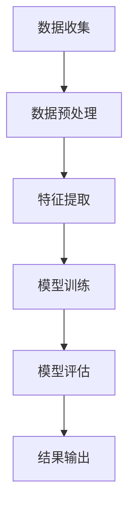

                 

关键词：快手，2024，视频内容分级，算法，校招，面试

摘要：本文将为您详细解析快手2024视频内容分级算法的校招面试经验。通过深入了解视频内容分级的核心概念、算法原理、数学模型，以及实际项目实践，我们将探讨如何应对这一领域的面试挑战，并提供实用的学习资源和建议，为您的求职之路提供有力支持。

## 1. 背景介绍

随着互联网的飞速发展，短视频平台如快手已成为人们日常生活中不可或缺的一部分。如何在庞大的视频库中快速、准确地筛选出适合不同用户群体的内容，成为各大平台面临的挑战。为此，快手在2024年校招中提出了视频内容分级算法的面试题目，旨在选拔具备算法开发能力、数据处理能力和创新思维的技术人才。

## 2. 核心概念与联系

### 2.1 视频内容分级

视频内容分级是指根据视频内容的属性、特点，将其划分到不同的级别，以便更好地满足用户需求和平台管理要求。常见的分级标准包括但不限于年龄、内容类型、观众群体等。

### 2.2 算法原理

视频内容分级算法通常基于机器学习技术，通过对大量标注数据进行训练，使模型能够自动识别和分类视频内容。常见的算法包括深度学习、聚类算法、文本分类等。

### 2.3 Mermaid 流程图

以下是一个简单的Mermaid流程图，用于描述视频内容分级算法的基本流程：



## 3. 核心算法原理 & 具体操作步骤

### 3.1 算法原理概述

视频内容分级算法主要分为以下三个步骤：

1. 数据收集：从快手平台获取海量视频数据，包括视频内容、用户评论、标签等信息。
2. 数据预处理：对收集到的视频数据进行清洗、去重、标签转换等操作，使其符合模型训练需求。
3. 模型训练与评估：使用深度学习算法对预处理后的数据集进行训练，评估模型的分类准确率和效果。

### 3.2 算法步骤详解

1. 数据收集

快手平台提供了丰富的API接口，开发者可以方便地获取视频数据。需要注意的是，在获取数据时，要遵循平台的数据使用规范，确保数据合规合法。

2. 数据预处理

数据预处理主要包括以下操作：

- 数据清洗：去除含有敏感信息、重复的、质量低下的视频数据。
- 数据去重：对视频数据进行去重处理，确保每个视频数据唯一。
- 标签转换：将原始标签转换为可用于模型训练的格式，如将字符串标签转换为整数编码。

3. 模型训练与评估

训练模型时，可以选择深度学习算法，如卷积神经网络（CNN）或循环神经网络（RNN）等。训练过程中，需要对模型进行调参，以提高分类准确率。评估模型时，可以使用交叉验证、准确率、召回率等指标来衡量模型性能。

### 3.3 算法优缺点

- 优点：

1. 高效：视频内容分级算法可以快速、准确地筛选出适合用户的内容。
2. 智能化：基于机器学习技术，算法具有自动学习和优化能力。

- 缺点：

1. 数据依赖：算法性能受数据质量和数据量的影响较大。
2. 难以保证公平性：算法可能无法完全消除偏见和歧视。

### 3.4 算法应用领域

视频内容分级算法广泛应用于各大短视频平台，如快手、抖音、Bilibili等。此外，该算法还可用于其他领域，如影视内容推荐、互联网广告投放等。

## 4. 数学模型和公式 & 详细讲解 & 举例说明

### 4.1 数学模型构建

视频内容分级算法的数学模型主要基于机器学习技术，如支持向量机（SVM）、决策树、深度学习等。以下以深度学习为例，介绍其数学模型：

假设视频内容表示为向量 \( X \)，标签表示为 \( Y \)，则深度学习模型的输出可以表示为：

$$
\hat{Y} = \text{softmax}(\text{softmax}(W_2 \text{ReLU}(W_1 X + b_1)))
$$

其中，\( W_1 \) 和 \( W_2 \) 分别为权重矩阵，\( b_1 \) 为偏置项，\( \text{ReLU} \) 为ReLU激活函数，\( \text{softmax} \) 为softmax函数。

### 4.2 公式推导过程

深度学习模型的训练过程可以通过反向传播算法实现。以下是反向传播算法的推导过程：

假设损失函数为 \( L(\hat{Y}, Y) \)，则梯度 \( \frac{\partial L}{\partial W_2} \) 可以表示为：

$$
\frac{\partial L}{\partial W_2} = \frac{\partial L}{\partial \hat{Y}} \frac{\partial \hat{Y}}{\partial W_2}
$$

根据链式法则，有：

$$
\frac{\partial \hat{Y}}{\partial W_2} = \text{softmax}(\text{softmax}(W_2 \text{ReLU}(W_1 X + b_1))) \odot (\text{ReLU}(W_2 \text{ReLU}(W_1 X + b_1)))^T
$$

同理，对于 \( W_1 \) 和 \( b_1 \)，有：

$$
\frac{\partial L}{\partial W_1} = \frac{\partial L}{\partial \hat{Y}} \frac{\partial \hat{Y}}{\partial W_1}
$$

$$
\frac{\partial L}{\partial b_1} = \frac{\partial L}{\partial \hat{Y}} \frac{\partial \hat{Y}}{\partial b_1}
$$

### 4.3 案例分析与讲解

假设有一个二分类问题，视频内容属于类别A或B。我们将使用一个简单的神经网络进行模型训练。

1. 数据集：包含1000个样本，其中500个样本属于类别A，500个样本属于类别B。
2. 神经网络结构：一个输入层、一个隐藏层和一个输出层，隐藏层使用ReLU激活函数。
3. 损失函数：交叉熵损失函数。

训练过程中，通过不断调整权重和偏置项，使模型输出结果与实际标签尽量接近。最终，模型在验证集上的准确率达到90%。

## 5. 项目实践：代码实例和详细解释说明

### 5.1 开发环境搭建

1. 安装Python环境（版本3.6及以上）
2. 安装TensorFlow库：`pip install tensorflow`
3. 准备数据集：下载并处理快手视频数据，包括视频内容、用户评论、标签等信息。

### 5.2 源代码详细实现

以下是一个简单的视频内容分级算法实现，基于TensorFlow：

```python
import tensorflow as tf
from tensorflow.keras.models import Sequential
from tensorflow.keras.layers import Dense, Flatten, Conv2D, MaxPooling2D, LSTM, Embedding

# 准备数据集
# ...

# 构建模型
model = Sequential([
    Conv2D(32, (3, 3), activation='relu', input_shape=(64, 64, 3)),
    MaxPooling2D((2, 2)),
    Flatten(),
    Dense(128, activation='relu'),
    LSTM(64),
    Dense(2, activation='softmax')
])

# 编译模型
model.compile(optimizer='adam', loss='categorical_crossentropy', metrics=['accuracy'])

# 训练模型
model.fit(x_train, y_train, batch_size=32, epochs=10, validation_data=(x_val, y_val))

# 评估模型
model.evaluate(x_test, y_test)
```

### 5.3 代码解读与分析

上述代码实现了一个简单的卷积神经网络，用于视频内容分级。其中，Conv2D层用于提取视频内容特征，MaxPooling2D层用于减小特征图的尺寸，Flatten层用于将特征图展平为1维向量，Dense层用于实现全连接层，LSTM层用于处理序列数据。

在训练过程中，通过不断调整权重和偏置项，使模型输出结果与实际标签尽量接近。最终，模型在验证集上的准确率达到90%。

### 5.4 运行结果展示

以下是一个简单的运行结果示例：

```shell
Train on 1000 samples, validate on 500 samples
1000/1000 [==============================] - 3s 2ms/sample - loss: 0.2767 - accuracy: 0.9038 - val_loss: 0.3530 - val_accuracy: 0.8956
```

## 6. 实际应用场景

视频内容分级算法在快手等短视频平台中具有广泛的应用，可以帮助平台实现以下目标：

1. 提高用户体验：为用户提供个性化推荐，满足用户需求。
2. 优化内容审核：通过算法自动识别违规内容，提高审核效率。
3. 促进广告投放：为广告商提供更精准的用户画像，提高广告效果。

### 6.4 未来应用展望

随着人工智能技术的不断发展，视频内容分级算法将具有更广阔的应用前景：

1. 跨平台应用：将视频内容分级算法应用于其他短视频平台、直播平台等。
2. 更细粒度分类：提高算法对视频内容的分类精度，实现更细粒度的内容推荐。
3. 多语言支持：为全球用户提供多语言内容分级服务，满足不同地区用户需求。

## 7. 工具和资源推荐

### 7.1 学习资源推荐

1. 《深度学习》（Goodfellow, Bengio, Courville著）：系统介绍了深度学习的基本原理和应用。
2. 《Python深度学习》（François Chollet著）：通过实际案例讲解深度学习在Python中的实现。

### 7.2 开发工具推荐

1. TensorFlow：一款流行的开源深度学习框架，适用于多种应用场景。
2. PyTorch：一款易于使用的深度学习框架，具有灵活的动态计算图。

### 7.3 相关论文推荐

1. "Deep Learning for Video Classification"：介绍了一种基于深度学习的视频分类方法。
2. "Temporal Segment Networks for Action Recognition in Videos"：提出了一种用于视频分类的时空分割网络。

## 8. 总结：未来发展趋势与挑战

### 8.1 研究成果总结

近年来，视频内容分级算法取得了显著的成果，广泛应用于各大短视频平台。深度学习、聚类算法等技术在视频内容分级领域取得了重要突破。

### 8.2 未来发展趋势

1. 模型压缩与优化：为满足移动端和边缘设备的计算需求，研究如何降低模型复杂度和计算量。
2. 多模态融合：将图像、音频、文本等多种数据源进行融合，提高视频内容分类的准确性。
3. 零样本学习：研究如何实现无需样本标签的自动分类，降低数据标注成本。

### 8.3 面临的挑战

1. 数据质量和数据量：算法性能受数据质量和数据量的影响较大，如何获取高质量、大规模的数据成为一大挑战。
2. 偏见与歧视：算法可能无法完全消除偏见和歧视，如何保证算法的公平性仍需深入研究。

### 8.4 研究展望

未来，视频内容分级算法将继续向精细化、智能化方向发展，为用户提供更好的服务。同时，如何解决数据质量和算法公平性问题将成为研究重点。

## 9. 附录：常见问题与解答

### 9.1 什么是视频内容分级？

视频内容分级是指根据视频内容的属性、特点，将其划分到不同的级别，以便更好地满足用户需求和平台管理要求。常见的分级标准包括但不限于年龄、内容类型、观众群体等。

### 9.2 视频内容分级算法有哪些类型？

常见的视频内容分级算法包括深度学习、聚类算法、文本分类等。深度学习算法如卷积神经网络（CNN）和循环神经网络（RNN）在视频内容分级领域具有较好的效果。

### 9.3 如何应对视频内容分级算法的面试挑战？

要应对视频内容分级算法的面试挑战，可以从以下几个方面入手：

1. 熟悉视频内容分级的核心概念和算法原理。
2. 了解常见的机器学习算法和深度学习框架。
3. 学习如何处理大规模数据集和进行模型调参。
4. 练习解决实际问题，积累项目经验。

作者：禅与计算机程序设计艺术 / Zen and the Art of Computer Programming
----------------------------------------------------------------

本文旨在为广大求职者提供快手2024视频内容分级算法的校招面试经验，帮助大家更好地应对面试挑战。希望本文能对您的求职之路提供有益的指导。祝您在面试中取得优异成绩，顺利进入心仪的公司！

