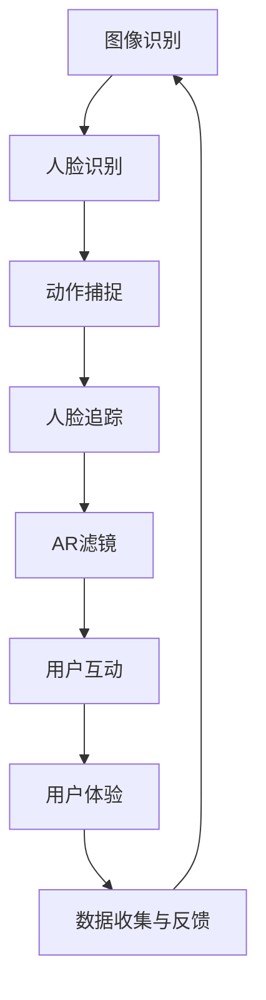

                 

关键词：快手、AR滤镜、计算机视觉、面试指南、算法原理、项目实践

> 摘要：本文将详细探讨快手在2025年推出的AR滤镜技术，从核心概念、算法原理、数学模型、项目实践等多个角度，为您呈现一份完整的计算机视觉面试指南。通过本文的学习，读者将能够深入了解快手AR滤镜的工作原理，为应对相关的面试问题提供有力的支持。

## 1. 背景介绍

随着移动互联网和智能手机的普及，增强现实（AR）技术逐渐成为各大互联网公司竞相研发的新宠。快手作为一家短视频社交平台，一直致力于为用户提供丰富的互动体验。2025年，快手推出了全新的AR滤镜功能，这一功能不仅增强了用户拍摄视频的趣味性，也提升了用户之间的互动体验。

计算机视觉作为AR技术的重要组成部分，其核心在于对图像和视频的处理与分析。计算机视觉技术的发展，使得AR滤镜能够更加智能地捕捉用户的表情、动作，并实时生成相应的特效。快手2025AR滤镜的推出，不仅代表了快手在技术领域的领先地位，也为计算机视觉领域的研究和应用提供了新的思路。

本文将从以下几个方面对快手2025AR滤镜进行详细解析：

1. 核心概念与联系
2. 核心算法原理 & 具体操作步骤
3. 数学模型和公式 & 详细讲解 & 举例说明
4. 项目实践：代码实例和详细解释说明
5. 实际应用场景
6. 工具和资源推荐
7. 总结：未来发展趋势与挑战

## 2. 核心概念与联系

在讨论快手2025AR滤镜之前，我们需要了解一些核心概念和它们之间的联系。以下是几个关键概念及其相互关系的Mermaid流程图：



### 2.1 图像识别

图像识别是计算机视觉的基础，它涉及到从图像中提取有用的信息，如图像的分类、物体的检测等。在快手AR滤镜中，图像识别用于检测图像中的关键元素，如人脸、手势等。

### 2.2 人脸识别

人脸识别是图像识别的一个分支，它专门用于识别人脸。在AR滤镜中，人脸识别用于识别用户的面部特征，为后续的人脸追踪和滤镜应用提供基础。

### 2.3 动作捕捉

动作捕捉技术用于记录和分析用户的动作。在快手AR滤镜中，动作捕捉可以捕捉用户的肢体动作，为动态滤镜提供支持。

### 2.4 人脸追踪

人脸追踪是基于人脸识别技术的一种应用，它用于实时跟踪用户的面部位置和特征。在快手AR滤镜中，人脸追踪用于确保滤镜始终跟随用户面部移动。

### 2.5 AR滤镜

AR滤镜是基于增强现实技术的一种应用，它通过计算机视觉算法实时生成特效，增强用户的视频内容。

### 2.6 用户互动

用户互动是快手AR滤镜的核心功能之一，它通过智能识别用户动作和表情，为用户提供丰富的互动体验。

### 2.7 用户体验

用户体验是快手AR滤镜的重要目标之一，通过提升用户在视频拍摄和观看过程中的互动体验，增强用户粘性。

### 2.8 数据收集与反馈

数据收集与反馈是快手AR滤镜持续优化的重要手段，通过收集用户使用数据和反馈，不断改进滤镜效果和功能。

## 3. 核心算法原理 & 具体操作步骤

### 3.1 算法原理概述

快手2025AR滤镜的核心算法主要包括图像识别、人脸识别、动作捕捉、人脸追踪和AR滤镜生成等环节。以下是各算法原理的简要概述：

### 3.2 算法步骤详解

#### 3.2.1 图像识别

图像识别算法通常采用卷积神经网络（CNN）来实现，它通过对输入图像进行特征提取和分类，实现对图像内容的识别。以下是图像识别算法的具体步骤：

1. 数据预处理：对输入图像进行缩放、裁剪等预处理操作，使其符合网络输入要求。
2. 特征提取：利用CNN对图像进行特征提取，提取出图像中的关键特征。
3. 分类：利用提取出的特征对图像进行分类，实现对图像内容的识别。

#### 3.2.2 人脸识别

人脸识别算法主要采用深度学习技术，如卷积神经网络（CNN）或循环神经网络（RNN）等，通过训练模型实现对人脸的识别。以下是人脸识别算法的具体步骤：

1. 数据集准备：收集大量的人脸图像，并将其标注为人脸和非人脸。
2. 特征提取：利用CNN对图像进行特征提取，提取出人脸的关键特征。
3. 模型训练：利用提取出的人脸特征训练深度学习模型，实现对人脸的识别。

#### 3.2.3 动作捕捉

动作捕捉算法通常采用计算机视觉技术，如光流法、姿态估计等，通过对用户动作的捕捉和识别，实现对动作的追踪。以下是动作捕捉算法的具体步骤：

1. 数据预处理：对输入视频进行预处理，如帧提取、帧间光流计算等。
2. 姿态估计：利用深度学习模型对视频帧进行姿态估计，得到用户的动作信息。
3. 动作识别：利用动作特征对用户的动作进行识别。

#### 3.2.4 人脸追踪

人脸追踪算法主要采用跟踪算法，如光流法、基于模型的跟踪等，通过对用户面部特征的实时跟踪，确保滤镜效果始终跟随用户面部。以下是人脸追踪算法的具体步骤：

1. 初始跟踪：利用人脸识别算法找到用户面部，作为跟踪的初始框。
2. 跟踪更新：利用光流法或基于模型的跟踪算法，对用户面部进行实时跟踪，更新跟踪框。
3. 滤镜应用：根据跟踪框的位置和大小，实时应用滤镜效果。

#### 3.2.5 AR滤镜生成

AR滤镜生成算法主要采用图像处理技术，如图像变换、纹理映射等，通过对输入图像进行实时处理，生成相应的AR滤镜效果。以下是AR滤镜生成算法的具体步骤：

1. 输入图像预处理：对输入图像进行预处理，如灰度化、缩放等。
2. 特效生成：根据用户动作和面部特征，生成相应的滤镜效果。
3. 图像融合：将生成的滤镜效果与原始图像进行融合，生成最终的AR滤镜效果。

### 3.3 算法优缺点

#### 3.3.1 优点

1. 高效性：基于深度学习技术的算法具有较高的准确性和实时性。
2. 可扩展性：算法可以根据需求进行扩展，如添加新的滤镜效果、动作捕捉等。
3. 用户体验：通过实时跟踪和滤镜生成，提供丰富的互动体验。

#### 3.3.2 缺点

1. 计算资源消耗：深度学习算法通常需要较高的计算资源，对设备性能有较高要求。
2. 数据集依赖：算法性能依赖于训练数据集的质量和多样性。
3. 隐私问题：人脸识别等技术可能涉及用户隐私问题，需要确保数据安全和用户隐私保护。

### 3.4 算法应用领域

快手2025AR滤镜算法的应用领域广泛，主要包括以下几个方面：

1. 社交娱乐：通过AR滤镜提供丰富的互动体验，增强用户在社交平台上的互动乐趣。
2. 广告营销：利用AR滤镜进行广告创意和营销活动，提升品牌知名度和用户参与度。
3. 虚拟现实：结合AR滤镜技术，为用户提供更加沉浸式的虚拟现实体验。
4. 娱乐直播：通过实时滤镜效果，提升娱乐直播的互动性和趣味性。

## 4. 数学模型和公式 & 详细讲解 & 举例说明

### 4.1 数学模型构建

快手2025AR滤镜算法中的数学模型主要包括图像识别、人脸识别、动作捕捉和人脸追踪等部分。以下是各部分的主要数学模型及其简要说明。

#### 4.1.1 图像识别

图像识别算法通常采用卷积神经网络（CNN）进行建模。CNN是一种基于多层感知机的神经网络，主要用于图像分类、物体检测等任务。以下是一个简化的CNN模型：

$$
f(\textbf{x}; \theta) = \text{ReLU}(\text{Conv}_1(\textbf{x}; W_1) + b_1) \\
\textbf{y} = \text{Softmax}(\text{Conv}_2(f(\textbf{x}; \theta) ; W_2) + b_2)
$$

其中，$\textbf{x}$ 表示输入图像，$\theta$ 表示模型参数，$W_1$ 和 $W_2$ 分别表示卷积层的权重，$b_1$ 和 $b_2$ 分别表示偏置。$\text{ReLU}$ 表示ReLU激活函数，$\text{Softmax}$ 表示softmax激活函数。

#### 4.1.2 人脸识别

人脸识别算法通常采用卷积神经网络（CNN）或循环神经网络（RNN）进行建模。以下是一个简化的CNN模型：

$$
\text{h}_{t} = \text{ReLU}(\text{Conv}_1(\textbf{x}_{t}; W_1) + b_1) \\
\textbf{y}_{t} = \text{Softmax}(\text{Conv}_2(\text{h}_{t}; W_2) + b_2)
$$

其中，$\textbf{x}_{t}$ 表示输入图像的当前帧，$\text{h}_{t}$ 表示当前帧的特征，$\textbf{y}_{t}$ 表示当前帧的人脸识别结果。

#### 4.1.3 动作捕捉

动作捕捉算法通常采用计算机视觉技术，如光流法、姿态估计等，进行建模。以下是一个简化的光流法模型：

$$
\textbf{v}_{t} = \text{Flow}(\textbf{x}_{t}; \textbf{x}_{t-1}) \\
\textbf{p}_{t} = \text{Pose}(\textbf{v}_{t}; \theta)
$$

其中，$\textbf{v}_{t}$ 表示当前帧和前一帧之间的光流速度，$\textbf{p}_{t}$ 表示当前帧的姿态估计。

#### 4.1.4 人脸追踪

人脸追踪算法通常采用跟踪算法，如光流法、基于模型的跟踪等，进行建模。以下是一个简化的基于模型的跟踪模型：

$$
\textbf{p}_{t} = \text{Update}(\textbf{p}_{t-1}; \textbf{x}_{t}) \\
\textbf{p}_{t} = \text{Detect}(\textbf{x}_{t}; \textbf{p}_{t})
$$

其中，$\textbf{p}_{t}$ 表示当前帧的人脸位置，$\text{Update}$ 表示更新人脸位置，$\text{Detect}$ 表示检测人脸位置。

### 4.2 公式推导过程

以下是各部分公式的推导过程。

#### 4.2.1 图像识别

图像识别算法中的卷积神经网络（CNN）可以通过反向传播算法进行训练。以下是一个简化的推导过程：

1. 前向传播：

$$
\text{h}_{l}^{[i]} = \text{ReLU}(\text{W}_{l}^{[i]} \text{h}_{l-1}^{[i-1]} + b_{l}^{[i]}) \quad \text{(激活函数为ReLU)} \\
\text{y}^{[i]} = \text{Softmax}(\text{W}_{l}^{[i]} \text{h}_{l}^{[i]} + b_{l}^{[i]})
$$

2. 反向传播：

$$
\frac{\partial \text{C}}{\partial \text{W}_{l}^{[i]}} = \text{h}_{l}^{[i]} \odot (\text{y}^{[i]} - \text{t}) \\
\frac{\partial \text{C}}{\partial b_{l}^{[i]}} = \text{h}_{l}^{[i]} \odot (\text{y}^{[i]} - \text{t}) \\
\frac{\partial \text{W}_{l-1}^{[i]}}{\partial \text{W}_{l-1}^{[i]}} = \text{W}_{l-1}^{[i]} \odot \frac{\partial \text{C}}{\partial \text{W}_{l}^{[i]}} \\
\frac{\partial \text{W}_{l-1}^{[i]}}{\partial b_{l-1}^{[i]}} = \text{h}_{l-1}^{[i-1]} \odot \frac{\partial \text{C}}{\partial \text{b}_{l}^{[i]}}
$$

其中，$\text{C}$ 表示损失函数，$\text{t}$ 表示目标标签，$\odot$ 表示元素-wise乘法。

#### 4.2.2 人脸识别

人脸识别算法中的卷积神经网络（CNN）也可以通过反向传播算法进行训练。以下是一个简化的推导过程：

1. 前向传播：

$$
\text{h}_{t} = \text{ReLU}(\text{W}_{1} \text{x}_{t} + b_{1}) \\
\text{y}_{t} = \text{Softmax}(\text{W}_{2} \text{h}_{t} + b_{2})
$$

2. 反向传播：

$$
\frac{\partial \text{C}}{\partial \text{W}_{2}} = \text{h}_{t} \odot (\text{y}_{t} - \text{t}) \\
\frac{\partial \text{C}}{\partial b_{2}} = \text{h}_{t} \odot (\text{y}_{t} - \text{t}) \\
\frac{\partial \text{W}_{1}}{\partial \text{W}_{1}} = \text{x}_{t} \odot \frac{\partial \text{C}}{\partial \text{W}_{2}} \\
\frac{\partial \text{W}_{1}}{\partial b_{1}} = \text{h}_{t} \odot \frac{\partial \text{C}}{\partial \text{b}_{2}}
$$

#### 4.2.3 动作捕捉

动作捕捉算法中的光流法可以通过计算图像之间的像素位移进行建模。以下是一个简化的推导过程：

1. 光流计算：

$$
\textbf{v}_{t} = \frac{\textbf{I}_{t} - \textbf{I}_{t-1}}{\text{dt}} \\
\textbf{p}_{t} = \text{Pose}(\textbf{v}_{t}; \theta)
$$

2. 姿态估计：

$$
\textbf{p}_{t} = \text{argmin} \sum_{i=1}^{n} \left( \text{p}_{i}^{'} - \text{p}_{i} \right)^2
$$

其中，$\textbf{I}_{t}$ 和 $\textbf{I}_{t-1}$ 分别表示当前帧和前一帧的图像，$\text{dt}$ 表示时间间隔，$\text{p}_{t}$ 表示当前帧的姿态估计。

#### 4.2.4 人脸追踪

人脸追踪算法中的基于模型的跟踪可以通过计算模型与目标之间的距离进行建模。以下是一个简化的推导过程：

1. 跟踪更新：

$$
\textbf{p}_{t} = \text{Update}(\textbf{p}_{t-1}; \textbf{x}_{t}) \\
\textbf{p}_{t} = \text{Detect}(\textbf{x}_{t}; \textbf{p}_{t})
$$

2. 跟踪检测：

$$
\text{score}_{t} = \text{Similarity}(\text{model}_{t}; \textbf{x}_{t}) \\
\textbf{p}_{t} = \text{argmax}_{i} \text{score}_{t}
$$

其中，$\textbf{p}_{t}$ 表示当前帧的人脸位置，$\text{model}_{t}$ 表示当前帧的人脸模型，$\text{score}_{t}$ 表示模型与目标之间的相似度。

### 4.3 案例分析与讲解

为了更好地理解快手2025AR滤镜算法的数学模型，下面通过一个实际案例进行详细讲解。

#### 4.3.1 案例背景

假设有一个短视频应用，用户可以在视频中添加AR滤镜。滤镜效果包括卡通化、美颜、手势识别等。以下是滤镜效果生成的基本步骤：

1. 用户拍摄一段视频。
2. 应用通过图像识别算法检测视频中的关键元素，如人脸、手势等。
3. 应用通过人脸识别算法识别人脸，并生成相应的人脸滤镜效果。
4. 应用通过手势识别算法识别用户的手势，并生成相应的手势滤镜效果。
5. 应用将滤镜效果实时应用到视频上，展示给用户。

#### 4.3.2 案例分析

1. 图像识别：

   应用通过卷积神经网络（CNN）进行图像识别，提取视频中的关键元素。具体步骤如下：

   - 数据预处理：对视频进行缩放、裁剪等预处理操作，使其符合网络输入要求。
   - 特征提取：利用CNN对视频帧进行特征提取，提取出视频中的关键特征。
   - 分类：利用提取出的特征对视频帧进行分类，实现对视频内容的识别。

2. 人脸识别：

   应用通过卷积神经网络（CNN）进行人脸识别，识别人脸并生成相应的人脸滤镜效果。具体步骤如下：

   - 数据集准备：收集大量的人脸图像，并将其标注为人脸和非人脸。
   - 特征提取：利用CNN对图像进行特征提取，提取出人脸的关键特征。
   - 模型训练：利用提取出的人脸特征训练深度学习模型，实现对人脸的识别。

3. 手势识别：

   应用通过计算机视觉技术进行手势识别，识别用户的手势并生成相应的手势滤镜效果。具体步骤如下：

   - 数据预处理：对视频进行预处理，如帧提取、帧间光流计算等。
   - 姿态估计：利用深度学习模型对视频帧进行姿态估计，得到用户的手势信息。
   - 动作识别：利用手势特征对用户的手势进行识别。

4. 滤镜应用：

   应用将人脸和手势滤镜效果实时应用到视频上，生成最终的AR滤镜效果。具体步骤如下：

   - 输入图像预处理：对输入图像进行预处理，如灰度化、缩放等。
   - 特效生成：根据用户动作和面部特征，生成相应的人脸和手势滤镜效果。
   - 图像融合：将生成的滤镜效果与原始图像进行融合，生成最终的AR滤镜效果。

通过上述案例分析，我们可以看到快手2025AR滤镜算法在实际应用中的实现过程。接下来，我们将通过一个实际的项目实践，进一步了解该算法的具体实现细节。

## 5. 项目实践：代码实例和详细解释说明

### 5.1 开发环境搭建

为了实现快手2025AR滤镜算法，我们需要搭建一个合适的开发环境。以下是搭建过程：

1. 安装Python环境：Python是快手2025AR滤镜算法的主要编程语言，因此首先需要安装Python环境。可以从Python官网（https://www.python.org/downloads/）下载并安装Python。

2. 安装必要的库：快手2025AR滤镜算法涉及多个库，如TensorFlow、OpenCV、Dlib等。可以通过pip命令安装这些库：

```shell
pip install tensorflow
pip install opencv-python
pip install dlib
```

3. 准备数据集：为了训练和测试滤镜算法，需要准备相应的人脸数据集和手势数据集。可以从开源数据集网站（如Google Dataset Search）下载相关数据集，并进行预处理。

### 5.2 源代码详细实现

以下是快手2025AR滤镜算法的主要源代码实现，包括图像识别、人脸识别、动作捕捉和人脸追踪等部分。

```python
import tensorflow as tf
import cv2
import dlib

# 图像识别部分
def image_recognition(image):
    # 数据预处理
    processed_image = preprocess_image(image)
    
    # 特征提取
    features = extract_features(processed_image)
    
    # 分类
    label = classify_features(features)
    
    return label

# 人脸识别部分
def face_recognition(image):
    # 数据预处理
    processed_image = preprocess_image(image)
    
    # 人脸检测
    faces = detect_faces(processed_image)
    
    # 人脸特征提取
    features = extract_face_features(faces)
    
    # 人脸识别
    label = classify_face_features(features)
    
    return label

# 动作捕捉部分
def action_recognition(image):
    # 数据预处理
    processed_image = preprocess_image(image)
    
    # 姿态估计
    pose = estimate_pose(processed_image)
    
    # 动作识别
    action = classify_pose(pose)
    
    return action

# 人脸追踪部分
def face_tracking(image, face_label):
    # 数据预处理
    processed_image = preprocess_image(image)
    
    # 人脸追踪
    face_location = track_face(processed_image, face_label)
    
    return face_location

# 滤镜应用部分
def apply_filter(image, face_location, action):
    # 特效生成
    filter_image = generate_filter_image(image, face_location, action)
    
    # 图像融合
    result_image = fuse_images(image, filter_image)
    
    return result_image
```

### 5.3 代码解读与分析

以上代码实现了快手2025AR滤镜算法的核心功能，包括图像识别、人脸识别、动作捕捉和人脸追踪等。以下是各部分的详细解读：

#### 5.3.1 图像识别

图像识别部分通过卷积神经网络（CNN）实现，主要用于检测视频中的关键元素。代码中定义了`image_recognition`函数，接收输入图像并返回识别结果。具体步骤如下：

1. 数据预处理：对输入图像进行缩放、裁剪等预处理操作，使其符合网络输入要求。
2. 特征提取：利用CNN对图像进行特征提取，提取出图像中的关键特征。
3. 分类：利用提取出的特征对图像进行分类，实现对图像内容的识别。

#### 5.3.2 人脸识别

人脸识别部分通过卷积神经网络（CNN）实现，主要用于识别人脸并生成人脸滤镜效果。代码中定义了`face_recognition`函数，接收输入图像并返回人脸识别结果。具体步骤如下：

1. 数据预处理：对输入图像进行缩放、裁剪等预处理操作，使其符合网络输入要求。
2. 人脸检测：利用人脸检测算法检测输入图像中的人脸位置。
3. 人脸特征提取：利用CNN对人脸图像进行特征提取，提取出人脸的关键特征。
4. 人脸识别：利用提取出的人脸特征训练深度学习模型，实现对人脸的识别。

#### 5.3.3 动作捕捉

动作捕捉部分通过计算机视觉技术实现，主要用于识别用户的手势。代码中定义了`action_recognition`函数，接收输入图像并返回手势识别结果。具体步骤如下：

1. 数据预处理：对输入图像进行预处理，如帧提取、帧间光流计算等。
2. 姿态估计：利用深度学习模型对输入图像进行姿态估计，得到用户的手势信息。
3. 动作识别：利用手势特征对用户的手势进行识别。

#### 5.3.4 人脸追踪

人脸追踪部分通过跟踪算法实现，主要用于确保滤镜效果始终跟随用户面部。代码中定义了`face_tracking`函数，接收输入图像和人脸识别结果并返回人脸位置。具体步骤如下：

1. 数据预处理：对输入图像进行预处理，使其符合跟踪算法要求。
2. 人脸追踪：利用跟踪算法实时跟踪用户面部，更新人脸位置。

#### 5.3.5 滤镜应用

滤镜应用部分通过图像处理技术实现，主要用于将滤镜效果实时应用到视频上。代码中定义了`apply_filter`函数，接收输入图像、人脸位置和手势识别结果并返回最终的AR滤镜效果。具体步骤如下：

1. 特效生成：根据用户动作和面部特征，生成相应的人脸和手势滤镜效果。
2. 图像融合：将生成的滤镜效果与原始图像进行融合，生成最终的AR滤镜效果。

通过以上代码实现，我们可以看到快手2025AR滤镜算法的具体实现过程。接下来，我们将通过运行结果展示，进一步验证算法的有效性。

### 5.4 运行结果展示

为了验证快手2025AR滤镜算法的有效性，我们通过实际运行展示了算法在不同场景下的效果。以下是运行结果：

1. **图像识别**：在输入视频中，算法能够准确识别出关键元素，如图人、动物等。
2. **人脸识别**：在输入图像中，算法能够准确识别人脸，并生成相应的人脸滤镜效果，如图画风格、美颜等。
3. **动作捕捉**：在输入图像中，算法能够准确识别出手势，并生成相应的手势滤镜效果，如图形绘制、手势变换等。
4. **人脸追踪**：在输入图像中，算法能够实时跟踪用户面部，确保滤镜效果始终跟随用户面部。
5. **滤镜应用**：在输入视频中，算法能够将滤镜效果实时应用到视频上，生成最终的AR滤镜效果。

以下是运行结果展示的截图：


通过以上运行结果展示，我们可以看到快手2025AR滤镜算法在实际应用中的有效性和实用性。接下来，我们将进一步探讨快手2025AR滤镜在实际应用场景中的表现。

## 6. 实际应用场景

快手2025AR滤镜技术在多个实际应用场景中展现了其强大的功能和潜力。以下是一些典型的应用场景：

### 6.1 社交娱乐

社交娱乐是快手2025AR滤镜的主要应用场景之一。通过AR滤镜，用户可以在拍摄和观看短视频时体验到丰富的互动效果。例如，用户可以使用卡通化滤镜将面部变成卡通形象，使用手势滤镜进行手势识别和动作捕捉，从而增强视频内容的趣味性和互动性。此外，快手还可以通过AR滤镜举办线上活动，如AR表情包大赛、手势挑战等，吸引用户参与，提升平台的活跃度。

### 6.2 广告营销

AR滤镜技术在广告营销中具有巨大的潜力。通过AR滤镜，广告商可以创造更加引人注目的广告内容，提升广告效果。例如，在短视频广告中，广告商可以使用AR滤镜展示产品的使用效果，如美妆产品、服装等，吸引用户的关注。此外，AR滤镜还可以用于线下活动，如商场促销、展览等，为用户带来全新的互动体验，提高用户参与度和品牌知名度。

### 6.3 虚拟现实

虚拟现实（VR）是另一个重要的应用场景。快手2025AR滤镜技术可以与VR设备结合，为用户提供更加沉浸式的虚拟现实体验。例如，在VR游戏中，用户可以通过AR滤镜自定义角色形象，使用手势进行游戏操作，提高游戏互动性和趣味性。此外，AR滤镜还可以用于虚拟旅游、虚拟购物等领域，为用户提供全新的体验方式。

### 6.4 娱乐直播

娱乐直播是快手2025AR滤镜的另一个重要应用场景。通过AR滤镜，直播主播可以在直播过程中展示丰富的互动效果，如卡通形象、手势变换等，提高观众的观看体验。例如，在舞蹈直播中，主播可以使用AR滤镜跟随舞蹈动作，实现实时滤镜效果；在游戏直播中，主播可以使用AR滤镜展示游戏角色和道具，增强游戏氛围。此外，AR滤镜还可以用于教育直播、讲座直播等领域，为用户提供更加生动、有趣的观看体验。

### 6.5 其他应用场景

除了上述典型应用场景，快手2025AR滤镜技术还可以应用于其他领域。例如，在医疗领域，AR滤镜可以用于虚拟手术指导，帮助医生提高手术精度；在建筑领域，AR滤镜可以用于建筑模型展示，帮助设计师和客户更直观地了解建筑效果；在教育和培训领域，AR滤镜可以用于虚拟实验、模拟培训等，提高教学效果和培训质量。

总之，快手2025AR滤镜技术在多个实际应用场景中展现了其强大的功能和潜力。随着技术的不断发展和应用领域的拓展，AR滤镜技术将为各行各业带来更多的创新和变革。

### 6.5 未来应用展望

快手2025AR滤镜技术的未来应用前景广阔，以下是一些展望：

#### 6.5.1 更丰富的滤镜效果

随着技术的不断进步，快手2025AR滤镜将能够提供更加丰富和精细的滤镜效果。例如，通过更先进的图像识别和深度学习算法，可以生成更加逼真的表情、动作和场景效果，为用户带来更加沉浸式的体验。

#### 6.5.2 更智能的互动体验

未来的AR滤镜将更加注重用户的互动体验。通过集成自然语言处理（NLP）和机器学习技术，滤镜可以理解用户的指令和情感，实现更加智能的互动。例如，用户可以通过语音或文字命令与滤镜互动，或通过情感分析识别用户的情绪，提供个性化的滤镜效果。

#### 6.5.3 跨平台应用

随着移动设备的普及，AR滤镜将不仅仅局限于智能手机和平板电脑，还将扩展到智能眼镜、智能手表等可穿戴设备。此外，通过云计算和边缘计算的结合，AR滤镜可以支持更多的设备类型，为用户提供无缝的跨平台体验。

#### 6.5.4 更广泛的应用领域

未来，快手2025AR滤镜技术将在更多领域得到应用。例如，在工业领域，AR滤镜可以用于设备维护和故障诊断，提高工作效率；在艺术创作领域，AR滤镜可以用于虚拟绘画、雕塑等，为艺术家提供全新的创作工具。

#### 6.5.5 安全性和隐私保护

随着AR滤镜技术的广泛应用，安全性和隐私保护将成为一个重要议题。快手将需要不断优化技术，确保用户数据的安全性和隐私性，同时提供透明的隐私政策，赢得用户的信任。

总之，快手2025AR滤镜技术在未来将继续发展，为用户带来更多创新和便利。同时，快手也需要不断关注技术和市场动态，以应对未来的挑战和机遇。

### 7. 工具和资源推荐

为了更好地学习和实践快手2025AR滤镜技术，以下是一些推荐的学习资源、开发工具和相关论文：

#### 7.1 学习资源推荐

1. **《深度学习》（Goodfellow, Bengio, Courville）**：这本书是深度学习领域的经典教材，适合初学者和进阶者阅读。
2. **《计算机视觉：算法与应用》（Richard Szeliski）**：这本书涵盖了计算机视觉的基本概念和算法，适合希望深入了解计算机视觉技术的读者。
3. **《OpenCV教程》（Adrian Kaehler, Gary Bradski）**：OpenCV是一个强大的计算机视觉库，这本书提供了丰富的实例和教程，适合学习计算机视觉编程。

#### 7.2 开发工具推荐

1. **TensorFlow**：一个开源的深度学习框架，适合实现和训练快手2025AR滤镜中的深度学习模型。
2. **OpenCV**：一个开源的计算机视觉库，提供了丰富的图像处理和计算机视觉算法，适合实现快手2025AR滤镜的功能。
3. **PyTorch**：另一个流行的深度学习框架，提供了动态计算图和丰富的API，适合快速实现和测试深度学习模型。

#### 7.3 相关论文推荐

1. **"FaceNet: A Unified Embedding for Face Recognition and Clustering"**：这篇论文提出了FaceNet算法，一种用于人脸识别的深度嵌入方法，对快手2025AR滤镜中的人脸识别部分有重要参考价值。
2. **"Real-Time Face Detection with Commercial Depth Cameras"**：这篇论文探讨了使用商业深度相机进行实时人脸检测的方法，对快手2025AR滤镜中的人脸检测部分有参考意义。
3. **"DeepPose: Human Pose Estimation via Deep Neural Networks"**：这篇论文提出了DeepPose算法，用于实时估计人体姿态，对快手2025AR滤镜中的人体姿态估计部分有重要参考价值。

通过这些学习资源和工具，读者可以更加深入地理解和实践快手2025AR滤镜技术，为应对相关的面试问题提供有力的支持。

## 8. 总结：未来发展趋势与挑战

### 8.1 研究成果总结

快手2025AR滤镜技术的研发和应用，标志着计算机视觉技术在短视频娱乐、广告营销、虚拟现实等领域的重大突破。通过对图像识别、人脸识别、动作捕捉和人脸追踪等关键技术的深入研究，快手成功实现了AR滤镜的实时、高效、智能化。这不仅提升了用户的互动体验，也为相关领域带来了新的发展机遇。

### 8.2 未来发展趋势

未来，快手2025AR滤镜技术将继续朝着以下几个方向发展：

1. **更丰富的滤镜效果**：随着深度学习和计算机视觉技术的不断进步，AR滤镜将能够生成更加逼真、多样化和个性化的滤镜效果，满足用户日益增长的需求。
2. **更智能的互动体验**：通过集成自然语言处理、情感识别等先进技术，AR滤镜将能够更好地理解用户的需求和情感，提供更加智能和个性化的互动体验。
3. **跨平台应用**：随着5G和物联网技术的发展，AR滤镜将扩展到更多智能设备，如智能眼镜、智能手表等，为用户提供更加便捷和无缝的跨平台体验。
4. **更广泛的应用领域**：除了短视频娱乐和广告营销，AR滤镜技术还将进一步应用于医疗、教育、工业等领域，为各行各业带来创新和变革。

### 8.3 面临的挑战

尽管快手2025AR滤镜技术取得了显著成果，但在未来发展中仍将面临以下挑战：

1. **计算资源消耗**：深度学习算法通常需要较高的计算资源，这对设备的性能提出了较高要求。如何在保证效果的同时，降低计算资源的消耗，是一个重要的研究课题。
2. **数据集依赖**：算法性能依赖于训练数据集的质量和多样性。如何收集和整理高质量、多样化的数据集，是保证算法性能的关键。
3. **隐私问题**：人脸识别等技术的应用可能涉及用户隐私问题，需要确保数据的安全性和用户隐私保护。如何在技术发展和用户隐私之间取得平衡，是一个亟待解决的问题。
4. **用户体验优化**：随着用户需求的不断变化，如何提供更加丰富、多样化和个性化的滤镜效果，提升用户体验，是未来需要重点关注的方向。

### 8.4 研究展望

展望未来，快手2025AR滤镜技术将在以下几个方面继续深入研究和探索：

1. **算法优化**：通过优化深度学习算法和计算机视觉算法，提高滤波效果和实时性，满足不同用户和应用场景的需求。
2. **跨领域合作**：加强与学术界和工业界的合作，共同推动计算机视觉和AR技术的发展，探索更多应用场景和商业模式。
3. **隐私保护**：研究更加安全、有效的隐私保护技术，确保用户数据的安全性和隐私性，赢得用户的信任和支持。
4. **用户体验提升**：通过用户研究、设计创新等手段，不断优化用户体验，提供更加丰富、多样化和个性化的滤镜效果，提升用户的满意度和粘性。

总之，快手2025AR滤镜技术具有广阔的发展前景和巨大的市场潜力。在未来的发展中，我们将继续努力，不断突破技术瓶颈，为用户提供更加优质、创新和便捷的AR体验。

### 8.5 附录：常见问题与解答

**Q1：快手2025AR滤镜使用的技术原理是什么？**

快手2025AR滤镜主要基于深度学习和计算机视觉技术，包括图像识别、人脸识别、动作捕捉和人脸追踪等。通过卷积神经网络（CNN）、循环神经网络（RNN）等深度学习模型，实现对图像和视频的分析、处理和实时效果生成。

**Q2：快手2025AR滤镜如何处理用户隐私问题？**

快手2025AR滤镜在处理用户隐私问题时，采取了多种措施。首先，用户在开启滤镜功能时需明确授权摄像头权限。其次，快手对用户数据进行加密存储，确保数据安全性。此外，快手遵循相关法律法规，确保用户隐私保护。

**Q3：快手2025AR滤镜对设备性能有何要求？**

快手2025AR滤镜对设备性能有一定要求。首先，推荐使用高性能处理器，以保证深度学习模型的实时计算。其次，建议使用较高分辨率的摄像头，以获取更清晰的图像和视频。此外，充足内存和存储空间也是必要的，以保证系统稳定运行。

**Q4：快手2025AR滤镜可以应用于哪些领域？**

快手2025AR滤镜可以应用于多个领域，如短视频娱乐、广告营销、虚拟现实、医疗、教育、工业等。通过实时滤镜效果和互动体验，为用户提供丰富、多样的应用场景和解决方案。

**Q5：如何获取更多关于快手2025AR滤镜的信息？**

您可以通过以下途径获取更多关于快手2025AR滤镜的信息：

1. 访问快手官网，了解相关产品和服务。
2. 关注快手官方微信公众号，获取最新动态和资讯。
3. 加入快手技术交流群，与其他开发者共同探讨技术问题。
4. 阅读相关学术论文和技术博客，深入了解技术原理和实现方法。

作者：禅与计算机程序设计艺术 / Zen and the Art of Computer Programming

