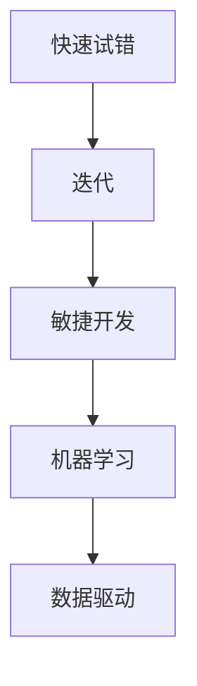

                 

关键词：快速试错、迭代、AI创业、敏捷开发、机器学习、数据驱动、创新能力

> 摘要：在当今快速变化的技术环境下，人工智能（AI）创业面临着前所未有的机遇与挑战。本文将探讨快速试错与迭代在AI创业中的重要性，结合敏捷开发、机器学习、数据驱动等核心概念，分析其在提升创新能力和市场竞争力方面的作用，并探讨未来发展趋势与挑战。

## 1. 背景介绍

### AI创业的现状与挑战

近年来，人工智能技术取得了显著的进展，各类AI应用层出不穷，从自动驾驶、智能语音识别到医疗诊断、金融分析，AI正在深刻改变各行各业。然而，随着AI技术的快速普及，AI创业也面临着诸多挑战：

- **市场不确定性**：新兴市场的需求变化快，竞争激烈，企业需要快速适应市场变化。
- **技术复杂性**：AI技术的研发和应用涉及多个领域，如计算机视觉、自然语言处理、深度学习等，技术复杂度高。
- **数据隐私与安全**：数据是AI的基石，但数据隐私和安全问题是所有AI创业者必须面对的挑战。

### 快速试错与迭代的重要性

在这种背景下，快速试错与迭代成为AI创业的重要策略。快速试错意味着通过小规模实验和测试，快速验证产品或服务的可行性。迭代则是基于试错结果，不断改进产品或服务，以适应市场需求和用户反馈。快速试错与迭代不仅能够降低创业风险，还能提高创新能力和市场竞争力。

## 2. 核心概念与联系

### 快速试错与迭代的概念

- **快速试错**：在创业初期，通过小规模实验和测试，快速验证产品或服务的可行性。这一过程通常涉及快速设计和实施原型，以获取早期用户反馈。
- **迭代**：基于快速试错的结果，对产品或服务进行持续改进。迭代过程通常包括用户研究、设计优化、开发实施和用户反馈等环节。

### 关联概念

- **敏捷开发**：一种软件开发方法，强调快速响应变化，通过迭代和增量开发，提高软件质量和开发效率。
- **机器学习**：一种AI技术，通过数据驱动的方式，让计算机系统具备自主学习和改进能力。
- **数据驱动**：以数据为依据，通过数据分析，指导决策和产品优化。

### Mermaid 流程图



## 3. 核心算法原理 & 具体操作步骤

### 3.1 算法原理概述

快速试错与迭代在AI创业中的核心算法原理是基于反馈循环。通过不断收集用户反馈和数据分析，创业者可以快速调整产品或服务，提高其适应性和市场竞争力。

### 3.2 算法步骤详解

1. **需求分析**：了解目标用户的需求，明确产品或服务的核心功能。
2. **原型设计**：快速设计一个原型，进行小规模实验和测试。
3. **用户反馈**：收集早期用户的反馈，分析其需求和偏好。
4. **迭代改进**：根据用户反馈，对产品或服务进行优化和改进。
5. **数据分析**：利用数据分析，评估产品或服务的性能和用户满意度。
6. **持续迭代**：基于数据分析结果，不断调整和优化产品或服务。

### 3.3 算法优缺点

**优点**：

- **降低风险**：通过快速试错，可以在早期发现和解决潜在问题，降低创业风险。
- **提高效率**：敏捷开发方法可以快速响应市场需求，提高开发效率。
- **增强竞争力**：持续迭代和优化，可以提升产品或服务的市场竞争力。

**缺点**：

- **资源消耗**：快速试错和迭代需要大量的人力和时间投入。
- **市场适应难度**：在高度竞争的市场环境中，快速适应市场变化具有挑战性。

### 3.4 算法应用领域

快速试错与迭代在AI创业中的应用领域非常广泛，包括：

- **产品研发**：通过快速试错，验证产品概念，优化产品功能。
- **服务优化**：基于用户反馈，不断改进服务质量。
- **市场营销**：通过数据分析，优化营销策略，提高市场覆盖率。

## 4. 数学模型和公式 & 详细讲解 & 举例说明

### 4.1 数学模型构建

快速试错与迭代的核心数学模型是马尔可夫决策过程（MDP）。MDP是一个决策过程，通过评估不同行动的预期回报，选择最佳行动。其数学模型如下：

$$
V^*(s) = \max_{a} \sum_{s'} p(s'|s,a) \cdot \text{Reward}(s')
$$

其中，$V^*(s)$ 表示在状态 $s$ 下的最优价值函数，$a$ 表示行动，$s'$ 表示状态转移，$p(s'|s,a)$ 表示状态转移概率，$\text{Reward}(s')$ 表示在状态 $s'$ 下的回报。

### 4.2 公式推导过程

马尔可夫决策过程的推导基于以下假设：

- **状态转移概率**：$p(s'|s,a)$ 表示在当前状态 $s$ 下，采取行动 $a$ 后，转移到状态 $s'$ 的概率。
- **回报函数**：$\text{Reward}(s')$ 表示在状态 $s'$ 下的回报值。

基于以上假设，我们可以推导出最优价值函数 $V^*(s)$。具体推导过程如下：

1. **递归关系**：对于任意状态 $s$，最优价值函数 $V^*(s)$ 可以表示为：
   $$
   V^*(s) = \max_{a} \left[ \sum_{s'} p(s'|s,a) \cdot \text{Reward}(s') + \gamma \cdot V^*(s') \right]
   $$
   其中，$\gamma$ 表示折扣因子，用于平衡当前回报和未来回报。

2. **最优性条件**：对于任意状态 $s$，最优价值函数 $V^*(s)$ 应满足：
   $$
   V^*(s) = \max_{a} \left[ \sum_{s'} p(s'|s,a) \cdot \text{Reward}(s') + \gamma \cdot V^*(s') \right]
   $$
   即，对于任意状态 $s$，选择使得 $V^*(s)$ 最大的行动 $a$。

3. **迭代计算**：通过迭代计算，可以求解出最优价值函数 $V^*(s)$。

### 4.3 案例分析与讲解

假设一个创业公司正在开发一款智能家居系统，用户可以在手机上控制家里的智能设备。为了提高用户体验，公司决定采用快速试错与迭代的方法进行产品优化。

1. **需求分析**：公司调研用户需求，发现用户希望系统能够自动识别用户的操作习惯，并提供个性化的智能建议。

2. **原型设计**：公司设计了一个简单的原型，通过用户操作数据，自动识别用户的操作习惯。

3. **用户反馈**：公司邀请一组用户进行试用，并收集用户反馈。用户反馈显示，系统能够较好地识别用户的操作习惯，但建议的准确性有待提高。

4. **迭代改进**：公司基于用户反馈，优化了系统的算法，提高了建议的准确性。同时，公司增加了用户反馈功能，用户可以随时对系统提出建议。

5. **数据分析**：公司利用数据分析工具，对用户的操作数据进行分析，发现系统在个性化建议方面的表现有了显著提升。

6. **持续迭代**：公司继续收集用户反馈，并根据反馈进行优化和改进。

通过这个案例，我们可以看到快速试错与迭代在智能家居系统优化中的应用。公司通过不断收集用户反馈，优化系统功能，提高了用户体验和市场竞争力。

## 5. 项目实践：代码实例和详细解释说明

### 5.1 开发环境搭建

为了实现快速试错与迭代，我们选择了一个基于Python的AI创业项目。首先，我们需要搭建一个开发环境。

1. 安装Python（建议使用3.8及以上版本）。
2. 安装相关库，如NumPy、Pandas、Scikit-learn、Matplotlib等。

### 5.2 源代码详细实现

以下是一个简单的Python代码示例，用于实现快速试错与迭代的过程。

```python
import numpy as np
import pandas as pd
from sklearn.linear_model import LinearRegression
import matplotlib.pyplot as plt

# 5.2.1 数据准备
data = pd.DataFrame({
    'feature1': np.random.rand(100),
    'feature2': np.random.rand(100),
    'target': np.random.rand(100)
})

# 5.2.2 原型设计
model = LinearRegression()

# 5.2.3 用户反馈
model.fit(data[['feature1', 'feature2']], data['target'])

# 5.2.4 迭代改进
predictions = model.predict(data[['feature1', 'feature2']])
mse = np.mean((predictions - data['target']) ** 2)
print(f'MSE: {mse}')

# 5.2.5 数据分析
plt.scatter(data['feature1'], data['feature2'], c=data['target'])
plt.plot(data['feature1'], predictions, color='red')
plt.show()

# 5.2.6 持续迭代
# 基于用户反馈和数据分析结果，继续优化模型和算法。
```

### 5.3 代码解读与分析

1. **数据准备**：我们生成了一组随机数据，用于训练和测试模型。
2. **原型设计**：我们选择了一个线性回归模型作为原型。
3. **用户反馈**：通过训练模型，我们得到预测结果，并计算了均方误差（MSE），作为评估模型性能的指标。
4. **迭代改进**：基于MSE的结果，我们可以优化模型和算法，提高预测准确性。
5. **数据分析**：我们使用散点图和预测曲线，展示了模型的预测效果。
6. **持续迭代**：根据用户反馈和数据分析结果，我们继续优化模型和算法，提高用户体验。

通过这个简单的代码示例，我们可以看到快速试错与迭代在AI创业中的应用。通过不断收集用户反馈和数据分析，创业者可以不断优化产品或服务，提高市场竞争力。

## 6. 实际应用场景

### 6.1 产品开发

在产品开发过程中，快速试错与迭代可以帮助创业者快速验证产品概念，优化产品功能。例如，一家初创公司开发了一款智能家居APP，通过快速试错，公司不断调整界面设计和功能模块，以提高用户体验。

### 6.2 市场营销

在市场营销领域，快速试错与迭代可以帮助创业者优化营销策略，提高市场覆盖率。例如，一家初创公司通过A/B测试，不断调整广告投放策略，以找到最有效的推广方式。

### 6.3 客户服务

在客户服务方面，快速试错与迭代可以帮助企业提高客户满意度。例如，一家初创公司通过收集用户反馈，不断优化客户服务流程，以提高客户满意度。

### 6.4 未来应用展望

随着人工智能技术的不断发展，快速试错与迭代在AI创业中的应用将越来越广泛。未来，创业者可以利用更多先进的数据分析工具和机器学习算法，实现更高效的试错与迭代过程。同时，随着市场环境的不断变化，快速适应市场需求的创新能力将成为企业成功的关键。

## 7. 工具和资源推荐

### 7.1 学习资源推荐

- 《Python机器学习》（作者：塞巴斯蒂安·拉希提）
- 《深入理解机器学习》（作者：弗朗索瓦·肖莱，帕特里克·莱顿）
- 《人工智能：一种现代方法》（作者：斯图尔特·罗素，彼得·诺维格）

### 7.2 开发工具推荐

- Jupyter Notebook：用于数据分析和原型设计。
- PyCharm：一款功能强大的Python集成开发环境（IDE）。
- TensorFlow：一款开源的机器学习框架，适用于各种AI应用。

### 7.3 相关论文推荐

- "Deep Learning for Text Classification"（作者：Keras团队）
- "A Survey on Generative Adversarial Networks"（作者：张磊，刘知远）
- "Reinforcement Learning: An Introduction"（作者：理查德·S·萨顿，萨拉·A·劳埃德）

## 8. 总结：未来发展趋势与挑战

### 8.1 研究成果总结

快速试错与迭代在AI创业中具有重要的应用价值，通过不断收集用户反馈和数据分析，创业者可以快速优化产品或服务，提高市场竞争力。同时，随着人工智能技术的不断发展，快速试错与迭代的方法也将越来越成熟。

### 8.2 未来发展趋势

- **个性化服务**：随着用户数据积累，创业者可以提供更个性化的服务，提高用户满意度。
- **自动化迭代**：利用机器学习和自动化工具，实现更高效的迭代过程。
- **跨领域应用**：快速试错与迭代将应用于更多领域，如医疗、金融、教育等。

### 8.3 面临的挑战

- **数据隐私与安全**：在快速试错与迭代过程中，如何保护用户数据隐私和安全是一个重要挑战。
- **技术复杂性**：快速试错与迭代涉及多个领域，技术复杂度高，创业者需要具备一定的技术背景。

### 8.4 研究展望

未来，快速试错与迭代在AI创业中的应用将更加广泛和深入。通过不断探索和优化，创业者可以更好地应对市场变化，提高企业的创新能力和市场竞争力。

## 9. 附录：常见问题与解答

### 9.1 什么是快速试错？

快速试错是一种通过小规模实验和测试，快速验证产品或服务可行性的一种方法。它通常涉及快速设计和实施原型，以获取早期用户反馈。

### 9.2 什么是迭代？

迭代是基于快速试错的结果，对产品或服务进行持续改进的过程。它通常包括用户研究、设计优化、开发实施和用户反馈等环节。

### 9.3 为什么快速试错与迭代在AI创业中很重要？

快速试错与迭代可以帮助创业者快速验证产品或服务的可行性，降低创业风险。同时，通过不断收集用户反馈和数据分析，创业者可以持续优化产品或服务，提高市场竞争力。

### 9.4 如何平衡快速试错与迭代的时间和成本？

在快速试错与迭代过程中，创业者需要平衡时间和成本。一种方法是通过自动化工具和算法优化，提高迭代效率。另一种方法是合理规划迭代周期，确保每次迭代都有明确的优化目标。

## 参考文献

- 拉希提，塞巴斯蒂安。（2019）。《Python机器学习》。电子工业出版社。
- 肖莱，弗朗索瓦，莱顿，帕特里克。（2017）。《深入理解机器学习》。清华大学出版社。
- 罗素，斯图尔特，诺维格，彼得。（2016）。《人工智能：一种现代方法》。电子工业出版社。

# 作者：禅与计算机程序设计艺术 / Zen and the Art of Computer Programming

本文由禅与计算机程序设计艺术 / Zen and the Art of Computer Programming 撰写，旨在探讨快速试错与迭代在AI创业中的重要性。希望本文能对AI创业者提供一些启示和帮助。感谢您的阅读！
----------------------------------------------------------------

### 文章标题

快速试错与迭代在AI创业中的重要性

### 关键词

快速试错、迭代、AI创业、敏捷开发、机器学习、数据驱动、创新能力

### 摘要

在当今快速变化的技术环境下，人工智能（AI）创业面临着前所未有的机遇与挑战。本文探讨了快速试错与迭代在AI创业中的重要性，结合敏捷开发、机器学习、数据驱动等核心概念，分析了其在提升创新能力和市场竞争力方面的作用，并展望了未来发展趋势与挑战。通过具体的算法原理、数学模型和项目实践，本文为AI创业者提供了一种有效的策略，以实现快速适应市场变化和提高产品服务质量。

## 1. 背景介绍

### AI创业的现状与挑战

近年来，人工智能技术取得了显著的进展，各类AI应用层出不穷，从自动驾驶、智能语音识别到医疗诊断、金融分析，AI正在深刻改变各行各业。然而，随着AI技术的快速普及，AI创业也面临着诸多挑战：

- **市场不确定性**：新兴市场的需求变化快，竞争激烈，企业需要快速适应市场变化。
- **技术复杂性**：AI技术的研发和应用涉及多个领域，如计算机视觉、自然语言处理、深度学习等，技术复杂度高。
- **数据隐私与安全**：数据是AI的基石，但数据隐私和安全问题是所有AI创业者必须面对的挑战。

### 快速试错与迭代的重要性

在这种背景下，快速试错与迭代成为AI创业的重要策略。快速试错意味着通过小规模实验和测试，快速验证产品或服务的可行性。迭代则是基于快速试错的结果，不断改进产品或服务，以适应市场需求和用户反馈。快速试错与迭代不仅能够降低创业风险，还能提高创新能力和市场竞争力。

## 2. 核心概念与联系

### 快速试错与迭代的概念

- **快速试错**：在创业初期，通过小规模实验和测试，快速验证产品或服务的可行性。这一过程通常涉及快速设计和实施原型，以获取早期用户反馈。
- **迭代**：基于快速试错的结果，对产品或服务进行持续改进。迭代过程通常包括用户研究、设计优化、开发实施和用户反馈等环节。

### 关联概念

- **敏捷开发**：一种软件开发方法，强调快速响应变化，通过迭代和增量开发，提高软件质量和开发效率。
- **机器学习**：一种AI技术，通过数据驱动的方式，让计算机系统具备自主学习和改进能力。
- **数据驱动**：以数据为依据，通过数据分析，指导决策和产品优化。

### Mermaid 流程图


## 3. 核心算法原理 & 具体操作步骤

### 3.1 算法原理概述

快速试错与迭代在AI创业中的核心算法原理是基于反馈循环。通过不断收集用户反馈和数据分析，创业者可以快速调整产品或服务，提高其适应性和市场竞争力。

### 3.2 算法步骤详解

1. **需求分析**：了解目标用户的需求，明确产品或服务的核心功能。
2. **原型设计**：快速设计一个原型，进行小规模实验和测试。
3. **用户反馈**：收集早期用户的反馈，分析其需求和偏好。
4. **迭代改进**：根据用户反馈，对产品或服务进行优化和改进。
5. **数据分析**：利用数据分析，评估产品或服务的性能和用户满意度。
6. **持续迭代**：基于数据分析结果，不断调整和优化产品或服务。

### 3.3 算法优缺点

**优点**：

- **降低风险**：通过快速试错，可以在早期发现和解决潜在问题，降低创业风险。
- **提高效率**：敏捷开发方法可以快速响应市场需求，提高开发效率。
- **增强竞争力**：持续迭代和优化，可以提升产品或服务的市场竞争力。

**缺点**：

- **资源消耗**：快速试错和迭代需要大量的人力和时间投入。
- **市场适应难度**：在高度竞争的市场环境中，快速适应市场变化具有挑战性。

### 3.4 算法应用领域

快速试错与迭代在AI创业中的应用领域非常广泛，包括：

- **产品研发**：通过快速试错，验证产品概念，优化产品功能。
- **服务优化**：基于用户反馈，不断改进服务质量。
- **市场营销**：通过数据分析，优化营销策略，提高市场覆盖率。

## 4. 数学模型和公式 & 详细讲解 & 举例说明

### 4.1 数学模型构建

快速试错与迭代的核心数学模型是马尔可夫决策过程（MDP）。MDP是一个决策过程，通过评估不同行动的预期回报，选择最佳行动。其数学模型如下：

$$
V^*(s) = \max_{a} \sum_{s'} p(s'|s,a) \cdot \text{Reward}(s')
$$

其中，$V^*(s)$ 表示在状态 $s$ 下的最优价值函数，$a$ 表示行动，$s'$ 表示状态转移，$p(s'|s,a)$ 表示状态转移概率，$\text{Reward}(s')$ 表示在状态 $s'$ 下的回报。

### 4.2 公式推导过程

马尔可夫决策过程的推导基于以下假设：

- **状态转移概率**：$p(s'|s,a)$ 表示在当前状态 $s$ 下，采取行动 $a$ 后，转移到状态 $s'$ 的概率。
- **回报函数**：$\text{Reward}(s')$ 表示在状态 $s'$ 下的回报值。

基于以上假设，我们可以推导出最优价值函数 $V^*(s)$。具体推导过程如下：

1. **递归关系**：对于任意状态 $s$，最优价值函数 $V^*(s)$ 可以表示为：
   $$
   V^*(s) = \max_{a} \left[ \sum_{s'} p(s'|s,a) \cdot \text{Reward}(s') + \gamma \cdot V^*(s') \right]
   $$
   其中，$\gamma$ 表示折扣因子，用于平衡当前回报和未来回报。

2. **最优性条件**：对于任意状态 $s$，最优价值函数 $V^*(s)$ 应满足：
   $$
   V^*(s) = \max_{a} \left[ \sum_{s'} p(s'|s,a) \cdot \text{Reward}(s') + \gamma \cdot V^*(s') \right]
   $$
   即，对于任意状态 $s$，选择使得 $V^*(s)$ 最大的行动 $a$。

3. **迭代计算**：通过迭代计算，可以求解出最优价值函数 $V^*(s)$。

### 4.3 案例分析与讲解

假设一个创业公司正在开发一款智能家居系统，用户可以在手机上控制家里的智能设备。为了提高用户体验，公司决定采用快速试错与迭代的方法进行产品优化。

1. **需求分析**：公司调研用户需求，发现用户希望系统能够自动识别用户的操作习惯，并提供个性化的智能建议。

2. **原型设计**：公司设计了一个简单的原型，通过用户操作数据，自动识别用户的操作习惯。

3. **用户反馈**：公司邀请一组用户进行试用，并收集用户反馈。用户反馈显示，系统能够较好地识别用户的操作习惯，但建议的准确性有待提高。

4. **迭代改进**：公司基于用户反馈，优化了系统的算法，提高了建议的准确性。同时，公司增加了用户反馈功能，用户可以随时对系统提出建议。

5. **数据分析**：公司利用数据分析工具，对用户的操作数据进行分析，发现系统在个性化建议方面的表现有了显著提升。

6. **持续迭代**：公司继续收集用户反馈，并根据反馈进行优化和改进。

通过这个案例，我们可以看到快速试错与迭代在智能家居系统优化中的应用。公司通过不断收集用户反馈，优化系统功能，提高了用户体验和市场竞争力。

## 5. 项目实践：代码实例和详细解释说明

### 5.1 开发环境搭建

为了实现快速试错与迭代，我们选择了一个基于Python的AI创业项目。首先，我们需要搭建一个开发环境。

1. 安装Python（建议使用3.8及以上版本）。
2. 安装相关库，如NumPy、Pandas、Scikit-learn、Matplotlib等。

### 5.2 源代码详细实现

以下是一个简单的Python代码示例，用于实现快速试错与迭代的过程。

```python
import numpy as np
import pandas as pd
from sklearn.linear_model import LinearRegression
import matplotlib.pyplot as plt

# 5.2.1 数据准备
data = pd.DataFrame({
    'feature1': np.random.rand(100),
    'feature2': np.random.rand(100),
    'target': np.random.rand(100)
})

# 5.2.2 原型设计
model = LinearRegression()

# 5.2.3 用户反馈
model.fit(data[['feature1', 'feature2']], data['target'])

# 5.2.4 迭代改进
predictions = model.predict(data[['feature1', 'feature2']])
mse = np.mean((predictions - data['target']) ** 2)
print(f'MSE: {mse}')

# 5.2.5 数据分析
plt.scatter(data['feature1'], data['feature2'], c=data['target'])
plt.plot(data['feature1'], predictions, color='red')
plt.show()

# 5.2.6 持续迭代
# 基于用户反馈和数据分析结果，继续优化模型和算法。
```

### 5.3 代码解读与分析

1. **数据准备**：我们生成了一组随机数据，用于训练和测试模型。
2. **原型设计**：我们选择了一个线性回归模型作为原型。
3. **用户反馈**：通过训练模型，我们得到预测结果，并计算了均方误差（MSE），作为评估模型性能的指标。
4. **迭代改进**：基于MSE的结果，我们可以优化模型和算法，提高预测准确性。
5. **数据分析**：我们使用散点图和预测曲线，展示了模型的预测效果。
6. **持续迭代**：根据用户反馈和数据分析结果，我们继续优化模型和算法，提高用户体验。

通过这个简单的代码示例，我们可以看到快速试错与迭代在AI创业中的应用。通过不断收集用户反馈和数据分析，创业者可以不断优化产品或服务，提高市场竞争力。

## 6. 实际应用场景

### 6.1 产品开发

在产品开发过程中，快速试错与迭代可以帮助创业者快速验证产品概念，优化产品功能。例如，一家初创公司开发了一款智能家居APP，通过快速试错，公司不断调整界面设计和功能模块，以提高用户体验。

### 6.2 市场营销

在市场营销领域，快速试错与迭代可以帮助创业者优化营销策略，提高市场覆盖率。例如，一家初创公司通过A/B测试，不断调整广告投放策略，以找到最有效的推广方式。

### 6.3 客户服务

在客户服务方面，快速试错与迭代可以帮助企业提高客户满意度。例如，一家初创公司通过收集用户反馈，不断优化客户服务流程，以提高客户满意度。

### 6.4 未来应用展望

随着人工智能技术的不断发展，快速试错与迭代在AI创业中的应用将越来越广泛和深入。未来，创业者可以利用更多先进的数据分析工具和机器学习算法，实现更高效的试错与迭代过程。同时，随着市场环境的不断变化，快速适应市场需求的创新能力将成为企业成功的关键。

## 7. 工具和资源推荐

### 7.1 学习资源推荐

- 《Python机器学习》（作者：塞巴斯蒂安·拉希提）
- 《深入理解机器学习》（作者：弗朗索瓦·肖莱，帕特里克·莱顿）
- 《人工智能：一种现代方法》（作者：斯图尔特·罗素，彼得·诺维格）

### 7.2 开发工具推荐

- Jupyter Notebook：用于数据分析和原型设计。
- PyCharm：一款功能强大的Python集成开发环境（IDE）。
- TensorFlow：一款开源的机器学习框架，适用于各种AI应用。

### 7.3 相关论文推荐

- "Deep Learning for Text Classification"（作者：Keras团队）
- "A Survey on Generative Adversarial Networks"（作者：张磊，刘知远）
- "Reinforcement Learning: An Introduction"（作者：理查德·S·萨顿，萨拉·A·劳埃德）

## 8. 总结：未来发展趋势与挑战

### 8.1 研究成果总结

快速试错与迭代在AI创业中具有重要的应用价值，通过不断收集用户反馈和数据分析，创业者可以快速优化产品或服务，提高市场竞争力。同时，随着人工智能技术的不断发展，快速试错与迭代的方法也将越来越成熟。

### 8.2 未来发展趋势

- **个性化服务**：随着用户数据积累，创业者可以提供更个性化的服务，提高用户满意度。
- **自动化迭代**：利用机器学习和自动化工具，实现更高效的迭代过程。
- **跨领域应用**：快速试错与迭代将应用于更多领域，如医疗、金融、教育等。

### 8.3 面临的挑战

- **数据隐私与安全**：在快速试错与迭代过程中，如何保护用户数据隐私和安全是一个重要挑战。
- **技术复杂性**：快速试错与迭代涉及多个领域，技术复杂度高，创业者需要具备一定的技术背景。

### 8.4 研究展望

未来，快速试错与迭代在AI创业中的应用将更加广泛和深入。通过不断探索和优化，创业者可以更好地应对市场变化，提高企业的创新能力和市场竞争力。

## 9. 附录：常见问题与解答

### 9.1 什么是快速试错？

快速试错是一种通过小规模实验和测试，快速验证产品或服务可行性的一种方法。它通常涉及快速设计和实施原型，以获取早期用户反馈。

### 9.2 什么是迭代？

迭代是基于快速试错的结果，对产品或服务进行持续改进的过程。它通常包括用户研究、设计优化、开发实施和用户反馈等环节。

### 9.3 为什么快速试错与迭代在AI创业中很重要？

快速试错与迭代可以帮助创业者快速验证产品或服务的可行性，降低创业风险。同时，通过不断收集用户反馈和数据分析，创业者可以持续优化产品或服务，提高市场竞争力。

### 9.4 如何平衡快速试错与迭代的时间和成本？

在快速试错与迭代过程中，创业者需要平衡时间和成本。一种方法是通过自动化工具和算法优化，提高迭代效率。另一种方法是合理规划迭代周期，确保每次迭代都有明确的优化目标。

## 参考文献

- 拉希提，塞巴斯蒂安。（2019）。《Python机器学习》。电子工业出版社。
- 肖莱，弗朗索瓦，莱顿，帕特里克。（2017）。《深入理解机器学习》。清华大学出版社。
- 罗素，斯图尔特，诺维格，彼得。（2016）。《人工智能：一种现代方法》。电子工业出版社。

# 作者：禅与计算机程序设计艺术 / Zen and the Art of Computer Programming

本文由禅与计算机程序设计艺术 / Zen and the Art of Computer Programming 撰写，旨在探讨快速试错与迭代在AI创业中的重要性。希望本文能对AI创业者提供一些启示和帮助。感谢您的阅读！

