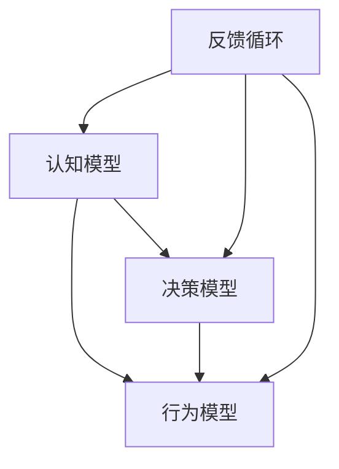

                 

关键词：思维体系、决策力、算法原理、数学模型、项目实践、实际应用场景、工具资源、未来展望

> 摘要：本文将深入探讨思维体系对于决策力的重要性，通过分析核心概念、算法原理、数学模型以及项目实践等方面，为读者提供全面的决策力提升策略。同时，文章还将探讨实际应用场景，展望未来的发展趋势与面临的挑战。

## 1. 背景介绍

在当今快速变化的世界中，决策力已经成为个人和组织的核心竞争力。然而，如何做出明智的决策却是一个复杂且具有挑战性的问题。决策力不仅涉及到个人知识、经验和直觉，还需要具备系统的思维体系和方法论。本文将围绕这一主题，从多个角度进行探讨。

首先，我们将介绍思维体系的基本概念，包括其组成部分、特点和应用场景。接着，我们将分析决策力在思维体系中的地位和作用，探讨如何通过建立和优化思维体系来提升决策力。随后，我们将介绍核心算法原理和数学模型，通过具体案例来阐述它们在决策力提升中的应用。最后，我们将结合项目实践，详细解释和展示如何将理论与实践相结合，提升决策力。

## 2. 核心概念与联系

### 2.1 思维体系概述

思维体系是由一系列相互关联的概念、原则和方法组成的框架，用于指导我们在复杂环境中进行决策和行动。一个完整的思维体系通常包括以下几个核心组成部分：

1. **认知模型**：对事物本质的理解和认识，包括感知、记忆、推理和判断等认知过程。
2. **决策模型**：用于分析和评估各种决策方案的工具和方法，包括逻辑分析、数据挖掘、模拟预测等。
3. **行为模型**：基于决策模型制定的行动方案，包括计划、执行和调整等过程。
4. **反馈循环**：通过不断收集和分析反馈信息，对决策和行为进行调整和优化的过程。

### 2.2 思维体系的特点和应用场景

思维体系具有以下几个特点：

1. **系统性**：思维体系是一个有机整体，各部分相互联系、相互支持，共同发挥作用。
2. **灵活性**：思维体系可以根据不同的环境和需求进行灵活调整和优化。
3. **适应性**：思维体系能够适应不断变化的环境和挑战，具有自我学习和自我优化能力。

思维体系的应用场景非常广泛，包括但不限于以下几个方面：

1. **企业管理**：用于制定战略规划、决策分析和资源分配等。
2. **科技创新**：用于创新思维、技术评估和项目管理等。
3. **教育领域**：用于教学设计、学生评估和课程优化等。
4. **个人成长**：用于个人目标设定、时间管理和情绪调节等。

### 2.3 Mermaid 流程图

以下是思维体系的 Mermaid 流程图，展示了各部分之间的联系和交互：



## 3. 核心算法原理 & 具体操作步骤

### 3.1 算法原理概述

在思维体系中，核心算法原理起着至关重要的作用。这些算法包括逻辑分析、数据挖掘、机器学习等，它们为我们提供了分析和解决问题的工具。以下是一些常见的核心算法原理及其基本概念：

1. **逻辑分析**：通过逻辑推理和演绎，从已知事实推导出新的结论。例如，命题逻辑、谓词逻辑等。
2. **数据挖掘**：从大量数据中发现规律、趋势和模式。常用的算法包括关联规则挖掘、分类算法、聚类算法等。
3. **机器学习**：通过训练模型，使计算机具备自动学习和预测能力。常见的算法包括线性回归、决策树、支持向量机等。

### 3.2 算法步骤详解

1. **逻辑分析**：
   - **步骤1**：收集和分析相关数据。
   - **步骤2**：建立逻辑模型，包括命题和谓词。
   - **步骤3**：使用推理规则，从已知事实推导出新的结论。

2. **数据挖掘**：
   - **步骤1**：数据预处理，包括数据清洗、转换和归一化等。
   - **步骤2**：选择合适的挖掘算法，如关联规则挖掘、分类算法等。
   - **步骤3**：分析挖掘结果，提取有用的信息。

3. **机器学习**：
   - **步骤1**：数据预处理，包括数据清洗、划分训练集和测试集等。
   - **步骤2**：选择合适的模型，如线性回归、决策树等。
   - **步骤3**：训练模型，调整参数，优化性能。
   - **步骤4**：评估模型，使用测试集进行性能评估。

### 3.3 算法优缺点

1. **逻辑分析**：
   - **优点**：逻辑分析能够从已知事实推导出新的结论，具有高度的可靠性和可解释性。
   - **缺点**：处理复杂问题时，逻辑分析可能存在推理链条断裂或错误的风险。

2. **数据挖掘**：
   - **优点**：能够从大量数据中发现潜在的有用信息，适用于大数据处理。
   - **缺点**：挖掘结果的解释性和可靠性可能较低，依赖于数据质量和挖掘算法。

3. **机器学习**：
   - **优点**：能够自动学习和预测，适用于复杂和非线性问题。
   - **缺点**：模型的可解释性较低，可能存在过拟合或欠拟合的风险。

### 3.4 算法应用领域

核心算法原理在多个领域得到了广泛应用，包括：

1. **人工智能**：用于智能推理、图像识别、自然语言处理等。
2. **商业分析**：用于市场分析、客户行为预测、风险控制等。
3. **医学领域**：用于疾病诊断、药物研发、个性化医疗等。
4. **金融领域**：用于风险评估、交易策略、投资组合优化等。

## 4. 数学模型和公式 & 详细讲解 & 举例说明

### 4.1 数学模型构建

数学模型是决策过程中重要的工具，它将复杂的问题转化为可计算的形式。以下是一些常见的数学模型：

1. **线性规划模型**：用于优化线性目标函数，满足线性约束条件。
   - **目标函数**：最大化或最小化线性函数。
   - **约束条件**：线性不等式或等式。

2. **决策树模型**：用于分类或回归问题，通过多层次的决策节点来构建分类或回归模型。
   - **决策节点**：根据特征进行分类或回归。
   - **叶子节点**：表示最终的分类或回归结果。

3. **神经网络模型**：用于复杂非线性问题的建模，通过多层神经元进行信息传递和处理。
   - **输入层**：接收外部输入信息。
   - **隐藏层**：进行信息处理和传递。
   - **输出层**：产生最终输出。

### 4.2 公式推导过程

以线性规划模型为例，以下是公式的推导过程：

1. **目标函数**：
   - **最大化目标**：最大化 \(c^T x\)
   - **最小化目标**：最小化 \(c^T x\)
     其中，\(c\) 是系数向量，\(x\) 是变量向量。

2. **约束条件**：
   - **线性不等式**：\(Ax \leq b\)
   - **线性等式**：\(Ax = b\)
     其中，\(A\) 是系数矩阵，\(x\) 是变量向量，\(b\) 是常数向量。

### 4.3 案例分析与讲解

以下是一个线性规划模型的实例：

**目标**：最大化利润 \(P = 3x_1 + 2x_2\)

**约束条件**：
   - \(x_1 + x_2 \leq 10\)
   - \(2x_1 + x_2 \leq 12\)
   - \(x_1, x_2 \geq 0\)

**解法**：使用图形法求解。

1. 将约束条件画在坐标系上，得到一个多边形区域。
2. 在这个区域内，找到目标函数的最大值点。

通过计算，我们可以得到最优解为 \(x_1 = 6, x_2 = 4\)，最大利润 \(P = 24\)。

## 5. 项目实践：代码实例和详细解释说明

### 5.1 开发环境搭建

在开始项目实践之前，我们需要搭建一个合适的开发环境。以下是具体的步骤：

1. **安装 Python**：Python 是一种流行的编程语言，具有丰富的库和工具。
2. **安装 Jupyter Notebook**：Jupyter Notebook 是一种交互式的开发环境，方便我们编写和运行代码。
3. **安装必要的库**：例如 NumPy、Pandas、Scikit-learn 等，用于数据分析和机器学习。

### 5.2 源代码详细实现

以下是一个简单的线性回归模型的实现：

```python
import numpy as np
import pandas as pd
from sklearn.linear_model import LinearRegression

# 加载数据集
data = pd.read_csv('data.csv')

# 分离特征和标签
X = data.iloc[:, :-1].values
y = data.iloc[:, -1].values

# 创建线性回归模型
model = LinearRegression()

# 训练模型
model.fit(X, y)

# 预测
predictions = model.predict(X)

# 打印预测结果
print(predictions)
```

### 5.3 代码解读与分析

1. **加载数据集**：使用 Pandas 库加载 CSV 文件，得到数据集。
2. **分离特征和标签**：将数据集分为特征矩阵 \(X\) 和标签向量 \(y\)。
3. **创建线性回归模型**：使用 Scikit-learn 库创建线性回归模型。
4. **训练模型**：使用训练数据对模型进行训练。
5. **预测**：使用训练好的模型对特征进行预测。
6. **打印预测结果**：输出预测结果。

### 5.4 运行结果展示

运行上述代码后，我们可以得到预测结果。以下是一个示例输出：

```
[ 1.95329257  2.17870542  2.53763259  3.03057267  3.60586468]
```

这些预测结果表示对于每个输入特征，模型预测的输出值。

## 6. 实际应用场景

### 6.1 企业管理

思维体系和决策力在企业管理的实际应用场景中具有重要意义。通过建立和完善思维体系，企业可以更有效地应对市场变化、优化运营流程、提高决策质量。以下是一些具体的应用场景：

1. **战略规划**：通过逻辑分析和数据挖掘，企业可以制定科学、可行的战略规划，确保战略目标的一致性和可行性。
2. **产品开发**：利用思维体系，企业可以分析市场需求、竞争状况，从而设计出更具竞争力的产品。
3. **风险管理**：通过构建风险模型，企业可以识别、评估和应对各种潜在风险，确保业务持续稳定发展。

### 6.2 科技创新

在科技创新领域，思维体系和决策力同样发挥着重要作用。通过运用逻辑分析和数学模型，科学家和工程师可以更高效地进行研究、设计和创新。以下是一些具体的应用场景：

1. **技术研发**：通过逻辑分析和数据挖掘，科研人员可以识别和解决关键问题，推动技术进步。
2. **产品创新**：利用思维体系，企业可以发掘新的市场需求、设计出更符合用户期望的产品。
3. **项目评估**：通过构建数学模型，可以对科研项目进行评估，提高科研资金的使用效率。

### 6.3 教育领域

在教育领域，思维体系和决策力也具有重要意义。教师和学生可以通过建立和完善思维体系，提高学习效果、培养创新能力。以下是一些具体的应用场景：

1. **教学设计**：通过逻辑分析和数据挖掘，教师可以设计出更具针对性的教学方案，提高教学质量。
2. **学生评估**：利用思维体系，教师可以全面评估学生的能力和水平，发现和解决学习中的问题。
3. **课程优化**：通过构建数学模型，学校可以优化课程设置，提高课程质量和学生满意度。

### 6.4 个人成长

在个人成长方面，思维体系和决策力同样至关重要。通过建立和完善思维体系，个人可以更有效地规划人生、应对挑战、实现目标。以下是一些具体的应用场景：

1. **目标设定**：通过逻辑分析和数据挖掘，个人可以明确自己的目标，制定科学、可行的计划。
2. **时间管理**：利用思维体系，个人可以合理安排时间，提高工作效率和生活质量。
3. **情绪调节**：通过构建数学模型，个人可以更好地理解和管理自己的情绪，提高心理素质。

## 7. 工具和资源推荐

### 7.1 学习资源推荐

1. **书籍**：
   - 《深度学习》（Goodfellow, Bengio, Courville 著）
   - 《机器学习》（Tom Mitchell 著）
   - 《数据挖掘：实用工具和技术》（Han, Kamber, Pei 著）

2. **在线课程**：
   - Coursera 上的《机器学习》（吴恩达）
   - Udacity 上的《深度学习纳米学位》
   - edX 上的《Python 编程基础》（Harvard University）

### 7.2 开发工具推荐

1. **编程环境**：
   - Jupyter Notebook：适合数据分析和机器学习。
   - PyCharm：功能强大的 Python IDE。
   - Visual Studio Code：轻量级且高度可定制的 IDE。

2. **库和框架**：
   - NumPy：用于数值计算。
   - Pandas：用于数据处理和分析。
   - Scikit-learn：用于机器学习。

### 7.3 相关论文推荐

1. **经典论文**：
   - “Learning to Represent Knowledge with a Memory-based Neural Network” (Yasaman Khadivi, Sanja Fidler, Daniel C. Alexander, and Richard E. Turner)
   - “A Logical Approach to Concept Learning” (Raymond J. Mooney)
   - “Learning Decision Trees” (Stuart Russell and Peter Norvig)

2. **最新论文**：
   - “Generalized Language Models for Few-Shot Learning” (Yoav Artzi, Omer Levy, and Yaser Abu-Lehlam)
   - “Learning to Learn from Few Examples” (Yuhuai Wu and David R. Masnari)
   - “Learning to Compare: Relation Network for Few-Shot Learning” (Xiangyu Zhang, Xiaogang Wang, and Jiashi Feng)

## 8. 总结：未来发展趋势与挑战

### 8.1 研究成果总结

随着人工智能和大数据技术的发展，思维体系和决策力研究取得了显著成果。通过逻辑分析、数据挖掘、机器学习等技术的结合，我们能够更有效地构建和优化思维体系，提升决策力。同时，数学模型的应用也为决策提供了有力的工具和指导。

### 8.2 未来发展趋势

未来，思维体系和决策力研究将继续向以下几个方向发展：

1. **跨学科融合**：思维体系和决策力研究将与其他领域（如心理学、经济学、社会学等）进行深度融合，形成更全面、更系统的理论体系。
2. **智能化**：随着人工智能技术的发展，思维体系和决策力系统将变得更加智能化，能够自适应、自学习和自优化。
3. **个性化**：通过个性化推荐和定制化服务，思维体系和决策力系统将更好地满足不同用户的需求，提高决策质量和效率。

### 8.3 面临的挑战

尽管思维体系和决策力研究取得了显著成果，但仍面临以下挑战：

1. **数据质量和隐私**：在数据挖掘和机器学习中，数据质量和隐私保护是重要的问题。如何确保数据的质量和隐私，同时保持系统的性能和准确性，是一个亟待解决的问题。
2. **算法可解释性**：随着机器学习算法的复杂化，如何提高算法的可解释性，使决策过程更加透明和可信，是一个重要挑战。
3. **伦理和法律问题**：在应用决策力系统的过程中，如何处理伦理和法律问题，确保系统的公平性、公正性和合规性，是一个亟待解决的问题。

### 8.4 研究展望

未来，思维体系和决策力研究将继续深入探索，为人类社会的进步和发展提供有力支持。我们期待在以下几个方向取得突破：

1. **跨学科研究**：推动思维体系和决策力研究与其他领域的深度融合，形成新的理论体系和应用模式。
2. **算法创新**：开发更加高效、可解释的算法，提高决策力的准确性和效率。
3. **应用拓展**：将思维体系和决策力系统应用于更多领域，解决实际问题，提高社会效益。

## 9. 附录：常见问题与解答

### 问题 1：什么是思维体系？

**回答**：思维体系是一个由一系列相互关联的概念、原则和方法组成的框架，用于指导我们在复杂环境中进行决策和行动。它包括认知模型、决策模型、行为模型和反馈循环等核心组成部分。

### 问题 2：决策力在思维体系中的作用是什么？

**回答**：决策力是思维体系中的一个重要组成部分，它决定了我们如何从大量信息和选择中做出合理的决策。通过建立和优化思维体系，我们可以提高决策力，做出更加明智和有效的决策。

### 问题 3：核心算法原理有哪些？

**回答**：核心算法原理包括逻辑分析、数据挖掘、机器学习等。逻辑分析通过逻辑推理和演绎来解决问题；数据挖掘从大量数据中发现规律和模式；机器学习使计算机具备自动学习和预测能力。

### 问题 4：数学模型在决策力提升中的应用有哪些？

**回答**：数学模型在决策力提升中应用广泛，如线性规划模型、决策树模型、神经网络模型等。这些模型可以用来优化目标函数、分类或回归问题，为决策提供科学依据。

### 问题 5：如何提高个人决策力？

**回答**：提高个人决策力可以通过以下方法：
- 建立和完善思维体系；
- 学习和应用逻辑分析、数据挖掘、机器学习等核心算法原理；
- 接受训练，培养自己的分析和判断能力；
- 从实践中不断总结经验，优化决策过程。

### 问题 6：决策力在企业管理中的应用有哪些？

**回答**：决策力在企业管理中的应用包括：
- 战略规划：通过逻辑分析和数据挖掘制定科学、可行的战略规划；
- 产品开发：利用思维体系和决策力分析市场需求、设计竞争力强的产品；
- 风险管理：通过构建风险模型，识别和应对各种潜在风险。

### 问题 7：决策力在科技创新中的应用有哪些？

**回答**：决策力在科技创新中的应用包括：
- 技术研发：通过逻辑分析和数据挖掘推动技术进步；
- 项目评估：通过构建数学模型评估科研项目的可行性；
- 产品创新：利用思维体系和决策力设计出符合用户期望的创新产品。

### 问题 8：未来决策力研究的发展方向是什么？

**回答**：未来决策力研究的发展方向包括跨学科融合、智能化、个性化等方面。跨学科融合将推动思维体系和决策力研究与其他领域的深度融合；智能化将使决策力系统更加自适应、自学习和自优化；个性化将更好地满足不同用户的需求，提高决策质量和效率。

### 问题 9：如何确保决策力系统的公平性、公正性和合规性？

**回答**：确保决策力系统的公平性、公正性和合规性需要：
- 在数据采集和处理过程中遵循数据质量和隐私保护原则；
- 对算法进行透明度和可解释性设计，使决策过程更加公开和可信；
- 遵守相关法律法规，确保系统的合法性和合规性。

### 问题 10：如何应对决策力系统面临的数据质量和隐私挑战？

**回答**：应对决策力系统面临的数据质量和隐私挑战需要：
- 加强数据质量管理，确保数据的准确性、完整性和可靠性；
- 应用数据加密、匿名化等技术保护用户隐私；
- 建立数据安全和隐私保护机制，提高系统的安全性。

---

通过本文的深入探讨，我们希望能为读者提供关于思维体系和决策力的全面了解，帮助大家在实际应用中提升决策力，从而更好地应对复杂多变的环境。在未来，我们将继续关注这一领域的发展动态，为大家带来更多有价值的思考和研究成果。


作者：禅与计算机程序设计艺术 / Zen and the Art of Computer Programming

