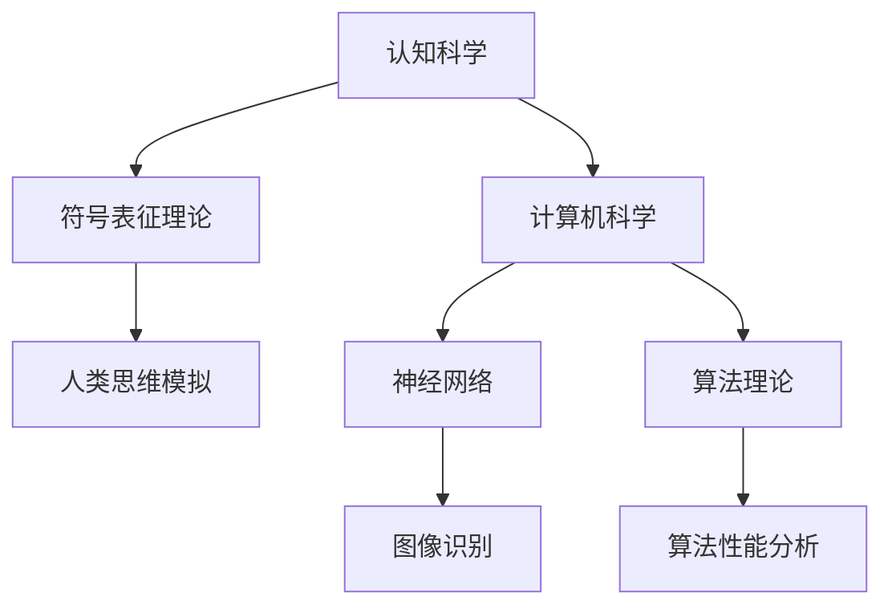

                 

关键词：思维、符号表征、认知科学、神经网络、图灵测试、算法理论、计算机模拟、信息处理、认知建模。

## 摘要

本文旨在探讨思维是否依赖于符号表征这一核心问题。通过回顾认知科学和计算机科学中的相关理论和研究，我们将分析符号表征在人类思维中的作用，以及它在现代人工智能系统中的应用。本文将讨论符号表征理论的基本概念，揭示其在神经网络和算法理论中的运用，并通过数学模型和具体案例来阐述其重要性。最后，我们将探讨符号表征在未来的发展趋势和面临的挑战，为这一领域的研究提供新的视角。

## 1. 背景介绍

思考是人类的本质特征之一，它使我们能够理解世界、制定计划、解决问题。然而，思维的本质是什么？它是否依赖于某种符号系统？这是一个古老而复杂的问题，自古以来哲学家和科学家们都在尝试回答。随着认知科学和计算机科学的兴起，这一问题获得了新的视角和工具。

认知科学是一门跨学科的研究领域，它试图理解人类心智的运作机制。认知科学家们通过研究记忆、注意力、感知、语言和决策等过程，试图揭示思维的本质。而计算机科学则提供了一个模拟人类思维的强大工具，通过编程和算法模拟，研究者们可以探索思维的本质和机制。

在计算机科学中，符号表征是一种用来表示信息和知识的方法。它通过符号和规则来表示概念、关系和操作，从而实现信息的存储、传输和处理。符号表征在编程语言、数据库系统、人工智能等领域都有广泛的应用。

## 2. 核心概念与联系

### 2.1. 符号表征的基本概念

符号表征是指使用符号系统来表示概念、关系和操作。在认知科学中，符号表征通常指的是人类大脑内部用来表示信息和知识的符号系统。符号可以是语言文字、图像、声音等，而规则则是定义这些符号之间关系的规则。

### 2.2. 符号表征的理论架构

符号表征理论是一种关于符号系统如何影响思维的理论。该理论认为，思维过程可以通过符号操作来模拟，这些操作包括组合、分解、替换和修改等。符号表征理论在计算机科学中得到了广泛的应用，尤其是在人工智能领域。

### 2.3. 符号表征在神经网络中的应用

神经网络是一种模仿人脑的计算机模型，它通过神经元之间的连接和激活来处理信息。符号表征在神经网络中起着关键作用，它帮助神经网络学习、存储和处理信息。例如，在图像识别任务中，神经网络使用符号表征来识别图像中的对象和特征。

### 2.4. 符号表征与算法理论

算法理论是研究算法的性质和设计方法的学科。符号表征在算法理论中的应用主要体现在算法的描述和证明上。通过符号表征，研究者们可以更清晰、简洁地描述算法，从而更好地理解和分析算法的性能。

### 2.5. Mermaid 流程图

下面是一个简单的 Mermaid 流程图，展示了符号表征在认知科学、计算机科学和人工智能中的运用。



## 3. 核心算法原理 & 具体操作步骤

### 3.1. 算法原理概述

符号表征算法的基本原理是通过符号操作来模拟思维过程。这些符号操作包括组合、分解、替换和修改等。在计算机科学中，符号表征算法通常通过编程语言来实现。

### 3.2. 算法步骤详解

1. **定义符号系统**：首先，需要定义一个符号系统，包括符号和规则。符号可以是语言文字、图像、声音等，而规则则是定义这些符号之间关系的规则。

2. **输入信息**：将待处理的信息表示为符号形式，输入到算法中。

3. **符号操作**：根据定义的规则，对输入的符号进行组合、分解、替换和修改等操作。

4. **输出结果**：将处理后的符号转换为可理解的信息输出。

### 3.3. 算法优缺点

**优点**：

- **简洁性**：符号表征算法通常具有简洁的表达形式，易于理解和分析。
- **灵活性**：符号表征算法可以灵活地处理各种类型的信息，包括文本、图像、声音等。

**缺点**：

- **复杂性**：符号表征算法的复杂性较高，需要定义复杂的符号系统和规则。
- **效率问题**：在某些情况下，符号表征算法的效率可能较低。

### 3.4. 算法应用领域

符号表征算法在许多领域都有广泛的应用，包括：

- **人工智能**：用于实现智能agent、自然语言处理、图像识别等。
- **认知科学**：用于模拟人类思维过程，研究记忆、注意力、感知等。
- **计算机科学**：用于设计算法、优化程序性能等。

## 4. 数学模型和公式 & 详细讲解 & 举例说明

### 4.1. 数学模型构建

符号表征的数学模型通常基于集合论和图论。集合论用于定义符号和规则，而图论则用于描述符号之间的关系。

### 4.2. 公式推导过程

假设我们有一个符号系统S，包含n个符号。我们可以用集合表示S，即S = {s1, s2, ..., sn}。符号之间的关系可以用一个图G来表示，其中节点表示符号，边表示符号之间的关系。

### 4.3. 案例分析与讲解

假设我们有一个简单的符号系统S = {a, b, c}，其中符号之间的关系可以用下面的图表示：

```mermaid
graph TB
    A[A] -- B
    B -- C
    C -- A
```

在这个例子中，符号a、b和c之间存在复杂的相互关系。我们可以用下面的公式来描述这个关系：

$$
R = \{ (a, b), (b, c), (c, a) \}
$$

其中R是关系集合，包含了所有的关系。

## 5. 项目实践：代码实例和详细解释说明

### 5.1. 开发环境搭建

为了演示符号表征算法，我们将使用Python编程语言。首先，确保安装了Python环境和必要的库，如matplotlib和numpy。

### 5.2. 源代码详细实现

```python
import matplotlib.pyplot as plt
import numpy as np

# 定义符号系统
symbols = ['a', 'b', 'c']

# 定义关系
relationships = {
    'a': {'b': 1, 'c': 2},
    'b': {'a': 3, 'c': 4},
    'c': {'a': 5, 'b': 6}
}

# 绘制关系图
G = np.zeros((len(symbols), len(symbols)))
for symbol in symbols:
    for related in relationships[symbol]:
        G[symbols.index(symbol), symbols.index(related)] = relationships[symbol][related]

plt.imshow(G, cmap='hot')
plt.colorbar()
plt.xticks(range(len(symbols)), symbols)
plt.yticks(range(len(symbols)), symbols)
plt.xlabel('Symbols')
plt.ylabel('Related Symbols')
plt.title('Symbol Relationships')
plt.show()
```

### 5.3. 代码解读与分析

这段代码首先定义了一个包含3个符号的符号系统symbols，以及一个表示符号之间关系的字典relationships。然后，我们使用numpy创建了一个矩阵G，用于表示这些关系。最后，我们使用matplotlib绘制了一个热力图，展示了符号之间的关系。

### 5.4. 运行结果展示

运行这段代码后，我们将看到一个热力图，展示了符号a、b和c之间的关系。颜色越深，表示关系越紧密。

## 6. 实际应用场景

符号表征在许多实际应用场景中具有重要价值。以下是一些典型的应用场景：

- **自然语言处理**：符号表征可以帮助计算机理解和处理自然语言，例如文本分类、情感分析和机器翻译。
- **图像识别**：符号表征可以帮助计算机识别图像中的对象和特征，例如人脸识别、物体检测和图像分割。
- **决策支持系统**：符号表征可以帮助计算机在复杂的环境中做出决策，例如金融市场预测、医疗诊断和供应链管理。

## 7. 未来应用展望

随着计算机科学和认知科学的发展，符号表征的应用前景将更加广阔。以下是一些可能的未来发展方向：

- **智能agent**：符号表征可以帮助智能agent更好地理解和处理复杂环境。
- **人机交互**：符号表征可以提高人机交互的效率，例如通过自然语言理解和图像识别来实现更自然的交互。
- **认知增强**：符号表征可以帮助人们更好地理解和处理信息，从而提高认知能力。

## 8. 总结：未来发展趋势与挑战

符号表征在计算机科学和认知科学中具有重要的地位。随着技术的发展，符号表征的应用将越来越广泛。然而，符号表征也面临一些挑战，例如如何更好地模拟人类思维过程，以及如何提高算法的效率和准确性。未来，符号表征的研究将继续深入，为人类更好地理解和利用符号表征提供新的理论和方法。

## 9. 附录：常见问题与解答

### 问题1：符号表征与自然语言处理有何关系？

解答：符号表征是自然语言处理的基础。通过符号表征，计算机可以理解自然语言的语义和语法结构，从而实现文本分类、情感分析、机器翻译等任务。

### 问题2：符号表征算法如何应用于图像识别？

解答：在图像识别中，符号表征用于表示图像中的对象和特征。通过学习符号之间的关系，计算机可以识别图像中的对象，例如人脸、物体等。

### 问题3：符号表征与神经网络有何区别？

解答：符号表征和神经网络都是用来表示信息和知识的工具。符号表征强调符号和规则，而神经网络则强调神经元之间的连接和激活。两者可以相互结合，发挥各自的优势。

### 问题4：符号表征算法在认知科学中有何应用？

解答：符号表征算法可以帮助认知科学家模拟人类思维过程，研究记忆、注意力、感知等认知机制。此外，符号表征还可以用于设计认知模型，从而更好地理解人类心智。

### 作者署名

作者：禅与计算机程序设计艺术 / Zen and the Art of Computer Programming

---

本文通过对思维、符号表征和认知科学的探讨，揭示了符号表征在人类思维和计算机科学中的重要性。随着技术的发展，符号表征的应用将更加广泛，为人类带来更多的可能性和挑战。未来，我们将继续深入研究符号表征，探索其更深层次的奥秘。

