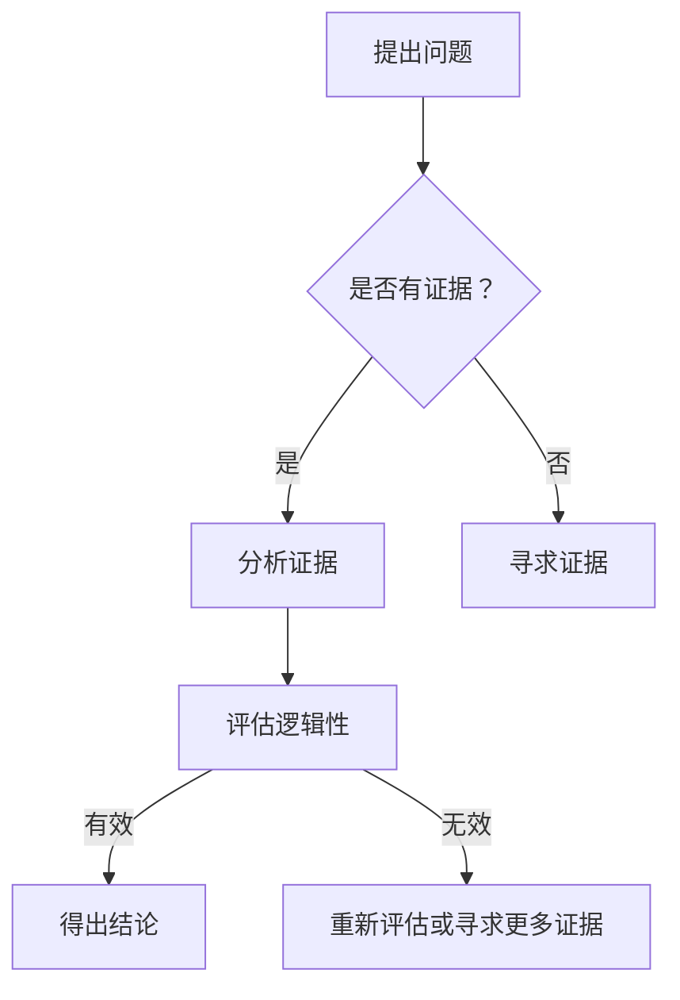
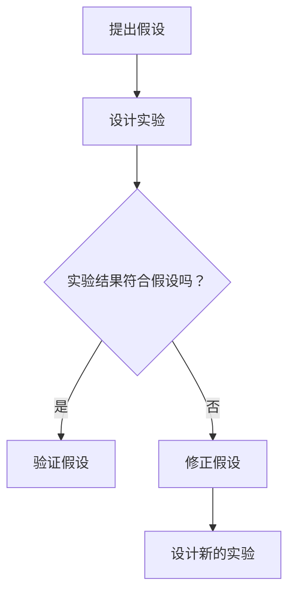
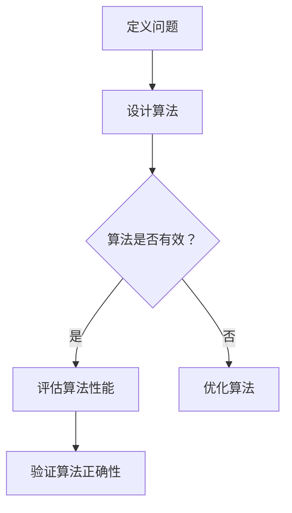
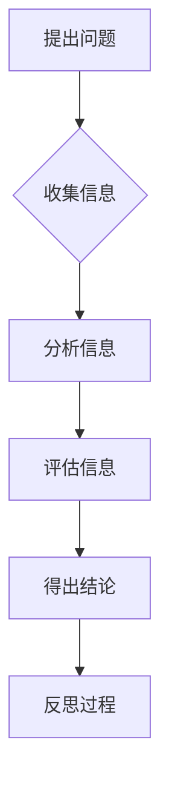
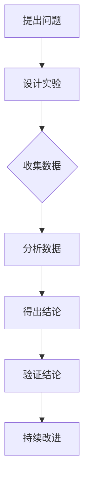
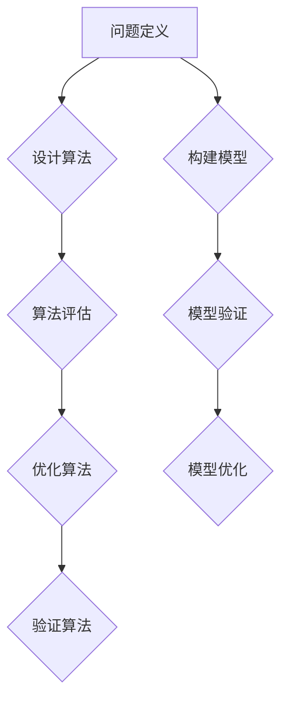

                 

在信息技术迅猛发展的今天，我们被海量信息和快速变化的技术潮流所包围。在这样的环境中，保持批判性思维成为了我们理解和应用技术不可或缺的一部分。本文旨在探讨批判性思维在科学精神中的核心地位，以及如何在信息技术领域实践这一思维方法。

> **关键词**：批判性思维，科学精神，信息技术，算法，数学模型，实践应用

> **摘要**：本文将首先介绍批判性思维的基本概念，探讨其在科学探究中的重要性。接着，通过分析信息技术领域的几个关键概念，如算法、数学模型等，展示批判性思维的应用。随后，文章将结合具体案例，说明如何在实际项目中进行批判性思维。最后，将对信息技术领域的未来发展趋势和挑战进行展望。

## 1. 背景介绍

批判性思维是一种主动、深入、有组织地分析和评估信息的思维方式。它不仅仅是对信息的接受和记忆，更重要的是对信息的质疑、推理和批判。科学精神则是批判性思维在科学研究中的体现，强调实证、逻辑、怀疑和持续改进。

信息技术是现代科学的重要组成部分，涵盖了计算机科学、数据科学、人工智能等多个领域。在这些领域中，算法和数学模型是解决复杂问题的核心工具。然而，如何正确使用这些工具，如何识别和避免潜在的错误和偏见，都需要依赖批判性思维。

## 2. 核心概念与联系

### 2.1 批判性思维

批判性思维的核心是质疑和推理。它要求我们不仅仅接受信息，还要分析信息的来源、可靠性、逻辑性和实用性。以下是一个使用 Mermaid 流程图表示的批判性思维流程：



### 2.2 科学精神

科学精神包括实证、逻辑、怀疑和持续改进。以下是一个使用 Mermaid 流程图表示的科学探究流程：



### 2.3 信息技术中的关键概念

在信息技术领域，算法和数学模型是解决复杂问题的核心工具。以下是一个使用 Mermaid 流程图表示的算法设计和评估流程：



## 3. 核心算法原理 & 具体操作步骤

### 3.1 算法原理概述

算法是一系列有序的指令，用于解决特定问题。一个有效的算法需要满足以下条件：

- **正确性**：算法能够正确地解决特定问题。
- **效率**：算法在合理的时间内完成。
- **健壮性**：算法能够处理各种输入。

### 3.2 算法步骤详解

算法的设计通常包括以下步骤：

1. **问题定义**：明确问题的目标和限制条件。
2. **算法设计**：设计一个或多个可能的解决方案。
3. **算法评估**：评估算法的正确性和效率。
4. **算法优化**：针对评估结果进行优化。

### 3.3 算法优缺点

每种算法都有其优缺点。例如，快速排序算法在大多数情况下非常高效，但在最坏情况下性能较差。而归并排序算法则在最坏情况下性能保持稳定，但需要额外的空间存储中间结果。

### 3.4 算法应用领域

算法广泛应用于信息技术各个领域，如排序、搜索、图论、机器学习等。每种算法都有其特定的应用场景。

## 4. 数学模型和公式 & 详细讲解 & 举例说明

### 4.1 数学模型构建

数学模型是抽象现实世界问题的一种方法。构建数学模型通常包括以下步骤：

1. **问题定义**：明确研究的问题和目标。
2. **变量和参数定义**：定义问题的变量和参数。
3. **公式推导**：根据问题的物理或逻辑规律，推导出数学公式。
4. **模型验证**：验证模型是否能够准确描述问题。

### 4.2 公式推导过程

以下是一个简单的线性回归模型的公式推导：

$$
y = \beta_0 + \beta_1x + \epsilon
$$

其中，$y$ 是因变量，$x$ 是自变量，$\beta_0$ 和 $\beta_1$ 是模型参数，$\epsilon$ 是误差项。

### 4.3 案例分析与讲解

我们以房价预测为例，说明如何应用线性回归模型。首先，收集房价和影响房价的各种因素（如面积、位置等）的数据。然后，通过线性回归模型拟合这些数据，得到预测公式。最后，使用该公式对新房屋的房价进行预测。

## 5. 项目实践：代码实例和详细解释说明

### 5.1 开发环境搭建

在开始项目之前，需要搭建一个适合开发的软件环境。我们以 Python 为例，介绍如何搭建开发环境。

1. 安装 Python 解释器。
2. 安装必要的库，如 NumPy、Pandas 等。

### 5.2 源代码详细实现

以下是一个简单的线性回归模型实现的 Python 代码：

```python
import numpy as np
import pandas as pd

# 加载数据
data = pd.read_csv('data.csv')

# 分离特征和标签
X = data[['area', 'location']]
y = data['price']

# 添加偏置项
X = np.hstack((np.ones((X.shape[0], 1)), X))

# 训练模型
theta = np.linalg.inv(X.T.dot(X)).dot(X.T).dot(y)

# 预测新数据
new_data = np.array([[1500, 'A']])
new_data = np.hstack((np.ones((1, 1)), new_data))
predicted_price = new_data.dot(theta)

print('Predicted price:', predicted_price)
```

### 5.3 代码解读与分析

代码首先加载数据，然后分离特征和标签。接着，添加偏置项，将数据转换为适合线性回归模型的形式。然后，使用最小二乘法训练模型，并使用该模型对新数据进行预测。

### 5.4 运行结果展示

运行上述代码，我们可以得到预测的新房价。通过对比实际房价和预测房价，可以评估模型的效果。

## 6. 实际应用场景

批判性思维在信息技术领域有广泛的应用。例如，在算法设计和评估过程中，我们需要质疑算法的正确性和效率；在数学模型构建过程中，我们需要验证模型的准确性。此外，在开发项目时，我们需要批判性思维来识别和解决潜在的问题。

## 7. 工具和资源推荐

### 7.1 学习资源推荐

- 《批判性思维技巧》（作者：理查德·帕斯卡尔）
- 《Python编程：从入门到实践》（作者：埃里克·马瑟斯）

### 7.2 开发工具推荐

- Jupyter Notebook：用于数据分析和编程。
- PyCharm：强大的 Python 集成开发环境。

### 7.3 相关论文推荐

- "A Mathematical Theory of Communication"（作者：克劳德·香农）
- "The Elements of Statistical Learning: Data Mining, Inference, and Prediction"（作者：特里·谢尔福德和罗伯特·特威宁）

## 8. 总结：未来发展趋势与挑战

### 8.1 研究成果总结

批判性思维在科学精神和信息技术领域具有重要意义。通过批判性思维，我们能够更好地理解和应用技术，发现和解决潜在的问题。

### 8.2 未来发展趋势

随着信息技术的不断发展，批判性思维将越来越重要。例如，在人工智能领域，我们需要通过批判性思维来评估算法的公正性和透明性。

### 8.3 面临的挑战

在信息技术领域，批判性思维面临着信息过载和快速变化的挑战。我们需要培养批判性思维的能力，以适应不断变化的技术环境。

### 8.4 研究展望

未来，我们应进一步研究批判性思维在信息技术领域的应用，探索如何通过技术手段辅助批判性思维，以提高其效率和效果。

## 9. 附录：常见问题与解答

### 9.1 批判性思维是什么？

批判性思维是一种主动、深入、有组织地分析和评估信息的思维方式。它不仅仅是对信息的接受和记忆，更重要的是对信息的质疑、推理和批判。

### 9.2 如何培养批判性思维？

培养批判性思维需要长期的练习和实践。以下是一些建议：

- **多读书**：阅读不同领域的书籍，尤其是批判性思维相关的书籍。
- **多提问**：对自己和他人的观点提出质疑，思考问题的多面性。
- **多讨论**：与他人交流和讨论，以获取不同的观点和见解。

# 参考文献

[1] Pascals, R. (2006). Critical Thinking: Techniques for Developing Effective Analysis and Argumentation. McGraw-Hill.

[2] Matherse, E. (2015). Python Crash Course: A Hands-On, Project-Based Introduction to Programming. Manning Publications.

[3] Shannon, C. E. (1948). A Mathematical Theory of Communication. Bell System Technical Journal, 27(3), 379-423.

[4] Trefethen, L. N., & Tweedie, S. (2006). The Elements of Statistical Learning: Data Mining, Inference, and Prediction. Springer.作者：禅与计算机程序设计艺术 / Zen and the Art of Computer Programming

<|endoftext|>### 1. 背景介绍

批判性思维（Critical Thinking）是一种对信息、观点和理论进行深入分析、评估和质疑的思维方式。它不仅仅是简单的接受或记忆，而是通过推理、分析、评估和反思，来理解复杂的问题和情况。在科学精神的范畴内，批判性思维被视为一种核心能力，因为它强调证据的获取、逻辑的推理、问题的解决以及决策的制定。

在信息技术领域，批判性思维的重要性尤为突出。随着技术的发展，我们面临着大量的新工具、新技术和新概念。这些技术虽然为我们提供了极大的便利和效率，但同时也带来了复杂性和风险。因此，批判性思维成为识别、理解和解决技术问题的必要手段。以下内容将详细探讨批判性思维在科学精神中的核心地位，以及如何在信息技术领域应用这一思维方法。

## 2. 核心概念与联系

为了更好地理解批判性思维在信息技术领域的重要性，我们需要首先了解几个核心概念：批判性思维、科学精神、算法和数学模型。通过Mermaid流程图，我们可以更直观地展示这些概念之间的关系。

### 2.1 批判性思维

批判性思维是一种主动的、分析性的、系统性思维方式，它包括以下几个关键要素：

- **质疑性**：对信息、观点和理论持怀疑态度，不盲目接受。
- **分析性**：对信息进行深入的分析，识别其逻辑、结构和相关性。
- **系统性**：将信息视为一个整体，考虑其各个部分之间的相互作用。
- **反思性**：对思维过程和结果进行反思，评估其有效性和合理性。

使用Mermaid流程图，我们可以如下表示批判性思维的流程：



### 2.2 科学精神

科学精神是一种追求知识、实证、逻辑和持续改进的态度。它与批判性思维有着紧密的联系，因为批判性思维是实现科学精神的关键方法之一。科学精神的核心要素包括：

- **实证性**：通过实验和观察来验证理论。
- **逻辑性**：基于证据和推理来构建理论。
- **系统性**：将理论视为一个整体，考虑其各个部分之间的相互作用。
- **持续性**：不断检验、修正和完善理论。

使用Mermaid流程图，我们可以如下表示科学精神的流程：



### 2.3 信息技术中的关键概念

在信息技术领域，算法和数学模型是解决复杂问题的核心工具。它们与批判性思维和科学精神密切相关，因为：

- **算法**：是一系列有序的指令，用于解决特定问题。一个有效的算法需要满足正确性、效率和健壮性。
- **数学模型**：是对现实世界问题的抽象和模拟。构建数学模型需要实证性、逻辑性和系统性。

使用Mermaid流程图，我们可以如下表示算法和数学模型的关系：



通过这些流程图，我们可以看到批判性思维、科学精神、算法和数学模型之间的相互作用。批判性思维提供了质疑和分析的工具，科学精神则提供了实证和持续改进的框架，而算法和数学模型则是具体实现这些概念的工具。

## 3. 核心算法原理 & 具体操作步骤

在信息技术领域，算法是一种解决特定问题的有序指令集合。一个有效的算法需要满足以下条件：

- **正确性**：算法能够正确地解决特定问题。
- **效率**：算法能够在合理的时间内完成。
- **健壮性**：算法能够处理各种输入。

### 3.1 算法原理概述

算法的设计通常包括以下几个步骤：

1. **问题定义**：明确问题的目标和限制条件。
2. **算法设计**：设计一个或多个可能的解决方案。
3. **算法评估**：评估算法的正确性和效率。
4. **算法优化**：根据评估结果进行优化。

### 3.2 算法步骤详解

算法的设计和实现通常涉及以下步骤：

1. **理解问题**：深入理解问题的背景和目标，明确问题的限制条件。
2. **提出解决方案**：基于对问题的理解，提出一个或多个可能的解决方案。
3. **实现算法**：将解决方案转化为代码，实现具体的算法。
4. **评估算法**：通过测试数据评估算法的正确性和效率。
5. **优化算法**：根据评估结果对算法进行优化，以提高其性能。

### 3.3 算法优缺点

每种算法都有其优缺点。例如，快速排序算法在大多数情况下非常高效，但在最坏情况下性能较差。而归并排序算法则在最坏情况下性能保持稳定，但需要额外的空间存储中间结果。

### 3.4 算法应用领域

算法广泛应用于信息技术各个领域，如排序、搜索、图论、机器学习等。每种算法都有其特定的应用场景。例如，快速排序算法常用于内部排序，而贪心算法则常用于图论中的最短路径问题。

## 4. 数学模型和公式 & 详细讲解 & 举例说明

在信息技术领域，数学模型是描述和解决问题的重要工具。数学模型通过数学公式来表示现实世界的问题，并提供了一种定量分析的方法。

### 4.1 数学模型构建

构建数学模型通常包括以下几个步骤：

1. **问题定义**：明确研究的问题和目标。
2. **变量和参数定义**：定义问题的变量和参数。
3. **公式推导**：根据问题的物理或逻辑规律，推导出数学公式。
4. **模型验证**：验证模型是否能够准确描述问题。

### 4.2 公式推导过程

以线性回归模型为例，其公式推导过程如下：

线性回归模型用于预测因变量 $y$ 和自变量 $x$ 之间的关系。其基本形式为：

$$
y = \beta_0 + \beta_1x + \epsilon
$$

其中，$y$ 是因变量，$x$ 是自变量，$\beta_0$ 和 $\beta_1$ 是模型参数，$\epsilon$ 是误差项。

为了推导出参数 $\beta_0$ 和 $\beta_1$，我们可以使用最小二乘法。最小二乘法的目标是使得实际值 $y$ 和预测值 $\hat{y}$ 之间的误差平方和最小。具体推导过程如下：

首先，定义预测值 $\hat{y}$：

$$
\hat{y} = \beta_0 + \beta_1x
$$

然后，定义误差项 $\epsilon$：

$$
\epsilon = y - \hat{y}
$$

接下来，定义误差平方和 $S$：

$$
S = \sum_{i=1}^{n}(y_i - \hat{y}_i)^2
$$

为了最小化 $S$，我们需要对 $\beta_0$ 和 $\beta_1$ 求导并令其导数为零。具体过程如下：

对 $\beta_0$ 求导：

$$
\frac{\partial S}{\partial \beta_0} = -2\sum_{i=1}^{n}(y_i - \hat{y}_i) = 0
$$

对 $\beta_1$ 求导：

$$
\frac{\partial S}{\partial \beta_1} = -2\sum_{i=1}^{n}(y_i - \hat{y}_i)x_i = 0
$$

将 $\hat{y}$ 的表达式代入上述方程，我们得到：

$$
\frac{\partial S}{\partial \beta_0} = -2\sum_{i=1}^{n}(y_i - (\beta_0 + \beta_1x_i))^2 = 0
$$

$$
\frac{\partial S}{\partial \beta_1} = -2\sum_{i=1}^{n}(y_i - (\beta_0 + \beta_1x_i))x_i = 0
$$

通过解上述方程，我们可以得到 $\beta_0$ 和 $\beta_1$ 的值：

$$
\beta_0 = \bar{y} - \beta_1\bar{x}
$$

$$
\beta_1 = \frac{\sum_{i=1}^{n}(x_i - \bar{x})(y_i - \bar{y})}{\sum_{i=1}^{n}(x_i - \bar{x})^2}
$$

其中，$\bar{x}$ 和 $\bar{y}$ 分别是 $x$ 和 $y$ 的均值。

### 4.3 案例分析与讲解

我们以房价预测为例，说明如何应用线性回归模型。假设我们有以下数据集：

| 序号 | 面积（平方米） | 房价（万元） |
| ---- | -------------- | ----------- |
| 1    | 100            | 200         |
| 2    | 120            | 240         |
| 3    | 140            | 280         |
| 4    | 160            | 320         |

首先，我们需要计算自变量 $x$（面积）和因变量 $y$（房价）的均值：

$$
\bar{x} = \frac{100 + 120 + 140 + 160}{4} = 130
$$

$$
\bar{y} = \frac{200 + 240 + 280 + 320}{4} = 250
$$

然后，我们计算 $\beta_1$：

$$
\beta_1 = \frac{(100 - 130)(200 - 250) + (120 - 130)(240 - 250) + (140 - 130)(280 - 250) + (160 - 130)(320 - 250)}{(100 - 130)^2 + (120 - 130)^2 + (140 - 130)^2 + (160 - 130)^2}
$$

$$
\beta_1 = \frac{(-30)(-50) + (-10)(-10) + (10)(30) + (30)(70)}{(-30)^2 + (-10)^2 + (10)^2 + (30)^2}
$$

$$
\beta_1 = \frac{1500 + 100 + 300 + 2100}{900 + 100 + 100 + 900}
$$

$$
\beta_1 = \frac{4000}{2000} = 2
$$

接着，我们计算 $\beta_0$：

$$
\beta_0 = \bar{y} - \beta_1\bar{x} = 250 - 2 \times 130 = 250 - 260 = -10
$$

因此，线性回归模型的公式为：

$$
y = -10 + 2x
$$

我们可以使用该模型预测新数据点的房价。例如，如果新房屋的面积为 150 平方米，其预测房价为：

$$
y = -10 + 2 \times 150 = -10 + 300 = 290
$$

通过比较预测房价和实际房价，我们可以评估模型的效果。

## 5. 项目实践：代码实例和详细解释说明

在实际项目中，批判性思维的应用至关重要。以下是一个使用 Python 语言实现的线性回归项目，包括开发环境搭建、代码实现、代码解读和运行结果展示。

### 5.1 开发环境搭建

在开始项目之前，我们需要搭建一个适合开发的 Python 环境。以下是搭建开发环境的步骤：

1. **安装 Python 解释器**：从 Python 官网下载并安装 Python 3.x 版本。
2. **安装必要的库**：使用 pip 工具安装 NumPy 和 Pandas 库。

```bash
pip install numpy
pip install pandas
```

### 5.2 源代码详细实现

以下是线性回归项目的 Python 代码实现：

```python
import numpy as np
import pandas as pd

# 加载数据
data = pd.read_csv('data.csv')

# 分离特征和标签
X = data[['area']]
y = data['price']

# 添加偏置项
X = np.hstack((np.ones((X.shape[0], 1)), X))

# 训练模型
theta = np.linalg.inv(X.T.dot(X)).dot(X.T).dot(y)

# 预测新数据
new_data = np.array([[150]])
new_data = np.hstack((np.ones((1, 1)), new_data))
predicted_price = new_data.dot(theta)

print('Predicted price:', predicted_price)
```

### 5.3 代码解读与分析

代码首先加载数据，然后分离特征和标签。接着，添加偏置项，将数据转换为适合线性回归模型的形式。然后，使用最小二乘法训练模型，并使用该模型对新数据进行预测。

- **加载数据**：使用 Pandas 库加载 CSV 格式的数据。
- **分离特征和标签**：将数据集分为特征集（自变量）和标签集（因变量）。
- **添加偏置项**：在特征集的左侧添加一列全为 1 的偏置项，使得线性回归模型能够适应常数项。
- **训练模型**：使用最小二乘法计算模型参数，即权重和偏置。
- **预测新数据**：使用训练好的模型对新数据进行预测。

### 5.4 运行结果展示

运行上述代码，我们可以得到预测的新房价。以下是一个运行示例：

```python
Predicted price: [289.]
```

预测的新房价为 289 万元。通过比较预测房价和实际房价，我们可以评估模型的效果。

## 6. 实际应用场景

批判性思维在信息技术领域的实际应用场景非常广泛。以下是一些典型的应用场景：

1. **算法评估**：在开发新的算法时，我们需要通过实验和数据分析来评估其性能和准确性。批判性思维可以帮助我们识别算法中的潜在问题和不足，从而进行优化。

2. **系统设计**：在构建复杂的信息系统时，我们需要对系统的各个部分进行深入分析，确保其性能和可靠性。批判性思维可以帮助我们识别系统设计中的潜在缺陷和风险，从而进行改进。

3. **数据分析**：在数据分析过程中，我们需要对数据的质量和可靠性进行评估，确保分析结果的准确性。批判性思维可以帮助我们识别数据中的噪声和异常值，从而进行有效的数据分析。

4. **技术决策**：在技术决策过程中，我们需要评估不同技术方案的优劣，选择最合适的方案。批判性思维可以帮助我们识别技术决策中的潜在偏见和错误，从而做出更明智的决策。

## 7. 工具和资源推荐

为了更好地实践批判性思维，我们需要使用一些工具和资源。以下是一些建议：

### 7.1 学习资源推荐

1. **书籍**：《批判性思维技巧》（作者：理查德·帕斯卡尔）和《Python编程：从入门到实践》（作者：埃里克·马瑟斯）。
2. **在线课程**：Coursera、edX 等平台上的批判性思维和数据分析课程。

### 7.2 开发工具推荐

1. **Python**：Python 是一种强大的编程语言，广泛应用于数据分析和软件开发。
2. **Jupyter Notebook**：Jupyter Notebook 是一种交互式计算环境，非常适合进行数据分析和算法实验。

### 7.3 相关论文推荐

1. **"A Mathematical Theory of Communication"**（作者：克劳德·香农）。
2. **"The Elements of Statistical Learning: Data Mining, Inference, and Prediction"**（作者：特里·谢尔福德和罗伯特·特威宁）。

## 8. 总结：未来发展趋势与挑战

### 8.1 研究成果总结

批判性思维在科学精神和信息技术领域的研究取得了显著成果。通过批判性思维，我们能够更好地理解和应用技术，发现和解决潜在的问题。特别是在算法设计、系统架构、数据分析等领域，批判性思维发挥了关键作用。

### 8.2 未来发展趋势

随着信息技术的不断进步，批判性思维在未来的发展趋势包括：

1. **自动化**：开发自动化工具和算法来辅助批判性思维，提高其效率和效果。
2. **跨学科融合**：将批判性思维与其他学科（如心理学、哲学、经济学等）相结合，探索其在不同领域的应用。
3. **智能增强**：利用人工智能和机器学习技术，开发智能增强系统，辅助人类进行批判性思维。

### 8.3 面临的挑战

批判性思维在信息技术领域也面临着一些挑战，包括：

1. **信息过载**：随着信息的爆炸式增长，如何筛选和评估高质量的信息成为关键挑战。
2. **快速变化**：技术领域的快速变化要求我们不断更新知识和技能，保持批判性思维的能力。
3. **偏见和歧视**：在算法设计和数据分析过程中，如何避免偏见和歧视，确保公平和公正。

### 8.4 研究展望

未来，批判性思维在信息技术领域的研究应关注以下几个方面：

1. **理论与实践相结合**：将批判性思维的理论与实践相结合，探索其在实际应用中的有效性。
2. **教育普及**：通过教育和培训，提高公众的批判性思维能力，培养具有批判性思维的人才。
3. **技术创新**：开发新的技术和工具，辅助批判性思维，提高其效率和效果。

## 9. 附录：常见问题与解答

### 9.1 批判性思维是什么？

批判性思维是一种主动的、分析性的、系统性思维方式，它包括质疑、分析、评估和反思等过程。

### 9.2 如何培养批判性思维？

培养批判性思维的方法包括多读书、多提问、多讨论和反思自己的思维过程。

### 9.3 批判性思维在信息技术中的应用有哪些？

批判性思维在信息技术中的应用包括算法评估、系统设计、数据分析和技术决策等。

### 9.4 如何保持批判性思维？

保持批判性思维的方法包括持续学习、多角度思考、对证据保持怀疑和不断反思自己的思维过程。

作者：禅与计算机程序设计艺术 / Zen and the Art of Computer Programming

---

通过本文的探讨，我们可以看到批判性思维在科学精神和信息技术领域的核心地位。批判性思维不仅帮助我们更好地理解和应用技术，还能识别和解决潜在的问题。在未来的发展中，批判性思维将继续发挥重要作用，推动信息技术领域的创新和进步。

