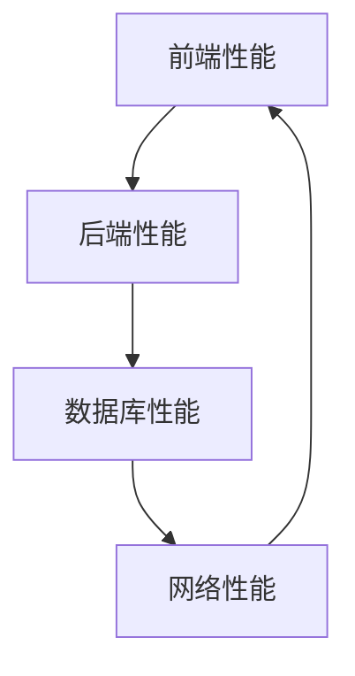

                 

关键词：性能优化，全栈优化，前端，后端，技术技巧

> 摘要：本文将探讨从前端到后端的全栈性能优化技巧，介绍一系列适用于不同层次的技术方法，帮助开发者提高应用程序的性能和用户体验。

## 1. 背景介绍

在现代软件开发中，性能优化已经成为开发过程中的一个重要环节。无论是前端还是后端，性能问题都可能影响用户体验，甚至导致业务失败。随着互联网和移动设备的普及，用户对应用程序的响应速度和稳定性要求越来越高。因此，性能优化不仅是技术问题，也是业务问题。

全栈性能优化涉及到前端、后端、数据库、网络等多个方面。本文将围绕这些方面，提供一系列实用的优化技巧，帮助开发者提高应用程序的性能。

## 2. 核心概念与联系

### 2.1 性能优化的核心概念

性能优化的核心概念包括：

- **响应时间**：从用户请求到收到响应的时间。
- **吞吐量**：单位时间内系统能够处理的请求数量。
- **延迟**：从请求发出到响应返回的时间。

### 2.2 性能优化的关键环节

性能优化的关键环节包括：

- **前端**：页面加载速度、资源优化、交互优化。
- **后端**：代码优化、数据库查询优化、缓存策略。
- **数据库**：索引优化、查询优化、数据结构优化。
- **网络**：网络延迟、带宽限制、网络拓扑优化。

### 2.3 核心概念原理和架构的 Mermaid 流程图



## 3. 核心算法原理 & 具体操作步骤

### 3.1 算法原理概述

性能优化的核心算法通常包括：

- **动态调度算法**：根据系统负载动态调整资源分配。
- **负载均衡算法**：将请求分配到多个服务器以均衡负载。
- **缓存算法**：根据数据访问频率和缓存策略优化数据存储。

### 3.2 算法步骤详解

#### 3.2.1 动态调度算法

1. 收集系统负载数据。
2. 根据负载数据调整资源分配。
3. 监控系统性能，反馈调整结果。

#### 3.2.2 负载均衡算法

1. 识别可用服务器。
2. 根据负载情况选择目标服务器。
3. 将请求分配到目标服务器。

#### 3.2.3 缓存算法

1. 根据访问频率排序数据。
2. 选择热门数据放入缓存。
3. 定期刷新缓存内容。

### 3.3 算法优缺点

- **动态调度算法**：优点是能够灵活调整资源分配，缺点是实时性要求高，需要大量监控数据。
- **负载均衡算法**：优点是能够提高系统吞吐量，缺点是可能会增加网络延迟。
- **缓存算法**：优点是能够提高响应速度，缺点是缓存命中率和缓存策略设计至关重要。

### 3.4 算法应用领域

- **动态调度算法**：适用于云计算和分布式系统。
- **负载均衡算法**：适用于Web服务器和高并发应用程序。
- **缓存算法**：适用于任何需要快速访问数据的应用程序。

## 4. 数学模型和公式 & 详细讲解 & 举例说明

### 4.1 数学模型构建

性能优化的数学模型通常涉及以下方面：

- **响应时间模型**：$R = T + C$
  - $R$：响应时间
  - $T$：处理时间
  - $C$：通信时间

- **吞吐量模型**：$Q = \frac{1}{R}$
  - $Q$：吞吐量
  - $R$：响应时间

- **延迟模型**：$D = T + C + L$
  - $D$：延迟
  - $T$：处理时间
  - $C$：通信时间
  - $L$：排队时间

### 4.2 公式推导过程

以响应时间模型为例，推导过程如下：

1. 响应时间包括处理时间和通信时间。
2. 处理时间 $T$ 是固定的，与系统负载有关。
3. 通信时间 $C$ 包括数据传输时间和网络延迟。

### 4.3 案例分析与讲解

假设一个电子商务网站，处理时间为2秒，通信时间为1秒，网络延迟为0.5秒，分析其响应时间：

- $R = T + C = 2 + 1 = 3$ 秒
- $Q = \frac{1}{R} = \frac{1}{3} = 0.33$ 次/秒

通过优化网络延迟和通信时间，可以降低响应时间和提高吞吐量。

## 5. 项目实践：代码实例和详细解释说明

### 5.1 开发环境搭建

- 编写代码的IDE：Visual Studio Code
- 开发语言：JavaScript (前端) 和 Python (后端)
- 数据库：MySQL

### 5.2 源代码详细实现

以下是一个简单的示例，展示前端和后端的性能优化代码实现：

**前端：**

```javascript
// JavaScript 代码示例
function fetchData() {
  fetch('https://api.example.com/data')
    .then(response => response.json())
    .then(data => {
      console.log('Fetched data:', data);
    })
    .catch(error => {
      console.error('Error fetching data:', error);
    });
}

// 使用缓存策略优化
if ('caches' in window) {
  caches.open('my-cache').then(cache => {
    cache.add('https://api.example.com/data').then(() => {
      console.log('Data fetched and cached');
    });
  });
}

// 使用异步加载优化
document.addEventListener('DOMContentLoaded', () => {
  fetchData();
});
```

**后端：**

```python
# Python 代码示例
from flask import Flask, jsonify
from flask_caching import Cache

app = Flask(__name__)
cache = Cache(app, config={'CACHE_TYPE': 'simple'})

@app.route('/data')
@cache.cached(timeout=60)
def get_data():
    # 模拟从数据库获取数据
    data = {'message': 'Hello, World!'}
    return jsonify(data)

if __name__ == '__main__':
    app.run()
```

### 5.3 代码解读与分析

- **前端代码**：使用 `fetch` API 异步获取数据，并实现缓存策略。通过监听 `DOMContentLoaded` 事件，实现异步加载。
- **后端代码**：使用 `Flask` 框架实现 RESTful API，并使用 `flask_caching` 实现缓存策略。

### 5.4 运行结果展示

在浏览器中访问 `https://example.com/data`，前端将异步获取数据并显示在控制台中。后端将返回缓存中的数据，提高响应速度。

## 6. 实际应用场景

### 6.1 高并发网站

在高并发场景下，性能优化至关重要。例如，电商平台在秒杀活动期间，需要处理大量用户请求，性能优化可以确保用户体验。

### 6.2 实时数据处理

在实时数据处理场景中，性能优化可以确保数据处理的速度和准确性。例如，金融交易系统需要实时处理大量交易数据。

### 6.3 移动应用

移动应用通常资源受限，性能优化可以提高用户体验。例如，地图应用需要在短时间内加载大量地图数据。

## 7. 未来应用展望

### 7.1 AI 技术的应用

随着 AI 技术的发展，性能优化将进一步结合机器学习算法，实现智能调度和智能缓存。

### 7.2 边缘计算的发展

边缘计算可以减少数据传输延迟，提高性能。未来，性能优化将更多地关注边缘计算场景。

### 7.3 分布式系统的普及

分布式系统可以提供更高的性能和可靠性。未来，性能优化将更多地针对分布式系统进行。

## 8. 总结：未来发展趋势与挑战

### 8.1 研究成果总结

本文总结了从前端到后端的全栈性能优化技巧，包括算法原理、数学模型、项目实践等方面。

### 8.2 未来发展趋势

未来，性能优化将结合 AI 技术、边缘计算和分布式系统，提供更加智能和高效的优化方案。

### 8.3 面临的挑战

性能优化面临的主要挑战包括：

- 数据量的爆炸性增长。
- 多变的网络环境。
- 复杂的分布式系统。

### 8.4 研究展望

未来，性能优化研究将重点关注智能化、分布式和实时性，以应对不断变化的互联网环境。

## 9. 附录：常见问题与解答

### 9.1 性能优化与用户体验的关系？

性能优化直接影响用户体验。良好的性能可以提高用户体验，减少用户等待时间，提高用户满意度。

### 9.2 如何选择合适的缓存策略？

选择合适的缓存策略取决于应用场景和数据访问模式。常见的缓存策略包括内存缓存、磁盘缓存和分布式缓存。

### 9.3 如何监控性能？

使用性能监控工具，如 New Relic、Datadog 等，可以实时监控系统的性能指标，包括响应时间、吞吐量、延迟等。

# 作者署名

作者：禅与计算机程序设计艺术 / Zen and the Art of Computer Programming
----------------------------------------------------------------

以上就是本文的完整内容。希望对您的学习和工作有所帮助。如果您有任何疑问或建议，欢迎在评论区留言。感谢您的阅读！


