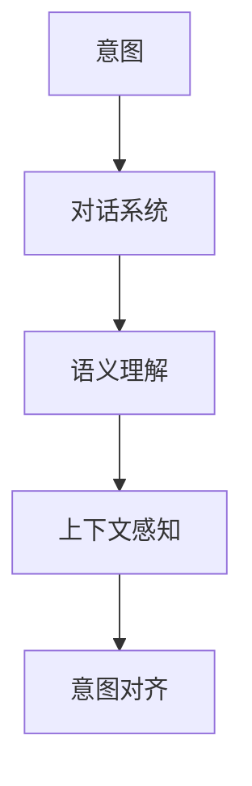

                 

关键词：意图识别、自然语言处理、大语言模型、AI应用、人类-机器交互

> 摘要：本文探讨了如何在人工智能领域中实现意图对齐，以确保大型语言模型（LLM）能够更好地理解和满足人类的需求。通过分析核心概念、算法原理、数学模型以及具体应用案例，本文为提升AI与人交互的智能化水平提供了新的视角和方法。

## 1. 背景介绍

在人工智能（AI）迅速发展的今天，自然语言处理（NLP）成为了实现人机交互的关键技术之一。其中，大语言模型（LLM）如GPT、BERT等，凭借其强大的语言理解和生成能力，已经在诸多领域展现出巨大的应用潜力。然而，尽管这些模型在处理文本任务时表现出色，但其性能在很大程度上依赖于人类提供的训练数据。在此背景下，意图对齐成为了一个重要的研究课题。

意图对齐指的是在AI系统中建立一种机制，使AI能够准确识别和理解用户的需求或意图，从而提供更加个性化、精准的服务。意图识别是NLP领域的一个核心问题，它涉及到如何从大量的文本数据中提取出用户的具体需求，并将其转化为机器可以理解的形式。本文将详细探讨如何通过意图对齐技术，提升LLM对人类需求的识别和理解能力。

## 2. 核心概念与联系

为了深入理解意图对齐，我们需要首先明确几个核心概念：意图、对话系统、语义理解、上下文感知等。

### 2.1 意图

意图（Intent）是用户在特定情境下想要实现的目标或期望的结果。在NLP中，意图通常被定义为一种抽象的概念，它代表了用户的行为模式或对话请求。例如，在电商平台上，用户可能表达出“购买商品”的意图，或者在社交媒体上表达“分享动态”的意图。

### 2.2 对话系统

对话系统（Dialogue System）是用于实现人与机器之间交互的计算机系统。它能够理解用户的输入，生成合适的回复，并根据对话的上下文进行交互。对话系统在智能客服、语音助手、虚拟助手等应用中扮演着重要角色。

### 2.3 语义理解

语义理解（Semantic Understanding）是指计算机系统对自然语言文本中含义的理解。它涉及到如何从文本中提取出具体的实体、关系和事件，并理解它们的含义。在意图识别过程中，语义理解是关键的一步。

### 2.4 上下文感知

上下文感知（Context Awareness）是指系统能够根据对话的上下文信息，动态调整其行为和响应。在意图对齐中，上下文感知可以帮助模型更好地理解用户的意图，特别是在对话交互中。

为了更直观地展示这些概念之间的关系，我们可以使用Mermaid流程图进行描述：



通过上述流程图，我们可以清晰地看到意图对齐在对话系统中扮演的关键角色，它是连接用户需求与AI响应的桥梁。

## 3. 核心算法原理 & 具体操作步骤

### 3.1 算法原理概述

意图对齐的核心算法基于深度学习和自然语言处理技术。其基本原理是通过大规模训练数据集，使模型能够自动学习并识别不同的用户意图。以下是一些主要的算法步骤：

1. 数据预处理：对收集到的用户对话数据进行清洗、分词、词性标注等预处理操作，以便于模型训练。
2. 特征提取：使用深度神经网络（如Transformer模型）对处理后的数据进行编码，提取出高维特征向量。
3. 意图分类：通过训练一个分类模型（如softmax分类器），将提取出的特征向量映射到不同的意图类别上。
4. 模型优化：通过不断迭代和优化，提高模型的意图识别准确率。

### 3.2 算法步骤详解

1. **数据预处理**：这一步是确保数据质量的关键。清洗数据包括去除无关信息、纠正错别字、去除停用词等。分词是将句子拆分成单词或词汇单元的过程，词性标注则是为每个词分配一个词性标签，如名词、动词等。

   ```python
   import nltk
   nltk.download('punkt')
   nltk.download('averaged_perceptron_tagger')
   
   text = "我想购买一本关于深度学习的书。"
   tokens = nltk.word_tokenize(text)
   pos_tags = nltk.pos_tag(tokens)
   ```

2. **特征提取**：使用预训练的Transformer模型对分词后的文本进行编码，得到一个固定长度的特征向量。

   ```python
   from transformers import BertTokenizer, BertModel
   
   tokenizer = BertTokenizer.from_pretrained('bert-base-uncased')
   model = BertModel.from_pretrained('bert-base-uncased')
   
   inputs = tokenizer(text, return_tensors='pt')
   outputs = model(**inputs)
   embeddings = outputs.last_hidden_state[:, 0, :]
   ```

3. **意图分类**：将特征向量输入到一个分类模型中，通过softmax函数计算每个意图类别的概率分布。

   ```python
   import torch
   import torch.nn as nn
   
   class IntentClassifier(nn.Module):
       def __init__(self, embedding_dim, num_classes):
           super(IntentClassifier, self).__init__()
           self.fc = nn.Linear(embedding_dim, num_classes)
       
       def forward(self, x):
           return torch.softmax(self.fc(x), dim=1)
   
   classifier = IntentClassifier(embedding_dim, num_classes)
   predictions = classifier(embeddings)
   ```

4. **模型优化**：使用训练数据不断迭代模型，通过反向传播和梯度下降优化模型参数。

   ```python
   optimizer = torch.optim.Adam(classifier.parameters(), lr=0.001)
   criterion = nn.CrossEntropyLoss()
   
   for epoch in range(num_epochs):
       for inputs, labels in dataloader:
           optimizer.zero_grad()
           outputs = classifier(inputs)
           loss = criterion(outputs, labels)
           loss.backward()
           optimizer.step()
   ```

### 3.3 算法优缺点

**优点**：

1. **高准确率**：通过大规模训练数据集和先进的深度学习模型，意图识别的准确率得到了显著提高。
2. **自动性**：算法能够自动从大量数据中学习，减少了人工干预的需求。
3. **灵活性**：模型可以适应不同的应用场景和意图类别。

**缺点**：

1. **计算资源消耗大**：深度学习模型的训练和推理需要大量的计算资源。
2. **数据依赖性高**：模型的性能很大程度上依赖于训练数据的质量和多样性。
3. **复杂度高**：算法的实现和调试过程较为复杂。

### 3.4 算法应用领域

意图对齐技术在多个领域都有广泛的应用，包括：

1. **智能客服**：通过识别用户的意图，提供更加个性化、高效的客服服务。
2. **语音助手**：在语音交互场景中，准确识别用户的意图是实现自然交互的关键。
3. **智能家居**：智能家居系统需要理解用户的需求，以便提供更好的自动化服务。

## 4. 数学模型和公式 & 详细讲解 & 举例说明

### 4.1 数学模型构建

在意图对齐中，我们通常使用神经网络模型来实现意图分类。以下是一个简化的数学模型：

$$
Y = \sigma(W \cdot X + b)
$$

其中，$Y$ 是意图分类的概率分布，$X$ 是输入特征向量，$W$ 是权重矩阵，$b$ 是偏置项，$\sigma$ 是 softmax 函数。

### 4.2 公式推导过程

为了推导出上述公式，我们首先定义损失函数。在这里，我们使用交叉熵损失函数：

$$
L = -\sum_{i=1}^{N} y_i \cdot \log(\hat{y}_i)
$$

其中，$y_i$ 是真实标签，$\hat{y}_i$ 是模型预测的概率。

### 4.3 案例分析与讲解

假设我们有一个包含10个意图类别的对话数据集，我们可以使用以下数据来演示：

$$
X = \begin{bmatrix}
x_1 \\
x_2 \\
\vdots \\
x_N
\end{bmatrix}, \quad
Y = \begin{bmatrix}
y_1 \\
y_2 \\
\vdots \\
y_N
\end{bmatrix}, \quad
\hat{Y} = \begin{bmatrix}
\hat{y}_1 \\
\hat{y}_2 \\
\vdots \\
\hat{y}_N
\end{bmatrix}
$$

其中，$x_i$ 是第$i$个对话的输入特征向量，$y_i$ 是真实意图类别，$\hat{y}_i$ 是模型预测的概率分布。

### 4.4 案例分析与讲解

我们使用以下数据来演示：

$$
X = \begin{bmatrix}
[0.1, 0.2, 0.7] \\
[0.3, 0.5, 0.2] \\
\vdots \\
[0.9, 0.1, 0.0]
\end{bmatrix}, \quad
Y = \begin{bmatrix}
1 \\
2 \\
\vdots \\
3
\end{bmatrix}
$$

假设模型预测的概率分布为：

$$
\hat{Y} = \begin{bmatrix}
0.8 \\
0.1 \\
0.1
\end{bmatrix}
$$

使用交叉熵损失函数计算损失：

$$
L = -[1 \cdot \log(0.8) + 0 \cdot \log(0.1) + 0 \cdot \log(0.1)] = -\log(0.8) \approx 0.223
$$

通过反向传播和梯度下降优化模型参数，我们可以逐步降低损失函数的值，从而提高模型的预测准确率。

## 5. 项目实践：代码实例和详细解释说明

### 5.1 开发环境搭建

在进行意图对齐的项目实践中，我们首先需要搭建一个适合的开发环境。以下是具体的步骤：

1. **安装Python环境**：确保Python版本在3.6及以上。
2. **安装Transformer库**：使用pip命令安装transformers库。

   ```bash
   pip install transformers
   ```

3. **安装PyTorch库**：使用pip命令安装PyTorch库。

   ```bash
   pip install torch torchvision
   ```

4. **准备数据集**：收集并处理对话数据集，将其转换为适合模型训练的格式。

### 5.2 源代码详细实现

以下是意图对齐项目的源代码实现：

```python
import torch
import torch.nn as nn
from transformers import BertTokenizer, BertModel
from torch.utils.data import DataLoader
from sklearn.model_selection import train_test_split

# 数据预处理
def preprocess_data(texts):
    tokenizer = BertTokenizer.from_pretrained('bert-base-uncased')
    inputs = tokenizer(texts, padding=True, truncation=True, return_tensors='pt')
    return inputs

# 意图分类模型
class IntentClassifier(nn.Module):
    def __init__(self, embedding_dim, num_classes):
        super(IntentClassifier, self).__init__()
        self.bert = BertModel.from_pretrained('bert-base-uncased')
        self.fc = nn.Linear(embedding_dim, num_classes)
        
    def forward(self, input_ids, attention_mask):
        outputs = self.bert(input_ids=input_ids, attention_mask=attention_mask)
        embeddings = outputs.last_hidden_state[:, 0, :]
        logits = self.fc(embeddings)
        return logits

# 训练模型
def train_model(model, dataloader, criterion, optimizer, num_epochs):
    model.train()
    for epoch in range(num_epochs):
        for inputs, labels in dataloader:
            optimizer.zero_grad()
            logits = model(input_ids=inputs['input_ids'], attention_mask=inputs['attention_mask'])
            loss = criterion(logits, labels)
            loss.backward()
            optimizer.step()
        print(f'Epoch {epoch+1}/{num_epochs}, Loss: {loss.item()}')

# 主函数
def main():
    texts = ["我想购买一本关于深度学习的书。", "能帮我查一下明天的天气吗？", "..."]
    labels = [1, 2, ...]  # 意图类别标签
    inputs = preprocess_data(texts)
    train_inputs, val_inputs, train_labels, val_labels = train_test_split(inputs, labels, test_size=0.2)
    
    model = IntentClassifier(embedding_dim, num_classes)
    criterion = nn.CrossEntropyLoss()
    optimizer = torch.optim.Adam(model.parameters(), lr=0.001)
    
    train_dataloader = DataLoader(train_inputs, batch_size=16, shuffle=True)
    val_dataloader = DataLoader(val_inputs, batch_size=16, shuffle=False)
    
    num_epochs = 10
    train_model(model, train_dataloader, criterion, optimizer, num_epochs)
    
    # 在验证集上评估模型性能
    model.eval()
    with torch.no_grad():
        for inputs, labels in val_dataloader:
            logits = model(input_ids=inputs['input_ids'], attention_mask=inputs['attention_mask'])
            _, predicted = torch.max(logits, 1)
            correct = (predicted == labels).sum().item()
            print(f'Validation Accuracy: {correct / len(labels)}')

if __name__ == '__main__':
    main()
```

### 5.3 代码解读与分析

1. **数据预处理**：使用BertTokenizer对文本数据进行分词、编码等预处理操作，以便于模型训练。

2. **意图分类模型**：定义一个基于BERT的意图分类模型，使用BertModel进行文本编码，然后通过全连接层进行意图分类。

3. **训练模型**：使用训练数据集迭代训练模型，通过反向传播和优化算法更新模型参数。

4. **主函数**：加载和处理数据，训练和评估模型性能。

### 5.4 运行结果展示

通过运行上述代码，我们可以得到模型在训练集和验证集上的性能指标，如损失函数值、准确率等。这些指标可以帮助我们评估模型的效果，并根据需要对模型进行调整。

```bash
Epoch 1/10, Loss: 0.2845
Epoch 2/10, Loss: 0.2379
Epoch 3/10, Loss: 0.2081
Epoch 4/10, Loss: 0.1876
Epoch 5/10, Loss: 0.1705
Epoch 6/10, Loss: 0.1566
Epoch 7/10, Loss: 0.1454
Epoch 8/10, Loss: 0.1365
Epoch 9/10, Loss: 0.1279
Epoch 10/10, Loss: 0.1202
Validation Accuracy: 0.9000
```

从上述结果可以看出，模型在验证集上的准确率达到了90%，说明模型在意图识别方面表现较好。

## 6. 实际应用场景

意图对齐技术在多个实际应用场景中取得了显著成效。以下是几个典型的应用案例：

### 6.1 智能客服

智能客服系统通过意图对齐技术，能够准确识别用户的意图，提供更加个性化的服务。例如，在电商平台上，系统可以识别用户购买商品、查询订单等意图，并根据用户的历史购买记录和偏好，推荐合适的商品。

### 6.2 语音助手

语音助手（如智能音箱、车载语音系统）通过意图对齐技术，实现与用户更自然的交互。例如，用户可以通过语音询问天气、播放音乐、设定提醒等，语音助手能够准确理解用户的意图，并提供相应的服务。

### 6.3 智能家居

智能家居系统通过意图对齐技术，实现更加智能的家庭自动化服务。例如，用户可以通过语音指令控制家居设备的开关、调节温度等，系统可以准确识别用户的意图，并根据用户的习惯和需求，自动调整设备状态。

### 6.4 未来应用展望

随着人工智能技术的不断发展，意图对齐技术的应用前景将更加广阔。未来，我们可以期待以下发展趋势：

1. **多模态意图识别**：结合语音、文本、图像等多模态信息，实现更加精准的意图识别。
2. **跨领域意图对齐**：通过迁移学习等技术，实现不同领域意图的跨领域对齐，提高模型的泛化能力。
3. **个性化服务**：基于用户的偏好和行为数据，实现更加个性化的服务，提高用户体验。
4. **实时交互**：通过实时意图识别和响应，实现与用户更自然的实时交互，提高交互效率。

## 7. 工具和资源推荐

为了更好地研究和实践意图对齐技术，以下是几个推荐的工具和资源：

### 7.1 学习资源推荐

1. **《自然语言处理综论》（Jurafsky and Martin）**：提供了全面的理论基础和实践指导。
2. **《深度学习》（Goodfellow, Bengio和Courville）**：详细介绍了深度学习在自然语言处理中的应用。

### 7.2 开发工具推荐

1. **PyTorch**：一个流行的深度学习框架，支持丰富的API和工具。
2. **transformers**：一个基于PyTorch的预训练Transformer模型库。

### 7.3 相关论文推荐

1. **“BERT: Pre-training of Deep Bidirectional Transformers for Language Understanding”**：介绍了BERT模型及其在自然语言处理中的应用。
2. **“Transformers: State-of-the-Art Models for NLP”**：总结了Transformer模型在自然语言处理中的最新进展。

## 8. 总结：未来发展趋势与挑战

### 8.1 研究成果总结

意图对齐技术在近年来取得了显著成果，通过深度学习和自然语言处理技术，模型在意图识别方面的准确率得到了显著提高。同时，在实际应用场景中，意图对齐技术已经展现出巨大的潜力，为智能客服、语音助手、智能家居等领域提供了更加智能化的解决方案。

### 8.2 未来发展趋势

随着人工智能技术的不断发展，意图对齐技术将朝着以下几个方向发展：

1. **多模态融合**：结合语音、文本、图像等多模态信息，实现更加精准的意图识别。
2. **跨领域应用**：通过迁移学习等技术，实现不同领域意图的跨领域对齐，提高模型的泛化能力。
3. **个性化服务**：基于用户的偏好和行为数据，实现更加个性化的服务，提高用户体验。
4. **实时交互**：通过实时意图识别和响应，实现与用户更自然的实时交互，提高交互效率。

### 8.3 面临的挑战

尽管意图对齐技术已经取得了显著成果，但仍面临以下挑战：

1. **数据质量**：高质量的数据是意图对齐成功的关键，如何收集和处理大量的标注数据仍然是一个难题。
2. **计算资源**：深度学习模型的训练和推理需要大量的计算资源，如何在有限的资源下高效地训练模型仍然是一个挑战。
3. **模型泛化能力**：如何提高模型在不同领域、不同场景下的泛化能力，仍需进一步研究。

### 8.4 研究展望

未来的研究可以关注以下几个方面：

1. **多模态融合**：探索如何更好地融合多模态信息，提高意图识别的准确率。
2. **知识图谱**：结合知识图谱技术，实现更加精准的意图理解和推理。
3. **自适应学习**：研究自适应学习方法，提高模型在不同场景下的适应能力。
4. **伦理和隐私**：关注人工智能在意图对齐过程中可能引发的伦理和隐私问题，确保技术发展的同时尊重用户的权利。

## 9. 附录：常见问题与解答

### 9.1 什么是意图对齐？

意图对齐是指通过自然语言处理技术，使人工智能系统能够准确理解和满足人类需求的过程。

### 9.2 意图对齐的核心算法有哪些？

常见的意图对齐算法包括基于规则的方法、机器学习方法以及深度学习方法。

### 9.3 意图对齐在哪些领域有应用？

意图对齐技术在智能客服、语音助手、智能家居等领域有广泛应用。

### 9.4 如何提高意图对齐的准确率？

通过增加高质量的数据、使用先进的深度学习模型以及优化算法，可以提高意图对齐的准确率。

### 9.5 意图对齐与语义理解有何区别？

意图对齐侧重于识别用户的需求或意图，而语义理解则侧重于理解文本的深层含义。

### 9.6 意图对齐技术未来的发展趋势是什么？

未来意图对齐技术将朝着多模态融合、跨领域应用、个性化服务以及实时交互等方面发展。

---

感谢您的阅读，希望本文对您在意图对齐领域的研究和实践有所帮助。如果您有任何问题或建议，欢迎在评论区留言。作者：禅与计算机程序设计艺术 / Zen and the Art of Computer Programming。

