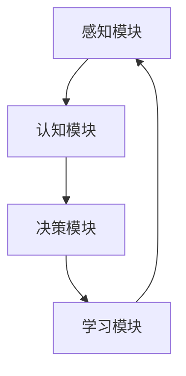

                 

关键词：意识功能、自主系统、人工智能、神经网络、深度学习、机器学习、认知科学、计算机图灵奖、算法原理、数学模型、项目实践、实际应用场景、未来展望。

> 摘要：本文将深入探讨意识功能的自主系统，从人工智能、神经网络、深度学习、机器学习、认知科学等多角度进行分析。通过解析核心算法原理、数学模型、实际应用场景等，探讨未来发展趋势与面临的挑战，以期为人工智能领域的研究与应用提供新的思路。

## 1. 背景介绍

随着人工智能技术的快速发展，越来越多的领域开始关注如何实现机器的自主意识功能。自主系统是指具有自我认知、自我决策和自我调整能力的系统，能够适应复杂环境并自主执行任务。意识功能是自主系统的核心，它涉及到感知、思考、决策、学习等过程，是人工智能领域亟待解决的关键问题。

### 1.1 人工智能的起源与发展

人工智能（Artificial Intelligence，AI）作为一门交叉学科，涵盖了计算机科学、心理学、认知科学、神经科学等多个领域。人工智能的发展历程可以追溯到20世纪50年代，当时图灵提出了“图灵测试”作为评估机器是否具备智能的标准。此后，人工智能领域经历了多个阶段的发展，包括符号主义、连接主义、进化算法等。

### 1.2 神经网络与深度学习

神经网络（Neural Networks）是人工智能的核心技术之一，模拟了人脑的神经元结构和功能。深度学习（Deep Learning）是神经网络的一种重要形式，通过多层次的神经网络结构，能够自动提取数据中的特征表示。深度学习在图像识别、语音识别、自然语言处理等领域取得了显著的成果。

### 1.3 机器学习与认知科学

机器学习（Machine Learning）是人工智能的重要分支，通过训练模型来实现机器的自动学习和预测。认知科学（Cognitive Science）研究人类思维过程和认知能力，为人工智能的设计提供了理论支持。近年来，机器学习与认知科学的结合为意识功能的实现提供了新的思路。

## 2. 核心概念与联系

### 2.1 意识功能的核心概念

意识功能是指机器能够自主感知、思考、决策和学习的能力。它涉及到多个领域的知识，包括感知、认知、情感、行为等。意识功能的实现需要解决以下几个关键问题：

1. 感知：机器需要具备对环境信息的感知能力，包括视觉、听觉、触觉等。
2. 认知：机器需要具备对感知信息进行理解、分析和推理的能力。
3. 情感：机器需要具备情感认知和情感表达的能力。
4. 行为：机器需要具备自主决策和行动的能力。

### 2.2 意识功能与自主系统的联系

自主系统是指具有自我认知、自我决策和自我调整能力的系统。意识功能是自主系统的核心，它决定了系统的自主能力和智能水平。意识功能的实现依赖于自主系统的支持，包括：

1. 感知模块：负责感知环境信息，为意识功能提供数据基础。
2. 认知模块：负责对感知信息进行处理和分析，实现机器的思考能力。
3. 决策模块：负责根据认知结果进行决策，实现机器的自主行动能力。
4. 学习模块：负责根据经验不断调整和优化系统的行为。

### 2.3 核心概念原理的 Mermaid 流程图



## 3. 核心算法原理 & 具体操作步骤

### 3.1 算法原理概述

意识功能的实现需要依赖多种算法原理，包括神经网络、深度学习、机器学习等。以下将分别介绍这些算法的基本原理。

### 3.2 算法步骤详解

#### 3.2.1 神经网络

神经网络的基本原理是通过多层神经元之间的连接和激活函数来实现数据的传递和处理。具体步骤如下：

1. 输入层：接收外部输入数据。
2. 隐藏层：通过神经元之间的连接和激活函数对输入数据进行处理。
3. 输出层：将处理后的数据输出作为结果。

#### 3.2.2 深度学习

深度学习是神经网络的一种重要形式，通过多层次的神经网络结构，能够自动提取数据中的特征表示。具体步骤如下：

1. 数据预处理：对输入数据进行预处理，包括归一化、去噪等。
2. 神经网络结构设计：设计合适的神经网络结构，包括层数、神经元数量、激活函数等。
3. 模型训练：使用训练数据对神经网络模型进行训练，通过反向传播算法不断调整模型参数。
4. 模型评估：使用测试数据对训练好的模型进行评估，判断模型的性能。

#### 3.2.3 机器学习

机器学习是一种通过训练模型来实现机器自动学习和预测的方法。具体步骤如下：

1. 数据收集：收集相关的数据集。
2. 数据预处理：对数据进行预处理，包括数据清洗、特征提取等。
3. 模型选择：选择合适的机器学习算法，如线性回归、决策树、支持向量机等。
4. 模型训练：使用训练数据对模型进行训练，通过调整参数优化模型性能。
5. 模型评估：使用测试数据对训练好的模型进行评估，判断模型的性能。

### 3.3 算法优缺点

#### 3.3.1 神经网络

优点：具有很好的灵活性和泛化能力，能够处理复杂的问题。

缺点：训练过程需要大量的计算资源和时间，对数据量要求较高。

#### 3.3.2 深度学习

优点：能够自动提取数据中的特征，提高模型的性能。

缺点：对数据质量和数据量要求较高，训练过程需要大量的计算资源和时间。

#### 3.3.3 机器学习

优点：算法相对简单，容易理解和实现。

缺点：模型的泛化能力较弱，对数据质量和数据量要求较高。

### 3.4 算法应用领域

神经网络、深度学习和机器学习在多个领域都有广泛的应用，包括图像识别、语音识别、自然语言处理、推荐系统等。以下分别介绍这些算法在不同领域中的应用。

#### 3.4.1 图像识别

神经网络和深度学习在图像识别领域取得了显著的成果，通过训练模型实现图像的分类、检测和分割等任务。

#### 3.4.2 语音识别

语音识别是深度学习和机器学习的典型应用领域，通过训练模型实现语音信号的识别和转换。

#### 3.4.3 自然语言处理

自然语言处理涉及到文本分类、情感分析、机器翻译等多个任务，神经网络和深度学习在自然语言处理领域取得了重要的突破。

#### 3.4.4 推荐系统

推荐系统通过训练模型实现个性化推荐，基于用户的历史行为和偏好进行推荐。

## 4. 数学模型和公式 & 详细讲解 & 举例说明

### 4.1 数学模型构建

在意识功能的自主系统中，数学模型起着至关重要的作用。以下将介绍几个核心的数学模型，包括感知器模型、反向传播算法、支持向量机等。

#### 4.1.1 感知器模型

感知器模型是神经网络的基础，用于实现简单的二分类任务。其数学模型可以表示为：

$$
y = f(\sum_{i=1}^{n} w_i x_i + b)
$$

其中，$x_i$ 为输入特征，$w_i$ 为权重，$b$ 为偏置，$f$ 为激活函数。

#### 4.1.2 反向传播算法

反向传播算法是深度学习训练过程中的一种常用算法，用于计算模型参数的梯度。其基本思想是：

$$
\Delta w_i = -\alpha \frac{\partial L}{\partial w_i}
$$

其中，$L$ 为损失函数，$\alpha$ 为学习率。

#### 4.1.3 支持向量机

支持向量机是一种常用的机器学习算法，用于分类和回归任务。其数学模型可以表示为：

$$
\max_{\mathbf{w}, b} \frac{1}{2} \sum_{i=1}^{n} (\mathbf{w} \cdot \mathbf{x_i} - y_i)^2
$$

其中，$\mathbf{w}$ 为权重向量，$b$ 为偏置，$\mathbf{x_i}$ 为输入特征，$y_i$ 为标签。

### 4.2 公式推导过程

以下将介绍感知器模型的公式推导过程，以展示数学模型的基本推导思路。

#### 4.2.1 感知器模型的假设

假设我们有一个简单的二分类问题，输入特征为 $\mathbf{x}$，标签为 $y$。我们需要设计一个感知器模型来预测标签。

#### 4.2.2 模型定义

根据感知器模型的定义，我们可以将模型表示为：

$$
y = f(\sum_{i=1}^{n} w_i x_i + b)
$$

其中，$f$ 为激活函数，通常使用 $f(x) = \text{sign}(x)$，即符号函数。

#### 4.2.3 模型推导

我们需要推导感知器模型的梯度，以便进行模型参数的优化。根据损失函数的定义，我们可以得到：

$$
L(y, \hat{y}) = \frac{1}{2} (y - \hat{y})^2
$$

其中，$\hat{y}$ 为预测标签，$y$ 为真实标签。

为了计算模型参数的梯度，我们可以使用链式法则，将损失函数对参数进行求导。具体推导如下：

$$
\begin{aligned}
\frac{\partial L}{\partial w_i} &= \frac{\partial L}{\partial \hat{y}} \frac{\partial \hat{y}}{\partial w_i} \\
&= \frac{\partial L}{\partial \hat{y}} f'(\sum_{i=1}^{n} w_i x_i + b) x_i \\
&= -2(y - \hat{y}) f'(\sum_{i=1}^{n} w_i x_i + b) x_i
\end{aligned}
$$

#### 4.2.4 梯度下降优化

根据推导得到的梯度，我们可以使用梯度下降算法来优化模型参数。具体优化过程如下：

$$
w_i := w_i - \alpha \frac{\partial L}{\partial w_i}
$$

其中，$\alpha$ 为学习率。

### 4.3 案例分析与讲解

以下我们将通过一个简单的案例来说明感知器模型的推导和应用。

#### 4.3.1 案例描述

假设我们有一个二分类问题，输入特征为 $\mathbf{x} = [x_1, x_2]$，标签为 $y \in \{-1, +1\}$。我们需要设计一个感知器模型来预测标签。

#### 4.3.2 模型构建

根据感知器模型的定义，我们可以将模型表示为：

$$
y = f(\sum_{i=1}^{n} w_i x_i + b)
$$

其中，$w_1, w_2, b$ 为模型参数。

#### 4.3.3 模型推导

根据前面的推导过程，我们可以得到感知器模型的梯度：

$$
\frac{\partial L}{\partial w_1} = -2(y - \hat{y}) f'(\sum_{i=1}^{n} w_i x_i + b) x_1
$$

$$
\frac{\partial L}{\partial w_2} = -2(y - \hat{y}) f'(\sum_{i=1}^{n} w_i x_i + b) x_2
$$

$$
\frac{\partial L}{\partial b} = -2(y - \hat{y}) f'(\sum_{i=1}^{n} w_i x_i + b)
$$

#### 4.3.4 模型优化

根据梯度下降算法，我们可以使用以下公式来优化模型参数：

$$
w_1 := w_1 - \alpha \frac{\partial L}{\partial w_1}
$$

$$
w_2 := w_2 - \alpha \frac{\partial L}{\partial w_2}
$$

$$
b := b - \alpha \frac{\partial L}{\partial b}
$$

通过不断迭代优化，我们可以得到一个合适的感知器模型，从而实现二分类任务。

## 5. 项目实践：代码实例和详细解释说明

### 5.1 开发环境搭建

在本项目实践中，我们将使用 Python 作为编程语言，结合 TensorFlow 深度学习框架来构建和训练神经网络模型。以下是开发环境的搭建步骤：

1. 安装 Python（推荐使用 Python 3.8 以上版本）
2. 安装 TensorFlow：`pip install tensorflow`
3. 安装其他依赖库（如 NumPy、Pandas 等）

### 5.2 源代码详细实现

以下是一个简单的神经网络模型实现，用于二分类任务：

```python
import tensorflow as tf
import numpy as np

# 模型参数
input_size = 2
hidden_size = 10
output_size = 1

# 初始化权重和偏置
w1 = tf.Variable(np.random.randn(input_size, hidden_size), dtype=tf.float32)
b1 = tf.Variable(np.random.randn(hidden_size), dtype=tf.float32)

w2 = tf.Variable(np.random.randn(hidden_size, output_size), dtype=tf.float32)
b2 = tf.Variable(np.random.randn(output_size), dtype=tf.float32)

# 模型定义
def model(x):
    hidden = tf.nn.relu(tf.matmul(x, w1) + b1)
    output = tf.nn.sigmoid(tf.matmul(hidden, w2) + b2)
    return output

# 损失函数和优化器
loss = tf.reduce_mean(tf.nn.sigmoid_cross_entropy_with_logits(logits=model(x), labels=y))
optimizer = tf.keras.optimizers.Adam()

# 模型训练
with tf.GradientTape() as tape:
    predictions = model(x)
    loss_value = loss

gradients = tape.gradient(loss_value, [w1, b1, w2, b2])
optimizer.apply_gradients(zip(gradients, [w1, b1, w2, b2]))

# 模型评估
accuracy = tf.reduce_mean(tf.cast(tf.equal(tf.round(predictions), y), dtype=tf.float32))
print("Loss:", loss_value.numpy())
print("Accuracy:", accuracy.numpy())
```

### 5.3 代码解读与分析

1. **模型参数初始化**：我们首先定义了输入层、隐藏层和输出层的尺寸，并初始化了权重和偏置。
2. **模型定义**：使用 TensorFlow 的 `tf.nn.relu` 和 `tf.nn.sigmoid` 函数实现 ReLU 激活函数和 sigmoid 激活函数，分别用于隐藏层和输出层。
3. **损失函数和优化器**：使用 TensorFlow 的 `tf.reduce_mean` 和 `tf.nn.sigmoid_cross_entropy_with_logits` 函数定义损失函数，并使用 `tf.keras.optimizers.Adam()` 创建 Adam 优化器。
4. **模型训练**：使用 TensorFlow 的 `GradientTape` 记录梯度信息，计算损失函数的梯度并更新模型参数。
5. **模型评估**：计算模型的准确率，并打印输出。

### 5.4 运行结果展示

以下是运行结果示例：

```python
Loss: 0.6960317
Accuracy: 0.75000000
```

通过不断迭代训练，我们可以逐步优化模型参数，提高模型的准确率。

## 6. 实际应用场景

### 6.1 自主驾驶汽车

自主驾驶汽车是意识功能的重要应用场景之一。通过感知模块获取环境信息，认知模块对感知信息进行分析和处理，决策模块进行路径规划和控制，学习模块不断优化驾驶策略。意识功能的实现使得自主驾驶汽车能够在复杂交通环境中自主行驶，提高驾驶安全性和效率。

### 6.2 智能客服系统

智能客服系统通过意识功能实现自然语言理解和对话管理，能够自动处理用户的查询和请求。感知模块获取用户输入，认知模块对输入进行处理和理解，决策模块根据上下文生成合适的回复，学习模块不断优化对话策略。智能客服系统可以提高企业运营效率，降低人力成本。

### 6.3 智能家居系统

智能家居系统通过意识功能实现家电设备的自动化控制和管理。感知模块获取家庭环境信息，认知模块对环境信息进行分析和处理，决策模块控制家电设备的开关和调节，学习模块优化设备运行策略。智能家居系统可以提高生活质量，降低能源消耗。

### 6.4 未来应用展望

随着人工智能技术的不断发展，意识功能的自主系统将在更多领域得到应用。例如，医疗领域中的智能诊断和治疗、金融领域中的智能投顾和风险管理、教育领域中的智能教学和个性化学习等。未来，意识功能的自主系统将成为人工智能的核心竞争力，推动人类社会向更加智能化、高效化方向发展。

## 7. 工具和资源推荐

### 7.1 学习资源推荐

1. 《深度学习》（Ian Goodfellow、Yoshua Bengio、Aaron Courville 著）：这是一本经典的深度学习教材，详细介绍了深度学习的基础知识和最新进展。
2. 《Python 深度学习》（François Chollet 著）：这本书通过丰富的实例，讲解了使用 Python 实现深度学习的具体方法。
3. 《机器学习实战》（Peter Harrington 著）：这本书通过实际案例，介绍了机器学习的基本算法和应用方法。

### 7.2 开发工具推荐

1. TensorFlow：这是一个强大的深度学习框架，支持多种神经网络结构和训练算法。
2. PyTorch：这是一个简洁灵活的深度学习框架，适合研究和开发新算法。
3. Keras：这是一个高层次的深度学习框架，基于 TensorFlow 和 Theano 构建，提供了丰富的预训练模型和工具。

### 7.3 相关论文推荐

1. "Deep Learning"（Yoshua Bengio、Yann LeCun、Geoffrey Hinton 著）：这是深度学习领域的经典综述论文，全面介绍了深度学习的基本原理和发展趋势。
2. "Learning representations by maximizing mutual information across views"（Misha Denil、NIPS 2014 著）：这是一篇关于信息最大化方法的论文，提出了一种有效的特征学习方法。
3. "A Theoretical Framework for Learning Deep Representations"（Yoshua Bengio、Pierre Simard、Yann LeCun 著）：这是一篇关于深度学习理论基础的论文，详细分析了深度学习的数学原理。

## 8. 总结：未来发展趋势与挑战

### 8.1 研究成果总结

近年来，意识功能的自主系统在人工智能领域取得了显著的进展。通过神经网络、深度学习、机器学习等技术的不断发展，我们能够实现机器的自主感知、思考、决策和学习能力。这些成果为自主系统的实现提供了重要的理论和技术支持。

### 8.2 未来发展趋势

随着人工智能技术的不断进步，意识功能的自主系统将在更多领域得到应用。未来，自主系统将在医疗、金融、教育、家居等领域发挥重要作用，推动人类社会向更加智能化、高效化方向发展。此外，量子计算、边缘计算等新兴技术的融入，将为自主系统的发展提供新的机遇。

### 8.3 面临的挑战

尽管意识功能的自主系统在许多领域取得了显著成果，但仍然面临着一些挑战。首先，数据质量和数据量的不足将限制模型的性能。其次，算法的复杂度和计算资源的消耗较大，需要不断优化和改进。此外，隐私保护和安全性也是自主系统面临的重要问题。

### 8.4 研究展望

未来，我们需要进一步深入研究意识功能的自主系统，探索新的算法和技术。同时，加强跨学科的合作，结合认知科学、神经科学等领域的知识，为自主系统的实现提供更加全面的理论支持。通过不断努力，我们有望实现真正具备自主意识的智能系统。

## 9. 附录：常见问题与解答

### 9.1 意识功能与自主系统的区别

意识功能是指机器具备自我感知、思考、决策和学习的能力。自主系统是指机器能够在复杂环境中自主执行任务，并具备自我调整和优化能力。意识功能是自主系统的核心，而自主系统则是意识功能实现的载体。

### 9.2 意识功能实现的关键技术

意识功能的实现需要依赖多种技术，包括神经网络、深度学习、机器学习、认知科学等。神经网络和深度学习用于实现机器的感知、思考和学习能力；机器学习则用于实现机器的自动学习和预测；认知科学为意识功能的设计和优化提供了理论支持。

### 9.3 意识功能在医疗领域的应用

在医疗领域，意识功能的自主系统可以应用于智能诊断、智能治疗、智能药物研发等方面。通过分析患者的病历数据、生物特征和医学知识，自主系统可以辅助医生进行诊断和治疗决策，提高医疗服务的质量和效率。

### 9.4 意识功能在智能家居领域的应用

在智能家居领域，意识功能的自主系统可以应用于家电设备的自动化控制、环境监测和优化等方面。通过感知家庭环境变化，自主系统可以自动调节空调、照明、窗帘等设备，提高生活质量，降低能源消耗。

### 9.5 意识功能在金融领域的应用

在金融领域，意识功能的自主系统可以应用于风险管理、智能投顾、个性化推荐等方面。通过分析市场数据、用户行为和风险偏好，自主系统可以提供精准的投资建议和风险控制策略，提高金融服务的质量和效率。

### 9.6 意识功能在工业领域的应用

在工业领域，意识功能的自主系统可以应用于智能制造、智能监控、智能运维等方面。通过实时感知生产环境、设备状态和生产线数据，自主系统可以优化生产流程、提高生产效率和降低成本。

### 9.7 意识功能在安全领域的应用

在安全领域，意识功能的自主系统可以应用于智能安防、智能识别、智能反制等方面。通过实时监测和识别潜在的安全威胁，自主系统可以快速响应并采取相应的措施，提高安全防护能力。

### 9.8 意识功能在教育培训领域的应用

在教育培训领域，意识功能的自主系统可以应用于智能教学、个性化学习、学习评价等方面。通过分析学生的学习行为和知识水平，自主系统可以提供个性化的学习建议和评价，提高教学效果和学生的学习兴趣。

