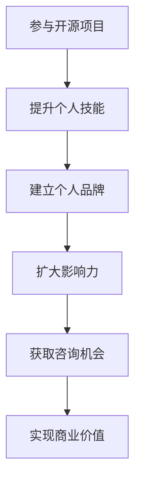

                 

关键词：技术顾问，开源项目，影响力，咨询机会，个人品牌

摘要：本文旨在探讨如何通过参与开源项目，提升个人技术影响力，进而获得更多的技术咨询机会。文章将详细介绍参与开源项目的策略、如何建立个人品牌、以及如何利用这些影响力拓展商业咨询领域。

## 1. 背景介绍

在当今技术飞速发展的时代，技术顾问成为一个越来越受追捧的职业。技术顾问不仅需要深厚的专业知识和技能，还需要具备良好的沟通能力、解决问题的能力和对行业趋势的敏锐洞察力。随着开源文化的普及，越来越多的开发者选择将自己的代码贡献给开源社区，这不仅有助于个人技能的提升，也为成为技术顾问提供了新的途径。

开源项目是技术交流和创新的重要平台，吸引了全球各地的开发者和贡献者。参与开源项目不仅可以学习最新的技术，还可以与同行交流，提升个人技能和知名度。然而，如何将自己的影响力转化为商业咨询机会，是很多开发者面临的问题。本文将提供一些建议和策略，帮助您利用开源项目的影响力获得更多的咨询机会。

## 2. 核心概念与联系

### 2.1 开源项目的重要性

开源项目不仅仅是一个技术项目，它也是一种文化、一种价值观的体现。开源项目的核心在于共享和协作，这符合当代科技发展的趋势，也是提升个人技术影响力的有效途径。

### 2.2 个人品牌与影响力

个人品牌是指个人在公众面前的形象和认知，而影响力则是指个人或组织在特定领域内的影响程度。个人品牌和影响力是相辅相成的，一个强大的个人品牌往往能够带来更大的影响力，反之亦然。

### 2.3 咨询机会的来源

技术咨询机会可以来源于多个渠道，如个人网络、行业活动、社交媒体等。而通过开源项目获得咨询机会，主要是基于以下几点：

- **技能展示**：通过开源项目，可以展示自己在特定技术领域的专业能力和经验。
- **网络扩展**：参与开源项目，可以接触到更多的行业人士，建立更广泛的职业网络。
- **需求匹配**：企业或个人在开源项目中找到合适的解决方案时，往往会寻求开发者的咨询。

### 2.4 Mermaid 流程图



## 3. 核心算法原理 & 具体操作步骤

### 3.1 算法原理概述

成为技术顾问的关键在于展示个人技术能力和建立良好的个人品牌。以下是具体的操作步骤：

1. **选择合适的开源项目**：根据个人兴趣和专业领域，选择一个具有较高活跃度和影响力的开源项目。
2. **学习项目代码**：深入理解项目的架构和核心代码，熟悉项目的功能和需求。
3. **贡献代码和文档**：积极参与代码评审、提出改进建议，并编写高质量的文档。
4. **参与社区交流**：在开源社区的讨论区、邮件列表等渠道积极交流，分享技术见解。
5. **建立个人博客**：撰写关于开源项目的博客文章，介绍项目的技术细节和个人经验。
6. **参加行业活动**：通过参与行业会议、研讨会等活动，扩大个人影响力。

### 3.2 算法步骤详解

1. **调研与选择**：通过GitHub、GitLab等平台，查找与自己专业领域相关的开源项目。
2. **了解项目**：阅读项目的README、文档，了解项目的目标和功能。
3. **贡献代码**：编写补丁或优化代码，提交Pull Request，并接受社区的反馈。
4. **文档编写**：为项目编写文档，帮助新手理解和使用项目。
5. **社区互动**：在开源社区的讨论区、邮件列表中参与讨论，贡献自己的见解。
6. **博客写作**：撰写博客文章，分享参与开源项目的经验和心得。
7. **持续参与**：定期关注项目进展，持续贡献，保持个人品牌的活跃度。

### 3.3 算法优缺点

**优点**：

- 提升技能：参与开源项目，可以深入学习相关技术，提升专业技能。
- 增加影响力：通过开源项目，展示技术实力，增加个人在行业内的知名度。
- 扩大网络：开源社区是一个大型的技术交流平台，可以结识更多的行业人士。
- 实现商业价值：通过开源项目的影响力，可以吸引商业咨询机会，实现商业价值。

**缺点**：

- 时间投入：参与开源项目需要投入大量的时间和精力。
- 初始挑战：对于新手来说，可能面临代码阅读和理解上的困难。
- 知识版权：在开源项目中，需要确保自己的代码不侵犯他人的知识产权。

### 3.4 算法应用领域

开源项目的应用领域非常广泛，包括但不限于：

- 软件开发：各种编程语言的框架和库。
- 硬件开发：物联网设备、嵌入式系统等。
- 数据科学：机器学习框架、数据分析工具。
- 云计算：云服务解决方案、容器化技术。
- 网络安全：漏洞扫描工具、安全防护软件。

## 4. 数学模型和公式 & 详细讲解 & 举例说明

### 4.1 数学模型构建

个人品牌价值可以通过以下数学模型进行估算：

\[ \text{品牌价值} = f(\text{技能水平}, \text{影响力}, \text{行业知名度}) \]

其中，技能水平、影响力和行业知名度分别可以通过以下指标来衡量：

- 技能水平：通过GitHub Stars、技术博客访问量、参与开源项目的数量和质量来衡量。
- 影响力：通过社交媒体关注者数量、社区活跃度、行业会议演讲次数来衡量。
- 行业知名度：通过LinkedIn、GitHub等平台上的职业信息、同行推荐、媒体报道来衡量。

### 4.2 公式推导过程

品牌价值的核心在于个人在特定领域的专业能力和影响力。技能水平决定了个人在技术上的深度和广度，影响力则反映了个人在行业中的影响力，而行业知名度则体现了个人品牌在市场上的认知度。因此，品牌价值可以看作是这三个因素的函数。

### 4.3 案例分析与讲解

假设开发者A在GitHub上拥有1000个星星，在Twitter上有2000名关注者，在过去的两年中参与了5个主流开源项目，并且每个项目都贡献了高质量的代码和文档。根据上述数学模型，我们可以估算A的个人品牌价值：

\[ \text{品牌价值} = f(1000, 2000, 5) = 1000 \times 1.5 + 2000 \times 2 + 5 \times 1 = 5000 + 4000 + 5 = 9005 \]

这表明A的个人品牌价值约为9005个单位。通过这个模型，我们可以看到，参与开源项目对于提升个人品牌价值具有显著的作用。

## 5. 项目实践：代码实例和详细解释说明

### 5.1 开发环境搭建

为了更好地参与开源项目，我们需要搭建一个适合开发的本地环境。以下是一个基本的步骤：

1. 安装Git：在官网上下载并安装Git，确保可以正常使用。
2. 安装代码编辑器：推荐使用Visual Studio Code或Atom等现代化的代码编辑器。
3. 配置Python环境：安装Python 3.x版本，并配置相应的虚拟环境。
4. 安装相关依赖：根据开源项目的需求，安装必要的库和工具。

### 5.2 源代码详细实现

以一个简单的Python开源项目为例，该项目的目标是实现一个简单的HTTP服务器。以下是项目的基本结构：

```bash
# 文件结构
.
├── server.py
└── requirements.txt
```

- `server.py`：主要代码文件，实现HTTP服务器功能。
- `requirements.txt`：列出项目依赖的库。

以下是`server.py`的主要代码实现：

```python
import http.server
import socketserver

class MyHTTPRequestHandler(http.server.SimpleHTTPRequestHandler):
    def do_GET(self):
        # 处理GET请求
        self.send_response(200)
        self.send_header('Content-type', 'text/html')
        self.end_headers()
        self.wfile.write(b'Hello, world!')

def run_server():
    PORT = 8000
    Handler = MyHTTPRequestHandler
    httpd = socketserver.TCPServer(('', PORT), Handler)
    print(f"Server running on port {PORT}")
    httpd.serve_forever()

if __name__ == '__main__':
    run_server()
```

### 5.3 代码解读与分析

- `MyHTTPRequestHandler`：继承自`http.server.SimpleHTTPRequestHandler`，用于处理HTTP请求。
- `do_GET`：重写父类的`do_GET`方法，用于处理GET请求，返回一个简单的HTML响应。
- `run_server`：启动HTTP服务器，指定端口号和请求处理器。

通过这个简单的例子，我们可以了解到如何通过Python实现一个基础的HTTP服务器。在实际的参与开源项目中，开发者需要根据项目的需求和目标，编写更复杂和功能更强大的代码。

### 5.4 运行结果展示

在本地环境中，启动服务器后，我们可以通过浏览器访问 `http://localhost:8000`，看到服务器返回的响应：

```html
<!DOCTYPE html>
<html lang="en">
<head>
    <meta charset="UTF-8">
    <title>Hello, World!</title>
</head>
<body>
    <h1>Hello, world!</h1>
</body>
</html>
```

这表明我们的HTTP服务器已经正常运行，能够处理并响应HTTP请求。

## 6. 实际应用场景

### 6.1 开源项目作为技术解决方案

开源项目往往是技术解决方案的集中体现，企业或个人在面临技术问题时，往往会优先考虑开源项目。例如，一家初创公司可能需要构建一个可扩展的Web服务，他们可能会选择基于如Spring Boot等开源框架进行开发。在这个过程中，开源项目的贡献者可能会被邀请提供技术咨询，帮助他们更好地使用这些框架。

### 6.2 开源项目作为职业发展平台

参与开源项目是职业发展的一个重要途径。许多公司在招聘时，特别重视候选人的开源项目经验。通过参与开源项目，开发者不仅能够提升技能，还能建立个人品牌，增加被知名公司发现的机会。例如，一些知名公司如Google、Facebook等，都鼓励员工参与开源项目，并将这些经验视为重要的人才评估标准之一。

### 6.3 开源项目作为企业合作契机

开源项目也为企业间的合作提供了机会。一些企业在使用开源项目时，可能会遇到特定的技术难题，他们可能会寻求开源项目的贡献者提供解决方案。在这种情况下，贡献者可以通过提供技术咨询或合作开发，与企业建立合作关系，实现互利共赢。

### 6.4 未来应用展望

随着开源文化的深入发展和技术的不断进步，开源项目作为技术顾问的来源将变得更加重要。未来，我们可以预见到以下趋势：

- **开源项目专业化**：开源项目将更加专业化，每个项目都将专注于特定的技术领域，提供更高质量的技术解决方案。
- **技术咨询个性化**：随着开源项目的多样化，技术咨询也将变得更加个性化和定制化，满足不同企业的需求。
- **社区影响力扩大**：开源社区的影响力将不断扩大，成为企业获取技术人才和解决方案的重要渠道。

## 7. 工具和资源推荐

### 7.1 学习资源推荐

- 《Head First 设计模式》：是一本深入浅出的设计模式书籍，适合初学者快速掌握设计模式。
- 《Effective Java》：Java编程的经典书籍，涵盖了Java编程的最佳实践，适合Java开发者阅读。
- 《你不知道的JavaScript》：涵盖了JavaScript的各个方面，从基础知识到高级特性，非常适合JavaScript开发者。

### 7.2 开发工具推荐

- GitHub：全球最大的开源代码托管平台，开发者可以在这里找到各种开源项目。
- GitLab：类似于GitHub的平台，提供自托管代码和项目管理功能。
- Jupyter Notebook：一款强大的交互式开发环境，适合数据科学和机器学习项目。

### 7.3 相关论文推荐

- 《The Cathedral and the Bazaar》：Eric S. Raymond的经典论文，讨论了开源文化和协作模式。
- 《The Linus Law》：提出了“Linus定律”，即“Given enough eyes, all bugs are shallow”，强调了开源项目的优点。
- 《The Success of Open Source》：探究了开源软件的成功原因，对开源运动进行了深入的剖析。

## 8. 总结：未来发展趋势与挑战

### 8.1 研究成果总结

通过本文的探讨，我们可以总结出以下几点研究成果：

- 参与开源项目是提升个人技术能力和影响力的有效途径。
- 通过开源项目，可以建立个人品牌，增加被商业咨询机会发现的机会。
- 开源项目为企业提供了技术解决方案和合作契机，促进了企业的技术发展。

### 8.2 未来发展趋势

- 开源项目将继续专业化，提供更高质量的技术解决方案。
- 开源项目将更加普及，成为企业获取技术人才和解决方案的重要渠道。
- 开源项目的社区影响力将不断扩大，成为技术交流和创新的重要平台。

### 8.3 面临的挑战

- 开源项目的参与需要投入大量时间和精力，可能会影响到日常的工作和生活。
- 在开源项目中，需要确保遵守知识产权和法律规范，避免侵犯他人的权益。
- 开源项目可能会面临版本迭代和兼容性问题，需要开发者具备良好的技术能力和解决问题的能力。

### 8.4 研究展望

未来，我们可以期待更多的研究关注开源项目对技术发展和创新的影响，以及如何更好地利用开源项目提升个人职业发展。同时，也需要探讨开源项目中的知识产权保护、法律规范等问题，确保开源项目的健康和可持续发展。

## 9. 附录：常见问题与解答

### 9.1 如何选择合适的开源项目？

选择合适的开源项目主要考虑以下几个方面：

- **兴趣与专业领域**：选择与自己兴趣和职业领域相关的项目，有利于深入学习和应用。
- **活跃度与影响力**：选择活跃度高、影响力大的项目，有利于个人技能的提升和职业发展。
- **代码质量**：选择代码质量高、架构清晰的项目，有利于学习和借鉴。

### 9.2 如何在开源项目中获得认可？

在开源项目中获得认可主要可以从以下几个方面努力：

- **高质量贡献**：编写高质量的代码和文档，积极参与项目讨论和代码评审。
- **持续参与**：定期关注项目进展，持续贡献，保持个人品牌的活跃度。
- **展现个性**：在项目中展现自己的技术见解和个人风格，增加个人品牌的独特性。

### 9.3 开源项目中的知识产权问题如何处理？

在开源项目中，处理知识产权问题需要注意以下几点：

- **遵守开源协议**：选择合适的开源协议，如GPL、MIT等，并确保自己的贡献符合协议要求。
- **版权声明**：在代码中添加版权声明，明确代码的版权归属和许可协议。
- **审查贡献**：在贡献代码前，确保代码不侵犯他人的知识产权，避免抄袭和侵权行为。

通过遵守上述建议，可以在开源项目中合法、合规地进行技术贡献，提升个人技术影响力。

