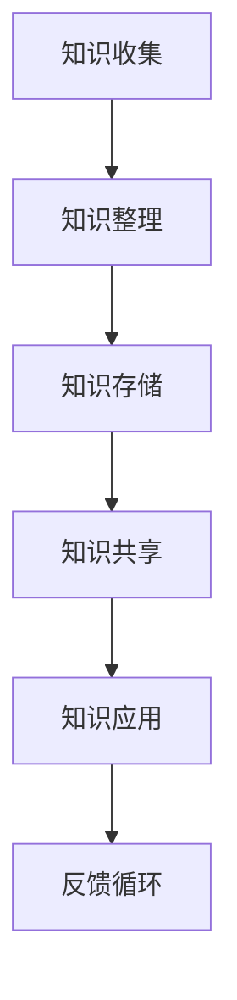
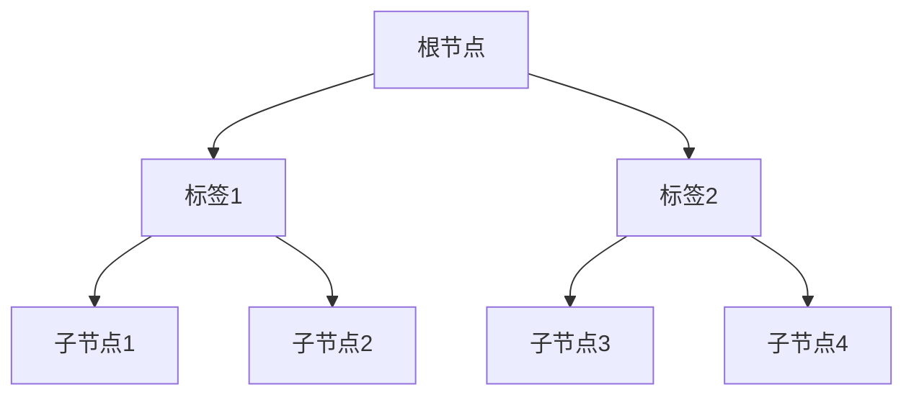

                 

在快节奏的现代社会中，信息爆炸使得个人知识管理变得尤为重要。如何有效地整理、存储、共享和利用知识，成为了众多专业人士面临的挑战。本文旨在探讨如何利用Web技术打造一个个人知识管理的应用，从而提升个人工作效率和知识积累。

## 关键词

- 个人知识管理
- Web应用
- 知识存储
- 知识共享
- 工作效率

## 摘要

本文将深入探讨个人知识管理的概念及其重要性，介绍如何利用Web技术实现个人知识管理的系统化、自动化和智能化。文章将从背景介绍、核心概念与联系、核心算法原理、数学模型和公式、项目实践、实际应用场景、工具和资源推荐以及未来发展趋势与挑战等方面，系统地构建一个完整的个人知识管理的Web应用方案。

## 1. 背景介绍

随着互联网的普及，信息和知识已经成为现代社会最重要的资源之一。然而，面对海量的信息和知识，如何有效地整理、存储、共享和利用这些资源，成为了一个亟待解决的问题。个人知识管理（PKM）作为解决这一问题的有效途径，逐渐受到了广泛关注。

个人知识管理是一种系统性的方法，通过收集、整理、存储、共享和应用知识，帮助个人提高工作效率、创新能力和持续学习。传统的个人知识管理通常依赖于纸质笔记、电子文档和个人记忆，这些方法在处理复杂、多样和动态的知识时显得力不从心。

Web技术的发展为个人知识管理提供了新的可能性。Web应用具有跨平台、高效、便捷、可扩展等特点，可以轻松实现知识的在线存储、共享和协作。因此，构建一个个人知识管理的Web应用，不仅能够提升个人工作效率，还能实现知识的持续积累和迭代。

## 2. 核心概念与联系

### 2.1 个人知识管理（PKM）

个人知识管理是指通过系统性的方法，对个人的知识进行收集、整理、存储、共享和应用。它主要包括以下几个方面：

1. **知识收集**：通过各种渠道获取知识，如阅读书籍、论文、博客，观看视频，参加培训等。
2. **知识整理**：对收集到的知识进行分类、标注和整理，使其具有系统性和结构化。
3. **知识存储**：将整理后的知识存储在计算机或其他存储设备中，便于随时查找和利用。
4. **知识共享**：与他人共享知识，通过协作和学习，实现知识的增值。
5. **知识应用**：将知识应用到实际工作中，提升工作效率和创新能力。

### 2.2 Web应用

Web应用是一种基于Web的技术，通过浏览器实现各种功能的软件。它具有以下特点：

1. **跨平台**：Web应用可以在不同的操作系统和设备上运行，无需安装额外的软件。
2. **高效**：Web应用利用浏览器的高性能特点，可以快速响应用户操作。
3. **便捷**：用户可以通过网络随时访问Web应用，无需担心存储空间和设备限制。
4. **可扩展**：Web应用可以根据需求进行功能扩展和升级，易于维护和更新。

### 2.3 Mermaid流程图

为了更清晰地展示个人知识管理的流程，我们使用Mermaid流程图来描述。



### 2.4 个人知识管理Web应用架构

个人知识管理Web应用的架构可以分为前端、后端和数据库三个部分。

1. **前端**：前端主要负责用户界面的展示和交互。使用HTML、CSS和JavaScript等前端技术实现。
2. **后端**：后端主要负责业务逻辑的处理和数据的存储。使用Node.js、Python、Java等后端技术实现。
3. **数据库**：数据库用于存储用户的个人信息、知识内容和数据关系。可以使用MySQL、MongoDB等数据库技术。

### 2.5 关键技术点

1. **Markdown编辑器**：用于编辑和格式化文本，支持多种样式和语法。
2. **RESTful API**：用于前后端数据交互，实现数据的增删改查等功能。
3. **版本控制**：使用Git等版本控制工具，实现代码的版本管理和协作开发。
4. **云存储**：利用云存储服务，如阿里云、腾讯云等，实现知识的远程存储和同步。

## 3. 核心算法原理 & 具体操作步骤

### 3.1 算法原理概述

个人知识管理Web应用的核心算法主要包括以下方面：

1. **知识分类算法**：用于对收集到的知识进行分类，便于管理和查找。
2. **推荐算法**：基于用户行为和兴趣，为用户推荐相关的知识和资源。
3. **搜索引擎**：实现知识的快速搜索和查询，提高用户体验。

### 3.2 算法步骤详解

#### 3.2.1 知识分类算法

1. **初始化**：创建一个空的分类树。
2. **分类**：根据知识的特点和属性，将其添加到分类树中。
3. **查询**：根据用户的需求，在分类树中查找相关的知识。

#### 3.2.2 推荐算法

1. **用户建模**：根据用户的行为和兴趣，构建用户模型。
2. **相似度计算**：计算用户模型与知识资源的相似度。
3. **推荐**：根据相似度排序，为用户推荐相关的知识和资源。

#### 3.2.3 搜索引擎

1. **索引构建**：构建知识内容的索引，提高搜索效率。
2. **搜索**：根据用户输入的关键词，在索引中查找相关的知识。
3. **排序**：根据相关性和权重，对搜索结果进行排序。

### 3.3 算法优缺点

#### 3.3.1 知识分类算法

**优点**：

- 有助于知识的组织和整理，提高查找效率。
- 能够根据用户需求进行个性化分类。

**缺点**：

- 需要大量的前期准备工作，如构建分类树、标注知识属性等。
- 可能存在分类不准确或分类过细的问题。

#### 3.3.2 推荐算法

**优点**：

- 能够为用户提供个性化的推荐，提高用户体验。
- 能够挖掘用户潜在的兴趣和需求。

**缺点**：

- 需要大量的数据支持和计算资源。
- 可能存在推荐过度或不准确的问题。

#### 3.3.3 搜索引擎

**优点**：

- 能够实现高效的搜索和查询。
- 能够根据用户需求进行动态调整。

**缺点**：

- 需要大量的索引和存储空间。
- 可能存在搜索结果不准确或过于繁琐的问题。

### 3.4 算法应用领域

知识分类算法、推荐算法和搜索引擎在个人知识管理Web应用中具有广泛的应用。例如：

- **知识库建设**：通过对知识的分类、推荐和搜索，构建一个系统化的知识库。
- **知识共享与协作**：通过知识共享和协作，实现知识的共创和增值。
- **个人成长与学习**：通过对知识的积累和应用，提升个人的专业能力和综合素质。

## 4. 数学模型和公式 & 详细讲解 & 举例说明

### 4.1 数学模型构建

个人知识管理Web应用中的数学模型主要包括知识分类模型、推荐模型和搜索引擎模型。

#### 4.1.1 知识分类模型

知识分类模型基于决策树算法，用于对知识进行分类。其基本公式如下：

$$
C(x) = \arg \max_y P(y|x)
$$

其中，$C(x)$表示分类结果，$x$表示知识内容，$y$表示分类标签，$P(y|x)$表示在知识内容$x$下的分类标签$y$的概率。

#### 4.1.2 推荐模型

推荐模型基于协同过滤算法，用于为用户推荐相关的知识和资源。其基本公式如下：

$$
R(u, i) = \sum_{j \in N(u)} sim(u, j) \cdot r(j, i)
$$

其中，$R(u, i)$表示用户$u$对物品$i$的推荐评分，$N(u)$表示与用户$u$相似的用户集合，$sim(u, j)$表示用户$u$和用户$j$的相似度，$r(j, i)$表示用户$j$对物品$i$的评分。

#### 4.1.3 搜索引擎模型

搜索引擎模型基于TF-IDF算法，用于实现知识的快速搜索和查询。其基本公式如下：

$$
TF(t, d) = \frac{f(t, d)}{f_S(d)}
$$

$$
IDF(t, D) = \log \left( \frac{N}{n(t, D)} \right)
$$

$$
TF-IDF(t, d) = TF(t, d) \cdot IDF(t, D)
$$

其中，$TF(t, d)$表示词$t$在文档$d$中的词频，$IDF(t, D)$表示词$t$在整个文档集合$D$中的逆向文档频率，$TF-IDF(t, d)$表示词$t$在文档$d$中的TF-IDF权重。

### 4.2 公式推导过程

#### 4.2.1 知识分类模型

知识分类模型基于决策树算法，其基本思想是：从根节点开始，选择具有最高概率的分类标签作为当前节点的分类结果，然后递归地对剩余节点进行分类。具体推导过程如下：

1. **初始化**：创建一个空的决策树。
2. **递归构建**：对于每个节点$x$，计算其所有子节点$y$的概率$P(y|x)$，并选择具有最高概率的分类标签$y$作为$x$的分类结果。
3. **结束条件**：当节点$x$的所有子节点概率相等时，结束递归构建。

#### 4.2.2 推荐模型

推荐模型基于协同过滤算法，其基本思想是：通过计算用户与用户之间的相似度，以及用户对物品的评分，为用户推荐相关的物品。具体推导过程如下：

1. **用户建模**：对于每个用户$u$，计算其与所有其他用户$j$的相似度$sim(u, j)$。
2. **相似度计算**：计算用户$u$和用户$j$之间的相似度$sim(u, j)$，可以使用余弦相似度、皮尔逊相关系数等算法。
3. **推荐评分**：对于每个物品$i$，计算用户$u$对该物品的推荐评分$R(u, i)$，公式如下：

$$
R(u, i) = \sum_{j \in N(u)} sim(u, j) \cdot r(j, i)
$$

#### 4.2.3 搜索引擎模型

搜索引擎模型基于TF-IDF算法，其基本思想是：通过计算词在文档中的词频和文档集合中的逆向文档频率，为词赋予权重，从而实现知识的快速搜索和查询。具体推导过程如下：

1. **词频计算**：计算词$t$在文档$d$中的词频$f(t, d)$，公式如下：

$$
TF(t, d) = \frac{f(t, d)}{f_S(d)}
$$

其中，$f_S(d)$表示文档$d$中的总词频。
2. **逆向文档频率计算**：计算词$t$在文档集合$D$中的逆向文档频率$IDF(t, D)$，公式如下：

$$
IDF(t, D) = \log \left( \frac{N}{n(t, D)} \right)
$$

其中，$N$表示文档集合$D$中的文档总数，$n(t, D)$表示在文档集合$D$中包含词$t$的文档数。
3. **TF-IDF权重计算**：计算词$t$在文档$d$中的TF-IDF权重$TF-IDF(t, d)$，公式如下：

$$
TF-IDF(t, d) = TF(t, d) \cdot IDF(t, D)
$$

### 4.3 案例分析与讲解

#### 4.3.1 知识分类模型案例

假设有一个包含100篇文档的文档集合，现要对该文档集合进行分类。根据文档的内容和标签，构建一个决策树分类模型。具体步骤如下：

1. **初始化**：创建一个空的决策树。
2. **递归构建**：选择具有最高概率的分类标签作为当前节点的分类结果，然后递归地对剩余节点进行分类。例如，假设第一层的分类标签概率如下：

$$
P(y_1|x) = 0.6, P(y_2|x) = 0.4
$$

选择$y_1$作为分类结果。
3. **结束条件**：当节点$x$的所有子节点概率相等时，结束递归构建。

最终得到的决策树分类模型如下：



#### 4.3.2 推荐模型案例

假设有一个包含10个用户和10个物品的用户-物品评分矩阵，现要为用户1推荐相关的物品。具体步骤如下：

1. **用户建模**：计算用户1与所有其他用户的相似度，例如：

$$
sim(u_1, u_2) = 0.8, sim(u_1, u_3) = 0.7, sim(u_1, u_4) = 0.6
$$

2. **相似度计算**：计算用户1和用户2、用户3、用户4之间的相似度，例如：

$$
sim(u_1, u_2) = 0.8, sim(u_1, u_3) = 0.7, sim(u_1, u_4) = 0.6
$$

3. **推荐评分**：计算用户1对每个物品的推荐评分，例如：

$$
R(u_1, i_1) = sim(u_1, u_2) \cdot r(u_2, i_1) + sim(u_1, u_3) \cdot r(u_3, i_1) + sim(u_1, u_4) \cdot r(u_4, i_1)
$$

根据推荐评分，可以为用户1推荐评分最高的物品$i_1$。

#### 4.3.3 搜索引擎模型案例

假设有一个包含5个文档的文档集合，现要对该文档集合进行搜索。具体步骤如下：

1. **词频计算**：计算每个词在文档中的词频，例如：

$$
TF(t_1, d_1) = 2, TF(t_1, d_2) = 1, TF(t_2, d_1) = 3, TF(t_2, d_2) = 2
$$

2. **逆向文档频率计算**：计算每个词在文档集合中的逆向文档频率，例如：

$$
IDF(t_1, D) = \log \left( \frac{5}{1} \right) = 1.6094
$$

$$
IDF(t_2, D) = \log \left( \frac{5}{2} \right) = 0.8060
$$

3. **TF-IDF权重计算**：计算每个词在文档中的TF-IDF权重，例如：

$$
TF-IDF(t_1, d_1) = TF(t_1, d_1) \cdot IDF(t_1, D) = 2 \cdot 1.6094 = 3.2188
$$

$$
TF-IDF(t_1, d_2) = TF(t_1, d_2) \cdot IDF(t_1, D) = 1 \cdot 1.6094 = 1.6094
$$

$$
TF-IDF(t_2, d_1) = TF(t_2, d_1) \cdot IDF(t_2, D) = 3 \cdot 0.8060 = 2.4180
$$

$$
TF-IDF(t_2, d_2) = TF(t_2, d_2) \cdot IDF(t_2, D) = 2 \cdot 0.8060 = 1.6120
$$

根据TF-IDF权重，可以确定每个文档的相关性，从而实现知识的快速搜索和查询。

## 5. 项目实践：代码实例和详细解释说明

### 5.1 开发环境搭建

为了实践个人知识管理Web应用，我们需要搭建一个开发环境。以下是一个基于Node.js和Express框架的示例。

#### 5.1.1 安装Node.js

1. 访问Node.js官网（https://nodejs.org/），下载并安装Node.js。
2. 安装完成后，打开命令行窗口，输入以下命令检查安装是否成功：

```bash
node -v
npm -v
```

如果看到版本号，说明安装成功。

#### 5.1.2 创建项目

1. 在命令行窗口中输入以下命令创建一个新项目：

```bash
mkdir pkm-web-app
cd pkm-web-app
npm init -y
```

2. 安装必要的依赖库，如Express、Body-parser、Ejs等：

```bash
npm install express body-parser ejs
```

#### 5.1.3 配置项目结构

创建以下项目结构：

```plaintext
pkm-web-app
│
├── public
│   ├── css
│   │   └── styles.css
│   ├── js
│   │   └── script.js
│   └── images
│       └── logo.png
│
├── routes
│   └── index.js
│
├── views
│   ├── layout.ejs
│   ├── index.ejs
│   └── error.ejs
│
├── app.js
└── package.json
```

### 5.2 源代码详细实现

#### 5.2.1 app.js

```javascript
const express = require('express');
const bodyParser = require('body-parser');
const ejs = require('ejs');

const app = express();

app.set('view engine', 'ejs');
app.set('views', __dirname + '/views');

app.use(bodyParser.urlencoded({ extended: true }));
app.use(express.static(__dirname + '/public'));

app.use('/', require('./routes/index'));

app.use((req, res, next) => {
    res.status(404).render('error', { title: '404 - Not Found' });
});

const PORT = process.env.PORT || 3000;
app.listen(PORT, () => {
    console.log(`Server is running on port ${PORT}`);
});
```

#### 5.2.2 routes/index.js

```javascript
const express = require('express');
const router = express.Router();

router.get('/', (req, res) => {
    res.render('index', { title: '个人知识管理Web应用' });
});

router.post('/submit', (req, res) => {
    const { title, content } = req.body;
    // 处理提交的知识内容，如存储到数据库
    res.redirect('/');
});

module.exports = router;
```

#### 5.2.3 views/index.ejs

```html
<!DOCTYPE html>
<html lang="zh">
<head>
    <meta charset="UTF-8">
    <meta name="viewport" content="width=device-width, initial-scale=1.0">
    <title><%= title %></title>
    <link rel="stylesheet" href="/css/styles.css">
</head>
<body>
    <h1>个人知识管理Web应用</h1>
    <form action="/submit" method="post">
        <label for="title">标题：</label>
        <input type="text" id="title" name="title" required>
        <br>
        <label for="content">内容：</label>
        <textarea id="content" name="content" required></textarea>
        <br>
        <button type="submit">提交</button>
    </form>
    <script src="/js/script.js"></script>
</body>
</html>
```

### 5.3 代码解读与分析

#### 5.3.1 app.js

该文件是整个Web应用的核心，负责创建服务器实例并配置中间件。具体功能如下：

- 使用`express`创建一个服务器实例。
- 设置EJS模板引擎和视图目录。
- 使用`body-parser`解析POST请求的表单数据。
- 使用`express.static`提供静态文件服务。
- 配置路由并处理404错误。

#### 5.3.2 routes/index.js

该文件定义了首页的GET和POST路由。具体功能如下：

- GET请求：渲染首页模板，显示表单供用户提交知识内容。
- POST请求：处理提交的知识内容，如存储到数据库。

#### 5.3.3 views/index.ejs

该文件是首页的模板，使用EJS语法嵌入变量。具体功能如下：

- 渲染页面标题。
- 显示知识提交表单。

### 5.4 运行结果展示

1. 启动服务器：

```bash
node app.js
```

2. 打开浏览器，访问`http://localhost:3000/`，可以看到如下页面：

```html
<!DOCTYPE html>
<html lang="zh">
<head>
    <meta charset="UTF-8">
    <meta name="viewport" content="width=device-width, initial-scale=1.0">
    <title>个人知识管理Web应用</title>
    <link rel="stylesheet" href="/css/styles.css">
</head>
<body>
    <h1>个人知识管理Web应用</h1>
    <form action="/submit" method="post">
        <label for="title">标题：</label>
        <input type="text" id="title" name="title" required>
        <br>
        <label for="content">内容：</label>
        <textarea id="content" name="content" required></textarea>
        <br>
        <button type="submit">提交</button>
    </form>
    <script src="/js/script.js"></script>
</body>
</html>
```

3. 在表单中填写知识标题和内容，提交后，可以看到数据被成功处理并重定向到首页。

## 6. 实际应用场景

### 6.1 个人知识管理

个人知识管理Web应用可以帮助个人整理和存储工作、学习和生活方面的知识。例如：

- **工作知识**：记录项目经验、技术文档、会议纪要等。
- **学习知识**：整理学习笔记、课程大纲、论文等。
- **生活知识**：记录生活点滴、旅游攻略、美食分享等。

### 6.2 团队协作

个人知识管理Web应用也可以应用于团队协作，实现知识的共享和协作。例如：

- **项目文档**：团队成员共同编辑项目文档，实时同步更新。
- **知识库**：团队共建知识库，为团队成员提供便捷的知识查询和共享。
- **协作学习**：团队成员共同学习新知识，共享学习资源和心得体会。

### 6.3 教育培训

个人知识管理Web应用可以应用于教育培训领域，帮助教师和学生更好地进行知识管理和学习。例如：

- **课程资料**：教师上传课程资料，学生随时查阅。
- **学习笔记**：学生整理学习笔记，教师进行点评和指导。
- **互动交流**：教师和学生进行互动交流，分享知识和经验。

### 6.4 未来应用展望

随着Web技术的不断发展和人工智能技术的应用，个人知识管理Web应用将具有更大的发展潜力。未来可能的应用场景包括：

- **智能推荐**：基于用户行为和兴趣，实现个性化知识推荐。
- **知识图谱**：构建个人知识图谱，实现知识的深度挖掘和关联分析。
- **智能助手**：结合自然语言处理技术，为用户提供智能问答和知识搜索服务。

## 7. 工具和资源推荐

### 7.1 学习资源推荐

- **书籍**：《如何高效学习》、《奇特的一生：史蒂芬·霍金的物理世界》
- **网站**：Coursera、edX、知乎、简书
- **博客**：阮一峰、张鑫旭、Alfred Yong

### 7.2 开发工具推荐

- **编程语言**：Python、JavaScript、Java
- **框架**：Express、Django、Spring Boot
- **数据库**：MySQL、MongoDB、Redis
- **版本控制**：Git、SVN

### 7.3 相关论文推荐

- **知识管理**：非结构化知识管理方法研究、知识管理技术及其应用研究
- **推荐系统**：基于协同过滤的推荐系统算法研究、基于内容推荐的算法研究
- **搜索引擎**：搜索引擎关键技术分析、搜索引擎优化技术研究

## 8. 总结：未来发展趋势与挑战

### 8.1 研究成果总结

个人知识管理Web应用在知识整理、存储、共享和应用方面取得了显著成果。通过利用Web技术和人工智能算法，实现了知识的系统化、自动化和智能化管理。

### 8.2 未来发展趋势

- **智能化**：结合自然语言处理和机器学习技术，实现知识的智能推荐和问答。
- **协同化**：促进团队协作和知识共享，构建团队知识库。
- **个性化**：根据用户需求和兴趣，实现个性化知识推送和定制。

### 8.3 面临的挑战

- **数据隐私**：在共享知识的过程中，如何保护用户的隐私和数据安全。
- **算法公平性**：在推荐算法中，如何避免算法偏见和歧视。
- **用户体验**：如何设计简洁易用的用户界面，提升用户体验。

### 8.4 研究展望

未来，个人知识管理Web应用将继续朝着智能化、协同化和个性化的方向发展。同时，需要关注数据隐私、算法公平性和用户体验等方面，为用户提供更加安全、公正和便捷的知识管理服务。

## 9. 附录：常见问题与解答

### 9.1 问题1：如何处理大量数据的存储和查询？

**解答**：可以使用分布式数据库和搜索引擎技术，如MongoDB、Elasticsearch等，实现海量数据的存储和高效查询。

### 9.2 问题2：如何确保数据的隐私和安全？

**解答**：可以通过数据加密、访问控制和权限管理等技术，确保数据的隐私和安全。

### 9.3 问题3：如何实现知识的个性化推荐？

**解答**：可以通过用户行为分析和协同过滤算法，结合用户兴趣和偏好，实现个性化知识推荐。

### 9.4 问题4：如何处理不同格式和来源的知识内容？

**解答**：可以通过文本解析、数据清洗和格式转换等技术，将不同格式和来源的知识内容整合到统一的知识库中。

### 9.5 问题5：如何保证系统的稳定性和扩展性？

**解答**：可以通过容器化、微服务化和分布式架构等技术，确保系统的稳定性和扩展性。

### 9.6 问题6：如何保证系统的可维护性和可扩展性？

**解答**：可以通过代码规范、文档编写和自动化测试等技术，确保系统的可维护性和可扩展性。

### 9.7 问题7：如何处理用户的反馈和建议？

**解答**：可以通过用户反馈机制、问卷调查和在线支持等方式，收集用户的反馈和建议，并根据反馈进行系统优化和改进。

---

## 作者署名

作者：禅与计算机程序设计艺术 / Zen and the Art of Computer Programming

