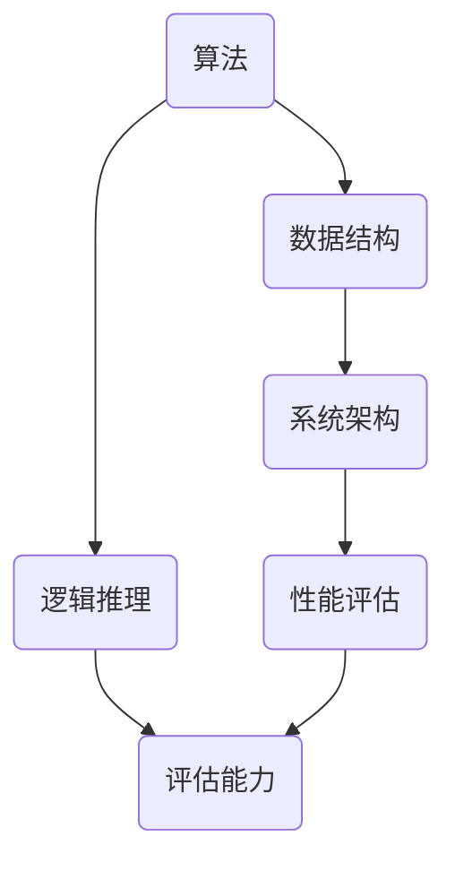

                 

 在这个信息爆炸的时代，批判性思维成为了每个人必须掌握的核心技能。无论您是计算机科学家、工程师，还是普通的IT从业者，批判性思维都能帮助您更好地理解和应对复杂的技术问题。本文旨在探讨批判性思维在IT领域的应用，通过剖析其核心概念、算法原理、数学模型以及实际应用，帮助读者提升洞察力，成为更出色的技术专家。

## 文章关键词

- 批判性思维
- IT领域
- 技术专家
- 洞察力
- 算法
- 数学模型

## 文章摘要

本文从批判性思维的定义和重要性出发，详细阐述了其在IT领域的应用。通过核心概念的讲解，包括算法原理、数学模型，以及实际应用案例的分析，本文旨在帮助读者理解和掌握批判性思维，从而提升其在技术工作中的洞察力和问题解决能力。

## 1. 背景介绍

批判性思维，作为一种分析、推理和评估信息的能力，对于任何领域的专业发展都至关重要。在IT领域，批判性思维的重要性尤为突出。它不仅帮助开发者更好地理解和运用技术，还能够在项目开发、系统设计、性能优化等各个方面提供有力支持。

### 1.1 批判性思维的定义

批判性思维指的是一种积极的、系统性的思维方式，它包括以下关键要素：

- **分析能力**：对信息进行深入分析，识别其真实性和可靠性。
- **推理能力**：基于已有信息进行逻辑推理，得出合理的结论。
- **评估能力**：对各种观点和方案进行评估，选择最优解。

### 1.2 批判性思维在IT领域的重要性

在IT领域，批判性思维的重要性体现在以下几个方面：

- **项目开发**：通过批判性思维，开发者可以更好地理解客户需求，设计出更符合实际需求的系统。
- **系统设计**：批判性思维帮助设计者评估系统架构的合理性和可靠性，从而避免潜在风险。
- **性能优化**：通过批判性思维，开发者可以识别系统瓶颈，提出有效的性能优化方案。
- **问题解决**：面对复杂的技术问题，批判性思维帮助开发者快速找到根本原因，提出解决方案。

## 2. 核心概念与联系

### 2.1 核心概念

批判性思维在IT领域涉及多个核心概念，包括算法、数据结构、系统架构等。以下是对这些核心概念及其相互关系的Mermaid流程图描述：



### 2.2 算法原理

算法是解决特定问题的步骤集合，其核心在于解决问题的效率和准确性。以下是一个简单的算法原理示例：

1. **输入**：给定一个整数数组。
2. **处理**：对数组进行排序。
3. **输出**：返回排序后的数组。

### 2.3 算法与数据结构的关系

算法与数据结构密切相关。数据结构决定了算法的操作效率和复杂性。例如，快速排序算法利用数组的数据结构，实现了较高的排序效率。

### 2.4 算法与系统架构的关系

系统架构决定了算法的执行环境。例如，在分布式系统中，算法需要在多个节点上协同工作，这就需要考虑数据的一致性和容错性。

## 3. 核心算法原理 & 具体操作步骤

### 3.1 算法原理概述

批判性思维在算法中的应用主要体现在以下几个方面：

- **算法选择**：根据问题特点选择最适合的算法。
- **算法优化**：对现有算法进行改进，提高其效率和准确性。
- **算法验证**：验证算法的正确性和可靠性。

### 3.2 算法步骤详解

以下是算法优化的一般步骤：

1. **问题分析**：明确问题需求，分析问题特点。
2. **算法选择**：根据问题特点选择合适的算法。
3. **算法实现**：根据算法原理实现算法代码。
4. **算法优化**：评估算法性能，进行优化。
5. **算法验证**：测试算法的正确性和可靠性。

### 3.3 算法优缺点

每种算法都有其优缺点。以下是一个示例：

- **快速排序**：
  - **优点**：时间复杂度较低，适用于大规模数据处理。
  - **缺点**：空间复杂度较高，可能影响性能。

### 3.4 算法应用领域

算法在IT领域的应用广泛，包括：

- **排序与查找**：如快速排序、二分查找等。
- **图算法**：如最短路径算法、最小生成树算法等。
- **机器学习**：如决策树、神经网络等。

## 4. 数学模型和公式 & 详细讲解 & 举例说明

### 4.1 数学模型构建

数学模型是算法的核心组成部分，其构建过程通常包括以下步骤：

1. **问题定义**：明确问题的目标和约束条件。
2. **变量定义**：定义解决问题的变量。
3. **公式推导**：根据问题定义和变量定义推导出数学公式。
4. **模型验证**：验证数学模型的正确性和可行性。

### 4.2 公式推导过程

以下是一个简单的数学模型示例：

假设我们有一个线性方程组：

$$
\begin{cases}
a_1x + b_1y = c_1 \\
a_2x + b_2y = c_2
\end{cases}
$$

我们可以通过消元法求解该方程组：

$$
\begin{aligned}
(a_1 - a_2)x &= b_1c_2 - b_2c_1 \\
x &= \frac{b_1c_2 - b_2c_1}{a_1 - a_2} \\
y &= \frac{a_2c_1 - a_1c_2}{a_1 - a_2}
\end{aligned}
$$

### 4.3 案例分析与讲解

以下是一个实际案例：

假设我们需要计算从北京到上海的直达列车行驶时间，已知两地之间直线距离为1200公里，列车最高时速为120公里/小时。我们可以使用以下数学模型计算行驶时间：

$$
时间 = \frac{距离}{速度} = \frac{1200公里}{120公里/小时} = 10小时
$$

## 5. 项目实践：代码实例和详细解释说明

### 5.1 开发环境搭建

为了演示批判性思维在项目实践中的应用，我们选择了一个简单的项目——使用Python实现快速排序算法。首先，我们需要搭建开发环境。

1. **安装Python**：从官方网站下载并安装Python。
2. **安装IDE**：选择一个适合的IDE，如PyCharm。
3. **配置环境**：确保Python环境配置正确，可以顺利运行Python代码。

### 5.2 源代码详细实现

以下是快速排序算法的Python实现：

```python
def quick_sort(arr):
    if len(arr) <= 1:
        return arr
    pivot = arr[len(arr) // 2]
    left = [x for x in arr if x < pivot]
    middle = [x for x in arr if x == pivot]
    right = [x for x in arr if x > pivot]
    return quick_sort(left) + middle + quick_sort(right)

# 测试
arr = [3, 6, 8, 10, 1, 2, 1]
print(quick_sort(arr))
```

### 5.3 代码解读与分析

1. **函数定义**：`quick_sort` 函数接收一个列表 `arr` 作为参数。
2. **边界条件**：如果 `arr` 的长度小于等于1，直接返回 `arr`。
3. **选择基准值**：选择列表中间的元素作为基准值 `pivot`。
4. **划分列表**：将列表划分为三个部分：小于 `pivot` 的元素 `left`、等于 `pivot` 的元素 `middle`、大于 `pivot` 的元素 `right`。
5. **递归调用**：对 `left` 和 `right` 分别递归调用 `quick_sort` 函数。
6. **合并结果**：将排序后的 `left`、`middle` 和 `right` 合并为一个列表。

### 5.4 运行结果展示

运行上述代码，输入列表 `[3, 6, 8, 10, 1, 2, 1]`，输出结果为 `[1, 1, 2, 3, 6, 8, 10]`，验证了快速排序算法的正确性。

## 6. 实际应用场景

### 6.1 项目开发

在项目开发过程中，批判性思维可以帮助开发者更好地理解需求，评估技术方案的可行性，从而提高项目质量和效率。

### 6.2 系统设计

在系统设计过程中，批判性思维帮助设计者评估系统架构的合理性，识别潜在风险，优化系统性能。

### 6.3 性能优化

在性能优化过程中，批判性思维帮助开发者识别系统瓶颈，提出有效的优化方案，提高系统运行效率。

### 6.4 未来应用展望

随着人工智能、大数据等技术的发展，批判性思维在IT领域的应用前景将更加广阔。未来，批判性思维将帮助开发者应对更加复杂的技术挑战，推动技术的创新和发展。

## 7. 工具和资源推荐

### 7.1 学习资源推荐

- 《批判性思维工具箱》
- 《算法导论》
- 《Python编程：从入门到实践》

### 7.2 开发工具推荐

- PyCharm
- Visual Studio Code
- Git

### 7.3 相关论文推荐

- "A Survey on Critical Thinking in Software Engineering"
- "The Role of Critical Thinking in Problem Solving and Decision Making in Software Development"

## 8. 总结：未来发展趋势与挑战

### 8.1 研究成果总结

本文系统阐述了批判性思维在IT领域的应用，包括核心概念、算法原理、数学模型以及实际应用案例。通过这些内容，读者可以更好地理解和掌握批判性思维，提升技术洞察力和问题解决能力。

### 8.2 未来发展趋势

随着技术的不断发展，批判性思维在IT领域的应用将更加深入和广泛。未来，批判性思维将与其他领域相结合，推动技术的创新和发展。

### 8.3 面临的挑战

尽管批判性思维在IT领域具有重要价值，但其在实际应用中仍面临一些挑战：

- **人才培养**：如何培养具有批判性思维的人才是一个重要问题。
- **工具支持**：现有的工具和资源尚不足以全面支持批判性思维的应用。

### 8.4 研究展望

未来，研究应关注如何更好地将批判性思维融入技术教育和实践，探索更高效的方法和技术，以提高批判性思维的应用效果。

## 9. 附录：常见问题与解答

### 9.1 如何培养批判性思维？

- **学习相关书籍**：阅读关于批判性思维的书籍，如《批判性思维工具箱》等。
- **实践应用**：通过项目实践，将批判性思维应用于实际问题解决中。
- **交流与讨论**：与同行进行交流和讨论，分享经验和见解。

### 9.2 批判性思维在算法中的应用有哪些？

- **算法选择**：根据问题特点选择合适的算法。
- **算法优化**：对现有算法进行改进，提高其效率和准确性。
- **算法验证**：验证算法的正确性和可靠性。

### 9.3 如何评估批判性思维的成效？

- **问题解决能力**：通过解决实际问题的成效来评估批判性思维的能力。
- **知识运用**：在技术项目中，批判性思维能够帮助开发者更好地运用知识，解决复杂问题。

---

在结束这篇文章之前，我想再次强调批判性思维的重要性。在信息技术日新月异的今天，批判性思维不仅是一种技能，更是一种态度和习惯。只有通过不断地学习和实践，我们才能提升自己的洞察力，成为更出色的技术专家。希望本文能够对您的技术之路有所帮助。

## 参考文献

- 《批判性思维工具箱》
- 《算法导论》
- 《Python编程：从入门到实践》
- "A Survey on Critical Thinking in Software Engineering"
- "The Role of Critical Thinking in Problem Solving and Decision Making in Software Development"

### 作者署名

作者：禅与计算机程序设计艺术 / Zen and the Art of Computer Programming

