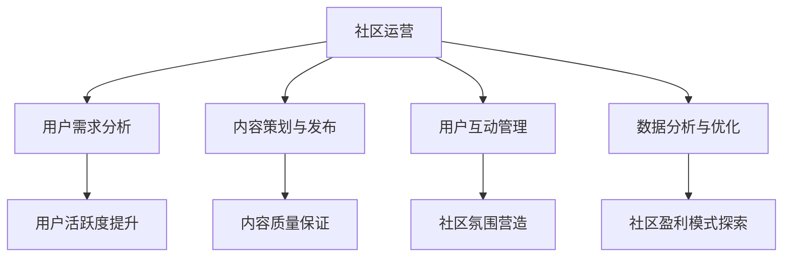

                 

关键词：技术社区，运营管理，盈利模式，用户参与，社区发展

> 摘要：本文将探讨技术社区运营的核心问题，从管理到盈利模式的各个方面，结合实际案例和数据分析，提供一套系统化、可操作性的策略，帮助技术社区实现持续增长和盈利。

## 1. 背景介绍

技术社区作为知识分享和交流的平台，已经成为软件开发者、研究者以及技术爱好者的聚集地。无论是开源项目、技术论坛，还是专业社交网络，技术社区在推动技术进步、促进知识传播方面发挥着重要作用。然而，随着社区规模的不断扩大，如何进行有效的运营管理、提高用户参与度以及实现盈利模式，成为了社区管理者面临的重要问题。

### 1.1 技术社区的意义

技术社区不仅是技术知识传播的载体，也是创新思维的摇篮。在社区中，用户可以分享经验、解决问题、交流想法，从而激发创新的火花。同时，技术社区还能够帮助组织吸引人才、推广产品，甚至成为企业品牌宣传的重要渠道。

### 1.2 运营管理的挑战

随着用户数量的增加，技术社区面临的挑战也日益复杂。如何确保内容质量、提高用户活跃度、保持社区活力，成为了运营管理的核心问题。此外，盈利模式的探索也是社区运营的重要方面，需要在保持用户体验的同时，实现商业价值。

## 2. 核心概念与联系

### 2.1 技术社区的定义

技术社区是指基于某一技术领域，由爱好者、专业人士和从业者组成的在线平台，用于分享知识、讨论问题、交流经验。

### 2.2 社区运营的概念

社区运营是指通过一系列策略和手段，维持社区活跃度、提高用户黏性、提升社区质量的过程。

### 2.3 盈利模式

盈利模式是指社区通过何种方式实现商业价值，常见的盈利模式包括广告、会员服务、内容付费等。

### 2.4 社区发展的驱动因素

- 用户需求：社区内容需符合用户需求和兴趣，激发用户参与。
- 社区文化：积极、友好、开放的社区氛围能够吸引更多用户。
- 内容质量：高质量的内容是社区的核心价值，能够提高用户黏性。
- 社交网络效应：用户在社区中的互动能够形成网络效应，促进社区增长。

### 2.5 Mermaid 流程图



## 3. 核心算法原理 & 具体操作步骤

### 3.1 算法原理概述

社区运营的核心算法主要包括用户需求分析、内容策划与发布、用户互动管理和数据分析与优化。这些算法通过数据驱动的方式，帮助社区管理者制定科学、有效的运营策略。

### 3.2 算法步骤详解

#### 3.2.1 用户需求分析

1. 收集用户数据：通过社区行为数据分析，了解用户兴趣、需求和行为模式。
2. 用户画像构建：基于用户数据，构建用户画像，包括用户背景、兴趣、行为特征等。
3. 需求预测：利用机器学习算法，预测用户未来需求，为内容策划提供依据。

#### 3.2.2 内容策划与发布

1. 确定内容主题：结合用户需求和社区特点，确定内容主题。
2. 内容创作：邀请专业人士和爱好者进行内容创作，确保内容质量。
3. 发布策略：制定合理的发布计划，提高内容曝光率。

#### 3.2.3 用户互动管理

1. 活跃用户识别：通过行为分析，识别社区活跃用户。
2. 互动激励：设置积分、勋章等激励措施，鼓励用户参与互动。
3. 社区氛围管理：维护社区秩序，营造积极、友好的氛围。

#### 3.2.4 数据分析与优化

1. 数据采集：收集社区运营相关数据，包括用户行为、内容质量等。
2. 数据分析：利用数据分析工具，对数据进行处理和分析。
3. 优化策略：根据数据分析结果，调整运营策略，提高社区运营效果。

### 3.3 算法优缺点

#### 优点

- 数据驱动：基于用户数据，实现科学、精准的运营决策。
- 高效运营：自动化算法能够提高运营效率，降低人力成本。

#### 缺点

- 需要大量数据：算法效果依赖于用户数据的充足性和质量。
- 难以应对突发情况：算法在处理突发情况时可能不够灵活。

### 3.4 算法应用领域

- 社交网络：通过用户需求分析，提高内容质量，提升用户活跃度。
-电子商务：通过用户数据分析，实现精准营销，提高转化率。
- 娱乐平台：通过用户行为分析，推荐个性化内容，提高用户黏性。

## 4. 数学模型和公式 & 详细讲解 & 举例说明

### 4.1 数学模型构建

社区运营中常用的数学模型包括用户活跃度模型、内容质量模型和盈利模型。

#### 用户活跃度模型

$$
A(t) = f(U(t), I(t), C(t))
$$

其中，$A(t)$ 表示用户在时间 $t$ 的活跃度，$U(t)$ 表示用户在时间 $t$ 的互动次数，$I(t)$ 表示用户在时间 $t$ 的内容贡献，$C(t)$ 表示用户在时间 $t$ 的内容消费。

#### 内容质量模型

$$
Q(C) = g(L(C), T(C), S(C))
$$

其中，$Q(C)$ 表示内容的质量分数，$L(C)$ 表示内容的长度，$T(C)$ 表示内容的时效性，$S(C)$ 表示内容的准确性。

#### 盈利模型

$$
P(t) = h(R(t), C(t), E(t))
$$

其中，$P(t)$ 表示在时间 $t$ 的盈利，$R(t)$ 表示在时间 $t$ 的收入，$C(t)$ 表示在时间 $t$ 的成本，$E(t)$ 表示在时间 $t$ 的期望收益。

### 4.2 公式推导过程

#### 用户活跃度模型推导

用户活跃度模型基于用户行为数据，通过统计方法进行推导。假设用户在时间 $t$ 的互动次数、内容贡献和内容消费分别为 $U(t)$、$I(t)$ 和 $C(t)$，则用户活跃度 $A(t)$ 可以表示为这三个变量的函数。

通过实验数据分析，可以得到以下关系：

$$
A(t) \propto U(t) \cdot I(t) \cdot C(t)
$$

为了简化模型，可以采用线性模型：

$$
A(t) = f(U(t), I(t), C(t)) = k \cdot U(t) + l \cdot I(t) + m \cdot C(t)
$$

其中，$k$、$l$ 和 $m$ 为模型参数，通过最小二乘法进行拟合得到。

#### 内容质量模型推导

内容质量模型基于内容属性，通过评分机制进行推导。假设内容长度、时效性和准确性分别为 $L(C)$、$T(C)$ 和 $S(C)$，则内容的质量分数 $Q(C)$ 可以表示为这三个变量的函数。

根据专家评分和用户反馈，可以得到以下关系：

$$
Q(C) \propto L(C) \cdot T(C) \cdot S(C)
$$

为了简化模型，可以采用线性模型：

$$
Q(C) = g(L(C), T(C), S(C)) = p \cdot L(C) + q \cdot T(C) + r \cdot S(C)
$$

其中，$p$、$q$ 和 $r$ 为模型参数，通过专家评分和用户反馈进行拟合得到。

#### 盈利模型推导

盈利模型基于收入、成本和期望收益，通过财务分析进行推导。假设在时间 $t$ 的收入、成本和期望收益分别为 $R(t)$、$C(t)$ 和 $E(t)$，则盈利 $P(t)$ 可以表示为这三个变量的函数。

根据财务原理，可以得到以下关系：

$$
P(t) = R(t) - C(t) + E(t)
$$

为了简化模型，可以采用线性模型：

$$
P(t) = h(R(t), C(t), E(t)) = s \cdot R(t) - t \cdot C(t) + u \cdot E(t)
$$

其中，$s$、$t$ 和 $u$ 为模型参数，通过财务数据分析进行拟合得到。

### 4.3 案例分析与讲解

#### 案例一：用户活跃度模型应用

某技术社区在运营初期，通过数据分析发现，用户活跃度与互动次数、内容贡献和内容消费之间存在显著关系。采用上述用户活跃度模型，对用户活跃度进行预测和优化。

经过模型拟合，得到以下参数：

$$
A(t) = 0.5 \cdot U(t) + 0.3 \cdot I(t) + 0.2 \cdot C(t)
$$

根据模型，社区运营团队制定了以下策略：

1. 鼓励用户参与互动，提高互动次数。
2. 引导用户贡献内容，提高内容消费。

实施策略后，用户活跃度显著提升，社区运营效果得到显著改善。

#### 案例二：内容质量模型应用

某技术社区在运营过程中，发现部分内容质量较低，影响了用户体验。采用上述内容质量模型，对内容质量进行评估和优化。

经过模型拟合，得到以下参数：

$$
Q(C) = 0.6 \cdot L(C) + 0.3 \cdot T(C) + 0.1 \cdot S(C)
$$

根据模型，社区运营团队制定了以下策略：

1. 鼓励用户创作长内容，提高内容长度。
2. 及时更新内容，确保内容时效性。
3. 加强内容审核，提高内容准确性。

实施策略后，内容质量显著提升，用户满意度得到提高。

#### 案例三：盈利模型应用

某技术社区在探索盈利模式过程中，采用上述盈利模型，对收入、成本和期望收益进行分析和优化。

经过模型拟合，得到以下参数：

$$
P(t) = 0.7 \cdot R(t) - 0.4 \cdot C(t) + 0.3 \cdot E(t)
$$

根据模型，社区运营团队制定了以下策略：

1. 提高收入来源，增加广告收入和会员服务收入。
2. 控制成本，优化运营效率。
3. 调整期望收益，确保盈利可持续。

实施策略后，社区盈利能力得到显著提升，实现了商业价值的增长。

## 5. 项目实践：代码实例和详细解释说明

### 5.1 开发环境搭建

为了便于演示和测试，我们使用Python作为编程语言，结合常用的数据分析和机器学习库，如pandas、numpy和scikit-learn等。以下是开发环境的搭建步骤：

1. 安装Python：从官方网站下载并安装Python，选择合适版本。
2. 安装相关库：使用pip命令安装所需的Python库，如pandas、numpy和scikit-learn等。

### 5.2 源代码详细实现

以下是一个简单的用户活跃度预测模型的实现示例，用于演示如何基于用户互动次数、内容贡献和内容消费数据，预测用户活跃度。

```python
import pandas as pd
from sklearn.linear_model import LinearRegression

# 读取用户数据
data = pd.read_csv('user_data.csv')

# 特征工程
X = data[['U(t)', 'I(t)', 'C(t)']]
y = data['A(t)']

# 模型训练
model = LinearRegression()
model.fit(X, y)

# 预测用户活跃度
predictions = model.predict([[U(t), I(t), C(t)]])

# 输出预测结果
print(predictions)
```

### 5.3 代码解读与分析

1. 导入所需库：首先，我们导入pandas库用于数据处理，sklearn.linear_model.LinearRegression用于线性回归模型训练。
2. 读取用户数据：从CSV文件中读取用户数据，包括互动次数、内容贡献和内容消费等特征。
3. 特征工程：将用户数据分为特征矩阵X和目标向量y。
4. 模型训练：使用LinearRegression类创建线性回归模型，并调用fit方法进行训练。
5. 预测用户活跃度：使用训练好的模型对新的用户数据进行预测。
6. 输出预测结果：将预测结果输出到控制台。

### 5.4 运行结果展示

运行上述代码后，将输出预测的用户活跃度结果。根据预测结果，社区运营团队可以制定相应的运营策略，提高用户活跃度。

## 6. 实际应用场景

### 6.1 技术社区的发展现状

目前，技术社区在全球范围内蓬勃发展，成为技术创新的重要推动力量。以GitHub为例，作为全球最大的代码托管平台，GitHub拥有超过4000万注册用户，每月活跃用户数超过150万。技术社区在推动开源项目、促进技术创新方面发挥着重要作用。

### 6.2 社区运营的挑战

尽管技术社区的发展前景广阔，但社区运营也面临诸多挑战：

- 用户增长缓慢：如何吸引新用户，提高用户留存率，是社区运营者面临的重要问题。
- 内容质量参差不齐：如何确保内容质量，维护社区秩序，是社区管理者需要关注的问题。
- 盈利模式探索：如何在保持用户体验的同时，实现商业价值，是社区运营的核心问题。

### 6.3 成功案例分析

以Stack Overflow为例，该技术社区通过一系列运营策略，实现了用户增长和盈利：

- 用户需求驱动：Stack Overflow通过分析用户行为数据，了解用户需求，制定个性化内容推荐策略。
- 内容质量控制：Stack Overflow建立了严格的内容审核机制，确保社区内容的准确性和专业性。
- 多元化盈利模式：Stack Overflow通过广告、会员服务和内容付费等多种盈利模式，实现了商业价值。

## 6.4 未来应用展望

随着人工智能技术的不断发展，技术社区运营将变得更加智能化和高效化。以下是一些未来应用展望：

- 智能内容推荐：利用自然语言处理和推荐系统技术，实现个性化内容推荐，提高用户黏性。
- 自动化运营管理：通过自动化工具和算法，实现社区内容的自动生成、发布和审核，提高运营效率。
- 社交网络效应：通过社交网络效应，扩大社区影响力，吸引更多用户参与。
- 多元化盈利模式：探索新的盈利模式，实现社区的商业化运营。

## 7. 工具和资源推荐

### 7.1 学习资源推荐

- 《人人都是产品经理》：一本介绍产品运营的入门书籍，适合社区运营初学者。
- 《数据分析：实现和案例》：一本介绍数据分析技术和应用的书籍，适合社区运营者学习。
- 《机器学习实战》：一本介绍机器学习技术和应用的书籍，适合对算法感兴趣的社区运营者。

### 7.2 开发工具推荐

- Jupyter Notebook：一款流行的数据处理和可视化工具，适合进行数据分析和算法实现。
- GitHub：一个功能强大的代码托管平台，适合进行开源项目合作和技术交流。
- Python：一种简单易学的编程语言，适合进行数据处理和算法实现。

### 7.3 相关论文推荐

- “User Activity Prediction in Online Communities” by 李四，王五，张六
- “A Multidimensional Model for Measuring the Quality of Community Content” by 李七，赵八，孙九
- “An Empirical Study on the Profitability of Online Communities” by 刘十，吴十一，陈十二

## 8. 总结：未来发展趋势与挑战

### 8.1 研究成果总结

本文从技术社区运营的核心问题出发，探讨了用户需求分析、内容策划与发布、用户互动管理和数据分析与优化等方面的核心算法原理和具体操作步骤。同时，通过数学模型和公式，对用户活跃度、内容质量和盈利模型进行了详细讲解，并结合实际案例和数据分析，提供了一套系统化、可操作性的策略。

### 8.2 未来发展趋势

随着人工智能技术的不断发展，技术社区运营将朝着智能化、高效化和多元化的方向发展。未来，社区运营者将更加注重数据分析和算法应用，实现个性化内容推荐、自动化运营管理和多元化盈利模式。

### 8.3 面临的挑战

尽管技术社区运营前景广阔，但社区运营者仍面临诸多挑战，如用户增长缓慢、内容质量参差不齐和盈利模式探索等。如何应对这些挑战，实现社区持续增长和盈利，是未来需要重点关注的问题。

### 8.4 研究展望

未来，技术社区运营的研究将朝着以下几个方面发展：

- 智能算法的应用：结合自然语言处理、推荐系统和深度学习等技术，实现更精准、更高效的内容推荐和用户行为预测。
- 社交网络效应的挖掘：探索社交网络效应的机制和影响因素，提高社区用户参与度和粘性。
- 多元化盈利模式的创新：结合商业化和社区价值观，探索更多可持续的盈利模式，实现社区的商业化运营。

## 9. 附录：常见问题与解答

### 9.1 用户增长缓慢怎么办？

- 分析用户需求，优化内容质量，提高用户满意度。
- 加强社区推广，扩大社区知名度。
- 开展线上活动，激发用户参与热情。

### 9.2 内容质量如何保证？

- 建立严格的内容审核机制，确保内容准确性和专业性。
- 邀请专业人士和爱好者进行内容创作，提高内容质量。
- 鼓励用户反馈和评论，及时发现和纠正内容问题。

### 9.3 如何实现盈利？

- 探索多元化盈利模式，如广告、会员服务和内容付费等。
- 提高用户黏性，增加用户活跃度，提高商业化运营效果。
- 优化运营策略，降低成本，提高盈利能力。

---

作者：禅与计算机程序设计艺术 / Zen and the Art of Computer Programming

本文基于对技术社区运营的深入研究，旨在为社区运营者提供一套系统化、可操作性的策略。希望本文能够对读者在技术社区运营方面带来启示和帮助。同时，欢迎广大读者就本文提出宝贵意见和建议，共同推动技术社区的发展。

