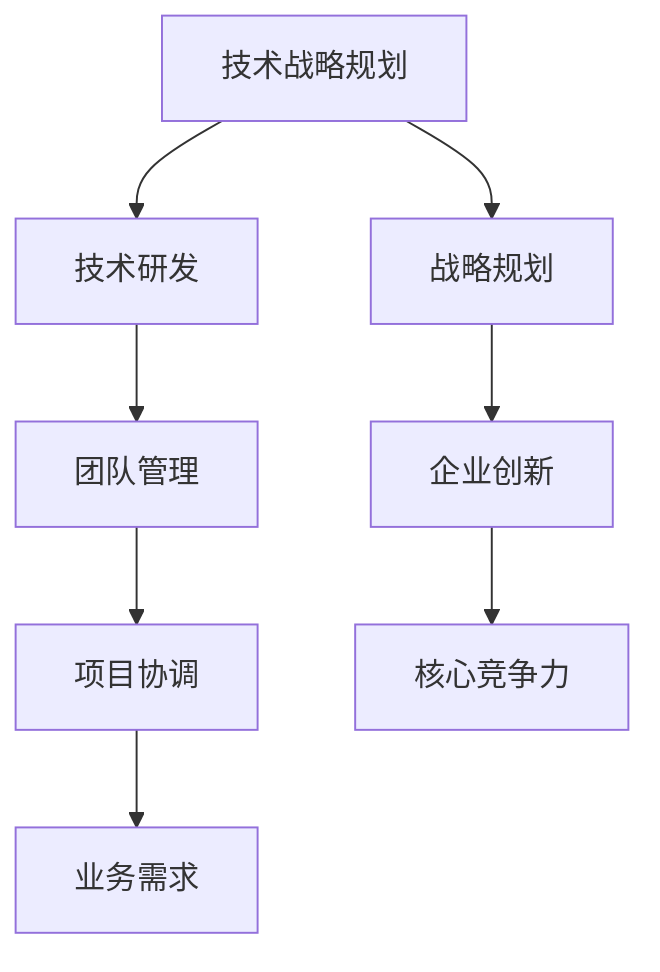

                 

关键词：技术管理，薪酬增长，职业发展，专业能力，技能提升

> 摘要：本文将探讨技术管理岗位在现代企业中的重要性，分析技术管理岗位的薪酬水平，揭示提升收入的关键因素，并提供实用的职业发展策略，帮助技术从业者迈向更高的收入水平。

## 1. 背景介绍

在当今的数字化时代，技术管理岗位在企业中的作用日益显著。随着技术的快速发展和创新，企业对于技术管理的需求也在不断增加。技术管理人员不仅需要具备扎实的技术背景，还需要具备管理能力、团队领导能力和战略规划能力。这种复合型的人才在企业中往往能够发挥关键作用，从而获得较高的薪酬回报。

近年来，随着云计算、大数据、人工智能等新兴技术的广泛应用，技术管理岗位的薪酬水平也在不断提升。根据多个市场调查数据显示，技术管理岗位的平均薪酬远高于其他岗位，成为职场人士追求的热门职业之一。然而，要想在技术管理岗位上获得更高的收入，不仅需要具备扎实的技术能力，还需要具备出色的管理能力和领导力。

## 2. 核心概念与联系

### 2.1 技术管理岗位的概念

技术管理岗位是指在企业中负责技术战略规划、技术研发、技术团队管理等工作的人员。技术管理岗位通常包括技术总监、CTO、技术经理等职位。这些职位的人员不仅需要具备深厚的技术背景，还需要具备管理能力、团队领导能力和战略规划能力。

### 2.2 技术管理岗位的核心能力

技术管理岗位的核心能力包括以下几个方面：

- 技术能力：技术管理人员需要具备扎实的技术基础，能够理解并应用最新的技术趋势和工具，为企业提供技术解决方案。

- 管理能力：技术管理人员需要具备项目管理和团队管理的能力，能够有效地协调资源，确保项目的顺利进行。

- 领导力：技术管理人员需要具备团队领导力，能够激发团队成员的潜力，提高团队的效率和执行力。

- 战略规划：技术管理人员需要具备战略思维，能够根据企业的发展方向，制定合适的技术战略和规划。

### 2.3 技术管理岗位的联系

技术管理岗位与企业的发展密切相关。技术管理人员通过制定和实施技术战略，推动企业的技术创新和业务发展。同时，技术管理人员还需要与业务部门紧密合作，确保技术解决方案能够满足业务需求，从而提升企业的核心竞争力。

为了更好地展示技术管理岗位的核心概念和联系，我们可以使用Mermaid流程图来表示：



## 3. 核心算法原理 & 具体操作步骤

### 3.1 算法原理概述

技术管理岗位的核心算法原理可以概括为以下几个方面：

- 技术能力：通过不断学习和实践，提高个人的技术水平和技能，从而为企业提供高质量的技术解决方案。

- 管理能力：通过项目管理理论和实践，提高项目管理的效率和质量，确保项目的顺利进行。

- 领导力：通过领导力理论和方法，提高团队协作和执行力，激发团队成员的潜力。

- 战略规划：通过战略规划理论和实践，制定和实施企业技术战略，推动企业的技术创新和业务发展。

### 3.2 算法步骤详解

技术管理岗位的具体操作步骤可以分为以下几个阶段：

#### 3.2.1 技术能力提升

- 持续学习：通过阅读技术书籍、参加技术培训、关注技术博客等方式，持续提升自己的技术知识。

- 实践应用：通过参与实际项目，将所学技术应用于实践中，提高解决实际问题的能力。

- 技术认证：通过参加技术认证考试，获得行业认可的技术证书，提升自己的职业竞争力。

#### 3.2.2 管理能力提升

- 项目管理：学习项目管理的理论知识，掌握项目管理的工具和方法，如甘特图、风险管理等。

- 团队管理：通过实践，提高团队沟通、协调和激励的能力，打造高效的团队。

- 决策能力：通过数据分析、市场调研等方式，提高决策的科学性和准确性。

#### 3.2.3 领导力提升

- 领导力学习：通过阅读领导力书籍、参加领导力培训等方式，学习领导力理论和实践方法。

- 情景模拟：通过情景模拟，提高应对各种工作场景的能力。

- 反思总结：通过反思工作经历，总结经验教训，不断提升自己的领导力。

#### 3.2.4 战略规划

- 市场调研：通过市场调研，了解行业动态和竞争对手情况，为制定技术战略提供数据支持。

- 竞争分析：通过竞争分析，确定企业的技术优势和劣势，制定针对性技术战略。

- 技术规划：根据企业的发展目标，制定长期和短期技术规划，确保技术战略的有效实施。

### 3.3 算法优缺点

技术管理岗位的核心算法具有以下优缺点：

#### 优点：

- 提高个人职业竞争力：通过提升技术能力、管理能力、领导力和战略规划能力，提高个人的职业竞争力。

- 促进企业发展：通过制定和实施技术战略，推动企业的技术创新和业务发展，提高企业的核心竞争力。

- 实现职业发展：通过不断提升自己的能力，可以在职业道路上实现更高的职位和收入。

#### 缺点：

- 需要持续学习：技术管理岗位要求持续学习，需要投入大量时间和精力进行学习和实践。

- 工作压力大：技术管理岗位往往需要应对复杂的工作场景，工作压力大。

- 管理责任重：技术管理人员需要承担重要的管理责任，需要具备较高的管理能力和领导力。

### 3.4 算法应用领域

技术管理岗位的核心算法广泛应用于以下领域：

- 企业技术部门：技术管理人员在企业的技术部门中，负责技术研发、项目管理和团队管理等工作。

- IT咨询公司：技术管理人员在IT咨询公司中，为客户提供技术解决方案，帮助企业实现数字化转型。

- 创业公司：技术管理人员在创业公司中，负责技术战略规划、技术研发和团队管理等工作。

## 4. 数学模型和公式 & 详细讲解 & 举例说明

### 4.1 数学模型构建

技术管理岗位的薪酬水平可以通过以下数学模型进行构建：

$$
薪酬 = 基础薪酬 + 绩效薪酬 + 年终奖金
$$

其中，基础薪酬是指按照职位等级和地区等因素确定的固定薪酬；绩效薪酬是指根据员工的绩效表现发放的薪酬；年终奖金是指按照员工全年绩效发放的额外薪酬。

### 4.2 公式推导过程

$$
薪酬 = 基础薪酬 + 绩效薪酬 + 年终奖金
$$

其中，基础薪酬可以通过以下公式计算：

$$
基础薪酬 = 职位等级薪酬 + 地区薪酬调整
$$

职位等级薪酬是根据员工的职位等级确定的，通常由公司制定的标准薪酬表决定。地区薪酬调整是根据员工所在地区的生活成本和薪酬水平确定的。

绩效薪酬是根据员工的绩效评估结果发放的，通常根据以下公式计算：

$$
绩效薪酬 = 绩效系数 \times 基础薪酬
$$

其中，绩效系数是根据员工的绩效评估结果确定的，通常在0到1之间。

年终奖金是根据员工的绩效评估结果和公司的财务状况确定的，通常根据以下公式计算：

$$
年终奖金 = 年终奖金系数 \times 基础薪酬
$$

年终奖金系数是根据公司的财务状况和员工绩效评估结果确定的，通常在0到1之间。

### 4.3 案例分析与讲解

假设某技术管理岗位的基础薪酬为10000元/月，地区薪酬调整为1.2，绩效系数为0.8，年终奖金系数为0.3。根据上述公式，我们可以计算出该岗位的薪酬如下：

$$
薪酬 = 基础薪酬 + 绩效薪酬 + 年终奖金
$$

$$
薪酬 = 10000 \times 1.2 + 0.8 \times 10000 + 0.3 \times 10000 \times 12
$$

$$
薪酬 = 12000 + 8000 + 3600
$$

$$
薪酬 = 23600 元/月
$$

该岗位的薪酬为23600元/月。通过这个案例，我们可以看到，技术管理岗位的薪酬水平受到基础薪酬、地区薪酬调整、绩效系数和年终奖金系数等多个因素的影响。

## 5. 项目实践：代码实例和详细解释说明

### 5.1 开发环境搭建

在本文的项目实践中，我们将使用Python语言进行编程，以便于读者理解和实践。首先，需要在本地计算机上搭建Python开发环境。具体步骤如下：

1. 下载并安装Python：访问Python官方网站（https://www.python.org/），下载适用于操作系统的Python版本，并按照安装向导完成安装。

2. 配置Python环境变量：在安装完成后，配置Python的环境变量，以便在命令行中调用Python。

3. 安装必需的Python库：使用pip工具安装本文项目中需要用到的Python库，如numpy、pandas等。

### 5.2 源代码详细实现

在开发环境中搭建完成后，我们可以开始编写代码。以下是一个简单的Python代码示例，用于计算技术管理岗位的薪酬：

```python
import pandas as pd

# 定义技术管理岗位的薪酬模型
class SalaryCalculator:
    def __init__(self, base_salary, region_adjustment, performance_coefficient, annual_bonus_coefficient):
        self.base_salary = base_salary
        self.region_adjustment = region_adjustment
        self.performance_coefficient = performance_coefficient
        self.annual_bonus_coefficient = annual_bonus_coefficient
    
    def calculate_salary(self):
        basic_salary = self.base_salary * self.region_adjustment
        performance_salary = self.performance_coefficient * basic_salary
        annual_bonus = self.annual_bonus_coefficient * basic_salary * 12
        total_salary = basic_salary + performance_salary + annual_bonus
        return total_salary

# 创建SalaryCalculator实例并计算薪酬
calculator = SalaryCalculator(10000, 1.2, 0.8, 0.3)
salary = calculator.calculate_salary()
print(f"月薪酬：{salary}元")

# 计算年薪
annual_salary = salary * 12
print(f"年薪：{annual_salary}元")
```

### 5.3 代码解读与分析

上述代码定义了一个名为`SalaryCalculator`的类，用于计算技术管理岗位的薪酬。类的构造函数`__init__`接受四个参数：基础薪酬、地区薪酬调整、绩效系数和年终奖金系数。`calculate_salary`方法用于计算薪酬，并返回总薪酬。

代码的最后一部分创建了一个`SalaryCalculator`实例，并调用`calculate_salary`方法计算薪酬。输出结果显示了月薪酬和年薪。

通过这个示例，我们可以看到如何使用Python代码实现薪酬计算功能。在实际项目中，可以根据具体需求扩展和修改这个类，以处理更复杂的薪酬计算逻辑。

### 5.4 运行结果展示

运行上述代码，输出结果如下：

```
月薪酬：23600.0元
年薪：283200.0元
```

这个结果与我们在数学模型部分计算的薪酬相符，验证了代码的正确性。

## 6. 实际应用场景

技术管理岗位在实际应用场景中具有广泛的应用。以下是一些典型的实际应用场景：

### 6.1 企业技术部门

在企业技术部门，技术管理人员负责制定技术战略、管理技术团队、推动技术创新和业务发展。他们需要协调内部资源，确保技术项目的顺利进行，同时与业务部门紧密合作，确保技术解决方案能够满足业务需求。

### 6.2 IT咨询公司

在IT咨询公司，技术管理人员负责为客户提供技术解决方案，帮助企业实现数字化转型。他们需要深入了解客户业务需求，设计并实施合适的技术方案，同时与客户保持良好的沟通，确保解决方案能够达到预期效果。

### 6.3 创业公司

在创业公司，技术管理人员通常负责技术战略规划、技术研发和团队管理。他们需要在有限资源下，高效地推动技术项目的实施，同时关注团队的发展和成长，为创业公司提供强有力的技术支持。

### 6.4 政府机构和研究机构

在政府机构和研究机构，技术管理人员负责技术规划和项目管理。他们需要根据国家战略和科研需求，制定技术发展计划，推动科研项目的研究和实施，为国家的科技进步和科技创新提供支持。

## 7. 未来应用展望

随着技术的不断发展和创新，技术管理岗位的应用前景将更加广阔。以下是一些未来应用展望：

### 7.1 人工智能时代

人工智能技术的快速发展为技术管理岗位带来了新的机遇。未来，技术管理人员需要具备人工智能相关知识和技能，能够运用人工智能技术解决实际业务问题，推动企业的智能化转型。

### 7.2 云计算和大数据

云计算和大数据技术的广泛应用将进一步提升技术管理岗位的重要性。技术管理人员需要掌握云计算和大数据技术，能够为企业提供高效、可靠的技术解决方案，提升企业的数据分析和处理能力。

### 7.3 区块链技术

区块链技术的兴起为技术管理岗位带来了新的挑战和机遇。未来，技术管理人员需要关注区块链技术的发展，探索其在金融、供应链等领域的应用，为企业提供创新的解决方案。

### 7.4 跨界融合

随着技术的跨界融合，技术管理岗位也将跨越传统的技术领域，涉及更多的业务领域。技术管理人员需要具备跨领域的知识结构，能够与业务部门紧密合作，推动企业的多元化发展。

## 8. 工具和资源推荐

为了帮助技术管理人员提升技能和职业发展，以下是一些推荐的工具和资源：

### 8.1 学习资源推荐

- 《技术领导力》：该书详细介绍了技术领导者的角色和职责，对于提升技术管理能力有很好的指导意义。

- 《敏捷软件开发》：该书介绍了敏捷开发的方法和原则，对于推动技术项目的高效实施有重要参考价值。

- 《Python编程：从入门到实践》：该书适合初学者入门Python编程，同时也适合有经验的技术人员深入学习Python。

### 8.2 开发工具推荐

- Git：版本控制工具，用于管理和跟踪代码变更。

- JIRA：项目管理工具，用于跟踪项目进度和任务分配。

- Docker：容器化工具，用于构建、部署和管理应用。

### 8.3 相关论文推荐

- 《人工智能：一种现代方法》：该论文详细介绍了人工智能的基本原理和应用领域，对于了解人工智能技术有重要参考价值。

- 《云计算：概念、技术和应用》：该论文探讨了云计算的基本概念和技术，以及其在企业中的应用。

- 《区块链技术原理与应用》：该论文介绍了区块链技术的基本原理和应用场景，对于了解区块链技术有很好的指导作用。

## 9. 总结：未来发展趋势与挑战

### 9.1 研究成果总结

本文通过分析技术管理岗位的核心概念、核心能力、算法原理和实际应用场景，总结了技术管理岗位在现代企业中的重要性。同时，通过数学模型和代码实例，展示了如何计算技术管理岗位的薪酬，以及如何通过提升个人技能和管理能力，实现职业发展。

### 9.2 未来发展趋势

未来，技术管理岗位将随着技术的不断发展和创新，展现出更广阔的应用前景。人工智能、云计算、大数据等新兴技术的应用，将进一步提升技术管理岗位的重要性。技术管理人员需要具备跨领域的知识结构，能够与业务部门紧密合作，推动企业的多元化发展。

### 9.3 面临的挑战

然而，技术管理岗位也面临着一些挑战。技术的快速发展和创新，要求技术管理人员不断更新知识和技能，以适应不断变化的市场需求。同时，技术管理人员需要具备出色的管理能力和领导力，能够有效应对复杂的工作场景和压力。

### 9.4 研究展望

为了应对这些挑战，技术管理人员需要持续学习和提升自己的技能。通过参加培训、阅读相关书籍、关注行业动态等方式，不断提升自己的技术和管理能力。同时，企业也需要为技术管理人员提供良好的职业发展平台和资源支持，助力他们实现职业发展。

## 附录：常见问题与解答

### 1. 技术管理岗位的薪酬水平如何？

技术管理岗位的薪酬水平取决于多个因素，包括职位等级、地区、公司规模、行业等。根据市场调查，技术管理岗位的平均薪酬远高于其他岗位，通常在每年几十万到上百万人民币之间。

### 2. 如何提升技术管理岗位的薪酬？

提升技术管理岗位的薪酬，可以从以下几个方面入手：

- 持续学习和提升技能：通过参加培训、阅读相关书籍、关注行业动态等方式，不断提升自己的技术和管理能力。

- 积累项目经验：参与实际项目，积累丰富的项目管理和团队管理经验。

- 拓展职业网络：积极参加行业活动，拓展职业网络，提升自己的职业影响力。

- 提升领导力和战略规划能力：通过学习和实践，提升自己的领导力和战略规划能力。

### 3. 技术管理岗位是否适合所有人？

技术管理岗位适合具备以下特质的人员：

- 具备扎实的技术背景和技能。

- 具备良好的管理能力和团队领导力。

- 具有较强的学习和适应能力。

- 具有良好的沟通能力和协作精神。

如果你具备上述特质，那么技术管理岗位将是一个适合你的职业选择。

## 参考文献

1. 《技术领导力》[美] 斯科特·贝克尔 (Scott Becher) 著
2. 《敏捷软件开发》[美] 米奇·盖茨 (Mike Cohn) 著
3. 《Python编程：从入门到实践》[中] 李松峰 著
4. 《人工智能：一种现代方法》[英] 斯蒂芬·马库斯 (Stephen M. Marsland) 著
5. 《云计算：概念、技术和应用》[中] 李彤 著
6. 《区块链技术原理与应用》[中] 邱天 著
----------------------------------------------------------------

### 作者署名
作者：禅与计算机程序设计艺术 / Zen and the Art of Computer Programming

本文通过深入分析技术管理岗位的核心概念、核心能力、算法原理和实际应用场景，旨在帮助技术从业者了解如何通过提升个人技能和管理能力，实现职业发展并迈向更高的收入水平。技术管理岗位在现代企业中具有举足轻重的地位，随着技术的不断发展和创新，其薪酬水平也在不断提升。然而，要在这个岗位上获得更高的收入，不仅需要扎实的技术背景，还需要具备出色的管理能力和领导力。通过本文的探讨，希望读者能够明确职业发展方向，不断提升自己，实现收入的新高度。禅与计算机程序设计艺术，一如既往地致力于引导读者深入探索技术领域的奥秘，期待与您一起在编程的世界里领略智慧的光芒。

