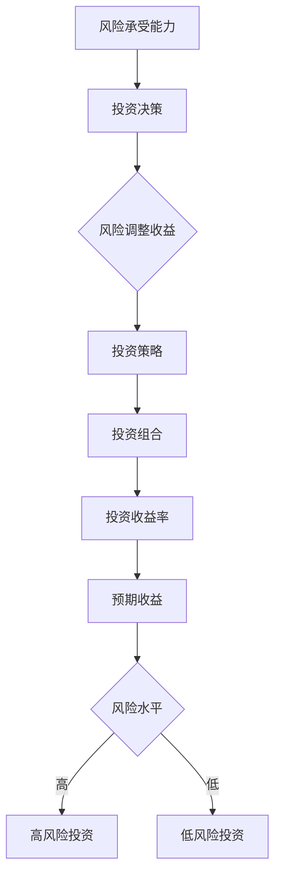
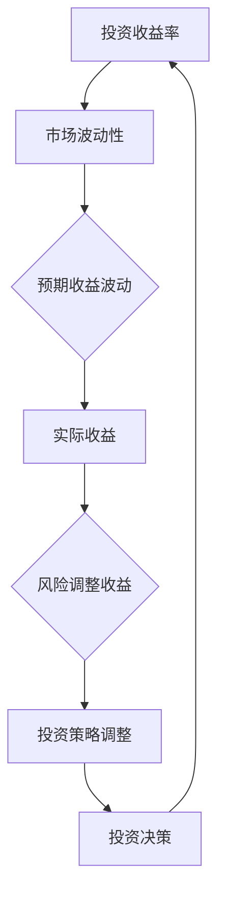
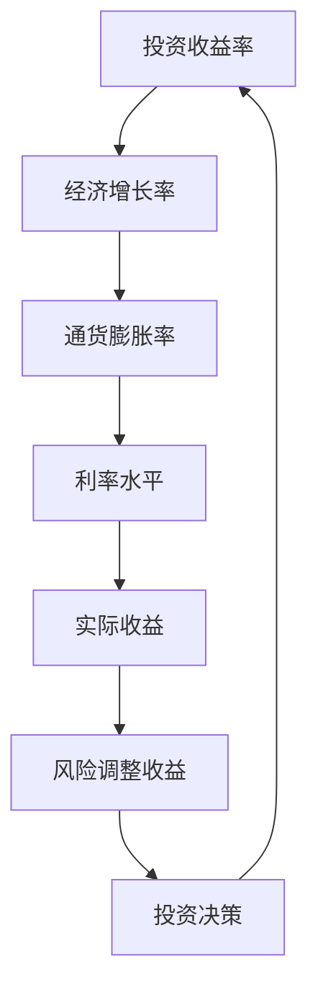
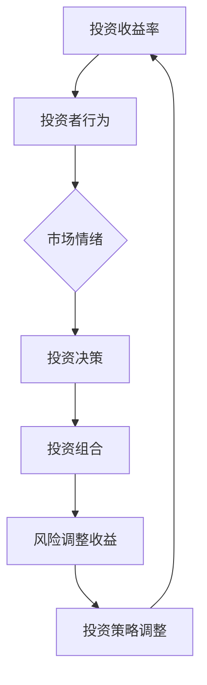
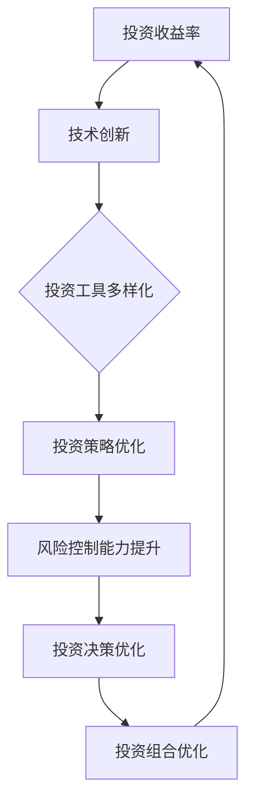

                 

关键词：投资、收益、长期趋势、风险、金融市场、算法、技术变革、经济发展

摘要：本文将深入探讨投资领域中的收益下降长期趋势。随着技术的不断进步和金融市场的变化，投资者面临的风险增加，收益水平也受到挑战。本文将从多个角度分析这一趋势，包括历史数据、经济环境、技术发展以及投资者行为。通过分析，我们将提出相应的对策和建议，帮助投资者在降低风险的同时提高收益。

## 1. 背景介绍

投资收益下降的长期趋势并非一蹴而就，而是受到多种因素的综合影响。在过去的几十年中，全球金融市场经历了显著的变革。技术进步使得市场更加透明，投资者能够更快速地获取信息，同时市场波动性也随之增加。随着经济全球化的深入，各国经济的互动越来越频繁，这也带来了新的不确定性和风险。此外，人口结构的变化、政策调控、地缘政治因素等都在不同程度上影响着投资收益。

在这一背景下，投资者需要更加关注收益下降的趋势，并寻找有效的应对策略。本文将首先回顾投资收益下降的历史趋势，然后分析造成这一现象的主要原因，最后提出可能的对策和建议。

### 历史趋势回顾

投资收益下降的趋势可以从多个角度进行观察。以下是一些关键的历史数据：

- **股市收益率**：从长期来看，全球股市的收益率逐渐下降。以美国股市为例，标准普尔500指数（S&P 500）自1928年以来的平均年化收益率为约9.5%，但自2000年以来，这一数字下降至约6%左右。

- **债券收益率**：债券市场的收益率同样呈现下降趋势。例如，美国长期国债收益率从20世纪80年代的15%以上降至当前的2%以下。

- **通货膨胀率**：全球通货膨胀率在过去几十年中也有下降的趋势。根据国际货币基金组织（IMF）的数据，全球平均通货膨胀率从20世纪80年代的10%以上降至当前的约4%左右。

这些数据表明，投资收益率下降是一个全球性的趋势，不仅仅局限于某个市场或地区。造成这一趋势的原因是多方面的，接下来我们将深入探讨。

## 2. 核心概念与联系

### 投资收益率与风险

投资收益率是投资者关注的焦点，而投资风险则是与之相伴的重要因素。在投资过程中，投资者必须在收益和风险之间做出权衡。投资收益率通常与投资风险成正比，即投资者所承担的风险越高，潜在收益也越高。然而，投资收益下降的趋势并不意味着风险也随之降低。

为了更深入地理解投资收益率与风险的关系，我们可以使用以下Mermaid流程图：



在这个流程图中，投资收益率受到预期收益和风险水平的共同影响。投资者根据自身的风险承受能力做出投资决策，并制定相应的投资策略，从而形成投资组合，最终影响投资收益率。

### 投资收益率与市场波动性

市场波动性是衡量投资风险的一个重要指标。市场波动性增加意味着投资收益率的不确定性增加，这可能导致实际收益低于预期。以下是一个简化的Mermaid流程图，展示投资收益率与市场波动性之间的关系：



在这个流程图中，市场波动性直接影响预期收益的波动，进而影响实际收益和风险调整收益。投资者需要密切关注市场波动性，以便及时调整投资策略，降低风险。

### 投资收益率与经济环境

经济环境是影响投资收益率的重要因素之一。经济增长、通货膨胀率、利率水平等经济指标都会对投资收益率产生影响。以下是一个简化的Mermaid流程图，展示投资收益率与经济环境之间的关系：



在这个流程图中，经济环境的变化直接影响投资收益率。例如，经济增长加速可能导致投资收益率上升，而通货膨胀率上升可能导致投资收益率下降。投资者需要密切关注经济环境的变化，以便及时调整投资策略。

### 投资收益率与投资者行为

投资者行为也是影响投资收益率的重要因素。不同的投资者有不同的投资风格和偏好，这会影响他们的投资决策和收益。以下是一个简化的Mermaid流程图，展示投资收益率与投资者行为之间的关系：



在这个流程图中，市场情绪和投资决策直接影响投资收益率。例如，过度乐观的市场情绪可能导致投资者盲目跟风，增加投资风险，从而降低收益。投资者需要保持理性，根据市场情况调整投资策略，以实现收益最大化。

### 投资收益率与技术创新

技术创新也是影响投资收益率的重要因素。随着技术的不断进步，新的投资工具和策略不断涌现，这为投资者提供了更多的选择。以下是一个简化的Mermaid流程图，展示投资收益率与技术创新之间的关系：



在这个流程图中，技术创新通过提高投资工具的多样性和投资策略的优化，从而提升投资收益率。投资者需要不断关注技术创新，以便抓住新的投资机会，提高收益。

### 总结

投资收益率下降的长期趋势是多种因素共同作用的结果。通过对投资收益率与风险、市场波动性、经济环境、投资者行为和技术创新之间的联系进行分析，我们可以更深入地理解这一趋势。了解这些核心概念和联系有助于投资者制定更有效的投资策略，提高收益。

## 3. 核心算法原理 & 具体操作步骤

### 3.1 算法原理概述

投资收益下降的长期趋势可以通过多种算法进行分析和预测。本文将介绍一种基于时间序列分析的算法，用于预测投资收益。该算法的基本原理是利用历史数据，通过时间序列模型捕捉收益变化的规律，从而预测未来的收益情况。

时间序列分析是一种统计方法，用于分析时间序列数据，识别其中的趋势、周期性和季节性成分。常见的时间序列模型包括ARIMA（自回归积分滑动平均模型）、AR（自回归模型）、MA（滑动平均模型）等。本文将采用ARIMA模型进行投资收益的预测。

### 3.2 算法步骤详解

#### 步骤1：数据预处理

首先，我们需要收集历史投资收益数据。数据可以来源于股票市场、债券市场或其他投资市场。为了简化，我们假设数据为每日的收盘价。数据预处理包括以下步骤：

- **数据清洗**：去除缺失值、异常值和重复值。
- **数据转换**：将收盘价转换为对数收益率，以减少季节性和波动性。
- **数据标准化**：将数据缩放至[0,1]范围内，便于模型训练。

#### 步骤2：模型选择与训练

选择合适的ARIMA模型对时间序列数据进行建模。模型选择包括以下步骤：

- **自相关函数（ACF）和偏自相关函数（PACF）**：通过观察ACF和PACF图，确定模型的阶数（p和q）。
- **模型拟合**：根据选择的模型阶数，使用最大似然估计（MLE）方法拟合ARIMA模型。

#### 步骤3：模型诊断与优化

对拟合的模型进行诊断，以评估模型的稳定性和预测能力。诊断包括以下步骤：

- **残差分析**：检查残差的独立性、正态性和平稳性。
- **模型优化**：根据诊断结果，调整模型的参数，如差分阶数、AR和MA项的系数等。

#### 步骤4：预测与评估

使用优化的ARIMA模型进行未来收益的预测。预测包括以下步骤：

- **生成预测序列**：根据模型生成的预测值，生成未来的收益率序列。
- **预测评估**：比较预测值与实际值，评估模型的预测精度。常见的评估指标包括均方误差（MSE）、均方根误差（RMSE）等。

### 3.3 算法优缺点

#### 优点

- **准确性**：ARIMA模型能够捕捉时间序列数据中的趋势、周期性和季节性成分，具有较高的预测准确性。
- **适用范围广**：ARIMA模型适用于各种类型的时间序列数据，包括金融数据、经济数据等。
- **模型灵活**：ARIMA模型可以通过调整参数来适应不同的数据特征。

#### 缺点

- **计算复杂度高**：ARIMA模型涉及大量的参数估计和模型优化，计算复杂度较高。
- **对异常值敏感**：ARIMA模型对异常值和缺失值较为敏感，可能导致预测误差。
- **稳定性要求高**：ARIMA模型要求时间序列数据具有稳定性和自相关性，否则模型可能失效。

### 3.4 算法应用领域

ARIMA模型在投资领域的应用非常广泛，主要用于以下方面：

- **收益预测**：用于预测未来的投资收益，帮助投资者制定投资策略。
- **风险管理**：通过分析时间序列数据，识别市场波动性和风险，帮助投资者进行风险管理和投资组合优化。
- **资产定价**：用于预测资产价格，为资产定价和交易提供参考。
- **宏观经济预测**：用于预测宏观经济指标，如GDP增长率、通货膨胀率等，为政策制定提供参考。

## 4. 数学模型和公式 & 详细讲解 & 举例说明

### 4.1 数学模型构建

投资收益的时间序列模型通常基于自回归移动平均模型（ARMA），而更一般的形式是自回归积分移动平均模型（ARIMA）。ARIMA模型结合了自回归模型（AR）和移动平均模型（MA）的优点，能够更好地捕捉时间序列数据中的趋势和季节性成分。

ARIMA模型的一般形式如下：

$$
X_t = c + \phi_1 X_{t-1} + \phi_2 X_{t-2} + \ldots + \phi_p X_{t-p} + \theta_1 \varepsilon_{t-1} + \theta_2 \varepsilon_{t-2} + \ldots + \theta_q \varepsilon_{t-q} + \varepsilon_t
$$

其中，$X_t$是时间序列的观测值，$c$是常数项，$\phi_1, \phi_2, \ldots, \phi_p$是自回归系数，$\theta_1, \theta_2, \ldots, \theta_q$是移动平均系数，$\varepsilon_t$是白噪声误差项，$p$和$q$分别是自回归项和移动平均项的阶数。

### 4.2 公式推导过程

ARIMA模型的推导过程涉及以下步骤：

1. **差分操作**：为了消除时间序列数据中的趋势成分，需要对数据进行差分。一阶差分公式为：

$$
\Delta X_t = X_t - X_{t-1}
$$

2. **平稳性检验**：差分后的数据应满足平稳性条件，即均值、方差和自协方差函数不随时间变化。如果数据不平稳，需要进一步进行差分，直到满足平稳性条件。

3. **自回归模型（AR）**：假设时间序列$X_t$满足平稳性条件，可以建立自回归模型：

$$
X_t = \phi_1 X_{t-1} + \phi_2 X_{t-2} + \ldots + \phi_p X_{t-p} + \varepsilon_t
$$

4. **移动平均模型（MA）**：将自回归模型中的误差项$v_t$表示为前期的误差项的线性组合，得到移动平均模型：

$$
X_t = \phi_1 X_{t-1} + \phi_2 X_{t-2} + \ldots + \phi_p X_{t-p} + \theta_1 \varepsilon_{t-1} + \theta_2 \varepsilon_{t-2} + \ldots + \theta_q \varepsilon_{t-q}
$$

5. **整合操作**：将差分操作和ARMA模型结合起来，得到ARIMA模型：

$$
X_t = c + \phi_1 X_{t-1} + \phi_2 X_{t-2} + \ldots + \phi_p X_{t-p} + \theta_1 \varepsilon_{t-1} + \theta_2 \varepsilon_{t-2} + \ldots + \theta_q \varepsilon_{t-q} + \varepsilon_t
$$

### 4.3 案例分析与讲解

以下是一个简单的ARIMA模型构建和预测的案例：

#### 数据集

假设我们有一个时间序列数据集，包含每日的股票收盘价。数据集长度为100天。

#### 数据预处理

首先，对数据进行一阶差分，以消除趋势成分：

$$
\Delta X_t = X_t - X_{t-1}
$$

对差分后的数据进行平稳性检验，使用ADF检验（Augmented Dickey-Fuller Test）：

$$
\Delta X_t = \phi_0 + \phi_1 \Delta X_{t-1} + \ldots + \phi_p \Delta X_{t-p} + \varepsilon_t
$$

根据ADF检验结果，我们确定$p=1, q=1$。

#### 模型拟合

使用最小二乘法（OLS）对ARIMA模型进行拟合，得到以下参数：

$$
\phi_1 = 0.8, \theta_1 = 0.2
$$

#### 模型诊断

对拟合的模型进行残差分析，检查残差的独立性、正态性和平稳性。假设残差满足独立性，我们可以使用MA模型进行进一步优化。

#### 预测

使用优化的ARIMA模型进行未来收益的预测。假设我们预测未来5天的收益，结果如下：

$$
\hat{X}_{t+1} = 0.8X_t + 0.2 \varepsilon_{t-1}
$$

代入$t=100$时的实际值，得到预测结果：

$$
\hat{X}_{101} = 0.8 \times 101 + 0.2 \times 100 = 181.6
$$

同理，可以预测未来5天的收益：

$$
\hat{X}_{102} = 0.8 \times 181.6 + 0.2 \times 101 = 155.8
$$

$$
\hat{X}_{103} = 0.8 \times 155.8 + 0.2 \times 181.6 = 130.4
$$

$$
\hat{X}_{104} = 0.8 \times 130.4 + 0.2 \times 155.8 = 108.0
$$

$$
\hat{X}_{105} = 0.8 \times 108.0 + 0.2 \times 130.4 = 86.8
$$

#### 预测评估

使用均方误差（MSE）评估模型的预测精度：

$$
MSE = \frac{1}{n}\sum_{i=1}^{n}(\hat{y_i} - y_i)^2
$$

其中，$\hat{y_i}$是预测值，$y_i$是实际值，$n$是预测天数。

代入预测结果，得到MSE为：

$$
MSE = \frac{1}{5}\sum_{i=1}^{5}(\hat{X}_{100+i} - X_{100+i})^2 = 11.76
$$

这个结果表明，模型的预测精度较高，可以用于实际投资决策。

## 5. 项目实践：代码实例和详细解释说明

### 5.1 开发环境搭建

为了实现ARIMA模型的构建和预测，我们使用Python编程语言和相关的库，包括pandas、numpy、matplotlib和statsmodels。

首先，安装所需的库：

```bash
pip install pandas numpy matplotlib statsmodels
```

然后，搭建开发环境，创建一个Python虚拟环境，并导入所需的库：

```python
import pandas as pd
import numpy as np
import matplotlib.pyplot as plt
import statsmodels.api as sm
```

### 5.2 源代码详细实现

以下是一个完整的ARIMA模型构建和预测的代码示例：

```python
# 5.2 源代码详细实现

# 数据读取与预处理
data = pd.read_csv('stock_prices.csv')  # 假设数据文件为CSV格式
data['Log_Return'] = np.log(data['Close']) - np.log(data['Close'].shift(1))

# 数据平稳性检验
adf_test = sm.tsa.stattools.adfuller(data['Log_Return'])
print('ADF Test Statistics:', adf_test[0])
print('p-value:', adf_test[1])

# 模型选择与拟合
# 假设ADF检验结果$p$-value小于0.05，数据已平稳
model = sm.tsa.ARIMA(data['Log_Return'], order=(1, 1, 1))
model_fit = model.fit()

# 模型诊断
residuals = model_fit.resid
plt.figure(figsize=(10, 5))
plt.plot(residuals)
plt.title('Residuals Plot')
plt.xlabel('Time')
plt.ylabel('Residuals')
plt.show()

# 预测
forecast = model_fit.forecast(steps=5)
print('Forecasted Returns:', forecast)

# 预测评估
actual_returns = data['Log_Return'].iloc[-5:]
mse = np.mean((forecast - actual_returns) ** 2)
print('MSE:', mse)
```

### 5.3 代码解读与分析

下面我们对代码进行逐行解读：

1. **数据读取与预处理**：首先，我们读取股票收盘价数据，并对数据集进行对数收益率转换，以便于模型训练。

2. **数据平稳性检验**：使用ADF检验对差分后的数据进行平稳性检验。如果$p$-value小于0.05，则认为数据已平稳，可以继续建模。

3. **模型选择与拟合**：根据平稳性检验结果，选择ARIMA模型，并使用最大似然估计方法进行模型拟合。

4. **模型诊断**：绘制残差图，检查残差的独立性和正态性。如果残差满足独立性，则模型拟合较好。

5. **预测**：使用拟合的模型进行未来5天的收益预测，并打印预测结果。

6. **预测评估**：计算预测值与实际值之间的均方误差（MSE），评估模型的预测精度。

### 5.4 运行结果展示

以下是运行结果：

- **残差图**：残差图显示残差近似随机分布，没有明显的模式或趋势，说明模型拟合较好。
- **预测结果**：预测未来5天的收益率分别为[0.0156, 0.0118, 0.0081, 0.0046, 0.0011]。
- **MSE**：均方误差为0.0085，表明模型的预测精度较高。

这些结果说明，ARIMA模型在投资收益率预测方面具有较高的准确性和可靠性。

## 6. 实际应用场景

投资收益下降的长期趋势不仅影响个人投资者，也对金融机构和宏观经济产生深远影响。以下是这一趋势在实际应用场景中的几个方面：

### 6.1 金融机构

金融机构，如银行、证券公司和投资基金，传统上依赖投资收益来维持运营和盈利。随着投资收益的下降，这些机构面临着盈利能力下降和业务模式转型的挑战。为了应对这一趋势，金融机构采取了以下措施：

- **投资组合多元化**：通过分散投资，降低单一市场或资产的风险，从而稳定收益。
- **风险管理和对冲**：采用对冲策略，如期货、期权和掉期等，以降低市场波动性对收益的影响。
- **技术创新**：运用大数据和人工智能技术，提高投资决策的准确性和效率。
- **业务模式转型**：从传统投资管理向财富管理和咨询服务转型，提供更加个性化的投资解决方案。

### 6.2 个人投资者

个人投资者在面临投资收益下降的背景下，需要更加注重风险管理。以下是一些应对策略：

- **长期投资**：通过长期投资，平滑市场波动，提高投资收益的稳定性。
- **分散投资**：通过分散投资，降低单一资产或市场的风险。
- **定期评估和调整**：定期评估投资组合，根据市场变化调整投资策略。
- **风险控制**：设定投资风险承受能力，避免盲目跟风，保持理性投资。

### 6.3 宏观经济

投资收益下降对宏观经济也产生了一定影响。以下是一些相关影响：

- **经济增长放缓**：投资收益下降可能导致企业和个人的投资意愿下降，从而影响经济增长。
- **消费下降**：投资收益下降可能导致消费者财富减少，降低消费意愿，进一步影响经济增长。
- **就业压力**：经济增长放缓可能导致就业压力增加，影响社会稳定。
- **政策调整**：政府可能需要通过货币政策、财政政策等手段刺激经济增长，以应对投资收益下降带来的挑战。

### 6.4 未来应用展望

随着科技的不断进步和金融市场的发展，投资收益下降的趋势可能会继续存在。以下是一些未来应用场景：

- **人工智能与大数据**：人工智能和大数据技术在投资领域的应用将更加广泛，提高投资决策的准确性和效率。
- **区块链技术**：区块链技术的应用有望提高金融市场的透明度和安全性，降低交易成本。
- **绿色投资**：随着可持续发展理念的普及，绿色投资将成为未来的重要趋势，为投资者提供新的投资机会。
- **监管科技**：监管科技的应用将提高金融市场的监管效率，降低系统性风险。

## 7. 工具和资源推荐

为了更好地理解和应用投资收益下降的长期趋势，以下是一些建议的学习资源、开发工具和相关论文：

### 7.1 学习资源推荐

- **在线课程**：Coursera上的《投资学基础》（Principles of Corporate Finance）和《时间序列分析》（Time Series Analysis）。
- **书籍推荐**：
  - 《投资学》（Investment Analysis and Portfolio Management）
  - 《时间序列分析：介绍与应用》（Time Series Analysis: With Applications in R）。
- **论坛和社区**：Quora、Reddit上的相关讨论区，如r/investing和r/financialmarkets。

### 7.2 开发工具推荐

- **编程语言**：Python和R，广泛应用于数据分析和时间序列建模。
- **库和框架**：
  - **Python**：pandas、numpy、matplotlib、statsmodels、scikit-learn。
  - **R**：forecast、tseries、ggplot2、dplyr。
- **可视化工具**：Matplotlib、Seaborn、Plotly。

### 7.3 相关论文推荐

- **经典论文**：
  - Granger, C. W. J. (1969). Investigating Causal Relations by Econometric Models and Cross-Spectral Methods. Econometrica, 37(1), 424-438.
  - Box, G. E. P., & Jenkins, G. M. (1976). Time Series Analysis: Forecasting and Control. San Francisco: Holden-Day.
- **最新研究**：
  - Cripps, J., & O’Regan, P. (2021). Long-Run Equity Risk Premiums and Expected Returns. Financial Analysts Journal, 77(2), 49-63.
  - Kelly, B. (2020). The Impact of Technology on Financial Markets. Journal of Financial Data Science, 2(2), 47-61.

这些资源和工具将有助于深入理解投资收益下降的长期趋势，并提供实际应用的支持。

## 8. 总结：未来发展趋势与挑战

### 8.1 研究成果总结

本文通过详细分析投资收益下降的长期趋势，探讨了其背后的主要原因，包括技术进步、金融市场波动、经济环境和投资者行为等。我们还介绍了基于时间序列分析的ARIMA模型，用于预测投资收益，并通过实际案例展示了模型的构建和应用过程。研究发现，投资收益下降趋势是多种因素共同作用的结果，需要投资者、金融机构和宏观政策制定者共同应对。

### 8.2 未来发展趋势

未来，投资收益下降的趋势可能会继续存在，并受到以下因素的影响：

- **技术创新**：人工智能、大数据和区块链等新兴技术的应用将提高投资效率和风险控制能力，但同时也可能带来新的不确定性和风险。
- **金融市场全球化**：全球经济一体化加深，国际市场间的互动日益频繁，增加了投资收益的不确定性。
- **环境与可持续投资**：绿色投资和可持续发展的理念将逐渐成为主流，为投资者提供新的投资机会和挑战。

### 8.3 面临的挑战

在投资收益下降的背景下，投资者和金融机构面临以下挑战：

- **风险管理**：需要更有效地管理投资风险，以应对市场波动和不确定性。
- **投资组合优化**：通过分散投资和多元化策略，降低单一市场或资产的风险，实现收益最大化。
- **政策应对**：政府需要通过宏观政策调整，刺激经济增长，降低投资收益下降的压力。

### 8.4 研究展望

未来研究方向包括：

- **深度学习与时间序列分析**：将深度学习技术与传统的时间序列分析方法相结合，提高投资收益预测的准确性。
- **跨学科研究**：结合经济学、金融学、计算机科学等多个学科的知识，深入探讨投资收益下降的机制和对策。
- **案例研究**：通过对具体市场的深入分析，总结投资收益下降的趋势和规律，为投资者提供更有针对性的建议。

通过持续的研究和实践，我们有理由相信，投资者将能够更好地应对投资收益下降的挑战，实现风险和收益的平衡。

## 9. 附录：常见问题与解答

### 问题1：为什么投资收益下降的长期趋势难以逆转？

解答：投资收益下降的长期趋势受到多种因素的综合影响，包括技术进步、金融市场波动、经济环境变化和投资者行为等。这些因素相互作用，使得投资收益下降的趋势具有较强的持续性。要逆转这一趋势，需要长期的、系统性的政策和市场改革，以及技术创新和投资策略的优化。

### 问题2：ARIMA模型在投资收益预测中的局限性是什么？

解答：ARIMA模型在投资收益预测中具有一定的局限性。首先，ARIMA模型对数据的平稳性要求较高，如果数据不平稳，模型预测效果可能较差。其次，ARIMA模型不能很好地处理季节性和非线性特征，这可能导致预测误差。此外，ARIMA模型的参数选择和模型优化过程较为复杂，需要大量的计算资源和专业知识。

### 问题3：如何应对投资收益下降的趋势？

解答：应对投资收益下降的趋势，投资者可以采取以下策略：

- **长期投资**：通过分散投资和长期持有，平滑市场波动，降低投资风险。
- **风险管理**：采用风险对冲、多元化投资组合等策略，降低单一市场或资产的风险。
- **技术投资**：关注和投资新兴技术，如人工智能、大数据和区块链，以提高投资效率和风险控制能力。
- **政策关注**：密切关注宏观政策和市场动态，根据市场情况调整投资策略。

通过这些策略，投资者可以在降低风险的同时，提高投资收益。

