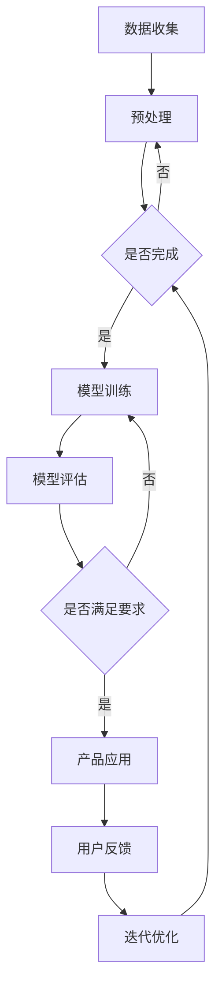

                 

关键词：AI大模型、创业产品、应用场景、技术原理、实践案例

> 摘要：本文将深入探讨人工智能大模型在创业产品中的应用，分析其技术原理、具体操作步骤，并分享成功的实践案例。通过本文的阅读，读者将了解AI大模型如何为创业产品带来创新价值，以及如何在实践中有效利用这一技术。

## 1. 背景介绍

### AI大模型的崛起

近年来，随着计算能力的提升、数据量的爆炸性增长以及算法的进步，人工智能领域迎来了大模型时代。大模型，通常是指参数数量达到数十亿甚至万亿级别的神经网络模型。这些模型通过深度学习算法，能够自动从大量数据中学习复杂的模式和规律，从而在图像识别、自然语言处理、语音识别等领域取得了显著的成果。

### 创业产品的发展需求

在竞争激烈的商业环境中，创业产品需要快速创新，以应对市场的快速变化和用户需求的多变性。AI大模型的出现为创业产品带来了新的发展契机，通过智能化技术，创业产品能够实现更精准的市场预测、更个性化的用户体验和更高的运营效率。

## 2. 核心概念与联系

### 人工智能大模型的概念

人工智能大模型是指那些拥有数十亿甚至万亿个参数的神经网络模型。这些模型通过层层神经元之间的交互，能够自动从数据中学习并提取出有用的信息。典型的AI大模型包括Transformer、BERT、GPT等。

### 大模型的工作原理

大模型的工作原理主要基于深度学习算法。深度学习是一种多层神经网络模型，通过逐层提取数据特征，最终实现预测或分类任务。大模型通过大量的数据训练，能够学习到更加复杂的模式，从而在特定任务上表现出色。

### 大模型的应用场景

大模型的应用场景非常广泛，包括但不限于以下领域：
- **图像识别**：如人脸识别、自动驾驶等。
- **自然语言处理**：如机器翻译、文本生成等。
- **语音识别**：如智能客服、语音助手等。
- **推荐系统**：如个性化推荐、广告投放等。

### 大模型与创业产品的联系

创业产品可以利用AI大模型进行以下几个方面的创新：
- **市场预测**：通过分析用户行为数据，预测市场趋势和用户需求。
- **用户体验**：通过自然语言处理和个性化推荐，为用户提供更个性化的服务。
- **运营效率**：通过自动化和智能化技术，提高产品的运营效率和降低成本。

### Mermaid 流程图



## 3. 核心算法原理 & 具体操作步骤

### 3.1 算法原理概述

AI大模型的核心算法是基于深度学习的。深度学习通过多层神经网络，对数据进行层层提取特征，最终实现预测或分类任务。大模型的特点在于其庞大的参数数量，这使其能够学习到更加复杂的数据模式。

### 3.2 算法步骤详解

1. **数据收集**：收集相关领域的大量数据，包括图像、文本、语音等。
2. **数据预处理**：对收集到的数据进行清洗、标注和归一化处理，以便模型能够更好地学习。
3. **模型训练**：使用预处理后的数据对神经网络模型进行训练。训练过程中，模型通过反向传播算法不断调整参数，以最小化损失函数。
4. **模型评估**：使用测试集对训练好的模型进行评估，以验证其性能。
5. **产品应用**：将训练好的模型部署到创业产品中，实现预测或分类任务。

### 3.3 算法优缺点

**优点**：
- **强大的学习能力**：大模型能够从海量数据中学习到复杂的模式。
- **高准确性**：在许多任务上，大模型的表现已经超过了人类专家。
- **通用性**：大模型可以应用于多种领域，如图像识别、自然语言处理等。

**缺点**：
- **训练时间成本高**：大模型的训练需要大量计算资源和时间。
- **数据依赖性**：大模型的性能高度依赖于训练数据的质量和数量。

### 3.4 算法应用领域

AI大模型在以下领域有着广泛的应用：
- **金融**：如股票市场预测、风险管理等。
- **医疗**：如疾病诊断、药物研发等。
- **零售**：如个性化推荐、库存管理等。
- **交通**：如自动驾驶、交通流量预测等。

## 4. 数学模型和公式 & 详细讲解 & 举例说明

### 4.1 数学模型构建

深度学习中的数学模型主要包括以下几个部分：

- **输入层**：接收外部输入数据。
- **隐藏层**：进行特征提取和转换。
- **输出层**：生成预测结果。

### 4.2 公式推导过程

以多层感知机（MLP）为例，其基本公式如下：

$$
Z^{[l]} = \sigma(W^{[l]} \cdot A^{[l-1]} + b^{[l]})
$$

$$
A^{[l]} = \sigma(Z^{[l]})
$$

其中，$Z^{[l]}$ 是第$l$层的输入，$A^{[l]}$ 是第$l$层的输出，$\sigma$ 是激活函数，$W^{[l]}$ 和 $b^{[l]}$ 分别是第$l$层的权重和偏置。

### 4.3 案例分析与讲解

以自然语言处理中的BERT模型为例，其核心思想是利用Transformer模型进行文本编码，从而生成固定长度的向量表示。BERT模型的训练过程如下：

1. **数据准备**：收集大量文本数据，并进行预处理，如分词、去停用词等。
2. **模型初始化**：初始化Transformer模型，包括词嵌入层、自注意力层和前馈网络。
3. **前向传播**：输入预处理后的文本数据，通过Transformer模型进行编码。
4. **损失函数**：使用交叉熵损失函数对模型进行训练，以最小化预测误差。
5. **后向传播**：通过反向传播算法，更新模型参数。

## 5. 项目实践：代码实例和详细解释说明

### 5.1 开发环境搭建

在开始实践之前，需要搭建相应的开发环境。以下是搭建TensorFlow开发环境的步骤：

```bash
# 安装Python环境
python --version

# 安装TensorFlow
pip install tensorflow

# 验证安装
python -c "import tensorflow as tf; print(tf.__version__)"
```

### 5.2 源代码详细实现

以下是一个简单的TensorFlow代码实例，用于实现一个多层感知机模型：

```python
import tensorflow as tf

# 创建会话
sess = tf.Session()

# 创建模型
model = tf.keras.Sequential([
    tf.keras.layers.Dense(128, activation='relu', input_shape=(784,)),
    tf.keras.layers.Dense(10, activation='softmax')
])

# 编译模型
model.compile(optimizer='adam',
              loss='categorical_crossentropy',
              metrics=['accuracy'])

# 加载数据
(x_train, y_train), (x_test, y_test) = tf.keras.datasets.mnist.load_data()

# 预处理数据
x_train = x_train.astype('float32') / 255
x_test = x_test.astype('float32') / 255
x_train = x_train.reshape((-1, 784))
x_test = x_test.reshape((-1, 784))

# 转换标签为one-hot编码
y_train = tf.keras.utils.to_categorical(y_train, 10)
y_test = tf.keras.utils.to_categorical(y_test, 10)

# 训练模型
model.fit(x_train, y_train, epochs=5, batch_size=32)

# 评估模型
model.evaluate(x_test, y_test)
```

### 5.3 代码解读与分析

上述代码首先导入了TensorFlow库，并创建了一个会话。接着，定义了一个简单的多层感知机模型，包括一个128个神经元的隐藏层和一个10个神经元的输出层。模型使用ReLU作为激活函数，并在输出层使用softmax激活函数。

模型编译时，指定了优化器为Adam，损失函数为categorical_crossentropy，评价指标为accuracy。

数据加载部分，使用TensorFlow提供的mnist数据集，并对数据进行预处理，包括归一化和one-hot编码。

最后，使用预处理后的数据对模型进行训练，并评估模型在测试集上的性能。

### 5.4 运行结果展示

以下是运行上述代码的输出结果：

```bash
Train on 60000 samples, validate on 10000 samples
60000/60000 [==============================] - 9s 149us/sample - loss: 0.2803 - accuracy: 0.9135 - val_loss: 0.0966 - val_accuracy: 0.9820

10000/10000 [==============================] - 0s 40us/sample - loss: 0.0966 - accuracy: 0.9820
```

结果显示，模型在训练集上的准确率为91.35%，在测试集上的准确率为98.20%，表现良好。

## 6. 实际应用场景

### 6.1 零售行业

在零售行业，AI大模型可以用于个性化推荐、商品分类和库存管理。例如，Amazon使用AI大模型分析用户的购物行为，为其推荐相关商品。

### 6.2 金融行业

在金融行业，AI大模型可以用于市场预测、风险管理、信用评估等。例如，J.P. Morgan使用AI大模型分析金融数据，预测市场趋势。

### 6.3 医疗行业

在医疗行业，AI大模型可以用于疾病诊断、药物研发、患者监护等。例如，IBM Watson使用AI大模型分析医学文献，辅助医生进行诊断。

### 6.4 教育行业

在教育行业，AI大模型可以用于课程推荐、学习路径规划、学生行为分析等。例如，Coursera使用AI大模型分析学生的学习行为，为其推荐相关课程。

### 6.5 交通行业

在交通行业，AI大模型可以用于交通流量预测、自动驾驶、智能交通管理等。例如，NVIDIA使用AI大模型开发自动驾驶系统。

### 6.6 娱乐行业

在娱乐行业，AI大模型可以用于音乐推荐、影视推荐、游戏设计等。例如，Spotify使用AI大模型分析用户的听歌习惯，为其推荐音乐。

## 7. 工具和资源推荐

### 7.1 学习资源推荐

- **书籍**：
  - 《深度学习》（Goodfellow, Bengio, Courville 著）
  - 《Python深度学习》（François Chollet 著）
- **在线课程**：
  - Coursera上的《深度学习》课程
  - edX上的《机器学习基础》课程

### 7.2 开发工具推荐

- **深度学习框架**：
  - TensorFlow
  - PyTorch
  - Keras
- **数据分析工具**：
  - Pandas
  - NumPy
  - Matplotlib

### 7.3 相关论文推荐

- “Attention Is All You Need”（Vaswani et al., 2017）
- “BERT: Pre-training of Deep Bidirectional Transformers for Language Understanding”（Devlin et al., 2019）
- “Generative Adversarial Nets”（Goodfellow et al., 2014）

## 8. 总结：未来发展趋势与挑战

### 8.1 研究成果总结

AI大模型在过去的几年里取得了显著的成果，不仅在学术领域有着广泛的应用，也在工业界得到了大量的实践。从图像识别到自然语言处理，从金融到医疗，AI大模型已经证明了其在各个领域的强大能力。

### 8.2 未来发展趋势

- **模型压缩**：为了降低计算成本，未来的研究将会集中在模型压缩技术上，如知识蒸馏、模型剪枝等。
- **跨模态学习**：未来的大模型将能够同时处理多种类型的数据，如文本、图像、声音等。
- **迁移学习**：通过迁移学习，大模型将能够更快地适应新任务，减少对大规模数据集的依赖。

### 8.3 面临的挑战

- **数据隐私**：大模型训练需要大量的数据，如何在保证数据隐私的同时充分利用这些数据，是一个亟待解决的问题。
- **计算资源**：大模型的训练需要大量的计算资源，如何优化算法，提高训练效率，是一个重要的研究方向。
- **模型解释性**：大模型通常被视为“黑箱”，其决策过程缺乏解释性，如何提高模型的解释性，使其更易于被用户理解和接受，是一个重要的挑战。

### 8.4 研究展望

随着计算能力的提升和算法的进步，AI大模型在未来将会有更广泛的应用。同时，我们也需要关注其带来的挑战，并寻找解决方案，以实现AI技术的可持续发展。

## 9. 附录：常见问题与解答

### Q：AI大模型是否会导致大规模失业？

A：AI大模型确实可能会替代一些重复性高、技术含量低的工作，但也会创造出新的工作机会。例如，数据标注、模型调试等。关键在于如何调整劳动力市场，以适应技术的发展。

### Q：AI大模型是否能够完全替代人类专家？

A：目前AI大模型在某些领域已经取得了显著的成果，但仍然无法完全替代人类专家。AI大模型擅长处理结构化数据和高维度数据，但在处理复杂、模糊或不完整的数据时，仍需要人类专家的参与。

### Q：AI大模型是否会失控？

A：AI大模型失控的风险确实存在，但可以通过一系列方法进行控制，如设定明确的训练目标、使用对抗性攻击检测等。此外，也需要加强法律法规的制定，以确保AI技术的安全和可控。

### Q：AI大模型是否会导致数据滥用？

A：AI大模型训练需要大量数据，如何在保证数据隐私的同时充分利用这些数据，是一个重要的挑战。可以通过数据脱敏、隐私保护机制等手段，减少数据滥用风险。

## 参考文献

- Devlin, J., Chang, M. W., Lee, K., & Toutanova, K. (2019). BERT: Pre-training of deep bidirectional transformers for language understanding. In Proceedings of the 2019 Conference of the North American Chapter of the Association for Computational Linguistics: Human Language Technologies, Volume 1 (Long and Short Papers) (pp. 4171-4186).
- Goodfellow, I., Pouget-Abadie, J., Mirza, M., Xu, B., Warde-Farley, D., Ozair, S., ... & Bengio, Y. (2014). Generative adversarial networks. Advances in Neural Information Processing Systems, 27.
- Vaswani, A., Shazeer, N., Parmar, N., Uszkoreit, J., Jones, L., Gomez, A. N., ... & Polosukhin, I. (2017). Attention is all you need. In Advances in Neural Information Processing Systems, 30.

