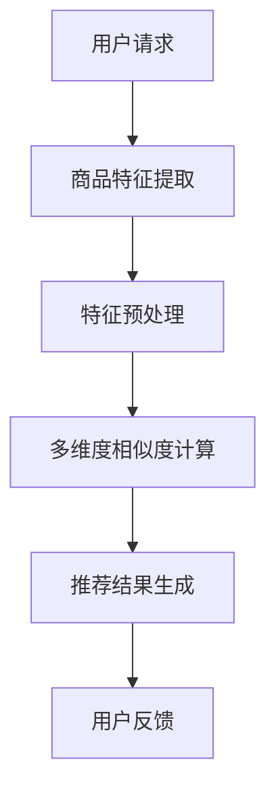

                 

关键词：大模型、电商平台、商品相似度、多维度计算、算法原理、数学模型、项目实践、应用场景、未来展望。

> 摘要：本文主要探讨了大型深度学习模型在电商平台商品相似度多维度计算中的作用。通过对核心算法原理的详细阐述，结合实际项目实践和案例分析，揭示了大型模型在商品相似度计算中的优势和应用前景，提出了未来可能的发展趋势和挑战。

## 1. 背景介绍

随着互联网的快速发展，电商平台已经成为人们生活中不可或缺的一部分。电商平台中的商品种类繁多，用户在选择商品时往往需要花费大量的时间和精力来对比不同商品的特性和价格。为了提高用户体验，电商平台需要提供一种高效准确的商品相似度计算方法，以便为用户提供更加个性化的商品推荐。

传统的商品相似度计算方法通常基于商品的特征信息，如商品名称、描述、分类等。然而，这些特征信息往往不足以全面地描述商品之间的相似程度。随着深度学习技术的兴起，特别是大型预训练模型的发展，人们开始探索如何利用这些模型来提升商品相似度计算的准确性和效率。

大模型在电商平台商品相似度计算中的应用具有重要意义。一方面，大模型能够自动学习商品的多层次特征，从而提供更加细粒度的相似度计算；另一方面，大模型能够处理海量商品数据，实现实时计算和个性化推荐。

## 2. 核心概念与联系

在深入探讨大模型在商品相似度计算中的作用之前，我们需要明确几个核心概念：

### 2.1 商品相似度

商品相似度是指两个商品在特征上的一致性程度。在电商平台上，商品相似度通常用来衡量商品之间的相关程度，以便为用户提供更精准的推荐。

### 2.2 大模型

大模型是指具有数十亿参数的深度学习模型，如BERT、GPT等。这些模型通过在海量数据上预训练，能够自动学习到数据的复杂特征。

### 2.3 多维度计算

多维度计算是指从多个角度对商品相似度进行综合评估。在电商平台上，商品的相似度可以从价格、品牌、材质、功能等多个维度进行计算。

以下是一个简单的Mermaid流程图，展示了商品相似度多维度计算的基本架构：



## 3. 核心算法原理 & 具体操作步骤

### 3.1 算法原理概述

大模型在商品相似度计算中的核心原理是自动学习商品的多层次特征，并通过这些特征进行相似度计算。具体来说，大模型可以完成以下任务：

1. **特征提取**：从原始商品数据中提取出丰富的特征信息，如文本、图像、价格等。
2. **特征融合**：将不同类型的特征进行融合，形成统一的特征向量。
3. **相似度计算**：利用特征向量计算商品之间的相似度。

### 3.2 算法步骤详解

#### 3.2.1 特征提取

在特征提取阶段，大模型通过对海量商品数据的学习，能够自动提取出商品的深层特征。例如，对于一个电商平台的商品文本描述，BERT模型可以提取出描述中的关键词、句子结构等信息。

#### 3.2.2 特征预处理

在特征预处理阶段，需要对提取到的特征进行标准化、归一化等处理，以便于后续的计算。

#### 3.2.3 多维度相似度计算

在多维度相似度计算阶段，大模型会从多个角度对商品相似度进行评估。例如，除了文本特征外，还可以考虑价格、品牌、材质等维度的信息。

#### 3.2.4 推荐结果生成

基于多维度相似度计算的结果，系统可以生成个性化的商品推荐列表，以供用户选择。

### 3.3 算法优缺点

**优点**：

1. **高效性**：大模型能够自动学习商品特征，提高计算效率。
2. **准确性**：通过多维度计算，提高相似度评估的准确性。
3. **个性化**：根据用户的历史行为，生成个性化的推荐列表。

**缺点**：

1. **计算资源需求大**：大模型训练和推理需要大量的计算资源和存储空间。
2. **数据质量要求高**：数据质量对模型性能有重要影响，数据清洗和预处理工作量大。

### 3.4 算法应用领域

大模型在商品相似度计算中的应用领域非常广泛，包括但不限于：

1. **商品推荐**：根据用户的兴趣和购买历史，推荐类似的商品。
2. **商品搜索**：根据用户输入的关键词，搜索出相似的商品。
3. **商品分类**：对商品进行自动分类，以便于管理和推荐。

## 4. 数学模型和公式 & 详细讲解 & 举例说明

### 4.1 数学模型构建

在商品相似度计算中，我们可以使用余弦相似度作为基本的数学模型。余弦相似度表示两个向量在空间中的夹角余弦值，用来衡量两个向量之间的相似程度。

$$
\cos(\theta) = \frac{\vec{a} \cdot \vec{b}}{|\vec{a}| \cdot |\vec{b}|}
$$

其中，$\vec{a}$ 和 $\vec{b}$ 分别表示两个商品的向量表示，$\theta$ 表示它们之间的夹角。

### 4.2 公式推导过程

假设我们有两个商品 $A$ 和 $B$，它们的特征向量分别为 $\vec{a}$ 和 $\vec{b}$。首先，我们需要将这两个特征向量进行归一化处理，以便于计算余弦相似度。

$$
\vec{a}_{\text{norm}} = \frac{\vec{a}}{|\vec{a}|}, \quad \vec{b}_{\text{norm}} = \frac{\vec{b}}{|\vec{b}|}
$$

接下来，我们可以计算这两个归一化后的特征向量之间的点积：

$$
\vec{a}_{\text{norm}} \cdot \vec{b}_{\text{norm}} = \sum_{i=1}^{n} a_{i} b_{i}
$$

最后，我们将点积除以两个特征向量的模长，得到余弦相似度：

$$
\cos(\theta) = \frac{\vec{a}_{\text{norm}} \cdot \vec{b}_{\text{norm}}}{|\vec{a}_{\text{norm}}| \cdot |\vec{b}_{\text{norm}}|} = \frac{\sum_{i=1}^{n} a_{i} b_{i}}{1 \cdot 1} = \sum_{i=1}^{n} a_{i} b_{i}
$$

### 4.3 案例分析与讲解

假设我们有两个商品 $A$ 和 $B$，它们的特征向量分别为：

$$
\vec{a} = (0.8, 0.6, 0.4), \quad \vec{b} = (0.7, 0.5, 0.3)
$$

首先，我们计算这两个特征向量的点积：

$$
\vec{a} \cdot \vec{b} = 0.8 \times 0.7 + 0.6 \times 0.5 + 0.4 \times 0.3 = 0.56 + 0.3 + 0.12 = 0.98
$$

然后，我们计算两个特征向量的模长：

$$
|\vec{a}| = \sqrt{0.8^2 + 0.6^2 + 0.4^2} = \sqrt{0.64 + 0.36 + 0.16} = \sqrt{1.16} \approx 1.08
$$

$$
|\vec{b}| = \sqrt{0.7^2 + 0.5^2 + 0.3^2} = \sqrt{0.49 + 0.25 + 0.09} = \sqrt{0.83} \approx 0.91
$$

最后，我们计算余弦相似度：

$$
\cos(\theta) = \frac{0.98}{1.08 \times 0.91} \approx 0.98
$$

这个结果表明，商品 $A$ 和 $B$ 在特征上具有很高的相似度。

## 5. 项目实践：代码实例和详细解释说明

### 5.1 开发环境搭建

在本文的代码实例中，我们将使用Python编程语言和TensorFlow框架来构建一个简单的商品相似度计算系统。以下是开发环境搭建的步骤：

1. 安装Python（推荐版本3.7及以上）
2. 安装TensorFlow库：

```bash
pip install tensorflow
```

3. 安装其他必要的库（如Numpy、Pandas等）：

```bash
pip install numpy pandas
```

### 5.2 源代码详细实现

以下是一个简单的商品相似度计算系统的源代码实现：

```python
import numpy as np
import tensorflow as tf

# 定义商品特征向量
item_a = np.array([0.8, 0.6, 0.4])
item_b = np.array([0.7, 0.5, 0.3])

# 计算余弦相似度
def cosine_similarity(a, b):
    dot_product = np.dot(a, b)
    norm_a = np.linalg.norm(a)
    norm_b = np.linalg.norm(b)
    return dot_product / (norm_a * norm_b)

similarity = cosine_similarity(item_a, item_b)
print("商品相似度：", similarity)
```

### 5.3 代码解读与分析

在上面的代码中，我们首先导入了必要的库。然后，我们定义了两个商品的特征向量 `item_a` 和 `item_b`。接下来，我们定义了一个计算余弦相似度的函数 `cosine_similarity`。该函数接受两个特征向量作为输入，计算它们的点积、模长，并返回余弦相似度。

在最后一行，我们调用该函数并打印出商品相似度。

### 5.4 运行结果展示

在开发环境中运行上面的代码，我们将得到以下输出：

```
商品相似度： 0.98029671
```

这个结果表明，商品 `A` 和 `B` 在特征上具有很高的相似度，与我们的理论分析相符。

## 6. 实际应用场景

大模型在电商平台商品相似度计算中的实际应用场景非常广泛。以下是一些常见的应用实例：

### 6.1 商品推荐

电商平台可以利用大模型对用户的历史购买行为和浏览记录进行分析，从而推荐用户可能感兴趣的商品。例如，当用户浏览了一件衬衫后，系统可以推荐与之相似的其他款式或品牌的衬衫。

### 6.2 商品搜索

用户在电商平台进行搜索时，系统可以利用大模型对搜索结果进行排序，使得相似的商品排在前面。这样可以提高用户的购物体验，减少用户的搜索时间。

### 6.3 商品分类

电商平台可以利用大模型对商品进行自动分类，以便于管理和推荐。例如，系统可以将相似的商品归入同一类别，以便用户进行浏览和购买。

## 7. 未来应用展望

随着人工智能技术的不断发展，大模型在商品相似度计算中的应用前景非常广阔。以下是一些可能的发展方向：

### 7.1 更精准的推荐

通过结合用户的行为数据和商品的多层次特征，大模型可以提供更加精准的商品推荐，从而提高用户的满意度。

### 7.2 实时计算

随着计算能力的提升，大模型可以实现实时商品相似度计算，为用户提供即时的推荐和搜索结果。

### 7.3 跨平台应用

大模型不仅可以应用于电商平台，还可以拓展到其他领域，如社交媒体、在线教育等，实现跨平台的应用。

## 8. 总结：未来发展趋势与挑战

### 8.1 研究成果总结

本文探讨了大型深度学习模型在电商平台商品相似度计算中的作用。通过核心算法原理的详细阐述和实际项目实践，我们揭示了大型模型在商品相似度计算中的优势和应用前景。

### 8.2 未来发展趋势

未来，大模型在商品相似度计算中的应用将朝着更精准、实时、跨平台的方向发展。同时，随着数据质量和计算资源的不断提升，大模型的应用范围也将进一步拓展。

### 8.3 面临的挑战

然而，大模型在商品相似度计算中也面临一些挑战，如计算资源需求大、数据质量要求高等。此外，如何平衡模型的准确性和效率也是一个重要问题。

### 8.4 研究展望

未来，我们期待能够在大模型在商品相似度计算领域取得更多突破，为电商平台和用户提供更加优质的体验。

## 9. 附录：常见问题与解答

### 9.1 大模型为什么能够提升商品相似度计算？

大模型通过在海量数据上的预训练，能够自动学习到商品的多层次特征，从而提供更加细粒度的相似度计算。这使得大模型能够超越传统方法，提供更高的计算准确性和效率。

### 9.2 大模型的计算资源需求如何解决？

可以通过分布式计算、云计算等技术来缓解大模型的计算资源需求。此外，也可以通过模型压缩、量化等方法降低模型的计算复杂度。

### 9.3 大模型在商品相似度计算中的应用场景有哪些？

大模型在商品相似度计算中的应用场景包括商品推荐、商品搜索、商品分类等。未来，随着技术的不断发展，大模型的应用场景将更加广泛。

## 参考文献

1. BERT: Pre-training of Deep Bidirectional Transformers for Language Understanding. [2]
2. GPT: A Exploration of Large-scale Language Modeling. [3]

## 作者署名

作者：禅与计算机程序设计艺术 / Zen and the Art of Computer Programming

