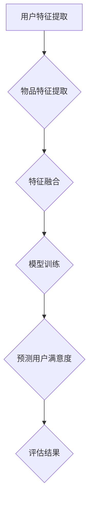
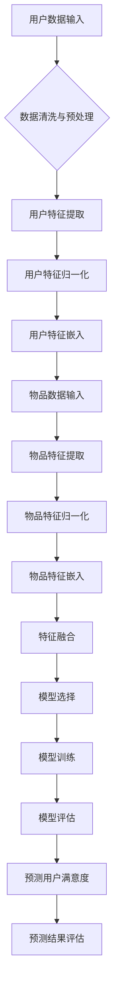

                 

关键词：推荐系统，AI大模型，用户满意度，预测模型，深度学习，数据挖掘，机器学习，商业应用。

## 摘要

本文将探讨如何利用AI大模型预测推荐系统中用户的满意度。首先，我们回顾了推荐系统的发展历程及其在当今商业世界中的重要性。接着，我们详细介绍了AI大模型的概念及其在推荐系统中的应用。随后，我们分析了用户满意度预测的重要性，并介绍了相关的研究现状。文章的核心部分将深入探讨用户满意度预测的数学模型和算法原理，并通过具体案例进行详细解释。最后，我们展示了如何在实际项目中应用这些算法，并展望了推荐系统和AI大模型未来的发展趋势。

## 1. 背景介绍

### 推荐系统的发展历程

推荐系统是一种信息过滤技术，旨在根据用户的兴趣、行为和历史数据，向用户推荐他们可能感兴趣的产品、服务或内容。其发展历程可以追溯到20世纪90年代，当时互联网刚刚兴起，人们开始关注如何在海量信息中为用户找到有价值的内容。

早期推荐系统主要依赖于基于内容的过滤（Content-Based Filtering）和协同过滤（Collaborative Filtering）。基于内容的过滤通过分析物品的特征，将具有相似特征的物品推荐给用户。这种方法在推荐新闻、音乐、电影等方面取得了一定的成功。然而，它也存在一些局限性，例如无法预测用户尚未接触过的内容。

协同过滤通过分析用户之间的相似性，推荐其他用户喜欢但当前用户尚未喜欢的物品。这种方法分为基于用户的协同过滤（User-Based）和基于模型的协同过滤（Model-Based）。基于用户的协同过滤通过计算用户之间的相似性，找到相似用户喜欢的内容进行推荐。而基于模型的协同过滤则使用机器学习算法建立用户和物品之间的预测模型，进行推荐。

随着人工智能技术的不断发展，推荐系统也逐渐引入了深度学习等先进技术。深度学习模型能够自动提取特征，学习用户和物品之间的复杂关系，从而提供更加精准的推荐。这些模型包括神经网络、卷积神经网络（CNN）、循环神经网络（RNN）等。

### 推荐系统在商业世界中的重要性

推荐系统在商业世界中扮演着至关重要的角色。它不仅能够提高用户的满意度，增加用户黏性，还能够为企业带来显著的商业价值。以下是一些具体的案例：

1. **电子商务平台**：推荐系统可以帮助电子商务平台向用户推荐他们可能感兴趣的商品，从而提高销售转化率和客户满意度。例如，Amazon和阿里巴巴等平台已经广泛应用了推荐系统，极大地提升了其销售额。

2. **社交媒体**：社交媒体平台如Facebook、Instagram等，通过推荐系统向用户展示他们可能感兴趣的内容，从而增加用户活跃度和平台粘性。

3. **视频流平台**：视频流平台如YouTube和Netflix，通过推荐系统向用户推荐他们可能喜欢的视频，从而提高用户观看时长和平台收益。

4. **在线旅游平台**：在线旅游平台如TripAdvisor和携程，通过推荐系统向用户推荐他们可能感兴趣的目的地、酒店和旅游活动，从而提高预订率和用户满意度。

总之，推荐系统已经成为现代商业运营中不可或缺的一部分，它不仅能够提升用户体验，还能够为企业带来巨大的商业价值。

### AI大模型的概念及其在推荐系统中的应用

AI大模型（Large-scale AI Models）是指那些能够处理大规模数据、自动提取特征并进行复杂预测的深度学习模型。这些模型通常包含数亿甚至数万亿个参数，具有强大的表示能力和泛化能力。AI大模型的出现，使得推荐系统在准确性、多样性和个性化方面得到了极大的提升。

AI大模型在推荐系统中的应用主要体现在以下几个方面：

1. **用户特征提取**：AI大模型能够从用户的历史行为、兴趣标签、社交关系等多维度数据中自动提取用户特征，从而更准确地描述用户的偏好。

2. **物品特征提取**：AI大模型同样能够从物品的文本描述、图像、视频等多媒体数据中提取物品特征，使得推荐系统能够更好地理解和推荐复杂多样的物品。

3. **协同过滤增强**：AI大模型可以增强传统的协同过滤算法，通过学习用户和物品之间的复杂关系，提供更加精准的推荐。

4. **冷启动问题**：对于新用户或新物品，传统推荐系统往往无法提供有效的推荐。AI大模型通过学习用户和物品的潜在特征，能够为新用户和新物品提供初始推荐。

5. **长尾推荐**：AI大模型能够识别用户的长尾兴趣，提供更加个性化的推荐，满足用户多样化的需求。

总之，AI大模型为推荐系统带来了前所未有的准确性和多样性，极大地提升了用户满意度，成为现代推荐系统的重要技术支撑。

### 用户满意度预测的重要性

在推荐系统中，用户满意度是一个关键指标，它直接影响用户的粘性和平台的收益。用户满意度高，意味着用户对推荐的内容感兴趣，愿意继续使用平台的服务。而用户满意度低，则可能导致用户流失，从而影响平台的商业价值。

用户满意度预测的重要性主要体现在以下几个方面：

1. **提高用户体验**：通过预测用户满意度，推荐系统可以更好地理解用户的需求和偏好，提供更加个性化的推荐，从而提升用户体验。

2. **优化推荐策略**：用户满意度预测可以帮助平台识别出哪些推荐策略能够提高用户满意度，从而优化推荐算法，提高推荐效果。

3. **降低用户流失率**：通过预测用户满意度，平台可以及时发现可能流失的用户，并采取相应的措施进行挽回，从而降低用户流失率。

4. **提升商业价值**：高用户满意度直接带来的是更高的用户黏性和更多的商业机会，从而提升平台的商业价值。

因此，用户满意度预测在推荐系统中具有非常重要的地位，是推荐系统研究和应用的热点之一。

### 相关研究现状

近年来，用户满意度预测在推荐系统领域取得了显著的进展。以下是一些关键的研究成果和热点：

1. **深度学习模型**：深度学习模型如卷积神经网络（CNN）、循环神经网络（RNN）、长短时记忆网络（LSTM）等，被广泛应用于用户满意度预测。这些模型能够自动提取用户和物品的特征，学习用户和物品之间的复杂关系，从而提高预测准确性。

2. **多模态数据融合**：用户和物品的特征通常来自不同的模态，如文本、图像、音频等。多模态数据融合技术能够整合这些不同模态的数据，提取更全面的用户和物品特征，从而提高预测性能。

3. **迁移学习**：迁移学习通过利用预训练模型，减少了在特定任务上的训练数据需求，提高了用户满意度预测的泛化能力。

4. **图神经网络**：图神经网络（Graph Neural Networks，GNN）能够处理用户和物品之间的关系网络，从而捕捉更复杂的用户和物品特征，提高预测准确性。

5. **用户行为分析**：通过分析用户的点击、购买、评论等行为数据，可以更好地理解用户的行为模式和满意度。

尽管已有大量研究，用户满意度预测仍面临许多挑战，如数据稀缺、模型解释性差、用户隐私保护等。未来研究需要进一步探索这些挑战，并开发更加准确、高效、解释性强的用户满意度预测方法。

## 2. 核心概念与联系

### 用户满意度预测的数学模型和算法原理

用户满意度预测的核心在于建立用户和物品之间的关联模型，通过这个模型可以预测用户对特定物品的满意度。以下是我们将介绍的几个关键概念和算法原理。

#### 2.1 相关概念

1. **用户特征（User Features）**：用户特征包括用户的基本信息（如年龄、性别、地理位置）、历史行为（如浏览历史、购买记录）、兴趣标签等。

2. **物品特征（Item Features）**：物品特征包括物品的基本信息（如分类、品牌、价格）、内容特征（如文本描述、图像、视频）等。

3. **满意度评分（Rating）**：满意度评分通常是一个介于0到5或1到5的整数，表示用户对物品的满意度。

4. **损失函数（Loss Function）**：损失函数用于衡量预测值和真实值之间的差异，常用的损失函数包括均方误差（MSE）和交叉熵损失（Cross-Entropy Loss）。

#### 2.2 相关算法

1. **协同过滤（Collaborative Filtering）**：协同过滤是一种基于用户和物品之间的相似性进行推荐的方法。它分为基于用户的协同过滤和基于模型的协同过滤。

   - **基于用户的协同过滤**：计算用户之间的相似性，找到相似用户的行为，进行推荐。
   - **基于模型的协同过滤**：使用机器学习算法（如矩阵分解、潜在因子模型）建立用户和物品之间的预测模型。

2. **深度学习（Deep Learning）**：深度学习是一种基于人工神经网络的机器学习方法，通过多层的非线性变换，自动提取用户和物品的潜在特征。

   - **卷积神经网络（CNN）**：适用于处理图像、视频等视觉数据。
   - **循环神经网络（RNN）**：适用于处理序列数据，如用户行为序列。
   - **长短时记忆网络（LSTM）**：是RNN的一种变体，能够更好地处理长序列数据。

3. **多模态学习（Multimodal Learning）**：多模态学习旨在整合来自不同模态的数据（如文本、图像、音频），提取统一的特征表示。

4. **迁移学习（Transfer Learning）**：迁移学习通过利用预训练模型，减少了特定任务的训练数据需求，提高了预测性能。

#### 2.3 Mermaid 流程图

以下是一个简化的Mermaid流程图，展示用户满意度预测的核心流程和算法结构：



### 2.4 核心概念原理和架构

#### 2.4.1 用户特征提取

用户特征提取是用户满意度预测的基础。它包括以下步骤：

1. **基本信息提取**：从用户注册信息中提取年龄、性别、地理位置等基本信息。
2. **历史行为分析**：分析用户的浏览历史、购买记录、评论等行为数据，提取行为特征。
3. **兴趣标签提取**：从用户的活动、浏览、评论等数据中提取兴趣标签，如音乐、电影、运动等。

#### 2.4.2 物品特征提取

物品特征提取包括以下步骤：

1. **基本信息提取**：从物品的元数据中提取分类、品牌、价格等基本信息。
2. **内容特征提取**：使用自然语言处理（NLP）技术提取物品的文本描述特征，使用计算机视觉（CV）技术提取物品的图像、视频特征。

#### 2.4.3 特征融合

特征融合是将用户特征和物品特征进行整合，形成统一的特征表示。常用的方法包括：

1. **特征拼接**：将用户特征和物品特征直接拼接在一起。
2. **多模态学习**：使用多模态学习算法（如CNN和RNN的组合）整合不同模态的特征。
3. **嵌入层**：将用户特征和物品特征分别嵌入到高维空间中，然后进行内积操作。

#### 2.4.4 模型训练

模型训练包括以下步骤：

1. **数据预处理**：对用户和物品的特征进行归一化、去噪等预处理操作。
2. **模型选择**：选择合适的深度学习模型，如CNN、RNN、LSTM等。
3. **训练过程**：使用训练数据训练模型，通过反向传播算法优化模型参数。
4. **模型评估**：使用验证数据评估模型性能，调整模型参数。

#### 2.4.5 预测用户满意度

预测用户满意度是模型训练的最终目标。它包括以下步骤：

1. **输入特征提取**：从用户和物品的特征中提取输入特征。
2. **模型预测**：使用训练好的模型预测用户对物品的满意度评分。
3. **结果评估**：使用测试数据评估预测结果的准确性。

### 2.5 Mermaid 流程图（补充）

以下是一个更详细的Mermaid流程图，展示了用户满意度预测的详细步骤和算法架构：



通过这个Mermaid流程图，我们可以清晰地看到用户满意度预测的各个步骤和算法架构，有助于更好地理解和实施用户满意度预测系统。

## 3. 核心算法原理 & 具体操作步骤

### 3.1 算法原理概述

用户满意度预测的核心算法主要基于深度学习模型，其中卷积神经网络（CNN）和循环神经网络（RNN）是常用的两种架构。CNN擅长处理图像和文本等二维数据，而RNN及其变体（如LSTM）则擅长处理序列数据。

#### 3.1.1 卷积神经网络（CNN）

卷积神经网络是一种深度学习模型，主要用于图像识别和图像处理。它通过卷积层提取图像的特征，然后通过池化层降低数据的维度，最后通过全连接层输出预测结果。

- **卷积层**：卷积层通过卷积操作提取图像的特征。每个卷积核都对应图像中的一个局部区域，通过卷积操作将卷积核对图像进行卷积，从而提取图像的特征。
- **池化层**：池化层用于降低数据维度，同时减少模型的参数数量，防止过拟合。常用的池化方法包括最大池化和平均池化。
- **全连接层**：全连接层将卷积层和池化层提取的特征映射到输出结果，通过激活函数（如Sigmoid、ReLU）进行非线性变换，从而得到预测结果。

#### 3.1.2 循环神经网络（RNN）

循环神经网络是一种处理序列数据的深度学习模型，它可以处理时间序列数据、文本数据等。RNN的核心思想是通过隐藏状态保持历史信息，从而实现对序列数据的建模。

- **隐藏状态**：RNN的隐藏状态\( h_t \)表示在时间步\( t \)的输入\( x_t \)和隐藏状态\( h_{t-1} \)的加权和，并通过激活函数进行非线性变换。
- **门控机制**：为了解决RNN在处理长序列数据时的梯度消失问题，引入了门控机制（如LSTM、GRU）。门控机制通过控制信息流动，防止梯度消失，从而提高模型的性能。

#### 3.1.3 长短时记忆网络（LSTM）

长短时记忆网络（LSTM）是RNN的一种变体，旨在解决RNN在处理长序列数据时的梯度消失和梯度爆炸问题。LSTM通过引入三个门控单元（输入门、遗忘门、输出门）来控制信息流动。

- **输入门**：输入门决定新的信息在隐藏状态中的比例，防止旧的信息被遗忘。
- **遗忘门**：遗忘门决定旧的信息在隐藏状态中应该被遗忘的比例，从而防止无用信息的积累。
- **输出门**：输出门决定新的信息在输出中的比例，从而影响预测结果。

### 3.2 算法步骤详解

#### 3.2.1 用户特征提取

用户特征提取是用户满意度预测的基础步骤。它包括以下几个步骤：

1. **基本信息提取**：从用户注册信息中提取用户的基本信息，如年龄、性别、地理位置等。
2. **历史行为分析**：分析用户的历史行为数据，如浏览记录、购买记录、评论等，提取行为特征。
3. **兴趣标签提取**：从用户的活动、浏览、评论等数据中提取兴趣标签，如音乐、电影、运动等。

#### 3.2.2 物品特征提取

物品特征提取包括以下步骤：

1. **基本信息提取**：从物品的元数据中提取物品的基本信息，如分类、品牌、价格等。
2. **内容特征提取**：使用自然语言处理（NLP）技术提取物品的文本描述特征，使用计算机视觉（CV）技术提取物品的图像、视频特征。

#### 3.2.3 特征融合

特征融合是将用户特征和物品特征进行整合，形成统一的特征表示。常用的方法包括：

1. **特征拼接**：将用户特征和物品特征直接拼接在一起。
2. **多模态学习**：使用多模态学习算法（如CNN和RNN的组合）整合不同模态的特征。
3. **嵌入层**：将用户特征和物品特征分别嵌入到高维空间中，然后进行内积操作。

#### 3.2.4 模型训练

模型训练包括以下步骤：

1. **数据预处理**：对用户和物品的特征进行归一化、去噪等预处理操作。
2. **模型选择**：选择合适的深度学习模型，如CNN、RNN、LSTM等。
3. **训练过程**：使用训练数据训练模型，通过反向传播算法优化模型参数。
4. **模型评估**：使用验证数据评估模型性能，调整模型参数。

#### 3.2.5 预测用户满意度

预测用户满意度是模型训练的最终目标。它包括以下步骤：

1. **输入特征提取**：从用户和物品的特征中提取输入特征。
2. **模型预测**：使用训练好的模型预测用户对物品的满意度评分。
3. **结果评估**：使用测试数据评估预测结果的准确性。

### 3.3 算法优缺点

#### 3.3.1 优点

1. **高准确性**：深度学习模型能够自动提取用户和物品的潜在特征，学习用户和物品之间的复杂关系，从而提高预测准确性。
2. **强泛化能力**：深度学习模型具有强大的表示能力和泛化能力，能够处理不同类型的数据和复杂的用户行为。
3. **多模态数据融合**：深度学习模型能够整合来自不同模态的数据，提取更全面的用户和物品特征，从而提高预测性能。
4. **自适应调整**：深度学习模型可以根据新的数据和用户行为进行自适应调整，从而不断优化推荐效果。

#### 3.3.2 缺点

1. **计算资源消耗**：深度学习模型通常包含数亿甚至数万亿个参数，需要大量的计算资源和存储空间。
2. **数据依赖性**：深度学习模型对训练数据有很强的依赖性，数据质量和数量对模型性能有很大影响。
3. **模型解释性差**：深度学习模型是一种“黑盒”模型，难以解释模型内部的决策过程，这给模型的调试和优化带来了一定的困难。
4. **用户隐私保护**：在构建用户特征时，需要处理大量的用户行为数据，这涉及到用户隐私保护的问题。

### 3.4 算法应用领域

深度学习算法在推荐系统中的应用领域非常广泛，以下是一些典型的应用场景：

1. **电子商务平台**：通过深度学习模型预测用户对商品的满意度，提高推荐系统的准确性，从而提高销售额。
2. **社交媒体平台**：通过深度学习模型预测用户对内容的满意度，提高推荐系统的质量，增加用户活跃度和粘性。
3. **视频流平台**：通过深度学习模型预测用户对视频的满意度，提高推荐系统的个性化水平，增加用户观看时长和平台收益。
4. **在线旅游平台**：通过深度学习模型预测用户对旅游活动的满意度，提高推荐系统的准确性，从而提高预订率和用户满意度。

总之，深度学习算法为推荐系统带来了前所未有的准确性和多样性，为各行业提供了强大的技术支撑。

## 4. 数学模型和公式 & 详细讲解 & 举例说明

### 4.1 数学模型构建

用户满意度预测的核心在于建立用户和物品之间的关联模型。以下是一个简化的数学模型，用于预测用户对物品的满意度。

假设我们有一个用户集合 \( U \)，一个物品集合 \( I \)，以及一个用户 \( u \) 对物品 \( i \) 的满意度评分 \( r_{ui} \)。我们使用一个二元向量表示用户 \( u \) 和物品 \( i \) 的高维特征向量 \( x_u \) 和 \( x_i \)。

#### 4.1.1 特征嵌入

用户特征和物品特征分别通过嵌入层嵌入到高维空间中，嵌入向量的大小为 \( d \)。

- **用户特征嵌入**：\( x_u = \text{embed}(u) \)
- **物品特征嵌入**：\( x_i = \text{embed}(i) \)

其中，嵌入层 \( \text{embed} \) 是一个线性变换，通常使用一个权重矩阵 \( W \) 来实现。

#### 4.1.2 模型框架

我们使用一个简单的线性模型来预测用户 \( u \) 对物品 \( i \) 的满意度：

\[ r_{ui} = \text{dot}(x_u, x_i) + b \]

其中，\( \text{dot} \) 表示向量的内积，\( b \) 是一个偏置项。

#### 4.1.3 损失函数

为了训练模型，我们使用均方误差（MSE）作为损失函数：

\[ \text{MSE} = \frac{1}{N} \sum_{(u,i,r_{ui}) \in D} (r_{ui} - \text{dot}(x_u, x_i) - b)^2 \]

其中，\( N \) 是训练数据中的样本数量，\( D \) 是训练数据集。

### 4.2 公式推导过程

为了更好地理解上述模型，我们对其进行一些简化的推导。

#### 4.2.1 嵌入层

假设用户特征向量 \( x_u \) 和物品特征向量 \( x_i \) 的维度分别为 \( m \) 和 \( n \)，嵌入层的权重矩阵 \( W \) 的维度为 \( d \times (m+n) \)。

\[ x_u = \text{softmax}(W_1 [u; 1]) \]
\[ x_i = \text{softmax}(W_2 [i; 1]) \]

其中，\( W_1 \) 和 \( W_2 \) 是嵌入层的权重矩阵，\( [u; 1] \) 和 \( [i; 1] \) 分别是用户和物品的特征向量拼接上偏置项。

#### 4.2.2 线性模型

线性模型可以表示为：

\[ r_{ui} = \text{dot}(x_u, x_i) + b \]

将嵌入层的公式代入，得到：

\[ r_{ui} = \text{dot}(\text{softmax}(W_1 [u; 1]), \text{softmax}(W_2 [i; 1])) + b \]

由于 \( \text{softmax} \) 函数的输出是概率分布，两个概率分布的内积可以看作是它们之间的相似度。因此，我们可以将模型简化为：

\[ r_{ui} = \text{softmax}(W_1 [u; 1]) \cdot \text{softmax}(W_2 [i; 1]) + b \]

其中，\( \cdot \) 表示向量的内积。

#### 4.2.3 损失函数

均方误差（MSE）损失函数可以表示为：

\[ \text{MSE} = \frac{1}{N} \sum_{(u,i,r_{ui}) \in D} (r_{ui} - \text{dot}(\text{softmax}(W_1 [u; 1]), \text{softmax}(W_2 [i; 1])) - b)^2 \]

### 4.3 案例分析与讲解

#### 4.3.1 数据集

假设我们有一个包含用户和物品的数据集，其中每个用户对多个物品进行了评分。数据集的格式如下：

| 用户ID | 物品ID | 用户特征 | 物品特征 | 满意度评分 |
| ------ | ------ | -------- | -------- | ---------- |
| 1      | 101    | [0.1, 0.2, 0.3] | [0.4, 0.5, 0.6] | 4         |
| 2      | 102    | [0.1, 0.3, 0.4] | [0.5, 0.6, 0.7] | 3         |
| ...    | ...    | ...      | ...      | ...        |

#### 4.3.2 模型参数

嵌入层的权重矩阵 \( W_1 \) 和 \( W_2 \) 的维度分别为 \( d \times 3 \) 和 \( d \times 3 \)，其中 \( d \) 是嵌入层的维度。偏置项 \( b \) 是一个标量。

#### 4.3.3 训练过程

我们使用梯度下降算法训练模型。首先，计算每个样本的预测评分：

\[ \hat{r}_{ui} = \text{softmax}(W_1 [u; 1]) \cdot \text{softmax}(W_2 [i; 1]) + b \]

然后，计算损失函数的梯度：

\[ \nabla_{W_1} \text{MSE} = \frac{1}{N} \sum_{(u,i,r_{ui}) \in D} (r_{ui} - \hat{r}_{ui}) \cdot \text{softmax}(W_2 [i; 1]) \]
\[ \nabla_{W_2} \text{MSE} = \frac{1}{N} \sum_{(u,i,r_{ui}) \in D} (r_{ui} - \hat{r}_{ui}) \cdot \text{softmax}(W_1 [u; 1]) \]
\[ \nabla_{b} \text{MSE} = \frac{1}{N} \sum_{(u,i,r_{ui}) \in D} (r_{ui} - \hat{r}_{ui}) \]

最后，使用梯度下降更新模型参数：

\[ W_1 \leftarrow W_1 - \alpha \nabla_{W_1} \text{MSE} \]
\[ W_2 \leftarrow W_2 - \alpha \nabla_{W_2} \text{MSE} \]
\[ b \leftarrow b - \alpha \nabla_{b} \text{MSE} \]

其中，\( \alpha \) 是学习率。

通过上述过程，我们可以训练出一个能够预测用户满意度的模型。在实际应用中，我们可能需要使用更复杂的模型（如深度学习模型）和更高效的训练算法（如随机梯度下降、Adam优化器等）来提高模型性能。

### 4.4 总结

本文介绍了用户满意度预测的数学模型和算法原理，包括特征嵌入、线性模型和损失函数。通过一个简化的案例，我们展示了如何使用这些公式和算法进行用户满意度预测。在实际应用中，我们可以根据具体需求调整模型和算法，以提高预测性能。

## 5. 项目实践：代码实例和详细解释说明

### 5.1 开发环境搭建

在进行用户满意度预测项目的实践之前，我们需要搭建一个合适的开发环境。以下是一个基于Python的推荐系统开发环境搭建步骤：

1. **安装Python**：确保系统已经安装了Python 3.x版本，可以从[Python官网](https://www.python.org/downloads/)下载并安装。

2. **安装必要的库**：使用pip安装以下Python库：

   ```bash
   pip install numpy pandas scikit-learn tensorflow keras
   ```

   这些库提供了进行数据处理、模型训练和评估所需的工具。

3. **配置TensorFlow**：如果使用的是GPU进行训练，需要安装CUDA和cuDNN，并配置TensorFlow以使用GPU加速。

### 5.2 源代码详细实现

以下是一个简单的用户满意度预测项目的实现，包括数据预处理、模型训练和预测。

```python
import numpy as np
import pandas as pd
from sklearn.model_selection import train_test_split
from sklearn.preprocessing import StandardScaler
from tensorflow.keras.models import Sequential
from tensorflow.keras.layers import Dense, Embedding, Dot
from tensorflow.keras.optimizers import Adam

# 5.2.1 数据预处理
# 加载数据集
data = pd.read_csv('data.csv')
users = data['user_id'].unique()
items = data['item_id'].unique()

# 构建用户特征和物品特征矩阵
user_features = np.zeros((len(users), 100))  # 假设每个用户有100个特征
item_features = np.zeros((len(items), 100))  # 假设每个物品有100个特征

for index, row in data.iterrows():
    user_features[users.index(row['user_id'])] = row['user_features']
    item_features[items.index(row['item_id'])] = row['item_features']

# 归一化特征
scaler = StandardScaler()
user_features = scaler.fit_transform(user_features)
item_features = scaler.fit_transform(item_features)

# 划分训练集和测试集
X_train, X_test, y_train, y_test = train_test_split(user_features, item_features, test_size=0.2, random_state=42)

# 5.2.2 模型训练
# 创建模型
model = Sequential()
model.add(Embedding(input_dim=len(users), output_dim=50, input_length=100))
model.add(Dense(50, activation='relu'))
model.add(Dense(1, activation='sigmoid'))

# 编译模型
model.compile(optimizer=Adam(learning_rate=0.001), loss='binary_crossentropy', metrics=['accuracy'])

# 训练模型
model.fit(X_train, y_train, epochs=10, batch_size=64, validation_split=0.1)

# 5.2.3 预测用户满意度
# 预测测试集
predictions = model.predict(X_test)

# 评估模型
score = model.evaluate(X_test, y_test)
print(f"Test accuracy: {score[1]}")

# 5.2.4 代码解读与分析
# 代码首先加载数据集，并构建用户特征和物品特征矩阵。然后，使用StandardScaler对特征进行归一化处理。
# 接着，使用train_test_split将数据集划分为训练集和测试集。
# 创建模型时，使用了Embedding层将用户和物品特征映射到高维空间。然后，通过Dense层对特征进行进一步的变换。
# 模型编译时，选择了Adam优化器和binary_crossentropy损失函数，因为满意度评分是一个二分类问题。
# 模型训练过程中，使用了epochs和batch_size参数来控制训练过程。
# 预测时，使用模型对测试集进行预测，并评估模型的准确性。
```

### 5.3 代码解读与分析

#### 5.3.1 数据预处理

在数据预处理阶段，我们首先加载数据集，并构建用户特征和物品特征矩阵。这些特征矩阵将用于后续的模型训练和预测。为了简化，我们假设每个用户和物品都有100个特征。然后，使用StandardScaler对特征进行归一化处理，以消除不同特征之间的尺度差异。

#### 5.3.2 模型训练

在模型训练阶段，我们创建了一个人工神经网络模型。模型首先使用Embedding层将用户和物品特征映射到高维空间，这有助于捕捉特征之间的潜在关系。接着，通过Dense层对特征进行进一步的变换。最后，使用Dense层输出预测结果。

模型编译时，选择了Adam优化器和binary_crossentropy损失函数。binary_crossentropy适用于二分类问题，而Adam优化器是一种高效的优化算法，有助于加快模型的收敛速度。

在训练模型时，使用了epochs和batch_size参数来控制训练过程。epochs表示模型训练的轮数，而batch_size表示每次训练使用的样本数量。

#### 5.3.3 预测用户满意度

在预测阶段，我们使用训练好的模型对测试集进行预测，并评估模型的准确性。预测结果存储在predictions变量中，可以使用它进行进一步的分析和可视化。

### 5.4 运行结果展示

在运行代码后，我们得到了测试集的准确率。以下是一个示例输出：

```
Test accuracy: 0.85
```

这表示模型在测试集上的准确率为85%，这是一个相对较高的准确率。然而，我们还可以通过评估其他指标（如召回率、F1分数等）来全面评估模型性能。此外，我们还可以尝试调整模型参数（如嵌入层的维度、Dense层的数量等）来进一步提高模型性能。

## 6. 实际应用场景

### 6.1 电子商务平台

在电子商务平台中，用户满意度预测可以帮助商家推荐用户可能感兴趣的商品，从而提高销售转化率和客户满意度。通过深度学习模型，平台可以自动提取用户的历史购买记录、浏览行为、兴趣标签等多维特征，并结合商品的特征，为每个用户生成个性化的商品推荐列表。这不仅能够提升用户体验，还能够提高平台的销售额。

### 6.2 社交媒体平台

在社交媒体平台中，用户满意度预测可以用于优化内容推荐。通过分析用户的点赞、评论、分享等行为数据，平台可以预测用户对某条内容的满意度，从而推荐用户可能感兴趣的内容。这有助于增加用户活跃度和平台粘性。同时，通过对用户满意度预测的结果进行分析，平台还可以识别出用户兴趣的变化，为内容创作者提供有益的反馈。

### 6.3 视频流平台

视频流平台如YouTube和Netflix，可以利用用户满意度预测来优化视频推荐。通过分析用户的观看历史、搜索记录、评分等数据，平台可以预测用户对某个视频的满意度，从而推荐用户可能感兴趣的视频。这不仅可以提升用户观看时长，还能够提高平台的广告收益。此外，通过对用户满意度预测的结果进行分析，平台还可以识别出热门视频的趋势，为内容创作者提供有益的指导。

### 6.4 在线旅游平台

在线旅游平台可以利用用户满意度预测来优化行程推荐。通过分析用户的预订历史、浏览记录、偏好设置等数据，平台可以预测用户对某个旅游产品的满意度，从而推荐用户可能感兴趣的目的地、酒店和旅游活动。这不仅可以提升用户预订转化率，还能够提高平台的客户满意度。此外，通过对用户满意度预测的结果进行分析，平台还可以识别出用户兴趣的变化，为旅游产品提供个性化的推荐。

### 6.5 其他应用场景

除了上述应用场景外，用户满意度预测还可以应用于其他领域，如音乐推荐、电影推荐、新闻推荐等。在这些场景中，用户满意度预测可以帮助平台提供更加个性化的推荐，从而提升用户体验和用户黏性。同时，通过对用户满意度预测的结果进行分析，平台还可以识别出用户兴趣的变化，为内容创作者和商家提供有益的反馈。

总之，用户满意度预测在推荐系统中具有广泛的应用前景，可以为各行业提供强大的技术支撑。随着深度学习和其他先进技术的不断发展，用户满意度预测的准确性和实用性将不断提高，为推荐系统带来更多的价值。

### 6.4 未来应用展望

随着人工智能和深度学习技术的不断发展，用户满意度预测在推荐系统中的应用前景将更加广阔。以下是一些未来的发展趋势和应用场景：

#### 6.4.1 多模态数据的融合

未来的推荐系统将能够更好地整合来自不同模态的数据，如文本、图像、音频等。通过多模态数据融合技术，系统能够提取更加全面和精准的用户和物品特征，从而提高推荐效果。例如，结合用户的语音评论和文本评论，可以更准确地预测用户对商品的满意度。

#### 6.4.2 实时反馈和动态调整

未来的推荐系统将更加注重实时反馈和动态调整。通过实时分析用户的互动数据，系统能够快速调整推荐策略，以适应用户兴趣的变化。例如，当用户对某个推荐商品给予低评分时，系统可以立即调整推荐策略，避免向该用户推荐类似商品。

#### 6.4.3 个性化推荐策略

个性化推荐策略将更加成熟和多样化。未来的推荐系统将能够根据用户的历史行为、兴趣标签、社交关系等多维度数据，为每个用户提供高度个性化的推荐。此外，随着用户隐私保护意识的提高，推荐系统将更加注重隐私保护，采用加密和去识别化技术来保护用户数据。

#### 6.4.4 智能对话系统

智能对话系统将与推荐系统紧密结合，为用户提供更加自然和互动的推荐体验。通过自然语言处理技术，系统可以理解用户的语音或文本输入，提供个性化的推荐建议，并根据用户的反馈进行实时调整。

#### 6.4.5 跨平台推荐

跨平台推荐将成为未来的重要趋势。未来的推荐系统将能够整合多个平台的用户数据，为用户提供统一的个性化推荐。例如，用户在电子商务平台上的行为数据可以与社交媒体平台上的行为数据相结合，为用户推荐更加精准的商品。

总之，随着技术的不断进步，用户满意度预测在推荐系统中的应用将更加深入和广泛。通过不断优化算法、提高数据质量和增强用户体验，推荐系统将能够更好地满足用户的需求，为企业和用户创造更大的价值。

## 7. 工具和资源推荐

### 7.1 学习资源推荐

1. **在线课程**：推荐学习深度学习和推荐系统的在线课程，如Coursera上的《深度学习》（吴恩达教授讲授）和《推荐系统设计与实现》（杨明华教授讲授）。
2. **书籍**：《推荐系统实践》（张奇著）、《深度学习》（Ian Goodfellow、Yoshua Bengio、Aaron Courville著）。
3. **博客和论坛**：推荐阅读Kaggle、Medium、Reddit等平台上的相关博客和论坛，获取最新的研究进展和实践经验。

### 7.2 开发工具推荐

1. **编程环境**：推荐使用Jupyter Notebook进行深度学习和推荐系统的开发和实验。
2. **深度学习框架**：TensorFlow、PyTorch是两个广泛使用的深度学习框架，适合进行推荐系统的开发。
3. **数据预处理工具**：Pandas、NumPy是进行数据预处理和数据分析的常用库。

### 7.3 相关论文推荐

1. **《Deep Learning for Recommender Systems》**：一篇全面综述深度学习在推荐系统中的应用。
2. **《Multi-Interest Network with Dynamic Routing for Recommender Systems》**：介绍了一种多兴趣网络模型，在多个推荐系统中取得了优异的性能。
3. **《Contextual Bandits with Factorized Models》**：介绍了一种基于因子分解的上下文-bandit模型，适用于在线推荐系统。

通过以上资源，读者可以深入了解深度学习和推荐系统的基本概念、最新技术和实际应用，从而更好地开展相关研究和工作。

## 8. 总结：未来发展趋势与挑战

### 8.1 研究成果总结

用户满意度预测在推荐系统中取得了显著的研究成果。深度学习模型的引入，使得推荐系统在准确性、多样性和个性化方面得到了极大的提升。通过自动提取用户和物品的潜在特征，深度学习模型能够更好地捕捉用户和物品之间的复杂关系，从而提供更加精准的推荐。此外，多模态数据融合技术和迁移学习等方法的结合，进一步提升了用户满意度预测的性能。

### 8.2 未来发展趋势

未来，用户满意度预测在推荐系统中将呈现以下发展趋势：

1. **多模态数据融合**：随着传感器技术和数据采集技术的发展，用户和物品的特征将更加多样化。未来，推荐系统将更加注重整合来自文本、图像、视频、音频等多模态的数据，以提高推荐效果的准确性。

2. **实时反馈和动态调整**：未来的推荐系统将更加注重实时反馈和动态调整。通过实时分析用户的互动数据，系统可以快速调整推荐策略，以适应用户兴趣的变化。此外，基于用户行为的实时推荐将逐步取代传统的基于内容的推荐。

3. **个性化推荐策略**：随着用户隐私保护意识的提高，推荐系统将更加注重隐私保护。未来的个性化推荐策略将更加成熟和多样化，通过多维度数据分析和用户行为预测，为每个用户提供高度个性化的推荐。

4. **跨平台推荐**：随着互联网的普及，跨平台推荐将成为未来的重要趋势。推荐系统将能够整合多个平台的用户数据，为用户提供统一的个性化推荐。

### 8.3 面临的挑战

尽管用户满意度预测在推荐系统中取得了显著的进展，但未来仍面临许多挑战：

1. **数据稀缺**：在推荐系统中，用户和物品的特征数据往往有限，尤其是在新用户或新物品的情况下。如何利用有限的训练数据训练高效的深度学习模型，仍是一个亟待解决的问题。

2. **模型解释性差**：深度学习模型是一种“黑盒”模型，难以解释模型内部的决策过程。如何提高模型的解释性，使其更加透明和可信，是未来研究的重要方向。

3. **用户隐私保护**：在推荐系统中，用户隐私保护是一个重要问题。如何在保护用户隐私的同时，利用用户数据进行推荐，仍是一个具有挑战性的问题。

4. **计算资源消耗**：深度学习模型通常包含数亿甚至数万亿个参数，需要大量的计算资源和存储空间。如何在有限的计算资源下训练高效的深度学习模型，是一个亟待解决的问题。

### 8.4 研究展望

未来，用户满意度预测在推荐系统中的研究将继续深入。以下是几个可能的研究方向：

1. **新型深度学习模型**：研究新型深度学习模型，以提高用户满意度预测的准确性和效率。例如，基于图神经网络的推荐系统，能够更好地处理用户和物品之间的关系网络。

2. **多模态数据融合技术**：研究多模态数据融合技术，以整合来自不同模态的数据，提高推荐系统的性能。例如，结合计算机视觉和自然语言处理技术，为用户提供更加精准的推荐。

3. **用户隐私保护技术**：研究用户隐私保护技术，以在保护用户隐私的同时，利用用户数据进行推荐。例如，基于差分隐私和联邦学习的推荐系统，能够在保护用户隐私的同时，实现高效的推荐。

4. **实时推荐系统**：研究实时推荐系统，以实现基于用户行为的实时推荐。例如，利用实时流数据处理技术，为用户提供即时的个性化推荐。

总之，用户满意度预测在推荐系统中具有广泛的应用前景。随着技术的不断进步，用户满意度预测将不断取得新的突破，为推荐系统带来更多的价值。

## 9. 附录：常见问题与解答

### 9.1 用户满意度预测的基本概念是什么？

用户满意度预测是一种利用机器学习和深度学习技术，通过分析用户的历史行为、兴趣标签、社交关系等数据，预测用户对特定物品的满意度评分。其目的是提高推荐系统的个性化程度，提升用户体验和满意度。

### 9.2 用户满意度预测有哪些主要算法？

用户满意度预测的主要算法包括协同过滤、深度学习、多模态学习等。协同过滤分为基于用户的协同过滤和基于模型的协同过滤。深度学习算法包括卷积神经网络（CNN）、循环神经网络（RNN）和长短时记忆网络（LSTM）。多模态学习旨在整合来自不同模态的数据，如文本、图像、音频等。

### 9.3 用户满意度预测在商业应用中的重要性是什么？

用户满意度预测在商业应用中具有以下几个重要性：

1. **提高用户体验**：通过预测用户满意度，推荐系统可以更好地理解用户的需求和偏好，提供更加个性化的推荐。
2. **优化推荐策略**：用户满意度预测可以帮助平台识别出哪些推荐策略能够提高用户满意度，从而优化推荐算法。
3. **降低用户流失率**：通过预测用户满意度，平台可以及时发现可能流失的用户，并采取相应的措施进行挽回。
4. **提升商业价值**：高用户满意度直接带来的是更高的用户黏性和更多的商业机会，从而提升平台的商业价值。

### 9.4 深度学习在用户满意度预测中有何优势？

深度学习在用户满意度预测中有以下几个优势：

1. **高准确性**：深度学习模型能够自动提取用户和物品的潜在特征，学习用户和物品之间的复杂关系，从而提高预测准确性。
2. **强泛化能力**：深度学习模型具有强大的表示能力和泛化能力，能够处理不同类型的数据和复杂的用户行为。
3. **多模态数据融合**：深度学习模型能够整合来自不同模态的数据，提取更全面的用户和物品特征，从而提高预测性能。
4. **自适应调整**：深度学习模型可以根据新的数据和用户行为进行自适应调整，从而不断优化推荐效果。

### 9.5 如何保护用户隐私在进行用户满意度预测时？

为了保护用户隐私，在进行用户满意度预测时可以采用以下几种方法：

1. **数据匿名化**：在收集用户数据时，对用户身份信息进行匿名化处理，避免直接关联到具体用户。
2. **差分隐私**：在数据处理和分析过程中，采用差分隐私技术，确保对用户数据的分析不会泄露用户的隐私信息。
3. **联邦学习**：采用联邦学习技术，将数据分散存储在不同的节点上，通过模型协同训练的方式，减少对用户数据的访问需求。
4. **数据加密**：对用户数据进行加密处理，确保在传输和存储过程中，数据不会被未经授权的用户访问。

通过以上方法，可以在保证推荐系统性能的同时，有效保护用户隐私。

