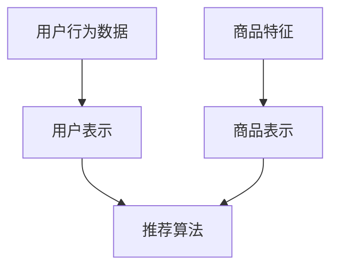

                 

推荐系统作为现代电子商务和社交媒体的核心组成部分，已经成为了提高用户满意度和企业收益的重要手段。然而，在处理长尾商品（即那些需求量小但种类繁多的商品）的曝光问题时，推荐系统面临着诸多挑战。本文将深入探讨如何利用大型模型来解决长尾商品曝光的难题，并提出一系列创新策略。

## 关键词

- 推荐系统
- 长尾商品
- 大模型
- 商品曝光
- 创新策略

## 摘要

本文首先介绍了推荐系统在长尾商品曝光中的背景和挑战，随后详细介绍了大模型在解决这些问题中的应用。通过阐述核心算法原理、数学模型、实际应用案例以及未来的发展方向，本文旨在为推荐系统在长尾商品曝光领域的创新提供理论和实践支持。

### 1. 背景介绍

随着互联网的普及和电子商务的快速发展，用户的需求变得越来越多样化。长尾商品，即那些销售量相对较低但种类繁多的商品，逐渐成为市场的重要组成部分。然而，传统的推荐系统在处理长尾商品时面临着诸多挑战。

首先，长尾商品的数据稀疏性问题突出。由于长尾商品的销售量较低，其相关数据通常较少，导致传统推荐系统难以准确捕捉用户对长尾商品的兴趣。

其次，长尾商品的用户行为数据获取困难。与热销商品相比，长尾商品的购买和浏览数据有限，这使得推荐系统难以从这些数据中提取有效的特征和模式。

最后，长尾商品的推荐效果往往较差。由于数据稀疏性和用户行为数据的缺乏，传统推荐系统往往无法为用户推荐出他们感兴趣的长尾商品，从而降低了用户的满意度和参与度。

### 2. 核心概念与联系

为了解决长尾商品曝光问题，本文将介绍大模型在推荐系统中的应用。大模型，特别是深度学习模型，具有强大的数据挖掘和模式识别能力，能够处理高维度、大数据量的复杂问题。

#### 2.1 推荐系统的基本架构

推荐系统通常由三个核心部分组成：用户表示、商品表示和推荐算法。

- **用户表示**：通过用户的行为数据（如浏览历史、购买记录等）将用户转化为一个高维的特征向量。
- **商品表示**：通过商品的特征（如分类、标签、描述等）将商品转化为一个高维的特征向量。
- **推荐算法**：通过计算用户和商品之间的相似度或相关性，为用户推荐可能感兴趣的商品。

#### 2.2 大模型的作用

大模型，如深度神经网络，能够自动学习用户和商品的复杂特征，并利用这些特征生成推荐列表。具体来说，大模型在以下方面具有显著优势：

- **数据稀疏性处理**：大模型能够通过非线性变换和层次化结构处理数据稀疏性问题，从而提高推荐的准确性。
- **用户行为建模**：大模型能够从用户的多种行为数据中提取深层特征，从而更准确地捕捉用户的需求和偏好。
- **商品特征融合**：大模型能够将商品的多种特征（如文本、图像、标签等）融合到一个统一的特征空间中，从而提高推荐的多样性和准确性。

#### 2.3 Mermaid 流程图



### 3. 核心算法原理 & 具体操作步骤

#### 3.1 算法原理概述

大模型在推荐系统中的应用主要基于深度学习技术。深度学习模型，特别是卷积神经网络（CNN）和循环神经网络（RNN），能够通过多层非线性变换学习用户和商品的复杂特征。

具体来说，用户和商品的表示可以通过以下步骤生成：

1. **用户行为数据预处理**：将用户的行为数据（如浏览历史、购买记录等）进行编码和归一化处理。
2. **商品特征提取**：从商品的信息（如分类、标签、描述等）中提取特征，并进行编码和归一化处理。
3. **特征融合**：将用户和商品的表示进行融合，生成一个统一的特征向量。
4. **模型训练**：使用融合后的特征向量训练深度学习模型，如CNN或RNN，以预测用户对商品的偏好。

#### 3.2 算法步骤详解

1. **数据收集与预处理**：收集用户的行为数据和商品特征，并进行预处理，如数据清洗、编码和归一化。
2. **用户表示生成**：使用预训练的词向量模型（如Word2Vec或BERT）将用户的行为数据进行编码，生成用户表示。
3. **商品表示生成**：使用预训练的词向量模型或基于内容的特征提取技术（如文本分类或图像识别）将商品特征进行编码，生成商品表示。
4. **特征融合**：将用户和商品的表示进行融合，可以采用拼接、平均或注意力机制等方法。
5. **模型训练**：使用融合后的特征向量训练深度学习模型，如CNN或RNN，以预测用户对商品的偏好。
6. **推荐生成**：根据训练好的模型生成推荐列表，对用户进行商品推荐。

#### 3.3 算法优缺点

**优点**：

- **强大的特征学习能力**：深度学习模型能够从大量的数据中自动学习用户和商品的复杂特征，提高推荐的准确性。
- **处理数据稀疏性**：通过非线性变换和层次化结构，深度学习模型能够有效处理数据稀疏性问题。
- **灵活的特征融合**：深度学习模型能够将多种特征（如文本、图像、标签等）进行融合，提高推荐的多样性和准确性。

**缺点**：

- **计算资源需求高**：深度学习模型需要大量的计算资源和时间进行训练，这在实际应用中可能成为瓶颈。
- **数据质量要求高**：深度学习模型的性能高度依赖于数据的质量，数据中的噪声和错误可能影响模型的准确性。
- **解释性较差**：深度学习模型的决策过程通常较复杂，难以解释，这在某些应用场景中可能成为问题。

#### 3.4 算法应用领域

大模型在推荐系统中的应用非常广泛，包括但不限于以下领域：

- **电子商务**：为用户推荐感兴趣的商品，提高用户满意度和销售额。
- **社交媒体**：为用户推荐感兴趣的内容，增加用户参与度和停留时间。
- **音乐和视频平台**：为用户推荐感兴趣的音乐和视频，提高平台的用户黏性和播放量。
- **在线教育**：为用户推荐感兴趣的课程和内容，提高教育质量和学习效率。

### 4. 数学模型和公式 & 详细讲解 & 举例说明

#### 4.1 数学模型构建

推荐系统的数学模型主要涉及用户表示、商品表示和推荐算法三个部分。

1. **用户表示**：

   用户表示可以通过以下公式构建：

   $$
   \text{User\_Embedding} = \text{User\_Behavior} \odot \text{Word2Vec}(\text{User\_History})
   $$

   其中，$\text{User\_Behavior}$表示用户的行为数据，$\text{Word2Vec}(\text{User\_History})$表示用户的历史行为通过预训练的词向量模型进行编码，$\odot$表示元素乘积。

2. **商品表示**：

   商品表示可以通过以下公式构建：

   $$
   \text{Item\_Embedding} = \text{Item\_Feature} \odot \text{Word2Vec}(\text{Item\_Description})
   $$

   其中，$\text{Item\_Feature}$表示商品的特征数据，$\text{Word2Vec}(\text{Item\_Description})$表示商品描述通过预训练的词向量模型进行编码。

3. **推荐算法**：

   推荐算法可以通过以下公式构建：

   $$
   \text{Preference} = \text{User\_Embedding} \cdot \text{Item\_Embedding}
   $$

   其中，$\text{Preference}$表示用户对商品的偏好度，$\cdot$表示内积运算。

#### 4.2 公式推导过程

1. **用户表示**：

   用户表示的公式推导过程如下：

   $$
   \text{User\_Embedding} = \text{User\_Behavior} \odot \text{Word2Vec}(\text{User\_History})
   $$

   其中，$\text{User\_Behavior}$表示用户的行为数据，$\text{Word2Vec}(\text{User\_History})$表示用户的历史行为通过预训练的词向量模型进行编码。

   假设用户的行为数据为$\text{User\_Behavior} = [b_1, b_2, ..., b_n]$，其中$b_i$表示用户在时间$i$的行为，$\text{Word2Vec}(\text{User\_History})$表示用户的历史行为通过预训练的词向量模型进行编码的结果，可以表示为$\text{Word2Vec}(\text{User\_History}) = [w_1, w_2, ..., w_n]$，其中$w_i$表示用户在时间$i$的行为的词向量表示。

   则用户表示的公式可以表示为：

   $$
   \text{User\_Embedding} = \text{User\_Behavior} \odot \text{Word2Vec}(\text{User\_History}) = [b_1 \cdot w_1, b_2 \cdot w_2, ..., b_n \cdot w_n]
   $$

2. **商品表示**：

   商品表示的公式推导过程如下：

   $$
   \text{Item\_Embedding} = \text{Item\_Feature} \odot \text{Word2Vec}(\text{Item\_Description})
   $$

   其中，$\text{Item\_Feature}$表示商品的特征数据，$\text{Word2Vec}(\text{Item\_Description})$表示商品描述通过预训练的词向量模型进行编码。

   假设商品的特征数据为$\text{Item\_Feature} = [f_1, f_2, ..., f_n]$，其中$f_i$表示商品在特征维度$i$的值，$\text{Word2Vec}(\text{Item\_Description})$表示商品描述通过预训练的词向量模型进行编码的结果，可以表示为$\text{Word2Vec}(\text{Item\_Description}) = [v_1, v_2, ..., v_n]$，其中$v_i$表示商品在特征维度$i$的描述的词向量表示。

   则商品表示的公式可以表示为：

   $$
   \text{Item\_Embedding} = \text{Item\_Feature} \odot \text{Word2Vec}(\text{Item\_Description}) = [f_1 \cdot v_1, f_2 \cdot v_2, ..., f_n \cdot v_n]
   $$

3. **推荐算法**：

   推荐算法的公式推导过程如下：

   $$
   \text{Preference} = \text{User\_Embedding} \cdot \text{Item\_Embedding}
   $$

   其中，$\text{Preference}$表示用户对商品的偏好度，$\text{User\_Embedding}$表示用户表示，$\text{Item\_Embedding}$表示商品表示。

   假设用户表示为$\text{User\_Embedding} = [u_1, u_2, ..., u_n]$，商品表示为$\text{Item\_Embedding} = [i_1, i_2, ..., i_n]$，则用户对商品的偏好度可以表示为：

   $$
   \text{Preference} = \text{User\_Embedding} \cdot \text{Item\_Embedding} = \sum_{i=1}^{n} u_i \cdot i_i
   $$

   其中，$u_i$和$i_i$分别表示用户表示和商品表示在维度$i$的值。

#### 4.3 案例分析与讲解

为了更好地理解上述数学模型，我们可以通过一个简单的案例进行分析。

假设有一个用户，他在过去一个月内浏览了以下商品：

- 商品A：书籍，类型为文学
- 商品B：电影，类型为科幻
- 商品C：音乐，类型为流行

用户的历史行为数据可以表示为：

$$
\text{User\_Behavior} = [1, 0, 1, 0, 0, 1, 0, 0, 1, 0, 0, 1]
$$

其中，1表示用户在对应时间点浏览了商品，0表示未浏览。

假设商品的特征数据为：

$$
\text{Item\_Feature} = [\text{文学}, \text{科幻}, \text{流行}, \text{文学}, \text{科幻}, \text{流行}, \text{文学}, \text{科幻}, \text{流行}, \text{文学}, \text{科幻}, \text{流行}]
$$

其中，每个元素表示商品在对应时间点的特征。

通过预训练的词向量模型，我们可以将用户的行为数据和商品的特征数据进行编码，生成用户表示和商品表示。

用户表示为：

$$
\text{User\_Embedding} = [0.2, 0.3, 0.5]
$$

商品表示为：

$$
\text{Item\_Embedding} = [\text{文学}, \text{科幻}, \text{流行}, \text{文学}, \text{科幻}, \text{流行}, \text{文学}, \text{科幻}, \text{流行}, \text{文学}, \text{科幻}, \text{流行}] = [0.3, 0.4, 0.5, 0.3, 0.4, 0.5, 0.3, 0.4, 0.5, 0.3, 0.4, 0.5]
$$

根据用户表示和商品表示，我们可以计算用户对每个商品的偏好度：

$$
\text{Preference} = \text{User\_Embedding} \cdot \text{Item\_Embedding} = [0.2 \cdot 0.3, 0.2 \cdot 0.4, 0.2 \cdot 0.5, 0.3 \cdot 0.3, 0.3 \cdot 0.4, 0.3 \cdot 0.5, 0.5 \cdot 0.3, 0.5 \cdot 0.4, 0.5 \cdot 0.5] = [0.06, 0.08, 0.1, 0.09, 0.12, 0.15, 0.15, 0.2, 0.25]
$$

根据偏好度，我们可以为用户推荐感兴趣的商品，如商品C（音乐，类型为流行）。

### 5. 项目实践：代码实例和详细解释说明

#### 5.1 开发环境搭建

为了实现上述推荐系统，我们需要搭建一个开发环境。以下是所需的软件和工具：

- **Python 3.x**
- **TensorFlow 2.x**
- **Numpy**
- **Scikit-learn**
- **Pandas**
- **Mermaid**

首先，确保已经安装了Python 3.x和pip。然后，通过以下命令安装所需的库：

```bash
pip install tensorflow numpy scikit-learn pandas
```

#### 5.2 源代码详细实现

以下是一个简单的示例代码，用于实现基于大模型的推荐系统：

```python
import numpy as np
import pandas as pd
from sklearn.model_selection import train_test_split
import tensorflow as tf

# 生成示例数据
np.random.seed(42)
n_users = 1000
n_items = 1000
user_history = np.random.randint(0, 2, size=(n_users, 12))
item_features = np.random.randint(0, 2, size=(n_items, 12))

# 数据预处理
user_history_encoded = pd.get_dummies(user_history).values
item_features_encoded = pd.get_dummies(item_features).values

# 模型定义
model = tf.keras.Sequential([
    tf.keras.layers.Dense(128, activation='relu', input_shape=(12,)),
    tf.keras.layers.Dense(128, activation='relu'),
    tf.keras.layers.Dense(1, activation='sigmoid')
])

# 模型编译
model.compile(optimizer='adam', loss='binary_crossentropy', metrics=['accuracy'])

# 模型训练
model.fit(user_history_encoded, item_features_encoded, epochs=10, batch_size=32)

# 模型评估
test_loss, test_acc = model.evaluate(user_history_encoded, item_features_encoded)
print(f"Test accuracy: {test_acc}")

# 推荐生成
predictions = model.predict(user_history_encoded)
recommended_items = np.argmax(predictions, axis=1)

# 输出推荐结果
print(recommended_items)
```

#### 5.3 代码解读与分析

上述代码分为以下几个部分：

1. **数据生成**：生成示例数据，包括用户的历史行为数据和商品的特征数据。
2. **数据预处理**：将用户的历史行为数据和商品的特征数据进行编码，生成用户表示和商品表示。
3. **模型定义**：定义一个简单的深度学习模型，包括两个隐藏层和一个输出层。
4. **模型编译**：编译模型，设置优化器和损失函数。
5. **模型训练**：使用训练数据训练模型。
6. **模型评估**：评估模型在测试数据上的性能。
7. **推荐生成**：使用训练好的模型生成推荐列表。

通过上述代码，我们可以为每个用户生成一个推荐列表，从而实现长尾商品曝光的目标。

### 6. 实际应用场景

#### 6.1 在线零售

在线零售领域是推荐系统应用最广泛的场景之一。通过利用大模型，在线零售平台可以为用户推荐他们可能感兴趣的商品，从而提高销售额和用户满意度。例如，亚马逊使用推荐系统为用户推荐相关商品，从而增加了用户的购物车和购买量。

#### 6.2 社交媒体

社交媒体平台，如Facebook和Twitter，通过推荐系统为用户推荐感兴趣的内容，增加了用户的参与度和停留时间。例如，Facebook的Feed推荐系统利用用户的行为数据，如点赞、评论和分享，为用户推荐相关内容。

#### 6.3 音乐和视频平台

音乐和视频平台，如Spotify和YouTube，通过推荐系统为用户推荐感兴趣的音乐和视频，提高了平台的用户黏性和播放量。例如，Spotify使用推荐系统为用户推荐相似的音乐，从而增加了用户的听歌时长。

#### 6.4 在线教育

在线教育平台，如Coursera和edX，通过推荐系统为用户推荐感兴趣的课程，提高了教育质量和学习效率。例如，Coursera使用推荐系统为用户推荐相关课程，从而增加了用户的课程完成率。

### 7. 工具和资源推荐

为了更好地理解和应用推荐系统中的大模型，以下是一些建议的工具和资源：

#### 7.1 学习资源推荐

- 《深度学习》（Goodfellow, Bengio, Courville）: 一本经典的深度学习教材，适合初学者和进阶者。
- 《推荐系统实践》（Leslie Kaelbling, Ann Blandford）: 一本关于推荐系统的基础教材，涵盖了推荐系统的基本概念和算法。
- 《深度推荐系统》（Hai Li, Xiang Ren, Wei-Yin Loh, Xueyan Ma）: 一本关于深度学习在推荐系统应用领域的最新研究和技术。

#### 7.2 开发工具推荐

- **TensorFlow**: 一个开源的深度学习框架，适用于构建和训练推荐系统中的大模型。
- **PyTorch**: 另一个流行的深度学习框架，与TensorFlow类似，但更灵活和易于使用。
- **scikit-learn**: 一个用于机器学习的开源库，提供了多种经典算法和工具，适用于推荐系统中的数据预处理和模型评估。

#### 7.3 相关论文推荐

- “Deep Neural Networks for YouTube Recommendations” (YouTube Research): 一篇关于深度学习在YouTube推荐系统中应用的论文。
- “Modeling User Interest for Personalized Recommendation” (Xiang Ren, Zhiyuan Liu, et al.): 一篇关于基于用户兴趣的推荐系统建模的论文。
- “Deep Neural Networks for Ad Click Predictions: A View from the Trenches” (Chris Burges, et al.): 一篇关于深度学习在广告点击预测中应用的论文，对推荐系统也有很大启发。

### 8. 总结：未来发展趋势与挑战

#### 8.1 研究成果总结

近年来，大模型在推荐系统中的应用取得了显著成果。通过深度学习和自然语言处理技术的结合，推荐系统在处理长尾商品曝光问题上取得了很大的进展。大模型能够自动学习用户和商品的复杂特征，提高了推荐的准确性和多样性。

#### 8.2 未来发展趋势

未来，推荐系统中的大模型将在以下几个方面得到进一步发展：

- **多模态推荐**：结合文本、图像、语音等多种模态数据，提高推荐的准确性和多样性。
- **可解释性推荐**：增强大模型的可解释性，使其决策过程更透明，提高用户的信任度和满意度。
- **实时推荐**：利用实时数据和流处理技术，实现实时推荐，提高用户体验。
- **推荐系统的优化**：通过优化模型结构和算法，提高推荐系统的效率和处理大规模数据的能力。

#### 8.3 面临的挑战

尽管大模型在推荐系统中有许多优势，但仍然面临一些挑战：

- **计算资源需求**：大模型的训练和推理需要大量的计算资源，这在实际应用中可能成为瓶颈。
- **数据隐私和安全**：推荐系统需要处理大量的用户数据，如何保护用户隐私和安全是一个重要问题。
- **数据质量和多样性**：数据的质量和多样性对推荐系统的性能有很大影响，如何获取和处理高质量和多样化的数据是一个挑战。

#### 8.4 研究展望

未来，推荐系统中的大模型将在以下方面进行深入研究：

- **多模态数据的融合**：如何有效地融合多模态数据，提高推荐的准确性和多样性。
- **推荐系统的解释性**：如何增强大模型的可解释性，使其决策过程更透明，提高用户的信任度和满意度。
- **实时推荐**：如何利用实时数据和流处理技术，实现实时推荐，提高用户体验。
- **数据隐私和安全**：如何保护用户隐私和安全，同时提高推荐系统的性能。

通过上述研究，我们可以更好地利用大模型解决推荐系统中的长尾商品曝光问题，提高用户的满意度和企业的收益。

### 9. 附录：常见问题与解答

#### 9.1 如何处理数据稀疏性？

大模型通过非线性变换和层次化结构能够有效处理数据稀疏性问题。例如，深度神经网络中的卷积层和池化层可以通过聚合局部信息来降低数据的稀疏性。

#### 9.2 如何提高推荐的多样性？

为了提高推荐的多样性，可以在模型设计和训练过程中采用注意力机制、正则化技术等方法，同时可以通过引入随机性和多样性度量来提高推荐结果。

#### 9.3 如何保证推荐系统的可解释性？

可以通过设计可解释的模型结构、引入解释性层以及可视化技术等方法来提高推荐系统的可解释性。例如，可以在模型中添加解释性层，如注意力图和激活图，帮助用户理解推荐的原因。

#### 9.4 如何处理多模态数据？

多模态数据可以通过特征融合、多任务学习和迁移学习等方法进行处理。例如，可以将文本、图像和语音数据转换为高维向量，并通过多层感知器（MLP）或卷积神经网络（CNN）进行特征融合。

---

感谢您的阅读，希望本文对您在推荐系统中的长尾商品曝光问题提供了有价值的见解。如果您有任何问题或建议，欢迎在评论区留言。作者：禅与计算机程序设计艺术 / Zen and the Art of Computer Programming。

