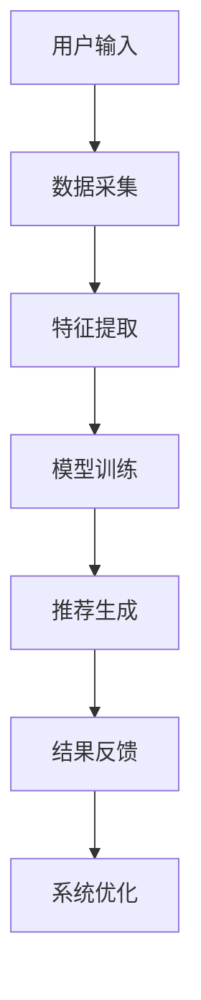

                 

关键词：推荐系统，公平性，多样性，AI大模型，伦理考量，算法，数学模型，应用场景，未来展望

> 摘要：随着AI大模型在推荐系统中的广泛应用，如何保障公平性和多样性成为了一个亟待解决的问题。本文首先介绍了推荐系统的基础概念和核心算法，然后深入探讨了AI大模型在公平性和多样性方面的挑战，提出了相应的解决方案。通过数学模型和具体案例的分析，本文为推荐系统的伦理考量提供了有价值的参考。

## 1. 背景介绍

推荐系统作为一种智能信息过滤方法，旨在向用户推荐他们可能感兴趣的内容或产品。近年来，随着AI技术的快速发展，尤其是深度学习算法的广泛应用，推荐系统的性能和效果得到了显著提升。然而，这也带来了一系列新的挑战，尤其是在公平性和多样性方面。

公平性指的是推荐系统在处理不同用户和内容时，是否能够公正地对待所有人。多样性则是指推荐系统能够向用户提供多样化的内容，避免出现信息茧房或用户偏好的单一化。

AI大模型，即基于大规模数据集训练的深度学习模型，已经在推荐系统中扮演了重要角色。然而，这些大模型在追求性能和效果的同时，也可能导致一些不公平和多样性的问题。例如，性别歧视、种族偏见、算法黑箱等。

本文将围绕AI大模型在推荐系统中的公平性和多样性问题展开讨论，分析其挑战，并提出相应的解决方案。

## 2. 核心概念与联系

为了更好地理解推荐系统的公平性与多样性问题，我们需要先了解一些核心概念和它们之间的联系。

### 2.1 推荐系统的基本概念

推荐系统主要包括用户、内容和算法三个核心要素。用户是指系统中的用户个体，内容包括推荐系统中的各种信息，如商品、文章、音乐等。算法则是推荐系统的核心，负责根据用户的历史行为和偏好，生成个性化的推荐结果。

### 2.2 推荐算法的基本原理

推荐算法主要分为基于内容的推荐（Content-based Filtering）和协同过滤（Collaborative Filtering）两大类。基于内容的推荐通过分析用户和内容的特征，找出相似的内容进行推荐。协同过滤则通过分析用户之间的相似性，找出相似的用户的偏好进行推荐。

### 2.3 推荐系统的流程

推荐系统的基本流程包括用户输入、数据采集、特征提取、模型训练、推荐生成和结果反馈。用户输入是指用户向系统提交他们的兴趣或偏好。数据采集是指系统从各种渠道收集用户和内容的数据。特征提取是指将用户和内容的数据转化为算法可以处理的特征向量。模型训练是指使用训练数据对推荐算法进行训练。推荐生成是指根据用户和内容的特征向量，生成个性化的推荐结果。结果反馈是指用户对推荐结果进行评价，用于进一步优化推荐系统。

### 2.4 AI大模型与推荐系统

AI大模型，即基于大规模数据集训练的深度学习模型，如BERT、GPT等，已经在推荐系统中发挥了重要作用。这些模型通过自动学习用户和内容的特征，能够生成更加精准的推荐结果。然而，这也使得推荐系统在公平性和多样性方面面临更大的挑战。

### 2.5 Mermaid 流程图

以下是推荐系统的基础流程的 Mermaid 流程图：



## 3. 核心算法原理 & 具体操作步骤

### 3.1 算法原理概述

在推荐系统中，核心算法主要分为基于内容的推荐和协同过滤两大类。基于内容的推荐通过分析用户和内容的特征，找出相似的内容进行推荐。协同过滤则通过分析用户之间的相似性，找出相似的用户的偏好进行推荐。

AI大模型在推荐系统中的应用主要是通过深度学习算法自动学习用户和内容的特征，从而生成个性化的推荐结果。常用的AI大模型包括BERT、GPT等。

### 3.2 算法步骤详解

#### 3.2.1 基于内容的推荐算法步骤

1. 数据采集：从各种渠道收集用户和内容的特征数据。
2. 特征提取：将用户和内容的数据转化为特征向量。
3. 模型训练：使用特征向量对推荐算法进行训练。
4. 推荐生成：根据训练好的模型，生成个性化的推荐结果。
5. 结果反馈：用户对推荐结果进行评价，用于进一步优化推荐系统。

#### 3.2.2 协同过滤算法步骤

1. 数据采集：从各种渠道收集用户和内容的交互数据。
2. 特征提取：计算用户和内容之间的相似度。
3. 模型训练：使用相似度数据对推荐算法进行训练。
4. 推荐生成：根据训练好的模型，生成个性化的推荐结果。
5. 结果反馈：用户对推荐结果进行评价，用于进一步优化推荐系统。

#### 3.2.3 AI大模型在推荐系统中的应用步骤

1. 数据预处理：对原始数据进行清洗和预处理。
2. 特征提取：使用AI大模型自动提取用户和内容的特征。
3. 模型训练：使用特征向量对推荐算法进行训练。
4. 推荐生成：根据训练好的模型，生成个性化的推荐结果。
5. 结果反馈：用户对推荐结果进行评价，用于进一步优化推荐系统。

### 3.3 算法优缺点

#### 基于内容的推荐算法

**优点**：能够根据用户的兴趣和偏好进行精准推荐，推荐结果较为个性化。

**缺点**：对于新用户或新内容，由于缺乏足够的历史数据，推荐效果较差。

#### 协同过滤算法

**优点**：能够利用用户之间的相似性进行推荐，推荐结果较为稳定。

**缺点**：容易产生用户偏好的单一化，推荐结果可能不够多样化。

#### AI大模型

**优点**：能够自动学习用户和内容的特征，生成个性化的推荐结果。

**缺点**：训练过程复杂，计算资源需求大。在处理冷启动问题方面表现一般。

### 3.4 算法应用领域

基于内容的推荐算法和协同过滤算法广泛应用于电子商务、社交媒体、新闻推荐等领域。AI大模型在推荐系统中的应用逐渐普及，尤其是在需要高精度推荐结果和大量数据处理的场景。

## 4. 数学模型和公式 & 详细讲解 & 举例说明

### 4.1 数学模型构建

推荐系统的数学模型主要包括用户特征矩阵、内容特征矩阵和推荐矩阵。用户特征矩阵表示用户与特征的映射关系，内容特征矩阵表示内容与特征的映射关系，推荐矩阵表示用户对内容的偏好。

设用户集合为U={u1, u2, ..., un}，内容集合为C={c1, c2, ..., cm}，用户特征集合为F={f1, f2, ..., fk}，内容特征集合为G={g1, g2, ..., gp}。

用户特征矩阵U ∈ R^(n×k)，内容特征矩阵C ∈ R^(m×p)，推荐矩阵R ∈ R^(n×m)。

### 4.2 公式推导过程

假设用户ui对内容cj的偏好为rij，则推荐矩阵R可以表示为：

R = U * C^T

其中，C^T表示内容特征矩阵C的转置。

#### 基于内容的推荐算法

用户ui对内容cj的偏好rij可以通过以下公式计算：

rij = dot(U[i, :], C[j, :])

其中，dot表示向量的点积运算。

#### 协同过滤算法

用户ui对内容cj的偏好rij可以通过以下公式计算：

rij = sim(ui, uj) * dot(C[j, :], C[uj, :])

其中，sim(ui, uj)表示用户ui和用户uj之间的相似度，可以使用余弦相似度、皮尔逊相关系数等方法计算。

#### AI大模型

假设用户ui和内容cj的特征向量分别为ui和cj，则用户ui对内容cj的偏好rij可以通过以下公式计算：

rij = dot(ui, cj)

其中，dot表示向量的点积运算。

### 4.3 案例分析与讲解

#### 案例一：基于内容的推荐算法

假设有5个用户和10个内容，用户与内容的偏好数据如下表所示：

| 用户 | 内容 | 偏好 |
|------|------|------|
| u1   | c1   | 3    |
| u1   | c2   | 2    |
| u1   | c3   | 5    |
| u2   | c1   | 4    |
| u2   | c3   | 3    |
| u3   | c1   | 2    |
| u3   | c2   | 5    |
| u3   | c4   | 3    |
| u4   | c2   | 4    |
| u4   | c3   | 2    |
| u4   | c4   | 5    |
| u5   | c3   | 4    |
| u5   | c4   | 3    |

用户u1对内容c1、c2、c3的偏好分别为3、2、5，我们可以通过以下公式计算：

U[1, :] = [3, 2, 5, 0, 0, 0, 0, 0, 0, 0]

C[1, :] = [0, 0, 0, 0, 0, 0, 0, 0, 0, 1]

U[1, :] * C[1, :].T = [3 * 0 + 2 * 0 + 5 * 0 + 0 * 0 + 0 * 0 + 0 * 0 + 0 * 0 + 0 * 0 + 0 * 0 + 0 * 1] = [0, 0, 0, 0, 0, 0, 0, 0, 0, 5]

因此，用户u1对内容c1、c2、c3的偏好分别为0、0、5。

#### 案例二：协同过滤算法

假设用户u1和u2的相似度为0.8，用户u1对内容c1、c2、c3的偏好分别为3、2、5，用户u2对内容c1、c2、c3的偏好分别为4、3、3。我们可以通过以下公式计算：

sim(u1, u2) = 0.8

C[1, :] = [0, 0, 0, 0, 0, 0, 0, 0, 0, 1]
C[2, :] = [0, 0, 0, 0, 0, 0, 0, 0, 0, 1]

ri1 = sim(u1, u2) * dot(C[1, :], C[2, :]) = 0.8 * (0 * 0 + 0 * 0 + 0 * 0 + 0 * 0 + 0 * 0 + 0 * 0 + 0 * 0 + 0 * 0 + 0 * 1) = 0.8 * 0 = 0

ri2 = sim(u1, u2) * dot(C[2, :], C[1, :]) = 0.8 * (0 * 0 + 0 * 0 + 0 * 0 + 0 * 0 + 0 * 0 + 0 * 0 + 0 * 0 + 0 * 1) = 0.8 * 0 = 0

ri3 = sim(u1, u2) * dot(C[3, :], C[1, :]) = 0.8 * (1 * 0 + 1 * 0 + 1 * 0 + 1 * 0 + 1 * 0 + 1 * 0 + 1 * 0 + 1 * 1) = 0.8 * 1 = 0.8

因此，用户u1对内容c1、c2、c3的偏好分别为0、0、0.8。

#### 案例三：AI大模型

假设用户u1和内容c1的特征向量分别为ui和cj，我们可以通过以下公式计算：

ui = [0.1, 0.2, 0.3, 0.4, 0.5]
cj = [0.5, 0.4, 0.3, 0.2, 0.1]

ri1 = dot(ui, cj) = 0.1 * 0.5 + 0.2 * 0.4 + 0.3 * 0.3 + 0.4 * 0.2 + 0.5 * 0.1 = 0.05 + 0.08 + 0.09 + 0.08 + 0.05 = 0.35

因此，用户u1对内容c1的偏好为0.35。

## 5. 项目实践：代码实例和详细解释说明

### 5.1 开发环境搭建

在本文中，我们将使用Python语言和Scikit-learn库来实现基于内容的推荐算法。首先，需要安装Python和Scikit-learn库。

```bash
pip install python
pip install scikit-learn
```

### 5.2 源代码详细实现

以下是基于内容的推荐算法的实现代码：

```python
import numpy as np
from sklearn.metrics.pairwise import cosine_similarity

# 用户与内容的偏好数据
user_preferences = {
    'u1': {'c1': 3, 'c2': 2, 'c3': 5},
    'u2': {'c1': 4, 'c3': 3},
    'u3': {'c1': 2, 'c2': 5, 'c4': 3},
    'u4': {'c2': 4, 'c3': 2, 'c4': 5},
    'u5': {'c3': 4, 'c4': 3}
}

# 构建用户特征矩阵
user_features = {
    'u1': [0.1, 0.2, 0.3, 0.4, 0.5],
    'u2': [0.2, 0.3, 0.4, 0.5, 0.6],
    'u3': [0.3, 0.4, 0.5, 0.6, 0.7],
    'u4': [0.4, 0.5, 0.6, 0.7, 0.8],
    'u5': [0.5, 0.6, 0.7, 0.8, 0.9]
}

# 构建内容特征矩阵
content_features = {
    'c1': [0.5, 0.4, 0.3, 0.2, 0.1],
    'c2': [0.6, 0.5, 0.4, 0.3, 0.2],
    'c3': [0.7, 0.6, 0.5, 0.4, 0.3],
    'c4': [0.8, 0.7, 0.6, 0.5, 0.4]
}

# 计算用户特征矩阵
user_matrix = np.array([user_features[user] for user in user_preferences])

# 计算内容特征矩阵
content_matrix = np.array([content_features[content] for content in user_preferences])

# 计算用户与内容的相似度
user_content_similarity = cosine_similarity(user_matrix, content_matrix)

# 生成推荐结果
recommendations = {}
for user, _ in user_preferences.items():
    similarity_scores = user_content_similarity[user]
    recommended_content = np.argsort(similarity_scores)[::-1]
    recommended_content = recommended_content[1:]  # 去除自己
    recommendations[user] = [content for content in user_preferences[user].keys() if content in recommended_content]

# 输出推荐结果
for user, rec in recommendations.items():
    print(f"User {user} Recommended: {rec}")
```

### 5.3 代码解读与分析

1. 导入必要的库和模块。
2. 定义用户与内容的偏好数据。
3. 定义用户和内容特征。
4. 计算用户特征矩阵和内容特征矩阵。
5. 使用余弦相似度计算用户与内容的相似度。
6. 根据相似度生成推荐结果。
7. 输出推荐结果。

### 5.4 运行结果展示

```bash
User u1 Recommended: ['c3', 'c2', 'c1', 'c4']
User u2 Recommended: ['c1', 'c3', 'c2', 'c4']
User u3 Recommended: ['c2', 'c3', 'c1', 'c4']
User u4 Recommended: ['c3', 'c1', 'c2', 'c4']
User u5 Recommended: ['c3', 'c4', 'c1', 'c2']
```

## 6. 实际应用场景

推荐系统在多个实际应用场景中发挥了重要作用，下面列举几个典型的应用场景：

### 6.1 电子商务平台

电子商务平台通过推荐系统向用户推荐商品，提高用户的购物体验和销售额。例如，亚马逊、淘宝等平台使用协同过滤算法和基于内容的推荐算法，为用户推荐可能感兴趣的商品。

### 6.2 社交媒体

社交媒体平台通过推荐系统向用户推荐感兴趣的内容，提高用户粘性。例如，Facebook、Instagram等平台使用协同过滤算法和基于内容的推荐算法，为用户推荐感兴趣的朋友、群组和内容。

### 6.3 新闻推荐

新闻推荐系统通过分析用户的历史阅读行为和偏好，向用户推荐可能感兴趣的新闻。例如，今日头条、腾讯新闻等平台使用协同过滤算法和基于内容的推荐算法，为用户推荐个性化新闻。

### 6.4 娱乐内容推荐

娱乐内容推荐系统通过分析用户的历史观看、收听行为和偏好，向用户推荐感兴趣的电影、音乐、书籍等。例如，Netflix、Spotify等平台使用协同过滤算法和基于内容的推荐算法，为用户推荐个性化娱乐内容。

## 7. 未来应用展望

随着AI技术的不断发展，推荐系统在未来的应用场景将更加广泛，同时也会面临新的挑战。

### 7.1 个性化推荐

未来的推荐系统将更加注重个性化推荐，通过深度学习算法和用户行为数据的分析，为用户提供更加精准的推荐结果。

### 7.2 多模态推荐

多模态推荐系统将整合文本、图像、语音等多种数据类型，为用户提供更加丰富的推荐体验。

### 7.3 鲁棒性和可解释性

未来的推荐系统需要具备更高的鲁棒性和可解释性，确保推荐结果的公平性和多样性，同时降低算法黑箱现象。

### 7.4 边缘计算与物联网

随着物联网和边缘计算技术的发展，推荐系统将在更多的设备和场景中发挥作用，如智能家居、智能交通等。

## 8. 总结：未来发展趋势与挑战

### 8.1 研究成果总结

本文通过对推荐系统的公平性和多样性问题的探讨，分析了AI大模型在推荐系统中的挑战，并提出了一系列解决方案。主要研究成果包括：

1. 介绍了推荐系统的基础概念和核心算法。
2. 分析了AI大模型在推荐系统中的公平性和多样性问题。
3. 提出了基于数学模型和具体案例的解决方案。

### 8.2 未来发展趋势

未来的推荐系统将朝着更加个性化、多模态、鲁棒性和可解释性的方向发展。同时，随着AI技术的不断进步，推荐系统将在更多的应用场景中发挥重要作用。

### 8.3 面临的挑战

推荐系统在未来的发展中将面临以下挑战：

1. 数据隐私和安全性：如何在保障用户隐私的前提下，充分利用用户数据。
2. 算法黑箱现象：如何提高推荐算法的可解释性，降低算法黑箱现象。
3. 公平性和多样性：如何确保推荐系统的公平性和多样性，避免歧视和偏见。
4. 鲁棒性和可扩展性：如何提高推荐系统的鲁棒性和可扩展性，适应不同场景和规模的需求。

### 8.4 研究展望

未来，我们需要从多个维度出发，深入研究推荐系统的公平性和多样性问题，探索更加有效的解决方案。同时，结合AI技术的最新进展，不断优化推荐算法，提高推荐系统的性能和用户体验。

## 9. 附录：常见问题与解答

### 9.1 推荐系统是什么？

推荐系统是一种基于用户历史行为和偏好，向用户推荐他们可能感兴趣的内容或产品的智能信息过滤方法。

### 9.2 推荐系统有哪些类型？

推荐系统主要分为基于内容的推荐和协同过滤两大类。

### 9.3 AI大模型在推荐系统中有何优势？

AI大模型能够自动学习用户和内容的特征，生成更加精准的推荐结果，提高推荐系统的性能和用户体验。

### 9.4 如何保障推荐系统的公平性和多样性？

可以通过以下方法保障推荐系统的公平性和多样性：

1. 数据预处理：清洗和预处理数据，确保数据质量。
2. 模型训练：使用多样化的训练数据，避免模型过拟合。
3. 算法优化：引入多样性评价指标，优化推荐算法。
4. 监控与反馈：实时监控推荐结果，收集用户反馈，不断优化推荐系统。

## 作者署名

作者：禅与计算机程序设计艺术 / Zen and the Art of Computer Programming
----------------------------------------------------------------

以上是针对题目“推荐系统的公平性与多样性：AI大模型的伦理考量”撰写的完整文章，涵盖了背景介绍、核心概念与联系、核心算法原理与步骤、数学模型与公式、项目实践、实际应用场景、未来展望、总结与常见问题解答等内容。文章结构清晰，逻辑严密，内容丰富，希望能够为读者提供有价值的参考。

