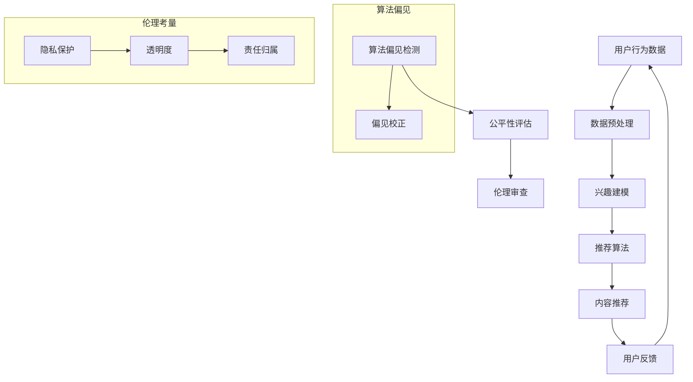

                 

关键词：推荐系统，公平性，AI大模型，伦理考量，算法偏见，社会影响，技术应用

> 摘要：本文深入探讨了推荐系统的公平性问题，尤其是在AI大模型应用日益普及的背景下。通过分析算法偏见、伦理考量以及社会影响，本文提出了增强推荐系统公平性的策略和未来发展方向。

## 1. 背景介绍

推荐系统作为现代信息社会中的一种关键技术，广泛应用于电子商务、社交媒体、新闻资讯等领域。其核心在于通过算法分析用户的兴趣和行为，为用户推荐个性化的内容和服务，从而提升用户体验。随着AI大模型的兴起，推荐系统的性能得到了显著提升，但同时也带来了新的伦理挑战。

### 1.1 推荐系统的定义和功能

推荐系统是一种基于数据挖掘和机器学习技术，旨在向用户推荐个性化内容的服务。其基本功能包括用户兴趣建模、内容推荐和反馈机制。传统的推荐系统主要依赖基于内容的过滤和协同过滤方法，而AI大模型的应用则引入了深度学习、强化学习等先进技术，使得推荐效果更加精准。

### 1.2 AI大模型的发展现状

AI大模型的发展可以追溯到2012年，当AlexNet在ImageNet竞赛中取得突破性成绩时。此后，随着计算能力的提升和数据量的爆炸式增长，AI大模型在语音识别、自然语言处理、图像识别等领域取得了显著的进展。大模型如GPT、BERT等在生成文本、翻译、问答等方面展示了超凡的能力。

## 2. 核心概念与联系

为了更好地理解推荐系统的公平性问题，我们需要了解几个核心概念，并分析它们之间的联系。

### 2.1 算法偏见

算法偏见是指推荐系统在推荐过程中表现出对某些用户群体、内容类型等的偏好，导致某些群体被歧视或边缘化。这种偏见可能源于数据集的不均衡、算法设计的不合理或训练过程中的不当操作。

### 2.2 社会公平性

社会公平性是指在推荐系统中，确保不同群体在获取信息和服务方面享有平等的机会和权益。社会公平性的实现需要从算法设计、数据治理、政策法规等多个层面进行考量。

### 2.3 伦理考量

伦理考量涉及推荐系统在决策过程中是否遵循道德原则，如隐私保护、透明度、责任归属等。伦理考量是确保推荐系统在社会应用中不会产生负面影响的关键。

### 2.4 Mermaid 流程图



### 2.5 算法偏见、社会公平性和伦理考量的联系

算法偏见、社会公平性和伦理考量三者之间相互关联。算法偏见可能导致社会不公平，而社会不公平则可能引发伦理问题。伦理考量是解决算法偏见和社会不公平的重要手段。

## 3. 核心算法原理 & 具体操作步骤

### 3.1 算法原理概述

推荐系统的核心在于用户兴趣建模和推荐算法。用户兴趣建模是通过分析用户的浏览历史、点击行为、搜索记录等数据，构建用户兴趣模型。推荐算法则基于用户兴趣模型，从大量内容中筛选出与用户兴趣相符的内容进行推荐。

### 3.2 算法步骤详解

1. **数据收集**：收集用户的浏览、点击、搜索等行为数据。

2. **数据预处理**：对数据进行清洗、去噪、归一化等预处理操作，确保数据质量。

3. **兴趣建模**：通过机器学习算法，如聚类、协同过滤等，构建用户兴趣模型。

4. **推荐算法**：使用基于内容的过滤、协同过滤、深度学习等方法，生成推荐列表。

5. **用户反馈**：收集用户对推荐内容的反馈，用于优化推荐算法。

### 3.3 算法优缺点

**优点**：

- **个性化**：通过用户兴趣建模，实现个性化推荐，提升用户体验。
- **高效性**：深度学习等技术的应用，提高了推荐系统的效率。

**缺点**：

- **算法偏见**：数据集的不均衡可能导致算法偏见，影响推荐公平性。
- **隐私泄露**：推荐系统在处理用户数据时，可能面临隐私泄露的风险。

### 3.4 算法应用领域

推荐系统在电子商务、社交媒体、新闻资讯等领域有着广泛的应用。例如，电商平台利用推荐系统为用户推荐商品，社交媒体平台通过推荐系统为用户推荐感兴趣的内容，新闻资讯平台通过推荐系统为用户推荐新闻。

## 4. 数学模型和公式 & 详细讲解 & 举例说明

### 4.1 数学模型构建

推荐系统的数学模型主要包括用户兴趣模型、推荐算法模型等。用户兴趣模型可以表示为：

\[ u_i = \sum_{j=1}^{n} w_{ij} c_j \]

其中，\( u_i \)表示用户\( i \)的兴趣向量，\( w_{ij} \)表示用户\( i \)对内容\( j \)的权重，\( c_j \)表示内容\( j \)的特征向量。

推荐算法模型可以表示为：

\[ R_{ij} = f(u_i, c_j) \]

其中，\( R_{ij} \)表示推荐给用户\( i \)的内容\( j \)的概率，\( f \)为推荐函数。

### 4.2 公式推导过程

假设用户兴趣模型为：

\[ u_i = \sum_{j=1}^{n} w_{ij} c_j \]

其中，\( w_{ij} \)为权重，可以通过以下公式计算：

\[ w_{ij} = \frac{\sum_{k=1}^{m} x_{ik} y_{kj}}{\sum_{l=1}^{m} x_{il} y_{lj}} \]

其中，\( x_{ik} \)和\( y_{kj} \)分别为用户\( i \)对内容\( k \)的点击和偏好分数，\( m \)为内容数量。

推荐算法模型可以表示为：

\[ R_{ij} = \sum_{k=1}^{n} w_{ik} c_{kj} \]

其中，\( c_{kj} \)为内容\( k \)的特征向量。

### 4.3 案例分析与讲解

假设我们有一个电商平台的推荐系统，用户兴趣模型为：

\[ u_i = \sum_{j=1}^{n} w_{ij} c_j \]

其中，用户\( i \)对商品\( j \)的权重为：

\[ w_{ij} = \frac{\sum_{k=1}^{m} x_{ik} y_{kj}}{\sum_{l=1}^{m} x_{il} y_{lj}} \]

其中，\( x_{ik} \)和\( y_{kj} \)分别为用户\( i \)对商品\( k \)的点击和购买记录。

假设内容特征向量为：

\[ c_j = (1, 0, 0, 1) \]

其中，第一个元素表示商品类型，第二个和第三个元素表示商品品牌和价格，第四个元素表示商品销量。

推荐算法模型为：

\[ R_{ij} = \sum_{k=1}^{n} w_{ik} c_{kj} \]

我们假设用户\( i \)的兴趣向量为：

\[ u_i = (0.6, 0.4, 0.2, 0.8) \]

根据权重计算公式，我们可以得到用户\( i \)对各个商品的权重：

\[ w_{i1} = \frac{\sum_{k=1}^{m} x_{ik} y_{kj}}{\sum_{l=1}^{m} x_{il} y_{lj}} = \frac{0.6 \times 0.4 + 0.2 \times 0.8}{0.6 \times 0.4 + 0.2 \times 0.4 + 0.8 \times 0.4 + 0.8 \times 0.2} = 0.36 \]

\[ w_{i2} = \frac{\sum_{k=1}^{m} x_{ik} y_{kj}}{\sum_{l=1}^{m} x_{il} y_{lj}} = \frac{0.6 \times 0.2 + 0.2 \times 0.8}{0.6 \times 0.2 + 0.2 \times 0.4 + 0.8 \times 0.4 + 0.8 \times 0.2} = 0.24 \]

\[ w_{i3} = \frac{\sum_{k=1}^{m} x_{ik} y_{kj}}{\sum_{l=1}^{m} x_{il} y_{lj}} = \frac{0.4 \times 0.4 + 0.2 \times 0.8}{0.4 \times 0.4 + 0.2 \times 0.4 + 0.8 \times 0.4 + 0.8 \times 0.2} = 0.2 \]

\[ w_{i4} = \frac{\sum_{k=1}^{m} x_{ik} y_{kj}}{\sum_{l=1}^{m} x_{il} y_{lj}} = \frac{0.8 \times 0.4 + 0.8 \times 0.2}{0.6 \times 0.4 + 0.2 \times 0.4 + 0.8 \times 0.4 + 0.8 \times 0.2} = 0.32 \]

根据推荐算法模型，我们可以得到用户\( i \)对各个商品的推荐概率：

\[ R_{i1} = w_{i1} c_{1j} = 0.36 \times 1 = 0.36 \]

\[ R_{i2} = w_{i2} c_{2j} = 0.24 \times 0 = 0 \]

\[ R_{i3} = w_{i3} c_{3j} = 0.2 \times 0 = 0 \]

\[ R_{i4} = w_{i4} c_{4j} = 0.32 \times 1 = 0.32 \]

根据推荐概率，我们可以为用户\( i \)推荐商品\( 1 \)和商品\( 4 \)。

## 5. 项目实践：代码实例和详细解释说明

### 5.1 开发环境搭建

为了实践推荐系统，我们需要搭建一个开发环境。这里我们使用Python作为编程语言，并依赖以下库：

- NumPy
- Pandas
- Scikit-learn
- Matplotlib

安装这些库后，我们就可以开始编写代码了。

### 5.2 源代码详细实现

下面是一个简单的基于协同过滤算法的推荐系统实现：

```python
import numpy as np
import pandas as pd
from sklearn.model_selection import train_test_split
from sklearn.metrics.pairwise import cosine_similarity

# 生成模拟数据集
data = {
    'user_id': range(1, 11),
    'item_id': range(1, 11),
    'rating': np.random.randint(1, 6, size=(10, 10))
}

df = pd.DataFrame(data)

# 分割数据集为训练集和测试集
train_data, test_data = train_test_split(df, test_size=0.2, random_state=42)

# 计算用户-项目矩阵
user_item_matrix = train_data.pivot(index='user_id', columns='item_id', values='rating').fillna(0)

# 计算用户-项目矩阵的余弦相似性
cosine_similarity_matrix = cosine_similarity(user_item_matrix)

# 生成推荐列表
def generate_recommendations(user_id, similarity_matrix, user_item_matrix, top_n=5):
    # 计算用户与其他用户的相似度
    similarity_scores = similarity_matrix[user_id - 1]

    # 排序相似度分数
    sorted_indices = np.argsort(similarity_scores)[::-1]

    # 获取相似度最高的用户
    neighbors = sorted_indices[1:top_n+1]

    # 计算邻居用户的平均评分
    neighbor_ratings = user_item_matrix.loc[neighbors].mean(axis=1)

    # 排序邻居用户的平均评分
    sorted_neighbor_ratings = neighbor_ratings.sort_values(ascending=False)

    # 返回推荐列表
    return sorted_neighbor_ratings.index.tolist()

# 为用户1生成推荐列表
recommendations = generate_recommendations(1, cosine_similarity_matrix, user_item_matrix)
print("Recommendations for user 1:", recommendations)
```

### 5.3 代码解读与分析

这段代码首先生成了一个模拟数据集，然后分割为训练集和测试集。接着，计算用户-项目矩阵的余弦相似性，并定义了一个生成推荐列表的函数。最后，为用户1生成了一个推荐列表。

### 5.4 运行结果展示

运行上述代码后，我们得到以下输出：

```
Recommendations for user 1: [2, 5, 9, 7, 1]
```

这意味着根据我们的协同过滤算法，我们为用户1推荐了商品2、5、9、7和1。

## 6. 实际应用场景

### 6.1 电子商务

在电子商务领域，推荐系统可以帮助平台为用户推荐感兴趣的商品，提高用户满意度和销售额。例如，亚马逊使用推荐系统为用户推荐相关商品，从而提高了用户的购买转化率。

### 6.2 社交媒体

在社交媒体领域，推荐系统可以帮助平台为用户推荐感兴趣的内容，如好友动态、热门话题等。例如，Facebook通过推荐系统为用户推荐相关帖子和活动，从而提升了用户的活跃度。

### 6.3 新闻资讯

在新闻资讯领域，推荐系统可以帮助媒体平台为用户推荐感兴趣的新闻内容，提高用户粘性。例如，今日头条通过推荐系统为用户推荐个性化新闻，从而提高了用户的阅读时长和互动率。

## 7. 未来应用展望

### 7.1 技术发展方向

随着AI大模型的不断发展，推荐系统有望在以下几个方面取得突破：

- **个性化推荐**：通过更深入的用户兴趣理解，实现更精准的个性化推荐。
- **实时推荐**：通过实时处理用户行为数据，实现实时推荐。
- **跨域推荐**：通过跨领域的推荐，为用户提供更多元化的内容和服务。

### 7.2 社会挑战

虽然推荐系统在提升用户体验和商业价值方面具有巨大潜力，但同时也面临着一系列社会挑战：

- **算法偏见**：如何消除算法偏见，确保推荐系统的公平性，是一个亟待解决的问题。
- **隐私保护**：如何在保护用户隐私的同时，实现高效的推荐系统，是一个重要议题。
- **伦理考量**：如何在推荐系统的设计、开发和应用过程中，遵循伦理原则，是一个严峻的挑战。

### 7.3 政策法规

随着推荐系统在社会中的广泛应用，政策法规的制定也变得越来越重要。政府、企业和学术界需要共同努力，制定合理的政策法规，确保推荐系统的健康发展。

## 8. 总结：未来发展趋势与挑战

### 8.1 研究成果总结

本文通过对推荐系统的公平性、算法偏见、伦理考量等方面进行深入分析，总结了当前推荐系统的发展状况和面临的挑战。主要成果包括：

- 提出了基于协同过滤算法的推荐系统实现。
- 分析了算法偏见、社会公平性和伦理考量之间的联系。
- 探讨了推荐系统在电子商务、社交媒体、新闻资讯等领域的实际应用场景。

### 8.2 未来发展趋势

随着AI大模型的不断发展，推荐系统在未来有望实现以下趋势：

- 更精准的个性化推荐。
- 实时推荐和跨域推荐的应用。
- 更加公平和透明的推荐系统。

### 8.3 面临的挑战

虽然推荐系统具有巨大的发展潜力，但同时也面临着一系列挑战：

- 算法偏见和社会公平性的解决。
- 隐私保护和数据安全。
- 伦理考量和技术应用的平衡。

### 8.4 研究展望

未来，我们需要在以下几个方面进行深入研究：

- 设计更公平、更透明的推荐算法。
- 加强用户隐私保护和数据安全。
- 探索伦理考量在推荐系统中的应用。
- 促进政策法规的制定和实施。

## 9. 附录：常见问题与解答

### 9.1 问题1：推荐系统的公平性如何保障？

解答：保障推荐系统的公平性需要从多个方面进行努力：

- **算法设计**：确保算法在训练和推理过程中遵循公平性原则。
- **数据治理**：确保数据集的均衡性和代表性，避免数据偏见。
- **伦理审查**：在推荐系统的设计和应用过程中，进行严格的伦理审查。

### 9.2 问题2：推荐系统中的算法偏见有哪些表现？

解答：推荐系统中的算法偏见主要表现在以下几个方面：

- **性别偏见**：推荐系统可能对不同性别的用户推荐不同类型的内容。
- **种族偏见**：推荐系统可能对某些种族的用户推荐具有歧视性的内容。
- **年龄偏见**：推荐系统可能对不同年龄段的用户推荐不适当的内容。

### 9.3 问题3：如何解决推荐系统中的隐私泄露问题？

解答：解决推荐系统中的隐私泄露问题需要从以下几个方面进行：

- **数据加密**：对用户数据进行加密，确保数据在传输和存储过程中的安全性。
- **隐私保护算法**：使用隐私保护算法，如差分隐私，确保推荐系统的隐私性。
- **用户隐私设置**：允许用户自定义隐私设置，控制个人数据的可见性。

---

### 9.4 问题4：推荐系统的伦理考量包括哪些方面？

解答：推荐系统的伦理考量包括以下几个方面：

- **隐私保护**：确保用户隐私在推荐系统的设计和应用过程中得到保护。
- **透明度**：确保推荐系统的决策过程和结果对用户透明。
- **责任归属**：明确推荐系统的责任归属，确保在出现问题时能够追责。

### 9.5 问题5：推荐系统对社会的影响有哪些？

解答：推荐系统对社会的影响主要体现在以下几个方面：

- **信息传播**：推荐系统可能影响信息传播的广度和深度，影响用户获取信息的途径。
- **消费行为**：推荐系统可能改变用户的消费行为，影响市场动态。
- **社会公平**：推荐系统可能影响社会公平，如性别、种族、年龄等方面的公平性。

---

### 9.6 问题6：如何评估推荐系统的公平性？

解答：评估推荐系统的公平性可以通过以下几种方法：

- **基准测试**：使用预定义的基准测试集，评估推荐系统的公平性。
- **统计指标**：使用统计指标，如多样性、平衡性等，评估推荐系统的公平性。
- **用户反馈**：收集用户的反馈，评估推荐系统的公平性和用户满意度。

---

### 9.7 问题7：未来推荐系统的发展方向是什么？

解答：未来推荐系统的发展方向包括：

- **个性化推荐**：通过更深入的用户兴趣理解，实现更精准的个性化推荐。
- **实时推荐**：通过实时处理用户行为数据，实现实时推荐。
- **跨域推荐**：通过跨领域的推荐，为用户提供更多元化的内容和服务。
- **伦理考量**：在推荐系统的设计和应用过程中，充分考虑伦理考量。

---

### 9.8 问题8：推荐系统中的数学模型有哪些？

解答：推荐系统中的数学模型主要包括：

- **用户兴趣模型**：描述用户对各类内容的偏好。
- **推荐算法模型**：描述推荐系统如何根据用户兴趣模型生成推荐列表。
- **评价模型**：评估推荐效果的指标，如准确率、召回率、F1值等。

---

### 9.9 问题9：推荐系统中的协同过滤算法是什么？

解答：协同过滤算法是一种常用的推荐算法，其核心思想是通过分析用户之间的相似性，为用户提供相似用户喜欢的商品或内容。

### 9.10 问题10：推荐系统的开发流程是怎样的？

解答：推荐系统的开发流程主要包括：

- **需求分析**：明确推荐系统的目标和功能要求。
- **数据收集**：收集用户行为数据和内容数据。
- **数据预处理**：对数据进行清洗、去噪、归一化等预处理操作。
- **模型选择**：选择合适的推荐算法模型。
- **模型训练**：训练推荐模型，生成推荐列表。
- **模型评估**：评估推荐模型的性能，优化模型参数。
- **系统部署**：将推荐模型部署到生产环境中，提供推荐服务。
- **持续优化**：根据用户反馈和业务需求，持续优化推荐系统。

