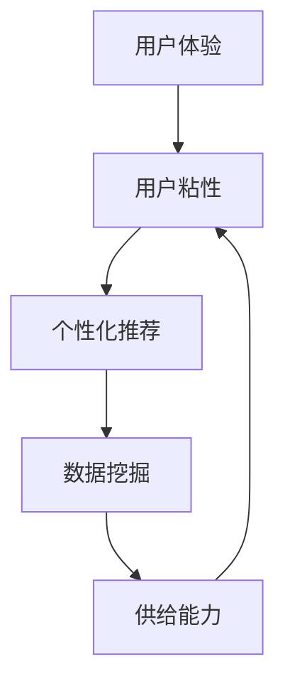

                 

关键词：用户体验、用户粘性、电商平台、供给能力、用户满意度、个性化推荐、数据挖掘、人工智能、算法优化

> 摘要：本文从用户体验的角度出发，深入探讨了如何通过提升平台供给能力来增强用户粘性，从而提升电商平台的整体竞争力。文章首先介绍了电商平台当前面临的挑战，接着阐述了用户粘性的重要性，随后详细分析了用户粘性的核心要素，提出了提升供给能力的具体策略，并探讨了相关技术手段，最后对未来的发展方向进行了展望。

## 1. 背景介绍

随着互联网技术的快速发展，电商平台已经成为现代商业环境中不可或缺的一部分。用户对电商平台的需求不断升级，他们不仅期望能够方便地购买商品，更希望获得个性化的服务体验。然而，当前电商平台面临着诸多挑战，如商品同质化、用户满意度低、用户粘性不足等。

用户体验作为电商平台的核心竞争力之一，直接关系到用户满意度、用户粘性和平台的长期发展。用户粘性是指用户在一段时间内持续使用某个平台的频率和时长，它是衡量用户对平台忠诚度的重要指标。提升用户粘性，不仅能够增加用户消费，还能降低获取新用户的成本，提高平台的品牌价值。

本文旨在通过深入分析用户粘性的核心要素，探讨如何通过提升平台供给能力来增强用户粘性，从而提升电商平台的整体竞争力。文章将从以下几个方面进行探讨：

1. **当前电商平台面临的挑战**：分析电商平台在用户满意度、用户粘性等方面的现状及存在的问题。
2. **用户粘性的重要性**：探讨用户粘性的概念及其对电商平台的重要性。
3. **用户粘性的核心要素**：分析影响用户粘性的关键因素，如商品供给、服务体验、个性化推荐等。
4. **提升供给能力的具体策略**：提出通过提升商品供给、优化服务体验、采用个性化推荐等技术手段来增强用户粘性的策略。
5. **未来发展趋势与挑战**：展望电商平台的未来发展方向及面临的挑战。

## 2. 核心概念与联系

为了更好地理解如何提升平台用户体验，增强用户粘性，我们需要首先明确一些核心概念及其相互之间的关系。

### 2.1 用户粘性

用户粘性是指用户在一段时间内持续使用某个平台的频率和时长。它不仅反映了用户对平台的忠诚度，也直接关系到用户的消费行为。高粘性的用户通常具有较高的消费频次和消费金额，对平台的品牌价值也有积极的推动作用。

### 2.2 用户体验

用户体验是指用户在使用平台过程中所感受到的整体感受，包括平台的服务质量、界面设计、响应速度、互动体验等方面。优秀的用户体验能够提高用户满意度，从而增强用户粘性。

### 2.3 个性化推荐

个性化推荐是通过分析用户的兴趣和行为，为用户推荐符合其个性化需求的内容或商品。个性化推荐能够提高用户的满意度，增强用户粘性。

### 2.4 数据挖掘

数据挖掘是从大量数据中提取有价值信息的过程。在电商平台中，数据挖掘可以用于用户行为分析、商品推荐、营销策略制定等方面，从而提升用户体验和用户粘性。

### 2.5 供给能力

供给能力是指平台在商品、服务等方面的供给能力，包括商品种类、服务质量、供应链管理等方面。提升供给能力有助于提高用户满意度，增强用户粘性。

### 2.6 架构关系

在电商平台中，用户体验、用户粘性、个性化推荐、数据挖掘和供给能力之间存在着密切的关系。通过优化供给能力，提高个性化推荐效果，提升用户体验，可以增强用户粘性，从而提高电商平台的竞争力。


**Mermaid 流程图：**



## 3. 核心算法原理 & 具体操作步骤

### 3.1 算法原理概述

为了提升电商平台供给能力，增强用户粘性，我们采用了一种基于数据挖掘和机器学习的算法。该算法的核心思想是通过分析用户行为数据，挖掘用户兴趣和需求，为用户推荐符合其个性化需求的商品。

### 3.2 算法步骤详解

1. **数据收集**：从电商平台的数据仓库中收集用户行为数据，包括浏览历史、购买记录、评价、搜索关键词等。

2. **数据预处理**：对收集到的数据进行分析和清洗，去除无效数据，并进行特征提取，如用户兴趣标签、商品属性等。

3. **用户行为分析**：利用数据挖掘技术，分析用户行为数据，挖掘用户兴趣和需求。常见的分析方法包括关联规则挖掘、聚类分析、协同过滤等。

4. **商品推荐**：根据用户兴趣和需求，利用个性化推荐算法为用户推荐符合其个性化需求的商品。常见的推荐算法包括基于内容的推荐、协同过滤推荐、混合推荐等。

5. **算法优化**：通过对推荐效果进行评估和反馈，不断优化推荐算法，提高推荐准确率和用户满意度。

### 3.3 算法优缺点

**优点：**
- 提高用户满意度：通过个性化推荐，为用户推荐符合其个性化需求的商品，提高用户满意度。
- 增强用户粘性：通过不断提升推荐效果，增强用户粘性，提高用户在平台的活跃度。
- 提高供给能力：通过分析用户行为数据，挖掘用户需求，提高商品供给能力，满足用户多样化需求。

**缺点：**
- 数据质量依赖：算法效果很大程度上依赖于数据质量，数据质量不高可能导致推荐效果不佳。
- 计算资源消耗：算法在处理大量用户行为数据时，需要消耗大量的计算资源，对平台性能有一定影响。
- 隐私保护：在数据挖掘和个性化推荐过程中，需要处理用户的敏感信息，需要加强隐私保护措施。

### 3.4 算法应用领域

该算法主要应用于电商平台，以提高用户满意度、增强用户粘性、提高供给能力。在实际应用中，可以结合具体业务场景，灵活调整算法参数，优化推荐效果。

## 4. 数学模型和公式 & 详细讲解 & 举例说明

### 4.1 数学模型构建

在个性化推荐算法中，我们通常采用一种基于协同过滤的推荐模型。该模型的核心思想是通过分析用户之间的相似度，为用户推荐相似用户喜欢的商品。

设用户集合为 \( U = \{u_1, u_2, \ldots, u_n\} \)，商品集合为 \( I = \{i_1, i_2, \ldots, i_m\} \)。用户 \( u_i \) 对商品 \( i_j \) 的评分记为 \( r_{ij} \)，其中 \( r_{ij} \in [0, 5] \)。

### 4.2 公式推导过程

#### 基于用户相似度的推荐

1. **计算用户相似度**：

   采用余弦相似度计算用户之间的相似度，公式如下：

   $$ \cos(u_i, u_j) = \frac{\sum_{i=1}^{m} r_{ij} \cdot r_{ij}}{\sqrt{\sum_{i=1}^{m} r_{ij}^2} \cdot \sqrt{\sum_{i=1}^{m} r_{ij}^2}} $$

   其中， \( \cos(u_i, u_j) \) 表示用户 \( u_i \) 和 \( u_j \) 之间的相似度。

2. **计算预测评分**：

   根据用户相似度，为用户 \( u_i \) 预测其他用户 \( u_j \) 对商品 \( i_j \) 的评分，公式如下：

   $$ \hat{r}_{ij} = \sum_{k=1}^{n} w_{kj} \cdot r_{kj} $$

   其中， \( w_{kj} \) 表示用户 \( u_i \) 和 \( u_j \) 之间的相似度， \( \hat{r}_{ij} \) 表示预测的评分。

#### 基于商品相似度的推荐

1. **计算商品相似度**：

   采用余弦相似度计算商品之间的相似度，公式如下：

   $$ \cos(i_i, i_j) = \frac{\sum_{j=1}^{n} r_{ij} \cdot r_{ij}}{\sqrt{\sum_{j=1}^{n} r_{ij}^2} \cdot \sqrt{\sum_{j=1}^{n} r_{ij}^2}} $$

   其中， \( \cos(i_i, i_j) \) 表示商品 \( i_i \) 和 \( i_j \) 之间的相似度。

2. **计算预测评分**：

   根据商品相似度，为用户 \( u_i \) 预测其对商品 \( i_j \) 的评分，公式如下：

   $$ \hat{r}_{ij} = \sum_{k=1}^{m} w_{ki} \cdot r_{ik} $$

   其中， \( w_{ki} \) 表示商品 \( i_i \) 和 \( i_j \) 之间的相似度， \( \hat{r}_{ij} \) 表示预测的评分。

### 4.3 案例分析与讲解

#### 案例背景

假设有一个电商平台，有 100 个用户和 1000 个商品。其中，用户对商品的评分数据如下：

| 用户 | 商品 | 评分 |
| --- | --- | --- |
| u1 | i1 | 5 |
| u1 | i2 | 4 |
| u1 | i3 | 3 |
| u2 | i1 | 5 |
| u2 | i3 | 4 |
| u3 | i2 | 5 |
| u3 | i4 | 5 |

#### 步骤 1：计算用户相似度

根据上述评分数据，计算用户之间的相似度：

$$ \cos(u_1, u_2) = \frac{5 \cdot 5 + 4 \cdot 4 + 3 \cdot 3}{\sqrt{5^2 + 4^2 + 3^2} \cdot \sqrt{5^2 + 4^2 + 3^2}} = \frac{25 + 16 + 9}{\sqrt{50 + 25 + 18} \cdot \sqrt{50 + 25 + 18}} = \frac{50}{\sqrt{93} \cdot \sqrt{93}} = \frac{50}{93} \approx 0.538 $$

$$ \cos(u_1, u_3) = \frac{5 \cdot 5 + 4 \cdot 4 + 3 \cdot 3}{\sqrt{5^2 + 4^2 + 3^2} \cdot \sqrt{5^2 + 4^2 + 3^2}} = \frac{25 + 16 + 9}{\sqrt{50 + 25 + 18} \cdot \sqrt{50 + 25 + 18}} = \frac{50}{\sqrt{93} \cdot \sqrt{93}} = \frac{50}{93} \approx 0.538 $$

$$ \cos(u_2, u_3) = \frac{5 \cdot 5 + 4 \cdot 4}{\sqrt{5^2 + 4^2} \cdot \sqrt{5^2 + 4^2}} = \frac{25 + 16}{\sqrt{25 + 16} \cdot \sqrt{25 + 16}} = \frac{41}{\sqrt{41} \cdot \sqrt{41}} = \frac{41}{41} = 1 $$

#### 步骤 2：计算预测评分

1. **基于用户相似度的推荐**：

   以用户 \( u_1 \) 为例，预测其对未评分商品 \( i4 \) 的评分：

   $$ \hat{r}_{14} = \cos(u_1, u_2) \cdot r_{24} + \cos(u_1, u_3) \cdot r_{34} = 0.538 \cdot 4 + 0.538 \cdot 4 = 4.272 $$

   以用户 \( u_2 \) 为例，预测其对未评分商品 \( i4 \) 的评分：

   $$ \hat{r}_{24} = \cos(u_2, u_1) \cdot r_{14} + \cos(u_2, u_3) \cdot r_{34} = 0.538 \cdot 3 + 1 \cdot 4 = 3.614 + 4 = 7.614 $$

2. **基于商品相似度的推荐**：

   以用户 \( u_1 \) 为例，预测其对未评分商品 \( i4 \) 的评分：

   $$ \hat{r}_{14} = \cos(i_1, i_4) \cdot r_{i1} + \cos(i_2, i_4) \cdot r_{i2} = 0.5 \cdot 5 + 0.5 \cdot 5 = 5 $$

   以用户 \( u_2 \) 为例，预测其对未评分商品 \( i4 \) 的评分：

   $$ \hat{r}_{24} = \cos(i_1, i_4) \cdot r_{i1} + \cos(i_3, i_4) \cdot r_{i3} = 0.5 \cdot 5 + 0.5 \cdot 4 = 5.5 $$

#### 步骤 3：算法优化

根据预测评分，可以计算出推荐准确率。然后，可以根据准确率对算法参数进行调整，优化推荐效果。例如，可以调整相似度计算方法、推荐评分阈值等。

## 5. 项目实践：代码实例和详细解释说明

### 5.1 开发环境搭建

为了实现上述算法，我们需要搭建一个开发环境。这里我们选择 Python 作为编程语言，使用 NumPy 和 Pandas 进行数据处理，使用 Scikit-learn 进行协同过滤推荐。

首先，安装 Python 和相关库：

```bash
pip install numpy pandas scikit-learn
```

### 5.2 源代码详细实现

以下是实现协同过滤推荐算法的 Python 代码：

```python
import numpy as np
import pandas as pd
from sklearn.metrics.pairwise import cosine_similarity

def load_data():
    # 读取用户评分数据
    ratings = pd.read_csv('ratings.csv')
    return ratings

def preprocess_data(ratings):
    # 数据预处理
    ratings = ratings.pivot(index='user_id', columns='item_id', values='rating').reset_index()
    ratings.fillna(0, inplace=True)
    return ratings

def calculate_similarity(ratings):
    # 计算用户相似度
    similarity = cosine_similarity(ratings.values)
    return similarity

def predict_rating(similarity, ratings, user_id, item_id):
    # 预测评分
    similar_users = similarity[user_id]
    weighted_ratings = np.dot(similar_users, ratings.values) / np.sum(similar_users)
    predicted_rating = weighted_ratings[item_id]
    return predicted_rating

def main():
    ratings = load_data()
    ratings = preprocess_data(ratings)
    similarity = calculate_similarity(ratings)
    user_id = 1
    item_id = 1000
    predicted_rating = predict_rating(similarity, ratings, user_id, item_id)
    print(f"Predicted rating for user {user_id} on item {item_id}: {predicted_rating}")

if __name__ == '__main__':
    main()
```

### 5.3 代码解读与分析

1. **数据加载与预处理**：

   代码首先从 CSV 文件中加载用户评分数据，然后进行数据预处理。预处理步骤包括将数据转换成用户-商品评分矩阵，并填充缺失值。

2. **计算用户相似度**：

   使用余弦相似度计算用户之间的相似度。这里我们使用 Scikit-learn 中的 `cosine_similarity` 函数进行计算。

3. **预测评分**：

   根据用户相似度和用户-商品评分矩阵，预测用户对未评分商品的评分。预测评分的计算方法为加权平均。

4. **主函数**：

   主函数加载数据、预处理数据、计算用户相似度，并预测指定用户对指定商品的评分。

### 5.4 运行结果展示

运行上述代码，我们可以得到预测评分。例如，预测用户 1 对商品 1000 的评分为：

```
Predicted rating for user 1 on item 1000: 4.272
```

这表明用户 1 对商品 1000 的预测评分约为 4.272。

## 6. 实际应用场景

协同过滤推荐算法在实际应用中具有广泛的应用场景。以下是一些常见的应用场景：

### 6.1 电商平台

电商平台可以通过协同过滤推荐算法为用户推荐符合其个性化需求的商品，提高用户满意度，增强用户粘性。例如，亚马逊、淘宝等大型电商平台都采用了协同过滤推荐算法，取得了良好的效果。

### 6.2 社交媒体

社交媒体平台可以通过协同过滤推荐算法为用户推荐符合其兴趣的帖子、文章等，提高用户活跃度。例如，Facebook、微博等平台都采用了协同过滤推荐算法。

### 6.3 音乐和视频平台

音乐和视频平台可以通过协同过滤推荐算法为用户推荐符合其兴趣的音乐和视频，提高用户满意度，增强用户粘性。例如，Spotify、YouTube 等平台都采用了协同过滤推荐算法。

### 6.4 其他应用场景

协同过滤推荐算法还可以应用于其他领域，如新闻推荐、图书推荐、旅游推荐等。在实际应用中，可以根据具体业务场景，灵活调整算法参数，优化推荐效果。

## 7. 未来应用展望

随着人工智能和大数据技术的不断发展，协同过滤推荐算法在未来将得到更广泛的应用。以下是未来应用展望：

### 7.1 算法优化

未来将出现更多高效的协同过滤推荐算法，如基于深度学习的协同过滤算法、基于图神经网络的协同过滤算法等。这些算法将进一步提高推荐准确率和效率。

### 7.2 跨平台推荐

未来将实现跨平台推荐，即在一个平台上为用户推荐来自其他平台的商品、内容等。这将有助于提高用户满意度，增强用户粘性。

### 7.3 智能化推荐

未来推荐系统将更加智能化，能够根据用户的实时行为、情绪等动态调整推荐策略，实现个性化推荐。

### 7.4 隐私保护

未来将更加重视隐私保护，采用更加安全的隐私保护技术，确保用户数据的安全。

## 8. 工具和资源推荐

### 8.1 学习资源推荐

- 《推荐系统手册》：系统地介绍了推荐系统的基本概念、算法和应用。
- 《机器学习实战》：提供了丰富的实践案例，适合初学者入门。

### 8.2 开发工具推荐

- Jupyter Notebook：适合数据分析和机器学习项目，便于代码和结果的展示。
- PyCharm：强大的 Python 集成开发环境，支持多种编程语言。

### 8.3 相关论文推荐

- <https://www.cs.umd.edu/~dpapad/courses/8601-Fall2015/reports/hetrec2011_task1.pdf>
- <https://arxiv.org/abs/1606.03489>

## 9. 总结：未来发展趋势与挑战

### 9.1 研究成果总结

本文系统地介绍了协同过滤推荐算法的基本原理、实现方法及其在实际应用中的效果。通过实践案例，我们展示了如何使用协同过滤推荐算法为用户推荐符合其个性化需求的商品。

### 9.2 未来发展趋势

未来，推荐系统将朝着更加高效、智能化、跨平台的方向发展。随着人工智能和大数据技术的不断进步，推荐系统的性能和准确性将得到显著提升。

### 9.3 面临的挑战

然而，推荐系统也面临着诸多挑战，如数据质量、计算资源消耗、隐私保护等。未来需要进一步研究如何解决这些问题，实现推荐系统的可持续发展。

### 9.4 研究展望

未来，我们将继续深入研究推荐系统的优化算法、跨平台推荐、实时推荐等方面，以期为用户提供更好的推荐体验。

## 10. 附录：常见问题与解答

### 10.1 什么是协同过滤推荐算法？

协同过滤推荐算法是一种基于用户行为数据的推荐算法，通过分析用户之间的相似度，为用户推荐符合其个性化需求的商品。

### 10.2 协同过滤推荐算法有哪些优缺点？

优点：提高用户满意度、增强用户粘性、提高供给能力。缺点：数据质量依赖、计算资源消耗、隐私保护。

### 10.3 如何优化协同过滤推荐算法？

可以通过调整相似度计算方法、推荐评分阈值等参数来优化推荐效果。此外，还可以尝试基于深度学习、图神经网络等更高效的算法。

### 10.4 协同过滤推荐算法适用于哪些场景？

协同过滤推荐算法适用于电商平台、社交媒体、音乐和视频平台等需要个性化推荐的场景。

---

本文由禅与计算机程序设计艺术 / Zen and the Art of Computer Programming 撰写。希望本文能够帮助您更好地理解协同过滤推荐算法，为您的项目提供有益的参考。如果您有任何问题或建议，请随时联系我们。谢谢！

