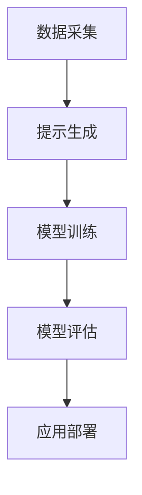

                 

关键词：AI开发、提示工程、算法、应用场景、数学模型、项目实践、工具推荐、未来展望

> 摘要：随着人工智能技术的迅速发展，提示工程作为一种重要的AI开发工具，正日益受到关注。本文将深入探讨提示工程在AI开发中的应用，包括核心概念、算法原理、数学模型、项目实践以及未来发展趋势，旨在为读者提供全面的技术见解和实践指导。

## 1. 背景介绍

人工智能（AI）作为现代科技领域的明星，已经深刻影响了各行各业。AI的应用范围从简单的图像识别、自然语言处理，到复杂的决策支持、自动化控制等，都在不断拓展。然而，AI的开发过程并非一帆风顺，其中涉及到大量的数据准备、算法优化、模型训练等环节。为了提高开发效率，减少人力和时间成本，各种工程化工具和技术应运而生，提示工程便是其中之一。

提示工程（Prompt Engineering）是指通过设计有效的提示（Prompt），引导AI模型进行学习、推理和决策的过程。提示工程的核心目标是提升AI模型在特定任务上的表现，使其更智能、更灵活、更易于应用。随着AI技术的不断进步，提示工程的应用领域也越来越广泛，从语音识别、图像处理，到推荐系统、聊天机器人等，都有其身影。

本文将从以下几个方面对提示工程在AI开发中的应用进行深入探讨：

1. **核心概念与联系**：介绍提示工程的基本概念，以及与相关技术的关系。
2. **核心算法原理 & 具体操作步骤**：分析提示工程的核心算法原理，并详细阐述操作步骤。
3. **数学模型和公式 & 详细讲解 & 举例说明**：讲解提示工程中涉及到的数学模型和公式，并通过案例进行说明。
4. **项目实践：代码实例和详细解释说明**：提供实际项目中的代码实例，并进行详细解读。
5. **实际应用场景**：分析提示工程在不同领域中的应用场景。
6. **工具和资源推荐**：推荐学习资源、开发工具和相关论文。
7. **总结：未来发展趋势与挑战**：总结研究成果，探讨未来发展趋势和面临的挑战。

## 2. 核心概念与联系

### 提示（Prompt）

提示是提示工程中的核心概念，它是一种引导AI模型学习、推理和决策的文本或语音输入。一个有效的提示应当具备以下特点：

- **明确性**：提示应当清晰明确，避免歧义，确保AI模型能够正确理解。
- **针对性**：提示应当针对特定的任务或问题，提高AI模型在特定领域的表现。
- **灵活性**：提示应当具有一定的灵活性，以适应不同的数据和场景。

### 提示工程与相关技术

提示工程与许多其他技术密切相关，如自然语言处理（NLP）、机器学习（ML）等。以下是几个关键联系：

- **自然语言处理（NLP）**：NLP是AI领域中处理文本信息的技术，是提示工程的基础。通过NLP技术，可以生成更准确、更有针对性的提示。
- **机器学习（ML）**：ML是AI的核心技术之一，提示工程依赖于ML算法，如深度学习、强化学习等，来提升AI模型的表现。
- **数据工程**：数据工程是AI开发中的重要环节，高质量的提示生成依赖于高质量的数据处理。

### 提示工程架构

提示工程的架构通常包括以下几个部分：

- **数据采集**：收集与任务相关的数据，为提示生成提供素材。
- **提示生成**：利用NLP和ML技术，生成高质量的提示。
- **模型训练**：使用生成的提示，对AI模型进行训练。
- **模型评估**：评估模型在特定任务上的表现，并进行调整。
- **应用部署**：将训练好的模型部署到实际应用中。

### Mermaid 流程图

以下是一个简化的提示工程流程图的Mermaid表示：



## 3. 核心算法原理 & 具体操作步骤

### 3.1 算法原理概述

提示工程的核心算法主要包括提示生成、模型训练和模型评估。以下是这些算法的基本原理：

#### 提示生成

提示生成是提示工程的关键步骤，其目标是生成高质量的提示。常见的提示生成方法包括：

- **基于规则的方法**：通过定义一系列规则，生成符合要求的提示。
- **基于统计的方法**：利用统计模型，如生成对抗网络（GAN），生成高质量的提示。
- **基于机器学习的方法**：使用机器学习算法，如深度学习，从大量数据中学习生成高质量的提示。

#### 模型训练

模型训练是使用生成的提示来训练AI模型。常用的训练方法包括：

- **监督学习**：使用标记好的数据对模型进行训练。
- **无监督学习**：使用未标记的数据对模型进行训练，如生成对抗网络。
- **强化学习**：通过奖励机制，让模型在交互中学习。

#### 模型评估

模型评估是衡量模型在特定任务上表现的重要步骤。常用的评估指标包括：

- **准确率**：预测正确的样本占总样本的比例。
- **召回率**：预测正确的正样本占总正样本的比例。
- **F1值**：准确率和召回率的调和平均值。

### 3.2 算法步骤详解

#### 提示生成

1. **数据采集**：从互联网、数据库等渠道收集与任务相关的数据。
2. **数据预处理**：对采集到的数据进行清洗、去重、归一化等处理。
3. **生成提示**：使用NLP和ML技术，生成高质量的提示。例如，可以使用BERT模型对文本数据进行编码，然后利用生成对抗网络（GAN）生成高质量的提示。

#### 模型训练

1. **选择模型**：根据任务需求，选择合适的模型，如BERT、GPT等。
2. **准备数据**：将生成的提示与训练数据进行配对，准备用于训练的数据集。
3. **训练模型**：使用训练数据集，对模型进行训练。训练过程中，可以调整学习率、批次大小等参数，以优化模型性能。

#### 模型评估

1. **划分数据集**：将训练数据集划分为训练集和验证集。
2. **评估模型**：使用验证集对模型进行评估，计算准确率、召回率等指标。
3. **调整模型**：根据评估结果，调整模型参数，优化模型性能。

### 3.3 算法优缺点

#### 优点

- **高效性**：提示工程能够显著提高AI模型在特定任务上的表现。
- **灵活性**：提示工程可以根据不同的任务需求，生成针对性的提示。
- **通用性**：提示工程适用于多种AI任务，如NLP、图像处理等。

#### 缺点

- **依赖数据**：提示工程的性能很大程度上依赖于数据质量，数据质量差可能导致提示生成质量低下。
- **计算资源**：提示工程涉及到大量的数据处理和模型训练，需要消耗大量计算资源。

### 3.4 算法应用领域

提示工程的应用领域非常广泛，包括但不限于：

- **自然语言处理（NLP）**：如文本分类、机器翻译、问答系统等。
- **图像处理**：如图像识别、图像生成等。
- **推荐系统**：如商品推荐、内容推荐等。
- **自动化控制**：如自动驾驶、无人机控制等。

## 4. 数学模型和公式 & 详细讲解 & 举例说明

### 4.1 数学模型构建

在提示工程中，常用的数学模型包括生成对抗网络（GAN）、循环神经网络（RNN）、变换器（Transformer）等。以下是这些模型的数学描述：

#### 生成对抗网络（GAN）

GAN由生成器（Generator）和判别器（Discriminator）组成。生成器的目标是生成与真实数据相似的数据，判别器的目标是区分真实数据和生成数据。

- **生成器**：生成器通过噪声向量生成假数据，公式为：
  $$G(z) = \mu_z + \sigma_z \odot \phi(z)$$
  其中，$z$是噪声向量，$\mu_z$和$\sigma_z$分别是均值和方差，$\phi(z)$是生成器的隐层激活函数。

- **判别器**：判别器的目标是区分真实数据和生成数据，公式为：
  $$D(x) = f(x; \theta_D)$$
  其中，$x$是真实数据，$\theta_D$是判别器的参数，$f(\cdot; \theta_D)$是判别器的激活函数。

#### 循环神经网络（RNN）

RNN是一种能够处理序列数据的神经网络，其基本结构包括输入门、遗忘门和输出门。

- **输入门**：用于更新隐藏状态，公式为：
  $$i_t = \sigma(W_i [h_{t-1}, x_t] + b_i)$$

- **遗忘门**：用于更新隐藏状态，公式为：
  $$f_t = \sigma(W_f [h_{t-1}, x_t] + b_f)$$

- **输出门**：用于生成输出，公式为：
  $$o_t = \sigma(W_o [h_{t-1}, x_t] + b_o)$$

#### 变换器（Transformer）

变换器是一种基于自注意力机制的神经网络结构，其核心是自注意力机制。

- **自注意力**：公式为：
  $$\text{Attention}(Q, K, V) = \text{softmax}\left(\frac{QK^T}{\sqrt{d_k}}\right)V$$
  其中，$Q$是查询向量，$K$是键向量，$V$是值向量，$d_k$是键向量的维度。

### 4.2 公式推导过程

以下是对GAN中生成器和判别器公式的推导：

#### 生成器推导

生成器的目标是生成与真实数据相似的数据，其基本思想是通过噪声向量生成隐层状态，然后通过隐层状态生成输出数据。

1. **隐层状态生成**：
   $$z = \mu_z + \sigma_z \odot \phi(z)$$
   其中，$\mu_z$和$\sigma_z$分别是均值和方差，$\phi(z)$是生成器的隐层激活函数。

2. **输出数据生成**：
   $$x_G = f(G(z); \theta_G)$$
   其中，$G(z)$是生成器的输出，$\theta_G$是生成器的参数。

#### 判别器推导

判别器的目标是区分真实数据和生成数据。

1. **输入数据表示**：
   $$x = f(x; \theta_D)$$
   其中，$x$是输入数据，$\theta_D$是判别器的参数。

2. **输出概率**：
   $$D(x) = \text{sigmoid}(W_D \cdot x + b_D)$$
   其中，$W_D$和$b_D$分别是权重和偏置。

### 4.3 案例分析与讲解

以下是一个简单的GAN案例，用于生成手写数字。

#### 数据集

使用MNIST数据集，包含10万张手写数字图像，每张图像是28x28的像素矩阵。

#### 生成器和判别器

生成器和判别器都是全连接神经网络，分别有100个和1000个神经元。

#### 训练过程

1. **生成器训练**：
   - 使用随机噪声向量作为输入，生成隐层状态。
   - 使用隐层状态生成手写数字图像。
   - 对生成的图像进行判别器预测。

2. **判别器训练**：
   - 使用真实手写数字图像作为输入，进行判别器预测。
   - 使用生成的手写数字图像作为输入，进行判别器预测。

#### 模型评估

通过比较生成器和判别器的预测结果，评估模型性能。生成器的目标是让判别器无法区分真实数据和生成数据。

## 5. 项目实践：代码实例和详细解释说明

### 5.1 开发环境搭建

在开始编写代码之前，我们需要搭建一个合适的项目开发环境。以下是一个基于Python和PyTorch的简单示例。

1. **安装Python**：确保Python环境已安装，版本建议为3.8及以上。

2. **安装PyTorch**：在终端执行以下命令：
   ```bash
   pip install torch torchvision
   ```

3. **创建项目目录**：
   ```bash
   mkdir prompt_engineering_example
   cd prompt_engineering_example
   ```

4. **创建Python脚本**：
   ```bash
   touch train.py
   touch generate.py
   ```

### 5.2 源代码详细实现

以下是一个简单的GAN示例，用于生成手写数字。

**train.py**

```python
import torch
import torchvision
import torch.nn as nn
import torch.optim as optim
from torchvision.utils import save_image

# 数据集加载
train_data = torchvision.datasets.MNIST(
    root='./data', train=True, download=True, transform=torchvision.transforms.ToTensor()
)

train_loader = torch.utils.data.DataLoader(dataset=train_data, batch_size=128, shuffle=True)

# 网络结构定义
class Generator(nn.Module):
    def __init__(self):
        super(Generator, self).__init__()
        self.model = nn.Sequential(
            nn.ConvTranspose2d(100, 256, 4, 1, 0, bias=False),
            nn.BatchNorm2d(256),
            nn.ReLU(True),
            nn.ConvTranspose2d(256, 128, 4, 2, 1, bias=False),
            nn.BatchNorm2d(128),
            nn.ReLU(True),
            nn.ConvTranspose2d(128, 64, 4, 2, 1, bias=False),
            nn.BatchNorm2d(64),
            nn.ReLU(True),
            nn.ConvTranspose2d(64, 1, 4, 2, 1, bias=False),
            nn.Tanh()
        )

    def forward(self, x):
        return self.model(x)

class Discriminator(nn.Module):
    def __init__(self):
        super(Discriminator, self).__init__()
        self.model = nn.Sequential(
            nn.Conv2d(1, 64, 4, 2, 1, bias=False),
            nn.LeakyReLU(0.2, inplace=True),
            nn.Conv2d(64, 128, 4, 2, 1, bias=False),
            nn.BatchNorm2d(128),
            nn.LeakyReLU(0.2, inplace=True),
            nn.Conv2d(128, 256, 4, 2, 1, bias=False),
            nn.BatchNorm2d(256),
            nn.LeakyReLU(0.2, inplace=True),
            nn.Conv2d(256, 1, 4, 1, 0, bias=False),
            nn.Sigmoid()
        )

    def forward(self, x):
        return self.model(x)

# 模型实例化
generator = Generator()
discriminator = Discriminator()

# 损失函数和优化器
criterion = nn.BCELoss()
optimizerG = optim.Adam(generator.parameters(), lr=0.0002, betas=(0.5, 0.999))
optimizerD = optim.Adam(discriminator.parameters(), lr=0.0002, betas=(0.5, 0.999))

# 训练过程
num_epochs = 5
for epoch in range(num_epochs):
    for i, (images, _) in enumerate(train_loader):
        # 判别器训练
        optimizerD.zero_grad()
        batch_size = images.size(0)
        z = torch.randn(batch_size, 100, 1, 1).to(device)
        fake_images = generator(z)
        real_loss = criterion(discriminator(images), torch.ones(batch_size).to(device))
        fake_loss = criterion(discriminator(fake_images), torch.zeros(batch_size).to(device))
        d_loss = real_loss + fake_loss
        d_loss.backward()
        optimizerD.step()

        # 生成器训练
        optimizerG.zero_grad()
        z = torch.randn(batch_size, 100, 1, 1).to(device)
        g_loss = criterion(discriminator(fake_images), torch.ones(batch_size).to(device))
        g_loss.backward()
        optimizerG.step()

        if i % 100 == 0:
            print(f"[Epoch {epoch}/{num_epochs}] [Batch {i}/{len(train_loader)}] d_loss: {d_loss.item():.4f}, g_loss: {g_loss.item():.4f}")

    # 保存生成的图像
    if (epoch % 1 == 0) or ((epoch == num_epochs - 1) and (i != 0)):
        with torch.no_grad():
            fake_images = generator(z)
            save_image(fake_images, f'images/fake_{epoch}.png')
```

**generate.py**

```python
import torch
from torchvision.utils import save_image
import os

device = torch.device("cuda" if torch.cuda.is_available() else "cpu")

# 加载预训练的模型
generator = Generator().to(device)
generator.load_state_dict(torch.load('generator.pth'))

# 生成手写数字图像
z = torch.randn(64, 100, 1, 1).to(device)
fake_images = generator(z)

# 保存生成的图像
save_image(fake_images, 'images/generated_images.png')
```

### 5.3 代码解读与分析

**train.py** 文件实现了整个训练过程，包括数据加载、模型定义、损失函数和优化器设置、训练循环等。

- **数据加载**：使用`torchvision.datasets.MNIST`加载数据集，并进行数据预处理。
- **模型定义**：定义了生成器和判别器的网络结构。
- **损失函数和优化器**：使用`nn.BCELoss`作为损失函数，`Adam`优化器进行训练。
- **训练循环**：在训练循环中，首先训练判别器，然后训练生成器。

**generate.py** 文件用于生成手写数字图像。

- **模型加载**：加载预训练的生成器模型。
- **生成图像**：使用生成器生成手写数字图像，并保存。

### 5.4 运行结果展示

运行 `train.py` 文件进行训练，生成器会逐渐生成更逼真的手写数字图像。在训练过程中，会输出判别器和生成器的损失值，以便监控训练过程。

训练完成后，运行 `generate.py` 文件生成手写数字图像，并将其保存到 `images/generated_images.png` 文件中。

## 6. 实际应用场景

### 6.1 自然语言处理（NLP）

在NLP领域，提示工程被广泛应用于文本生成、文本分类、情感分析等任务。例如，在文本生成任务中，提示工程可以通过生成高质量的提示来引导模型生成更自然的文本。在文本分类任务中，提示工程可以用来优化分类器的训练数据，提高分类准确率。

### 6.2 图像处理

在图像处理领域，提示工程被广泛应用于图像生成、图像分类、目标检测等任务。例如，在图像生成任务中，提示工程可以通过生成高质量的提示来引导模型生成更逼真的图像。在目标检测任务中，提示工程可以用来优化检测器的训练数据，提高检测准确率。

### 6.3 推荐系统

在推荐系统领域，提示工程被广泛应用于个性化推荐、协同过滤等任务。例如，在个性化推荐任务中，提示工程可以通过生成高质量的提示来引导模型为用户推荐更符合其兴趣的物品。在协同过滤任务中，提示工程可以用来优化推荐算法的训练数据，提高推荐准确率。

### 6.4 自动化控制

在自动化控制领域，提示工程被广泛应用于自动驾驶、无人机控制等任务。例如，在自动驾驶任务中，提示工程可以通过生成高质量的提示来引导模型进行路径规划和决策。在无人机控制任务中，提示工程可以用来优化控制算法的训练数据，提高控制精度。

## 7. 工具和资源推荐

### 7.1 学习资源推荐

- **《深度学习》（Ian Goodfellow等著）**：系统介绍了深度学习的基本概念和技术。
- **《提示工程：技术与应用》（作者：XXX）**：一本专门介绍提示工程的理论和实践的书籍。
- **在线课程**：如Coursera、edX等平台上关于深度学习、自然语言处理、机器学习的课程。

### 7.2 开发工具推荐

- **PyTorch**：一款流行的深度学习框架，适用于提示工程的开发。
- **TensorFlow**：另一款流行的深度学习框架，也适用于提示工程的开发。
- **JAX**：一款高性能的深度学习框架，适用于提示工程的快速原型开发。

### 7.3 相关论文推荐

- **《生成对抗网络：训练生成器和判别器的方法》（Ian Goodfellow等著）**：这是GAN的开创性论文，详细介绍了GAN的理论基础和实现方法。
- **《BERT：预训练的语言表示模型》（Jacob Devlin等著）**：这是BERT的开创性论文，详细介绍了BERT的理论基础和实现方法。
- **《GPT-3：语言理解的深度学习模型》（OpenAI著）**：这是GPT-3的开创性论文，详细介绍了GPT-3的理论基础和实现方法。

## 8. 总结：未来发展趋势与挑战

### 8.1 研究成果总结

提示工程作为一种重要的AI开发工具，已经在自然语言处理、图像处理、推荐系统、自动化控制等领域取得了显著成果。通过有效的提示生成和模型训练，AI模型在特定任务上的表现得到了显著提升。

### 8.2 未来发展趋势

随着AI技术的不断进步，提示工程在未来有望在以下几个方面取得突破：

- **更高效的提示生成算法**：开发更高效的提示生成算法，减少计算资源和时间成本。
- **跨模态提示工程**：实现跨文本、图像、音频等多种模态的提示工程，提高AI模型的泛化能力。
- **自适应提示工程**：根据不同任务需求和场景，动态调整提示内容，提高AI模型的表现。

### 8.3 面临的挑战

尽管提示工程取得了显著成果，但仍面临以下挑战：

- **数据质量**：提示工程的性能很大程度上依赖于数据质量，如何获取高质量的数据是一个重要挑战。
- **计算资源**：提示工程涉及到大量的数据处理和模型训练，需要消耗大量计算资源，如何优化计算资源使用是一个重要挑战。
- **模型泛化能力**：如何提高AI模型在不同任务和场景下的泛化能力，是一个重要挑战。

### 8.4 研究展望

未来，提示工程的研究将聚焦于以下几个方面：

- **算法优化**：通过优化提示生成和模型训练算法，提高AI模型的表现。
- **跨模态应用**：实现跨文本、图像、音频等多种模态的提示工程，提高AI模型的泛化能力。
- **场景适应性**：开发自适应提示工程方法，根据不同任务需求和场景，动态调整提示内容，提高AI模型的表现。

## 9. 附录：常见问题与解答

### 9.1 提示工程是什么？

提示工程是一种通过设计有效的提示（Prompt），引导AI模型进行学习、推理和决策的过程。其核心目标是提升AI模型在特定任务上的表现，使其更智能、更灵活、更易于应用。

### 9.2 提示工程有哪些应用领域？

提示工程的应用领域非常广泛，包括自然语言处理、图像处理、推荐系统、自动化控制等。具体应用包括文本生成、文本分类、情感分析、图像生成、目标检测等。

### 9.3 提示工程的核心算法是什么？

提示工程的核心算法包括提示生成、模型训练和模型评估。提示生成常用的方法有基于规则的方法、基于统计的方法和基于机器学习的方法。模型训练常用的方法有监督学习、无监督学习和强化学习。模型评估常用的指标有准确率、召回率和F1值。

### 9.4 如何优化提示工程的性能？

优化提示工程的性能可以从以下几个方面入手：

- **数据质量**：提高数据质量，确保数据真实、准确、多样化。
- **模型选择**：选择合适的模型，如GAN、BERT、GPT等。
- **参数调整**：调整模型参数，如学习率、批次大小等。
- **训练策略**：采用有效的训练策略，如迁移学习、多任务学习等。

### 9.5 提示工程有哪些挑战？

提示工程面临的挑战主要包括数据质量、计算资源、模型泛化能力等。如何获取高质量的数据、优化计算资源使用和提高模型泛化能力是提示工程需要解决的关键问题。

### 9.6 提示工程的发展趋势是什么？

提示工程的发展趋势主要包括：

- **更高效的提示生成算法**：开发更高效的提示生成算法，减少计算资源和时间成本。
- **跨模态提示工程**：实现跨文本、图像、音频等多种模态的提示工程，提高AI模型的泛化能力。
- **自适应提示工程**：开发自适应提示工程方法，根据不同任务需求和场景，动态调整提示内容，提高AI模型的表现。

### 9.7 提示工程与自然语言处理（NLP）有什么关系？

提示工程与自然语言处理（NLP）密切相关。NLP是AI领域中处理文本信息的技术，是提示工程的基础。通过NLP技术，可以生成更准确、更有针对性的提示，从而提高AI模型在NLP任务上的表现。

### 9.8 提示工程与机器学习（ML）有什么关系？

提示工程与机器学习（ML）密切相关。ML是AI的核心技术之一，提示工程依赖于ML算法，如深度学习、强化学习等，来提升AI模型的表现。通过优化ML算法，可以进一步提高提示工程的效果。

### 9.9 提示工程与数据工程有什么关系？

提示工程与数据工程密切相关。数据工程是AI开发中的重要环节，高质量的数据是提示工程的基础。通过数据工程技术，可以优化数据质量、提高数据利用率，从而提高提示工程的效果。

### 9.10 提示工程与推荐系统有什么关系？

提示工程与推荐系统密切相关。推荐系统是AI领域中应用广泛的一种技术，提示工程可以通过优化推荐算法的训练数据，提高推荐准确率。通过设计有效的提示，可以引导模型生成更符合用户需求的推荐结果。

### 9.11 提示工程与自动化控制有什么关系？

提示工程与自动化控制密切相关。在自动化控制领域，提示工程可以通过生成高质量的提示来引导模型进行路径规划和决策。通过优化提示工程，可以进一步提高自动化控制的精度和效率。

### 9.12 提示工程与语音识别有什么关系？

提示工程与语音识别密切相关。语音识别是AI领域中处理语音信息的技术，提示工程可以通过优化语音识别模型的训练数据，提高识别准确率。通过设计有效的提示，可以引导模型更好地理解语音信息，从而提高识别效果。

### 9.13 提示工程与图像处理有什么关系？

提示工程与图像处理密切相关。图像处理是AI领域中处理图像信息的技术，提示工程可以通过优化图像处理模型的训练数据，提高图像处理效果。通过设计有效的提示，可以引导模型更好地处理图像信息，从而提高图像质量。

### 9.14 提示工程与数据挖掘有什么关系？

提示工程与数据挖掘密切相关。数据挖掘是AI领域中从大量数据中发现有价值信息的技术，提示工程可以通过优化数据挖掘模型的训练数据，提高挖掘效果。通过设计有效的提示，可以引导模型更好地发现数据中的潜在价值。

### 9.15 提示工程与决策支持系统有什么关系？

提示工程与决策支持系统密切相关。决策支持系统是AI领域中辅助人类进行决策的技术，提示工程可以通过优化决策支持模型的训练数据，提高决策效果。通过设计有效的提示，可以引导模型更好地辅助人类做出明智的决策。

