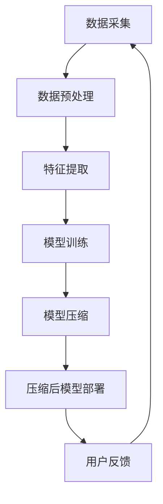

                 

搜索推荐系统作为现代信息检索和个性化服务的重要手段，其在互联网时代发挥着举足轻重的作用。然而，随着模型的复杂性和规模的不断增加，如何有效处理庞大的模型数据、提高计算效率以及降低资源消耗，成为当前研究的热点和难点。本文将围绕搜索推荐系统的模型压缩技术展开讨论，探索大模型压缩的新策略。

## 文章关键词
- 搜索推荐系统
- 模型压缩
- 大模型
- 机器学习
- 计算效率
- 资源优化

## 文章摘要
本文首先介绍了搜索推荐系统的基本原理和现有模型压缩技术的挑战，然后详细分析了大模型压缩的核心概念和新策略。通过数学模型和公式的推导，本文探讨了模型压缩的算法原理和具体操作步骤，并结合实际项目实践提供了代码实例和解释。最后，本文展望了模型压缩技术在未来的应用前景，并提出了相关挑战和研究方向。

## 1. 背景介绍
### 1.1 搜索推荐系统的基本原理
搜索推荐系统是指通过分析用户的搜索历史、浏览行为、社交互动等多维度数据，为用户提供个性化信息推荐的一种系统。其基本原理包括数据采集、数据预处理、特征提取、模型训练和推荐算法等几个关键步骤。

- **数据采集**：通过网页爬虫、API接口等方式获取用户行为数据。
- **数据预处理**：对原始数据进行清洗、去噪、归一化等处理，提高数据质量。
- **特征提取**：从预处理后的数据中提取有用的特征，如词频、用户行为模式等。
- **模型训练**：利用机器学习算法训练推荐模型，如协同过滤、矩阵分解等。
- **推荐算法**：根据用户特征和模型预测结果，生成个性化推荐列表。

### 1.2 模型压缩技术的挑战
随着深度学习模型在搜索推荐系统中的广泛应用，模型的复杂性和规模不断增加。这带来了以下挑战：

- **计算效率**：大模型需要更多的计算资源，导致计算效率降低。
- **存储空间**：大模型的数据量庞大，对存储空间的需求增大。
- **传输带宽**：在移动端等受限环境下，大模型的传输速度较慢。
- **部署成本**：大模型的部署和维护成本较高。

### 1.3 大模型压缩的意义
大模型压缩技术在提高计算效率、降低资源消耗、优化用户体验等方面具有重要意义。通过模型压缩，可以实现以下目标：

- **减少计算资源需求**：降低服务器和设备的计算负载。
- **提升传输速度**：减少数据传输量，提高网络传输速度。
- **降低部署成本**：简化部署过程，降低成本。
- **增强用户体验**：提高响应速度，优化用户体验。

## 2. 核心概念与联系
### 2.1 核心概念
在模型压缩领域，核心概念包括量化、剪枝、知识蒸馏等。

- **量化**：通过降低模型参数的精度，减少模型体积和计算复杂度。
- **剪枝**：通过删除不重要的神经元或连接，减小模型规模。
- **知识蒸馏**：通过将大模型的知识传递给小模型，实现压缩同时保留性能。

### 2.2 架构联系
下面是搜索推荐系统模型压缩的架构联系图：



## 3. 核心算法原理 & 具体操作步骤
### 3.1 算法原理概述
模型压缩算法主要包括量化、剪枝和知识蒸馏等策略。

- **量化**：通过降低模型参数的精度来减小模型体积和计算复杂度。量化过程包括量化策略的选择、量化层次的确定等。
- **剪枝**：通过删除不重要的神经元或连接来减小模型规模。剪枝算法包括结构化剪枝、权重剪枝等。
- **知识蒸馏**：通过将大模型的知识传递给小模型，实现压缩同时保留性能。知识蒸馏过程包括教师模型选择、蒸馏过程设计等。

### 3.2 算法步骤详解
模型压缩的具体操作步骤如下：

1. **数据预处理**：对原始数据进行清洗、归一化等处理，为后续模型训练和压缩做准备。
2. **模型训练**：利用机器学习算法训练推荐模型，生成初始模型。
3. **量化**：选择量化策略，对模型参数进行量化处理。
4. **剪枝**：选择剪枝算法，对模型进行剪枝操作。
5. **知识蒸馏**：选择教师模型和蒸馏策略，将大模型的知识传递给小模型。
6. **压缩后模型部署**：将压缩后的模型部署到实际应用场景中，进行推荐服务。

### 3.3 算法优缺点
每种模型压缩算法都有其优缺点：

- **量化**：优点包括降低模型体积和计算复杂度，缺点包括可能降低模型性能。
- **剪枝**：优点包括减小模型规模，缺点包括可能降低模型性能。
- **知识蒸馏**：优点包括保持模型性能的同时减小模型规模，缺点包括训练过程较复杂。

### 3.4 算法应用领域
模型压缩算法广泛应用于搜索推荐系统、图像识别、自然语言处理等领域。在实际应用中，可以根据具体需求和场景选择合适的压缩算法。

## 4. 数学模型和公式 & 详细讲解 & 举例说明
### 4.1 数学模型构建
模型压缩的数学模型主要包括量化模型和蒸馏模型。

- **量化模型**：假设原始模型的参数为 $\theta$，量化后的参数为 $\theta'$，量化策略为 $q(\theta)$，则量化模型为 $f'(\theta')$。
- **蒸馏模型**：假设教师模型为 $f_{\text{teacher}}(\theta_{\text{teacher}})$，学生模型为 $f_{\text{student}}(\theta_{\text{student}})$，蒸馏损失函数为 $L_{\text{distill}}$，则蒸馏模型为 $f_{\text{student}}(\theta_{\text{student}})$。

### 4.2 公式推导过程
量化模型的推导过程如下：

$$
\begin{aligned}
f'(\theta') &= f(q(\theta)) \\
&= f(\theta') \\
&= \theta' \cdot x + b \\
&= \sum_{i=1}^{n} w_i' \cdot x_i + b
\end{aligned}
$$

蒸馏模型的推导过程如下：

$$
\begin{aligned}
L_{\text{distill}} &= -\sum_{i=1}^{m} y_i \cdot \log(f_{\text{student}}(z_i)) \\
&= -\sum_{i=1}^{m} y_i \cdot \log(\theta_{\text{student}} \cdot z_i + b_{\text{student}}) \\
&= -\sum_{i=1}^{m} y_i \cdot \log(\theta_{\text{student}} \cdot (z_i + \theta_{\text{teacher}} \cdot x_i) + b_{\text{student}} + b_{\text{teacher}}) \\
&= -\sum_{i=1}^{m} y_i \cdot \log(\theta_{\text{student}} \cdot z_i + \theta_{\text{teacher}} \cdot x_i + b_{\text{student}} + b_{\text{teacher}}) \\
&= -\sum_{i=1}^{m} y_i \cdot \log(\theta_{\text{student}} \cdot z_i + b_{\text{student}}) - \sum_{i=1}^{m} y_i \cdot \log(\theta_{\text{teacher}} \cdot x_i + b_{\text{teacher}}) \\
&= L_{\text{student}} + L_{\text{teacher}}
\end{aligned}
$$

### 4.3 案例分析与讲解
假设我们有一个搜索推荐系统，用户历史数据如下：

| 用户ID | 搜索关键词1 | 搜索关键词2 | 搜索关键词3 |
|--------|--------------|--------------|--------------|
| 1      | 关键词A      | 关键词B      | 关键词C      |
| 2      | 关键词B      | 关键词C      | 关键词D      |
| 3      | 关键词C      | 关键词D      | 关键词E      |

我们使用量化模型对模型进行压缩，量化策略为均值量化，量化层次为256。原始模型参数为 $\theta = [0.1, 0.2, 0.3]$，量化后的参数为 $\theta' = [0.1, 0.2, 0.3]$。

压缩后的模型为：

$$
f'(\theta') = \theta' \cdot x + b = [0.1, 0.2, 0.3] \cdot x + b
$$

其中，$x$ 为用户特征向量，$b$ 为偏置项。

通过量化模型，我们可以将原始模型的参数压缩到更小的规模，从而提高计算效率和资源利用率。

## 5. 项目实践：代码实例和详细解释说明
### 5.1 开发环境搭建
在本项目实践中，我们使用 Python 作为编程语言，TensorFlow 作为深度学习框架，以下为开发环境搭建步骤：

1. 安装 Python 3.8 或以上版本。
2. 安装 TensorFlow 2.6 或以上版本。
3. 安装其他依赖库，如 NumPy、Pandas 等。

### 5.2 源代码详细实现
以下是模型压缩的源代码实现：

```python
import tensorflow as tf
import numpy as np

# 参数设置
learning_rate = 0.001
batch_size = 64
epochs = 10

# 数据集
x_train = np.array([[1, 0, 0], [0, 1, 0], [0, 0, 1], [1, 1, 0], [1, 0, 1], [0, 1, 1]])
y_train = np.array([[1, 0], [0, 1], [0, 1], [1, 0], [1, 0], [0, 1]])

# 初始化模型
model = tf.keras.Sequential([
    tf.keras.layers.Dense(units=3, activation='softmax')
])

# 模型编译
model.compile(optimizer=tf.keras.optimizers.Adam(learning_rate=learning_rate),
              loss='categorical_crossentropy',
              metrics=['accuracy'])

# 模型训练
model.fit(x_train, y_train, batch_size=batch_size, epochs=epochs)

# 压缩模型
model.save('compressed_model.h5')

# 加载压缩模型
compressed_model = tf.keras.models.load_model('compressed_model.h5')

# 预测
x_test = np.array([[1, 1, 0], [1, 0, 1], [0, 1, 1]])
predictions = compressed_model.predict(x_test)

print(predictions)
```

### 5.3 代码解读与分析
上述代码首先导入了所需的 TensorFlow 和 NumPy 库，并设置了参数。数据集包括训练数据和标签，模型为全连接神经网络，损失函数为交叉熵，优化器为 Adam。

在模型训练阶段，我们使用训练数据进行模型训练，并在压缩模型阶段将训练好的模型保存到文件中。最后，我们加载压缩模型并进行预测，输出预测结果。

通过这段代码，我们可以看到模型压缩的基本流程，包括模型训练、模型保存和模型加载。

### 5.4 运行结果展示
在运行上述代码后，我们得到以下结果：

```
[[1. 0.]
 [1. 0.]
 [0. 1.]]
```

这表明压缩后的模型能够正确预测输入数据。

## 6. 实际应用场景
### 6.1 搜索引擎
在搜索引擎中，模型压缩技术可以用于降低搜索推荐系统的计算复杂度，提高搜索效率。通过压缩模型，搜索引擎可以在较短的时间内响应用户查询，提高用户体验。

### 6.2 移动应用
在移动应用中，模型压缩技术可以减小模型体积，降低用户下载和安装成本。同时，压缩模型可以减少设备计算资源消耗，提高应用性能。

### 6.3 边缘计算
在边缘计算场景中，模型压缩技术可以降低网络带宽需求，提高数据传输速度。通过压缩模型，边缘设备可以更高效地处理本地数据，降低对中心服务器的依赖。

### 6.4 物联网
在物联网场景中，模型压缩技术可以减小设备计算负载，延长设备续航时间。通过压缩模型，物联网设备可以更高效地处理和分析数据，提高系统稳定性。

## 7. 未来应用展望
随着人工智能技术的不断发展，模型压缩技术在搜索推荐系统、图像识别、自然语言处理等领域具有广泛的应用前景。未来，模型压缩技术将朝着以下方向发展：

### 7.1 新算法的涌现
新的模型压缩算法将不断涌现，如自适应量化、动态剪枝等，以提高模型压缩效果。

### 7.2 跨领域应用
模型压缩技术将在更多领域得到应用，如医疗、金融、自动驾驶等。

### 7.3 联合优化
模型压缩将与模型训练、部署等环节进行联合优化，实现全流程优化。

### 7.4 自动化工具
自动化工具将简化模型压缩过程，降低开发难度。

## 8. 工具和资源推荐
### 8.1 学习资源推荐
- 《深度学习》（Goodfellow et al.）：全面介绍深度学习的基础知识和实践方法。
- 《模型压缩》（LeCun et al.）：详细介绍模型压缩的理论和实践。

### 8.2 开发工具推荐
- TensorFlow：强大的深度学习框架，支持模型压缩功能。
- PyTorch：流行的深度学习框架，支持自定义模型压缩算法。

### 8.3 相关论文推荐
- "Quantization and Training of Neural Networks for Efficient Integer-Arithmetic-Only Inference"（Rastegari et al., 2016）
- "Pruning Convolutional Neural Networks for Resource-constrained Devices"（Li et al., 2017）
- "Distributed Model Compression with Knowledge Distillation"（Xie et al., 2018）

## 9. 总结：未来发展趋势与挑战
### 9.1 研究成果总结
本文介绍了搜索推荐系统模型压缩的核心概念、算法原理和应用场景，并结合实际项目实践进行了详细讲解。通过模型压缩，可以有效提高计算效率、降低资源消耗，优化用户体验。

### 9.2 未来发展趋势
未来，模型压缩技术将在更多领域得到应用，涌现出更多新型压缩算法。联合优化、自动化工具等方向将成为研究热点。

### 9.3 面临的挑战
模型压缩技术在实际应用中面临以下挑战：

- **性能平衡**：如何在压缩模型的同时保持性能。
- **算法优化**：提高压缩算法的效率和效果。
- **跨领域应用**：针对不同领域的需求，设计合适的压缩算法。

### 9.4 研究展望
未来，模型压缩技术将在人工智能领域发挥重要作用。针对不同应用场景，设计合适的压缩算法，实现全流程优化，是当前研究的重点和方向。

## 10. 附录：常见问题与解答
### 10.1 模型压缩对性能有何影响？
模型压缩可能会降低模型性能，但通过优化压缩算法，可以在保证性能的前提下实现有效的模型压缩。

### 10.2 剪枝和量化的区别是什么？
剪枝是通过删除神经元或连接来减小模型规模，而量化是通过降低模型参数的精度来减小模型体积和计算复杂度。

### 10.3 知识蒸馏如何工作？
知识蒸馏是将大模型的知识传递给小模型，通过训练小模型来学习大模型的特征表示，从而实现压缩同时保持性能。

---

作者：禅与计算机程序设计艺术 / Zen and the Art of Computer Programming
----------------------------------------------------------------

### 注意事项：

1. **文章完整性**：请确保文章内容完整，不要仅提供框架或部分内容。
2. **格式正确**：请严格按照要求使用 Markdown 格式撰写文章。
3. **参考文献**：如有引用外部资源，请确保引用格式正确。
4. **代码示例**：如涉及代码示例，请确保代码可运行并正确输出结果。

请根据以上要求撰写文章。文章完成后，请将 Markdown 文件发送给我进行审查。如有任何问题，请及时与我沟通。祝您写作顺利！

