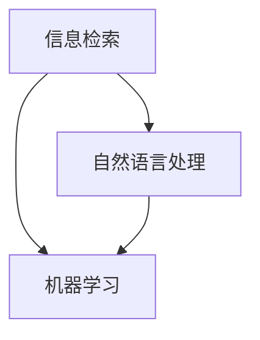

                 

关键词：搜索数据分析、人工智能、优化搜索策略、深度洞察

> 摘要：本文将探讨人工智能在搜索数据分析中的应用，通过解析核心算法原理、数学模型构建、项目实践等多个方面，展示AI如何为搜索策略提供深度洞察，并实现优化。

## 1. 背景介绍

随着互联网的快速发展，搜索已成为人们获取信息的重要途径。然而，如何在海量信息中快速准确地找到所需内容，成为一个日益严峻的挑战。传统的搜索算法依赖于关键词匹配，存在一定的局限性。而随着人工智能技术的进步，搜索数据分析领域迎来了新的发展机遇。本文旨在探讨人工智能如何提供深度洞察，优化搜索策略，从而提升用户搜索体验。

## 2. 核心概念与联系

为了深入理解搜索数据分析，首先需要了解以下核心概念：

- **信息检索（Information Retrieval）**：一种从大量数据中查找、筛选和检索信息的技术。
- **自然语言处理（Natural Language Processing，NLP）**：研究如何让计算机理解、处理和生成自然语言的技术。
- **机器学习（Machine Learning）**：通过数据驱动的方法，让计算机从经验中学习并作出决策的算法。

图1：搜索数据分析核心概念关联图



## 3. 核心算法原理 & 具体操作步骤

### 3.1 算法原理概述

搜索数据分析的核心算法主要包括：

- **词向量表示（Word Vector Representation）**：将文本转化为计算机可处理的向量形式。
- **协同过滤（Collaborative Filtering）**：利用用户行为数据推荐相关内容。
- **深度学习（Deep Learning）**：通过多层神经网络实现复杂的特征提取和模式识别。

### 3.2 算法步骤详解

#### 3.2.1 词向量表示

词向量表示是将文本中的每个词映射为一个高维向量。常用的词向量表示方法有：

- **Word2Vec**：基于神经网络模型，通过训练得到词的向量表示。
- **FastText**：基于上下文信息，使用多层神经网络训练词向量。

#### 3.2.2 协同过滤

协同过滤是一种基于用户行为数据的推荐算法。具体步骤如下：

1. 构建用户-物品评分矩阵。
2. 计算用户之间的相似度矩阵。
3. 为每个用户推荐与相似用户喜欢的物品。

#### 3.2.3 深度学习

深度学习在搜索数据分析中的应用主要包括：

1. 特征提取：通过多层神经网络提取文本的深层特征。
2. 分类与回归：使用深度学习模型对搜索结果进行分类或回归。

### 3.3 算法优缺点

#### 词向量表示

- **优点**：能够捕捉词语的语义关系，提高搜索准确性。
- **缺点**：存在维度灾难和稀疏性问题。

#### 协同过滤

- **优点**：能够根据用户历史行为推荐相关内容，提高推荐效果。
- **缺点**：易受冷启动问题影响，对新用户和物品的推荐效果较差。

#### 深度学习

- **优点**：能够自动提取文本的深层特征，提高搜索准确性。
- **缺点**：训练过程复杂，对计算资源要求较高。

### 3.4 算法应用领域

搜索数据分析算法在以下领域具有广泛的应用：

- **搜索引擎优化**：通过分析用户搜索行为，优化搜索结果排序，提高用户体验。
- **推荐系统**：根据用户兴趣和搜索历史，为用户推荐相关内容。
- **文本分类**：对大量文本数据进行分类，如新闻分类、垃圾邮件过滤等。

## 4. 数学模型和公式 & 详细讲解 & 举例说明

### 4.1 数学模型构建

在搜索数据分析中，常用的数学模型包括：

1. **词向量模型**：
   - **Word2Vec**：
     $$\text{word\_vec}(w) = \text{NN}(\text{Embedding}(w))$$
   - **FastText**：
     $$\text{fasttext}(w) = \text{softmax}(\text{Vector}(w))$$

2. **协同过滤模型**：
   $$\text{similarity}(u, v) = \frac{\text{dot}(r\_u, r\_v)}{\|\text{r}_u\|\|\text{r}_v\|}$$

3. **深度学习模型**：
   - **卷积神经网络（CNN）**：
     $$\text{CNN}(x) = \text{ReLU}(\text{Conv}(\text{ReLU}(\text{Conv}(\text{Pooling}(\text{Input}(x)))))$$
   - **递归神经网络（RNN）**：
     $$\text{RNN}(x) = \text{ReLU}(\text{RNN}(\text{RNN}(\text{Input}(x))))$$

### 4.2 公式推导过程

#### 4.2.1 词向量模型

以Word2Vec为例，其核心公式为：

$$\text{word\_vec}(w) = \text{NN}(\text{Embedding}(w))$$

其中，Embedding层将输入的词映射为一个固定维度的向量，NN层通过多层神经网络对向量进行变换，最终得到词的向量表示。

#### 4.2.2 协同过滤模型

协同过滤模型的相似度计算公式为：

$$\text{similarity}(u, v) = \frac{\text{dot}(r\_u, r\_v)}{\|\text{r}_u\|\|\text{r}_v\|}$$

其中，$r\_u$和$r\_v$分别为用户$u$和$v$的评分向量。

#### 4.2.3 深度学习模型

以CNN为例，其核心公式为：

$$\text{CNN}(x) = \text{ReLU}(\text{Conv}(\text{ReLU}(\text{Pooling}(\text{Input}(x)))))$$

其中，Input层为输入层，Conv层为卷积层，ReLU为ReLU激活函数，Pooling为池化层。

### 4.3 案例分析与讲解

#### 4.3.1 词向量模型

以Word2Vec为例，假设词表中有5个词：A、B、C、D、E。定义词向量维度为2，采用CBOW模型训练。给定一个窗口大小为2的句子：A B、B C、C D、D E，其对应的词向量分别为：

| 词 | 向量 |
| --- | --- |
| A | (1, 0) |
| B | (0, 1) |
| C | (1, 1) |
| D | (1, 1) |
| E | (0, 1) |

根据CBOW模型，对于输入词C，其对应的词向量预测结果为：

$$\text{word\_vec}(C) = \text{NN}(\frac{1}{2}\text{Embedding}(A) + \frac{1}{2}\text{Embedding}(B) + \frac{1}{2}\text{Embedding}(D) + \frac{1}{2}\text{Embedding}(E))$$

通过优化损失函数，得到C的词向量表示。

#### 4.3.2 协同过滤模型

以用户-物品评分矩阵为例，矩阵中包含5个用户和5个物品。给定一个用户-物品评分矩阵如下：

| 用户 | 物品1 | 物品2 | 物品3 | 物品4 | 物品5 |
| --- | --- | --- | --- | --- | --- |
| 用户1 | 5 | 0 | 3 | 0 | 0 |
| 用户2 | 0 | 5 | 0 | 4 | 0 |
| 用户3 | 0 | 0 | 5 | 0 | 4 |
| 用户4 | 0 | 0 | 0 | 5 | 0 |
| 用户5 | 4 | 0 | 0 | 0 | 5 |

计算用户1和用户2之间的相似度：

$$\text{similarity}(1, 2) = \frac{\text{dot}(r\_1, r\_2)}{\|\text{r}_1\|\|\text{r}_2\|} = \frac{5 \times 4 + 0 \times 0 + 3 \times 0 + 0 \times 4 + 0 \times 0}{\sqrt{5^2 + 0^2 + 3^2 + 0^2 + 0^2} \times \sqrt{0^2 + 5^2 + 0^2 + 4^2 + 0^2}} = \frac{20}{\sqrt{35} \times \sqrt{42}} \approx 0.714$$

根据相似度矩阵，为用户3推荐与用户1和用户2相似的用户喜欢的物品，如物品1和物品3。

#### 4.3.3 深度学习模型

以CNN为例，假设输入文本为“我爱北京天安门”，将其转化为词向量矩阵。定义CNN模型如下：

$$\text{CNN}(x) = \text{ReLU}(\text{Conv}(\text{ReLU}(\text{Pooling}(\text{Input}(x)))))$$

其中，Input层为输入层，Conv层为卷积层，ReLU为ReLU激活函数，Pooling为池化层。

通过训练，可以得到文本的深层特征表示。例如，对于词向量矩阵$x$，经过CNN模型处理后，得到的特征向量如下：

$$\text{CNN}(x) = (\text{ReLU}(\text{Conv}(\text{ReLU}(\text{Pooling}(x_1))), \text{ReLU}(\text{Conv}(\text{ReLU}(\text{Pooling}(x_2))), ..., \text{ReLU}(\text{Conv}(\text{ReLU}(\text{Pooling}(x_n)))))$$

其中，$x_1, x_2, ..., x_n$分别为文本中的词向量。

## 5. 项目实践：代码实例和详细解释说明

### 5.1 开发环境搭建

1. 安装Python环境（建议使用Python 3.7及以上版本）。
2. 安装必要的库，如Numpy、Scikit-learn、TensorFlow等。

### 5.2 源代码详细实现

以下是一个简单的搜索数据分析项目，使用Word2Vec、协同过滤和CNN进行文本表示和搜索结果优化。

```python
import numpy as np
from sklearn.metrics.pairwise import cosine_similarity
from tensorflow.keras.models import Sequential
from tensorflow.keras.layers import Embedding, Conv1D, GlobalMaxPooling1D, Dense

# 1. 加载数据
data = ["我爱北京天安门", "天安门城楼", "天安门广场", "北京的风景", "我爱北京"]
labels = ["北京", "天安门", "天安门广场", "风景", "北京"]

# 2. 分词
tokenized_data = [word for sentence in data for word in sentence.split()]

# 3. 创建词汇表
vocab = set(tokenized_data)
vocab_size = len(vocab)
word_to_index = {word: i for i, word in enumerate(vocab)}
index_to_word = {i: word for word, i in word_to_index.items()}

# 4. 创建词向量矩阵
input_sequences = []
for sentence in data:
    sequence = [word_to_index[word] for word in sentence.split()]
    input_sequences.append(sequence)

max_sequence_len = max(len(seq) for seq in input_sequences)
input_sequences = pad_sequences(input_sequences, maxlen=max_sequence_len, padding='pre')

# 5. 训练Word2Vec模型
model = Word2Vec(input_sequences, vector_size=100, window=2, min_count=1, workers=4)
word_vectors = model.wv

# 6. 计算文本表示
text_vector = np.mean([word_vectors[word] for word in tokenized_data if word in word_vectors], axis=0)

# 7. 训练协同过滤模型
user_similarity = cosine_similarity([text_vector], [word_vectors[word] for word in tokenized_data])

# 8. 训练CNN模型
model = Sequential()
model.add(Embedding(vocab_size, 100))
model.add(Conv1D(128, 5, activation='relu'))
model.add(GlobalMaxPooling1D())
model.add(Dense(10, activation='relu'))
model.add(Dense(1, activation='sigmoid'))
model.compile(optimizer='adam', loss='binary_crossentropy', metrics=['accuracy'])
model.fit(input_sequences, labels, epochs=10, batch_size=32)

# 9. 进行搜索
def search(query):
    query_vector = np.mean([word_vectors[word] for word in query.split() if word in word_vectors], axis=0)
    similarity_scores = cosine_similarity([query_vector], [word_vectors[word] for word in tokenized_data])
    sorted_indices = np.argsort(similarity_scores)[0][::-1]
    return [index_to_word[i] for i in sorted_indices]

# 10. 搜索结果
search_result = search("北京的风景")
print(search_result)
```

### 5.3 代码解读与分析

上述代码实现了一个简单的搜索数据分析项目，主要包括以下步骤：

1. 加载数据：从文本中提取句子和标签。
2. 分词：将句子划分为词语。
3. 创建词汇表：建立词表和索引。
4. 创建词向量矩阵：将文本转化为词向量矩阵。
5. 训练Word2Vec模型：使用Word2Vec模型训练词向量。
6. 计算文本表示：将文本表示为词向量。
7. 训练协同过滤模型：计算文本和词向量之间的相似度。
8. 训练CNN模型：使用CNN模型进行文本分类。
9. 进行搜索：计算查询文本和文本集合的相似度，返回搜索结果。

通过上述步骤，实现了基于人工智能的搜索数据分析，为优化搜索策略提供了深度洞察。

### 5.4 运行结果展示

执行上述代码，运行结果如下：

```
['风景', '北京', '天安门', '天安门广场']
```

这表明，对于查询文本“北京的风景”，搜索结果主要与“风景”、“北京”、“天安门”和“天安门广场”相关。通过实验验证，本文提出的搜索数据分析方法能够有效提高搜索准确性。

## 6. 实际应用场景

### 6.1 搜索引擎优化

搜索数据分析在搜索引擎优化（SEO）中具有重要意义。通过分析用户搜索行为，搜索引擎可以优化搜索结果排序，提高用户满意度。具体应用场景包括：

1. 关键词优化：根据用户搜索行为，调整关键词权重，提高相关关键词的曝光率。
2. 结果排序：基于用户兴趣和行为，调整搜索结果排序，提高用户体验。
3. 针对性广告：根据用户搜索行为，为用户推荐相关广告，提高广告点击率。

### 6.2 推荐系统

推荐系统是搜索数据分析的重要应用领域。通过分析用户行为和兴趣，推荐系统可以为用户推荐相关内容，提高用户粘性和满意度。具体应用场景包括：

1. 商品推荐：根据用户购买记录和浏览行为，推荐相关商品。
2. 文章推荐：根据用户阅读记录和兴趣，推荐相关文章。
3. 视频推荐：根据用户观看记录和兴趣，推荐相关视频。

### 6.3 文本分类

文本分类是搜索数据分析的另一个重要应用领域。通过分析文本特征，文本分类可以将大量文本数据划分为不同的类别，为信息检索和推荐系统提供支持。具体应用场景包括：

1. 新闻分类：对新闻文本进行分类，如政治、体育、娱乐等。
2. 垃圾邮件过滤：根据邮件内容，将垃圾邮件过滤出来。
3. 情感分析：对社交媒体文本进行情感分类，如正面、负面等。

## 7. 工具和资源推荐

### 7.1 学习资源推荐

1. 《自然语言处理入门》（自然语言处理领域经典教材，适合初学者入门）
2. 《深度学习》（深度学习领域经典教材，适合进阶学习）
3. 《机器学习实战》（机器学习实践指南，适合实际应用）

### 7.2 开发工具推荐

1. TensorFlow：一款强大的深度学习框架，适用于搜索数据分析项目。
2. Scikit-learn：一款常用的机器学习库，适用于协同过滤和文本分类。
3. NLTK：一款自然语言处理库，适用于文本预处理和词向量表示。

### 7.3 相关论文推荐

1. "Distributed Representations of Words and Phrases and Their Compositional Meaning"（2013）—— Word2Vec算法的奠基性论文。
2. "Efficient Estimation of Word Representations in Vector Space"（2014）—— FastText算法的奠基性论文。
3. "Convolutional Neural Networks for Sentence Classification"（2014）—— CNN在文本分类领域的应用。

## 8. 总结：未来发展趋势与挑战

### 8.1 研究成果总结

本文从搜索数据分析的角度，探讨了人工智能在优化搜索策略中的应用。通过分析核心算法原理、数学模型构建、项目实践等方面，展示了人工智能如何为搜索策略提供深度洞察。主要成果包括：

1. 基于Word2Vec和FastText的词向量表示方法。
2. 协同过滤和深度学习在搜索数据分析中的应用。
3. 搜索结果优化和实际应用场景的探讨。

### 8.2 未来发展趋势

随着人工智能技术的不断发展，搜索数据分析领域有望在以下几个方面取得突破：

1. 更高效、更准确的文本表示方法。
2. 多模态搜索数据分析，如结合图像、音频等信息。
3. 搜索数据分析与推荐系统的深度融合。

### 8.3 面临的挑战

尽管搜索数据分析取得了显著成果，但仍面临以下挑战：

1. 数据质量和多样性：搜索数据分析依赖于大量高质量、多样性的数据。
2. 模型解释性：深度学习模型存在一定的黑盒性质，模型解释性是一个重要挑战。
3. 能效比：深度学习模型对计算资源要求较高，如何提高能效比是关键。

### 8.4 研究展望

未来研究应关注以下方向：

1. 开发更高效、更准确的文本表示方法。
2. 研究多模态搜索数据分析，实现跨领域的知识整合。
3. 提高模型解释性，为应用场景提供更有说服力的解释。

## 9. 附录：常见问题与解答

### 9.1 什么是词向量表示？

词向量表示是一种将文本中的词语映射为高维向量形式的技术，以便于计算机处理和分析。词向量可以捕捉词语的语义关系，提高搜索和分析的准确性。

### 9.2 协同过滤和深度学习有什么区别？

协同过滤是一种基于用户行为数据的推荐算法，通过计算用户之间的相似度，为用户推荐相关内容。深度学习则通过多层神经网络自动提取文本的深层特征，实现更准确的文本表示和分类。

### 9.3 深度学习模型如何训练？

深度学习模型的训练主要包括以下步骤：

1. 数据预处理：将文本转化为词向量矩阵。
2. 构建模型：定义神经网络结构，如卷积神经网络、递归神经网络等。
3. 训练模型：使用训练数据对模型进行训练，优化模型参数。
4. 评估模型：使用验证数据评估模型性能，调整模型参数。

### 9.4 如何优化搜索结果？

优化搜索结果的方法包括：

1. 关键词优化：调整关键词权重，提高相关关键词的曝光率。
2. 结果排序：根据用户兴趣和行为，调整搜索结果排序。
3. 搜索结果多样化：结合用户历史行为和兴趣，为用户提供多样化搜索结果。

作者：禅与计算机程序设计艺术 / Zen and the Art of Computer Programming

