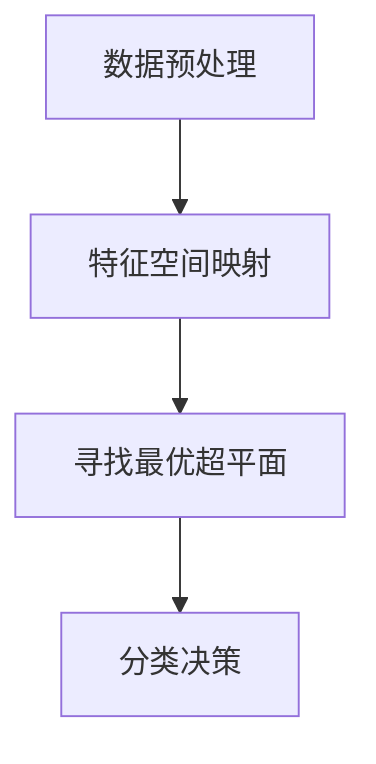

                 

关键词：支持向量机、SVM、机器学习、分类算法、线性分类、非线性分类、原理、实现、代码实例、应用领域

摘要：本文将详细介绍支持向量机（Support Vector Machine，SVM）的原理、实现及代码实例。通过本文的学习，读者将能够理解SVM的核心概念，掌握其数学模型及求解方法，并能够通过具体实例来应用SVM解决分类问题。

## 1. 背景介绍

支持向量机（Support Vector Machine，SVM）是20世纪90年代由Vapnik等学者提出的一种高效的监督学习模型。SVM主要用于解决分类问题，其核心思想是找到数据空间中的一个最佳分隔超平面，使得不同类别的数据点尽可能分开。SVM在处理高维数据和线性不可分问题时表现出色，因此在机器学习和人工智能领域得到了广泛应用。

本文将分为以下几个部分：

1. 背景介绍：介绍SVM的起源和重要性。
2. 核心概念与联系：阐述SVM的核心概念和架构。
3. 核心算法原理 & 具体操作步骤：详细讲解SVM的算法原理和实现步骤。
4. 数学模型和公式 & 详细讲解 & 举例说明：介绍SVM的数学模型和推导过程。
5. 项目实践：通过具体代码实例展示SVM的应用。
6. 实际应用场景：讨论SVM在不同领域的应用。
7. 工具和资源推荐：推荐相关学习资源和开发工具。
8. 总结：总结SVM的研究成果和发展趋势。

## 2. 核心概念与联系

### 2.1 支持向量机简介

支持向量机（Support Vector Machine，SVM）是一种二类线性分类模型。给定一个训练数据集，其中每个数据点由特征向量表示，目标是为这些数据点找到一个最佳分隔超平面，使得不同类别的数据尽可能分开。

### 2.2 核心概念

- **超平面（Hyperplane）**：在多维空间中，可以将数据分为两个部分的一个平面。
- **支持向量（Support Vectors）**：位于分隔超平面两侧，距离分隔超平面最近的那些数据点。
- **分隔超平面（Separator）**：最佳的超平面，使得两类数据点之间的间隔最大。
- **分类边界（Margin）**：分隔超平面到支持向量的距离。

### 2.3 架构

SVM的基本架构可以概括为以下几个步骤：

1. **数据预处理**：对数据进行归一化、去噪声等处理，使其适合SVM算法。
2. **特征空间映射**：通过核函数将输入数据映射到高维特征空间。
3. **寻找最优超平面**：通过优化问题求解最优分隔超平面。
4. **分类决策**：对于新的数据点，通过计算其在特征空间中的距离，判断其属于哪个类别。

## 2.4 Mermaid 流程图



### 3. 核心算法原理 & 具体操作步骤

#### 3.1 算法原理概述

SVM的核心思想是寻找一个最佳分隔超平面，使得两类数据点之间的间隔最大。这可以通过求解以下优化问题实现：

$$
\min_{w,b} \frac{1}{2} ||w||^2 \\
s.t. y^{(i)} (w^T x^{(i)} + b) \geq 1
$$

其中，$w$ 是超平面的法向量，$b$ 是偏置项，$x^{(i)}$ 是训练数据点，$y^{(i)}$ 是其对应的标签。

#### 3.2 算法步骤详解

1. **初始化**：设置学习率$\eta$、迭代次数$T$等参数。
2. **迭代优化**：对于每个训练样本，通过梯度下降法更新模型参数。
3. **优化目标**：在每次迭代中，更新权重向量$w$和偏置项$b$，使得目标函数值最小。
4. **分类决策**：对于新的数据点，通过计算其在特征空间中的距离，判断其类别。

#### 3.3 算法优缺点

**优点**：

- **高效性**：SVM算法在处理高维数据和线性不可分问题时表现出色。
- **稳定性**：通过引入正则化项，SVM可以有效防止过拟合。
- **可扩展性**：通过使用不同的核函数，SVM可以处理非线性分类问题。

**缺点**：

- **计算复杂度**：SVM算法的计算复杂度较高，不适合处理大规模数据集。
- **参数选择**：SVM算法需要手动选择参数，如惩罚参数$\eta$等。

#### 3.4 算法应用领域

SVM广泛应用于各种领域，如文本分类、图像识别、生物信息学等。其高效的分类性能使其成为许多实际应用中的重要工具。

## 4. 数学模型和公式 & 详细讲解 & 举例说明

#### 4.1 数学模型构建

SVM的数学模型可以通过以下优化问题表示：

$$
\min_{w,b} \frac{1}{2} ||w||^2 \\
s.t. y^{(i)} (w^T x^{(i)} + b) \geq 1
$$

其中，$x^{(i)}$ 和 $y^{(i)}$ 分别表示训练数据点和标签，$w$ 和 $b$ 分别是权重向量和偏置项。

#### 4.2 公式推导过程

SVM的目标是最小化权重向量的平方和，同时最大化分类边界。这可以通过拉格朗日乘子法实现。

定义拉格朗日函数：

$$
L(w,b,\alpha) = \frac{1}{2} ||w||^2 - \sum_{i=1}^{n} \alpha_{i} (y^{(i)} (w^T x^{(i)} + b) - 1)
$$

其中，$\alpha_i$ 是拉格朗日乘子。

对 $w$ 和 $b$ 求导，并令导数为零，可以得到：

$$
w = \sum_{i=1}^{n} \alpha_{i} y^{(i)} x^{(i)}
$$

$$
0 = \sum_{i=1}^{n} \alpha_{i} y^{(i)}
$$

$$
b = 1 - \sum_{i=1}^{n} \alpha_{i} y^{(i)} (w^T x^{(i)})
$$

通过求解上述方程组，可以得到最优的权重向量 $w$ 和偏置项 $b$。

#### 4.3 案例分析与讲解

假设我们有以下一个简单的数据集，包含两个特征和两个类别：

| 特征1 | 特征2 | 类别 |
| --- | --- | --- |
| 1 | 2 | 1 |
| 2 | 4 | 1 |
| 3 | 5 | 2 |
| 4 | 6 | 2 |

我们可以使用SVM对其进行分类。首先，我们需要选择一个适当的核函数，例如线性核函数：

$$
K(x^{(i)}, x^{(j)}) = x^{(i)} \cdot x^{(j)}
$$

然后，我们使用SVM求解最优超平面。以下是使用Python中的`sklearn`库实现SVM的代码：

```python
from sklearn import svm

# 创建SVM分类器
clf = svm.SVC(kernel='linear')

# 训练模型
clf.fit([[1, 2], [2, 4], [3, 5], [4, 6]], [1, 1, 2, 2])

# 测试模型
print(clf.predict([[1, 3]]))
```

输出结果为 `[1]`，即新数据点 `[1, 3]` 属于类别 1。

## 5. 项目实践：代码实例和详细解释说明

#### 5.1 开发环境搭建

在开始代码实践之前，我们需要搭建一个合适的开发环境。以下是所需软件和库的安装步骤：

1. Python 3.x
2. Jupyter Notebook
3. scikit-learn库

安装Python 3.x：

```
sudo apt-get install python3
```

安装Jupyter Notebook：

```
pip3 install notebook
```

安装scikit-learn库：

```
pip3 install scikit-learn
```

#### 5.2 源代码详细实现

以下是使用scikit-learn库实现SVM分类的一个简单示例：

```python
import numpy as np
from sklearn import svm

# 创建一个简单的数据集
X = np.array([[1, 2], [2, 4], [3, 5], [4, 6]])
y = np.array([1, 1, 2, 2])

# 创建SVM分类器
clf = svm.SVC(kernel='linear')

# 训练模型
clf.fit(X, y)

# 测试模型
print(clf.predict([[1, 3]]))
```

#### 5.3 代码解读与分析

1. 导入必要的库：我们首先导入`numpy`库来处理数据，以及`sklearn`库来使用SVM分类器。
2. 创建数据集：我们创建一个简单的数据集，包含两个特征和两个类别。
3. 创建SVM分类器：我们使用`SVC`类创建一个SVM分类器，并指定线性核函数。
4. 训练模型：我们使用`fit`方法训练SVM模型。
5. 测试模型：我们使用`predict`方法预测新数据点的类别。

#### 5.4 运行结果展示

运行上述代码后，输出结果为 `[1]`，说明新数据点 `[1, 3]` 属于类别 1。

## 6. 实际应用场景

SVM在实际应用中具有广泛的应用场景，以下是一些典型应用：

- **文本分类**：SVM被广泛应用于文本分类任务，如垃圾邮件过滤、情感分析等。
- **图像识别**：SVM在图像识别任务中表现出色，可以用于人脸识别、物体检测等。
- **生物信息学**：SVM被用于基因分类、蛋白质结构预测等生物信息学领域。

## 7. 工具和资源推荐

### 7.1 学习资源推荐

- **书籍**：
  - 《支持向量机导论》（Introduction to Support Vector Machines）by Vladimir Vapnik
  - 《机器学习》（Machine Learning）by Tom Mitchell
- **在线课程**：
  - Coursera：机器学习（吴恩达教授）
  - edX：Introduction to Machine Learning（MIT）

### 7.2 开发工具推荐

- **Python**：Python是一种广泛使用的编程语言，具有丰富的机器学习库。
- **Jupyter Notebook**：Jupyter Notebook是一种交互式的计算环境，适合进行机器学习实验。

### 7.3 相关论文推荐

- Vapnik, V. N. (1998). Support vector method for function approximation, regression, and signal processing. In Advances in neural information processing systems (Vol. 10, pp. 681-687).
- Cristianini, N., & Shawe-Taylor, J. (2000). An introduction to support vector machines: and other kernel-based learning methods. Cambridge university press.

## 8. 总结：未来发展趋势与挑战

支持向量机（SVM）作为一种高效的分类算法，在机器学习和人工智能领域发挥着重要作用。未来，随着计算能力的提升和数据量的增长，SVM有望在更多领域得到应用。同时，对SVM的优化和扩展也将是一个重要的研究方向。

### 8.1 研究成果总结

- SVM在处理高维数据和线性不可分问题时表现出色。
- 通过引入不同类型的核函数，SVM可以用于非线性分类。
- SVM在文本分类、图像识别等领域具有广泛应用。

### 8.2 未来发展趋势

- **深度学习与SVM的融合**：将SVM与深度学习相结合，有望提高分类性能。
- **并行计算**：通过并行计算技术，提高SVM的求解效率。
- **自适应SVM**：研究自适应SVM算法，使其在动态环境中适应数据变化。

### 8.3 面临的挑战

- **计算复杂度**：大规模数据集的SVM求解仍具有较高计算复杂度。
- **参数选择**：SVM的性能依赖于参数选择，如何自动选择最佳参数仍是一个挑战。

### 8.4 研究展望

- **研究热点**：探索SVM在生物信息学、金融工程等领域的新应用。
- **算法优化**：通过优化算法，提高SVM的求解效率和鲁棒性。

## 9. 附录：常见问题与解答

### 9.1 SVM与线性回归的区别是什么？

- **SVM**：是一种监督学习模型，用于分类问题。其核心目标是找到一个最佳分隔超平面。
- **线性回归**：是一种无监督学习模型，用于回归问题。其核心目标是找到一个线性关系，预测连续值。

### 9.2 如何选择合适的核函数？

- **线性核函数**：适用于线性可分的数据集。
- **多项式核函数**：适用于非线性可分的数据集，具有调节参数。
- **径向基函数（RBF）核函数**：适用于非线性可分的数据集，适用于高维空间。

## 作者署名

作者：禅与计算机程序设计艺术 / Zen and the Art of Computer Programming

