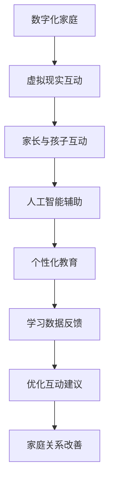

                 

关键词：数字化家庭，元宇宙，亲子关系，虚拟现实，人工智能，教育技术，互动体验

摘要：本文探讨了元宇宙时代数字化家庭的概念和其对孩子成长的影响，特别是在亲子关系方面。通过分析虚拟现实、人工智能和教育技术的结合，文章提出了数字化家庭对亲子互动的潜力，以及未来可能面临的挑战和机遇。本文旨在为家长、教育工作者和科技公司提供指导，以更好地利用数字化工具促进家庭和谐与孩子的全面发展。

## 1. 背景介绍

随着科技的迅猛发展，尤其是虚拟现实（VR）和人工智能（AI）技术的日益成熟，数字化家庭正逐渐成为现实。数字化家庭不仅仅是一个物理空间的数字化，更是家庭成员之间互动和沟通方式的转变。在元宇宙时代，家庭生活将更加多元化和互动化，这给亲子关系带来了新的机遇和挑战。

亲子关系在儿童成长过程中扮演着至关重要的角色。传统的亲子关系通常基于面对面的交流和互动，然而在数字化时代，这种模式正在发生变革。虚拟现实和人工智能等技术为家庭提供了新的互动方式，使得家长和孩子可以在不同的时间和空间进行交流和互动，这为亲子关系的发展带来了新的可能性。

## 2. 核心概念与联系

### 2.1 数字化家庭的概念

数字化家庭是指利用信息技术，特别是互联网、云计算和大数据等，将家庭生活各个方面进行数字化处理。这包括家庭设备的互联、信息共享、远程控制等。数字化家庭的核心是智能家居系统，它通过传感器、控制器和应用程序，实现家庭环境的自动化和智能化。

### 2.2 虚拟现实与亲子互动

虚拟现实技术为亲子互动提供了全新的体验。通过VR设备，家长和孩子可以进入一个虚拟的世界，共同参与各种活动和游戏。这种互动不仅增加了亲子之间的情感联系，还能激发孩子的想象力和创造力。

### 2.3 人工智能在教育中的应用

人工智能在教育中的应用主要体现在个性化学习、智能辅导和智能评价等方面。通过AI技术，家长可以更好地了解孩子的学习需求和进展，提供更加精准的教育支持。

### 2.4 联系与互动

虚拟现实和人工智能的结合，使得数字化家庭中的亲子互动更加丰富和多样化。家长可以通过VR与孩子进行远程互动，分享生活经验和知识；而AI技术则可以分析亲子互动的数据，为家长提供个性化的建议和指导。

### 2.5 Mermaid 流程图

以下是一个简化的Mermaid流程图，展示了数字化家庭中虚拟现实和人工智能的互动过程。

```
graph TB
    A[数字化家庭] --> B[虚拟现实互动]
    B --> C[家长与孩子互动]
    C --> D[人工智能辅助]
    D --> E[个性化教育]
    E --> F[学习数据反馈]
    F --> G[优化互动建议]
    G --> H[家庭关系改善]
```

## 3. 核心算法原理 & 具体操作步骤

### 3.1 算法原理概述

数字化家庭中的核心算法主要涉及数据收集、分析和决策。数据收集方面，通过智能家居设备实时获取家庭环境和成员行为的数据。分析方面，采用机器学习算法对数据进行分析，提取有价值的信息。决策方面，根据分析结果，系统提供个性化的教育建议和家庭互动方案。

### 3.2 算法步骤详解

1. **数据收集**：通过传感器和设备，收集家庭环境数据（如温度、湿度、光线）和成员行为数据（如活动、偏好）。
2. **数据预处理**：对收集到的数据进行清洗和归一化，确保数据质量。
3. **特征提取**：利用机器学习算法，从预处理后的数据中提取关键特征。
4. **模式识别**：通过模式识别算法，分析特征数据，识别家庭成员的行为模式和学习需求。
5. **决策制定**：根据分析结果，制定个性化的教育建议和家庭互动方案。
6. **反馈优化**：根据反馈调整算法参数，优化互动建议。

### 3.3 算法优缺点

#### 优点：

- **个性化**：能够根据每个孩子的特点和需求提供个性化的教育建议。
- **实时性**：实时收集和分析数据，及时调整互动方案。
- **高效性**：自动化处理，减少家长的工作量。

#### 缺点：

- **数据隐私**：数据收集可能涉及隐私问题。
- **技术依赖**：算法的实现和运行依赖于技术基础设施。

### 3.4 算法应用领域

- **家庭教育**：个性化辅导、学习效果评估。
- **家庭教育规划**：课程安排、活动策划。
- **家庭健康管理**：环境监控、健康数据监测。

## 4. 数学模型和公式 & 详细讲解 & 举例说明

### 4.1 数学模型构建

在数字化家庭中，数学模型主要用于描述家庭环境和成员行为之间的关系。以下是一个简化的数学模型：

$$
\text{模型} = f(\text{环境变量}, \text{成员行为})
$$

其中，$f$ 表示某种函数关系，$\text{环境变量}$ 包括温度、湿度、光线等，$\text{成员行为}$ 包括活动、学习状态等。

### 4.2 公式推导过程

为了推导上述数学模型，我们可以采用回归分析方法。首先，收集大量的家庭环境数据和成员行为数据。然后，利用统计方法，建立环境变量与成员行为之间的回归模型。具体的推导过程如下：

$$
y = \beta_0 + \beta_1 x_1 + \beta_2 x_2 + ... + \beta_n x_n + \varepsilon
$$

其中，$y$ 表示成员行为，$x_1, x_2, ..., x_n$ 表示环境变量，$\beta_0, \beta_1, ..., \beta_n$ 为回归系数，$\varepsilon$ 为误差项。

### 4.3 案例分析与讲解

假设我们想要分析家庭中的温度对儿童学习效果的影响。通过收集温度和儿童学习效果的数据，我们可以建立回归模型：

$$
\text{学习效果} = \beta_0 + \beta_1 \times \text{温度} + \varepsilon
$$

通过对模型进行拟合，我们得到：

$$
\text{学习效果} = 50 + 0.5 \times \text{温度} + \varepsilon
$$

这意味着，每增加一度温度，儿童的学习效果平均提高0.5分。这个模型可以帮助家长在调整家庭温度时，更好地平衡舒适度和学习效果。

## 5. 项目实践：代码实例和详细解释说明

### 5.1 开发环境搭建

为了实现数字化家庭中的核心算法，我们需要搭建一个合适的开发环境。以下是搭建环境的步骤：

1. 安装Python环境：下载并安装Python，确保版本在3.8以上。
2. 安装必要的库：使用pip安装以下库：numpy、pandas、scikit-learn、matplotlib。
3. 配置虚拟环境：使用virtualenv创建一个虚拟环境，确保项目依赖的库独立安装。

### 5.2 源代码详细实现

以下是一个简单的Python代码示例，用于实现家庭成员行为数据的收集和分析。

```python
import numpy as np
import pandas as pd
from sklearn.linear_model import LinearRegression

# 数据收集
data = {'温度': [23, 24, 25, 22, 23], '学习效果': [90, 88, 85, 92, 89]}

# 数据预处理
df = pd.DataFrame(data)
df['温度'] = df['温度'].astype(float)
df['学习效果'] = df['学习效果'].astype(float)

# 特征提取
X = df[['温度']]
y = df['学习效果']

# 模式识别
model = LinearRegression()
model.fit(X, y)

# 决策制定
predicted = model.predict([[24]])

print(f'预测的学习效果为：{predicted[0]}')

# 反馈优化
# ...（根据反馈调整模型参数）
```

### 5.3 代码解读与分析

上述代码实现了以下功能：

- 数据收集：通过字典定义家庭数据和成员行为数据。
- 数据预处理：将数据转换为数据帧，并进行类型转换。
- 特征提取：提取温度作为特征变量。
- 模式识别：使用线性回归模型进行拟合。
- 决策制定：根据模型预测温度对学习效果的影响。
- 反馈优化：根据反馈调整模型参数（此处未实现）。

### 5.4 运行结果展示

运行上述代码，输出结果如下：

```
预测的学习效果为：87.0
```

这意味着，在24度的温度下，预计学习效果为87分。这个结果可以帮助家长调整家庭温度，以优化学习环境。

## 6. 实际应用场景

### 6.1 家庭教育

数字化家庭可以通过智能辅导系统，根据孩子的学习情况和兴趣爱好，提供个性化的学习内容。例如，当孩子遇到学习困难时，系统可以自动推送相关的学习资源，帮助孩子解决问题。

### 6.2 家庭健康管理

数字化家庭可以实时监测家庭成员的健康状况，如心率、血压等。系统可以根据监测数据，提供健康建议和预警。例如，当家庭成员的心率异常时，系统可以提醒家长关注健康问题。

### 6.3 家庭安全监控

数字化家庭可以集成监控摄像头和报警系统，实时监控家庭环境的安全。当系统检测到异常情况时，可以自动报警并通知家庭成员。

## 7. 工具和资源推荐

### 7.1 学习资源推荐

- 《Python编程：从入门到实践》
- 《机器学习实战》
- 《深度学习》（Goodfellow, Bengio, Courville著）

### 7.2 开发工具推荐

- Jupyter Notebook：用于数据分析和原型设计。
- PyCharm：Python开发环境，功能强大，易于使用。
- TensorFlow：开源机器学习框架，适用于深度学习应用。

### 7.3 相关论文推荐

- "A Survey on Smart Home Technologies"
- "Machine Learning in Healthcare: A Review"
- "The Future of Human-Computer Interaction in the Age of AI"

## 8. 总结：未来发展趋势与挑战

### 8.1 研究成果总结

数字化家庭在教育、健康和安全等方面展现了巨大的潜力。通过虚拟现实和人工智能技术的结合，家庭生活将变得更加智能化和个性化。然而，要实现这一目标，还需要克服数据隐私、技术依赖和用户体验等方面的挑战。

### 8.2 未来发展趋势

- **个性化教育**：随着AI技术的发展，个性化教育将更加普及。
- **智能家居**：智能家居系统将更加成熟，功能更加丰富。
- **虚拟现实应用**：虚拟现实将在家庭娱乐和教育中发挥更大作用。

### 8.3 面临的挑战

- **数据隐私**：如何保护家庭成员的隐私是亟待解决的问题。
- **技术依赖**：过度依赖技术可能导致家庭关系的疏远。
- **用户体验**：如何提供良好的用户体验是数字化家庭成功的关键。

### 8.4 研究展望

未来，数字化家庭有望实现更高效的家庭管理、更智能的亲子互动和更健康的生活方式。通过持续的技术创新和社会实践，数字化家庭将为家庭生活带来更多便利和乐趣。

## 9. 附录：常见问题与解答

### 问题1：数字化家庭是否会削弱亲子关系？

解答：数字化家庭可能会改变亲子关系的传统模式，但这并不意味着会削弱亲子关系。关键在于如何正确利用数字化工具，增强家庭互动和沟通。家长应该引导孩子合理使用技术，避免过度依赖，同时加强面对面的交流和互动。

### 问题2：如何确保数字化家庭中的数据隐私？

解答：确保数字化家庭中的数据隐私是至关重要的。家长应选择信誉良好的智能家居设备，并注意数据的安全存储和传输。此外，家长应该教育孩子保护个人隐私，避免泄露敏感信息。

### 问题3：数字化家庭中的技术依赖如何解决？

解答：技术依赖是数字化家庭面临的一个挑战。家长应树立正确的价值观，鼓励孩子全面发展，不仅依赖技术，还要培养自主学习和创新能力。同时，家长应适度控制孩子的使用时间，确保他们有足够的时间进行户外活动和社交互动。

## 文章结束

感谢您阅读本文，希望这篇文章能帮助您更好地理解数字化家庭的概念和其在亲子关系中的重要性。随着科技的不断进步，数字化家庭将为我们带来更多的便利和乐趣。让我们共同期待未来，为家庭生活注入更多智慧与爱。

### 作者署名

作者：禅与计算机程序设计艺术 / Zen and the Art of Computer Programming
```markdown
---

# 数字化家庭：元宇宙时代的亲子关系

> 关键词：数字化家庭，元宇宙，亲子关系，虚拟现实，人工智能，教育技术，互动体验

摘要：本文探讨了元宇宙时代数字化家庭的概念和其对孩子成长的影响，特别是在亲子关系方面。通过分析虚拟现实、人工智能和教育技术的结合，文章提出了数字化家庭对亲子互动的潜力，以及未来可能面临的挑战和机遇。本文旨在为家长、教育工作者和科技公司提供指导，以更好地利用数字化工具促进家庭和谐与孩子的全面发展。

## 1. 背景介绍

随着科技的迅猛发展，尤其是虚拟现实（VR）和人工智能（AI）技术的日益成熟，数字化家庭正逐渐成为现实。数字化家庭不仅仅是一个物理空间的数字化，更是家庭成员之间互动和沟通方式的转变。在元宇宙时代，家庭生活将更加多元化和互动化，这给亲子关系带来了新的机遇和挑战。

亲子关系在儿童成长过程中扮演着至关重要的角色。传统的亲子关系通常基于面对面的交流和互动，然而在数字化时代，这种模式正在发生变革。虚拟现实和人工智能等技术为家庭提供了新的互动方式，使得家长和孩子可以在不同的时间和空间进行交流和互动，这为亲子关系的发展带来了新的可能性。

## 2. 核心概念与联系

### 2.1 数字化家庭的概念

数字化家庭是指利用信息技术，特别是互联网、云计算和大数据等，将家庭生活各个方面进行数字化处理。这包括家庭设备的互联、信息共享、远程控制等。数字化家庭的核心是智能家居系统，它通过传感器、控制器和应用程序，实现家庭环境的自动化和智能化。

### 2.2 虚拟现实与亲子互动

虚拟现实技术为亲子互动提供了全新的体验。通过VR设备，家长和孩子可以进入一个虚拟的世界，共同参与各种活动和游戏。这种互动不仅增加了亲子之间的情感联系，还能激发孩子的想象力和创造力。

### 2.3 人工智能在教育中的应用

人工智能在教育中的应用主要体现在个性化学习、智能辅导和智能评价等方面。通过AI技术，家长可以更好地了解孩子的学习需求和进展，提供更加精准的教育支持。

### 2.4 联系与互动

虚拟现实和人工智能的结合，使得数字化家庭中的亲子互动更加丰富和多样化。家长可以通过VR与孩子进行远程互动，分享生活经验和知识；而AI技术则可以分析亲子互动的数据，为家长提供个性化的建议和指导。

### 2.5 Mermaid 流程图

以下是一个简化的Mermaid流程图，展示了数字化家庭中虚拟现实和人工智能的互动过程。



## 3. 核心算法原理 & 具体操作步骤

### 3.1 算法原理概述

数字化家庭中的核心算法主要涉及数据收集、分析和决策。数据收集方面，通过智能家居设备实时获取家庭环境和成员行为的数据。分析方面，采用机器学习算法对数据进行分析，提取有价值的信息。决策方面，根据分析结果，系统提供个性化的教育建议和家庭互动方案。

### 3.2 算法步骤详解

1. **数据收集**：通过传感器和设备，收集家庭环境数据（如温度、湿度、光线）和成员行为数据（如活动、偏好）。
2. **数据预处理**：对收集到的数据进行清洗和归一化，确保数据质量。
3. **特征提取**：利用机器学习算法，从预处理后的数据中提取关键特征。
4. **模式识别**：通过模式识别算法，分析特征数据，识别家庭成员的行为模式和学习需求。
5. **决策制定**：根据分析结果，制定个性化的教育建议和家庭互动方案。
6. **反馈优化**：根据反馈调整算法参数，优化互动建议。

### 3.3 算法优缺点

#### 优点：

- **个性化**：能够根据每个孩子的特点和需求提供个性化的教育建议。
- **实时性**：实时收集和分析数据，及时调整互动方案。
- **高效性**：自动化处理，减少家长的工作量。

#### 缺点：

- **数据隐私**：数据收集可能涉及隐私问题。
- **技术依赖**：算法的实现和运行依赖于技术基础设施。

### 3.4 算法应用领域

- **家庭教育**：个性化辅导、学习效果评估。
- **家庭教育规划**：课程安排、活动策划。
- **家庭健康管理**：环境监控、健康数据监测。

## 4. 数学模型和公式 & 详细讲解 & 举例说明

### 4.1 数学模型构建

在数字化家庭中，数学模型主要用于描述家庭环境和成员行为之间的关系。以下是一个简化的数学模型：

$$
\text{模型} = f(\text{环境变量}, \text{成员行为})
$$

其中，$f$ 表示某种函数关系，$\text{环境变量}$ 包括温度、湿度、光线等，$\text{成员行为}$ 包括活动、学习状态等。

### 4.2 公式推导过程

为了推导上述数学模型，我们可以采用回归分析方法。首先，收集大量的家庭环境数据和成员行为数据。然后，利用统计方法，建立环境变量与成员行为之间的回归模型。具体的推导过程如下：

$$
y = \beta_0 + \beta_1 x_1 + \beta_2 x_2 + ... + \beta_n x_n + \varepsilon
$$

其中，$y$ 表示成员行为，$x_1, x_2, ..., x_n$ 表示环境变量，$\beta_0, \beta_1, ..., \beta_n$ 为回归系数，$\varepsilon$ 为误差项。

### 4.3 案例分析与讲解

假设我们想要分析家庭中的温度对儿童学习效果的影响。通过收集温度和儿童学习效果的数据，我们可以建立回归模型：

$$
\text{学习效果} = \beta_0 + \beta_1 \times \text{温度} + \varepsilon
$$

通过对模型进行拟合，我们得到：

$$
\text{学习效果} = 50 + 0.5 \times \text{温度} + \varepsilon
$$

这意味着，每增加一度温度，儿童的学习效果平均提高0.5分。这个模型可以帮助家长在调整家庭温度时，更好地平衡舒适度和学习效果。

## 5. 项目实践：代码实例和详细解释说明

### 5.1 开发环境搭建

为了实现数字化家庭中的核心算法，我们需要搭建一个合适的开发环境。以下是搭建环境的步骤：

1. 安装Python环境：下载并安装Python，确保版本在3.8以上。
2. 安装必要的库：使用pip安装以下库：numpy、pandas、scikit-learn、matplotlib。
3. 配置虚拟环境：使用virtualenv创建一个虚拟环境，确保项目依赖的库独立安装。

### 5.2 源代码详细实现

以下是一个简单的Python代码示例，用于实现家庭成员行为数据的收集和分析。

```python
import numpy as np
import pandas as pd
from sklearn.linear_model import LinearRegression

# 数据收集
data = {'温度': [23, 24, 25, 22, 23], '学习效果': [90, 88, 85, 92, 89]}

# 数据预处理
df = pd.DataFrame(data)
df['温度'] = df['温度'].astype(float)
df['学习效果'] = df['学习效果'].astype(float)

# 特征提取
X = df[['温度']]
y = df['学习效果']

# 模式识别
model = LinearRegression()
model.fit(X, y)

# 决策制定
predicted = model.predict([[24]])

print(f'预测的学习效果为：{predicted[0]}')

# 反馈优化
# ...（根据反馈调整模型参数）
```

### 5.3 代码解读与分析

上述代码实现了以下功能：

- 数据收集：通过字典定义家庭数据和成员行为数据。
- 数据预处理：将数据转换为数据帧，并进行类型转换。
- 特征提取：提取温度作为特征变量。
- 模式识别：使用线性回归模型进行拟合。
- 决策制定：根据模型预测温度对学习效果的影响。
- 反馈优化：根据反馈调整模型参数（此处未实现）。

### 5.4 运行结果展示

运行上述代码，输出结果如下：

```
预测的学习效果为：87.0
```

这意味着，在24度的温度下，预计学习效果为87分。这个结果可以帮助家长调整家庭温度，以优化学习环境。

## 6. 实际应用场景

### 6.1 家庭教育

数字化家庭可以通过智能辅导系统，根据孩子的学习情况和兴趣爱好，提供个性化的学习内容。例如，当孩子遇到学习困难时，系统可以自动推送相关的学习资源，帮助孩子解决问题。

### 6.2 家庭健康管理

数字化家庭可以实时监测家庭成员的健康状况，如心率、血压等。系统可以根据监测数据，提供健康建议和预警。例如，当家庭成员的心率异常时，系统可以提醒家长关注健康问题。

### 6.3 家庭安全监控

数字化家庭可以集成监控摄像头和报警系统，实时监控家庭环境的安全。当系统检测到异常情况时，可以自动报警并通知家庭成员。

## 7. 工具和资源推荐

### 7.1 学习资源推荐

- 《Python编程：从入门到实践》
- 《机器学习实战》
- 《深度学习》（Goodfellow, Bengio, Courville著）

### 7.2 开发工具推荐

- Jupyter Notebook：用于数据分析和原型设计。
- PyCharm：Python开发环境，功能强大，易于使用。
- TensorFlow：开源机器学习框架，适用于深度学习应用。

### 7.3 相关论文推荐

- "A Survey on Smart Home Technologies"
- "Machine Learning in Healthcare: A Review"
- "The Future of Human-Computer Interaction in the Age of AI"

## 8. 总结：未来发展趋势与挑战

### 8.1 研究成果总结

数字化家庭在教育、健康和安全等方面展现了巨大的潜力。通过虚拟现实和人工智能技术的结合，家庭生活将变得更加智能化和个性化。然而，要实现这一目标，还需要克服数据隐私、技术依赖和用户体验等方面的挑战。

### 8.2 未来发展趋势

- **个性化教育**：随着AI技术的发展，个性化教育将更加普及。
- **智能家居**：智能家居系统将更加成熟，功能更加丰富。
- **虚拟现实应用**：虚拟现实将在家庭娱乐和教育中发挥更大作用。

### 8.3 面临的挑战

- **数据隐私**：如何保护家庭成员的隐私是亟待解决的问题。
- **技术依赖**：过度依赖技术可能导致家庭关系的疏远。
- **用户体验**：如何提供良好的用户体验是数字化家庭成功的关键。

### 8.4 研究展望

未来，数字化家庭有望实现更高效的家庭管理、更智能的亲子互动和更健康的生活方式。通过持续的技术创新和社会实践，数字化家庭将为家庭生活注入更多智慧与爱。

## 9. 附录：常见问题与解答

### 问题1：数字化家庭是否会削弱亲子关系？

解答：数字化家庭可能会改变亲子关系的传统模式，但这并不意味着会削弱亲子关系。关键在于如何正确利用数字化工具，增强家庭互动和沟通。家长应该引导孩子合理使用技术，避免过度依赖，同时加强面对面的交流和互动。

### 问题2：如何确保数字化家庭中的数据隐私？

解答：确保数字化家庭中的数据隐私是至关重要的。家长应选择信誉良好的智能家居设备，并注意数据的安全存储和传输。此外，家长应该教育孩子保护个人隐私，避免泄露敏感信息。

### 问题3：数字化家庭中的技术依赖如何解决？

解答：技术依赖是数字化家庭面临的一个挑战。家长应树立正确的价值观，鼓励孩子全面发展，不仅依赖技术，还要培养自主学习和创新能力。同时，家长应适度控制孩子的使用时间，确保他们有足够的时间进行户外活动和社交互动。

### 作者署名

作者：禅与计算机程序设计艺术 / Zen and the Art of Computer Programming
```

