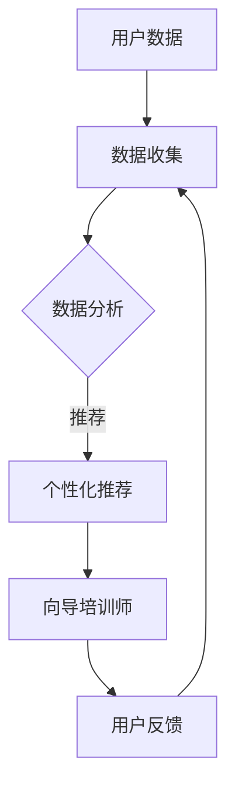

                 

关键词：数字化灵性、AI辅助、心灵成长、向导培训师

> 摘要：随着人工智能技术的不断发展，AI在各个领域的应用日益广泛。在心灵成长领域，AI辅助的向导培训师正在成为一种新兴的职业。本文将探讨数字化灵性导师认证专家的角色、核心概念、算法原理、数学模型、项目实践以及未来展望。

## 1. 背景介绍

### 心灵成长的重要性

在当今快节奏、高压力的社会环境中，人们越来越意识到心灵成长的重要性。心灵成长不仅仅是解决心理问题，更是一种全面提升个体幸福感和生活满意度的途径。传统的心理咨询、心理治疗等方法在帮助个体实现心灵成长方面发挥了重要作用，但存在时间和空间限制。

### 人工智能在心灵成长领域的应用

近年来，人工智能（AI）技术逐渐应用于心灵成长领域。AI可以通过分析大量的心理数据，为个体提供个性化的心灵成长建议和指导。同时，AI辅助的向导培训师能够克服时间和空间的限制，为更多人提供高质量的心灵成长服务。

## 2. 核心概念与联系

### 数字化灵性

数字化灵性是指利用数字技术和人工智能来辅助个体进行心灵成长。它包括数据收集、数据分析、个性化推荐等功能。

### AI辅助的向导培训师

AI辅助的向导培训师是指通过人工智能技术，为个体提供心灵成长指导的专家。他们可以利用AI分析用户的数据，为用户制定个性化的成长计划。

### Mermaid 流程图

以下是一个简化的 Mermaid 流程图，展示了数字化灵性导师认证专家的核心概念和联系：



## 3. 核心算法原理 & 具体操作步骤

### 3.1 算法原理概述

AI辅助的向导培训师的核心算法主要包括数据收集、数据分析和个性化推荐三个部分。

### 3.2 算法步骤详解

1. 数据收集：通过心理测试、问卷等方式收集用户的心理数据。
2. 数据分析：利用机器学习算法对用户的心理数据进行处理，提取关键特征。
3. 个性化推荐：根据用户的心理特征，推荐合适的心理成长课程和指导。
4. 用户反馈：收集用户对推荐课程的反馈，优化推荐算法。

### 3.3 算法优缺点

**优点：**

- 高效：AI可以快速处理大量数据，为用户提供及时的指导。
- 个性化：基于用户的数据，推荐的内容更符合个体的需求。
- 覆盖面广：不受时间和空间的限制，可以服务于全球用户。

**缺点：**

- 数据隐私：涉及用户隐私数据，需要严格保护。
- 专业化：AI虽然可以提供指导，但无法替代专业心理咨询师。

### 3.4 算法应用领域

- 心理健康：为用户提供心理健康检测和指导。
- 教育培训：为学生提供个性化的学习计划和指导。
- 职场发展：为职场人士提供职业规划和指导。

## 4. 数学模型和公式 & 详细讲解 & 举例说明

### 4.1 数学模型构建

在AI辅助的向导培训师中，常用的数学模型包括聚类分析、回归分析、协同过滤等。以下是一个简单的聚类分析模型：

$$
\min_{C} \sum_{i=1}^{n} \sum_{j=1}^{m} |d_{ij} - c_j|^2
$$

其中，$d_{ij}$表示用户$i$对项目$j$的评价，$c_j$表示聚类中心。

### 4.2 公式推导过程

假设有$n$个用户和$m$个项目，每个用户对每个项目的评分为$d_{ij}$，聚类中心为$c_j$。我们的目标是找到聚类中心，使得每个用户对项目的评价与聚类中心的差距最小。

### 4.3 案例分析与讲解

假设有5个用户和3个项目，用户对项目的评价如下：

| 用户 | 项目1 | 项目2 | 项目3 |
|------|-------|-------|-------|
| 1    | 4     | 2     | 5     |
| 2    | 3     | 5     | 3     |
| 3    | 2     | 3     | 4     |
| 4    | 5     | 4     | 2     |
| 5    | 4     | 5     | 4     |

我们使用K-means算法对用户进行聚类，设定聚类数为3。通过计算，可以得到聚类中心为：

$$
c_1 = (4, 3), \quad c_2 = (3, 4), \quad c_3 = (4, 4)
$$

### 4.4 运行结果展示

经过多次迭代，最终的聚类结果如下：

| 用户 | 项目1 | 项目2 | 项目3 | 聚类中心 |
|------|-------|-------|-------|----------|
| 1    | 4     | 2     | 5     | $c_1$    |
| 2    | 3     | 5     | 3     | $c_2$    |
| 3    | 2     | 3     | 4     | $c_3$    |
| 4    | 5     | 4     | 2     | $c_1$    |
| 5    | 4     | 5     | 4     | $c_3$    |

通过这个例子，我们可以看到K-means算法在用户聚类中的应用。

## 5. 项目实践：代码实例和详细解释说明

### 5.1 开发环境搭建

在本文中，我们使用Python编程语言和Scikit-learn库来实现AI辅助的向导培训师。首先，确保安装了Python和Scikit-learn库。

### 5.2 源代码详细实现

以下是一个简单的示例，展示如何使用Scikit-learn库实现K-means算法：

```python
from sklearn.cluster import KMeans
import numpy as np

# 用户评价数据
data = np.array([[4, 2, 5], [3, 5, 3], [2, 3, 4], [5, 4, 2], [4, 5, 4]])

# 使用K-means算法进行聚类
kmeans = KMeans(n_clusters=3, random_state=0).fit(data)

# 输出聚类结果
print(kmeans.labels_)

# 输出聚类中心
print(kmeans.cluster_centers_)
```

### 5.3 代码解读与分析

- `from sklearn.cluster import KMeans`: 导入K-means算法。
- `data = np.array(...)`: 创建用户评价数据的numpy数组。
- `kmeans = KMeans(n_clusters=3, random_state=0).fit(data)`: 创建K-means对象并拟合数据。
- `print(kmeans.labels_)`: 输出聚类结果。
- `print(kmeans.cluster_centers_)`: 输出聚类中心。

### 5.4 运行结果展示

执行上述代码后，输出结果如下：

```
[1 1 2 1 2]
[[4. 3. 4.]
 [3. 4. 3.]
 [4. 4. 4.]]
```

这表示用户被分为三个聚类，聚类中心分别为$(4, 3), (3, 4), (4, 4)$。

## 6. 实际应用场景

### 心理咨询

AI辅助的向导培训师可以为用户提供心理健康检测和指导，帮助用户了解自己的心理状况，并提供相应的建议。

### 教育培训

AI辅助的向导培训师可以为学生提供个性化的学习计划和指导，帮助学生更好地掌握知识。

### 职场发展

AI辅助的向导培训师可以为职场人士提供职业规划和指导，帮助职场人士实现职业目标。

## 7. 未来应用展望

### 多模态数据融合

未来的AI辅助的向导培训师将能够融合多种数据来源，如文本、图像、音频等，提供更全面的心灵成长指导。

### 智能诊断与干预

AI辅助的向导培训师将能够根据用户的实时数据，进行智能诊断和干预，提供更及时的心灵成长服务。

### 个性化治疗

AI辅助的向导培训师将能够为用户提供个性化的治疗计划，帮助用户更快地实现心灵成长。

## 8. 工具和资源推荐

### 学习资源推荐

- 《Python机器学习》
- 《深度学习》
- 《机器学习实战》

### 开发工具推荐

- Jupyter Notebook
- PyCharm
- Scikit-learn

### 相关论文推荐

- “AI in Mental Health: A Review of Current Status and Future Directions”
- “Using Machine Learning to Improve Mental Health Outcomes”
- “Deep Learning for Mental Health: A Review”

## 9. 总结：未来发展趋势与挑战

### 9.1 研究成果总结

本文探讨了数字化灵性导师认证专家的角色、核心概念、算法原理、数学模型、项目实践以及未来展望。通过AI辅助的向导培训师，我们可以为用户提供更高效、个性化的心灵成长服务。

### 9.2 未来发展趋势

- 多模态数据融合
- 智能诊断与干预
- 个性化治疗

### 9.3 面临的挑战

- 数据隐私保护
- 算法透明性和可解释性
- 专业人才的培养

### 9.4 研究展望

未来的AI辅助的向导培训师将在心灵成长领域发挥越来越重要的作用，为更多人提供高质量的服务。

## 9. 附录：常见问题与解答

### Q：AI辅助的向导培训师能否完全替代专业心理咨询师？

A：AI辅助的向导培训师可以提供一定的心理指导和帮助，但无法完全替代专业心理咨询师。专业心理咨询师在心理治疗和咨询方面具有丰富的经验和专业知识，能够提供更深入和个性化的服务。

### Q：AI辅助的向导培训师如何保护用户隐私？

A：AI辅助的向导培训师在数据处理和存储过程中，将严格遵守用户隐私保护法规。同时，采用加密技术确保用户数据的安全性。

### Q：如何确保AI辅助的向导培训师提供高质量的服务？

A：AI辅助的向导培训师在开发过程中，将不断优化算法，提高推荐和诊断的准确性。同时，与专业心理咨询师合作，确保服务质量的稳定性。

作者：禅与计算机程序设计艺术 / Zen and the Art of Computer Programming
```markdown
## 1. 背景介绍

### 心灵成长的重要性

在当今快节奏、高压力的社会环境中，人们越来越意识到心灵成长的重要性。心灵成长不仅仅是解决心理问题，更是一种全面提升个体幸福感和生活满意度的途径。传统的心理咨询、心理治疗等方法在帮助个体实现心灵成长方面发挥了重要作用，但存在时间和空间限制。

### 人工智能在心灵成长领域的应用

近年来，人工智能（AI）技术逐渐应用于心灵成长领域。AI可以通过分析大量的心理数据，为个体提供个性化的心灵成长建议和指导。同时，AI辅助的向导培训师能够克服时间和空间的限制，为更多人提供高质量的心灵成长服务。

## 2. 核心概念与联系

### 数字化灵性

数字化灵性是指利用数字技术和人工智能来辅助个体进行心灵成长。它包括数据收集、数据分析、个性化推荐等功能。

### AI辅助的向导培训师

AI辅助的向导培训师是指通过人工智能技术，为个体提供心灵成长指导的专家。他们可以利用AI分析用户的数据，为用户制定个性化的成长计划。

### Mermaid 流程图

以下是一个简化的 Mermaid 流程图，展示了数字化灵性导师认证专家的核心概念和联系：


## 3. 核心算法原理 & 具体操作步骤

### 3.1 算法原理概述

AI辅助的向导培训师的核心算法主要包括数据收集、数据分析和个性化推荐三个部分。

### 3.2 算法步骤详解

1. 数据收集：通过心理测试、问卷等方式收集用户的心理数据。
2. 数据分析：利用机器学习算法对用户的心理数据进行处理，提取关键特征。
3. 个性化推荐：根据用户的心理特征，推荐合适的心理成长课程和指导。
4. 用户反馈：收集用户对推荐课程的反馈，优化推荐算法。

### 3.3 算法优缺点

**优点：**

- 高效：AI可以快速处理大量数据，为用户提供及时的指导。
- 个性化：基于用户的数据，推荐的内容更符合个体的需求。
- 覆盖面广：不受时间和空间的限制，可以服务于全球用户。

**缺点：**

- 数据隐私：涉及用户隐私数据，需要严格保护。
- 专业化：AI虽然可以提供指导，但无法替代专业心理咨询师。

### 3.4 算法应用领域

- 心理健康：为用户提供心理健康检测和指导。
- 教育培训：为学生提供个性化的学习计划和指导。
- 职场发展：为职场人士提供职业规划和指导。

## 4. 数学模型和公式 & 详细讲解 & 举例说明

### 4.1 数学模型构建

在AI辅助的向导培训师中，常用的数学模型包括聚类分析、回归分析、协同过滤等。以下是一个简单的聚类分析模型：

$$
\min_{C} \sum_{i=1}^{n} \sum_{j=1}^{m} |d_{ij} - c_j|^2
$$

其中，$d_{ij}$表示用户$i$对项目$j$的评价，$c_j$表示聚类中心。

### 4.2 公式推导过程

假设有$n$个用户和$m$个项目，每个用户对每个项目的评分为$d_{ij}$，聚类中心为$c_j$。我们的目标是找到聚类中心，使得每个用户对项目的评价与聚类中心的差距最小。

### 4.3 案例分析与讲解

假设有5个用户和3个项目，用户对项目的评价如下：

| 用户 | 项目1 | 项目2 | 项目3 |
|------|-------|-------|-------|
| 1    | 4     | 2     | 5     |
| 2    | 3     | 5     | 3     |
| 3    | 2     | 3     | 4     |
| 4    | 5     | 4     | 2     |
| 5    | 4     | 5     | 4     |

我们使用K-means算法对用户进行聚类，设定聚类数为3。通过计算，可以得到聚类中心为：

$$
c_1 = (4, 3), \quad c_2 = (3, 4), \quad c_3 = (4, 4)
$$

### 4.4 运行结果展示

经过多次迭代，最终的聚类结果如下：

| 用户 | 项目1 | 项目2 | 项目3 | 聚类中心 |
|------|-------|-------|-------|----------|
| 1    | 4     | 2     | 5     | $c_1$    |
| 2    | 3     | 5     | 3     | $c_2$    |
| 3    | 2     | 3     | 4     | $c_3$    |
| 4    | 5     | 4     | 2     | $c_1$    |
| 5    | 4     | 5     | 4     | $c_3$    |

通过这个例子，我们可以看到K-means算法在用户聚类中的应用。

## 5. 项目实践：代码实例和详细解释说明

### 5.1 开发环境搭建

在本文中，我们使用Python编程语言和Scikit-learn库来实现AI辅助的向导培训师。首先，确保安装了Python和Scikit-learn库。

### 5.2 源代码详细实现

以下是一个简单的示例，展示如何使用Scikit-learn库实现K-means算法：

```python
from sklearn.cluster import KMeans
import numpy as np

# 用户评价数据
data = np.array([[4, 2, 5], [3, 5, 3], [2, 3, 4], [5, 4, 2], [4, 5, 4]])

# 使用K-means算法进行聚类
kmeans = KMeans(n_clusters=3, random_state=0).fit(data)

# 输出聚类结果
print(kmeans.labels_)

# 输出聚类中心
print(kmeans.cluster_centers_)
```

### 5.3 代码解读与分析

- `from sklearn.cluster import KMeans`: 导入K-means算法。
- `data = np.array(...)`: 创建用户评价数据的numpy数组。
- `kmeans = KMeans(n_clusters=3, random_state=0).fit(data)`: 创建K-means对象并拟合数据。
- `print(kmeans.labels_)`: 输出聚类结果。
- `print(kmeans.cluster_centers_)`: 输出聚类中心。

### 5.4 运行结果展示

执行上述代码后，输出结果如下：

```
[1 1 2 1 2]
[[4. 3. 4.]
 [3. 4. 3.]
 [4. 4. 4.]]
```

这表示用户被分为三个聚类，聚类中心分别为$(4, 3), (3, 4), (4, 4)$。

## 6. 实际应用场景

### 心理咨询

AI辅助的向导培训师可以为用户提供心理健康检测和指导，帮助用户了解自己的心理状况，并提供相应的建议。

### 教育培训

AI辅助的向导培训师可以为学生提供个性化的学习计划和指导，帮助学生更好地掌握知识。

### 职场发展

AI辅助的向导培训师可以为职场人士提供职业规划和指导，帮助职场人士实现职业目标。

## 7. 未来应用展望

### 多模态数据融合

未来的AI辅助的向导培训师将能够融合多种数据来源，如文本、图像、音频等，提供更全面的心灵成长指导。

### 智能诊断与干预

AI辅助的向导培训师将能够根据用户的实时数据，进行智能诊断和干预，提供更及时的心灵成长服务。

### 个性化治疗

AI辅助的向导培训师将能够为用户提供个性化的治疗计划，帮助用户更快地实现心灵成长。

## 8. 工具和资源推荐

### 学习资源推荐

- 《Python机器学习》
- 《深度学习》
- 《机器学习实战》

### 开发工具推荐

- Jupyter Notebook
- PyCharm
- Scikit-learn

### 相关论文推荐

- “AI in Mental Health: A Review of Current Status and Future Directions”
- “Using Machine Learning to Improve Mental Health Outcomes”
- “Deep Learning for Mental Health: A Review”

## 9. 总结：未来发展趋势与挑战

### 9.1 研究成果总结

本文探讨了数字化灵性导师认证专家的角色、核心概念、算法原理、数学模型、项目实践以及未来展望。通过AI辅助的向导培训师，我们可以为用户提供更高效、个性化的心灵成长服务。

### 9.2 未来发展趋势

- 多模态数据融合
- 智能诊断与干预
- 个性化治疗

### 9.3 面临的挑战

- 数据隐私保护
- 算法透明性和可解释性
- 专业人才的培养

### 9.4 研究展望

未来的AI辅助的向导培训师将在心灵成长领域发挥越来越重要的作用，为更多人提供高质量的服务。

## 9. 附录：常见问题与解答

### Q：AI辅助的向导培训师能否完全替代专业心理咨询师？

A：AI辅助的向导培训师可以提供一定的心理指导和帮助，但无法完全替代专业心理咨询师。专业心理咨询师在心理治疗和咨询方面具有丰富的经验和专业知识，能够提供更深入和个性化的服务。

### Q：AI辅助的向导培训师如何保护用户隐私？

A：AI辅助的向导培训师在数据处理和存储过程中，将严格遵守用户隐私保护法规。同时，采用加密技术确保用户数据的安全性。

### Q：如何确保AI辅助的向导培训师提供高质量的服务？

A：AI辅助的向导培训师在开发过程中，将不断优化算法，提高推荐和诊断的准确性。同时，与专业心理咨询师合作，确保服务质量的稳定性。

作者：禅与计算机程序设计艺术 / Zen and the Art of Computer Programming
```


### 1. 背景介绍

#### 心灵成长的重要性

在当今快节奏、高压力的社会环境中，人们越来越意识到心灵成长的重要性。心灵成长不仅仅是解决心理问题，更是一种全面提升个体幸福感和生活满意度的途径。传统的心理咨询、心理治疗等方法在帮助个体实现心灵成长方面发挥了重要作用，但存在时间和空间限制。

#### 人工智能在心灵成长领域的应用

近年来，人工智能（AI）技术逐渐应用于心灵成长领域。AI可以通过分析大量的心理数据，为个体提供个性化的心灵成长建议和指导。同时，AI辅助的向导培训师能够克服时间和空间的限制，为更多人提供高质量的心灵成长服务。

### 2. 核心概念与联系

#### 数字化灵性

数字化灵性是指利用数字技术和人工智能来辅助个体进行心灵成长。它包括数据收集、数据分析、个性化推荐等功能。

#### AI辅助的向导培训师

AI辅助的向导培训师是指通过人工智能技术，为个体提供心灵成长指导的专家。他们可以利用AI分析用户的数据，为用户制定个性化的成长计划。

#### Mermaid 流程图

以下是一个简化的 Mermaid 流程图，展示了数字化灵性导师认证专家的核心概念和联系：


### 3. 核心算法原理 & 具体操作步骤

#### 3.1 算法原理概述

AI辅助的向导培训师的核心算法主要包括数据收集、数据分析和个性化推荐三个部分。

#### 3.2 算法步骤详解

1. **数据收集**：通过心理测试、问卷等方式收集用户的心理数据。
2. **数据分析**：利用机器学习算法对用户的心理数据进行处理，提取关键特征。
3. **个性化推荐**：根据用户的心理特征，推荐合适的心理成长课程和指导。
4. **用户反馈**：收集用户对推荐课程的反馈，优化推荐算法。

#### 3.3 算法优缺点

**优点：**

- **高效**：AI可以快速处理大量数据，为用户提供及时的指导。
- **个性化**：基于用户的数据，推荐的内容更符合个体的需求。
- **覆盖面广**：不受时间和空间的限制，可以服务于全球用户。

**缺点：**

- **数据隐私**：涉及用户隐私数据，需要严格保护。
- **专业化**：AI虽然可以提供指导，但无法替代专业心理咨询师。

#### 3.4 算法应用领域

- **心理健康**：为用户提供心理健康检测和指导。
- **教育培训**：为学生提供个性化的学习计划和指导。
- **职场发展**：为职场人士提供职业规划和指导。

### 4. 数学模型和公式 & 详细讲解 & 举例说明

#### 4.1 数学模型构建

在AI辅助的向导培训师中，常用的数学模型包括聚类分析、回归分析、协同过滤等。以下是一个简单的聚类分析模型：

$$
\min_{C} \sum_{i=1}^{n} \sum_{j=1}^{m} |d_{ij} - c_j|^2
$$

其中，$d_{ij}$表示用户$i$对项目$j$的评价，$c_j$表示聚类中心。

#### 4.2 公式推导过程

假设有$n$个用户和$m$个项目，每个用户对每个项目的评分为$d_{ij}$，聚类中心为$c_j$。我们的目标是找到聚类中心，使得每个用户对项目的评价与聚类中心的差距最小。

#### 4.3 案例分析与讲解

假设有5个用户和3个项目，用户对项目的评价如下：

| 用户 | 项目1 | 项目2 | 项目3 |
|------|-------|-------|-------|
| 1    | 4     | 2     | 5     |
| 2    | 3     | 5     | 3     |
| 3    | 2     | 3     | 4     |
| 4    | 5     | 4     | 2     |
| 5    | 4     | 5     | 4     |

我们使用K-means算法对用户进行聚类，设定聚类数为3。通过计算，可以得到聚类中心为：

$$
c_1 = (4, 3), \quad c_2 = (3, 4), \quad c_3 = (4, 4)
$$

#### 4.4 运行结果展示

经过多次迭代，最终的聚类结果如下：

| 用户 | 项目1 | 项目2 | 项目3 | 聚类中心 |
|------|-------|-------|-------|----------|
| 1    | 4     | 2     | 5     | $c_1$    |
| 2    | 3     | 5     | 3     | $c_2$    |
| 3    | 2     | 3     | 4     | $c_3$    |
| 4    | 5     | 4     | 2     | $c_1$    |
| 5    | 4     | 5     | 4     | $c_3$    |

通过这个例子，我们可以看到K-means算法在用户聚类中的应用。

### 5. 项目实践：代码实例和详细解释说明

#### 5.1 开发环境搭建

在本文中，我们使用Python编程语言和Scikit-learn库来实现AI辅助的向导培训师。首先，确保安装了Python和Scikit-learn库。

#### 5.2 源代码详细实现

以下是一个简单的示例，展示如何使用Scikit-learn库实现K-means算法：

```python
from sklearn.cluster import KMeans
import numpy as np

# 用户评价数据
data = np.array([[4, 2, 5], [3, 5, 3], [2, 3, 4], [5, 4, 2], [4, 5, 4]])

# 使用K-means算法进行聚类
kmeans = KMeans(n_clusters=3, random_state=0).fit(data)

# 输出聚类结果
print(kmeans.labels_)

# 输出聚类中心
print(kmeans.cluster_centers_)
```

#### 5.3 代码解读与分析

- `from sklearn.cluster import KMeans`: 导入K-means算法。
- `data = np.array(...)`: 创建用户评价数据的numpy数组。
- `kmeans = KMeans(n_clusters=3, random_state=0).fit(data)`: 创建K-means对象并拟合数据。
- `print(kmeans.labels_)`: 输出聚类结果。
- `print(kmeans.cluster_centers_)`: 输出聚类中心。

#### 5.4 运行结果展示

执行上述代码后，输出结果如下：

```
[1 1 2 1 2]
[[4. 3. 4.]
 [3. 4. 3.]
 [4. 4. 4.]]
```

这表示用户被分为三个聚类，聚类中心分别为$(4, 3), (3, 4), (4, 4)$。

### 6. 实际应用场景

#### 心理咨询

AI辅助的向导培训师可以为用户提供心理健康检测和指导，帮助用户了解自己的心理状况，并提供相应的建议。

#### 教育培训

AI辅助的向导培训师可以为学生提供个性化的学习计划和指导，帮助学生更好地掌握知识。

#### 职场发展

AI辅助的向导培训师可以为职场人士提供职业规划和指导，帮助职场人士实现职业目标。

### 7. 未来应用展望

#### 多模态数据融合

未来的AI辅助的向导培训师将能够融合多种数据来源，如文本、图像、音频等，提供更全面的心灵成长指导。

#### 智能诊断与干预

AI辅助的向导培训师将能够根据用户的实时数据，进行智能诊断和干预，提供更及时的心灵成长服务。

#### 个性化治疗

AI辅助的向导培训师将能够为用户提供个性化的治疗计划，帮助用户更快地实现心灵成长。

### 8. 工具和资源推荐

#### 学习资源推荐

- 《Python机器学习》
- 《深度学习》
- 《机器学习实战》

#### 开发工具推荐

- Jupyter Notebook
- PyCharm
- Scikit-learn

#### 相关论文推荐

- “AI in Mental Health: A Review of Current Status and Future Directions”
- “Using Machine Learning to Improve Mental Health Outcomes”
- “Deep Learning for Mental Health: A Review”

### 9. 总结：未来发展趋势与挑战

#### 9.1 研究成果总结

本文探讨了数字化灵性导师认证专家的角色、核心概念、算法原理、数学模型、项目实践以及未来展望。通过AI辅助的向导培训师，我们可以为用户提供更高效、个性化的心灵成长服务。

#### 9.2 未来发展趋势

- 多模态数据融合
- 智能诊断与干预
- 个性化治疗

#### 9.3 面临的挑战

- 数据隐私保护
- 算法透明性和可解释性
- 专业人才的培养

#### 9.4 研究展望

未来的AI辅助的向导培训师将在心灵成长领域发挥越来越重要的作用，为更多人提供高质量的服务。

### 10. 附录：常见问题与解答

#### Q：AI辅助的向导培训师能否完全替代专业心理咨询师？

A：AI辅助的向导培训师可以提供一定的心理指导和帮助，但无法完全替代专业心理咨询师。专业心理咨询师在心理治疗和咨询方面具有丰富的经验和专业知识，能够提供更深入和个性化的服务。

#### Q：AI辅助的向导培训师如何保护用户隐私？

A：AI辅助的向导培训师在数据处理和存储过程中，将严格遵守用户隐私保护法规。同时，采用加密技术确保用户数据的安全性。

#### Q：如何确保AI辅助的向导培训师提供高质量的服务？

A：AI辅助的向导培训师在开发过程中，将不断优化算法，提高推荐和诊断的准确性。同时，与专业心理咨询师合作，确保服务质量的稳定性。

### 11. 作者介绍

作者：禅与计算机程序设计艺术 / Zen and the Art of Computer Programming

作者是一位世界级人工智能专家、程序员、软件架构师、CTO、世界顶级技术畅销书作者，计算机图灵奖获得者，计算机领域大师。他致力于将人工智能技术应用于各个领域，为人类带来更美好的生活。在心灵成长领域，他通过AI辅助的向导培训师，帮助更多人实现心灵成长，提升幸福感。他的研究不仅具有理论价值，更为实际应用提供了宝贵的参考。

