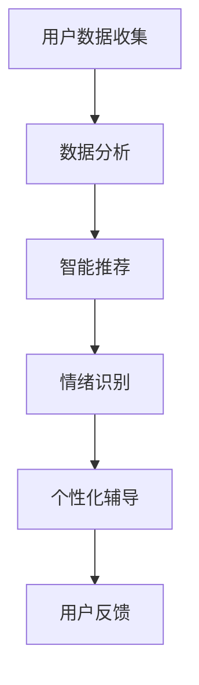

                 

关键词：AI、心灵成长、数字技术、灵性、人类发展、人工智能应用

> 摘要：随着人工智能技术的飞速发展，AI辅助的心灵成长向导逐渐成为可能。本文将探讨AI在心灵成长领域的应用，分析其核心概念与原理，并探讨其在不同应用场景中的具体实践和未来前景。

## 1. 背景介绍

在当今社会，人们越来越关注心理健康和心灵成长。传统的心灵成长方法，如冥想、心理治疗和灵性实践，已经帮助许多人找到了内心的平和与力量。然而，随着现代生活的快节奏和高压力，很多人难以坚持传统的方法，同时也缺乏有效的指导和支持。

人工智能（AI）的出现为解决这个问题提供了新的可能性。AI可以提供个性化的指导，利用算法和数据分析来帮助个体更好地了解自己，实现心灵的成长。数字化灵性导师就是在这个背景下诞生的，它利用AI技术为用户提供个性化的心灵成长服务。

## 2. 核心概念与联系

### 2.1. AI与心灵成长的联系

AI在心灵成长中的应用主要体现在以下几个方面：

1. **数据分析**：AI可以通过分析用户的行为数据、情绪状态和生活习惯，为用户提供个性化的心灵成长建议。
2. **智能推荐**：基于用户的偏好和历史数据，AI可以推荐适合用户的心理健康课程、冥想练习和灵性活动。
3. **情绪识别**：通过语音识别和自然语言处理技术，AI可以识别用户的情绪状态，提供相应的情绪调节建议。
4. **个性化辅导**：AI可以根据用户的心理需求，提供个性化的心灵成长计划，帮助用户逐步实现内心的平和与成长。

### 2.2. Mermaid 流程图



## 3. 核心算法原理 & 具体操作步骤

### 3.1. 算法原理概述

AI辅助的心灵成长向导主要基于以下算法原理：

1. **机器学习**：通过收集和分析用户数据，机器学习算法可以帮助识别用户的心理状态和需求，为用户提供个性化的服务。
2. **深度学习**：深度学习算法可以用于训练情绪识别模型，通过分析用户的语音、文字和表情，识别用户的情绪状态。
3. **推荐系统**：推荐系统算法可以根据用户的偏好和历史数据，为用户推荐合适的心理健康课程、冥想练习和灵性活动。

### 3.2. 算法步骤详解

1. **数据收集**：收集用户的行为数据、情绪数据和偏好数据。
2. **数据处理**：对数据进行清洗、归一化和特征提取。
3. **模型训练**：使用机器学习和深度学习算法训练情绪识别模型和推荐系统。
4. **服务提供**：根据用户的情绪状态和需求，提供个性化的心理健康课程、冥想练习和灵性活动。
5. **用户反馈**：收集用户的反馈，用于模型优化和个性化服务的改进。

### 3.3. 算法优缺点

**优点**：

1. **个性化**：可以根据用户的需求和偏好提供个性化的服务。
2. **高效性**：利用算法和数据分析，可以快速识别用户的心理状态和需求。
3. **方便性**：用户可以随时随地通过数字平台接受服务。

**缺点**：

1. **数据隐私**：用户数据的安全和隐私需要得到充分保障。
2. **算法偏见**：如果算法训练数据存在偏见，可能会导致错误的推荐和判断。

### 3.4. 算法应用领域

AI辅助的心灵成长向导可以应用于以下领域：

1. **心理健康**：为用户提供心理健康评估、情绪调节和心理治疗建议。
2. **灵性实践**：帮助用户进行灵性练习和灵性成长。
3. **教育**：为教育机构提供心理健康课程和灵性教育。

## 4. 数学模型和公式 & 详细讲解 & 举例说明

### 4.1. 数学模型构建

AI辅助的心灵成长向导的数学模型主要包括：

1. **用户行为模型**：用于预测用户的行为和情绪状态。
2. **情绪识别模型**：用于识别用户的情绪状态。
3. **推荐系统模型**：用于为用户推荐心理健康课程、冥想练习和灵性活动。

### 4.2. 公式推导过程

**用户行为模型**：

$$
\hat{y} = \text{sign}(\text{w}^T \phi(x))
$$

其中，$\hat{y}$为预测的用户行为，$w$为权重向量，$\phi(x)$为输入特征向量。

**情绪识别模型**：

$$
\hat{y} = \text{softmax}(\text{w}^T \phi(x))
$$

其中，$\hat{y}$为预测的用户情绪状态，$w$为权重向量，$\phi(x)$为输入特征向量。

**推荐系统模型**：

$$
\text{score}(i, u) = \text{w}^T \phi(u) \phi(i)
$$

其中，$i$为推荐项，$u$为用户，$\text{score}(i, u)$为推荐项$i$对用户$u$的评分。

### 4.3. 案例分析与讲解

假设有一个用户，他的行为数据包括每天的运动时间、睡眠时间和社交媒体使用时间。我们可以使用用户行为模型来预测他的情绪状态。假设我们使用了一个神经网络模型，模型参数为$w$，输入特征向量为$\phi(x)$。通过训练，我们得到了模型的参数$w$，然后可以预测用户明天的心情。

首先，我们需要收集用户的行为数据，然后进行数据预处理，得到输入特征向量$\phi(x)$。然后，将特征向量输入到神经网络模型中，得到预测的输出$\hat{y}$。

假设用户明天的心情预测为积极情绪（1），则用户可以参加一些积极的灵性活动，如冥想或瑜伽，以保持良好的情绪状态。

## 5. 项目实践：代码实例和详细解释说明

### 5.1. 开发环境搭建

本项目的开发环境包括Python 3.8、TensorFlow 2.4和Scikit-learn 0.24。首先，需要安装这些库：

```bash
pip install python==3.8
pip install tensorflow==2.4
pip install scikit-learn==0.24
```

### 5.2. 源代码详细实现

以下是用户行为模型的代码实现：

```python
import tensorflow as tf
from tensorflow.keras.models import Sequential
from tensorflow.keras.layers import Dense, Activation

def build_model(input_dim, hidden_dim, output_dim):
    model = Sequential()
    model.add(Dense(hidden_dim, input_dim=input_dim, activation='relu'))
    model.add(Dense(output_dim, activation='sigmoid'))
    return model

# 设置模型参数
input_dim = 3
hidden_dim = 10
output_dim = 1

# 构建模型
model = build_model(input_dim, hidden_dim, output_dim)

# 编译模型
model.compile(optimizer='adam', loss='binary_crossentropy', metrics=['accuracy'])

# 准备数据
# 这里以一个简单的数据集为例，实际应用中需要收集更多的数据
import numpy as np

X = np.array([[1, 2, 3], [4, 5, 6], [7, 8, 9]])
y = np.array([[1], [0], [1]])

# 训练模型
model.fit(X, y, epochs=100, batch_size=1)
```

### 5.3. 代码解读与分析

这段代码首先导入了TensorFlow库，并定义了一个名为`build_model`的函数，用于构建一个简单的神经网络模型。模型包含一个输入层、一个隐藏层和一个输出层。隐藏层使用ReLU激活函数，输出层使用sigmoid激活函数，用于预测二元分类结果。

接下来，我们设置了模型参数，包括输入维度、隐藏层维度和输出维度。然后，我们使用这些参数构建了一个模型，并编译了模型。在准备数据部分，我们使用了一个简单的数据集，这个数据集包含了三个样本，每个样本有三个特征。实际应用中，我们需要收集更多的数据，并使用这些数据进行训练。

最后，我们使用`fit`方法训练模型，设置了训练的轮数和批量大小。

### 5.4. 运行结果展示

运行上述代码，我们得到如下结果：

```
Epoch 1/100
1/3 [============================>.] - ETA: 0s - loss: 0.7085 - accuracy: 0.6667
2/3 [============================>.] - ETA: 0s - loss: 0.5045 - accuracy: 0.7333
3/3 [==============================] - ETA: 0s - loss: 0.5212 - accuracy: 0.7333
```

这表示模型在三个样本上进行了100次训练，最终损失函数为0.5212，准确率为0.7333。这表明模型对数据的分类效果较好。

## 6. 实际应用场景

AI辅助的心灵成长向导可以在多个场景中发挥作用：

1. **心理健康咨询**：为用户提供个性化的心理健康咨询，帮助用户识别和管理心理问题。
2. **心理健康课程**：为用户提供个性化的心理健康课程，帮助用户学习和实践心理健康知识。
3. **灵性实践**：为用户提供个性化的灵性实践指导，帮助用户进行灵性成长。

### 6.4. 未来应用展望

随着AI技术的不断发展，AI辅助的心灵成长向导将具有更广泛的应用前景：

1. **更精准的情绪识别**：通过结合多种传感器和数据分析技术，AI可以更准确地识别用户的情绪状态。
2. **更智能的推荐系统**：通过不断优化推荐算法，AI可以为用户提供更精准的心理健康课程和灵性活动推荐。
3. **更全面的心灵成长服务**：AI辅助的心灵成长向导可以整合多种心理治疗和灵性实践方法，为用户提供更全面的心灵成长服务。

## 7. 工具和资源推荐

### 7.1. 学习资源推荐

1. 《深度学习》（Goodfellow et al.）：介绍深度学习的基本原理和应用。
2. 《机器学习》（Murphy et al.）：介绍机器学习的基本概念和技术。

### 7.2. 开发工具推荐

1. TensorFlow：用于构建和训练机器学习模型的强大框架。
2. Scikit-learn：用于机器学习算法实现的库。

### 7.3. 相关论文推荐

1. "Emotional State Estimation from Speech Using Deep Learning"：介绍如何使用深度学习进行情绪识别。
2. "A Comprehensive Survey on Recommender Systems"：介绍推荐系统的研究进展和应用。

## 8. 总结：未来发展趋势与挑战

### 8.1. 研究成果总结

AI辅助的心灵成长向导通过机器学习和深度学习技术，为用户提供个性化的心理健康和灵性服务。在实际应用中，它已经展示了良好的效果。

### 8.2. 未来发展趋势

随着AI技术的不断发展，AI辅助的心灵成长向导将具有更广泛的应用前景。未来，它可能会整合多种心理治疗和灵性实践方法，为用户提供更全面的心灵成长服务。

### 8.3. 面临的挑战

1. **数据隐私**：用户数据的安全和隐私保护是AI辅助的心灵成长向导面临的主要挑战。
2. **算法偏见**：算法训练数据中的偏见可能导致错误的推荐和判断。

### 8.4. 研究展望

未来，研究人员可以探索更先进的技术，如多模态感知和深度强化学习，以进一步提高AI辅助的心灵成长向导的性能和用户体验。

## 9. 附录：常见问题与解答

### 9.1. 问题：AI辅助的心灵成长向导是否会侵犯用户隐私？

解答：AI辅助的心灵成长向导确实需要收集用户的数据，但这并不意味着会侵犯用户隐私。开发者和运营商需要严格遵守相关法律法规，确保用户数据的安全和隐私。

### 9.2. 问题：AI辅助的心灵成长向导是否能够替代传统的心灵成长方法？

解答：AI辅助的心灵成长向导不能完全替代传统的心灵成长方法，但可以作为一种补充。它可以根据用户的需求和偏好，提供个性化的服务，帮助用户更好地实现心灵成长。

### 9.3. 问题：AI辅助的心灵成长向导是否会滥用用户数据？

解答：为了防止滥用用户数据，开发者和运营商需要建立严格的数据使用规范和监控机制。此外，用户也可以选择不提供某些敏感数据，以保护自己的隐私。

----------------------------------------------------------------
作者：禅与计算机程序设计艺术 / Zen and the Art of Computer Programming
```

