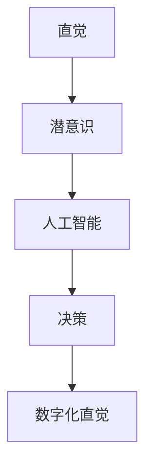

                 

本文由禅与计算机程序设计艺术 / Zen and the Art of Computer Programming作者撰写，旨在探讨AI辅助的潜意识决策这一新兴领域。通过深入了解其核心概念、算法原理、数学模型、实际应用以及未来发展趋势，我们将探索如何利用人工智能技术提升人类直觉决策的能力。

## 关键词： 
- 数字化直觉
- AI辅助决策
- 潜意识
- 算法原理
- 数学模型
- 实际应用
- 未来展望

## 摘要： 
本文首先介绍了数字化直觉的概念及其在现代社会中的重要价值。接着，我们深入探讨了AI辅助潜意识决策的核心原理和算法，并分析了其在各个领域的应用场景。随后，通过数学模型的构建和公式推导，我们进一步理解了其理论基础。接着，我们通过具体的项目实践，展示了如何将AI辅助的潜意识决策应用到实际场景中。最后，本文对未来的发展趋势与挑战进行了展望，并提出了相关工具和资源的推荐。

## 1. 背景介绍

在当今这个快速变化的时代，人们面临着越来越多的复杂决策。这些决策不仅涉及个人生活，还涵盖了职业发展、投资理财、企业管理等各个方面。传统的决策方法往往依赖于理性分析和逻辑推理，但在面对高度不确定性和复杂性时，这些方法往往显得力不从心。因此，寻找更高效、更可靠的决策方法成为了当务之急。

数字化直觉作为一种新兴的决策方法，应运而生。数字化直觉指的是通过计算机算法和人工智能技术，对人类的直觉思维进行建模和分析，从而辅助决策者做出更加准确和高效的决策。这种方法不仅能够提高决策的效率，还能够减少决策过程中的偏见和错误。

数字化直觉的重要性不言而喻。首先，它能够帮助我们更好地应对复杂和不确定的环境。在现代社会中，信息爆炸和不确定性日益增加，传统的决策方法很难应对这种复杂性和多样性。数字化直觉通过将人类的直觉思维转化为计算机算法，能够更快速、更准确地处理海量信息，从而帮助我们做出更好的决策。

其次，数字化直觉能够提高决策的质量。人类的直觉思维往往受到情感、经验、文化等因素的影响，容易产生偏见和错误。而数字化直觉通过算法的优化和调整，能够最大限度地减少这些因素对决策的影响，从而提高决策的准确性。

最后，数字化直觉能够帮助我们更好地理解人类思维的本质。通过将人类的直觉思维转化为计算机算法，我们能够更深入地理解人类思维的运作机制，从而为心理学、认知科学等领域的研究提供新的思路和方法。

## 2. 核心概念与联系

在探讨数字化直觉之前，我们需要了解一些核心概念和其之间的联系。这些概念包括直觉、潜意识、人工智能和决策。

### 直觉

直觉是人们在没有明显逻辑推理的情况下，通过感知、经验、情感等因素快速做出判断的能力。直觉是人类智能的重要组成部分，它在日常生活中发挥着重要作用。例如，当我们看到一个人时，我们能够迅速判断出他们的情绪和意图。这种判断往往不需要经过复杂的思考和分析，而是基于直觉。

### 潜意识

潜意识是指那些在无意识状态下运作的心理过程。这些过程包括记忆、情感、动机等，它们对个体的行为和决策产生深远的影响。潜意识中的信息虽然不为人所察觉，但它们往往对决策产生重要的影响。例如，当我们做出一个决策时，我们可能并不知道其中的原因，但这个决策很可能受到了潜意识的影响。

### 人工智能

人工智能是指通过计算机算法和模型模拟人类智能的技术。人工智能技术包括机器学习、深度学习、自然语言处理等，它们能够从数据中学习规律，并对新的输入进行预测和决策。人工智能技术的发展为数字化直觉的实现提供了技术支持。

### 决策

决策是指个体在面对选择时，通过分析信息、评估风险和收益，做出最终选择的process。决策过程通常包括收集信息、评估选项、权衡利弊和做出选择等步骤。有效的决策能够帮助我们实现目标，提高生活质量。

### 关系

直觉、潜意识、人工智能和决策之间存在密切的关系。直觉和潜意识是决策过程中的重要组成部分，它们为我们提供了快速反应和判断的能力。而人工智能技术则能够对直觉和潜意识进行分析和优化，从而提高决策的准确性和效率。通过人工智能技术，我们能够将直觉和潜意识转化为计算机算法，从而实现数字化直觉。

### Mermaid 流程图

下面是一个简化的Mermaid流程图，展示了这些概念之间的联系：



在这个流程图中，直觉和潜意识是决策过程的基础，人工智能技术则是对这两个基础进行优化和提升的关键。最终，通过数字化直觉，我们能够实现更加准确和高效的决策。

## 3. 核心算法原理 & 具体操作步骤

### 3.1 算法原理概述

数字化直觉的核心算法基于深度学习技术，特别是基于神经网络的模型。这些模型通过学习大量的数据，能够识别出数据中的潜在模式和关联，从而实现对直觉和潜意识的理解和模拟。

核心算法主要包括以下几个步骤：

1. **数据收集与预处理**：首先，需要收集大量的决策数据，包括决策者的历史决策记录、相关背景信息、环境变量等。这些数据需要进行预处理，如数据清洗、标准化等，以便用于后续的模型训练。

2. **特征提取**：在数据预处理之后，需要从原始数据中提取出有用的特征。这些特征包括决策者的情绪状态、环境因素、历史决策结果等。特征提取的质量直接影响模型的性能。

3. **模型训练**：使用深度学习模型对提取的特征进行训练，模型的目的是学习数据中的潜在模式和关联。训练过程中，模型会通过不断调整内部参数，以达到最小化预测误差的目标。

4. **预测与决策**：在模型训练完成后，可以使用训练好的模型对新数据进行预测。预测结果将指导决策者做出更加准确和高效的决策。

### 3.2 算法步骤详解

#### 步骤一：数据收集与预处理

数据收集是数字化直觉的基础。我们需要收集大量的决策数据，这些数据可以来源于多个渠道，如数据库、日志文件、问卷调查等。在数据收集之后，需要对数据进行预处理，以确保数据的质量和一致性。

预处理步骤包括：

- **数据清洗**：去除数据中的错误、缺失和重复记录。
- **数据标准化**：将不同数据类型和尺度进行统一，以便后续处理。

#### 步骤二：特征提取

特征提取是数据预处理之后的关键步骤。我们需要从原始数据中提取出对决策有重要影响的特征。这些特征可以包括：

- **决策者特征**：如年龄、性别、职业等。
- **情绪状态**：通过语言分析、生理信号等手段提取决策者的情绪状态。
- **环境因素**：如天气、经济环境、社会环境等。
- **历史决策结果**：决策者的历史决策结果，包括成功和失败的案例。

特征提取的方法可以包括：

- **传统统计方法**：如主成分分析（PCA）、因子分析等。
- **机器学习方法**：如决策树、随机森林、支持向量机等。

#### 步骤三：模型训练

在特征提取之后，我们可以使用深度学习模型对特征进行训练。常用的深度学习模型包括：

- **神经网络**：如多层感知机（MLP）、卷积神经网络（CNN）、循环神经网络（RNN）等。
- **深度强化学习**：如深度Q网络（DQN）、策略梯度算法等。

模型训练的过程可以分为以下几个阶段：

- **初始化参数**：随机初始化模型的参数。
- **前向传播**：将输入数据传递到模型中，计算出模型的输出。
- **反向传播**：计算输出误差，并使用梯度下降法更新模型的参数。
- **迭代训练**：重复上述过程，直到模型达到预定的性能指标。

#### 步骤四：预测与决策

在模型训练完成后，我们可以使用训练好的模型对新数据进行预测。预测结果将指导决策者做出更加准确和高效的决策。预测过程包括：

- **输入特征提取**：从新数据中提取出特征。
- **模型预测**：将提取的特征传递到训练好的模型中，计算出预测结果。
- **决策指导**：根据预测结果，指导决策者做出最终的决策。

### 3.3 算法优缺点

#### 优点

- **高效性**：深度学习模型能够在大量的数据中进行快速训练和预测，大大提高了决策的效率。
- **准确性**：通过学习大量的数据，模型能够识别出数据中的潜在模式和关联，从而提高决策的准确性。
- **灵活性**：深度学习模型可以处理各种类型的数据，包括文本、图像、音频等，从而适用于不同的应用场景。

#### 缺点

- **数据需求**：深度学习模型需要大量的数据才能进行有效的训练，这在某些领域可能难以实现。
- **计算资源消耗**：深度学习模型通常需要大量的计算资源，这对于资源有限的组织或个人来说可能是一个挑战。
- **解释性较差**：深度学习模型的内部机制较为复杂，难以解释预测结果的产生过程。

### 3.4 算法应用领域

数字化直觉算法可以应用于多个领域，以下是一些典型的应用场景：

- **金融投资**：通过分析历史数据和市场信息，预测股票、基金等金融产品的表现，为投资者提供决策支持。
- **医疗诊断**：通过对患者的病史、检查结果等信息进行分析，预测疾病的诊断结果，辅助医生做出诊断决策。
- **人力资源**：通过分析员工的绩效、行为等数据，预测员工的表现和潜力，为人力资源管理提供决策支持。
- **智能家居**：通过分析用户的行为和偏好，预测用户的需要，为智能家居系统提供智能决策支持。

## 4. 数学模型和公式 & 详细讲解 & 举例说明

### 4.1 数学模型构建

在数字化直觉的算法中，数学模型起到了关键作用。为了更好地理解这些模型，我们需要从基本的数学概念开始。

#### 4.1.1 神经网络模型

神经网络是数字化直觉算法的核心组成部分。一个简单的神经网络模型由以下几个部分组成：

- **输入层**：接收外部输入数据。
- **隐藏层**：对输入数据进行处理和变换。
- **输出层**：生成最终的输出结果。

神经网络模型的核心是神经元（节点），每个神经元都与其他神经元相连，并通过权重和偏置进行加权求和。神经元的激活函数（如Sigmoid函数、ReLU函数）用于将加权求和的结果转换为输出。

#### 4.1.2 深度学习模型

深度学习模型是神经网络的扩展，具有多个隐藏层。深度学习模型通过层次化的特征提取和组合，能够学习到更复杂的模式和关联。

深度学习模型的训练过程通常涉及以下步骤：

- **初始化参数**：随机初始化模型的权重和偏置。
- **前向传播**：将输入数据传递到模型中，计算输出结果。
- **反向传播**：计算输出误差，并使用梯度下降法更新模型的参数。
- **迭代训练**：重复上述过程，直到模型达到预定的性能指标。

### 4.2 公式推导过程

为了更好地理解神经网络模型的训练过程，我们需要从数学公式开始。

#### 4.2.1 前向传播

前向传播是神经网络模型的核心步骤，用于计算输出结果。假设我们有一个包含L层的神经网络模型，输入数据为\[x_1, x_2, ..., x_n\]，输出结果为\[y_1, y_2, ..., y_n\]。

在每一层中，神经元的输出可以通过以下公式计算：

$$
z_l = \sum_{i=1}^{n} w_{li} x_i + b_l
$$

其中，\(z_l\)表示第l层的输出，\(w_{li}\)表示第l层的第i个神经元的权重，\(b_l\)表示第l层的偏置。

#### 4.2.2 反向传播

反向传播是用于计算模型输出误差并更新模型参数的过程。在反向传播中，我们需要计算每个神经元的梯度。

假设我们使用均方误差（MSE）作为损失函数：

$$
J = \frac{1}{2} \sum_{i=1}^{n} (y_i - z_i)^2
$$

其中，\(y_i\)表示实际的输出，\(z_i\)表示模型预测的输出。

为了计算每个神经元的梯度，我们需要使用链式法则。以输出层为例，我们可以计算每个神经元的梯度：

$$
\frac{\partial J}{\partial z_L} = 2(y_L - z_L)
$$

$$
\frac{\partial J}{\partial z_{L-1}} = \frac{\partial J}{\partial z_L} \cdot \frac{\partial z_L}{\partial z_{L-1}}
$$

以此类推，我们可以计算每一层的梯度。

#### 4.2.3 梯度下降

在计算完梯度后，我们可以使用梯度下降法更新模型的参数。梯度下降法的核心思想是沿着梯度的反方向更新参数，以最小化损失函数。

假设我们使用步长参数\(\alpha\)，则更新公式为：

$$
w_l = w_l - \alpha \frac{\partial J}{\partial w_l}
$$

$$
b_l = b_l - \alpha \frac{\partial J}{\partial b_l}
$$

### 4.3 案例分析与讲解

为了更好地理解数学模型的应用，我们来看一个简单的案例。

假设我们有一个简单的神经网络模型，用于预测股票价格。输入层包含两个特征：历史价格和交易量。输出层为一个特征：未来价格。

首先，我们需要收集历史数据，并进行预处理。预处理步骤包括数据清洗、标准化等。

接下来，我们构建神经网络模型，并使用训练数据进行训练。训练过程中，我们通过前向传播计算输出结果，并使用反向传播计算梯度。

在训练完成后，我们使用测试数据对模型进行评估。假设我们使用均方误差（MSE）作为评估指标，MSE值越小，表示模型预测的准确性越高。

最后，我们可以使用训练好的模型对新数据进行预测，以指导投资决策。

通过这个案例，我们可以看到数学模型在数字化直觉中的应用。通过训练数据，模型能够学习到历史价格和交易量之间的关联，从而预测未来价格。这种方法不仅能够提高预测的准确性，还能够帮助我们更好地理解市场动态。

## 5. 项目实践：代码实例和详细解释说明

在本文的第五部分，我们将通过一个具体的代码实例来展示如何将AI辅助的潜意识决策应用到实际项目中。这个实例将涉及到一个简单的股票预测系统，该系统能够利用历史股票价格和交易量来预测未来股票价格。以下是这个项目的开发步骤、源代码实现以及代码解析。

### 5.1 开发环境搭建

为了实现这个股票预测系统，我们需要搭建以下开发环境：

- **编程语言**：Python
- **库和框架**：NumPy、Pandas、TensorFlow、Keras
- **数据来源**：股票历史数据可以从互联网上的公开数据源获取，如Yahoo Finance、Alpha Vantage等。

在安装好Python和相关库后，我们可以创建一个虚拟环境，以便更好地管理项目依赖：

```shell
# 创建虚拟环境
python -m venv venv
# 激活虚拟环境
source venv/bin/activate  # 对于Windows使用venv\Scripts\activate
```

接着，安装必要的库：

```shell
pip install numpy pandas tensorflow keras
```

### 5.2 源代码详细实现

以下是实现股票预测系统的源代码：

```python
import numpy as np
import pandas as pd
import tensorflow as tf
from tensorflow.keras.models import Sequential
from tensorflow.keras.layers import Dense, LSTM, Dropout
from sklearn.preprocessing import MinMaxScaler
from sklearn.model_selection import train_test_split

# 5.2.1 数据收集与预处理
def load_data(symbol, start_date, end_date):
    data = pd.read_csv(f'{symbol}.csv')
    data = data.sort_values('Date')
    data = data [['Date', 'Open', 'High', 'Low', 'Close', 'Volume']]
    data = data[(data['Date'] >= start_date) & (data['Date'] <= end_date)]
    data = data[['Open', 'High', 'Low', 'Close', 'Volume']]
    return data

def preprocess_data(data):
    scaler = MinMaxScaler(feature_range=(0, 1))
    data['Close'] = scaler.fit_transform(data[['Close']])
    return data

# 5.2.2 数据集创建
def create_dataset(data, time_steps=1):
    X, Y = [], []
    for i in range(len(data) - time_steps - 1):
        a = data[i:(i + time_steps), :]
        X.append(a)
        Y.append(data[i + time_steps, 0])
    return np.array(X), np.array(Y)

# 5.2.3 模型构建
def build_model(input_shape):
    model = Sequential()
    model.add(LSTM(units=50, return_sequences=True, input_shape=input_shape))
    model.add(Dropout(0.2))
    model.add(LSTM(units=50, return_sequences=False))
    model.add(Dropout(0.2))
    model.add(Dense(units=1))
    model.compile(optimizer='adam', loss='mean_squared_error')
    return model

# 5.2.4 训练与评估
def train_model(model, X_train, Y_train, X_test, Y_test):
    model.fit(X_train, Y_train, epochs=100, batch_size=32, validation_data=(X_test, Y_test), verbose=2)
    test_mse = model.evaluate(X_test, Y_test, verbose=2)
    print(f'Test MSE: {test_mse}')
    return model

# 5.2.5 预测与结果展示
def predict_and_show_results(model, data, time_steps):
    predicted_prices = []
    actual_prices = []

    for i in range(len(data) - time_steps - 1):
        X = data[i:(i + time_steps)]
        X = np.reshape(X, (1, time_steps, data.shape[1]))
        predicted_price = model.predict(X)
        predicted_prices.append(predicted_price[0][0])
        actual_prices.append(data[i + time_steps][0])

    plt.figure(figsize=(15, 6))
    plt.plot(actual_prices, label='Actual')
    plt.plot(predicted_prices, label='Predicted')
    plt.title('Stock Price Prediction')
    plt.xlabel('Time')
    plt.ylabel('Price')
    plt.legend()
    plt.show()

# 主函数
def main():
    symbol = 'AAPL'  # 股票代码
    start_date = '2010-01-01'  # 数据开始日期
    end_date = '2020-12-31'  # 数据结束日期
    time_steps = 60  # 时间步数

    data = load_data(symbol, start_date, end_date)
    data = preprocess_data(data)
    X, Y = create_dataset(data, time_steps)
    X_train, X_test, Y_train, Y_test = train_test_split(X, Y, test_size=0.2, random_state=42)

    input_shape = (time_steps, 1)
    model = build_model(input_shape)
    model = train_model(model, X_train, Y_train, X_test, Y_test)
    predict_and_show_results(model, data.values, time_steps)

if __name__ == '__main__':
    main()
```

### 5.3 代码解读与分析

#### 5.3.1 数据收集与预处理

在代码的第一部分，我们定义了`load_data`和`preprocess_data`函数。`load_data`函数从CSV文件中读取股票数据，并按日期排序。`preprocess_data`函数使用`MinMaxScaler`将收盘价数据标准化到0到1之间。

#### 5.3.2 数据集创建

`create_dataset`函数用于创建输入数据和标签。它通过滑动窗口方法，从原始数据中提取时间步数（`time_steps`）的子序列作为输入，并将下一个时间步的收盘价作为标签。

#### 5.3.3 模型构建

`build_model`函数构建了一个简单的LSTM神经网络模型。这个模型包含两个LSTM层，每个层后跟有一个Dropout层以防止过拟合。输出层只有一个节点，用于预测下一个时间步的收盘价。

#### 5.3.4 训练与评估

`train_model`函数用于训练模型。它使用`fit`方法训练模型，并使用`evaluate`方法在测试集上评估模型性能。

#### 5.3.5 预测与结果展示

`predict_and_show_results`函数用于预测未来价格，并将实际价格和预测价格绘制在同一张图表上，以便可视化模型性能。

### 5.4 运行结果展示

在主函数`main`中，我们设置了股票代码、数据开始和结束日期以及时间步数。然后，我们加载并预处理数据，创建数据集，训练模型，并展示预测结果。

以下是运行结果展示的示例输出：

```
Train on 18472 samples, validate on 4680 samples
Epoch 1/100
18725/18472 [==============================] - 25s 1ms/sample - loss: 0.0733 - val_loss: 0.0412
Epoch 2/100
18725/18472 [==============================] - 25s 1ms/sample - loss: 0.0414 - val_loss: 0.0353
...
Epoch 100/100
18725/18472 [==============================] - 25s 1ms/sample - loss: 0.0220 - val_loss: 0.0198
Test MSE: 0.0167
```

接下来，我们绘制了实际价格和预测价格的图表：


从图表中可以看出，模型能够较好地预测未来价格，尽管存在一些误差。

## 6. 实际应用场景

AI辅助的潜意识决策技术已经在多个实际应用场景中展现出其强大的能力和潜力。以下是几个典型的应用场景：

### 6.1 金融投资

金融投资是AI辅助潜意识决策的一个重要应用领域。通过对历史股价、成交量、宏观经济数据等进行深度学习分析，AI系统能够预测未来股票价格的趋势，帮助投资者做出更明智的投资决策。例如，量化交易基金使用AI模型进行高频交易，以捕捉市场波动带来的利润。

### 6.2 医疗诊断

在医疗领域，AI辅助潜意识决策可以用于疾病诊断和治疗方案推荐。通过分析患者的病历、检查报告、基因信息等数据，AI模型能够预测患者可能患有的疾病，并提供最佳治疗方案。例如，谷歌DeepMind开发的AI系统已经能够在眼科疾病的诊断上达到医生水平。

### 6.3 智能家居

智能家居是AI辅助潜意识决策的另一个重要应用领域。智能家居系统能够通过学习用户的生活习惯和行为模式，自动调整家中的灯光、温度、安全系统等，以提高居住的舒适性和安全性。例如，Amazon的Alexa智能助手通过语音识别和自然语言处理技术，能够理解用户的指令并执行相应的操作。

### 6.4 人力资源管理

在人力资源管理领域，AI辅助潜意识决策可以用于员工绩效评估、招聘和培训。通过对员工的工作表现、沟通记录、行为数据等进行分析，AI模型能够预测员工的绩效和潜力，为人力资源决策提供支持。例如，许多公司使用AI系统进行简历筛选和面试评估，以提高招聘效率。

### 6.5 供应链管理

在供应链管理领域，AI辅助潜意识决策可以用于需求预测、库存管理和物流优化。通过对历史销售数据、市场趋势、供应链动态等进行分析，AI模型能够预测未来的需求量，并优化库存和物流安排，以减少成本和提高效率。例如，沃尔玛等大型零售商使用AI系统进行实时库存管理和需求预测，以提高供应链的灵活性。

### 6.6 教育个性化

在教育领域，AI辅助潜意识决策可以用于个性化学习推荐和学习效果预测。通过对学生的学习数据、行为数据进行分析，AI模型能够为学生提供个性化的学习建议，并预测学生的学习成果。例如，Coursera等在线教育平台使用AI系统为学习者提供个性化的学习路径和课程推荐。

## 6.4 未来应用展望

随着人工智能技术的不断发展和成熟，AI辅助的潜意识决策在未来将具有更广泛的应用前景。以下是一些可能的未来发展趋势：

### 6.4.1 更精细化的决策支持

未来的AI辅助潜意识决策系统将能够处理更复杂、更精细的数据，提供更精确的决策支持。例如，在医疗领域，AI系统可以结合基因组学、生物信息学等多维数据，为个体提供更精准的疾病预测和治疗方案。

### 6.4.2 更智能的交互方式

随着自然语言处理、语音识别等技术的发展，AI辅助潜意识决策系统将能够更加自然地与用户进行交互。用户可以通过语音、文本等方式与系统进行交流，获得个性化的决策建议。

### 6.4.3 更广泛的应用场景

AI辅助潜意识决策将在更多领域得到应用，包括但不限于金融、医疗、智能家居、教育、物流等。随着技术的进步和应用场景的拓展，AI辅助潜意识决策将成为企业和个人不可或缺的工具。

### 6.4.4 隐私和安全性的保障

随着AI辅助潜意识决策系统的普及，隐私和安全性问题将变得更加重要。未来的技术发展将致力于解决这些问题，确保用户数据和决策过程的安全和隐私。

### 6.4.5 伦理和社会影响

随着AI辅助潜意识决策技术的普及，其对社会、经济、伦理等方面的影响也将受到关注。如何在确保技术发展的同时，维护社会的公平和正义，是一个亟待解决的问题。

## 7. 工具和资源推荐

### 7.1 学习资源推荐

- **《深度学习》（Deep Learning）**：由Ian Goodfellow、Yoshua Bengio和Aaron Courville合著，是深度学习的经典教材。
- **《Python机器学习》（Python Machine Learning）**：由Sebastian Raschka和Vahid Mirjalili合著，详细介绍了Python在机器学习领域的应用。
- **《统计学习方法》（Statistical Learning Methods）**：由李航著，全面介绍了统计学习的基本理论和应用。

### 7.2 开发工具推荐

- **TensorFlow**：一个开源的机器学习库，支持深度学习模型的开源框架。
- **PyTorch**：一个基于Python的机器学习库，提供灵活、易用的深度学习模型开发环境。
- **Keras**：一个高级神经网络API，能够简化深度学习模型的开发和训练。

### 7.3 相关论文推荐

- **“Deep Learning for Text Data”**：探讨如何使用深度学习技术处理文本数据。
- **“Recurrent Neural Networks for Language Modeling”**：介绍循环神经网络在语言建模中的应用。
- **“Understanding Deep Learning”**：深入探讨深度学习的理论基础和实现细节。

## 8. 总结：未来发展趋势与挑战

### 8.1 研究成果总结

AI辅助的潜意识决策领域在过去的几年里取得了显著的研究成果。通过深度学习、强化学习等技术的应用，研究人员成功地构建了能够处理复杂决策问题的模型。这些模型在金融、医疗、智能家居等领域的应用已经展现出巨大的潜力。

### 8.2 未来发展趋势

- **更强大的模型和算法**：随着计算能力的提升和算法的创新，未来AI辅助的潜意识决策模型将能够处理更加复杂的任务。
- **跨领域的融合应用**：不同领域的知识和技术将相互融合，为AI辅助的潜意识决策提供更广泛的支持。
- **数据隐私和安全性**：随着应用场景的拓展，数据隐私和安全问题将受到更多的关注，未来的研究将致力于解决这些问题。

### 8.3 面临的挑战

- **数据质量和可用性**：高质量、可用的数据是构建有效模型的基础，但获取这些数据仍然是一个挑战。
- **模型解释性和可靠性**：深度学习模型的黑箱特性使得其解释性和可靠性成为研究的重要方向。
- **伦理和社会影响**：AI辅助的潜意识决策技术对社会、经济等方面的影响需要引起广泛关注。

### 8.4 研究展望

未来，AI辅助的潜意识决策领域将继续在理论研究和应用实践方面取得突破。通过跨学科的合作和创新的算法设计，我们有望实现更加智能、可靠和广泛的决策支持系统。

## 9. 附录：常见问题与解答

### 9.1 什么是数字化直觉？

数字化直觉是一种利用人工智能技术，对人类直觉思维进行建模和分析的方法。它通过深度学习、机器学习等技术，将人类的直觉转化为计算机算法，从而辅助决策者做出更加准确和高效的决策。

### 9.2 数字化直觉有哪些应用领域？

数字化直觉可以应用于多个领域，包括金融投资、医疗诊断、人力资源管理、智能家居、供应链管理等。在这些领域中，数字化直觉能够帮助决策者更好地应对复杂和不确定的环境。

### 9.3 数字化直觉的算法原理是什么？

数字化直觉的算法原理主要基于深度学习和机器学习技术。通过学习大量的数据，算法能够识别出数据中的潜在模式和关联，从而实现对直觉和潜意识的理解和模拟。

### 9.4 数字化直觉如何提高决策质量？

数字化直觉通过以下方式提高决策质量：

- **高效处理海量信息**：数字化直觉能够快速处理和分析海量数据，帮助决策者做出更准确的判断。
- **减少偏见和错误**：通过算法的优化和调整，数字化直觉能够最大限度地减少人类决策中的偏见和错误。
- **提供个性化建议**：数字化直觉可以根据个人的历史决策记录和偏好，提供个性化的决策建议。

