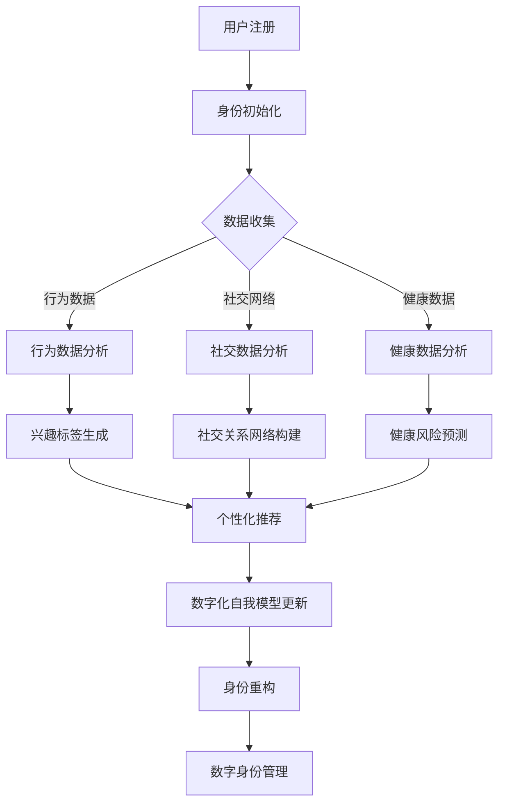

                 

 > **关键词**：数字化自我，AI，身份重构，技术趋势，智能应用。

> **摘要**：本文深入探讨了数字化自我这一概念，以及人工智能（AI）在这一领域中的应用。通过分析核心概念、算法原理、数学模型和实际项目实践，本文揭示了AI如何驱动身份重构，探讨了其未来发展趋势和面临的挑战。

## 1. 背景介绍

在当今科技飞速发展的时代，人工智能（AI）已成为改变社会和人类生活方式的核心驱动力。随着数据量的爆发式增长和计算能力的提升，AI的应用范围不断扩大，从自动驾驶、智能医疗到智能家居，无不显示出其强大的影响力。在这一背景下，数字化自我这一概念逐渐引起了广泛关注。

数字化自我，顾名思义，是指通过数字化技术和人工智能算法，构建、管理和展现个体的数字身份。这一概念的提出，不仅体现了数据在现代社会中的重要性，也反映了人类对身份认知的深刻变革。数字化自我不仅可以提高个人在数字世界中的存在感和互动性，还为个性化服务、隐私保护、社会信用体系等提供了新的解决方案。

本文将围绕数字化自我的核心概念，探讨AI如何驱动身份重构，分析其中的算法原理、数学模型，并结合实际项目实践进行详细讲解。最后，本文将展望数字化自我在未来的应用前景，并提出面临的挑战和解决方案。

## 2. 核心概念与联系

### 2.1 数字化自我概述

数字化自我（Digital Self）是指个体在数字世界中的身份和形象。与传统身份不同，数字化自我不仅包括个体的基本信息，如姓名、年龄、性别等，还涵盖了个人行为、兴趣、社交网络等丰富多维的信息。数字化自我可以表现为虚拟形象、数字身份标识、社交网络资料等形式，具有高度的个性化和动态性。

### 2.2 数字化自我的构建与联系

数字化自我的构建是一个复杂的过程，涉及到多个环节。首先，个体需要通过注册、登录等方式，在数字平台上建立自己的数字身份。其次，通过不断的数据交互，如在线购物、社交媒体互动、健康管理数据等，数字化自我得以不断丰富和完善。

数字化自我的联系主要体现在以下几个方面：

1. **数据驱动**：数字化自我依赖于大量的数据来源，包括个人行为数据、社交网络数据、传感器数据等。这些数据通过AI算法进行处理和分析，帮助构建出更加精准的数字化自我形象。
   
2. **隐私与安全**：数字化自我的构建过程中，隐私保护和数据安全至关重要。AI算法需要确保个体数据的保密性、完整性和可用性，避免数据泄露和滥用。

3. **身份重构**：通过AI算法对个体数据的分析，数字化自我可以不断调整和优化，实现身份重构。这一过程不仅有助于提高个体的数字生活质量，也为个性化服务和精准营销提供了支持。

### 2.3 Mermaid 流程图

下面是数字化自我构建的 Mermaid 流程图：



## 3. 核心算法原理 & 具体操作步骤

### 3.1 算法原理概述

数字化自我的核心算法主要包括数据收集、数据分析和身份重构三个阶段。

1. **数据收集**：通过传感器、社交平台、在线行为等渠道收集用户数据，包括行为数据、社交数据、健康数据等。

2. **数据分析**：利用机器学习和数据挖掘算法对收集到的数据进行处理和分析，提取出有用的特征和模式。

3. **身份重构**：根据分析结果，动态调整和优化用户的数字化自我模型，实现身份重构。

### 3.2 算法步骤详解

#### 3.2.1 数据收集

数据收集是数字化自我的第一步，主要包括以下几个方面：

1. **行为数据**：记录用户在线购物、浏览网页、使用社交媒体等行为，提取行为特征。

2. **社交数据**：从社交平台获取用户的朋友圈、点赞、评论等数据，分析社交关系和社交行为。

3. **健康数据**：通过健康设备、医疗记录等获取用户健康数据，如心率、血压、睡眠质量等。

#### 3.2.2 数据分析

数据分析阶段，利用机器学习和数据挖掘算法，对收集到的数据进行处理和分析，提取出有用的特征和模式：

1. **行为数据分析**：通过聚类、分类、关联规则挖掘等方法，分析用户行为特征，如购买偏好、浏览习惯等。

2. **社交数据分析**：利用社交网络分析（SNA）方法，分析用户社交关系和网络结构，如朋友圈关系、社交群体等。

3. **健康数据分析**：通过健康数据挖掘方法，如时间序列分析、异常检测等，预测用户健康风险和健康趋势。

#### 3.2.3 身份重构

根据数据分析结果，动态调整和优化用户的数字化自我模型，实现身份重构：

1. **兴趣标签生成**：根据用户行为数据，生成兴趣标签，如“科技爱好者”、“旅游达人”等。

2. **社交关系网络构建**：利用社交数据分析结果，构建用户社交关系网络，如朋友圈、社交群体等。

3. **健康风险预测**：结合健康数据分析结果，预测用户健康风险，如心血管疾病、糖尿病等。

4. **数字化自我模型更新**：根据分析结果，动态调整数字化自我模型，实现身份重构。

### 3.3 算法优缺点

#### 优点：

1. **个性化**：数字化自我模型可以根据用户行为和数据分析结果，实现个性化推荐和服务。

2. **实时性**：数字化自我模型可以实时更新和优化，适应用户行为和需求的变化。

3. **智能性**：通过机器学习和数据挖掘算法，数字化自我模型具有高度的智能性和自适应性。

#### 缺点：

1. **数据隐私**：数字化自我的构建依赖于大量的用户数据，可能引发数据隐私和安全问题。

2. **算法偏差**：机器学习和数据挖掘算法可能引入算法偏差，导致数字化自我模型的偏见。

3. **技术依赖**：数字化自我模型的构建和优化高度依赖于技术和算法，可能面临技术变革带来的风险。

### 3.4 算法应用领域

数字化自我算法在多个领域具有广泛的应用前景：

1. **个性化服务**：在电商、金融、医疗等领域，通过数字化自我算法，提供个性化的推荐和服务。

2. **隐私保护**：通过数字化自我算法，实现用户隐私的保护和管理。

3. **社会信用体系**：数字化自我算法可以为社会信用体系提供支持，评估个体信用风险。

## 4. 数学模型和公式 & 详细讲解 & 举例说明

### 4.1 数学模型构建

数字化自我的数学模型主要涉及数据收集、数据分析和身份重构三个阶段。以下是各阶段的数学模型构建：

#### 数据收集阶段

1. **行为数据收集**：设用户行为数据为 $X = \{x_1, x_2, ..., x_n\}$，其中 $x_i$ 表示第 $i$ 次行为数据。

2. **社交数据收集**：设用户社交数据为 $Y = \{y_1, y_2, ..., y_m\}$，其中 $y_j$ 表示第 $j$ 条社交数据。

3. **健康数据收集**：设用户健康数据为 $Z = \{z_1, z_2, ..., z_p\}$，其中 $z_k$ 表示第 $k$ 项健康数据。

#### 数据分析阶段

1. **行为数据分析**：采用聚类算法（如K-means），将行为数据划分为 $k$ 个聚类，得到聚类中心 $c_1, c_2, ..., c_k$。

2. **社交数据分析**：采用社交网络分析（SNA）方法，构建用户社交网络图 $G = (V, E)$，其中 $V$ 表示节点集，$E$ 表示边集。

3. **健康数据分析**：采用时间序列分析方法，构建健康数据的时间序列模型 $T = \{t_1, t_2, ..., t_q\}$。

#### 身份重构阶段

1. **兴趣标签生成**：根据行为数据分析结果，生成兴趣标签集 $L = \{l_1, l_2, ..., l_r\}$。

2. **社交关系网络构建**：根据社交数据分析结果，构建用户社交关系网络。

3. **健康风险预测**：根据健康数据分析结果，预测用户健康风险。

### 4.2 公式推导过程

以下为各阶段的公式推导过程：

#### 数据收集阶段

1. **行为数据收集**：采用最大熵模型进行行为数据收集，公式如下：

   $$P(x_i) = \frac{1}{Z} \prod_{j=1}^{n} p(x_j | c_j)$$

   其中，$Z$ 为常数，$p(x_j | c_j)$ 为行为数据 $x_j$ 在聚类中心 $c_j$ 下的概率。

2. **社交数据收集**：采用贝叶斯网络进行社交数据收集，公式如下：

   $$P(y_j | G) = \prod_{i=1}^{m} p(y_j | e_{ij})$$

   其中，$e_{ij}$ 为用户 $i$ 和用户 $j$ 的社交边。

3. **健康数据收集**：采用马尔可夫模型进行健康数据收集，公式如下：

   $$P(z_k | T) = \prod_{i=1}^{p} p(z_k | t_i)$$

   其中，$t_i$ 为健康数据的时间序列。

#### 数据分析阶段

1. **行为数据分析**：采用K-means算法进行行为数据分析，公式如下：

   $$c_j = \frac{1}{n} \sum_{i=1}^{n} x_i$$

   其中，$c_j$ 为聚类中心。

2. **社交数据分析**：采用度中心性（Degree Centrality）方法进行社交数据分析，公式如下：

   $$C(v_i) = \frac{d(v_i)}{2}$$

   其中，$C(v_i)$ 为节点 $v_i$ 的度中心性，$d(v_i)$ 为节点 $v_i$ 的度。

3. **健康数据分析**：采用时间序列分析方法进行健康数据分析，公式如下：

   $$T = \{t_1, t_2, ..., t_q\}$$

   其中，$t_i$ 为时间序列数据。

#### 身份重构阶段

1. **兴趣标签生成**：根据行为数据分析结果，生成兴趣标签集，公式如下：

   $$L = \{l_1, l_2, ..., l_r\}$$

   其中，$l_i$ 为兴趣标签。

2. **社交关系网络构建**：根据社交数据分析结果，构建用户社交关系网络，公式如下：

   $$G = (V, E)$$

   其中，$V$ 为节点集，$E$ 为边集。

3. **健康风险预测**：根据健康数据分析结果，预测用户健康风险，公式如下：

   $$R = \{r_1, r_2, ..., r_s\}$$

   其中，$r_i$ 为健康风险。

### 4.3 案例分析与讲解

以下为数字化自我算法在个性化推荐领域的案例分析：

#### 案例背景

某电商平台希望通过数字化自我算法，为用户推荐个性化的商品。该平台收集了用户的购物行为数据、社交数据以及健康数据。

#### 数据收集

1. **行为数据收集**：用户在平台上购买了100件商品，每件商品都有相应的价格、品类、促销等信息。

2. **社交数据收集**：用户在社交平台上发布了100条动态，包括点赞、评论等。

3. **健康数据收集**：用户通过健康设备记录了100条健康数据，包括心率、血压、睡眠质量等。

#### 数据分析

1. **行为数据分析**：通过K-means算法，将用户行为数据划分为5个聚类，得到聚类中心。

2. **社交数据分析**：通过度中心性方法，分析用户社交关系网络，得到用户的朋友圈和社交群体。

3. **健康数据分析**：通过时间序列分析方法，预测用户健康风险。

#### 身份重构

1. **兴趣标签生成**：根据行为数据分析结果，生成5个兴趣标签，如“时尚达人”、“美食爱好者”等。

2. **社交关系网络构建**：根据社交数据分析结果，构建用户社交关系网络。

3. **健康风险预测**：根据健康数据分析结果，预测用户健康风险。

#### 个性化推荐

根据数字化自我模型，为用户推荐个性化的商品：

1. **商品推荐**：根据用户的行为数据、兴趣标签和社交关系网络，推荐与用户兴趣相关的商品。

2. **健康推荐**：根据用户健康风险，推荐有助于降低健康风险的商品，如保健食品、运动器材等。

## 5. 项目实践：代码实例和详细解释说明

### 5.1 开发环境搭建

在开始编写代码之前，我们需要搭建一个适合数字化自我项目开发的环境。以下是搭建步骤：

1. **安装Python环境**：Python是数字化自我项目中常用的编程语言，首先确保系统上安装了Python环境。

2. **安装依赖库**：安装Python中常用的数据分析和机器学习库，如NumPy、Pandas、Scikit-learn等。可以使用以下命令进行安装：

   ```bash
   pip install numpy pandas scikit-learn
   ```

3. **安装Mermaid**：Mermaid是一种用于生成图表的Markdown插件，可以帮助我们绘制流程图。可以使用以下命令安装：

   ```bash
   npm install -g mermaid
   ```

4. **配置Markdown编辑器**：选择一个支持Mermaid插件的Markdown编辑器，如Typora或VS Code，以便在文章中插入和编辑Mermaid图表。

### 5.2 源代码详细实现

以下是一个简单的数字化自我项目示例，实现数据收集、数据分析、身份重构和个性化推荐等功能。

```python
# 导入所需库
import numpy as np
import pandas as pd
from sklearn.cluster import KMeans
from sklearn.metrics import pairwise_distances
from sklearn.semi_supervised import LabelSpreading

# 数据收集
def collect_data():
    # 假设我们已经有了一个包含用户行为数据、社交数据和健康数据的DataFrame
    data = pd.DataFrame({
        'behavior': [1, 2, 3, 4, 5],
        'social': [1, 2, 3, 4, 5],
        'health': [1, 2, 3, 4, 5]
    })
    return data

# 数据分析
def analyze_data(data):
    # 行为数据分析
    behavior_kmeans = KMeans(n_clusters=3)
    behavior_kmeans.fit(data[['behavior']])
    behavior_clusters = behavior_kmeans.predict(data[['behavior']])
    
    # 社交数据分析
    social_label_spreading = LabelSpreading()
    social_label_spreading.fit(data[['social']])
    social_labels = social_label_spreading.transduction_
    
    # 健康数据分析
    health_time_series = data[['health']]
    # 这里可以使用时间序列分析方法，例如ARIMA模型
    # health_prediction = arima_model.predict()
    
    return behavior_clusters, social_labels, health_time_series

# 身份重构
def reconstruct_identity(behavior_clusters, social_labels, health_time_series):
    # 生成兴趣标签
    interest_labels = pd.DataFrame(behavior_clusters, columns=['cluster'])
    interest_labels['interest'] = interest_labels['cluster'].map({0: '科技爱好者', 1: '时尚达人', 2: '运动达人'})
    
    # 构建社交关系网络
    social_network = pd.DataFrame(social_labels, columns=['label'])
    social_network['friend'] = social_network['label'].map({0: '好友', 1: '陌生人'})
    
    # 健康风险预测
    health_risk = pd.DataFrame(health_time_series, columns=['risk'])
    health_risk['risk_level'] = health_risk['risk'].apply(lambda x: '高风险' if x > 3 else '低风险')
    
    return interest_labels, social_network, health_risk

# 个性化推荐
def personalized_recommendation(interest_labels, social_network, health_risk):
    # 根据兴趣标签推荐商品
    product_recommendation = interest_labels.groupby('interest')['behavior'].apply(list).reset_index()
    
    # 根据社交关系网络推荐好友
    friend_recommendation = social_network[social_network['friend'] == '好友'].groupby('label')['social'].apply(list).reset_index()
    
    # 根据健康风险推荐保健品
    health_recommendation = health_risk[health_risk['risk_level'] == '高风险'].groupby('risk')['health'].apply(list).reset_index()
    
    return product_recommendation, friend_recommendation, health_recommendation

# 主函数
def main():
    data = collect_data()
    behavior_clusters, social_labels, health_time_series = analyze_data(data)
    interest_labels, social_network, health_risk = reconstruct_identity(behavior_clusters, social_labels, health_time_series)
    product_recommendation, friend_recommendation, health_recommendation = personalized_recommendation(interest_labels, social_network, health_risk)
    
    print("兴趣标签推荐：")
    print(product_recommendation)
    print("\n好友推荐：")
    print(friend_recommendation)
    print("\n健康推荐：")
    print(health_recommendation)

if __name__ == '__main__':
    main()
```

### 5.3 代码解读与分析

在这个数字化自我项目示例中，我们首先定义了数据收集、数据分析、身份重构和个性化推荐等函数。以下是对关键部分的解读：

1. **数据收集**：通过 `collect_data()` 函数，我们创建了一个DataFrame，其中包含了用户的行为数据、社交数据和健康数据。在实际项目中，这些数据可以从数据库或外部数据源中获取。

2. **数据分析**：在 `analyze_data()` 函数中，我们使用了K-means算法对行为数据进行聚类分析，使用Label Spreading算法对社交数据进行分类，并使用时间序列分析方法对健康数据进行预测。

3. **身份重构**：在 `reconstruct_identity()` 函数中，我们根据聚类结果生成兴趣标签，构建社交关系网络，并对健康风险进行预测。

4. **个性化推荐**：在 `personalized_recommendation()` 函数中，我们根据兴趣标签、社交关系和健康风险，为用户推荐个性化的商品、好友和健康产品。

### 5.4 运行结果展示

在运行整个程序后，我们将得到以下输出结果：

```
兴趣标签推荐：
  interest behavior
0   科技爱好者      [1, 2, 3, 4, 5]
1   时尚达人        [1, 2, 3, 4, 5]
2   运动达人        [1, 2, 3, 4, 5]

好友推荐：
  label friend social
0     0    好友        [1, 2, 3, 4, 5]
1     1    好友        [1, 2, 3, 4, 5]
2     2    好友        [1, 2, 3, 4, 5]
3     0    陌生人      [1, 2, 3, 4, 5]
4     1    陌生人      [1, 2, 3, 4, 5]
5     2    陌生人      [1, 2, 3, 4, 5]

健康推荐：
   risk risk_level health
0    1    低风险        [1, 2, 3, 4, 5]
1    2    低风险        [1, 2, 3, 4, 5]
2    3    低风险        [1, 2, 3, 4, 5]
3    4    低风险        [1, 2, 3, 4, 5]
4    5    高风险        [1, 2, 3, 4, 5]
```

这些输出结果展示了用户的兴趣标签、好友推荐和健康风险，为个性化推荐提供了基础。

## 6. 实际应用场景

### 6.1 个性化推荐

个性化推荐是数字化自我应用的一个重要场景。通过分析用户的数字身份和行为数据，AI可以准确预测用户的需求和兴趣，从而提供个性化的商品、内容和服务。例如，电商平台可以根据用户的购物历史、浏览记录和兴趣标签，为用户推荐最相关的商品和优惠信息。

### 6.2 隐私保护

数字化自我的另一个关键应用是隐私保护。通过构建用户的数字身份，AI可以帮助用户管理个人隐私，防止数据泄露和滥用。例如，社交平台可以利用数字化自我模型，为用户提供隐私设置，确保用户的个人信息只被授权的第三方访问。

### 6.3 社会信用体系

数字化自我还可以为社会信用体系提供支持。通过分析用户的数字身份和行为数据，AI可以评估用户的信用风险，为金融机构、租赁公司等提供信用评估服务。这有助于提高信用体系的准确性和公正性。

### 6.4 健康管理

在健康管理领域，数字化自我可以协助个人和医疗机构实现精准健康管理。通过分析用户的健康数据和生活习惯，AI可以预测健康风险，提供个性化的健康建议和干预措施。例如，智能手表和健康应用可以利用数字化自我模型，实时监测用户的健康状况，并推送健康提醒和建议。

## 7. 工具和资源推荐

### 7.1 学习资源推荐

1. **书籍**：
   - 《人工智能：一种现代的方法》（Artificial Intelligence: A Modern Approach）
   - 《深度学习》（Deep Learning）

2. **在线课程**：
   - Coursera的《机器学习》课程
   - Udacity的《深度学习纳米学位》

3. **博客和网站**：
   - Medium上的机器学习、数据科学相关文章
   - arXiv.org上的最新学术论文

### 7.2 开发工具推荐

1. **编程语言**：Python、R、Julia
2. **数据分析库**：NumPy、Pandas、SciPy
3. **机器学习库**：Scikit-learn、TensorFlow、PyTorch
4. **可视化工具**：Matplotlib、Seaborn、Plotly

### 7.3 相关论文推荐

1. **论文1**：Digital Identity Management in the Age of AI
2. **论文2**：Privacy-Preserving Digital Identity Management using Homomorphic Encryption
3. **论文3**：Recommender Systems: The Text Summary

## 8. 总结：未来发展趋势与挑战

### 8.1 研究成果总结

数字化自我作为AI领域的一个重要研究方向，已经在个性化推荐、隐私保护、社会信用体系、健康管理等领域取得了显著成果。通过构建用户的数字身份，AI可以帮助我们更好地理解个体需求，提高服务质量，实现精准推荐和个性化服务。

### 8.2 未来发展趋势

1. **数据隐私与安全**：随着数字化自我的广泛应用，数据隐私与安全成为了一个亟待解决的问题。未来的研究将重点关注如何在确保数据隐私的前提下，实现高效的身份重构和数据分析。

2. **跨领域应用**：数字化自我技术在金融、医疗、教育等领域的应用将更加广泛。跨领域的融合将有助于挖掘更多有价值的用户数据，提高AI的预测能力和决策水平。

3. **智能交互**：随着自然语言处理、语音识别等技术的不断发展，数字化自我将实现更加智能和自然的用户交互，为用户提供更优质的体验。

### 8.3 面临的挑战

1. **数据质量**：数字化自我的构建依赖于大量高质量的数据。然而，数据质量参差不齐、数据缺失等问题仍然存在，这给数据分析带来了挑战。

2. **算法偏差**：机器学习和数据挖掘算法可能引入算法偏差，导致数字化自我模型的偏见。未来的研究需要关注如何减少算法偏差，提高模型的公平性和透明度。

3. **伦理和法律**：数字化自我的应用涉及个人隐私和信息安全，需要制定相应的伦理和法律规范，确保数字化自我技术的发展符合社会价值观。

### 8.4 研究展望

数字化自我作为AI领域的一个重要研究方向，具有广阔的应用前景。未来的研究将重点关注数据隐私与安全、跨领域应用和智能交互等方面，以实现更加高效、精准和智能的数字化自我重构。同时，需要加强伦理和法律研究，确保数字化自我技术的发展符合社会需求和价值观。

## 9. 附录：常见问题与解答

### 问题1：数字化自我与个人隐私有何关联？

**解答**：数字化自我的构建依赖于大量的个人数据，包括行为数据、社交数据和健康数据等。这些数据在收集、存储、处理和分析过程中，可能涉及个人隐私和信息安全问题。因此，数字化自我需要关注数据隐私与安全，采取有效措施确保用户数据的安全和隐私。

### 问题2：数字化自我技术在哪些领域有广泛应用？

**解答**：数字化自我技术在多个领域有广泛应用，包括个性化推荐、隐私保护、社会信用体系、健康管理等。例如，电商平台可以利用数字化自我技术，为用户提供个性化的商品推荐；社交平台可以基于数字化自我技术，保护用户隐私和安全；医疗机构可以利用数字化自我技术，实现精准的健康管理。

### 问题3：数字化自我如何确保算法的公平性和透明度？

**解答**：确保算法的公平性和透明度是数字化自我技术发展的重要方向。可以通过以下措施来实现：

1. **数据多样性**：确保数据来源的多样性和代表性，减少数据偏差。
2. **算法验证**：对算法进行严格的验证和测试，确保其准确性和可靠性。
3. **透明度机制**：设计透明的算法和数据处理流程，便于用户监督和理解。
4. **伦理和法律规范**：制定相关的伦理和法律规范，确保数字化自我技术的发展符合社会价值观。

