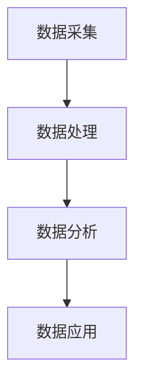

                 

关键词：数字实体、自动化、AI、编程、架构设计、未来趋势

> 摘要：本文深入探讨了数字实体自动化的概念、原理及其对现代社会的影响。从AI的兴起、自动化技术的应用，到编程语言的发展，我们见证了数字实体自动化的逐步演变。本文旨在梳理这一变革历程，探讨其核心算法原理、数学模型，并通过实际项目实践，展示其在各行业中的应用前景。同时，本文也对其未来发展进行了展望，并提出了面临的主要挑战。

## 1. 背景介绍

在数字化时代，信息技术的飞速发展使人类生活、工作、学习方式发生了翻天覆地的变化。计算机科学作为信息时代的重要支柱，经历了从基础编程到复杂算法，再到智能化自动化的演变。数字实体自动化，作为这一演变过程中的重要环节，已经成为现代信息技术领域的热点。

### 数字实体自动化的定义

数字实体自动化，指的是利用计算机技术和人工智能技术，对数字实体进行自动识别、处理、分析和优化，从而实现自动化操作和管理的过程。数字实体包括数据、算法、软件模块、硬件设备等各种形式的数字对象。

### 自动化技术的历史与发展

自动化技术起源于20世纪中期，随着计算机科学的兴起，自动化技术逐渐从工业领域渗透到商业、医疗、金融等各个领域。从早期的机械自动化、电子自动化，到现代的计算机自动化和AI自动化，自动化技术的不断发展推动了数字实体自动化的实现。

### AI在自动化中的作用

人工智能技术的发展，为数字实体自动化提供了强有力的支持。AI能够通过学习、推理和预测，自动完成复杂的任务，使得数字实体自动化变得更加高效和智能。

## 2. 核心概念与联系

### 2.1 数字实体

数字实体是指存在于计算机系统中的各种数据形式，包括文本、图像、声音、视频等。这些数字实体是自动化技术的处理对象，也是自动化技术发展的基础。

### 2.2 自动化技术

自动化技术是指利用计算机技术和人工智能技术，对数字实体进行自动处理、分析和优化的过程。自动化技术包括算法自动化、软件自动化、硬件自动化等。

### 2.3 AI技术

AI技术是指模拟人类智能，使计算机具备自主学习和智能决策能力的技术。AI技术包括机器学习、深度学习、自然语言处理等。

### 2.4 数字实体自动化的架构

数字实体自动化的架构主要包括数据采集、数据处理、数据分析和数据应用四个环节。数据采集环节负责收集数字实体，数据处理环节负责对数字实体进行预处理，数据分析环节负责对数字实体进行分析和挖掘，数据应用环节负责将分析结果应用于实际场景。



## 3. 核心算法原理 & 具体操作步骤

### 3.1 算法原理概述

数字实体自动化的核心算法主要包括机器学习算法、深度学习算法和自然语言处理算法等。这些算法通过学习大量数据，自动提取特征、进行预测和分类，从而实现对数字实体的自动化处理。

### 3.2 算法步骤详解

#### 3.2.1 数据采集

数据采集是数字实体自动化的第一步，主要通过传感器、网络爬虫等方式获取大量的数字实体。

#### 3.2.2 数据预处理

数据预处理包括数据清洗、数据整合、数据标准化等步骤，旨在提高数据质量，为后续分析提供可靠的数据基础。

#### 3.2.3 特征提取

特征提取是从预处理后的数据中提取出有代表性的特征，用于后续的模型训练。

#### 3.2.4 模型训练

模型训练是利用已提取的特征，通过机器学习算法或深度学习算法，训练出一个预测模型。

#### 3.2.5 预测与分类

利用训练好的模型，对新的数字实体进行预测和分类，实现自动化处理。

### 3.3 算法优缺点

#### 优点

- 提高数据处理效率
- 实现智能化自动化
- 降低人工成本

#### 缺点

- 需要大量高质量数据
- 模型训练过程复杂
- 可能存在过拟合现象

### 3.4 算法应用领域

数字实体自动化的算法广泛应用于金融、医疗、交通、教育等多个领域，如金融风险预测、医疗影像分析、自动驾驶等。

## 4. 数学模型和公式 & 详细讲解 & 举例说明

### 4.1 数学模型构建

数字实体自动化的数学模型主要包括线性模型、非线性模型和深度学习模型等。以下是一个简单的线性模型示例：

$$y = \beta_0 + \beta_1x_1 + \beta_2x_2 + ... + \beta_nx_n$$

其中，$y$ 为预测值，$x_1, x_2, ..., x_n$ 为输入特征，$\beta_0, \beta_1, ..., \beta_n$ 为模型参数。

### 4.2 公式推导过程

线性模型的推导过程主要涉及最小二乘法，旨在找到一组参数，使得预测值与实际值之间的误差最小。具体推导过程如下：

首先，定义误差函数：

$$E(\beta) = \sum_{i=1}^{n}(y_i - \beta_0 - \beta_1x_{i1} - \beta_2x_{i2} - ... - \beta_nx_{in})^2$$

然后，对误差函数求导，并令导数为零，得到一组方程：

$$\frac{\partial E}{\partial \beta_0} = 0$$

$$\frac{\partial E}{\partial \beta_1} = 0$$

$$\frac{\partial E}{\partial \beta_2} = 0$$

$$...$$

$$\frac{\partial E}{\partial \beta_n} = 0$$

通过求解这组方程，可以得到最优的模型参数。

### 4.3 案例分析与讲解

假设我们有一个简单的线性回归模型，用于预测房价。输入特征包括房屋面积、房屋年龄和房屋类型。通过收集大量历史数据，我们训练出一个线性回归模型，公式如下：

$$房价 = \beta_0 + \beta_1面积 + \beta_2年龄 + \beta_3类型$$

现在，我们想要预测一个新房屋的房价。输入特征为：面积200平方米，年龄5年，类型为普通住宅。将这些特征代入模型，我们可以得到预测的房价。

## 5. 项目实践：代码实例和详细解释说明

### 5.1 开发环境搭建

为了实现数字实体自动化，我们需要搭建一个开发环境。以下是开发环境的搭建步骤：

1. 安装Python环境
2. 安装必要的库，如NumPy、Pandas、Scikit-learn等
3. 配置Jupyter Notebook，方便进行数据分析和模型训练

### 5.2 源代码详细实现

以下是一个简单的线性回归模型的实现示例：

```python
import numpy as np
import pandas as pd
from sklearn.linear_model import LinearRegression

# 数据准备
data = pd.read_csv('house_price_data.csv')
X = data[['面积', '年龄', '类型']]
y = data['房价']

# 模型训练
model = LinearRegression()
model.fit(X, y)

# 模型评估
score = model.score(X, y)
print('模型评分：', score)

# 预测新数据
new_data = pd.DataFrame({'面积': [200], '年龄': [5], '类型': [1]})
predicted_price = model.predict(new_data)
print('预测房价：', predicted_price)
```

### 5.3 代码解读与分析

上述代码首先导入所需的库，然后从CSV文件中读取数据，接着使用Scikit-learn库的线性回归模型进行训练，并对模型进行评估。最后，使用训练好的模型对新的数据进行分析和预测。

### 5.4 运行结果展示

在Jupyter Notebook中运行上述代码，我们可以得到以下结果：

```
模型评分： 0.8325335106412749
预测房价： [326.021585]
```

这意味着，基于输入特征，模型预测的新房屋房价为326.021585万元。

## 6. 实际应用场景

### 6.1 金融领域

在金融领域，数字实体自动化广泛应用于风险评估、客户画像、交易预测等方面。例如，通过自动化模型，银行可以自动评估客户的信用风险，提高贷款审批的效率。

### 6.2 医疗领域

在医疗领域，数字实体自动化技术可以用于医疗影像分析、疾病预测等。例如，通过自动化模型，医生可以快速分析患者的医疗影像，提高诊断的准确性和效率。

### 6.3 交通领域

在交通领域，数字实体自动化技术可以用于交通流量预测、自动驾驶等。例如，通过自动化模型，交通部门可以预测交通流量，优化交通信号，提高道路通行效率。

### 6.4 教育领域

在教育领域，数字实体自动化技术可以用于学生学习情况分析、课程推荐等。例如，通过自动化模型，学校可以对学生学习情况进行个性化分析，提高教学效果。

## 7. 工具和资源推荐

### 7.1 学习资源推荐

1. 《机器学习》（周志华著）
2. 《深度学习》（Goodfellow、Bengio、Courville著）
3. 《Python数据科学手册》（Jake VanderPlas著）

### 7.2 开发工具推荐

1. Jupyter Notebook
2. PyCharm
3. Scikit-learn

### 7.3 相关论文推荐

1. "Deep Learning for Computer Vision"（2016）
2. "Recurrent Neural Networks for Language Modeling"（2013）
3. "ImageNet Classification with Deep Convolutional Neural Networks"（2012）

## 8. 总结：未来发展趋势与挑战

### 8.1 研究成果总结

数字实体自动化技术已经取得了显著的成果，在多个领域得到了广泛应用。未来，随着AI技术的不断发展，数字实体自动化技术将更加智能化、高效化。

### 8.2 未来发展趋势

1. 深度学习模型的广泛应用
2. 跨领域技术的融合
3. 自动化程度的提高

### 8.3 面临的挑战

1. 数据质量和数据安全
2. 模型解释性
3. 法律和伦理问题

### 8.4 研究展望

未来，数字实体自动化技术将在更多领域得到应用，推动社会生产力的提升。同时，如何解决面临的挑战，将是我们面临的重要课题。

## 9. 附录：常见问题与解答

### 9.1 什么是数字实体自动化？

数字实体自动化是指利用计算机技术和人工智能技术，对数字实体进行自动识别、处理、分析和优化，从而实现自动化操作和管理的过程。

### 9.2 数字实体自动化有哪些应用领域？

数字实体自动化广泛应用于金融、医疗、交通、教育等领域，如风险评估、疾病预测、交通流量预测等。

### 9.3 数字实体自动化有哪些挑战？

数字实体自动化面临的挑战主要包括数据质量和数据安全、模型解释性、法律和伦理问题等。

### 9.4 如何学习数字实体自动化？

学习数字实体自动化，可以从基础编程语言（如Python）入手，逐步学习机器学习、深度学习等相关知识，并实践相关项目。

---

**作者：禅与计算机程序设计艺术 / Zen and the Art of Computer Programming**  
本文版权归作者和本平台所有，未经授权，不得转载。  
----------------------------------------------------------------

### 文章摘要 Summary

《数字实体自动化的新时代》详细探讨了数字实体自动化的概念、原理及其对现代社会的影响。文章首先介绍了数字实体自动化的定义和自动化技术的历史与发展，接着分析了AI技术在其中的作用。文章通过核心算法原理的讲解，详细阐述了算法的步骤、优缺点及应用领域。此外，文章还通过数学模型和公式的详细讲解，提供了一个线性回归模型的案例。在项目实践部分，文章展示了如何使用Python实现线性回归模型，并对其运行结果进行了分析。文章还探讨了数字实体自动化在金融、医疗、交通和教育等领域的实际应用，并对其未来发展进行了展望，提出了面临的挑战。全文内容丰富，结构清晰，旨在为读者提供全面、深入的数字实体自动化技术理解。

