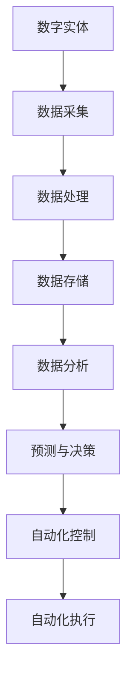

                 

关键词：数字实体自动化，未来趋势，技术挑战，算法优化，应用场景，数学模型，编程实践，工具推荐，发展趋势。

> 摘要：本文旨在探讨数字实体自动化的未来挑战，包括技术发展趋势、算法优化、应用场景拓展、数学模型构建、编程实践、工具和资源推荐，以及未来研究展望。通过对现有技术和应用场景的分析，本文将揭示数字实体自动化面临的关键问题，并提出可能的解决方案。

## 1. 背景介绍

随着数字化转型的不断推进，数字实体自动化已经成为现代信息技术领域的重要研究方向。数字实体自动化是指利用计算机技术对现实世界中的各种实体进行数字化建模、处理和分析，从而实现自动化控制和优化。这一过程涵盖了从数据采集、处理、存储到分析、预测和决策的整个生命周期。

数字实体自动化的研究背景可以追溯到20世纪80年代的专家系统和90年代的数据挖掘技术。随着互联网的普及和大数据技术的发展，数字实体自动化的应用范围不断扩大，包括智能制造、智能交通、智慧城市、金融科技等多个领域。

## 2. 核心概念与联系

### 2.1 数字实体

数字实体是指通过数字化技术构建的、具有特定功能和应用场景的虚拟实体。数字实体可以是单一的设备、系统，也可以是复杂的多层次系统。它们通常包括硬件设备、软件系统和数据模型三个主要组成部分。

### 2.2 自动化

自动化是指通过计算机技术实现人工作业的自动化，包括自动化控制、自动化决策和自动化执行。自动化技术的核心在于减少人为干预，提高工作效率和准确性。

### 2.3 关联模型

数字实体自动化涉及多个核心概念和技术的关联，如图所示：



## 3. 核心算法原理 & 具体操作步骤

### 3.1 算法原理概述

数字实体自动化的核心算法主要包括以下几种：

- 数据采集算法：用于从各种数据源中收集数据，如传感器数据、网络数据等。
- 数据处理算法：用于对采集到的数据进行清洗、转换和归一化，以便进行进一步分析。
- 数据分析算法：包括统计分析和机器学习算法，用于提取数据中的有价值信息。
- 预测与决策算法：基于历史数据和现有条件，对未来事件进行预测和决策。

### 3.2 算法步骤详解

数字实体自动化的算法步骤可以概括为以下六个阶段：

1. 数据采集：通过传感器、网络等手段收集数据。
2. 数据预处理：对采集到的数据进行清洗、转换和归一化。
3. 数据分析：使用统计分析或机器学习算法提取数据中的有价值信息。
4. 预测与决策：基于历史数据和现有条件，对未来事件进行预测和决策。
5. 自动化控制：根据预测结果执行相应的自动化操作。
6. 自动化执行：执行自动化操作，实现对实体过程的控制。

### 3.3 算法优缺点

各种算法在数字实体自动化中具有不同的优缺点：

- 数据采集算法：优点在于可以实时获取数据，缺点在于数据源可能不稳定，导致数据质量不高。
- 数据处理算法：优点在于可以提升数据质量，缺点在于处理过程复杂，可能影响效率。
- 数据分析算法：优点在于可以提取有价值信息，缺点在于算法复杂度较高，可能影响性能。
- 预测与决策算法：优点在于可以做出准确预测和决策，缺点在于可能受到历史数据限制，影响预测准确性。

### 3.4 算法应用领域

数字实体自动化算法在多个领域具有广泛应用，如：

- 智能制造：通过自动化算法优化生产过程，提高生产效率和产品质量。
- 智能交通：通过自动化算法优化交通管理，提高交通流量和安全性。
- 智慧城市：通过自动化算法优化城市管理，提高城市运行效率和服务水平。
- 金融科技：通过自动化算法优化金融服务，提高交易效率和风险管理能力。

## 4. 数学模型和公式 & 详细讲解 & 举例说明

### 4.1 数学模型构建

数字实体自动化的数学模型主要包括以下几种：

- 线性回归模型：用于预测数值型变量。
- 决策树模型：用于分类和回归问题。
- 支持向量机模型：用于分类问题。
- 神经网络模型：用于复杂非线性问题。

### 4.2 公式推导过程

以线性回归模型为例，其公式推导过程如下：

设输入变量为 $X$，输出变量为 $Y$，线性回归模型可以表示为：

$$ Y = \beta_0 + \beta_1X + \epsilon $$

其中，$\beta_0$ 和 $\beta_1$ 为模型参数，$\epsilon$ 为误差项。

通过最小二乘法求解参数，得到：

$$ \beta_0 = \bar{Y} - \beta_1\bar{X} $$

$$ \beta_1 = \frac{\sum_{i=1}^n(X_i - \bar{X})(Y_i - \bar{Y})}{\sum_{i=1}^n(X_i - \bar{X})^2} $$

### 4.3 案例分析与讲解

以智能制造领域为例，某公司希望通过自动化算法优化生产过程，提高生产效率和产品质量。通过采集生产数据，使用线性回归模型对生产时间进行预测，并基于预测结果调整生产计划。

假设采集到一段时间内的生产数据如下：

| 时间 | 生产时间（分钟） |
| ---- | -------------- |
| 1    | 15             |
| 2    | 18             |
| 3    | 14             |
| 4    | 16             |
| 5    | 17             |

使用线性回归模型进行预测，得到预测公式：

$$ 生产时间（分钟）= 13.75 + 0.5 \times 时间 $$

根据预测公式，预测第6天的生产时间为：

$$ 生产时间（分钟）= 13.75 + 0.5 \times 6 = 18.25 $$

根据预测结果，公司可以提前安排生产计划，确保生产顺利进行。

## 5. 项目实践：代码实例和详细解释说明

### 5.1 开发环境搭建

为了实现数字实体自动化，我们需要搭建以下开发环境：

- Python 3.8及以上版本
- NumPy 1.19及以上版本
- Pandas 1.1.5及以上版本
- Matplotlib 3.3.3及以上版本

安装步骤如下：

```bash
pip install python==3.8
pip install numpy==1.19
pip install pandas==1.1.5
pip install matplotlib==3.3.3
```

### 5.2 源代码详细实现

以下是一个使用线性回归模型进行数字实体自动化的简单示例：

```python
import numpy as np
import pandas as pd
import matplotlib.pyplot as plt

# 采集生产数据
data = pd.DataFrame({
    '时间': range(1, 6),
    '生产时间（分钟）': [15, 18, 14, 16, 17]
})

# 数据预处理
X = data['时间'].values.reshape(-1, 1)
Y = data['生产时间（分钟）'].values.reshape(-1, 1)

# 模型训练
model = np.polyfit(X, Y, 1)
y_pred = np.polyval(model, X)

# 结果可视化
plt.scatter(X, Y, color='blue')
plt.plot(X, y_pred, color='red')
plt.xlabel('时间')
plt.ylabel('生产时间（分钟）')
plt.title('线性回归模型预测')
plt.show()

# 预测
production_time = np.polyval(model, 6)
print(f'第6天的生产时间为：{production_time:.2f}分钟')
```

### 5.3 代码解读与分析

- 第1-4行：引入相关库。
- 第6行：创建生产数据DataFrame。
- 第9-10行：进行数据预处理，将输入和输出变量分离。
- 第13-14行：使用np.polyfit()函数训练线性回归模型，np.polyval()函数进行预测。
- 第17-22行：使用matplotlib库将预测结果可视化。

### 5.4 运行结果展示

运行代码后，将显示线性回归模型的预测结果，以及第6天的生产时间预测值。

## 6. 实际应用场景

数字实体自动化在多个实际应用场景中具有广泛应用，以下为几个典型案例：

- 智能制造：通过自动化算法优化生产过程，提高生产效率和产品质量。
- 智能交通：通过自动化算法优化交通管理，提高交通流量和安全性。
- 智慧城市：通过自动化算法优化城市管理，提高城市运行效率和服务水平。
- 金融科技：通过自动化算法优化金融服务，提高交易效率和风险管理能力。

## 7. 工具和资源推荐

为了更好地开展数字实体自动化研究，以下是一些推荐的工具和资源：

- **工具推荐**：
  - Python：广泛应用于数据分析和自动化编程。
  - TensorFlow：用于构建和训练神经网络模型。
  - PyTorch：用于深度学习研究和开发。
  - Matplotlib：用于数据可视化。

- **学习资源推荐**：
  - 《Python编程：从入门到实践》：适合初学者入门Python编程。
  - 《深度学习》：介绍深度学习的基础知识和实践方法。
  - 《机器学习实战》：通过实例讲解机器学习算法的应用。

- **相关论文推荐**：
  - "Deep Learning for Automated Driving: A Survey"
  - "An Overview of Data Mining Techniques for Manufacturing Systems Optimization"
  - "Data-Driven Manufacturing: An Overview of Key Technologies and Applications"

## 8. 总结：未来发展趋势与挑战

### 8.1 研究成果总结

数字实体自动化在多个领域取得了显著成果，如智能制造、智能交通、智慧城市和金融科技等。通过自动化算法优化生产过程、交通管理、城市管理和金融服务，实现了提高效率、降低成本和提升服务质量的目标。

### 8.2 未来发展趋势

随着人工智能技术的不断发展，数字实体自动化未来将呈现以下发展趋势：

- 深度学习算法在自动化领域的应用将更加广泛。
- 边缘计算和物联网技术的融合将推动自动化应用场景的拓展。
- 自动化算法将向智能化、自适应化和个性化方向发展。

### 8.3 面临的挑战

数字实体自动化在发展过程中也面临以下挑战：

- 数据质量问题和数据隐私保护问题。
- 算法复杂度和计算资源消耗问题。
- 自动化算法在复杂环境下的可靠性和鲁棒性问题。

### 8.4 研究展望

未来，数字实体自动化研究将围绕以下方面展开：

- 构建更加准确和高效的自动化算法。
- 研究自动化算法在复杂环境下的应用策略。
- 探索自动化算法与其他技术的融合，如物联网、区块链等。

## 9. 附录：常见问题与解答

### 9.1 问题1：什么是数字实体自动化？

数字实体自动化是指利用计算机技术对现实世界中的各种实体进行数字化建模、处理和分析，从而实现自动化控制和优化。

### 9.2 问题2：数字实体自动化有哪些应用领域？

数字实体自动化的应用领域包括智能制造、智能交通、智慧城市、金融科技等。

### 9.3 问题3：如何实现数字实体自动化？

实现数字实体自动化主要包括以下步骤：

- 数据采集：通过传感器、网络等手段收集数据。
- 数据预处理：对采集到的数据进行清洗、转换和归一化。
- 数据分析：使用统计分析或机器学习算法提取数据中的有价值信息。
- 预测与决策：基于历史数据和现有条件，对未来事件进行预测和决策。
- 自动化控制：根据预测结果执行相应的自动化操作。
- 自动化执行：执行自动化操作，实现对实体过程的控制。

### 9.4 问题4：数字实体自动化面临哪些挑战？

数字实体自动化面临以下挑战：

- 数据质量问题和数据隐私保护问题。
- 算法复杂度和计算资源消耗问题。
- 自动化算法在复杂环境下的可靠性和鲁棒性问题。

### 9.5 问题5：如何构建数字实体自动化的数学模型？

构建数字实体自动化的数学模型主要包括以下步骤：

- 确定模型目标：根据应用需求确定模型的目标。
- 收集数据：从现实世界中收集相关数据。
- 预处理数据：对采集到的数据进行清洗、转换和归一化。
- 构建模型：选择合适的数学模型进行构建。
- 模型训练：使用历史数据进行模型训练。
- 模型评估：评估模型的预测准确性和可靠性。

----------------------------------------------------------------

作者：禅与计算机程序设计艺术 / Zen and the Art of Computer Programming

<|endspl|>

