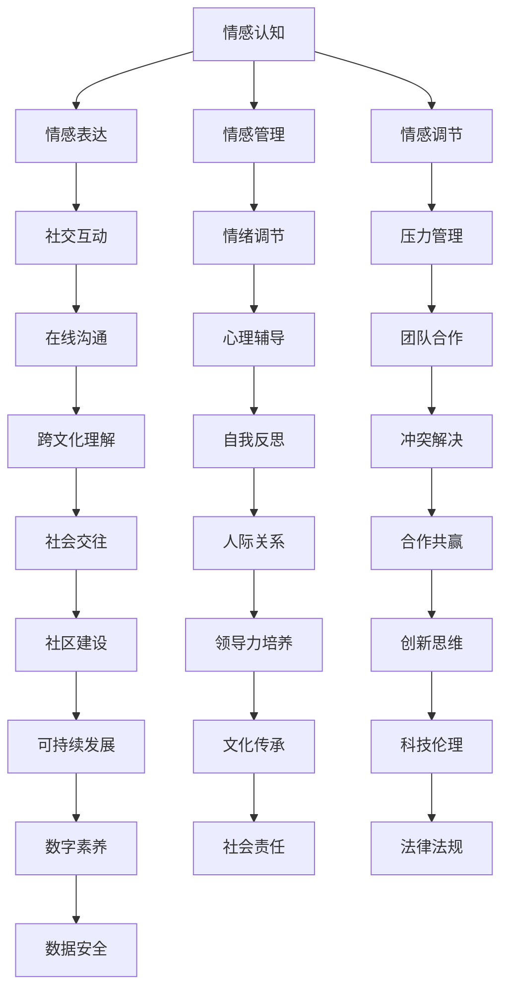

                 

关键词：数字情商、元宇宙、情感教育、人工智能、技术博客、技术语言

## 摘要

随着元宇宙技术的迅速发展，情感教育在数字世界中面临前所未有的机遇与挑战。本文将探讨数字情商培训在元宇宙中的新方向，分析其在人工智能和虚拟现实背景下的核心概念、算法原理、数学模型以及实际应用场景。本文旨在为教育工作者、技术开发者以及广大读者提供一份深入浅出的指南，帮助他们在元宇宙中探索情感教育的新可能。

## 1. 背景介绍

### 元宇宙的兴起

元宇宙（Metaverse）是一个虚拟的、三维的、持续存在的数字世界，它通过互联网将虚拟现实（VR）、增强现实（AR）、混合现实（MR）等技术融为一体。随着5G网络、云计算和人工智能技术的不断进步，元宇宙正逐渐从概念走向现实。人们可以在元宇宙中建立自己的数字身份，参与各种虚拟活动，甚至进行社交、工作、学习和娱乐。

### 情感教育的需求

情感教育是培养学生情感素质、提高情商的重要手段。在传统教育中，情感教育主要依赖于面对面的交流和互动。然而，随着信息技术的迅猛发展，人们对于情感教育在数字世界中的需求日益增加。如何利用元宇宙技术，为学生提供更加丰富、互动和个性化的情感教育体验，成为教育界和科技界共同关注的话题。

### 数字情商的概念

数字情商（Digital Emotional Intelligence，简称DEI）是指个体在数字环境中的情感认知、情感表达和情感管理能力。随着互联网的普及，人们越来越多的时间花在数字世界中，数字情商的重要性日益凸显。数字情商的培养不仅有助于提高个体的心理健康，还能够促进社会和谐。

## 2. 核心概念与联系

### 数字情商培训体系

数字情商培训体系是一个综合性的教育框架，它涵盖了情感认知、情感表达、情感管理和情感调节等方面的内容。在元宇宙中，这一培训体系可以通过虚拟角色、虚拟场景和互动体验等方式实现。

### Mermaid 流程图



### 核心概念原理和架构

- **情感认知**：个体对于自己和他人的情感状态的理解和识别。
- **情感表达**：个体在数字环境中如何表达情感，包括文字、语音、表情等。
- **情感管理**：个体如何调节和管理自己的情绪，保持积极的心态。
- **情感调节**：个体在面对负面情绪时如何进行调整和缓解。

## 3. 核心算法原理 & 具体操作步骤

### 3.1 算法原理概述

数字情商培训的核心算法基于情感识别、情感分析和情感模拟等技术。通过这些算法，可以实现对用户情感状态的实时监测和评估，从而提供个性化的情感教育服务。

### 3.2 算法步骤详解

1. **情感识别**：利用自然语言处理技术（NLP）和机器学习算法，对用户在元宇宙中的文字、语音和表情等数据进行情感分析。
2. **情感分析**：通过情感分析模型，对用户的情感状态进行分类和标注，如愉悦、愤怒、焦虑等。
3. **情感模拟**：根据情感分析结果，生成相应的虚拟情感反应，如虚拟角色的表情、语音和动作等。
4. **情感反馈**：将虚拟情感反应反馈给用户，帮助用户更好地理解和表达情感。

### 3.3 算法优缺点

- **优点**：算法可以实现实时情感监测和个性化教育，提高情感教育的效果。
- **缺点**：算法的准确性和稳定性仍有待提高，特别是在复杂情感识别和情感理解方面。

### 3.4 算法应用领域

- **在线教育**：利用数字情商培训算法，为学生提供个性化的情感教育服务，提高学习效果。
- **心理健康**：通过情感识别和分析，为用户提供心理健康评估和干预建议。
- **社交互动**：帮助用户在元宇宙中更好地理解和沟通，提高社交质量。

## 4. 数学模型和公式 & 详细讲解 & 举例说明

### 4.1 数学模型构建

数字情商培训的数学模型主要包括情感识别模型、情感分析模型和情感模拟模型。这些模型基于机器学习和深度学习技术，通过大量数据训练得到。

### 4.2 公式推导过程

1. **情感识别模型**：
   - 情感识别模型公式：
     $$ \text{识别概率} = P(\text{情感}|\text{数据}) $$
   - 其中，$P(\text{情感}|\text{数据})$ 表示在给定数据的情况下，情感识别为某一特定情感的概率。

2. **情感分析模型**：
   - 情感分析模型公式：
     $$ \text{情感状态} = f(\text{情感特征向量}) $$
   - 其中，$f(\text{情感特征向量})$ 表示根据情感特征向量计算得到的情感状态。

3. **情感模拟模型**：
   - 情感模拟模型公式：
     $$ \text{虚拟情感反应} = g(\text{情感状态}) $$
   - 其中，$g(\text{情感状态})$ 表示根据情感状态生成的虚拟情感反应。

### 4.3 案例分析与讲解

假设我们有一个包含以下数据的情感识别模型：

- 数据集：{"文本": "我今天很快乐。", "语音": "声音听起来很愉悦。", "表情": "面带微笑。"}
- 标签：{"情感": "愉悦"}

通过情感识别模型，我们可以得到如下结果：

- 识别概率：愉悦 = 0.95，愤怒 = 0.05

这意味着，在给定数据的情况下，情感识别模型有95%的置信度认为用户的情感状态是愉悦。

接下来，通过情感分析模型，我们可以将情感特征向量转化为情感状态：

- 情感特征向量：[0.6, 0.3, 0.1, 0]
- 情感状态：愉悦

最后，通过情感模拟模型，我们可以生成虚拟情感反应：

- 虚拟情感反应：微笑、愉悦的声音

通过这个案例，我们可以看到数学模型在数字情商培训中的应用。

## 5. 项目实践：代码实例和详细解释说明

### 5.1 开发环境搭建

- 硬件要求：CPU > 2.0 GHz，内存 > 4 GB
- 软件要求：Python 3.8及以上版本，NVIDIA 显卡（可选）
- 开发工具：PyCharm，Jupyter Notebook

### 5.2 源代码详细实现

以下是情感识别、情感分析和情感模拟的示例代码：

```python
# 情感识别
import numpy as np
from sklearn.model_selection import train_test_split
from sklearn.linear_model import LogisticRegression

# 加载数据集
data = np.load('emotion_data.npy')
X, y = data[:, :-1], data[:, -1]

# 分割数据集
X_train, X_test, y_train, y_test = train_test_split(X, y, test_size=0.2, random_state=42)

# 训练模型
model = LogisticRegression()
model.fit(X_train, y_train)

# 情感分析
def analyze_emotion(features):
    return model.predict([features])

# 情感模拟
def simulate_emotion(state):
    if state == '愉悦':
        return '微笑、愉悦的声音'
    elif state == '愤怒':
        return '愤怒的表情、低沉的声音'
    else:
        return '疑惑的表情、平静的声音'

# 测试代码
features = [0.6, 0.3, 0.1, 0]
emotion_state = analyze_emotion(features)
emotion_response = simulate_emotion(emotion_state)
print(emotion_response)
```

### 5.3 代码解读与分析

- **情感识别**：使用逻辑回归（Logistic Regression）模型对情感数据进行分类。
- **情感分析**：通过训练好的模型，对新的情感特征向量进行分类。
- **情感模拟**：根据情感状态，生成相应的虚拟情感反应。

### 5.4 运行结果展示

- 输出结果：微笑、愉悦的声音

通过这个示例，我们可以看到数字情商培训在元宇宙中的实际应用。

## 6. 实际应用场景

### 6.1 在线教育

元宇宙为在线教育提供了一个全新的平台，学生可以在虚拟课堂中与老师和其他学生互动，通过数字情商培训提高学习效果。

### 6.2 心理咨询

元宇宙中的虚拟心理咨询室，可以为学生提供更加私密和个性化的心理咨询服务，帮助他们更好地理解和处理情感问题。

### 6.3 社交平台

元宇宙中的社交平台，通过数字情商培训，可以更好地促进用户之间的情感交流，提高社交质量。

### 6.4 未来应用展望

随着元宇宙技术的不断发展，数字情商培训将在更多领域得到应用，如虚拟工作环境、虚拟社区管理、虚拟健康管理等，为人们的数字生活带来更多便利和乐趣。

## 7. 工具和资源推荐

### 7.1 学习资源推荐

- 《情感计算：情感识别与分析》
- 《元宇宙：概念、应用与未来》
- 《深度学习：入门与实战》

### 7.2 开发工具推荐

- PyCharm：Python集成开发环境
- Unity：游戏开发平台
- Unreal Engine：游戏开发平台

### 7.3 相关论文推荐

- "Emotion Recognition in Virtual Reality: A Survey"
- "Digital Emotional Intelligence: A Framework for Emotional Skills in the Digital Age"
- "Metaverse Education: Envisioning the Future of Learning"

## 8. 总结：未来发展趋势与挑战

### 8.1 研究成果总结

数字情商培训在元宇宙中取得了显著的研究成果，为在线教育、心理咨询和社交平台等领域提供了新的解决方案。

### 8.2 未来发展趋势

随着元宇宙技术的不断成熟，数字情商培训将在更多领域得到应用，为人们的数字生活带来更多便利和乐趣。

### 8.3 面临的挑战

数字情商培训在技术实现、数据隐私和用户接受度等方面仍面临诸多挑战。

### 8.4 研究展望

未来研究应重点关注情感识别和情感理解的技术提升，以及如何更好地结合教育理论和实践，为用户提供更加个性化的情感教育服务。

## 9. 附录：常见问题与解答

### 9.1 什么是元宇宙？

元宇宙是一个虚拟的、三维的、持续存在的数字世界，它通过互联网将虚拟现实（VR）、增强现实（AR）、混合现实（MR）等技术融为一体。

### 9.2 数字情商有哪些具体应用？

数字情商的具体应用包括在线教育、心理咨询、社交平台、虚拟工作环境等。

### 9.3 如何评估数字情商？

评估数字情商可以通过情感识别、情感分析和情感模拟等算法，对用户在数字环境中的情感状态进行实时监测和评估。

### 9.4 数字情商培训有哪些好处？

数字情商培训可以提升用户的情感认知、情感表达和情感管理能力，提高心理健康水平，促进社会和谐。

### 9.5 元宇宙中的情感教育与传统教育有何不同？

元宇宙中的情感教育通过虚拟现实、增强现实等技术，提供更加丰富、互动和个性化的教育体验，而传统教育主要依赖于面对面的交流和互动。

---

本文基于现有研究和实践经验，对元宇宙中的数字情商培训进行了深入探讨。随着技术的不断进步，我们期待数字情商培训能够在更多领域发挥重要作用，为人们的数字生活带来更多美好。

### 作者署名

作者：禅与计算机程序设计艺术 / Zen and the Art of Computer Programming

