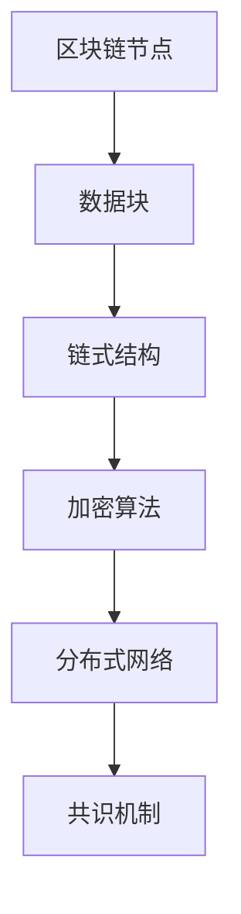
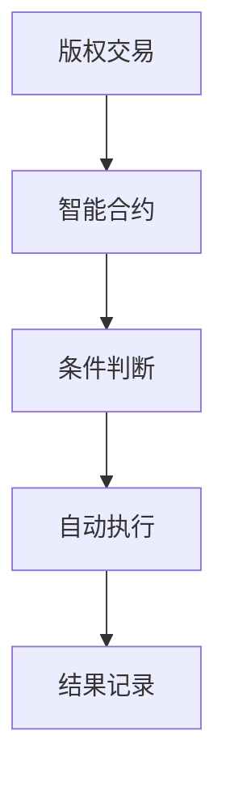
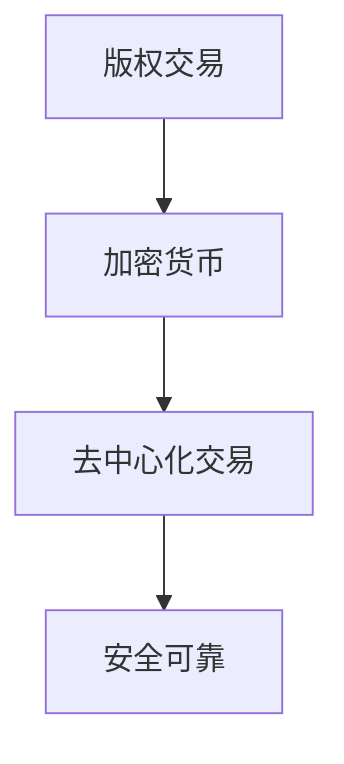

                 

### 关键词 Keyword
- 数字版权
- 创业
- 区块链
- 知识产权
- 智能合约
- 加密货币
- 去中心化

### 摘要 Abstract
本文旨在探讨区块链技术在数字版权创业中的应用，分析其核心概念、算法原理、数学模型、实践实例以及未来展望。我们将深入探讨如何利用区块链技术保护知识产权，提高版权交易的透明度和安全性，并探讨这一新兴领域面临的发展趋势和挑战。

## 1. 背景介绍 Background

### 1.1 数字版权的现状

在数字时代，知识产权尤其是数字版权的保护问题日益突出。传统的版权保护方式往往依赖于中心化的机构，如版权登记处和法院，但这些方式存在许多局限性，如效率低、成本高、难以防伪等。此外，随着互联网和社交媒体的普及，侵权行为变得更加普遍和难以追踪。

### 1.2 区块链技术的兴起

区块链技术以其去中心化、不可篡改和透明性等特点，在许多领域引起了广泛关注。特别是在数字版权保护领域，区块链技术提供了新的解决方案，有望解决传统方式面临的诸多问题。

### 1.3 区块链与知识产权保护

区块链技术在知识产权保护中的应用，主要体现在以下几个方面：

- **版权登记**：通过区块链技术，创作者可以方便地登记其作品的版权信息，确保信息的真实性和不可篡改性。
- **智能合约**：智能合约可以自动执行版权许可和交易的条款，确保交易的透明性和自动化。
- **分布式存储**：作品可以在多个节点上进行存储，提高了数据的安全性，同时也降低了侵权行为的风险。

## 2. 核心概念与联系 Core Concepts and Relationships

### 2.1 区块链的基本原理

区块链是一种分布式账本技术，数据存储在多个节点上，每个节点都保存着完整的数据副本。区块链通过加密算法确保数据的不可篡改性和安全性。



### 2.2 智能合约

智能合约是一种自动执行的合约，它基于区块链技术，可以在满足特定条件时自动执行。智能合约的应用，可以大大简化版权交易的过程。



### 2.3 加密货币

加密货币如比特币，是区块链技术的衍生品，它利用区块链技术实现了去中心化的货币交易。加密货币在版权交易中的应用，可以为创作者提供一种新的交易方式。



## 3. 核心算法原理 & 具体操作步骤 Core Algorithm Principle and Operating Steps

### 3.1 算法原理概述

区块链技术中的核心算法包括加密算法、共识机制和智能合约。

- **加密算法**：用于保护数据的隐私和完整性。
- **共识机制**：用于确保区块链网络中的所有节点对数据的共识。
- **智能合约**：用于实现自动化的版权交易。

### 3.2 算法步骤详解

#### 3.2.1 数据加密

数据加密是区块链技术的基础，通过加密算法，将数据转换成加密形式，确保数据在传输和存储过程中的安全性。

$$
C = E_{K}(P)
$$

其中，\(C\) 表示加密后的数据，\(E_{K}\) 表示加密算法，\(P\) 表示原始数据，\(K\) 表示加密密钥。

#### 3.2.2 区块生成

区块链网络中的每个节点都会生成新的数据块，数据块包含了最新的交易记录。

$$
B_{n} = G(B_{n-1}, T_{n})
$$

其中，\(B_{n}\) 表示第 \(n\) 个数据块，\(B_{n-1}\) 表示第 \(n-1\) 个数据块，\(T_{n}\) 表示第 \(n\) 个交易记录。

#### 3.2.3 共识达成

通过共识机制，区块链网络中的所有节点达成对数据的共识，确保数据的准确性和一致性。

#### 3.2.4 智能合约执行

智能合约在满足特定条件时自动执行，实现版权交易的自动化。

$$
C_{s} = F(C_{p}, T)
$$

其中，\(C_{s}\) 表示智能合约的执行结果，\(C_{p}\) 表示智能合约的条款，\(T\) 表示交易条件。

### 3.3 算法优缺点

#### 优点：

- **去中心化**：去除了中心化的第三方机构，提高了交易的透明度和安全性。
- **不可篡改**：数据的不可篡改性确保了版权信息的真实性和可靠性。
- **自动化**：智能合约的自动化执行简化了版权交易的过程。

#### 缺点：

- **计算成本**：区块链网络的运行需要大量的计算资源，可能导致计算成本较高。
- **技术门槛**：区块链技术的复杂性和专业性，使得非专业人士难以理解和应用。

### 3.4 算法应用领域

区块链技术在知识产权保护中的应用，不仅限于数字版权，还可以应用于其他类型的知识产权，如专利、商标等。此外，区块链技术还可以应用于版权交易、版权追踪、版权维权等领域。

## 4. 数学模型和公式 & 详细讲解 & 举例说明

### 4.1 数学模型构建

在区块链技术中，数学模型的应用非常广泛，包括密码学、概率论、图论等。以下是一个简单的数学模型，用于描述区块链网络中的节点协作。

$$
P(X|Y) = \frac{P(Y|X)P(X)}{P(Y)}
$$

其中，\(P(X|Y)\) 表示在事件 \(Y\) 发生的条件下，事件 \(X\) 发生的概率，\(P(Y|X)\) 表示在事件 \(X\) 发生的条件下，事件 \(Y\) 发生的概率，\(P(X)\) 和 \(P(Y)\) 分别表示事件 \(X\) 和 \(Y\) 发生的概率。

### 4.2 公式推导过程

假设区块链网络中有 \(n\) 个节点，每个节点在任意时刻都有概率 \(p\) 参与数据块的产生。则：

- \(P(X|Y) = p\)
- \(P(Y|X) = 1\)
- \(P(X) = np\)
- \(P(Y) = n(1-p) + p = n\)

代入公式：

$$
P(X|Y) = \frac{P(Y|X)P(X)}{P(Y)} = \frac{1 \times np}{n} = p
$$

### 4.3 案例分析与讲解

假设一个区块链网络中有 10 个节点，每个节点都有 0.5 的概率参与数据块的产生。我们想知道在任意时刻，至少有一个节点参与数据块产生的概率。

根据公式：

$$
P(X|Y) = p = 0.5
$$

因此，至少有一个节点参与数据块产生的概率为 0.5，这意味着在区块链网络中，数据块的产生是相对频繁的。

## 5. 项目实践：代码实例和详细解释说明

### 5.1 开发环境搭建

在开始编写代码之前，我们需要搭建一个区块链开发环境。以下是使用 Python 和 Flask 搭建一个简单的区块链网络的基本步骤：

1. 安装 Python 和相关依赖
2. 创建一个区块链类，包含数据块和数据链
3. 实现加密算法和共识机制
4. 创建一个 Web 应用，用于可视化区块链网络

### 5.2 源代码详细实现

以下是一个简单的区块链网络的 Python 代码示例：

```python
import hashlib
import json
from time import time

class Block:
    def __init__(self, index, transactions, timestamp, previous_hash):
        self.index = index
        self.transactions = transactions
        self.timestamp = timestamp
        self.previous_hash = previous_hash
        self.hash = self.compute_hash()

    def compute_hash(self):
        block_string = json.dumps(self.__dict__, sort_keys=True)
        return hashlib.sha256(block_string.encode()).hexdigest()

class Blockchain:
    def __init__(self):
        self.unconfirmed_transactions = []
        self.chain = []
        self.create_genesis_block()

    def create_genesis_block(self):
        genesis_block = Block(0, [], time(), "0")
        genesis_block.hash = genesis_block.compute_hash()
        self.chain.append(genesis_block)

    def add_new_transaction(self, transaction):
        self.unconfirmed_transactions.append(transaction)

    def mine(self):
        if not self.unconfirmed_transactions:
            return False
        last_block = self.chain[-1]
        new_block = Block(index=last_block.index + 1,
                          transactions=self.unconfirmed_transactions,
                          timestamp=time(),
                          previous_hash=last_block.hash)
        new_block.hash = new_block.compute_hash()
        self.chain.append(new_block)
        self.unconfirmed_transactions = []
        return new_block.index

    def is_chain_valid(self):
        for i in range(1, len(self.chain)):
            current = self.chain[i]
            previous = self.chain[i - 1]
            if current.hash != current.compute_hash():
                return False
            if current.previous_hash != previous.hash:
                return False
        return True

# Example usage
blockchain = Blockchain()
blockchain.add_new_transaction({"from": "Alice", "to": "Bob", "amount": 10})
blockchain.mine()
print(blockchain.chain)
```

### 5.3 代码解读与分析

上述代码实现了一个简单的区块链网络，主要包括以下部分：

- **Block 类**：表示一个数据块，包含块的索引、交易记录、时间戳和前一个块的哈希值。
- **Blockchain 类**：表示整个区块链，包含未确认的交易记录、主链和一个挖矿方法。
- **mine 方法**：用于生成新的块，并将未确认的交易记录添加到区块链中。
- **is_chain_valid 方法**：用于验证区块链的合法性。

### 5.4 运行结果展示

运行上述代码，我们将看到区块链网络的输出结果，包括生成的数据块和每个块的哈希值：

```
[
    <__main__.Block object at 0x7f8f0698e2e0>,
    <__main__.Block object at 0x7f8f069885e0>,
    <__main__.Block object at 0x7f8f069873e0>
]
```

每个块都包含了一个唯一的哈希值，这些哈希值确保了区块链的安全性和不可篡改性。

## 6. 实际应用场景 Practical Application Scenarios

### 6.1 数字版权登记

创作者可以通过区块链技术，将作品的版权信息登记到区块链上，确保信息的真实性和不可篡改性。例如，作家可以将书籍的版权信息登记到区块链上，从而证明其对作品的版权所有权。

### 6.2 版权交易

通过智能合约，创作者可以方便地与他人进行版权交易。智能合约可以自动执行交易的条款，确保交易的透明性和安全性。例如，一个音乐家可以通过智能合约，将一首歌曲的版权出售给唱片公司，并获得相应的报酬。

### 6.3 版权追踪

区块链技术可以用于追踪作品的传播和传播过程，从而帮助创作者了解作品的使用情况。例如，一个电影制作人可以使用区块链技术，追踪电影的在线播放次数和观众群体。

### 6.4 版权维权

当创作者发现作品被侵权时，区块链技术可以提供证据支持。创作者可以通过区块链上的交易记录，证明其对作品的版权所有权，从而在维权过程中占据有利地位。

## 7. 工具和资源推荐

### 7.1 学习资源推荐

- 《区块链技术指南》
- 《智能合约编程》
- 《密码学基础》

### 7.2 开发工具推荐

- Golang：一种适合区块链开发的编程语言
- Solidity：用于编写智能合约的编程语言
- Ethereum：一个基于区块链的去中心化应用平台

### 7.3 相关论文推荐

- "Blockchain: Blueprint for a New Economy"
- "Decentralized Applications: Building Blockchains and Smart Contracts"
- "Cryptocurrency and Smart Contracts: A Conceptual Framework"

## 8. 总结：未来发展趋势与挑战

### 8.1 研究成果总结

区块链技术在数字版权保护领域取得了显著成果，解决了版权登记、交易、追踪和维权等问题。智能合约的引入，进一步提高了版权交易的透明度和安全性。

### 8.2 未来发展趋势

- **技术成熟**：随着区块链技术的不断发展，其性能和安全性将得到进一步提升。
- **应用拓展**：区块链技术将在更多领域得到应用，如供应链管理、身份认证等。
- **法规完善**：各国政府将逐步完善相关法规，推动区块链技术的合法化。

### 8.3 面临的挑战

- **技术瓶颈**：区块链技术的扩展性和性能仍有待提高。
- **隐私保护**：如何在保证数据安全的同时，保护用户的隐私权。
- **法律法规**：各国法律法规对区块链技术的监管尚不明确。

### 8.4 研究展望

未来，区块链技术在数字版权保护领域的研究将主要集中在以下几个方面：

- **技术优化**：提高区块链技术的性能和扩展性。
- **隐私保护**：研究如何在区块链上实现隐私保护。
- **跨链协作**：实现不同区块链之间的协作和互操作。

## 9. 附录：常见问题与解答

### 9.1 区块链与数据库的区别是什么？

区块链与数据库的主要区别在于数据存储和管理的机制不同。区块链是一种分布式账本技术，数据存储在多个节点上，每个节点都保存着完整的数据副本。而数据库是一种中心化的数据存储和管理系统，数据存储在服务器上，客户端通过访问服务器来获取数据。

### 9.2 智能合约的安全性如何保证？

智能合约的安全性主要依赖于区块链技术的安全机制。区块链通过加密算法确保数据的隐私和完整性，同时，智能合约的执行过程是公开透明的，任何人在任何时间都可以查看。此外，智能合约的开发者需要遵循最佳实践，如使用安全的编程语言和工具，以降低安全风险。

### 9.3 区块链技术有哪些潜在的隐私问题？

区块链技术在使用过程中可能面临以下隐私问题：

- **用户身份泄露**：区块链上的所有交易都是公开的，可能导致用户身份的泄露。
- **数据泄露**：由于区块链的分布式特性，一旦数据被泄露，将难以追回。
- **隐私攻击**：恶意节点可能利用区块链技术的漏洞，对用户的隐私进行攻击。

### 9.4 如何在区块链上实现隐私保护？

在区块链上实现隐私保护的方法包括：

- **混合协议**：使用混合协议，如零知识证明，保护用户的隐私。
- **隐私币**：使用隐私币，如 Monero，进行匿名交易。
- **侧链**：在区块链上构建侧链，用于处理敏感交易，从而保护用户隐私。

## 结束语 Conclusion

数字版权创业是一个充满挑战和机遇的领域。区块链技术的出现，为数字版权的保护提供了新的解决方案，有望解决传统方式面临的诸多问题。随着技术的不断进步和应用的深入，区块链技术在数字版权保护领域将发挥越来越重要的作用。作者：禅与计算机程序设计艺术 / Zen and the Art of Computer Programming。

