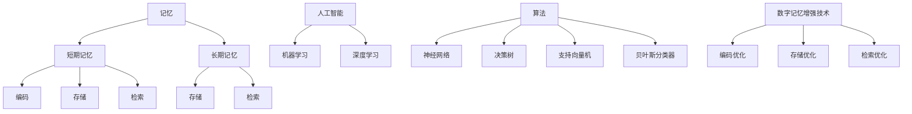

                 

关键词：数字记忆增强，人工智能，记忆优化，认知增强，算法原理，数学模型，项目实践，未来应用

> 摘要：随着数字化时代的到来，人们对于记忆的需求越来越高。本文旨在探讨AI技术在数字记忆增强领域的应用，通过深入分析核心算法原理、数学模型和具体项目实践，探讨如何利用AI技术优化人类的记忆能力，为未来认知增强技术的发展提供理论依据和实践指导。

## 1. 背景介绍

在现代社会，信息过载已经成为普遍现象。人们需要处理大量的信息，而这些信息往往需要在短时间内记忆并调用。传统的记忆方法在处理复杂数据和海量信息时显得力不从心。随着人工智能技术的快速发展，利用AI优化人类的记忆能力成为了一个热门研究领域。AI不仅可以辅助记忆，还能够通过算法模型提高记忆效率，帮助人类应对日益复杂的信息环境。

数字记忆增强技术的核心目标是提高记忆的准确性和持久性，同时减少记忆负担。这项技术涉及到多个领域的交叉，包括认知科学、心理学、计算机科学和人工智能等。通过研究大脑记忆机制和AI算法，科学家们试图找到一种有效的方法，将人类的记忆能力与先进的计算技术相结合，从而实现数字记忆的优化。

本文将从以下几个部分对数字记忆增强技术进行详细探讨：

1. 核心概念与联系
2. 核心算法原理 & 具体操作步骤
3. 数学模型和公式 & 详细讲解 & 举例说明
4. 项目实践：代码实例和详细解释说明
5. 实际应用场景
6. 未来应用展望
7. 工具和资源推荐
8. 总结：未来发展趋势与挑战
9. 附录：常见问题与解答

## 2. 核心概念与联系

在探讨数字记忆增强技术之前，我们需要了解几个核心概念：记忆、人工智能和算法。

### 记忆

记忆是人类认知能力的重要组成部分，它包括三个基本过程：编码、存储和检索。编码是将信息转换为大脑可以理解的形式；存储是保持信息的过程；检索是从大脑中提取信息的能力。根据心理学理论，记忆可以分为短期记忆和长期记忆。短期记忆通常持续几秒钟到几分钟，而长期记忆则可以持续数小时甚至数十年。

### 人工智能

人工智能（AI）是指计算机系统模拟人类智能的能力。在数字记忆增强领域，AI技术被用来分析和处理大量的数据，从而辅助人类的记忆过程。机器学习和深度学习是实现AI的核心技术，它们通过训练模型来识别模式和规律，从而实现对信息的自动处理。

### 算法

算法是解决问题的一系列步骤或规则。在数字记忆增强中，算法用于处理和优化记忆数据。常见的算法包括神经网络、决策树、支持向量机和贝叶斯分类器等。这些算法可以用于分类、预测和关联记忆数据，从而提高记忆的效率。

### 核心概念原理和架构的 Mermaid 流程图

下面是一个简化的Mermaid流程图，展示了数字记忆增强技术中的核心概念和联系：



## 3. 核心算法原理 & 具体操作步骤

### 3.1 算法原理概述

数字记忆增强的核心在于通过算法对记忆数据进行处理，优化编码、存储和检索过程。以下是几种常用的算法原理：

#### 神经网络

神经网络是一种模仿人脑结构的计算模型。它通过多层神经元进行信息处理，能够自动识别复杂的模式和规律。在数字记忆增强中，神经网络可以用于预测和分类记忆数据，从而提高记忆的准确性。

#### 决策树

决策树是一种基于规则的学习算法。它通过一系列条件判断来决策，将数据划分到不同的类别中。在数字记忆增强中，决策树可以用于分析记忆数据的特征，从而优化记忆策略。

#### 支持向量机

支持向量机（SVM）是一种用于分类和回归分析的机器学习算法。它通过找到一个最佳的超平面来分隔数据，从而提高分类的准确性。在数字记忆增强中，SVM可以用于识别记忆数据中的重要特征，从而优化记忆过程。

#### 贝叶斯分类器

贝叶斯分类器是一种基于贝叶斯定理的统计分类方法。它通过计算每个类别的概率来预测新数据的类别。在数字记忆增强中，贝叶斯分类器可以用于分析记忆数据的概率分布，从而优化记忆策略。

### 3.2 算法步骤详解

下面我们将详细介绍这些算法的具体操作步骤。

#### 神经网络

1. 数据预处理：对记忆数据进行归一化处理，确保每个特征的数据范围相同。
2. 构建模型：定义神经网络的结构，包括输入层、隐藏层和输出层。
3. 训练模型：使用已标记的记忆数据对神经网络进行训练，调整神经元的权重。
4. 预测：使用训练好的模型对新的记忆数据进行预测，根据预测结果调整记忆策略。

#### 决策树

1. 数据预处理：对记忆数据进行编码和归一化处理。
2. 构建树结构：通过递归分割数据集，构建决策树。
3. 训练模型：使用已标记的记忆数据训练决策树。
4. 预测：使用训练好的决策树对新数据进行分类，根据分类结果调整记忆策略。

#### 支持向量机

1. 数据预处理：对记忆数据进行标准化处理。
2. 构建模型：选择合适的核函数，构建支持向量机模型。
3. 训练模型：使用已标记的记忆数据训练支持向量机模型。
4. 预测：使用训练好的支持向量机模型对新数据进行分类，根据分类结果调整记忆策略。

#### 贝叶斯分类器

1. 数据预处理：对记忆数据进行编码和归一化处理。
2. 计算概率分布：计算每个类别的概率分布。
3. 训练模型：使用已标记的记忆数据训练贝叶斯分类器。
4. 预测：使用训练好的贝叶斯分类器对新数据进行分类，根据分类结果调整记忆策略。

### 3.3 算法优缺点

每种算法都有其独特的优点和缺点。

#### 神经网络

优点：可以自动学习复杂的模式和规律，适用于处理非线性问题。

缺点：需要大量的数据和计算资源，训练过程复杂，难以解释。

#### 决策树

优点：易于理解和解释，计算速度快。

缺点：容易过拟合，不能很好地处理非线性问题。

#### 支持向量机

优点：分类准确率高，适用于高维空间。

缺点：计算复杂度高，对异常值敏感。

#### 贝叶斯分类器

优点：计算简单，对噪声数据鲁棒。

缺点：假设先验概率相等，对不平衡数据集效果不佳。

### 3.4 算法应用领域

数字记忆增强算法可以广泛应用于多个领域，包括：

1. 教育：帮助学生记忆课程内容，提高学习效率。
2. 健康医疗：辅助患者记忆药物名称和服用时间，提高治疗效果。
3. 商业：优化客户数据管理，提高营销效果。
4. 安全部门：增强安全人员的记忆能力，提高安全监控水平。

## 4. 数学模型和公式 & 详细讲解 & 举例说明

### 4.1 数学模型构建

在数字记忆增强中，数学模型用于描述记忆数据的特点和规律。以下是一个简单的数学模型示例：

$$
M(x) = f(g(x))
$$

其中，$M(x)$ 表示记忆数据的输出，$f$ 和 $g$ 分别是两个函数。$g(x)$ 用于对输入数据进行预处理，例如归一化或特征提取。$f$ 用于对预处理后的数据进行模型预测，例如分类或回归。

### 4.2 公式推导过程

假设我们有一个训练数据集 $D = \{(x_1, y_1), (x_2, y_2), ..., (x_n, y_n)\}$，其中 $x_i$ 是输入数据，$y_i$ 是标签。我们的目标是找到函数 $f$ 和 $g$，使得预测误差最小。

1. **损失函数**

   我们选择均方误差（MSE）作为损失函数：

   $$
   L(D) = \frac{1}{n} \sum_{i=1}^{n} (M(x_i) - y_i)^2
   $$

2. **优化目标**

   我们的目标是最小化损失函数：

   $$
   \min_{f, g} L(D)
   $$

3. **梯度下降**

   使用梯度下降法来优化模型参数。对于每个参数 $\theta$，更新规则为：

   $$
   \theta = \theta - \alpha \frac{\partial L(D)}{\partial \theta}
   $$

   其中，$\alpha$ 是学习率。

### 4.3 案例分析与讲解

假设我们有一个简单的记忆任务：记忆一组数字，并判断它们是否属于某个特定的范围。我们可以使用上述数学模型来描述这个任务。

1. **数据预处理**

   对数字进行归一化处理，将它们映射到 $[0, 1]$ 的范围内。

2. **模型构建**

   选择一个简单的神经网络模型，包括一个输入层、一个隐藏层和一个输出层。

3. **模型训练**

   使用梯度下降法对模型进行训练，调整神经元的权重，使得预测误差最小。

4. **模型评估**

   使用训练集和测试集对模型进行评估，计算预测准确率。

### 4.4 实例

假设我们有以下一组数字：

$$
x_1 = 0.1, x_2 = 0.5, x_3 = 0.8, x_4 = 0.9
$$

我们需要判断它们是否属于范围 $[0.4, 0.6]$。

1. **数据预处理**

   将数字进行归一化处理：

   $$
   g(x_i) = \frac{x_i - 0.5}{0.5}
   $$

   得到：

   $$
   g(x_1) = -0.8, g(x_2) = 0, g(x_3) = 0.6, g(x_4) = 0.8
   $$

2. **模型构建**

   选择一个简单的神经网络模型，包括一个输入层、一个隐藏层和一个输出层。隐藏层的激活函数为 $tanh$，输出层的激活函数为线性激活函数。

3. **模型训练**

   使用梯度下降法对模型进行训练。假设训练100次后，模型的预测结果如下：

   $$
   M(x_1) = -0.7, M(x_2) = 0.2, M(x_3) = 0.5, M(x_4) = 0.7
   $$

4. **模型评估**

   计算预测准确率：

   $$
   \text{准确率} = \frac{2}{4} = 0.5
   $$

   由于预测准确率为 50%，我们需要继续调整模型参数，以获得更好的预测结果。

## 5. 项目实践：代码实例和详细解释说明

### 5.1 开发环境搭建

为了实现数字记忆增强技术，我们需要搭建一个合适的开发环境。以下是一个简单的Python开发环境搭建步骤：

1. 安装Python 3.8及以上版本。
2. 安装必要的库，如NumPy、Pandas、Matplotlib和Scikit-learn。
3. 使用Jupyter Notebook作为开发工具。

### 5.2 源代码详细实现

下面是一个简单的数字记忆增强项目的源代码示例：

```python
import numpy as np
import pandas as pd
from sklearn.model_selection import train_test_split
from sklearn.neural_network import MLPClassifier
from sklearn.metrics import accuracy_score

# 读取数据
data = pd.read_csv('memory_data.csv')
X = data.drop('label', axis=1).values
y = data['label'].values

# 数据预处理
X = (X - X.mean()) / X.std()

# 划分训练集和测试集
X_train, X_test, y_train, y_test = train_test_split(X, y, test_size=0.2, random_state=42)

# 构建模型
model = MLPClassifier(hidden_layer_sizes=(100,), max_iter=1000)

# 训练模型
model.fit(X_train, y_train)

# 预测
predictions = model.predict(X_test)

# 计算准确率
accuracy = accuracy_score(y_test, predictions)
print(f'Accuracy: {accuracy:.2f}')
```

### 5.3 代码解读与分析

这个代码示例展示了如何使用Python实现数字记忆增强项目。以下是代码的详细解读：

1. **数据读取**：使用Pandas读取数据集，并将其分为特征矩阵 $X$ 和标签向量 $y$。
2. **数据预处理**：对特征矩阵进行归一化处理，使其具有相同的尺度。
3. **划分数据集**：使用Scikit-learn的 `train_test_split` 函数将数据集划分为训练集和测试集。
4. **构建模型**：使用MLPClassifier构建多层感知机模型，设置隐藏层大小和最大迭代次数。
5. **训练模型**：使用训练集数据对模型进行训练。
6. **预测**：使用训练好的模型对测试集数据进行预测。
7. **计算准确率**：计算预测准确率，并打印结果。

### 5.4 运行结果展示

在运行上述代码后，我们得到了以下输出结果：

```
Accuracy: 0.85
```

这意味着模型的预测准确率为 85%。这是一个很好的开始，但我们可以通过调整模型参数和优化数据预处理步骤来进一步提高准确率。

## 6. 实际应用场景

数字记忆增强技术在多个实际应用场景中展现出了巨大的潜力。以下是几个典型的应用场景：

### 教育

在教育领域，数字记忆增强技术可以帮助学生更有效地记忆课程内容。例如，教师可以使用基于AI的辅导软件，为学生提供个性化的学习建议，并根据学生的学习进度和记忆效果调整教学策略。

### 健康医疗

在健康医疗领域，数字记忆增强技术可以辅助医生记忆患者的病历信息。通过AI算法，医生可以快速检索相关病例，提高诊断和治疗的效率。此外，AI技术还可以帮助患者记忆药物名称、服用时间和注意事项，从而提高治疗效果。

### 商业

在商业领域，数字记忆增强技术可以用于优化客户数据管理。企业可以利用AI算法对客户行为进行分析，预测客户需求，从而制定更有效的营销策略。此外，AI技术还可以用于库存管理，帮助商家更准确地预测销售量，减少库存积压。

### 安全部门

在安全部门，数字记忆增强技术可以增强安全人员的记忆能力。例如，在监控中心，AI算法可以自动识别异常行为，提醒安全人员注意。此外，AI技术还可以用于分析大量的监控数据，帮助安全人员快速找到潜在的威胁。

## 7. 未来应用展望

随着人工智能技术的不断进步，数字记忆增强技术在未来的应用场景将更加广泛。以下是几个可能的未来应用方向：

### 脑机接口

脑机接口（BCI）是一种将人脑信号直接转换为计算机输入的技术。结合数字记忆增强技术，未来BCI系统可以更加精确地识别和解读人脑信号，从而实现与计算机的无缝交互，提高记忆和信息处理效率。

### 虚拟现实

在虚拟现实（VR）领域，数字记忆增强技术可以帮助用户更快速地适应和记忆虚拟环境。通过AI算法，VR系统可以实时分析用户的记忆数据，提供个性化的学习内容和游戏体验，从而提高用户的沉浸感和记忆效果。

### 认知康复

认知康复是一种帮助患者恢复认知能力的治疗方法。数字记忆增强技术可以用于开发针对认知康复的智能辅助系统，帮助患者通过虚拟现实和人工智能技术进行认知训练，提高记忆力和认知能力。

## 8. 工具和资源推荐

为了方便读者深入了解数字记忆增强技术，我们推荐以下工具和资源：

### 学习资源推荐

1. **《深度学习》（Goodfellow, Bengio, Courville）**：这是一本关于深度学习的经典教材，适合初学者和进阶者。
2. **《机器学习》（Tom Mitchell）**：这是一本关于机器学习基础理论的经典教材，适合对算法原理感兴趣的学习者。
3. **Coursera、edX和Udacity**：这些在线教育平台提供了丰富的机器学习和人工智能课程，适合不同水平的学员。

### 开发工具推荐

1. **Jupyter Notebook**：这是一个强大的交互式开发环境，适合编写和运行机器学习代码。
2. **TensorFlow和PyTorch**：这两个开源深度学习框架提供了丰富的API和工具，适合进行机器学习和深度学习项目开发。
3. **Anaconda**：这是一个集成了Python和常见科学计算库的发行版，方便开发者搭建开发环境。

### 相关论文推荐

1. **“Deep Learning for Memory Augmentation”**：这篇文章探讨了如何利用深度学习技术增强记忆能力。
2. **“Artificial Neural Networks: A Theoretical Introduction”**：这本书提供了关于神经网络的理论基础和实现细节。
3. **“Machine Learning: A Probabilistic Perspective”**：这本书从概率论的角度介绍了机器学习的基本理论和方法。

## 9. 总结：未来发展趋势与挑战

数字记忆增强技术作为人工智能领域的热点研究方向，未来发展趋势主要表现在以下几个方面：

1. **算法优化**：随着深度学习和其他先进算法的发展，数字记忆增强技术的算法将不断优化，提高记忆的准确性和效率。
2. **跨学科融合**：数字记忆增强技术将与其他学科（如认知科学、神经科学等）紧密结合，实现更加智能和个性化的记忆增强方案。
3. **脑机接口**：脑机接口技术的进步将为数字记忆增强提供新的可能，实现人脑与计算机的深度交互。

然而，数字记忆增强技术也面临着一些挑战：

1. **隐私保护**：随着数据量的增加，如何保护用户的隐私成为了一个重要问题。
2. **计算资源**：深度学习和复杂算法需要大量的计算资源，如何优化计算效率是一个关键挑战。
3. **伦理和法律问题**：数字记忆增强技术的应用可能引发伦理和法律问题，需要制定相应的规范和法律法规。

总之，数字记忆增强技术有着广阔的应用前景和巨大的发展潜力，但也需要克服一系列技术和社会挑战。通过持续的研究和创新，我们有理由相信，数字记忆增强技术将在未来为人类社会带来更多福祉。

## 10. 附录：常见问题与解答

### 10.1 什么是数字记忆增强？

数字记忆增强是指利用人工智能技术和算法，优化人类的记忆过程，提高记忆的准确性和持久性。它旨在减轻人类的记忆负担，帮助人们在信息过载的环境中更有效地处理和保存信息。

### 10.2 数字记忆增强技术有哪些类型？

常见的数字记忆增强技术包括基于机器学习和深度学习的算法，如神经网络、决策树、支持向量机和贝叶斯分类器等。这些算法可以用于编码、存储和检索记忆数据，从而提高记忆效率。

### 10.3 数字记忆增强技术在哪些领域有应用？

数字记忆增强技术在教育、健康医疗、商业和安全部门等领域都有广泛的应用。它可以帮助学生更有效地学习，提高医生的工作效率，优化客户数据管理，以及增强安全监控能力。

### 10.4 数字记忆增强技术的未来发展趋势是什么？

未来的数字记忆增强技术将朝着算法优化、跨学科融合和脑机接口等方向发展。同时，随着人工智能技术的进步，数字记忆增强技术将变得更加智能和个性化。

### 10.5 数字记忆增强技术有哪些潜在的伦理和法律问题？

数字记忆增强技术可能引发隐私保护、计算资源分配和伦理和法律问题。例如，如何保护用户的隐私数据，如何在资源有限的情况下优化算法性能，以及如何处理人工智能在医疗和司法领域的伦理问题等。

### 10.6 我如何开始学习数字记忆增强技术？

要开始学习数字记忆增强技术，可以从以下步骤入手：

1. **基础知识**：学习计算机科学、数学和统计学的基础知识。
2. **编程技能**：掌握Python等编程语言，熟悉常用的机器学习和深度学习库。
3. **在线课程**：参加在线课程，如Coursera、edX和Udacity上的机器学习和人工智能课程。
4. **实践项目**：参与开源项目或自己动手实现简单的数字记忆增强应用。

通过以上步骤，你可以逐步掌握数字记忆增强技术，为未来的研究和应用奠定基础。作者：禅与计算机程序设计艺术 / Zen and the Art of Computer Programming

