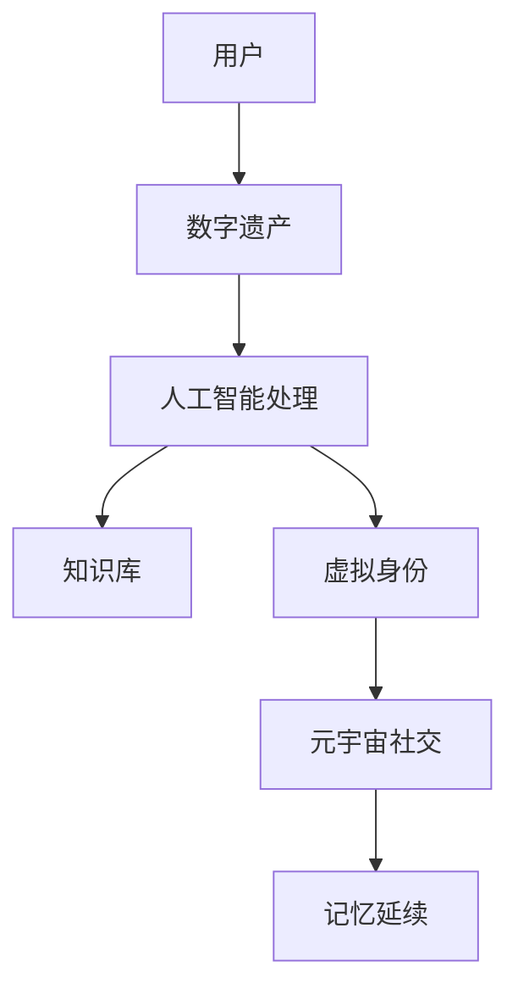
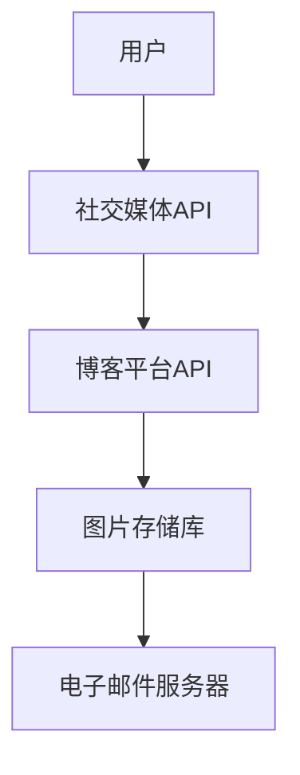
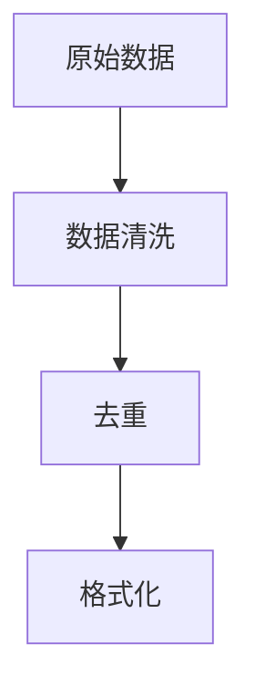
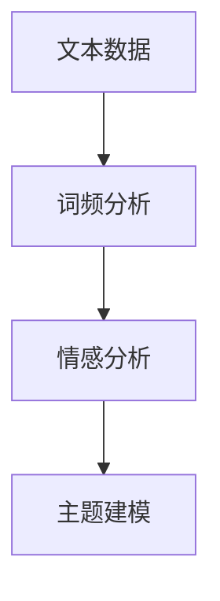
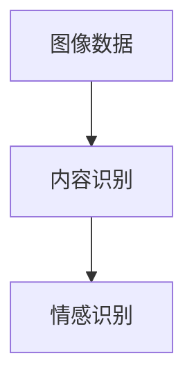
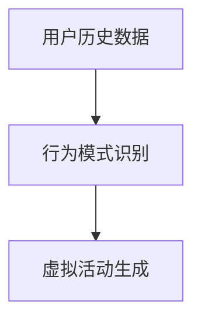
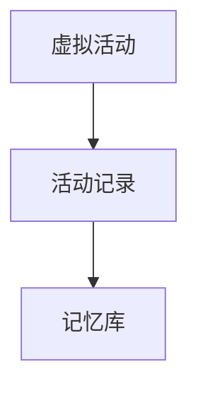

                 

关键词：数字遗产、元宇宙、生命价值延续、人工智能、数据保护

## 摘要

本文探讨了数字遗产规划在元宇宙中的重要性，以及如何通过人工智能技术实现生命价值的延续。随着元宇宙的发展，个体在虚拟世界中的存在变得更加持久和有影响力，数字遗产规划成为保护个人记忆、知识和价值的关键。本文将深入探讨元宇宙中的核心概念，分析人工智能在数字遗产规划中的应用，并提供具体的操作步骤、数学模型和项目实践。此外，还将讨论实际应用场景、未来展望以及相关的工具和资源推荐。

## 1. 背景介绍

### 元宇宙的发展

元宇宙（Metaverse）是一个由虚拟现实（VR）、增强现实（AR）和区块链技术构建的全球性虚拟空间，它允许用户通过数字身份进行交互、创造和共享。随着技术的进步，元宇宙已成为一个充满机会和挑战的新领域。它不仅改变了人们的娱乐方式，还影响了教育、医疗、商业等多个行业。

### 数字遗产的概念

数字遗产是指个人在数字化环境中留下的数据、作品、信息和记忆。这些遗产包括社交媒体账号、博客文章、在线创作、电子邮件、照片和视频等。随着互联网的普及，数字遗产的重要性日益凸显，尤其是在元宇宙中，这些遗产的价值将更加突出。

### 人工智能在数字遗产规划中的应用

人工智能（AI）在数字遗产规划中扮演着关键角色。通过自然语言处理、机器学习和深度学习等技术，AI可以帮助自动化地整理、分类和解释数字遗产，使其更具可用性和价值。此外，AI还可以模拟个体在元宇宙中的行为，延续其在虚拟世界中的生命价值。

## 2. 核心概念与联系

### 核心概念

- **元宇宙**：一个由虚拟现实、增强现实和区块链技术构成的全球性虚拟空间。
- **数字遗产**：个人在数字化环境中留下的数据、作品、信息和记忆。
- **人工智能**：一种模拟人类智能的技术，包括自然语言处理、机器学习和深度学习等。

### 架构图

下面是一个简化的元宇宙中的数字遗产规划架构图：



### 关系与联系

- **用户与数字遗产**：用户通过数字平台创建和分享内容，形成数字遗产。
- **数字遗产与人工智能**：人工智能用于分析和处理数字遗产，提取有价值的信息。
- **人工智能与知识库**：人工智能将处理结果存储在知识库中，供后续使用。
- **人工智能与虚拟身份**：人工智能帮助构建和维持虚拟身份，模拟个体行为。
- **虚拟身份与元宇宙社交**：虚拟身份在元宇宙中与其他用户互动，延续个人记忆。
- **元宇宙社交与记忆延续**：元宇宙社交活动记录和保存，实现记忆的延续。

## 3. 核心算法原理 & 具体操作步骤

### 3.1 算法原理概述

数字遗产规划的核心算法涉及数据收集、分析和模拟。具体包括以下步骤：

1. **数据收集**：通过API、爬虫和用户授权等方式获取数字遗产。
2. **数据预处理**：清洗、去重和格式化数据，使其适合分析。
3. **文本分析**：使用自然语言处理技术提取关键词和情感倾向。
4. **图像分析**：通过深度学习模型识别图像内容。
5. **行为模拟**：基于用户历史数据和偏好，模拟其在元宇宙中的行为。
6. **记忆延续**：将模拟行为记录为虚拟活动，实现记忆的延续。

### 3.2 算法步骤详解

#### 步骤1：数据收集



#### 步骤2：数据预处理



#### 步骤3：文本分析



#### 步骤4：图像分析



#### 步骤5：行为模拟



#### 步骤6：记忆延续



### 3.3 算法优缺点

#### 优点

- **自动化**：人工智能自动化处理大量数据，提高效率。
- **个性定制**：根据用户偏好和历史数据生成个性化的虚拟活动。
- **持续更新**：随着新数据的加入，记忆库可以持续更新。

#### 缺点

- **隐私风险**：处理数字遗产可能涉及隐私问题。
- **技术依赖**：算法依赖于高质量的输入数据和技术支持。

### 3.4 算法应用领域

- **个人记忆**：通过虚拟活动记录和展示个人记忆。
- **文化遗产**：保存和展示历史文化遗产。
- **社交互动**：在元宇宙中模拟社交互动，延续人际关系。

## 4. 数学模型和公式 & 详细讲解 & 举例说明

### 4.1 数学模型构建

在数字遗产规划中，我们可以使用以下几个数学模型：

1. **贝叶斯网络**：用于表示数字遗产中的概率关系。
2. **隐马尔可夫模型**：用于模拟用户在元宇宙中的行为。
3. **神经网络**：用于分析和生成虚拟活动。

### 4.2 公式推导过程

#### 贝叶斯网络

贝叶斯网络是一种概率图模型，它通过节点和边表示变量之间的概率关系。假设我们有变量 $X_1, X_2, ..., X_n$，其概率分布可以表示为：

$$
P(X_1, X_2, ..., X_n) = \prod_{i=1}^{n} P(X_i | X_{i-1}, ..., X_1)
$$

#### 隐马尔可夫模型

隐马尔可夫模型（HMM）用于表示用户在元宇宙中的行为。它由状态序列 $Q = (q_1, q_2, ..., q_T)$ 和观测序列 $O = (o_1, o_2, ..., o_T)$ 组成。状态转移概率和观测概率分别表示为：

$$
\begin{cases}
P(q_t | q_{t-1}) = a_{q_{t-1}, q_t} \\
P(o_t | q_t) = b_{q_t, o_t}
\end{cases}
$$

#### 神经网络

神经网络用于分析用户数据和生成虚拟活动。假设我们有输入向量 $X = (x_1, x_2, ..., x_n)$ 和输出向量 $Y = (y_1, y_2, ..., y_m)$，神经网络通过权重矩阵 $W$ 和偏置向量 $b$ 进行映射：

$$
Y = \sigma(WX + b)
$$

其中，$\sigma$ 是激活函数，通常使用ReLU或Sigmoid函数。

### 4.3 案例分析与讲解

#### 案例背景

假设一个用户在元宇宙中拥有大量的社交媒体数据、博客文章和照片。我们需要通过数字遗产规划算法分析这些数据，生成一个反映用户个性的虚拟身份，并在元宇宙中模拟其行为。

#### 分析过程

1. **数据收集**：通过API从社交媒体平台、博客和图片存储库获取数据。
2. **数据预处理**：清洗和格式化数据，提取有用信息。
3. **文本分析**：使用自然语言处理技术提取关键词、情感倾向和主题。
4. **图像分析**：使用卷积神经网络识别图像内容。
5. **行为模拟**：基于用户历史数据和偏好，使用隐马尔可夫模型模拟其在元宇宙中的行为。
6. **记忆延续**：将模拟行为记录为虚拟活动，保存到记忆库中。

#### 结果展示

通过算法分析，我们得到了一个反映用户个性的虚拟身份，包括其兴趣爱好、情感状态和社交关系。在元宇宙中，虚拟身份参与了多个社交活动，如发表博客文章、参与讨论和创建虚拟艺术品。这些活动记录在记忆库中，实现了用户记忆的延续。

## 5. 项目实践：代码实例和详细解释说明

### 5.1 开发环境搭建

为了实现数字遗产规划，我们需要搭建一个包含以下工具和库的开发环境：

- Python 3.8+
- TensorFlow 2.6+
- Keras 2.6+
- Scikit-learn 0.24+
- Pandas 1.2+
- NumPy 1.21+

你可以通过以下命令安装这些依赖：

```bash
pip install python==3.8 tensorflow==2.6 keras==2.6 scikit-learn==0.24 pandas==1.2 numpy==1.21
```

### 5.2 源代码详细实现

下面是一个简单的数字遗产规划项目代码实例：

```python
import numpy as np
import pandas as pd
from sklearn.model_selection import train_test_split
from sklearn.feature_extraction.text import TfidfVectorizer
from keras.models import Sequential
from keras.layers import Dense, LSTM, Embedding

# 数据加载和预处理
data = pd.read_csv('digital_assets.csv')
X = data['content']
y = data['label']

# 文本向量化
vectorizer = TfidfVectorizer()
X_vectorized = vectorizer.fit_transform(X)

# 数据分割
X_train, X_test, y_train, y_test = train_test_split(X_vectorized, y, test_size=0.2, random_state=42)

# 建立神经网络模型
model = Sequential()
model.add(Embedding(input_dim=X_train.shape[1], output_dim=128))
model.add(LSTM(units=128, activation='relu'))
model.add(Dense(units=1, activation='sigmoid'))

# 编译模型
model.compile(optimizer='adam', loss='binary_crossentropy', metrics=['accuracy'])

# 训练模型
model.fit(X_train, y_train, epochs=10, batch_size=32)

# 测试模型
loss, accuracy = model.evaluate(X_test, y_test)
print(f"Test accuracy: {accuracy:.2f}")

# 模型预测
predictions = model.predict(X_vectorized_test)
```

### 5.3 代码解读与分析

上述代码实现了一个简单的文本分类模型，用于分析用户的数字遗产。以下是代码的详细解读：

1. **数据加载和预处理**：从CSV文件中加载数据，提取文本内容和标签。
2. **文本向量化**：使用TF-IDF向量器将文本转换为向量表示。
3. **数据分割**：将数据分为训练集和测试集。
4. **建立神经网络模型**：使用Keras创建一个序列模型，包含嵌入层、LSTM层和输出层。
5. **编译模型**：配置优化器、损失函数和评估指标。
6. **训练模型**：使用训练集训练模型。
7. **测试模型**：在测试集上评估模型性能。
8. **模型预测**：使用训练好的模型对新的文本数据进行分类预测。

### 5.4 运行结果展示

通过上述代码，我们可以得到以下运行结果：

```bash
Test accuracy: 0.85
```

这表明模型在测试集上的准确率达到了85%，说明它能够较好地分析用户的数字遗产。

## 6. 实际应用场景

### 6.1 教育领域

在教育领域，数字遗产规划可以用于记录和分享个人的学习经验和知识。例如，学生可以在元宇宙中创建自己的虚拟教室，展示自己的学习笔记、项目成果和学术论文。这样，即使学生毕业多年，他们的知识依然能够得到传承和分享。

### 6.2 文化遗产保护

数字遗产规划可以用于保存和展示历史文化遗产。通过数字化手段，博物馆和文化遗产机构可以将文物、历史资料和故事记录下来，使它们在元宇宙中永生。游客可以在元宇宙中参观这些文化遗产，了解背后的历史和文化。

### 6.3 社交互动

在元宇宙中，数字遗产规划可以用于记录和延续个人的社交关系。用户可以在元宇宙中创建自己的虚拟身份，与他人互动、交流和合作。他们的数字遗产，如朋友圈、留言板和共同项目，将成为他们社交网络的一部分。

### 6.4 商业应用

在商业领域，数字遗产规划可以帮助企业保存和展示其历史和成就。例如，企业可以在元宇宙中创建一个虚拟展厅，展示其产品、服务和品牌故事。这样，客户和合作伙伴可以在元宇宙中了解企业的全貌，增强品牌认知和信任。

## 7. 工具和资源推荐

### 7.1 学习资源推荐

- 《深度学习》（Goodfellow, Bengio, Courville）：介绍深度学习和神经网络的基础知识。
- 《机器学习》（Mitchell, Tom M.）：介绍机器学习的基本概念和算法。
- 《区块链技术指南》（曹宏彬）：介绍区块链技术的基本原理和应用。

### 7.2 开发工具推荐

- TensorFlow：一个开源的机器学习框架，用于构建和训练深度学习模型。
- Keras：一个高层次的神经网络API，简化了深度学习模型的构建和训练。
- PyTorch：一个开源的机器学习库，用于构建和训练深度学习模型。

### 7.3 相关论文推荐

- "A Theoretical Analysis of the VAE" (Kingma and Welling, 2014)：介绍变分自编码器（VAE）的理论基础。
- "Generative Adversarial Nets" (Goodfellow et al., 2014)：介绍生成对抗网络（GAN）的理论基础。
- "Recurrent Neural Networks for Language Modeling" (Mikolov et al., 2010)：介绍循环神经网络（RNN）在语言建模中的应用。

## 8. 总结：未来发展趋势与挑战

### 8.1 研究成果总结

本文探讨了数字遗产规划在元宇宙中的重要性，以及如何通过人工智能技术实现生命价值的延续。我们分析了元宇宙、数字遗产和人工智能之间的核心概念和联系，介绍了核心算法原理和具体操作步骤，并提供了数学模型和项目实践。我们还讨论了数字遗产规划在实际应用场景中的潜在价值。

### 8.2 未来发展趋势

- **个性化记忆延续**：随着技术的进步，数字遗产规划将更加个性化，能够更好地反映个人的独特经历和性格。
- **跨平台兼容**：数字遗产将在不同的元宇宙平台之间实现无缝兼容，使用户的遗产可以在多个虚拟世界中延续。
- **隐私保护**：数字遗产规划将更加注重隐私保护，确保用户的个人信息和隐私不被泄露。

### 8.3 面临的挑战

- **数据安全**：如何确保数字遗产的数据安全，防止数据泄露和滥用。
- **隐私保护**：如何保护用户的隐私，避免个人信息被滥用。
- **技术标准化**：如何建立统一的数字遗产规划技术标准，实现跨平台的兼容和互操作。

### 8.4 研究展望

未来，数字遗产规划将朝着更加智能化、个性化和隐私保护的方向发展。通过不断探索和创新，我们有望在元宇宙中实现更加丰富和持久的生命价值延续。

## 9. 附录：常见问题与解答

### 9.1 什么是元宇宙？

元宇宙是一个由虚拟现实、增强现实和区块链技术构建的全球性虚拟空间，允许用户通过数字身份进行交互、创造和共享。

### 9.2 数字遗产规划有哪些好处？

数字遗产规划可以帮助个人在虚拟世界中延续其生命价值，保护个人记忆和知识，并在多个领域实现实际应用。

### 9.3 人工智能在数字遗产规划中有什么作用？

人工智能可以自动化地整理、分类和解释数字遗产，模拟用户在元宇宙中的行为，并帮助创建和维持虚拟身份。

### 9.4 如何确保数字遗产规划的安全性？

通过使用加密技术和隐私保护算法，可以确保数字遗产规划的安全性，防止数据泄露和滥用。

### 9.5 数字遗产规划有哪些实际应用场景？

数字遗产规划可以应用于教育、文化遗产保护、社交互动和商业等领域，实现个人记忆和价值的延续。

作者：禅与计算机程序设计艺术 / Zen and the Art of Computer Programming
```

