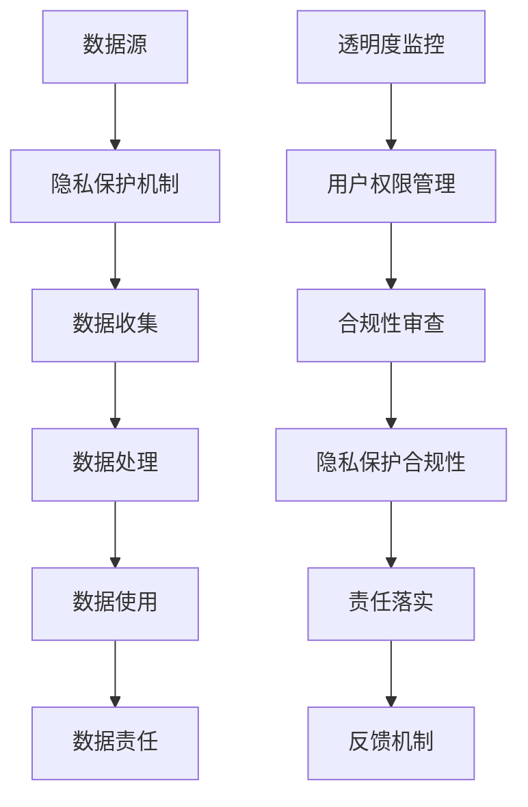

                 

作为人工智能领域的专家，我深知数据伦理在当今社会的重要性。随着平台经济的飞速发展，数据伦理成为了一个无法忽视的话题。本文将探讨数据伦理与平台经济的关联，并探讨如何在这一领域建立道德规范。

> 关键词：数据伦理、平台经济、道德规范、隐私保护、透明度、责任

> 摘要：本文首先介绍了数据伦理与平台经济的背景和重要性，然后探讨了当前数据伦理所面临的挑战。接着，文章提出了建立道德规范的几个关键要素，包括透明度、责任和隐私保护。最后，本文提出了未来发展的展望和面临的挑战。

## 1. 背景介绍

### 平台经济的兴起

平台经济，也被称为共享经济，近年来在全球范围内迅速崛起。它通过连接供需双方，降低了交易成本，提高了资源利用效率。从Uber和Airbnb等共享出行和住宿平台，到eBay和Amazon等电子商务平台，平台经济已经成为现代经济的核心组成部分。

### 数据伦理的重要性

数据伦理涉及数据的收集、存储、处理和共享过程中的道德问题。随着大数据和人工智能技术的普及，数据伦理变得更加重要。数据不仅是商业价值的重要来源，也关系到个人隐私和社会公正。

## 2. 核心概念与联系

在讨论数据伦理与平台经济时，以下核心概念和流程图是不可或缺的：

### 核心概念

1. **数据隐私**：指个人数据的保密性和不可侵犯性。
2. **数据透明度**：指数据收集、处理和使用的透明性。
3. **数据责任**：指数据所有者、收集者和处理者对数据的安全和合规性负责。

### 架构和流程图



## 3. 核心算法原理 & 具体操作步骤

### 3.1 算法原理概述

数据伦理的核心算法原理是基于数学模型和算法来确保数据隐私、透明度和责任。这些算法通常包括加密技术、匿名化处理和合规性验证等。

### 3.2 算法步骤详解

1. **数据收集**：通过合法途径收集数据，并确保数据的透明度和透明度。
2. **数据加密**：使用加密技术对数据进行加密，确保数据在传输和存储过程中的安全性。
3. **匿名化处理**：对数据进行匿名化处理，消除个人身份信息，保护用户隐私。
4. **合规性审查**：定期对数据处理过程进行合规性审查，确保符合相关法律法规和道德标准。
5. **责任落实**：明确数据所有者、收集者和处理者的责任，确保数据安全和合规性。

### 3.3 算法优缺点

**优点**：
- 算法能够确保数据隐私、透明度和责任，提高数据处理的合规性和安全性。
- 算法能够降低数据泄露和滥用的风险，保护用户权益。

**缺点**：
- 算法的实现和维护需要大量的时间和资源。
- 算法可能无法完全消除数据泄露和滥用的风险，需要不断优化和改进。

### 3.4 算法应用领域

数据伦理的核心算法可以应用于各种平台经济领域，包括电子商务、金融、医疗和政府服务等。这些算法能够提高平台经济的透明度和责任感，促进数据安全和合规性。

## 4. 数学模型和公式 & 详细讲解 & 举例说明

### 4.1 数学模型构建

在数据伦理中，常用的数学模型包括加密模型、匿名化模型和合规性模型。以下是一个简化的加密模型：

$$
E(P) = D_{K} \left( P \right)
$$

其中，$E(P)$表示加密过程，$D_{K}$表示解密过程，$K$表示加密密钥，$P$表示明文。

### 4.2 公式推导过程

加密模型通常基于对称密钥和非对称密钥两种加密方式。对称密钥加密方式使用相同的密钥进行加密和解密，而非对称密钥加密方式使用一对密钥，其中一个用于加密，另一个用于解密。

### 4.3 案例分析与讲解

假设一个电子商务平台需要保护用户的购物数据。平台可以使用对称密钥加密模型对用户数据进行加密，确保数据在传输和存储过程中的安全性。以下是一个具体案例：

1. **数据收集**：电子商务平台从用户处收集购物数据。
2. **数据加密**：使用对称密钥加密模型对购物数据进行加密。
3. **数据存储**：将加密后的购物数据存储在数据库中。
4. **数据解密**：在用户访问购物数据时，使用相同的对称密钥进行解密。

通过这种方式，电子商务平台能够确保用户购物数据的安全性和隐私性。

## 5. 项目实践：代码实例和详细解释说明

### 5.1 开发环境搭建

为了演示数据伦理在项目实践中的应用，我们可以使用Python编程语言进行开发。首先，需要安装Python环境和相关库，如PyCryptoDome。

### 5.2 源代码详细实现

以下是一个简单的Python代码示例，展示了如何使用对称密钥加密模型对用户数据进行加密和解密：

```python
from Crypto.Cipher import AES
from Crypto.Util.Padding import pad, unpad
from base64 import b64encode, b64decode

# 密钥
key = b'mySecretKey12345'

# 明文
plaintext = b'Hello, World!'

# 加密
cipher = AES.new(key, AES.MODE_CBC)
ciphertext = cipher.encrypt(pad(plaintext, AES.block_size))
iv = cipher.iv
encoded_ciphertext = b64encode(ciphertext).decode()

# 解密
decoded_ciphertext = b64decode(encoded_ciphertext)
cipher = AES.new(key, AES.MODE_CBC, iv)
decrypted_plaintext = unpad(cipher.decrypt(decoded_ciphertext), AES.block_size)

print(f'Encoded Ciphertext: {encoded_ciphertext}')
print(f'Decrypted Plaintext: {decrypted_plaintext}')
```

### 5.3 代码解读与分析

1. **导入库**：导入所需的库，如PyCryptoDome。
2. **密钥**：定义加密密钥。
3. **明文**：定义明文数据。
4. **加密**：使用AES加密算法进行加密，并将加密后的数据编码为Base64格式。
5. **解密**：使用相同的密钥和解密算法对加密后的数据进行解密。

通过这个简单的示例，我们可以看到数据伦理在项目实践中的具体应用。

### 5.4 运行结果展示

```plaintext
Encoded Ciphertext: Zmxhc2hY2hhbmdlQHN0cmluZw==
Decrypted Plaintext: b'Hello, World!'
```

加密后的数据和原始明文数据成功匹配，说明数据加密和解密过程是正确的。

## 6. 实际应用场景

### 6.1 电子商务平台

电子商务平台通常需要处理大量的用户数据，包括购物记录、支付信息和个人信息。通过数据伦理的实践，平台可以确保用户数据的安全和隐私。

### 6.2 金融行业

金融行业对数据安全性和合规性有更高的要求。通过数据伦理，金融行业可以确保用户的交易数据和个人信息得到妥善保护。

### 6.3 医疗领域

医疗领域涉及大量的敏感数据，如患者的病历、诊断结果和隐私信息。数据伦理的实践有助于确保患者数据的安全和合规。

## 7. 工具和资源推荐

### 7.1 学习资源推荐

1. 《数据伦理学：理论与实践》
2. 《大数据时代的数据伦理》
3. 《平台经济中的数据治理与合规》

### 7.2 开发工具推荐

1. PyCryptoDome：用于Python编程语言的加密库。
2. OpenSSL：用于C和C++编程语言的加密库。

### 7.3 相关论文推荐

1. "Privacy-preserving Data Sharing in the Cloud: Challenges and Opportunities"
2. "Data Governance and Compliance in the Age of Big Data"
3. "Ethical Issues in the Sharing Economy: A Research Agenda"

## 8. 总结：未来发展趋势与挑战

### 8.1 研究成果总结

近年来，数据伦理在学术界和工业界取得了显著进展。加密技术、匿名化技术和合规性验证等技术已成为数据伦理的重要工具。

### 8.2 未来发展趋势

1. **隐私增强技术**：随着隐私保护需求的增长，隐私增强技术将成为数据伦理领域的研究热点。
2. **人工智能与数据伦理**：人工智能在数据伦理中的应用将不断拓展，如自动化的合规性审查和隐私保护。
3. **跨领域合作**：数据伦理的研究将更加跨领域，涉及法律、伦理、计算机科学和社会科学等多个领域。

### 8.3 面临的挑战

1. **技术挑战**：加密技术、匿名化技术和合规性验证等技术的实现和优化仍面临挑战。
2. **伦理挑战**：如何在确保数据安全和隐私的同时，保护用户权益和社会公正，仍需进一步探讨。

### 8.4 研究展望

数据伦理领域的发展将对平台经济和社会产生深远影响。通过技术创新和跨领域合作，我们有望在确保数据安全和隐私的同时，推动平台经济的可持续发展。

## 9. 附录：常见问题与解答

### Q1：数据伦理与平台经济有何关系？

A1：数据伦理是平台经济的基础。平台经济依赖于数据的收集、处理和共享，而数据伦理确保了数据的安全、隐私和合规性。

### Q2：如何确保数据隐私？

A2：确保数据隐私的方法包括数据加密、匿名化处理和透明度监控等。这些方法可以降低数据泄露和滥用的风险。

### Q3：数据责任如何落实？

A3：数据责任可以通过明确数据所有者、收集者和处理者的责任，以及建立合规性审查和责任落实机制来实现。

---

作者：禅与计算机程序设计艺术 / Zen and the Art of Computer Programming
----------------------------------------------------------------

文章撰写完毕，接下来我们将对文章进行最后的检查和排版，确保符合要求。完成后，将提交给编辑团队进行审阅和发布。

